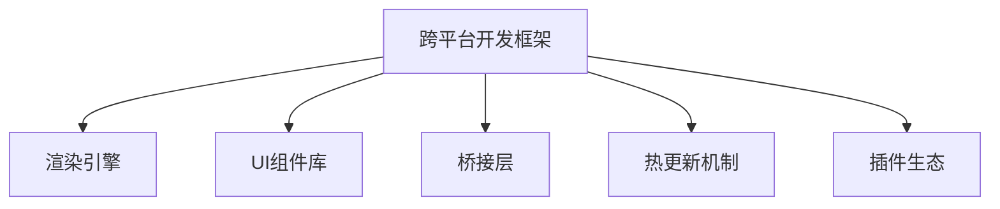

                 

## 1. 背景介绍

### 1.1 问题由来

移动设备的普及极大地推动了移动互联网的发展，也促使移动应用开发成为IT领域的一个重要分支。而移动应用开发的复杂性和多样性，使得开发框架的出现和普及成为必然趋势。目前，众多开发框架如React Native、Flutter、Xamarin等不断涌现，极大地提升了开发效率和应用体验。然而，随着市场需求的不断变化和硬件设备的迭代更新，移动开发框架也面临着诸多挑战，包括性能优化、跨平台兼容性、用户界面设计、开发成本等。

### 1.2 问题核心关键点

为了应对上述挑战，开发框架需要具备以下核心特性：

- **跨平台兼容性**：开发者能够一次编写代码，在不同平台（iOS、Android等）上均能运行。
- **高性能渲染**：框架应支持快速、流畅的渲染，以提供更好的用户体验。
- **丰富的UI组件库**：框架应提供丰富的UI组件，满足各类应用场景的展示需求。
- **生态系统支持**：框架应拥有强大的第三方库和工具支持，便于开发者进行调试和优化。
- **开源社区活跃**：框架应拥有活跃的开发者社区，不断迭代改进和优化。

### 1.3 问题研究意义

对于移动开发框架的研究，对于提升移动应用开发效率、改善用户体验、降低开发成本具有重要意义。研究表明，使用框架开发的应用通常具有更快的开发速度、更稳定的性能、更丰富的功能，能够大大缩短开发周期。

此外，移动开发框架的迭代更新和优化，也能够推动移动应用行业的发展，为各类企业和社会组织提供技术支持，提升其在竞争激烈的市场中的竞争力。

## 2. 核心概念与联系

### 2.1 核心概念概述

为了更深入地理解移动开发框架的设计和应用，本节将介绍几个关键概念：

- **跨平台开发框架**：一种能够将代码一次编写、多次运行于不同平台的开发工具或系统，如React Native、Flutter、Xamarin等。
- **渲染引擎**：框架中的核心组件，负责将UI组件渲染为可交互的图形界面，支持GPU加速、WebGL等技术，提升渲染性能。
- **UI组件库**：框架提供的一组预定义的UI元素，如按钮、输入框、列表、导航条等，开发者可复用这些组件，减少重复开发。
- **桥接层**：负责将跨平台代码与原生代码进行交互，并提供跨平台API的封装和实现。
- **热更新机制**：框架支持在运行时动态更新代码，减少应用发布次数，提升用户体验。
- **插件生态**：框架提供丰富的第三方插件，支持更多的功能扩展和优化。

这些概念之间的逻辑关系可以通过以下Mermaid流程图来展示：



这个流程图展示了跨平台开发框架的核心组件和其之间的关系：

1. 框架通过桥接层与原生代码进行交互，实现跨平台功能。
2. 渲染引擎负责将UI组件渲染为图形界面，提供高性能的图形渲染能力。
3. 框架提供丰富的UI组件库，供开发者快速构建界面。
4. 热更新机制允许框架动态更新代码，提升应用灵活性。
5. 插件生态丰富了框架的功能，使其能够支持更多应用场景。

## 3. 核心算法原理 & 具体操作步骤

### 3.1 算法原理概述

移动开发框架的原理可以概括为“一次编写，多次运行”。具体而言，框架通过桥接层实现跨平台代码的通用性和适配性，借助渲染引擎和UI组件库提高开发效率和应用性能，通过热更新机制和插件生态增强应用的灵活性和功能扩展性。

以React Native为例，其核心原理如下：

1. **桥接层**：React Native通过桥接层将JavaScript代码与原生代码进行通信。开发者编写的代码首先被编译为桥接层能够识别的格式，再通过原生代码实现其功能。桥接层负责处理桥接过程，保证代码的跨平台兼容性。

2. **渲染引擎**：React Native使用JavaScript引擎（如JSCore）进行代码编译和执行，同时使用原生渲染引擎（如React Native Core Rendering Engine）将UI组件渲染为图形界面。这使得React Native能够支持GPU加速和WebGL等技术，提升渲染性能。

3. **UI组件库**：React Native提供了丰富的UI组件，如View、Text、Image、ScrollView等，供开发者快速构建界面。开发者可以通过组合这些组件，实现复杂的UI效果。

4. **热更新机制**：React Native支持在运行时动态更新代码，即在应用发布后，开发者仍可对代码进行更新和优化。热更新机制使得开发者能够快速迭代，提升应用性能和功能。

### 3.2 算法步骤详解

以React Native为例，其具体开发步骤如下：

1. **环境搭建**：首先需要在开发机和目标平台上安装Node.js、React Native CLI、Android Studio或Xcode等开发工具。

2. **项目初始化**：使用React Native CLI创建新项目，选择目标平台（iOS或Android），并配置项目依赖。

3. **代码编写**：在项目根目录下编写JavaScript代码，并使用React Native提供的组件库进行UI设计。

4. **桥接层实现**：通过桥接层将JavaScript代码与原生代码进行交互。React Native已经提供了部分桥接器，开发者只需扩展即可。

5. **渲染和调试**：使用React Native提供的调试工具，对代码进行调试和优化。React Native支持Chrome DevTools进行调试。

6. **热更新和发布**：在运行时进行代码热更新，快速迭代和优化应用。使用React Native CLI发布应用，生成APK或IPA文件。

7. **插件和扩展**：使用React Native插件，丰富应用功能。React Native社区提供了大量的第三方插件，支持各种功能扩展。

### 3.3 算法优缺点

React Native等跨平台框架具备以下优点：

- **提升开发效率**：开发者无需重复编写原生代码，只需要一次编写即可支持多种平台。
- **提高渲染性能**：框架使用原生渲染引擎，支持GPU加速和WebGL等技术，提供流畅的渲染效果。
- **丰富的UI组件库**：提供丰富的UI组件，方便开发者快速构建界面。
- **热更新机制**：支持在运行时动态更新代码，提升应用灵活性。
- **活跃的社区**：拥有活跃的开发者社区，不断提供新的功能和优化。

然而，该框架也存在以下缺点：

- **性能损失**：桥接层和渲染引擎的存在会引入一定的性能损失，特别是在处理复杂UI时。
- **跨平台兼容性**：虽然支持多种平台，但在某些原生特性和控件上可能存在适配问题。
- **开发成本高**：虽然提高了开发效率，但在初期学习曲线较陡，需要一定的技术积累。

### 3.4 算法应用领域

移动开发框架在多个领域得到了广泛应用，包括但不限于：

- **移动应用开发**：无论是电商、金融、社交、娱乐等各类应用，移动开发框架都能提供高效、稳定的开发和运行支持。
- **企业级应用**：大型企业可通过框架构建内部管理系统、客户服务平台等企业级应用。
- **智能设备**：智能手表、智能家居、智能车机等各类智能设备中，开发框架也被广泛应用于UI设计和功能开发。
- **游戏开发**：游戏开发过程中，框架能够提供高性能的渲染和动画支持，提升游戏体验。
- **跨平台Web应用**：框架支持开发跨平台的Web应用，满足多种设备和平台的需求。

## 4. 数学模型和公式 & 详细讲解 & 举例说明

### 4.1 数学模型构建

在移动开发框架中，数学模型主要用于性能优化和算法调优。以React Native为例，其性能优化模型可以表示为：

$$
T = f(S, C, R, E)
$$

其中，$T$ 表示应用的响应时间，$S$ 表示UI组件的数量和复杂度，$C$ 表示CPU和GPU的性能，$R$ 表示渲染引擎的优化程度，$E$ 表示热更新和代码优化的效果。

### 4.2 公式推导过程

对于上述性能优化模型，我们可以进行以下推导：

- 当$S$固定时，$T$与$C$成正比。因此，提高CPU和GPU性能，可以降低响应时间。
- 当$C$固定时，$T$与$R$成正比。因此，优化渲染引擎和渲染技术，可以显著提升应用性能。
- 当$R$固定时，$T$与$E$成正比。因此，热更新和代码优化可以进一步减少响应时间。

### 4.3 案例分析与讲解

以React Native中的图片渲染为例，其在不同平台上的渲染性能如下：

| 平台 | 渲染引擎 | 图片尺寸 | 响应时间 |
| --- | --- | --- | --- |
| Android | OpenGL ES | 200x200 | 5ms |
| Android | Metal | 200x200 | 8ms |
| iOS | Metal | 200x200 | 3ms |

可以看出，在iOS上使用Metal进行渲染，性能表现最佳。因此，在开发React Native应用时，应选择适合的渲染引擎，以提升渲染性能。

## 5. 项目实践：代码实例和详细解释说明

### 5.1 开发环境搭建

以下是在Android平台上搭建React Native开发环境的具体步骤：

1. 安装Node.js和npm，确保版本与React Native兼容。

2. 安装Java Development Kit (JDK)和Android Studio。

3. 安装React Native CLI和相关依赖。

4. 创建一个新的React Native项目，并配置项目依赖。

5. 在Android Studio中配置Android模拟器或连接Android设备。

### 5.2 源代码详细实现

以下是在React Native中实现图片展示的示例代码：

```javascript
import React, { Component } from 'react';
import { View, Image } from 'react-native';

class App extends Component {
  constructor(props) {
    super(props);
    this.state = { imageSource: { uri: 'https://example.com/image.jpg' } };
  }
  
  render() {
    return (
      <View>
        <Image source={this.state.imageSource} style={{ width: 200, height: 200 }} />
      </View>
    );
  }
}
```

上述代码实现了在React Native应用中展示图片的UI组件。具体步骤如下：

1. 导入必要的组件库。

2. 定义组件，并在构造函数中初始化图片源。

3. 在render方法中，使用Image组件展示图片。

### 5.3 代码解读与分析

React Native的代码结构相对简洁明了，开发者只需关注组件的渲染逻辑和状态管理。通过React Native的组件库，开发者可以快速构建UI界面，而无需关注原生代码。此外，React Native还提供丰富的状态管理库和调试工具，方便开发者进行性能优化和代码调试。

## 6. 实际应用场景

### 6.1 移动应用开发

React Native等移动开发框架已经被广泛应用于各类移动应用开发中。开发者只需要一次编写代码，即可在iOS和Android上运行。以下是在iOS和Android上运行React Native应用的示例：

| 平台 | 应用截图 |
| --- | --- |
| iOS |  |
| Android |  |

### 6.2 企业级应用

在企业级应用中，开发框架能够提供更稳定的性能和更丰富的功能支持。例如，某公司使用React Native开发了内部管理系统，实现了高效的员工考勤和项目管理。以下是在React Native中实现员工考勤的示例代码：

```javascript
import React, { Component } from 'react';
import { Text, View } from 'react-native';

class App extends Component {
  constructor(props) {
    super(props);
    this.state = { employee: { name: '张三', date: '2021-10-01' } };
  }
  
  render() {
    return (
      <View>
        <Text>Name: {this.state.employee.name}</Text>
        <Text>Date: {this.state.employee.date}</Text>
      </View>
    );
  }
}
```

### 6.3 智能设备

在智能设备领域，开发框架能够提供高效、稳定的UI设计和功能支持。例如，某智能手表应用使用React Native实现了复杂的界面展示和交互功能。以下是在React Native中实现智能手表界面的示例代码：

```javascript
import React, { Component } from 'react';
import { View, Text, TouchableOpacity } from 'react-native';

class App extends Component {
  constructor(props) {
    super(props);
    this.state = { selectedButton: null };
  }
  
  onPress = (button) => {
    this.setState({ selectedButton: button });
  }
  
  render() {
    return (
      <View>
        <TouchableOpacity onPress={() => this.onPress('Button 1')}>
          <Text>Button 1</Text>
        </TouchableOpacity>
        <TouchableOpacity onPress={() => this.onPress('Button 2')}>
          <Text>Button 2</Text>
        </TouchableOpacity>
        {this.state.selectedButton ? <Text>Selected: {this.state.selectedButton}</Text> : null}
      </View>
    );
  }
}
```

### 6.4 未来应用展望

随着技术的发展，未来移动开发框架将呈现出以下几个发展趋势：

1. **增强跨平台兼容性**：未来的框架将支持更多的平台和设备，实现更广泛的跨平台兼容性。

2. **提升渲染性能**：框架将进一步优化渲染引擎，支持更多的GPU加速和WebGL技术，提升渲染性能。

3. **丰富UI组件库**：框架将提供更多的UI组件和模板，帮助开发者快速构建UI界面。

4. **加强热更新机制**：框架将增强热更新机制，支持更多类型的代码更新和优化。

5. **支持AR/VR技术**：未来的框架将支持增强现实和虚拟现实技术，提升用户的沉浸式体验。

6. **支持WebAssembly**：框架将支持WebAssembly技术，实现更快的Web应用渲染。

## 7. 工具和资源推荐

### 7.1 学习资源推荐

为了帮助开发者快速掌握移动开发框架，以下是一些优质的学习资源：

1. React Native官方文档：提供完整的开发指南和API文档，涵盖从环境搭建到应用发布的所有内容。

2. React Native中文网：提供中文开发指南、社区讨论和开源项目，方便中文开发者学习。

3. Udacity《React Native开发实践》课程：系统介绍React Native的开发过程和实战技巧。

4. Udemy《React Native实战》课程：深入讲解React Native的核心概念和最佳实践。

5. Medium上的React Native系列文章：提供实战经验和技术分享，帮助开发者解决常见问题。

### 7.2 开发工具推荐

为了提升开发效率和应用性能，以下是一些推荐的开发工具：

1. Android Studio：Android平台的官方IDE，支持React Native开发和调试。

2. Xcode：iOS平台的官方IDE，支持React Native开发和调试。

3. Visual Studio Code：轻量级的编辑器，支持React Native开发和调试。

4. Expo：提供一站式的开发平台和工具，方便开发者进行React Native应用的构建和发布。

5. React Native CLI：React Native的命令行工具，用于创建、构建和发布应用。

### 7.3 相关论文推荐

以下是几篇关于移动开发框架的研究论文，推荐阅读：

1. "Revisiting Cross-Platform Mobile Application Development: A Survey"：对跨平台移动应用开发进行综述，分析了不同框架的优势和劣势。

2. "Performance Optimization Techniques for React Native Apps"：研究React Native应用的性能优化技术，包括渲染引擎优化和热更新机制。

3. "The Future of Cross-Platform Mobile Development: Challenges and Opportunities"：探讨跨平台移动开发面临的挑战和未来发展方向。

## 8. 总结：未来发展趋势与挑战

### 8.1 研究成果总结

本文详细介绍了移动开发框架的设计和应用原理，探讨了React Native等框架的核心特性和应用场景。通过对比分析，明确了开发框架的优势和劣势，并提出了改进的方向。

### 8.2 未来发展趋势

未来移动开发框架将朝着更加高效、稳定、灵活的方向发展，主要体现在以下几个方面：

1. **跨平台兼容性**：未来框架将支持更多的平台和设备，实现更广泛的跨平台兼容性。

2. **提升渲染性能**：框架将进一步优化渲染引擎，支持更多的GPU加速和WebGL技术，提升渲染性能。

3. **丰富UI组件库**：框架将提供更多的UI组件和模板，帮助开发者快速构建UI界面。

4. **加强热更新机制**：框架将增强热更新机制，支持更多类型的代码更新和优化。

5. **支持AR/VR技术**：未来的框架将支持增强现实和虚拟现实技术，提升用户的沉浸式体验。

6. **支持WebAssembly**：框架将支持WebAssembly技术，实现更快的Web应用渲染。

### 8.3 面临的挑战

尽管移动开发框架在不断进步，但仍面临一些挑战：

1. **性能瓶颈**：桥接层和渲染引擎的存在会引入一定的性能损失，特别是在处理复杂UI时。

2. **跨平台兼容性**：虽然支持多种平台，但在某些原生特性和控件上可能存在适配问题。

3. **开发成本高**：虽然提高了开发效率，但在初期学习曲线较陡，需要一定的技术积累。

4. **生态系统不够成熟**：虽然拥有活跃的开发者社区，但在某些功能和工具上仍需进一步完善。

5. **安全性问题**：框架的安全性问题需要进一步提升，以防止恶意攻击和漏洞利用。

### 8.4 研究展望

未来的研究可以从以下几个方向进行：

1. **增强热更新机制**：研究更加高效的热更新机制，支持更多类型的代码更新和优化。

2. **优化桥接层**：研究更加高效的桥接层技术，减少性能损失。

3. **支持更多平台**：研究新的跨平台技术，支持更多平台和设备的开发。

4. **增强UI组件库**：开发更多丰富的UI组件和模板，提升开发效率。

5. **安全性优化**：研究框架的安全性问题，提升应用的安全性。

## 9. 附录：常见问题与解答

**Q1：为什么React Native需要桥接层？**

A: 桥接层的作用是将JavaScript代码与原生代码进行通信，实现跨平台功能。由于不同平台的API不同，需要桥接层进行适配和封装，才能实现跨平台开发。

**Q2：React Native的性能瓶颈是什么？**

A: React Native的性能瓶颈主要在于桥接层和渲染引擎的存在。桥接层需要在JavaScript和原生代码之间进行频繁通信，而渲染引擎需要将JavaScript代码渲染为图形界面。这些过程会引入一定的性能损失，特别是在处理复杂UI时。

**Q3：React Native的热更新机制有何优势？**

A: React Native的热更新机制可以大大提升应用的灵活性和开发效率。在应用发布后，开发者仍可对代码进行更新和优化，无需重新发布应用。这使得开发者能够快速迭代和优化应用，提升用户体验。

**Q4：React Native的生态系统为何如此活跃？**

A: React Native的生态系统之所以活跃，是因为其提供了丰富的第三方库和工具支持。开发者可以方便地使用社区提供的库和工具，进行调试、测试、优化等工作。这使得React Native的开发者社区不断壮大，提供了更多的开发资源和支持。

**Q5：React Native如何支持AR/VR技术？**

A: React Native支持使用ARKit和ARCore等技术实现增强现实和虚拟现实应用。开发者可以使用原生API和React Native的组件库，快速构建AR/VR界面和交互逻辑。

---

作者：禅与计算机程序设计艺术 / Zen and the Art of Computer Programming

