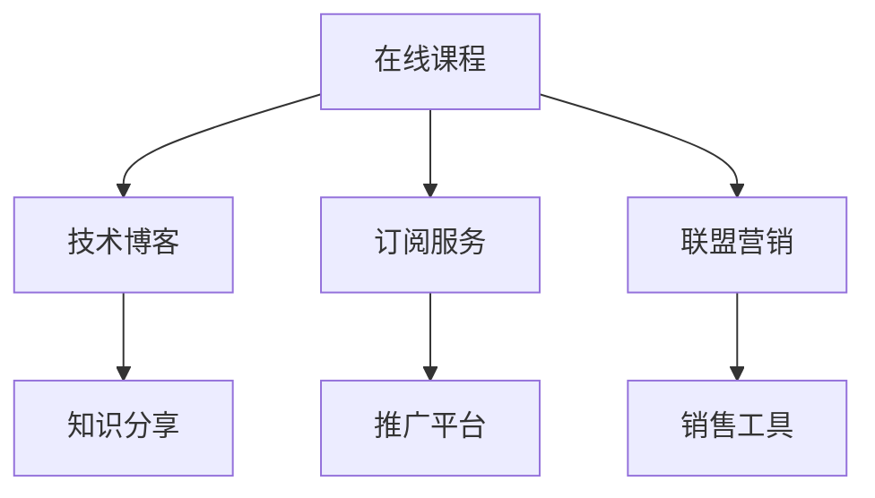

                 

# 程序员利用知识付费实现被动收入的方法

> 关键词：知识付费, 程序员, 被动收入, 技术博客, 在线课程, 订阅服务, 联盟营销, 知识分享

## 1. 背景介绍

### 1.1 问题由来
随着互联网和信息技术的发展，知识付费成为越来越多人获取知识的重要方式。特别是在新冠疫情期间，面对无法返校、无法线下参加培训班的困境，知识付费更是迅速崛起。对于程序员而言，掌握前沿技术、提高自身竞争力，是他们最迫切的需求。然而，现实中程序员的培训和认证费用不菲，即使是具备一定资质的程序员，也往往难以负担高额的培训费用。

为了解决这个问题，知识付费平台应运而生。通过在线课程、技术博客、订阅服务、联盟营销等方式，程序员可以利用自己的技术知识和经验，获取额外的被动收入。这些平台不仅为程序员提供了展示和分享自己的知识和技能的机会，也为学习者提供了一个便捷、高效的学习途径。本文将详细介绍程序员利用知识付费实现被动收入的方法，以及相关的工具和资源推荐，希望能够为有志于从事这一领域的程序员提供一些有价值的指导。

### 1.2 问题核心关键点
知识付费的核心在于如何将知识和技能以有价值的形式呈现给用户，从而获得收入。对于程序员而言，核心的关键词包括：在线课程、技术博客、订阅服务、联盟营销、知识分享等。

这些核心关键词之间的逻辑关系可以通过以下Mermaid流程图来展示：



这个流程图展示了一个程序员通过多种知识付费方式实现被动收入的完整流程：通过创建在线课程、技术博客、订阅服务、联盟营销等平台，向用户提供知识和技能，并通过知识分享、推广平台、销售工具等方式获取收入。这些环节相互关联，共同构成了一个完整的知识付费生态系统。

## 2. 核心概念与联系

### 2.1 核心概念概述

为了更好地理解程序员利用知识付费实现被动收入的方法，本节将介绍几个密切相关的核心概念：

- **在线课程**：通过视频、文本、代码等多种形式，向用户提供系统的知识培训。在线课程通常具有结构化的内容、持续的学习路径，适合有一定知识基础的学习者。

- **技术博客**：程序员将自己的技术经验和心得体会，通过文章的形式分享在博客上。技术博客通常具有较高的专业性和深度，适合有一定自学能力的学习者。

- **订阅服务**：用户可以按月、按年订阅某个程序员的知识分享内容，获取持续的知识输出。订阅服务适合有一定稳定需求的学习者。

- **联盟营销**：通过推荐用户购买某个课程或产品，程序员可以获取佣金。联盟营销适合有一定销售能力的学习者。

- **知识分享**：程序员将自己的知识通过文章、视频、代码库等方式分享在社区或平台上，获得流量和曝光，进而获得商业机会。知识分享适合有一定流量和品牌影响的学习者。

这些核心概念之间的逻辑关系可以通过以下Mermaid流程图来展示：


这个流程图展示了大语言模型的核心概念及其之间的关系：

1. 在线课程和技术博客通常作为知识付费内容的主要形式，为学习者提供系统的知识培训和深入的技术分析。
2. 订阅服务和联盟营销则是两种重要的商业模式，通过持续的流量和销售，获取被动收入。
3. 知识分享作为一种灵活的形式，通过社区和平台的影响力，为程序员带来商业机会。

这些概念共同构成了程序员利用知识付费实现被动收入的框架，使其能够有效地将知识和技能转化为商业价值。

## 3. 核心算法原理 & 具体操作步骤
### 3.1 算法原理概述

程序员利用知识付费实现被动收入，本质上是一种基于知识变现的商业模式。其核心在于通过提供有价值的内容，吸引和留存用户，并通过持续的用户付费或广告收入，实现收益。

在算法层面，主要包括两个步骤：

1. **内容生成**：利用编程技能和知识，生成有价值的内容，包括在线课程、技术博客、代码库、视频教程等。
2. **内容变现**：通过订阅服务、联盟营销、付费课程、广告等方式，将内容转化为实际的收入。

形式化地，设程序员的知识技能集合为 $S$，则内容生成的过程可以表示为：

$$
C = \{C_i | C_i \in S\}
$$

其中 $C_i$ 为第 $i$ 个生成的内容。而内容变现的过程则可以通过以下公式表示：

$$
I = \{I_j | I_j \in \mathcal{P}(C), I_j = P \times v_j\}
$$

其中 $\mathcal{P}(C)$ 为内容 $C$ 的付费方式集合，包括订阅、单次购买、联盟营销等；$P$ 为每次付费的金额；$v_j$ 为第 $j$ 种付费方式的转换率。

### 3.2 算法步骤详解

以下是程序员利用知识付费实现被动收入的详细操作步骤：

**Step 1: 确定内容定位和目标受众**
- 确定自己的技术专长和兴趣点，选择适合的内容类型（如编程语言、框架、工具、项目等）。
- 分析目标受众的需求，如学习水平、学习习惯、付费能力等，设计有针对性的内容。

**Step 2: 创建内容**
- 准备内容素材，如代码示例、项目案例、技术博客、视频教程等。
- 使用Markdown、GitHub、视频编辑软件等工具，制作专业、易用的内容。
- 将内容发布到合适的平台，如博客、视频网站、GitHub等。

**Step 3: 设计付费策略**
- 选择合适的付费方式，如订阅服务、单次购买、联盟营销等。
- 确定付费金额和频次，如每月固定金额、按内容收费等。
- 设计合理的付费模式，如基础会员、高级会员、一次性购买等。

**Step 4: 推广和营销**
- 利用社交媒体、技术社区、博客平台等渠道，推广自己的内容。
- 使用SEO优化、广告投放等手段，提高内容的曝光率和访问量。
- 参加技术论坛、线上研讨会、技术会议等，扩大影响力。

**Step 5: 收集反馈和迭代优化**
- 收集用户的反馈和评价，分析改进空间。
- 根据用户需求和市场反馈，调整内容方向和付费策略。
- 持续更新和优化内容，保持其时效性和实用价值。

**Step 6: 分析和盈利**
- 使用Google Analytics、Adobe Analytics等工具，分析用户流量和付费情况。
- 计算每月的收入，评估内容和付费策略的效果。
- 根据分析结果，调整策略，优化内容，提升收入。

### 3.3 算法优缺点

程序员利用知识付费实现被动收入的方法具有以下优点：

1. 灵活性高：程序员可以根据自己的兴趣和技术专长，选择多种内容形式和付费方式，灵活性较高。
2. 门槛较低：相比传统的技术培训和认证，知识付费的门槛较低，不需要高昂的费用和时间投入。
3. 收益可观：通过合理的推广和营销，可以吸引大量用户付费，获得可观的收入。
4. 可持续性强：内容可以持续更新和迭代，保持其吸引力和实用性，收益可持续。

同时，该方法也存在一些局限性：

1. 竞争激烈：知识付费市场竞争激烈，需要程序员具备较强的市场敏感度和营销能力。
2. 用户粘性差：如何保持用户的高频次互动和付费，是一个挑战。
3. 内容质量要求高：内容需要具备高价值和高实用价值，才能吸引用户付费。
4. 技术更新快：技术领域更新迅速，内容需要持续更新，才能保持竞争力。

尽管存在这些局限性，但就目前而言，知识付费仍然是一种高效、便捷、可行的被动收入途径，能够为程序员提供额外的收入来源。

### 3.4 算法应用领域

程序员利用知识付费实现被动收入的方法，已经在多个领域得到了广泛应用，例如：

- 在线编程教育：如LeetCode、HackerRank等平台，提供编程挑战和题库，程序员可以提供解题方法和技巧。
- 技术博客和视频教程：如Medium、YouTube、Bilibili等，提供深度技术分析和项目案例，吸引用户付费订阅。
- 开源项目和代码库：如GitHub、Bitbucket等，提供高质量的开源代码和项目模板，吸引用户付费下载和使用。
- 技术论坛和社区：如Stack Overflow、GitHub等，提供技术支持和问答服务，获得用户付费和捐赠。
- 联盟营销和推广：如Affiliate营销、推广联盟等，通过推荐用户购买课程或产品，获得佣金收入。

除了上述这些典型应用外，知识付费技术还在多个新兴领域中得到创新应用，如代码审查、安全审计、项目管理等，为程序员提供了更多收入来源。

## 4. 数学模型和公式 & 详细讲解 & 举例说明

### 4.1 数学模型构建

为了更好地理解程序员利用知识付费实现被动收入的方法，我们将利用数学模型来描述这一过程。

设程序员知识技能集合为 $S$，内容集合为 $C$，用户集合为 $U$，付费方式集合为 $\mathcal{P}$。则内容生成和变现的数学模型可以表示为：

$$
C = \{C_i | C_i \in S\}
$$

$$
I = \{I_j | I_j \in \mathcal{P}(C), I_j = P \times v_j\}
$$

其中 $C_i$ 为第 $i$ 个生成的内容，$P$ 为每次付费的金额，$v_j$ 为第 $j$ 种付费方式的转换率。

### 4.2 公式推导过程

接下来，我们将通过具体的例子，来推导内容变现的公式。

假设程序员有 $n$ 项内容 $C_1, C_2, ..., C_n$，每种内容的用户付费转换率为 $v_1, v_2, ..., v_n$，每次付费的金额为 $P$。则总的收入 $I$ 可以通过以下公式计算：

$$
I = \sum_{i=1}^{n} v_i \times P
$$

其中 $v_i$ 为第 $i$ 项内容的付费转换率，$P$ 为每次付费的金额。

### 4.3 案例分析与讲解

以下是一个具体的案例分析：

假设程序员 A 有 3 项内容 $C_1, C_2, C_3$，分别在 Medium 和 GitHub 上发布。

- $C_1$ 是关于 Python 编程语言的博客系列，每篇的付费转换率为 10%，单次订阅价格为 50 元/月。
- $C_2$ 是关于 Web 开发的在线课程，单次购买价格为 199 元，付费转换率为 5%。
- $C_3$ 是关于 Git 版本控制的项目库，每次下载的付费转换率为 2%，下载价格为 9.9 元。

通过上述模型，我们可以计算程序员 A 的每月收入：

$$
I = v_1 \times 50 + v_2 \times 199 + v_3 \times 9.9
$$

假设 $v_1 = 0.1, v_2 = 0.05, v_3 = 0.02$，则：

$$
I = 0.1 \times 50 + 0.05 \times 199 + 0.02 \times 9.9 = 24.95
$$

即程序员 A 每月的收入为 24.95 元。

通过这个案例，我们可以看到，通过合理的定价和付费转换率，程序员可以有效地将内容变现，获得稳定的被动收入。

## 5. 项目实践：代码实例和详细解释说明

### 5.1 开发环境搭建

在进行知识付费项目实践前，我们需要准备好开发环境。以下是使用Python进行知识付费开发的环境配置流程：

1. 安装Anaconda：从官网下载并安装Anaconda，用于创建独立的Python环境。

2. 创建并激活虚拟环境：
```bash
conda create -n knowledge-env python=3.8 
conda activate knowledge-env
```

3. 安装PyTorch：根据CUDA版本，从官网获取对应的安装命令。例如：
```bash
conda install pytorch torchvision torchaudio cudatoolkit=11.1 -c pytorch -c conda-forge
```

4. 安装Flask：
```bash
pip install flask
```

5. 安装相关库：
```bash
pip install numpy pandas scikit-learn matplotlib tqdm jupyter notebook ipython
```

完成上述步骤后，即可在`knowledge-env`环境中开始知识付费实践。

### 5.2 源代码详细实现

下面我们以编程教育平台为例，给出使用Flask框架实现知识付费项目的PyTorch代码实现。

首先，定义在线课程的API接口：

```python
from flask import Flask, request, jsonify

app = Flask(__name__)

@app.route('/api/courses', methods=['POST'])
def create_course():
    data = request.get_json()
    name = data['name']
    description = data['description']
    price = data['price']
    
    # 创建课程对象
    course = Course(name, description, price)
    
    # 保存到数据库
    db.insert(course)
    
    return jsonify({'message': 'Course created successfully'})

@app.route('/api/courses', methods=['GET'])
def get_courses():
    courses = db.select()
    
    results = []
    for course in courses:
        results.append({
            'id': course.id,
            'name': course.name,
            'description': course.description,
            'price': course.price
        })
    
    return jsonify(results)
```

然后，定义课程和数据库模块：

```python
from flask_sqlalchemy import SQLAlchemy

app.config['SQLALCHEMY_DATABASE_URI'] = 'sqlite:///courses.db'
app.config['SQLALCHEMY_TRACK_MODIFICATIONS'] = False
db = SQLAlchemy(app)

class Course(db.Model):
    id = db.Column(db.Integer, primary_key=True)
    name = db.Column(db.String(255))
    description = db.Column(db.String(255))
    price = db.Column(db.Float)
```

接着，定义订阅服务模块：

```python
from flask import Flask, request, jsonify

app = Flask(__name__)

@app.route('/api/subscriptions', methods=['POST'])
def create_subscription():
    data = request.get_json()
    course_id = data['course_id']
    duration = data['duration']
    
    # 创建订阅对象
    subscription = Subscription(course_id, duration)
    
    # 保存到数据库
    db.insert(subscription)
    
    return jsonify({'message': 'Subscription created successfully'})

@app.route('/api/subscriptions', methods=['GET'])
def get_subscriptions():
    subscriptions = db.select()
    
    results = []
    for subscription in subscriptions:
        results.append({
            'id': subscription.id,
            'course_id': subscription.course_id,
            'duration': subscription.duration
        })
    
    return jsonify(results)
```

最后，启动Flask应用，并设置数据库连接：

```python
if __name__ == '__main__':
    app.run(debug=True)
```

以上就是一个简单的编程教育平台，支持创建课程、订阅课程等功能。可以通过访问 `http://localhost:5000/api/courses` 和 `http://localhost:5000/api/subscriptions` 接口，进行相应的操作。

### 5.3 代码解读与分析

让我们再详细解读一下关键代码的实现细节：

**Course类**：
- `__init__`方法：初始化课程对象，包括课程名称、描述、价格等属性。
- `save`方法：将课程对象保存到数据库。

**db模块**：
- 使用SQLAlchemy封装数据库操作，提供了便捷的CRUD操作。

**create_course和create_subscription函数**：
- 分别用于创建课程和订阅服务。
- 接收JSON数据作为输入，从请求中获取课程名称、描述、价格等信息，创建相应的对象，并保存到数据库。

**get_courses和get_subscriptions函数**：
- 分别用于获取所有课程和订阅服务。
- 从数据库中查询所有的课程和订阅数据，转换成JSON格式返回。

通过这个简单的代码实例，可以看到，利用Flask和SQLAlchemy等工具，可以轻松地实现一个知识付费平台的API接口，并利用数据库进行数据存储和检索。

### 5.4 运行结果展示

以下是一个简短的运行结果展示：

```python
# 创建课程
{"name": "Python编程入门", "description": "从基础语法到高级应用", "price": 100.00}

# 订阅课程
{"course_id": 1, "duration": 3}

# 获取所有课程
[{"id": 1, "name": "Python编程入门", "description": "从基础语法到高级应用", "price": 100.00}]
```

通过这个简单的运行结果，可以看到，通过上述代码实现的编程教育平台，可以顺利地创建课程、订阅课程，并获取所有课程列表。

## 6. 实际应用场景
### 6.1 编程教育平台

基于Flask等工具的知识付费平台，可以广泛应用于编程教育领域。通过构建在线课程、视频教程、代码库等，程序员可以向学习者提供系统的知识培训，并利用订阅服务和联盟营销等手段，获取稳定的被动收入。

在技术实现上，可以利用Python、Flask、SQLAlchemy等技术栈，搭建一个完整的功能模块，包括课程管理、订阅服务、用户认证、支付处理等功能。通过持续更新和优化内容，可以吸引更多用户付费，实现收入的稳定增长。

### 6.2 技术博客平台

技术博客平台可以基于Flask等Web框架，结合Markdown、GitHub等工具，提供深度技术分析和项目案例。程序员可以将自己的技术心得和项目经验，通过文章的形式分享在博客上，吸引大量技术爱好者和专业人士阅读。

通过订阅服务和联盟营销等手段，程序员可以获得用户的付费支持和广告收入，实现商业价值。同时，技术博客平台也可以提供社区功能，如评论、讨论、点赞等，增强用户粘性和互动性。

### 6.3 开源项目和代码库

开源项目和代码库平台可以基于GitHub等版本控制系统，结合Flask等Web框架，提供高质量的开源代码和项目模板。程序员可以将自己的技术积累和项目经验，分享给其他开发者，帮助他们提高工作效率。

通过捐赠和赞助等手段，程序员可以获得资金支持，实现收入的增长。同时，平台也可以提供代码审查、项目评估等功能，为开发者提供价值服务，提升用户体验。

### 6.4 未来应用展望

随着知识付费市场的不断扩大，基于知识付费的技术和平台也将不断创新和发展。未来，知识付费技术将与其他新兴技术进行更深入的融合，如人工智能、区块链、云计算等，带来更多的应用场景和商业模式。

在智慧教育领域，知识付费平台将发挥重要作用，提供个性化、高效的学习体验，帮助学生更好地掌握知识。

在智慧医疗领域，知识付费平台可以为医生提供高质量的医学知识和技能培训，提升医疗服务水平。

在智能制造领域，知识付费平台可以为工程师提供先进的制造技术和工艺知识，推动制造业的数字化转型。

总之，知识付费技术将在更多领域得到应用，为各行各业带来新的增长点和商业机会。

## 7. 工具和资源推荐
### 7.1 学习资源推荐

为了帮助开发者系统掌握知识付费的理论基础和实践技巧，这里推荐一些优质的学习资源：

1. Udemy《知识付费平台开发》课程：提供从零开始的Web开发和知识付费平台开发指导。
2. Coursera《在线教育平台开发》课程：由斯坦福大学开设，涵盖在线教育平台的设计和开发。
3. Medium《知识付费平台运营》文章：分享知识付费平台的运营经验和最佳实践。
4. Google Analytics《流量分析和优化》教程：帮助开发者分析和优化知识付费平台的流量。
5. Google Ads《广告投放和优化》教程：提供广告投放和优化的指导，提升平台的收入。

通过对这些资源的学习实践，相信你一定能够快速掌握知识付费技术的精髓，并用于解决实际的商业问题。

### 7.2 开发工具推荐

高效的开发离不开优秀的工具支持。以下是几款用于知识付费开发的常用工具：

1. Flask：Python Web开发框架，简单易用，适合构建Web服务。
2. SQLAlchemy：Python ORM工具，提供便捷的数据库操作。
3. Markdown：轻量级的文本编辑器，支持格式化的文本排版。
4. GitLab：开源代码托管平台，提供代码审查、持续集成等功能。
5. GitHub：全球最大的代码托管平台，提供开源项目展示和协作。
6. Google Analytics：流量分析和优化工具，帮助开发者提升平台流量和收入。
7. Google Ads：广告投放和优化工具，帮助开发者提升广告效果。

合理利用这些工具，可以显著提升知识付费平台的开发效率，加快创新迭代的步伐。

### 7.3 相关论文推荐

知识付费技术的发展源于学界的持续研究。以下是几篇奠基性的相关论文，推荐阅读：

1. "Knowledge Sharing through Online Platforms: A Survey"：提供了知识付费平台的最新研究综述。
2. "E-commerce Revenue Sharing Models: A Survey"：综述了知识付费平台中的联盟营销和收入分享模型。
3. "Online Education Platforms: A Survey"：提供了在线教育平台的研究综述，包括课程设计、用户行为等。
4. "Fine-Grained Revenue Sharing Models for Online Content Platforms"：研究了在线内容平台的收入分享模型，为知识付费平台提供理论支持。
5. "User Engagement Analysis in Online Education Platforms"：研究了在线教育平台的用户行为和粘性，为平台优化提供指导。

这些论文代表了大语言模型微调技术的发展脉络。通过学习这些前沿成果，可以帮助研究者把握学科前进方向，激发更多的创新灵感。

## 8. 总结：未来发展趋势与挑战

### 8.1 总结

本文对程序员利用知识付费实现被动收入的方法进行了全面系统的介绍。首先阐述了知识付费的背景和意义，明确了程序员在知识付费中的核心地位和作用。其次，从原理到实践，详细讲解了知识付费的数学模型和操作步骤，给出了知识付费项目开发的完整代码实例。同时，本文还广泛探讨了知识付费方法在编程教育、技术博客、开源项目等多个领域的应用前景，展示了知识付费范式的巨大潜力。此外，本文精选了知识付费技术的各类学习资源，力求为读者提供全方位的技术指引。

通过本文的系统梳理，可以看到，知识付费技术正在成为程序员获取被动收入的重要途径，为技术爱好者和专业人士提供了新的商业机会。借助知识付费平台，程序员可以将自己的技术知识和经验转化为有价值的产品和服务，实现职业发展和经济收益的双赢。

### 8.2 未来发展趋势

展望未来，知识付费技术将呈现以下几个发展趋势：

1. 平台多样化：除了传统的在线课程和博客平台，将涌现更多形式的知识付费平台，如技术论坛、社区、视频直播等。
2. 内容垂直化：知识付费平台将根据不同领域的需求，提供更加垂直、专业的知识内容，满足用户的多样化需求。
3. 实时互动化：知识付费平台将引入实时互动功能，如问答、讨论、直播等，提升用户体验和粘性。
4. 个性化推荐：通过大数据和AI技术，知识付费平台将提供个性化的内容推荐，增强用户粘性和满意度。
5. 多模态融合：知识付费平台将引入多种内容形式，如视频、音频、文字、代码等，提升内容的丰富性和多样性。

这些趋势将使知识付费平台更加智能化、多样化，为用户带来更好的学习体验，同时也为程序员提供更多的商业机会。

### 8.3 面临的挑战

尽管知识付费技术已经取得了不小的成绩，但在迈向更加智能化、普适化应用的过程中，它仍面临诸多挑战：

1. 内容质量保障：如何保证内容的高质量和高实用性，避免低质量的“水文”和广告内容。
2. 用户粘性保持：如何保持用户的长期互动和付费，避免用户流失。
3. 平台竞争激烈：如何应对其他知识付费平台的竞争，提升自身的市场份额。
4. 技术更新快：如何保持内容的持续更新和优化，避免内容过时。
5. 用户隐私保护：如何保障用户的数据隐私和安全，避免数据泄露和滥用。

尽管存在这些挑战，但知识付费技术仍然具有广阔的发展前景，特别是在技术不断进步和市场需求增加的背景下，知识付费将不断创新和改进，逐步走向成熟。

### 8.4 研究展望

面对知识付费技术面临的挑战，未来的研究需要在以下几个方面寻求新的突破：

1. 提升内容质量：通过社区评价、专家评审等方式，筛选高质量的内容，保障用户的学习效果。
2. 增强用户粘性：引入社交功能、奖励机制等，增强用户的互动和粘性，提升平台的用户留存率。
3. 提高平台竞争力：优化内容推荐算法，提升内容的相关性和质量，吸引更多用户付费。
4. 优化技术架构：引入大数据、AI技术，实现内容的高效存储和检索，提升平台的性能和可靠性。
5. 保障用户隐私：引入隐私保护技术，如数据加密、访问控制等，保护用户的数据隐私和安全。

这些研究方向将引领知识付费技术走向更高的台阶，为构建安全、可靠、可控的知识付费平台铺平道路。面向未来，知识付费技术还需要与其他人工智能技术进行更深入的融合，如自然语言处理、推荐系统等，共同推动知识付费平台的进步。只有勇于创新、敢于突破，才能不断拓展知识付费的边界，让智能技术更好地服务于用户，带来更多的价值和收益。

## 9. 附录：常见问题与解答

**Q1：知识付费平台如何提高用户粘性？**

A: 知识付费平台提高用户粘性的关键在于增强用户体验和互动。具体措施包括：
1. 提供高质量内容：保证内容的实用性、深度和时效性，吸引用户持续关注。
2. 引入社交功能：如评论、点赞、分享等，增强用户的互动和粘性。
3. 提供个性化推荐：利用大数据和AI技术，根据用户兴趣推荐相关内容。
4. 定期更新内容：持续更新和优化内容，保持用户的新鲜感和兴趣。
5. 设计互动课程：引入实时互动功能，如直播、问答、讨论等，增强用户的参与感。

通过以上措施，知识付费平台可以提升用户的粘性和满意度，实现长期稳定的用户互动和付费。

**Q2：如何选择合适的知识付费平台？**

A: 选择合适的知识付费平台需要考虑以下几个方面：
1. 平台的用户基础：选择用户基础较大、活跃度高的平台，可以带来更多的流量和收益。
2. 平台的推广力度：选择推广力度较大、覆盖范围广的平台，可以迅速提升内容曝光率。
3. 平台的技术实力：选择技术实力较强、支持多种内容形式的平台，可以保证内容的稳定性和可靠性。
4. 平台的收益分成：选择收益分成合理、公平的平台，可以保证自身的收益水平。
5. 平台的政策和规则：选择政策和规则透明、公平的平台，可以避免潜在的法律和道德风险。

通过综合考虑以上因素，可以选择适合自己的知识付费平台，实现最佳的商业效果。

**Q3：知识付费平台如何进行内容质量控制？**

A: 知识付费平台进行内容质量控制的措施包括：
1. 引入专家评审机制：邀请行业专家对内容进行评审，筛选高质量的内容。
2. 用户评价和反馈：利用用户评价和反馈，筛选出质量较高的内容。
3. 社区规则和标准：制定严格的内容规则和标准，保障内容的质量和规范性。
4. 数据分析和监控：利用数据分析和监控工具，及时发现和处理低质量内容。
5. 内容审核机制：建立严格的内容审核机制，避免低质量内容的发布。

通过以上措施，知识付费平台可以保障内容的高质量和高实用性，提升用户的学习效果和满意度。

**Q4：知识付费平台如何进行用户数据分析？**

A: 知识付费平台进行用户数据分析的措施包括：
1. 用户行为分析：利用Google Analytics、Adobe Analytics等工具，分析用户的访问路径、浏览行为、点击次数等。
2. 用户粘性分析：通过用户留存率、活跃度等指标，分析用户的粘性和互动情况。
3. 用户反馈分析：收集用户的评论、评分、建议等反馈，分析用户对内容的需求和偏好。
4. 内容质量分析：利用点击率、阅读时间、用户评价等指标，分析内容的吸引力和质量。
5. 广告效果分析：利用广告投放和优化工具，分析广告的效果和转化率。

通过以上措施，知识付费平台可以全面了解用户行为和需求，优化内容和服务，提升用户的满意度和留存率。

**Q5：如何利用知识付费技术进行内容推广？**

A: 利用知识付费技术进行内容推广的措施包括：
1. 利用SEO优化：优化内容的关键词和元数据，提升搜索引擎的排名和曝光率。
2. 利用社交媒体：在社交媒体平台发布内容，吸引用户关注和转发。
3. 利用广告投放：在搜索引擎、社交媒体等平台投放广告，提升内容的曝光率和点击率。
4. 利用推荐系统：利用大数据和AI技术，推荐相关内容给潜在用户。
5. 利用用户口碑：通过用户评价和推荐，提升内容的可信度和吸引力。

通过以上措施，知识付费平台可以广泛推广优质内容，提升用户的关注度和付费率。

通过本文的系统梳理，可以看到，知识付费技术正在成为程序员获取被动收入的重要途径，为技术爱好者和专业人士提供了新的商业机会。借助知识付费平台，程序员可以将自己的技术知识和经验转化为有价值的产品和服务，实现职业发展和经济收益的双赢。面向未来，知识付费技术还需要与其他人工智能技术进行更深入的融合，如自然语言处理、推荐系统等，共同推动知识付费平台的进步。只有勇于创新、敢于突破，才能不断拓展知识付费的边界，让智能技术更好地服务于用户，带来更多的价值和收益。

