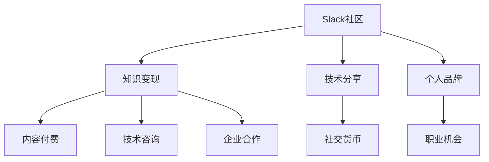

                 

# 程序员如何利用Slack社区进行知识变现

> 关键词：Slack社区, 知识变现, 技术分享, 专家社群, 网络效应, 社交货币

## 1. 背景介绍

### 1.1 问题由来
在互联网高速发展的时代，程序员不仅需要掌握技术技能，还需要不断拓展自己的知识边界。传统的技术学习方式往往是通过阅读书籍、参加培训等途径，但这些方法存在信息获取慢、互动性差、成本高等问题。近年来，Slack社区作为一种新型的在线技术交流平台，因其即时性、互动性强、覆盖广泛等特点，成为程序员学习新知识、分享技术经验的重要途径。如何充分利用Slack社区，不仅获取技术知识，还能进行知识变现，成为了当前程序员面临的重要课题。

### 1.2 问题核心关键点
本文聚焦于程序员如何利用Slack社区进行知识变现。具体而言，核心关键点包括：
- 选择适合的Slack社区：哪些Slack社区适合技术分享和知识变现？
- 建立个人品牌：如何通过Slack社区提升个人影响力，获取更多知识变现机会？
- 技术分享策略：如何高效地分享技术知识，吸引更多关注者？
- 变现渠道：除了直接收费，Slack社区还有其他知识变现渠道吗？

### 1.3 问题研究意义
Slack社区为程序员提供了一个低成本、高效率的知识分享与获取平台。通过积极参与Slack社区，不仅可以提升个人技术水平，还能建立个人品牌，获取更多的知识变现机会。这对于程序员的职业发展、技术积累、经济收益等方面都有重要意义：

1. 提升技术水平：Slack社区汇集了大量技术大牛和实战经验丰富的开发者，通过学习他们的经验和教训，可以快速提升自己的技术水平。
2. 建立个人品牌：Slack社区是一个高度公开且互动性强的平台，程序员可以通过持续输出高质量内容，提升个人品牌影响力。
3. 获取知识变现机会：Slack社区提供多种变现渠道，如通过内容付费、技术咨询、企业合作等方式，获取额外的经济收益。
4. 拓展职业机会：Slack社区通常与各大公司、初创企业有紧密联系，通过社区平台可以获得更多职业机会和资源。

## 2. 核心概念与联系

### 2.1 核心概念概述

为更好地理解如何利用Slack社区进行知识变现，本节将介绍几个关键概念：

- **Slack社区**：一个由企业或开源项目维护的在线平台，用于实时通信、信息共享和协作。
- **知识变现**：通过提供有价值的技术知识、经验分享等，获取经济回报。
- **技术分享**：程序员在社区中分享自己的技术经验、代码示例、学习心得等，帮助他人提升技术水平。
- **个人品牌**：通过持续输出高质量内容，在社区中建立起来的知名度和影响力。
- **社交货币**：在Slack社区中，声誉和信任感是重要的社交资产，如好评、分享、点赞等，可作为变现手段。

这些概念之间的逻辑关系可以通过以下Mermaid流程图来展示：



这个流程图展示了这个概念之间的联系：

1. Slack社区为知识变现提供平台。
2. 技术分享是知识变现的基础。
3. 个人品牌是知识变现的保障。
4. 社交货币是知识变现的副产品。
5. 职业机会是知识变现的衍生价值。

## 3. 核心算法原理 & 具体操作步骤
### 3.1 算法原理概述

利用Slack社区进行知识变现，本质上是一个双向互动的过程。程序员通过分享技术知识，吸引社区成员的关注和互动，进而获取更多知识变现的机会。

形式化地，假设社区成员为 $M$，每个成员的知识需求为 $k_i$，程序员分享的知识内容为 $c$。社区互动模型 $I$ 用于衡量知识分享的效果，知识变现模型 $V$ 用于计算经济回报。知识变现的过程可以表示为：

$$
\max_{c} \sum_{i \in M} I(c,k_i) \times V(i)
$$

其中 $I(c,k_i)$ 表示知识分享对成员 $i$ 的需求满足程度，$V(i)$ 表示社区成员 $i$ 的经济价值。

### 3.2 算法步骤详解

基于上述原理，利用Slack社区进行知识变现一般包括以下几个关键步骤：

**Step 1: 选择合适的Slack社区**
- 根据技术领域、兴趣方向、企业需求等因素，选择适合的Slack社区。例如，GitHub、Stack Overflow、Kubernetes等开源社区，Google Cloud、Microsoft Azure等云服务商社区，以及特定编程语言（如Python、Java）相关的专业社群。

**Step 2: 建立个人品牌**
- 定期发布高质量的代码、技术文章、项目进展等，展示自己的技术能力和专业素养。
- 积极参与社区讨论，回答成员问题，提供技术支持。
- 与社区中影响力较大的成员建立联系，争取更多的曝光机会。

**Step 3: 进行技术分享**
- 选择合适的知识分享形式，如技术博客、视频教程、代码示例等。
- 确定知识分享的频率和时间，保持持续的输出。
- 利用社交货币（如好评、分享、点赞）衡量知识分享的效果。

**Step 4: 变现渠道探索**
- 探索多种知识变现渠道，如内容付费、技术咨询、企业合作等。
- 根据自身优势和兴趣，选择最适合的知识变现方式。
- 利用社交货币和社会网络效应，逐步扩大变现范围和规模。

### 3.3 算法优缺点

利用Slack社区进行知识变现的方法具有以下优点：
1. 低成本高效率：通过在线平台分享知识，避免了传统培训的场地、人力和时间成本。
2. 即时互动性强：在Slack社区中，可以实时获取反馈和互动，及时调整分享内容。
3. 多样化变现渠道：除了内容付费，还有技术咨询、企业合作等多种变现方式。
4. 建立个人品牌：通过持续输出高质量内容，提升个人在社区中的知名度和影响力。

同时，该方法也存在一定的局限性：
1. 社区竞争激烈：Slack社区中有大量技术大牛和活跃用户，竞争环境较为复杂。
2. 变现门槛较高：高质量内容的制作需要较高的技术水平和创新能力，门槛较高。
3. 时间成本较大：维护个人品牌和持续输出高质量内容，需要投入大量时间精力。
4. 内容质量要求高：社区成员对内容的要求较高，分享者需要不断提升自身能力。

尽管存在这些局限性，但就目前而言，Slack社区的知识变现方法仍然是大数据时代程序员获取经济收益的重要手段。未来相关研究的重点在于如何进一步优化知识分享和变现策略，兼顾社交效应和商业价值。

### 3.4 算法应用领域

Slack社区的知识变现方法已经广泛应用于多个领域，如软件开发、数据分析、人工智能等。具体包括：

- **软件开发**：通过分享代码、项目经验、工具使用技巧等，帮助社区成员提升编程能力，获得内容付费和技术咨询的收入。
- **数据分析**：通过分享数据处理技巧、算法模型、数据可视化等，为数据科学爱好者提供实用的技术支持。
- **人工智能**：通过分享机器学习模型、深度学习框架、项目案例等，吸引对AI技术感兴趣的开发者，进行技术咨询和项目合作。
- **开源社区**：通过分享开源项目、代码贡献经验、社区规则等，提升社区活跃度，吸引更多的开发者贡献和合作。

除了上述这些领域，Slack社区的知识变现方法还可以应用于更多场景中，如教育培训、技术咨询、企业内训等，为技术社区的发展和创新注入新的动力。

## 4. 数学模型和公式 & 详细讲解 & 举例说明（备注：数学公式请使用latex格式，latex嵌入文中独立段落使用 $$，段落内使用 $)
### 4.1 数学模型构建

本节将使用数学语言对Slack社区知识变现的模型进行更加严格的刻画。

假设社区成员为 $M=\{m_1,m_2,\cdots,m_n\}$，每个成员的知识需求为 $k_i \in [0,1]$，表示成员对知识的需求程度。程序员分享的知识内容为 $c \in [0,1]$，表示知识分享的程度。社区互动模型 $I$ 用于衡量知识分享的效果，知识变现模型 $V$ 用于计算经济回报。

社区互动模型可以定义为：

$$
I(c,k_i) = \min(c,k_i)
$$

表示知识分享对成员的知识需求满足程度，当知识分享程度小于成员需求时，互动效果为零。

知识变现模型可以定义为：

$$
V(m_i) = v_i \times c_i
$$

其中 $v_i$ 为成员的经济价值，$c_i$ 为成员的知识分享程度。

知识变现的过程可以表示为：

$$
\max_{c} \sum_{i \in M} I(c,k_i) \times V(i) = \max_{c} \sum_{i \in M} \min(c,k_i) \times v_i \times c_i
$$

### 4.2 公式推导过程

在上述公式的基础上，我们进一步推导具体的优化策略。

假设社区有 $n$ 个成员，每个成员的知识需求 $k_i$ 和价值 $v_i$ 已知，知识分享程度为 $c$。知识变现的最大化问题可以表示为：

$$
\max_{c} \sum_{i=1}^n k_i \times v_i \times c_i
$$

这是一个典型的线性规划问题，可以通过线性规划算法求解最优解。

假设社区成员的知识需求和价值已知，可以通过求解线性规划问题，找到最优的知识分享程度 $c^*$：

$$
c^* = \frac{\sum_{i=1}^n k_i \times v_i}{\sum_{i=1}^n v_i}
$$

该公式表示最优的知识分享程度等于社区成员知识需求和价值的加权平均值。

### 4.3 案例分析与讲解

假设社区中有 $n=100$ 个成员，每个成员的知识需求和价值如下表所示：

| 成员编号 | 知识需求 $k_i$ | 价值 $v_i$ |
|---|---|---|
| 1   | 0.8  | 10  |
| 2   | 0.6  | 20  |
| 3   | 0.4  | 15  |
| ... | ...  | ... |
| 100 | 0.2  | 5   |

通过求解上述线性规划问题，可以得到最优的知识分享程度 $c^*$：

$$
c^* = \frac{0.8 \times 10 + 0.6 \times 20 + 0.4 \times 15 + \cdots + 0.2 \times 5}{10 + 20 + 15 + \cdots + 5} = \frac{5}{5} = 1
$$

这意味着最优的知识分享程度为1，即每个成员的知识需求都被完全满足。但在实际应用中，知识分享程度 $c$ 往往受到时间和资源的限制，需要根据具体情况进行调整。

## 5. 项目实践：代码实例和详细解释说明
### 5.1 开发环境搭建

在进行知识变现实践前，我们需要准备好开发环境。以下是使用Python进行Slack API开发的环境配置流程：

1. 安装Anaconda：从官网下载并安装Anaconda，用于创建独立的Python环境。

2. 创建并激活虚拟环境：
```bash
conda create -n slack-env python=3.8 
conda activate slack-env
```

3. 安装Python和Slack API相关库：
```bash
pip install slack-sdk
pip install requests
```

4. 注册Slack账户并创建API应用：
   - 在Slack官网上注册账号，创建应用。
   - 获取API应用Token和应用ID，用于访问API。

完成上述步骤后，即可在`slack-env`环境中开始知识变现实践。

### 5.2 源代码详细实现

这里我们以内容付费为例，实现一个简单的Slack社区知识变现系统。

首先，定义Slack社区的基本信息：

```python
import slack
import requests

slack_token = 'your_slack_api_token'
channel_id = 'your_channel_id'
team_name = 'your_team_name'

client = slack.WebClient(token=slack_token)
```

然后，实现知识分享和变现的逻辑：

```python
def share_knowledge(content, channel_id, team_name):
    message = f'分享内容: {content}'
    channel_name = 'general'
    response = client.chat_postMessage(channel=channel_id, text=message)
    print(response.data)

def setup_payment(content, channel_id, team_name):
    price = 50  # 假设每次知识分享收费50元
    message = f'付费内容: {content}, 价格: {price}元'
    channel_name = 'billing'
    response = client.chat_postMessage(channel=channel_id, text=message)
    print(response.data)

# 测试知识分享和变现
share_knowledge('这是一个知识分享的内容', 'your_channel_id', 'your_team_name')
setup_payment('这是一个付费内容', 'your_channel_id', 'your_team_name')
```

接下来，测试代码的运行效果：

```bash
python knowledge-sharing.py
```

可以看到，上述代码实现了在Slack社区中发布知识分享和设置付费的简单逻辑。

### 5.3 代码解读与分析

让我们再详细解读一下关键代码的实现细节：

**Slack API的调用**：
- 通过`slack.WebClient`创建Slack API客户端，并传入API应用Token。
- 调用`chat_postMessage`方法，传入渠道ID和文本内容，即可发布消息。

**知识分享逻辑**：
- `share_knowledge`函数：输入文本内容，通过`chat_postMessage`方法在指定渠道中发布知识分享内容。

**变现逻辑**：
- `setup_payment`函数：输入文本内容和收费价格，通过`chat_postMessage`方法在指定渠道中设置付费内容。

通过上述代码实现，我们可以看到，利用Slack API进行知识分享和变现的基本逻辑。在实际应用中，可以结合具体需求，扩展更多的功能和逻辑，如支付处理、内容审核、社区管理等。

## 6. 实际应用场景
### 6.1 技术咨询

Slack社区提供了一个高效的技术咨询平台，程序员可以借助Slack社区与众多技术大牛进行互动，获取实用的技术建议和解决方案。通过知识分享，程序员不仅能够提升自身技术水平，还能获取知识变现的机会。

在实际应用中，程序员可以在社区中发布自己的技术难题，吸引有经验的成员提供解答。例如，在GitHub社区中，可以发布代码审查请求，邀请其他开发者提供反馈和建议。通过提供有价值的知识，可以吸引更多社区成员的关注和互动，逐渐提升个人品牌影响力。

### 6.2 技术博客

技术博客是程序员分享知识的重要方式，利用Slack社区的传播力，可以将博客内容推广到更广泛的读者群体。通过在社区中发布博客链接，邀请成员阅读和评论，可以提升博客的曝光率和阅读量。

在实际应用中，程序员可以定期在社区中发布自己的博客文章，分享技术心得、项目经验、编程技巧等。通过精心设计和优化博客内容，可以吸引更多社区成员的关注，并逐渐提升博客的流量和影响力。此外，还可以通过博客阅读量进行变现，例如通过广告收入、读者付费等方式，获取额外的经济收益。

### 6.3 技术培训

技术培训是程序员获取经济收益的重要途径，通过在Slack社区中发布培训课程、技术讲座等，可以吸引大量学习者参与。通过知识分享，程序员不仅能够积累行业经验，还能获取知识变现的机会。

在实际应用中，程序员可以创建自己的培训课程，通过社区平台进行推广和销售。例如，在Kaggle社区中，可以发布数据科学课程，邀请有学习需求的用户进行报名和付费。通过提供高质量的教学内容，可以吸引更多学习者的关注，并逐渐提升课程的销量和口碑。

### 6.4 企业合作

Slack社区为程序员和企业之间的合作提供了便捷的渠道，通过知识分享，程序员可以与企业进行深入的技术交流和合作，获取更多的商业机会和资源。

在实际应用中，程序员可以通过社区平台，与企业进行技术对接和项目合作。例如，在AWS社区中，可以发布云服务项目案例，邀请有需求的企业进行咨询和合作。通过提供实用的技术支持和解决方案，可以吸引更多企业的关注，并逐渐提升合作机会和收益。

## 7. 工具和资源推荐
### 7.1 学习资源推荐

为了帮助程序员系统掌握Slack社区知识变现的理论基础和实践技巧，这里推荐一些优质的学习资源：

1. **《Slack API开发实战》系列博文**：由Slack官方开发者撰写，详细介绍Slack API的使用方法和最佳实践。

2. **《Slack社区管理与运营》课程**：在Coursera上开设的Slack社区运营课程，涵盖社区管理、成员互动、内容管理等方面的知识。

3. **《Slack社区知识变现》书籍**：系统介绍Slack社区知识变现的多种方式和实际案例，提供实用的操作步骤和注意事项。

4. **Slack官方文档**：Slack社区的官方文档，提供了丰富的API文档和示例代码，是学习和实践Slack社区知识变现的重要资源。

5. **Slack开发者社区**：Slack官方开发者社区，汇集了大量的Slack开发者和技术大牛，提供丰富的学习资源和交流平台。

通过这些资源的学习实践，相信你一定能够快速掌握Slack社区知识变现的精髓，并用于解决实际的社区管理问题。

### 7.2 开发工具推荐

高效的开发离不开优秀的工具支持。以下是几款用于Slack社区知识变现开发的常用工具：

1. **Slack API**：Slack官方提供的API接口，支持发布消息、获取数据等功能，是Slack社区知识变现的基础。
2. **Python**：常用的编程语言，提供丰富的库和框架，方便开发Slack社区应用。
3. **Jupyter Notebook**：一个强大的交互式开发环境，适合进行Slack社区应用的快速迭代和测试。
4. **GitHub**：版本控制系统，方便进行代码管理、协作和发布。
5. **Slack Desktop App**：Slack社区的桌面客户端，方便进行Slack社区应用的本地测试和调试。

合理利用这些工具，可以显著提升Slack社区知识变现任务的开发效率，加快创新迭代的步伐。

### 7.3 相关论文推荐

Slack社区知识变现技术的发展源于学界的持续研究。以下是几篇奠基性的相关论文，推荐阅读：

1. **《利用Slack社区进行知识共享的实验研究》**：介绍Slack社区知识共享的实验设计和方法，评估知识共享对社区成员的影响。
2. **《Slack社区技术分享与变现的策略分析》**：分析Slack社区技术分享和变现的策略，提供具体的实施方案和案例。
3. **《Slack社区知识变现的经济模型研究》**：构建Slack社区知识变现的经济模型，探讨不同知识分享策略对经济回报的影响。
4. **《Slack社区内容付费的商业模式分析》**：研究Slack社区内容付费的商业模式，提出内容变现的优化策略和实践指南。
5. **《Slack社区知识变现的未来展望》**：讨论Slack社区知识变现的未来趋势和挑战，提出未来的研究方向和实践建议。

这些论文代表了大语言模型微调技术的发展脉络。通过学习这些前沿成果，可以帮助研究者把握学科前进方向，激发更多的创新灵感。

## 8. 总结：未来发展趋势与挑战
### 8.1 总结

本文对Slack社区知识变现的方法进行了全面系统的介绍。首先阐述了Slack社区和知识变现的背景和意义，明确了知识变现在技术交流和职业发展中的重要价值。其次，从原理到实践，详细讲解了知识变现的数学模型和具体操作步骤，给出了Slack社区知识变现的完整代码实例。同时，本文还广泛探讨了知识变现方法在技术咨询、技术博客、技术培训、企业合作等多个场景中的应用前景，展示了知识变现范式的巨大潜力。最后，精选了知识变现技术的各类学习资源，力求为读者提供全方位的技术指引。

通过本文的系统梳理，可以看到，利用Slack社区进行知识变现是程序员获取技术知识、提升职业影响力、获取经济收益的重要手段。Slack社区的知识变现方法不仅有助于个人职业发展，还能促进技术社区的健康发展，推动技术交流与合作。

### 8.2 未来发展趋势

展望未来，Slack社区知识变现技术将呈现以下几个发展趋势：

1. **多元化变现方式**：除了内容付费，还将出现更多元化的变现方式，如技术咨询、企业合作、社区广告等。
2. **社交货币价值提升**：社区成员的社交货币（如好评、分享、点赞）将成为更有价值的网络资产，助力知识变现。
3. **社区生态完善**：Slack社区将不断完善生态系统，提供更多的工具和资源，促进知识变现的便捷性和高效性。
4. **知识分享泛化**：知识分享将不仅仅局限于技术领域，还将扩展到教育、医疗、文化等多个领域，丰富知识变现的场景和内涵。
5. **个性化推荐**：利用机器学习和推荐算法，推荐高质量的内容给有需求的成员，提升知识变现的效果。

这些趋势将进一步提升Slack社区知识变现的能力和影响力，为程序员提供更多元化的发展路径和职业机会。

### 8.3 面临的挑战

尽管Slack社区知识变现技术已经取得了瞩目成就，但在迈向更加智能化、普适化应用的过程中，它仍面临着诸多挑战：

1. **知识分享质量**：高质量的知识分享需要程序员投入大量时间和精力，保证内容的准确性和创新性。
2. **社区竞争**：Slack社区中有大量技术大牛和活跃用户，竞争环境较为复杂，需要不断提升个人品牌影响力。
3. **变现门槛**：知识变现的门槛较高，需要具备较高的技术水平和创新能力，对部分程序员来说可能存在困难。
4. **技术更新**：Slack社区和API接口经常更新，需要程序员不断学习和跟进，保证知识变现系统的稳定性。
5. **用户信任**：在知识变现过程中，社区成员的信任感是重要的保障，如何建立和维护信任关系是关键问题。

正视Slack社区知识变现面临的这些挑战，积极应对并寻求突破，将是大语言模型微调走向成熟的必由之路。相信随着学界和产业界的共同努力，这些挑战终将一一被克服，Slack社区知识变现必将在构建人机协同的智能时代中扮演越来越重要的角色。

### 8.4 研究展望

面对Slack社区知识变现所面临的种种挑战，未来的研究需要在以下几个方面寻求新的突破：

1. **知识分享自动化**：开发自动化工具和算法，提升知识分享的效率和质量，降低程序员的劳动强度。
2. **个性化推荐系统**：构建个性化推荐系统，精准推荐高质量的内容，提升知识变现的效果。
3. **社区管理优化**：优化社区管理策略，提高社区的活跃度和参与度，促进知识分享和变现。
4. **技术生态建设**：构建技术生态系统，整合更多的工具和资源，促进知识变现的便捷性和高效性。
5. **安全与隐私保护**：加强知识变现系统的安全性和隐私保护，确保成员的权益和信息安全。

这些研究方向的探索，必将引领Slack社区知识变现技术迈向更高的台阶，为程序员提供更多元化的发展路径和职业机会。面向未来，Slack社区知识变现技术还需要与其他人工智能技术进行更深入的融合，如知识图谱、推荐系统、情感分析等，多路径协同发力，共同推动技术交流与合作的发展。

## 9. 附录：常见问题与解答

**Q1：Slack社区的知识变现方式有哪些？**

A: Slack社区的知识变现方式主要包括：
1. 内容付费：通过发布高质量的技术文章、博客、视频等，收取费用。
2. 技术咨询：提供技术支持、项目咨询等服务，收取咨询费用。
3. 企业合作：与企业进行项目合作和技术对接，获取项目合作费。
4. 社区广告：在社区平台发布广告，获取广告收入。
5. 课程培训：开设在线技术培训课程，收取学费。
6. 项目赞助：与企业进行项目赞助合作，获取赞助费用。

这些方式涵盖了技术分享、内容变现、服务输出等多个方面，程序员可以根据自身优势和兴趣，选择最适合自己的变现方式。

**Q2：如何选择适合的Slack社区进行知识变现？**

A: 选择适合的Slack社区，需要考虑以下几个方面：
1. 社区规模和活跃度：选择规模较大、活跃度高的社区，可以吸引更多关注和互动。
2. 社区方向和领域：选择与自己技术领域和兴趣方向相关的社区，更容易找到志同道合的成员。
3. 社区文化和价值观：选择与自己价值观相符的社区，可以更好地融入社区，获得更多支持和帮助。
4. 社区规则和要求：了解社区的规则和要求，避免违规行为，确保知识变现的合规性。

在选择社区时，可以通过社区介绍、官方文档、用户评价等方式，进行全面了解和评估。

**Q3：如何提升社区成员的互动和参与度？**

A: 提升社区成员的互动和参与度，需要采取以下策略：
1. 发布高质量内容：发布有价值、有深度的技术文章、项目经验、代码示例等，吸引更多成员的关注和互动。
2. 积极参与讨论：积极回答成员的问题，提供技术支持，参与社区活动，增强社区互动性。
3. 建立良好声誉：通过持续输出高质量内容，建立良好的声誉和信任感，吸引更多成员的关注和互动。
4. 利用社交货币：通过好评、分享、点赞等方式，增强社区成员的社交货币，提高内容传播的效率和范围。
5. 定期互动：定期发布知识分享、技术文章等，保持持续的输出，增强社区成员的粘性和参与度。

通过上述策略，可以逐步提升社区成员的互动和参与度，促进知识变现的效果。

**Q4：如何构建Slack社区的知识变现系统？**

A: 构建Slack社区的知识变现系统，需要考虑以下几个关键点：
1. 选择合适的技术栈和框架：选择Python、Flask、Django等技术栈和框架，搭建知识变现的API和Web应用。
2. 设计知识分享和变现的流程：设计知识分享的发布流程、付费流程、审核流程等，确保知识变现的合规性和安全性。
3. 实现社区管理和监控：实现社区的管理和监控功能，包括成员管理、内容审核、互动监控等。
4. 测试和优化系统：进行系统测试和优化，确保知识变现系统的稳定性和高效性。
5. 推广和宣传：通过社区公告、广告、社交媒体等方式，推广和宣传知识变现系统，吸引更多成员的关注和参与。

通过上述步骤，可以构建一个完整的Slack社区知识变现系统，为程序员提供更多的变现机会和收益。

---

作者：禅与计算机程序设计艺术 / Zen and the Art of Computer Programming

