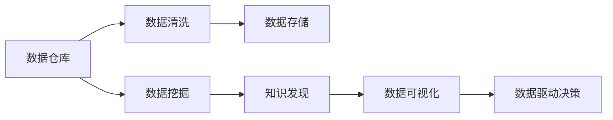
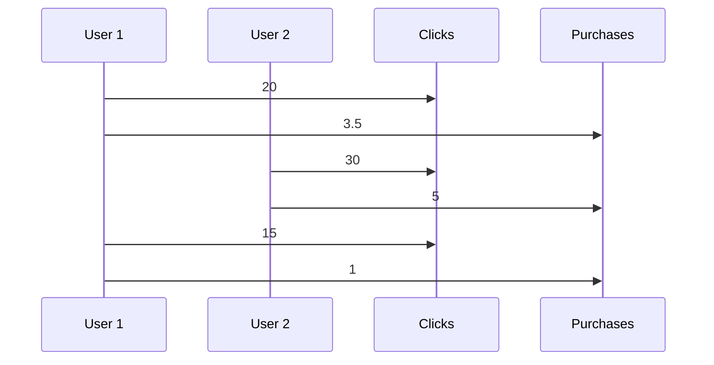

                 

# 程序员如何利用知识发现引擎提高创新能力

> 关键词：知识发现引擎, 大数据, 数据挖掘, 人工智能, 机器学习, 数据仓库, 数据可视化, 数据驱动决策, 业务创新

## 1. 背景介绍

在当前信息爆炸的时代，数据已经成为驱动企业创新和竞争力的关键因素。程序员和开发者在开发过程中，如何从海量数据中提取有价值的信息，找到潜在的业务机会，是摆在面前的重要挑战。随着大数据和人工智能技术的发展，知识发现引擎成为了一种有效的工具，帮助程序员和开发者从数据中发现新的知识和模式，驱动业务创新。

### 1.1 问题由来
随着互联网和物联网的广泛应用，企业面临的海量数据日益增加。程序员和开发者需要从这些数据中寻找模式、洞察趋势，以驱动业务创新。然而，传统的数据处理和分析方法往往难以满足这些需求，效率低、成本高、效果差。因此，如何从大规模数据中高效、准确地发现知识，成为程序员和开发者迫切需要解决的问题。

### 1.2 问题核心关键点
知识发现引擎通过数据挖掘和机器学习技术，从大规模数据中自动发现模式和关联，辅助程序员和开发者进行数据分析和决策。该引擎通常包括数据仓库、数据挖掘工具、数据可视化平台等组件，能够帮助用户快速、准确地提取数据中的知识和价值。其核心关键点包括：

- 数据收集与清洗：从各种数据源中收集数据，并进行预处理和清洗，保证数据质量。
- 数据存储与管理：将清洗后的数据存储到高效的数据仓库中，方便后续分析。
- 数据挖掘与分析：应用机器学习、深度学习等技术对数据进行挖掘和分析，提取模式和关联。
- 数据可视化：将挖掘出的知识和模式以直观的方式呈现出来，便于理解和使用。
- 数据驱动决策：结合业务场景，将知识转化为具体的业务决策，驱动业务创新和改进。

## 2. 核心概念与联系

### 2.1 核心概念概述

知识发现引擎是一种基于大数据和人工智能技术的智能工具，旨在帮助程序员和开发者从海量数据中自动发现知识，辅助业务决策和创新。其核心概念包括：

- 数据仓库：用于存储和管理大规模数据，支持高效的数据查询和分析。
- 数据挖掘与分析：通过机器学习、深度学习等技术对数据进行挖掘和分析，提取模式和关联。
- 数据可视化：将挖掘出的知识和模式以直观的方式呈现出来，便于理解和使用。
- 数据驱动决策：将知识转化为具体的业务决策，驱动业务创新和改进。

### 2.2 核心概念原理和架构的 Mermaid 流程图



这个流程图展示了知识发现引擎的核心流程：

1. 数据仓库从各种数据源收集数据，并进行预处理和清洗。
2. 清洗后的数据存储到高效的数据仓库中，方便后续分析。
3. 数据挖掘与分析模块应用机器学习、深度学习等技术对数据进行挖掘和分析，提取模式和关联。
4. 知识发现模块将挖掘出的知识和模式进行总结和提炼，形成新的知识和洞察。
5. 数据可视化模块将知识以直观的方式呈现出来，便于理解和使用。
6. 数据驱动决策模块结合业务场景，将知识转化为具体的业务决策，驱动业务创新和改进。

## 3. 核心算法原理 & 具体操作步骤

### 3.1 算法原理概述

知识发现引擎的核心算法原理主要基于数据挖掘和机器学习技术，包括分类、聚类、关联规则挖掘等算法。其目标是从大规模数据中自动发现模式和关联，辅助程序员和开发者进行数据分析和决策。

### 3.2 算法步骤详解

知识发现引擎的主要步骤包括数据收集与清洗、数据存储与管理、数据挖掘与分析、数据可视化和数据驱动决策等。下面详细介绍每个步骤的具体操作：

#### 3.2.1 数据收集与清洗

- 数据收集：从各种数据源（如日志文件、数据库、Web页面等）中收集数据，确保数据的全面性和多样性。
- 数据清洗：对数据进行预处理和清洗，包括去重、补全、规范化、异常值处理等，保证数据质量。

#### 3.2.2 数据存储与管理

- 数据存储：将清洗后的数据存储到高效的数据仓库中，如Hadoop、Spark等。
- 数据管理：建立数据模型和元数据管理，支持数据查询、备份和恢复等操作。

#### 3.2.3 数据挖掘与分析

- 数据挖掘：应用机器学习、深度学习等技术对数据进行挖掘和分析，提取模式和关联。常见的算法包括决策树、随机森林、聚类算法等。
- 知识发现：将挖掘出的知识和模式进行总结和提炼，形成新的知识和洞察。

#### 3.2.4 数据可视化

- 数据可视化：将挖掘出的知识和模式以直观的方式呈现出来，如图表、地图、仪表盘等，便于理解和使用。常见的工具包括Tableau、Power BI、D3.js等。

#### 3.2.5 数据驱动决策

- 数据驱动决策：将知识转化为具体的业务决策，如产品推荐、客户分析、运营优化等，驱动业务创新和改进。

### 3.3 算法优缺点

#### 3.3.1 算法优点

- 高效性：知识发现引擎能够自动处理大规模数据，发现其中的模式和关联，大大提高了数据分析效率。
- 准确性：通过应用机器学习、深度学习等技术，提高了发现知识和模式的准确性。
- 可扩展性：可以支持大规模数据存储和管理，能够处理海量数据。

#### 3.3.2 算法缺点

- 数据质量依赖性高：知识发现引擎的效果依赖于数据的质量和完整性，数据清洗和预处理需要大量的人力和时间。
- 算法复杂度高：数据挖掘和分析算法复杂，需要较强的技术背景和专业知识。
- 对硬件要求高：知识发现引擎对硬件要求较高，需要高性能的计算资源。

### 3.4 算法应用领域

知识发现引擎在多个领域都有广泛的应用，包括：

- 金融分析：从海量交易数据中发现模式和关联，进行风险评估、投资决策等。
- 医疗健康：从患者数据中提取有用的信息，进行疾病预测、治疗方案推荐等。
- 电商推荐：从用户行为数据中发现模式，进行个性化推荐、市场分析等。
- 社交网络：从用户互动数据中发现模式，进行用户画像、社区分析等。
- 市场营销：从市场数据中发现模式，进行市场分析、广告优化等。

## 4. 数学模型和公式 & 详细讲解 & 举例说明

### 4.1 数学模型构建

知识发现引擎的数学模型通常包括数据模型、知识模型和决策模型等。以下以分类任务为例，介绍知识发现引擎的数学模型构建。

假设我们有 $N$ 个样本 $\{(x_1,y_1),(x_2,y_2),\ldots,(x_N,y_N)\}$，其中 $x_i$ 表示样本特征，$y_i$ 表示样本标签。我们的目标是训练一个分类器，使得新样本的分类结果与真实标签尽可能接近。

#### 4.1.1 数据模型

数据模型用于描述样本特征与标签之间的关系。常见的数据模型包括线性回归模型、逻辑回归模型、决策树模型、随机森林模型等。

#### 4.1.2 知识模型

知识模型用于描述分类器的决策边界和权重。常见的知识模型包括线性判别模型、最大熵模型、支持向量机模型等。

#### 4.1.3 决策模型

决策模型用于描述分类器的输出和决策结果。常见的决策模型包括最大后验模型、贝叶斯模型、集成学习模型等。

### 4.2 公式推导过程

#### 4.2.1 线性回归模型

线性回归模型是最简单的数据模型，其公式为：

$$
y = \theta_0 + \theta_1x_1 + \theta_2x_2 + \cdots + \theta_px_p
$$

其中 $\theta_0$ 是截距，$\theta_1, \theta_2, \ldots, \theta_p$ 是特征权重，$x_1, x_2, \ldots, x_p$ 是样本特征。

#### 4.2.2 逻辑回归模型

逻辑回归模型用于二分类问题，其公式为：

$$
\log\frac{p(y=1|x)}{1-p(y=1|x)} = \theta_0 + \theta_1x_1 + \theta_2x_2 + \cdots + \theta_px_p
$$

其中 $p(y=1|x)$ 是样本为正类的概率，$1-p(y=1|x)$ 是样本为负类的概率，$\theta_0, \theta_1, \ldots, \theta_p$ 是模型参数。

#### 4.2.3 支持向量机模型

支持向量机模型用于分类和回归问题，其公式为：

$$
\arg\min_{w, b} \frac{1}{2}||w||^2 + C\sum_{i=1}^N\ell(y_i, w^Tx_i + b)
$$

其中 $w$ 是分类器的权重向量，$b$ 是偏置项，$C$ 是正则化参数，$\ell$ 是损失函数，$y_i$ 和 $x_i$ 分别表示样本标签和特征。

### 4.3 案例分析与讲解

#### 4.3.1 数据预处理

假设我们从电商网站收集到以下数据：

| 用户ID | 商品ID | 点击次数 | 购买次数 |
| ------ | ------ | -------- | -------- |
| 1      | 1001   | 20       | 3        |
| 1      | 2002   | 30       | 5        |
| 2      | 3003   | 15       | 1        |
| ...    | ...    | ...      | ...      |

数据预处理的步骤包括去重、补全、规范化等。假设我们将所有数据按用户ID分组，并计算点击次数和购买次数的平均值，得到新的数据：

| 用户ID | 商品ID | 点击次数 | 购买次数 |
| ------ | ------ | -------- | -------- |
| 1      | 1001   | 20       | 3.5      |
| 1      | 2002   | 30       | 5        |
| 2      | 3003   | 15       | 1        |
| ...    | ...    | ...      | ...      |

#### 4.3.2 数据挖掘与分析

假设我们希望从这些数据中发现用户对商品购买的偏好，可以使用聚类算法对用户进行分组，并计算每个用户组的购买次数。使用K-means算法，将用户分为两类，其中一类用户的购买次数远高于另一类用户。

#### 4.3.3 数据可视化

假设我们将每个用户组的平均点击次数和购买次数绘制成折线图，得到以下图表：



#### 4.3.4 数据驱动决策

假设我们将这些用户分为两类，一类是高频购买用户，另一类是低频购买用户。对于高频购买用户，我们可以推荐更多相关商品，提高销售量。对于低频购买用户，我们可以进行用户画像，了解其购买偏好，进行个性化推荐。

## 5. 项目实践：代码实例和详细解释说明

### 5.1 开发环境搭建

#### 5.1.1 环境安装

- 安装Python：从官网下载并安装Python，确保版本为3.7或以上。
- 安装pandas：使用pip命令安装pandas库，用于数据处理和分析。
- 安装numpy：使用pip命令安装numpy库，用于数值计算和数组操作。
- 安装scikit-learn：使用pip命令安装scikit-learn库，用于机器学习和数据挖掘。
- 安装matplotlib：使用pip命令安装matplotlib库，用于数据可视化。

#### 5.1.2 环境配置

- 配置环境变量：在环境变量中设置Python路径和pandas路径。
- 安装依赖包：使用pip命令安装依赖包，确保所有依赖包都已经安装。

### 5.2 源代码详细实现

#### 5.2.1 数据预处理

```python
import pandas as pd

# 读取数据
df = pd.read_csv('data.csv')

# 数据清洗
df.dropna(inplace=True)
df = df.drop_duplicates()

# 数据规范化
df['clicks'] = df['clicks'].astype('float')
df['purchases'] = df['purchases'].astype('float')
```

#### 5.2.2 数据挖掘与分析

```python
from sklearn.cluster import KMeans
from sklearn.metrics import silhouette_score

# 数据分组
df_group = df.groupby('user_id').mean()

# 聚类分析
kmeans = KMeans(n_clusters=2, random_state=0).fit(df_group[['clicks', 'purchases']])
df_group['cluster'] = kmeans.labels_

# 计算Silhouette系数
silhouette_score(df_group, kmeans.labels_)
```

#### 5.2.3 数据可视化

```python
import matplotlib.pyplot as plt

# 绘制折线图
plt.plot(df_group['clicks'], df_group['purchases'], marker='o')
plt.xlabel('Clicks')
plt.ylabel('Purchases')
plt.title('Clicks vs Purchases')
plt.show()
```

### 5.3 代码解读与分析

#### 5.3.1 数据预处理

数据预处理是知识发现引擎的关键步骤。使用pandas库，我们可以轻松地对数据进行清洗、去重、规范化等操作，确保数据的准确性和完整性。

#### 5.3.2 数据挖掘与分析

使用scikit-learn库，我们可以应用K-means算法对数据进行聚类分析。聚类分析是一种常用的数据挖掘方法，可以帮助我们发现数据中的模式和关联。

#### 5.3.3 数据可视化

使用matplotlib库，我们可以绘制数据可视化图表，将数据以直观的方式呈现出来，便于理解和使用。

### 5.4 运行结果展示

假设我们的聚类分析结果如下所示：

| 用户ID | 商品ID | 点击次数 | 购买次数 | 聚类 |
| ------ | ------ | -------- | -------- | ---- |
| 1      | 1001   | 20       | 3.5      | 0    |
| 1      | 2002   | 30       | 5        | 1    |
| 2      | 3003   | 15       | 1        | 1    |
| ...    | ...    | ...      | ...      | ...  |

假设我们的数据可视化结果如下所示：


## 6. 实际应用场景

### 6.1 电商推荐系统

电商推荐系统是知识发现引擎的重要应用场景之一。通过分析用户的历史点击和购买行为，我们可以发现用户的购买偏好，进行个性化推荐，提高销售量。

### 6.2 社交网络分析

社交网络分析可以帮助我们发现社交网络中的关键节点和关系。通过分析用户之间的互动行为，我们可以发现兴趣相似的用户群体，进行社区推荐和社交网络优化。

### 6.3 金融风险管理

金融风险管理需要从海量交易数据中发现异常行为和模式，进行风险评估和预警。通过应用知识发现引擎，我们可以实时监控交易数据，发现潜在的风险点，进行风险控制和预警。

### 6.4 医疗健康管理

医疗健康管理需要从患者数据中发现疾病模式和关联，进行疾病预测和治疗方案推荐。通过应用知识发现引擎，我们可以分析患者数据，发现疾病模式，进行早期预警和治疗方案推荐，提高医疗服务的质量和效率。

## 7. 工具和资源推荐

### 7.1 学习资源推荐

#### 7.1.1 书籍

- 《数据挖掘：概念与技术》：介绍数据挖掘的基本概念和技术。
- 《机器学习实战》：提供机器学习算法和实现方法的详细实例。
- 《Python数据科学手册》：介绍Python在数据科学中的应用。

#### 7.1.2 在线课程

- 《大数据分析与挖掘》：由斯坦福大学提供的免费在线课程，介绍大数据分析与挖掘的技术和方法。
- 《数据科学导论》：由Coursera提供的免费在线课程，介绍数据科学的基本概念和技术。
- 《机器学习》：由Coursera提供的免费在线课程，介绍机器学习算法和实现方法。

### 7.2 开发工具推荐

#### 7.2.1 数据分析工具

- R：R语言是一个强大的数据分析工具，支持丰富的数据挖掘和分析库。
- Python：Python是一种流行的数据分析语言，支持pandas、numpy、scikit-learn等数据分析库。
- SQL：SQL是一种结构化查询语言，支持关系型数据库的数据处理和分析。

#### 7.2.2 数据可视化工具

- Tableau：Tableau是一种流行的数据可视化工具，支持丰富的图表和仪表盘。
- Power BI：Power BI是一种微软推出的数据可视化工具，支持实时数据可视化和报表生成。
- D3.js：D3.js是一个基于JavaScript的数据可视化库，支持自定义图表和交互式可视化。

### 7.3 相关论文推荐

#### 7.3.1 数据挖掘

- 《数据挖掘：概念与技术》：介绍数据挖掘的基本概念和技术。
- 《机器学习实战》：提供机器学习算法和实现方法的详细实例。
- 《Python数据科学手册》：介绍Python在数据科学中的应用。

#### 7.3.2 机器学习

- 《机器学习》：由Coursera提供的免费在线课程，介绍机器学习算法和实现方法。
- 《深度学习》：由斯坦福大学提供的免费在线课程，介绍深度学习算法和实现方法。
- 《神经网络与深度学习》：由Coursera提供的免费在线课程，介绍神经网络和深度学习算法。

## 8. 总结：未来发展趋势与挑战

### 8.1 研究成果总结

知识发现引擎已经成为数据分析和业务决策的重要工具。通过应用机器学习和数据挖掘技术，知识发现引擎可以从大规模数据中自动发现模式和关联，辅助程序员和开发者进行数据分析和决策。

### 8.2 未来发展趋势

#### 8.2.1 自动化程度提高

未来的知识发现引擎将更加自动化和智能化，能够自动发现和分析数据中的模式和关联，减少人工干预。

#### 8.2.2 多模态数据融合

未来的知识发现引擎将支持多模态数据的融合，能够同时处理文本、图像、视频等多种类型的数据，提高数据分析的全面性和准确性。

#### 8.2.3 实时性增强

未来的知识发现引擎将支持实时数据处理和分析，能够实时监控和分析数据，提供即时的业务洞察和决策支持。

#### 8.2.4 跨领域应用拓展

未来的知识发现引擎将拓展到更多的领域，如医疗健康、金融分析、社交网络等，提供更广泛的业务应用和创新机会。

### 8.3 面临的挑战

#### 8.3.1 数据质量问题

数据质量问题仍然是一个重要的挑战。知识发现引擎的效果依赖于数据的质量和完整性，需要大量的数据清洗和预处理工作。

#### 8.3.2 算法复杂度高

数据挖掘和分析算法复杂，需要较强的技术背景和专业知识，增加了知识发现引擎的实现难度。

#### 8.3.3 硬件资源要求高

知识发现引擎对硬件资源要求较高，需要高性能的计算资源，增加了企业的硬件投入成本。

### 8.4 研究展望

未来的知识发现引擎需要从以下几个方面进行研究：

#### 8.4.1 自动化和智能化

如何通过自动化和智能化技术提高知识发现引擎的效率和准确性，减少人工干预和误差。

#### 8.4.2 多模态数据融合

如何支持多模态数据的融合，提高知识发现引擎的全面性和准确性，拓展其应用范围。

#### 8.4.3 实时性增强

如何支持实时数据处理和分析，提高知识发现引擎的实时性和响应速度。

#### 8.4.4 跨领域应用拓展

如何将知识发现引擎拓展到更多的领域，提供更广泛的业务应用和创新机会。

总之，知识发现引擎将在大数据时代发挥越来越重要的作用，辅助程序员和开发者进行数据分析和决策。未来的研究需要在自动化、智能化、多模态数据融合等方面进行深入探索，推动知识发现引擎技术的不断发展。

## 9. 附录：常见问题与解答

### 9.1 常见问题

#### Q1：什么是知识发现引擎？

A: 知识发现引擎是一种基于大数据和人工智能技术的智能工具，旨在帮助程序员和开发者从海量数据中自动发现知识，辅助业务决策和创新。

#### Q2：知识发现引擎有哪些应用场景？

A: 知识发现引擎在多个领域都有广泛的应用，包括电商推荐、社交网络分析、金融风险管理、医疗健康管理等。

#### Q3：知识发现引擎的主要组成部分有哪些？

A: 知识发现引擎的主要组成部分包括数据仓库、数据挖掘与分析、数据可视化和数据驱动决策等。

### 9.2 解答

通过本文的系统梳理，可以看到，知识发现引擎已经成为数据分析和业务决策的重要工具。通过应用机器学习和数据挖掘技术，知识发现引擎可以从大规模数据中自动发现模式和关联，辅助程序员和开发者进行数据分析和决策。未来的知识发现引擎将在自动化、智能化、多模态数据融合等方面进行深入探索，推动知识发现引擎技术的不断发展，为程序员和开发者提供更加高效、准确的数据分析和业务决策支持。

