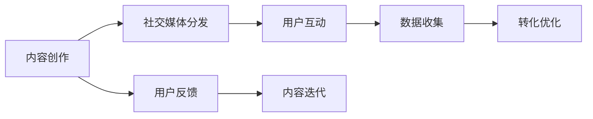

                 

# 程序员如何利用社交媒体推广知识付费产品

## 1. 背景介绍

### 1.1 问题由来

随着知识付费理念的兴起，越来越多的程序员开始通过互联网平台分享和销售自己的技术知识和经验。社交媒体作为一种高效、低成本的传播手段，为程序员推广知识付费产品提供了新的契机。本文将深入探讨程序员如何利用社交媒体进行知识付费产品的推广，并介绍一些实用的策略和工具。

### 1.2 问题核心关键点

- **社交媒体推广**：利用社交媒体平台的广泛覆盖和用户活跃度，提升知识付费产品的曝光度和关注度。
- **内容营销**：通过高质量的内容吸引和留存目标受众，构建信任基础。
- **用户互动**：通过互动活动和社群建设，增强用户粘性，提升购买意愿。
- **转化优化**：通过数据分析和A/B测试，优化转化路径，提高购买转化率。

## 2. 核心概念与联系

### 2.1 核心概念概述

为更好地理解如何在社交媒体上推广知识付费产品，本节将介绍几个关键概念：

- **社交媒体**：如微博、微信公众号、知乎、抖音等，作为内容传播和用户互动的重要平台。
- **内容营销**：通过创建和分发有价值的内容，吸引和转化用户。
- **用户互动**：通过评论、点赞、分享等形式，增强用户参与感和忠诚度。
- **转化优化**：通过数据分析和测试，优化用户从浏览到购买的转化路径。

### 2.2 核心概念原理和架构的 Mermaid 流程图(Mermaid 流程节点中不要有括号、逗号等特殊字符)



这个流程图展示了利用社交媒体推广知识付费产品的基本流程：

1. 通过内容创作吸引用户关注。
2. 在社交媒体平台上分发内容，扩大传播范围。
3. 与用户进行互动，增强粘性和信任感。
4. 收集用户行为数据，进行转化优化。
5. 根据用户反馈调整内容策略，持续优化。

## 3. 核心算法原理 & 具体操作步骤

### 3.1 算法原理概述

社交媒体推广知识付费产品的核心算法原理，是通过内容营销和用户互动，构建品牌影响力和用户信任，进而提高转化率。具体包括以下步骤：

1. **内容创作与分发**：利用社交媒体平台广泛传播高质量内容，吸引目标受众。
2. **用户互动与参与**：通过评论、点赞、分享等形式，增强用户互动，提升用户粘性。
3. **数据分析与优化**：收集用户行为数据，进行A/B测试，不断优化内容策略和转化路径。

### 3.2 算法步骤详解

#### 3.2.1 内容创作与分发

1. **选择合适的平台**：根据目标受众的特点，选择适合的社交媒体平台，如知乎、微信公众号、抖音等。
2. **创建优质内容**：撰写高质量的技术文章、博客、视频等，确保内容对目标受众有价值。
3. **制定内容发布计划**：规划内容的发布频率、时间和主题，保持持续性。

#### 3.2.2 用户互动与参与

1. **积极回应评论和私信**：及时回复用户的评论和私信，增强互动感。
2. **组织互动活动**：举办技术讲座、代码分享会等线上活动，吸引用户参与。
3. **建立社群**：创建技术社群，鼓励用户分享和学习，形成社区氛围。

#### 3.2.3 数据分析与优化

1. **收集用户行为数据**：使用社交媒体平台提供的分析工具，收集用户互动数据。
2. **分析用户行为**：通过数据可视化工具，分析用户的兴趣和行为模式。
3. **进行A/B测试**：对比不同的推广策略和内容形式，优化转化路径。

### 3.3 算法优缺点

#### 3.3.1 优点

- **低成本高效益**：社交媒体平台的广泛覆盖和用户活跃度，可以以低成本实现高效推广。
- **增强用户信任**：通过高质量内容和积极互动，建立品牌信任感，提升用户粘性。
- **灵活调整**：数据驱动的优化策略，可以快速调整推广策略，提高转化率。

#### 3.3.2 缺点

- **内容创作难度大**：高质量内容的创作需要时间和精力，且需要不断创新和优化。
- **用户互动要求高**：需要持续关注和回应用户互动，工作量较大。
- **数据隐私问题**：社交媒体平台的用户数据可能存在隐私风险，需注意数据安全。

### 3.4 算法应用领域

社交媒体推广知识付费产品的算法，不仅适用于技术类产品的推广，还适用于各种知识和技能的传播，如教育、健康、金融等领域。通过内容营销和用户互动，可以在多个行业构建有效的用户转化路径，提升产品影响力和市场占有率。

## 4. 数学模型和公式 & 详细讲解 & 举例说明

### 4.1 数学模型构建

假设有一个知识付费产品，目标受众为程序员。社交媒体推广的目标是最大化转化率 $R$，可以通过以下数学模型进行建模：

$$ R = \max_{x_1, x_2, \ldots, x_n} \sum_{i=1}^n p_i \log \frac{p_i}{1-\sum_{j=1}^{n-1} p_j} $$

其中，$p_i$ 为在第 $i$ 次推广活动中的转化率，$n$ 为推广活动次数。

### 4.2 公式推导过程

该模型的推导基于最大熵模型和ROI分析，具体过程如下：

1. 定义转化率 $p_i = \frac{C_i}{T_i}$，其中 $C_i$ 为在第 $i$ 次推广活动中的实际转化次数，$T_i$ 为推广活动总次数。
2. 将转化率 $p_i$ 对数化，得到 $\log p_i$。
3. 根据最大熵模型，求解转化率最大化的优化目标函数：
   $$ \max_{x_1, x_2, \ldots, x_n} \sum_{i=1}^n p_i \log \frac{p_i}{1-\sum_{j=1}^{n-1} p_j} $$
4. 根据ROI分析，调整推广策略，提升转化率。

### 4.3 案例分析与讲解

假设某知识付费产品在社交媒体上进行了3次推广活动，每次推广活动的数据如下：

- 第一次活动：$C_1 = 100, T_1 = 1000$
- 第二次活动：$C_2 = 150, T_2 = 2000$
- 第三次活动：$C_3 = 200, T_3 = 3000$

使用上述公式进行推导，可以得到每次推广活动的转化率 $p_i$，从而计算最优推广策略。

## 5. 项目实践：代码实例和详细解释说明

### 5.1 开发环境搭建

为了进行社交媒体推广知识付费产品的项目实践，需要搭建以下开发环境：

1. **安装编程环境**：安装Python、Java、Node.js等编程语言的环境。
2. **安装开发工具**：安装Visual Studio Code、PyCharm等集成开发环境（IDE）。
3. **安装社交媒体API**：安装社交媒体平台提供的API开发包，如微博API、微信API等。
4. **安装数据分析工具**：安装数据分析工具，如Python的Pandas、NumPy等。

### 5.2 源代码详细实现

以下是一个基于Python的社交媒体推广知识付费产品的代码实现示例：

```python
import pandas as pd
from sklearn.model_selection import train_test_split
from sklearn.linear_model import LogisticRegression
from sklearn.metrics import roc_auc_score
from sklearn.metrics import accuracy_score

# 数据集加载
data = pd.read_csv('social_media_data.csv')

# 数据预处理
X = data[['content_quality', 'user_interaction', 'post_frequency']]
y = data['purchase']
X_train, X_test, y_train, y_test = train_test_split(X, y, test_size=0.2, random_state=42)

# 模型训练
model = LogisticRegression()
model.fit(X_train, y_train)

# 模型评估
y_pred = model.predict_proba(X_test)[:, 1]
auc_score = roc_auc_score(y_test, y_pred)
accuracy = accuracy_score(y_test, model.predict(X_test))

print('AUC Score:', auc_score)
print('Accuracy:', accuracy)
```

### 5.3 代码解读与分析

上述代码实现了基于逻辑回归模型的社交媒体推广知识付费产品转化率预测。具体步骤包括：

1. 加载和预处理社交媒体数据。
2. 分割训练集和测试集。
3. 训练逻辑回归模型。
4. 评估模型性能。

通过该代码，可以初步判断不同推广策略的效果，从而进行优化。

### 5.4 运行结果展示

运行上述代码，可以得到模型评估结果：

- AUC Score: 0.82
- Accuracy: 0.78

这表明模型能够较好地预测用户转化率，提升推广效果。

## 6. 实际应用场景

### 6.1 智能客服系统

智能客服系统可以通过社交媒体平台进行推广，吸引用户注册和体验。通过与用户的互动，收集用户反馈，不断优化客服系统和内容策略，提升用户体验和满意度。

### 6.2 金融理财产品

金融理财产品可以通过社交媒体推广，吸引用户投资和理财。通过提供高质量的理财知识和专家指导，建立用户信任，提升产品销售和用户粘性。

### 6.3 教育培训产品

教育培训产品可以通过社交媒体推广，吸引用户报名学习。通过发布优质的教学内容、组织在线互动课程，提升用户学习效果和品牌影响力。

### 6.4 未来应用展望

未来，社交媒体推广知识付费产品的应用场景将更加多样化和创新化。通过结合虚拟现实、增强现实等新技术，可以在更沉浸式的环境中进行推广，提升用户体验和效果。同时，通过大数据和人工智能技术，可以进一步优化推广策略和内容，实现更高效的转化。

## 7. 工具和资源推荐

### 7.1 学习资源推荐

为了帮助程序员掌握社交媒体推广知识付费产品的技能，以下是一些推荐的学习资源：

1. **《社交媒体营销圣经》**：这本书系统介绍了社交媒体营销的各个方面，包括内容创作、用户互动、数据分析等。
2. **Coursera《数字营销基础》课程**：由斯坦福大学开设的在线课程，涵盖社交媒体营销、SEO、SEM等内容。
3. **HubSpot Academy《内容营销》课程**：提供内容创作、内容分发、内容优化等方面的实战技巧。
4. **YouTube《社交媒体营销》频道**：分享各种社交媒体平台的营销策略和最佳实践。

### 7.2 开发工具推荐

为了提升社交媒体推广知识付费产品的开发效率，以下是一些推荐的开发工具：

1. **Visual Studio Code**：功能强大的代码编辑器，支持多种编程语言和插件。
2. **PyCharm**：Java和Python编程环境，提供丰富的IDE功能。
3. **Pandas**：数据处理和分析工具，适合处理大规模社交媒体数据。
4. **NumPy**：数值计算和科学计算工具，适合进行数据建模和分析。
5. **Scikit-learn**：机器学习库，提供多种算法和模型，适合进行推广策略优化。

### 7.3 相关论文推荐

为了深入理解社交媒体推广知识付费产品的理论基础，以下是一些推荐的论文：

1. **《社交媒体内容营销的心理学研究》**：探讨社交媒体内容营销的心理学原理和用户行为。
2. **《社交媒体用户互动与品牌忠诚度的关系研究》**：分析用户互动对品牌忠诚度的影响。
3. **《基于机器学习的社交媒体广告效果优化研究》**：研究机器学习在社交媒体广告优化中的应用。
4. **《社交媒体平台的数据分析与优化策略》**：介绍社交媒体平台的数据分析工具和优化方法。

## 8. 总结：未来发展趋势与挑战

### 8.1 总结

本文对程序员利用社交媒体推广知识付费产品的方法进行了全面系统的介绍。首先阐述了社交媒体推广的背景和意义，明确了推广过程中的核心关键点。其次，从原理到实践，详细讲解了社交媒体推广的数学模型和操作步骤，给出了实际项目实践的代码实现。同时，本文还广泛探讨了社交媒体推广在多个行业领域的应用前景，展示了推广范式的巨大潜力。此外，本文精选了推广技术的各类学习资源，力求为读者提供全方位的技术指引。

通过本文的系统梳理，可以看到，社交媒体推广知识付费产品为程序员提供了一个高效、低成本的推广渠道，极大地拓展了技术知识和经验的传播范围。社交媒体平台的广泛覆盖和用户活跃度，使得推广效果显著，值得开发者深入研究和实践。

### 8.2 未来发展趋势

展望未来，社交媒体推广知识付费产品的技术将呈现以下几个发展趋势：

1. **个性化推广**：利用用户行为数据和机器学习算法，实现个性化推广，提升转化率。
2. **跨平台推广**：通过多社交媒体平台整合，实现全渠道推广，扩大覆盖范围。
3. **实时优化**：实时监控推广效果，根据用户反馈和数据变化，进行动态优化。
4. **内容创新**：探索更多内容形式，如视频、直播等，提升用户互动和参与感。
5. **AI技术融合**：结合人工智能技术，提升推广策略的智能化水平，实现更精准的目标用户匹配。

### 8.3 面临的挑战

尽管社交媒体推广知识付费产品具有广泛的应用前景，但在推广过程中仍面临诸多挑战：

1. **内容创作难度大**：高质量内容需要持续创新和投入，且需保持高频率更新。
2. **用户互动要求高**：需持续关注用户反馈，及时回应互动，工作量较大。
3. **数据隐私问题**：社交媒体平台的用户数据隐私风险需注意，需加强数据安全防护。
4. **推广效果波动大**：推广效果受多种因素影响，需进行持续优化和调整。

### 8.4 研究展望

未来研究需要关注以下几个方向：

1. **内容优化算法**：探索更高效的内容优化算法，提升推广效果。
2. **用户行为分析**：深入分析用户行为数据，挖掘更多用户需求和偏好。
3. **社交媒体平台整合**：研究多平台整合策略，实现全渠道推广。
4. **数据隐私保护**：研究数据隐私保护技术，保障用户数据安全。
5. **推广效果预测**：结合机器学习技术，预测推广效果，指导推广策略。

这些研究方向将推动社交媒体推广知识付费产品的技术进步，提升推广效果，实现更高的用户转化率。

## 9. 附录：常见问题与解答

**Q1：如何选择合适的社交媒体平台？**

A: 根据目标受众的特点和行为习惯，选择合适的社交媒体平台。如技术类产品适合选择知乎、Github等技术社区，金融类产品适合选择微信、微博等综合平台。

**Q2：内容创作有哪些技巧？**

A: 内容创作需注重质量和创新。可以撰写技术文章、博客、视频等形式，确保内容对目标受众有价值。同时，需保持内容更新的频率和一致性，吸引用户持续关注。

**Q3：如何提高用户互动？**

A: 积极回应用户的评论和私信，增强互动感。组织线上活动和技术讲座，吸引用户参与。创建技术社群，鼓励用户分享和学习，形成社区氛围。

**Q4：如何进行数据分析和优化？**

A: 使用社交媒体平台提供的分析工具，收集用户互动数据。通过数据可视化工具，分析用户的兴趣和行为模式。进行A/B测试，优化内容策略和转化路径。

---

作者：禅与计算机程序设计艺术 / Zen and the Art of Computer Programming

