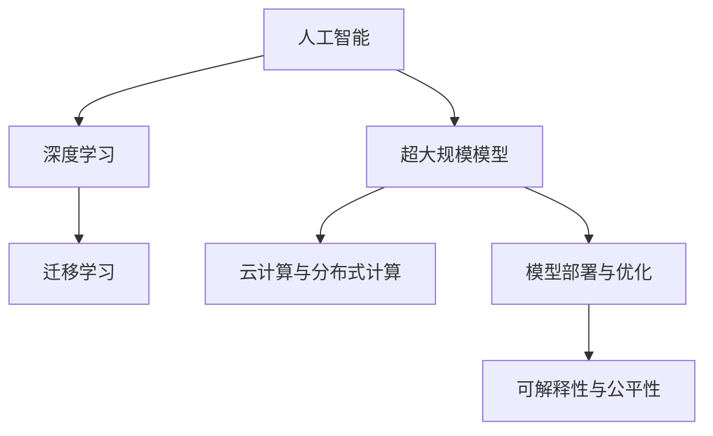
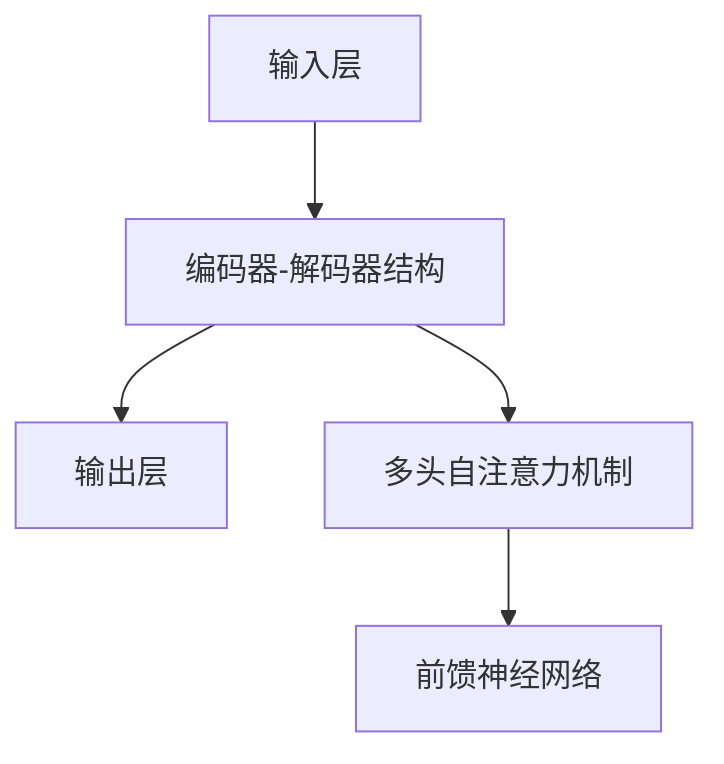

                 

# 程序员如何应对人工智能带来的挑战

## 1. 背景介绍

### 1.1 问题由来

随着人工智能(AI)技术的迅猛发展，程序员面临的挑战也日益增多。从早期的编程语言选择、框架挑选，到现在的算法优化、模型训练，AI时代程序员的工作已经变得更为复杂和多样化。如何在AI浪潮中保持竞争力和创新力，成为每个程序员都需面对的重要课题。

### 1.2 问题核心关键点

AI时代的挑战主要集中在以下几个方面：

- **算法复杂化**：深度学习、强化学习、迁移学习等复杂算法要求程序员具备更强的数学和统计学基础。
- **模型训练**：超大规模模型如Transformer、BERT等的训练和优化，需要极高的算力和内存消耗。
- **数据处理**：海量数据的处理、清洗、标注，成为模型训练的关键瓶颈。
- **部署优化**：如何将高精度模型高效地部署到生产环境中，是AI应用落地的重要问题。
- **伦理与安全**：AI模型的公平性、可解释性、安全性等问题，对程序员提出了更高的要求。

### 1.3 问题研究意义

掌握AI技术的挑战与应对策略，不仅有助于程序员提升技术水平，还能助力企业实现智能化转型，提升竞争力。特别是在金融、医疗、教育等传统行业，AI技术的应用将带来深刻的变革，程序员需具备快速适应和学习的能力。

## 2. 核心概念与联系

### 2.1 核心概念概述

为更好地理解如何应对AI带来的挑战，本节将介绍几个核心概念及其相互联系：

- **人工智能(AI)**：涵盖机器学习、深度学习、强化学习等技术，旨在使计算机具备类似人类的智能。
- **深度学习(Deep Learning)**：基于神经网络的大规模机器学习技术，具备强大的特征提取和模式识别能力。
- **迁移学习(Transfer Learning)**：将一个领域学到的知识，迁移应用到另一个相关领域，减少训练新模型所需的数据和时间。
- **超大规模模型(如Transformer、BERT)**：动辄亿级参数的预训练模型，具有出色的泛化能力，但训练和优化要求高。
- **云计算与分布式计算**：AI模型的训练和推理需要大量计算资源，云计算和分布式计算提供了高效的解决方案。
- **模型部署与优化**：将高精度模型高效部署到生产环境中，并进行性能优化，是AI应用落地的关键环节。
- **可解释性与公平性**：AI模型的决策过程应可解释，避免偏见和歧视，保证输出符合伦理要求。

这些核心概念通过以下Mermaid流程图展示其逻辑关系：



这个流程图展示了AI技术的核心概念及其相互关系：

1. AI技术基于深度学习实现，具备强大的特征提取和模式识别能力。
2. 迁移学习通过预训练模型，减少新任务所需的数据和训练时间。
3. 超大规模模型提供了强大的泛化能力，但训练和优化要求高。
4. 云计算与分布式计算提供了高效计算资源，支持模型训练和推理。
5. 模型部署与优化确保AI模型的高效应用。
6. 可解释性与公平性保障了AI技术的可靠性和道德性。

## 3. 核心算法原理 & 具体操作步骤

### 3.1 算法原理概述

在AI时代，程序员面临的主要挑战之一是如何应对算法复杂化。深度学习、迁移学习和超大规模模型等技术，要求程序员具备更强的数学和统计学基础。

深度学习模型通过反向传播算法优化损失函数，最小化模型预测与真实标签之间的差异。迁移学习通过在预训练模型的基础上进行微调，提升模型在特定任务上的性能。超大规模模型通过预训练和微调，学习丰富的语言知识，具备强大的自然语言处理能力。

### 3.2 算法步骤详解

以下详细介绍如何应对AI带来的挑战，涵盖算法选择、数据处理、模型训练、优化与部署等关键步骤：

**步骤1：选择合适的算法与模型**
- 对于分类任务，如文本分类、图像分类等，可使用深度学习中的卷积神经网络(CNN)或循环神经网络(RNN)。
- 对于生成任务，如机器翻译、文本生成等，Transformer和BERT等自编码模型效果显著。
- 对于强化学习任务，如游戏AI、机器人控制等，可使用深度Q网络(DQN)、策略梯度等方法。

**步骤2：数据预处理**
- 数据清洗：去除噪声、错误、重复等无效数据。
- 数据增强：通过旋转、平移、裁剪等操作扩充训练集。
- 数据标注：给数据集添加标签，训练监督学习模型。

**步骤3：模型训练**
- 选择合适的损失函数，如交叉熵、均方误差等。
- 设置优化算法，如随机梯度下降(SGD)、Adam等，并设定学习率、批次大小等超参数。
- 划分训练集、验证集和测试集，使用交叉验证等方法进行模型验证。

**步骤4：模型优化**
- 应用正则化技术，如L2正则、Dropout等，避免过拟合。
- 使用梯度累积、混合精度训练等方法优化资源消耗。
- 应用对抗训练，提高模型鲁棒性。

**步骤5：模型部署**
- 选择合适的部署平台，如AWS、Google Cloud等。
- 将模型保存为二进制文件，部署为RESTful API或微服务。
- 使用TensorFlow Serving、TorchScript等工具进行推理优化。

### 3.3 算法优缺点

深度学习和迁移学习的主要优点包括：

- 强大特征提取能力：学习大量特征，适用于各种复杂任务。
- 泛化能力强：通过预训练模型，可以适应不同领域和任务。

但这些技术也存在一些缺点：

- 训练时间长：超大规模模型需要大量计算资源和时间。
- 数据依赖性高：需要大量高质量标注数据。
- 可解释性不足：模型决策过程难以解释，不透明。

### 3.4 算法应用领域

深度学习和迁移学习技术，已在众多领域得到广泛应用，例如：

- **自然语言处理(NLP)**：文本分类、情感分析、机器翻译等。
- **计算机视觉(CV)**：图像识别、目标检测、人脸识别等。
- **语音识别(SR)**：语音转文本、语音合成、说话人识别等。
- **推荐系统**：协同过滤、内容推荐、个性化推荐等。
- **游戏AI**：玩家行为预测、游戏策略优化等。

## 4. 数学模型和公式 & 详细讲解 & 举例说明

### 4.1 数学模型构建

在AI技术中，数学模型的构建是理解算法核心思想的重要环节。

**深度学习模型**：以多层神经网络为代表的深度学习模型，其核心是权重和偏置的优化。设神经网络为 $f(\mathbf{x};\theta)=\sum_{i=1}^M w_i\sigma(z_i)$，其中 $z_i=\mathbf{W}_i\mathbf{x}+b_i$。

**迁移学习模型**：以预训练模型为基础，微调模型参数。设预训练模型为 $f_{pre}(\mathbf{x})$，微调模型为 $f_{micro}(\mathbf{x};\theta_{micro})$。

**超大规模模型**：如Transformer模型，其结构如图：



### 4.2 公式推导过程

以下以**多层神经网络**为例，推导其前向传播和反向传播过程：

**前向传播**：
$$
f(\mathbf{x};\theta)=\sum_{i=1}^M w_i\sigma(z_i)=\sum_{i=1}^M w_i\sigma(\mathbf{W}_i\mathbf{x}+b_i)
$$

**反向传播**：
$$
\frac{\partial L(f(\mathbf{x};\theta),y)}{\partial w_i}=\frac{\partial L(f(\mathbf{x};\theta),y)}{\partial z_i}\frac{\partial z_i}{\partial w_i}=\frac{\partial L(f(\mathbf{x};\theta),y)}{\partial z_i}w_i
$$

其中，$L(f(\mathbf{x};\theta),y)$ 为损失函数。

### 4.3 案例分析与讲解

**案例：图像分类任务**

- **数据预处理**：将图像标准化，转换为张量形式。
- **模型选择**：使用卷积神经网络。
- **模型训练**：设置交叉熵损失函数，使用Adam优化器。
- **模型优化**：应用正则化，避免过拟合。
- **模型部署**：将模型保存为TensorFlow SavedModel格式，部署到Google Cloud平台。

## 5. 项目实践：代码实例和详细解释说明

### 5.1 开发环境搭建

在进行AI项目实践前，需准备好开发环境。以下是使用Python进行TensorFlow开发的环境配置流程：

1. 安装Anaconda：从官网下载并安装Anaconda，用于创建独立的Python环境。

2. 创建并激活虚拟环境：
```bash
conda create -n tf-env python=3.8 
conda activate tf-env
```

3. 安装TensorFlow：根据CUDA版本，从官网获取对应的安装命令。例如：
```bash
conda install tensorflow==2.6.0
```

4. 安装各类工具包：
```bash
pip install numpy pandas scikit-learn matplotlib tqdm jupyter notebook ipython
```

完成上述步骤后，即可在`tf-env`环境中开始AI项目的开发。

### 5.2 源代码详细实现

下面以图像分类任务为例，给出使用TensorFlow对卷积神经网络进行训练的PyTorch代码实现。

首先，定义数据集和模型：

```python
import tensorflow as tf
from tensorflow.keras import datasets, layers, models

(train_images, train_labels), (test_images, test_labels) = datasets.cifar10.load_data()

model = models.Sequential()
model.add(layers.Conv2D(32, (3, 3), activation='relu', input_shape=(32, 32, 3)))
model.add(layers.MaxPooling2D((2, 2)))
model.add(layers.Conv2D(64, (3, 3), activation='relu'))
model.add(layers.MaxPooling2D((2, 2)))
model.add(layers.Conv2D(64, (3, 3), activation='relu'))
model.add(layers.Flatten())
model.add(layers.Dense(64, activation='relu'))
model.add(layers.Dense(10))
```

然后，定义损失函数和优化器：

```python
model.compile(optimizer='adam',
              loss=tf.keras.losses.SparseCategoricalCrossentropy(from_logits=True),
              metrics=['accuracy'])
```

接着，定义训练和评估函数：

```python
def train_model(model, epochs, dataset):
    model.fit(dataset.train_images, dataset.train_labels, epochs=epochs, validation_data=dataset.test_images, validation_labels=dataset.test_labels)

def evaluate_model(model, dataset):
    test_loss, test_acc = model.evaluate(dataset.test_images, dataset.test_labels, verbose=2)
    print('\nTest accuracy:', test_acc)
```

最后，启动训练流程并在测试集上评估：

```python
epochs = 10
dataset = ...

train_model(model, epochs, dataset)
evaluate_model(model, dataset)
```

以上就是使用TensorFlow对卷积神经网络进行图像分类任务训练的完整代码实现。可以看到，得益于TensorFlow的强大封装，我们可以用相对简洁的代码完成模型的搭建、训练和评估。

### 5.3 代码解读与分析

让我们再详细解读一下关键代码的实现细节：

**train_model函数**：
- 使用`fit`方法对模型进行训练，设定训练轮数、验证集等参数。

**evaluate_model函数**：
- 使用`evaluate`方法对模型进行测试，计算测试集的准确率，输出结果。

**代码实现**：
- `train_model`和`evaluate_model`函数的参数分别为模型、轮数和数据集。
- 训练函数使用`fit`方法进行模型训练，调用`evaluate`方法评估模型性能。

可以看出，TensorFlow的高级API使得模型训练的代码实现变得简洁高效。开发者可以将更多精力放在数据处理、模型改进等高层逻辑上，而不必过多关注底层的实现细节。

当然，工业级的系统实现还需考虑更多因素，如模型的保存和部署、超参数的自动搜索、更灵活的模型构建等。但核心的训练范式基本与此类似。

## 6. 实际应用场景

### 6.1 智能客服系统

基于深度学习和大规模模型微调的对话技术，可以广泛应用于智能客服系统的构建。传统客服往往需要配备大量人力，高峰期响应缓慢，且一致性和专业性难以保证。而使用深度学习模型进行微调的对话模型，可以7x24小时不间断服务，快速响应客户咨询，用自然流畅的语言解答各类常见问题。

在技术实现上，可以收集企业内部的历史客服对话记录，将问题和最佳答复构建成监督数据，在此基础上对预训练模型进行微调。微调后的对话模型能够自动理解用户意图，匹配最合适的答案模板进行回复。对于客户提出的新问题，还可以接入检索系统实时搜索相关内容，动态组织生成回答。如此构建的智能客服系统，能大幅提升客户咨询体验和问题解决效率。

### 6.2 金融舆情监测

金融机构需要实时监测市场舆论动向，以便及时应对负面信息传播，规避金融风险。传统的人工监测方式成本高、效率低，难以应对网络时代海量信息爆发的挑战。基于深度学习模型进行文本分类和情感分析的舆情监测技术，为金融舆情监测提供了新的解决方案。

具体而言，可以收集金融领域相关的新闻、报道、评论等文本数据，并对其进行主题标注和情感标注。在此基础上对深度学习模型进行微调，使其能够自动判断文本属于何种主题，情感倾向是正面、中性还是负面。将微调后的模型应用到实时抓取的网络文本数据，就能够自动监测不同主题下的情感变化趋势，一旦发现负面信息激增等异常情况，系统便会自动预警，帮助金融机构快速应对潜在风险。

### 6.3 个性化推荐系统

当前的推荐系统往往只依赖用户的历史行为数据进行物品推荐，无法深入理解用户的真实兴趣偏好。基于深度学习模型进行微调的个性化推荐系统，可以更好地挖掘用户行为背后的语义信息，从而提供更精准、多样的推荐内容。

在实践中，可以收集用户浏览、点击、评论、分享等行为数据，提取和用户交互的物品标题、描述、标签等文本内容。将文本内容作为模型输入，用户的后续行为（如是否点击、购买等）作为监督信号，在此基础上微调深度学习模型。微调后的模型能够从文本内容中准确把握用户的兴趣点。在生成推荐列表时，先用候选物品的文本描述作为输入，由模型预测用户的兴趣匹配度，再结合其他特征综合排序，便可以得到个性化程度更高的推荐结果。

### 6.4 未来应用展望

随着深度学习模型的不断发展，其在实际应用中的表现将更加出色。未来，深度学习模型将在更多领域得到应用，为传统行业带来变革性影响。

在智慧医疗领域，基于深度学习模型的医学影像分析、病理诊断、药物研发等应用将提升医疗服务的智能化水平，辅助医生诊疗，加速新药开发进程。

在智能教育领域，深度学习模型可应用于作业批改、学情分析、知识推荐等方面，因材施教，促进教育公平，提高教学质量。

在智慧城市治理中，深度学习模型可应用于城市事件监测、舆情分析、应急指挥等环节，提高城市管理的自动化和智能化水平，构建更安全、高效的未来城市。

此外，在企业生产、社会治理、文娱传媒等众多领域，深度学习模型也将不断涌现，为经济社会发展注入新的动力。相信随着技术的日益成熟，深度学习模型必将在更广阔的应用领域大放异彩。

## 7. 工具和资源推荐

### 7.1 学习资源推荐

为了帮助开发者系统掌握深度学习和大规模模型的理论基础和实践技巧，这里推荐一些优质的学习资源：

1. **《深度学习》书籍**：Ian Goodfellow、Yoshua Bengio和Aaron Courville合著的《深度学习》（Deep Learning）一书，是深度学习领域的经典教材，详细介绍了深度学习的原理和应用。

2. **Coursera《深度学习专项课程》**：由Coursera与DeepLearning.ai合作开设的专项课程，由深度学习领域的专家讲授，涵盖了深度学习的各个核心领域。

3. **fast.ai《深度学习实践》书籍**：Jeremy Howard和Rachel Thomas合著的《深度学习实践》（Practical Deep Learning for Coders），提供了大量的实战案例和代码示例，适合编程新手。

4. **Kaggle竞赛**：Kaggle是一个数据科学竞赛平台，举办了大量的深度学习竞赛，参与竞赛不仅能提升技术水平，还能获取实际项目经验。

5. **GitHub代码库**：GitHub上汇聚了大量的深度学习项目和代码库，是学习、交流和贡献代码的好去处。

通过对这些资源的学习实践，相信你一定能够快速掌握深度学习和大规模模型的精髓，并用于解决实际的AI问题。

### 7.2 开发工具推荐

高效的开发离不开优秀的工具支持。以下是几款用于深度学习模型开发和训练的常用工具：

1. **PyTorch**：基于Python的开源深度学习框架，灵活动态的计算图，适合快速迭代研究。大多数深度学习模型都有PyTorch版本的实现。

2. **TensorFlow**：由Google主导开发的开源深度学习框架，生产部署方便，适合大规模工程应用。同样有丰富的深度学习模型资源。

3. **JAX**：Google开发的高级Python库，提供了自动微分、分布式计算等功能，支持动态计算图，适合学术研究。

4. **MXNet**：由Apache软件基金会开发的深度学习框架，支持多种编程语言，适合跨平台部署。

5. **ONNX**：Open Neural Network Exchange，提供了模型格式的标准化转换，支持多种深度学习框架的互操作。

合理利用这些工具，可以显著提升深度学习模型开发和训练的效率，加快创新迭代的步伐。

### 7.3 相关论文推荐

深度学习模型的发展源于学界的持续研究。以下是几篇奠基性的相关论文，推荐阅读：

1. **AlexNet**：Hinton等人发表的AlexNet论文，展示了卷积神经网络在图像分类任务上的优异表现。

2. **VGGNet**：Simonyan和Zisserman发表的VGGNet论文，提出19层卷积神经网络，进一步提升了图像分类精度。

3. **ResNet**：He等人发表的ResNet论文，提出残差网络结构，有效解决了深层网络训练中的梯度消失问题。

4. **Transformer**：Vaswani等人发表的Transformer论文，提出自注意力机制，为自然语言处理任务的模型训练提供了新思路。

5. **BERT**：Devlin等人发表的BERT论文，提出基于掩码语言模型预训练，提升了模型的语义理解能力。

这些论文代表了大规模模型的发展脉络。通过学习这些前沿成果，可以帮助研究者把握学科前进方向，激发更多的创新灵感。

## 8. 总结：未来发展趋势与挑战

### 8.1 总结

本文对深度学习和迁移学习技术进行了全面系统的介绍。首先阐述了深度学习和迁移学习在AI时代的重要地位，明确了模型训练、优化和部署的关键点。其次，从原理到实践，详细讲解了深度学习模型的构建、训练和优化过程，给出了模型训练和评估的完整代码示例。同时，本文还广泛探讨了深度学习模型在智能客服、金融舆情、个性化推荐等多个领域的应用前景，展示了深度学习技术的强大潜力。

通过本文的系统梳理，可以看到，深度学习和迁移学习技术正在成为AI领域的重要范式，极大地拓展了模型的应用边界，催生了更多的落地场景。受益于大规模数据的预训练，深度学习模型以更低的时间和数据成本，在小样本条件下也能取得出色的效果，有力推动了AI技术的产业化进程。未来，伴随深度学习模型的持续演进，相信AI技术必将在更广阔的应用领域大放异彩，深刻影响人类的生产生活方式。

### 8.2 未来发展趋势

展望未来，深度学习模型的发展呈现以下几个趋势：

1. **模型规模持续增大**：随着算力成本的下降和数据规模的扩张，深度学习模型的参数量还将持续增长。超大规模模型蕴含的丰富特征，有望支撑更加复杂多变的下游任务。

2. **模型结构更加灵活**：深度学习模型将从单一结构（如卷积神经网络、循环神经网络）向混合结构（如混合CNN-RNN、Transformer等）发展，以适应更广泛的领域和任务。

3. **训练与优化更加高效**：高效的训练与优化技术，如分布式训练、模型并行、量化加速等，将进一步降低模型训练时间和资源消耗，提升模型性能。

4. **可解释性与公平性增强**：深度学习模型的决策过程应更加可解释，避免偏见和歧视，保证输出符合伦理要求。

5. **跨领域迁移能力提升**：通过跨领域迁移学习，深度学习模型将具备更强的泛化能力，适应更多领域和任务。

6. **模型通用性增强**：深度学习模型将具备更强的常识推理和跨领域迁移能力，逐步迈向通用人工智能(AGI)的目标。

以上趋势凸显了深度学习模型在AI时代的重要地位和广阔前景。这些方向的探索发展，必将进一步提升深度学习模型的性能和应用范围，为构建智能系统提供更强大的技术支撑。

### 8.3 面临的挑战

尽管深度学习模型已经取得了显著成就，但在迈向更加智能化、普适化应用的过程中，仍面临诸多挑战：

1. **数据质量瓶颈**：深度学习模型对数据质量要求高，需要大量的高质量标注数据，获取成本高。

2. **模型鲁棒性不足**：深度学习模型面对数据噪声和攻击时，鲁棒性差，容易过拟合。

3. **计算资源需求高**：深度学习模型训练和推理需要大量计算资源，GPU/TPU等高性能设备是必不可少的。

4. **模型可解释性不足**：深度学习模型的决策过程难以解释，不透明。

5. **伦理与安全问题**：深度学习模型可能学习到有偏见、有害的信息，需要确保模型的公平性和安全性。

6. **资源消耗大**：深度学习模型推理和训练的资源消耗大，需要优化以降低成本。

正视深度学习模型面临的这些挑战，积极应对并寻求突破，将使模型在应用落地时更加稳定、高效、可靠。

### 8.4 未来突破

面对深度学习模型所面临的挑战，未来的研究需要在以下几个方面寻求新的突破：

1. **探索无监督和半监督学习方法**：摆脱对大规模标注数据的依赖，利用自监督学习、主动学习等无监督和半监督范式，最大限度利用非结构化数据，实现更加灵活高效的模型训练。

2. **开发更高效的优化算法**：如AdamW、Adafactor等，以及混合精度训练、模型并行等技术，提升模型的训练效率和效果。

3. **引入更多先验知识**：将符号化的先验知识，如知识图谱、逻辑规则等，与神经网络模型进行巧妙融合，引导模型学习更准确、合理的特征表示。

4. **融合因果分析和博弈论工具**：将因果分析方法引入模型，增强模型的决策因果性和逻辑性，借助博弈论工具优化模型，避免模型脆弱点。

5. **增强可解释性**：引入可解释性技术，如LIME、SHAP等，增强模型的决策透明度，提升模型的可信度。

6. **优化模型性能**：通过模型压缩、稀疏化存储等方法，优化模型推理速度和资源占用，提高模型在实际应用中的效率。

这些研究方向的探索，必将引领深度学习模型迈向更高的台阶，为构建安全、可靠、可解释、可控的智能系统铺平道路。面向未来，深度学习模型还需要与其他AI技术进行更深入的融合，如知识表示、因果推理、强化学习等，多路径协同发力，共同推动智能系统的进步。只有勇于创新、敢于突破，才能不断拓展深度学习模型的边界，让智能技术更好地造福人类社会。

## 9. 附录：常见问题与解答

**Q1：如何选择合适的深度学习框架？**

A: 选择深度学习框架时，需考虑以下因素：
1. **易用性**：框架的API是否易用，文档是否详细。
2. **社区支持**：框架是否有活跃的社区和丰富的第三方库支持。
3. **性能**：框架的计算速度、内存占用等性能指标。
4. **可扩展性**：框架是否支持分布式计算、混合精度等高级特性。

常用框架包括PyTorch、TensorFlow、MXNet等，各有优缺点。选择时应根据实际需求和团队技术栈进行评估。

**Q2：深度学习模型的可解释性有哪些方法？**

A: 深度学习模型的可解释性主要通过以下方法实现：
1. **LIME**：局部可解释模型-不可解释模型方法，通过生成扰动数据，计算模型对扰动的敏感度。
2. **SHAP**：SHapley Additive exPlanations，通过计算特征贡献度，解释模型的预测。
3. **Grad-CAM**：通过反向传播计算特征图，可视化模型的关注区域。

这些方法可以帮助理解深度学习模型的决策过程，提升模型的可信度和透明度。

**Q3：如何避免深度学习模型的过拟合？**

A: 避免过拟合的策略包括：
1. **数据增强**：通过旋转、平移、裁剪等操作扩充训练集。
2. **正则化**：使用L2正则、Dropout等避免过拟合。
3. **早停法**：在验证集性能不再提升时，停止训练，避免过拟合。
4. **模型集成**：通过多个模型的集成，减少过拟合风险。

这些策略往往需要根据具体任务和数据特点进行灵活组合。只有在数据、模型、训练、推理等各环节进行全面优化，才能最大限度地避免过拟合。

**Q4：如何高效部署深度学习模型？**

A: 高效部署深度学习模型的策略包括：
1. **模型裁剪**：去除不必要的层和参数，减小模型尺寸，加快推理速度。
2. **量化加速**：将浮点模型转为定点模型，压缩存储空间，提高计算效率。
3. **分布式部署**：将模型部署在多个服务器上，实现分布式推理。
4. **模型压缩**：通过模型压缩、稀疏化存储等方法，优化模型推理速度和资源占用。

合理利用这些策略，可以显著提升深度学习模型在实际应用中的效率。

**Q5：如何评估深度学习模型的性能？**

A: 评估深度学习模型的性能主要通过以下指标：
1. **准确率**：分类任务的常用指标，表示模型预测正确的样本占总样本的比例。
2. **召回率**：对于正样本，模型能够正确预测的比例。
3. **F1分数**：准确率和召回率的调和平均数，综合评估模型性能。
4. **AUC-ROC曲线**：评估二分类任务的模型性能，曲线下的面积越接近1，表示模型性能越好。
5. **混淆矩阵**：评估分类任务的模型预测结果，帮助理解模型的错误类型。

选择合适的评估指标，结合实际应用场景，综合评估模型的性能表现。

---

作者：禅与计算机程序设计艺术 / Zen and the Art of Computer Programming

