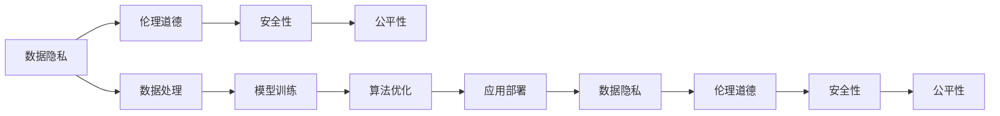

                 

# 程序员如何应对人工智能挑战

## 1. 背景介绍

### 1.1 问题由来
在数字化和智能化的浪潮中，人工智能(AI)技术已经成为推动各行各业发展的关键力量。人工智能不仅在科研、工业、医疗、金融等领域大放异彩，也开始逐渐渗透到日常生活的各个角落，从智能家居、智慧办公，到在线教育、在线娱乐，AI正深刻改变着人类的生活方式。然而，人工智能的发展也带来了许多挑战，诸如数据隐私、伦理道德、安全性、公平性等问题。这些挑战不仅关乎技术，更关系到人类的福祉和社会的稳定。

### 1.2 问题核心关键点
AI的广泛应用带来了诸多挑战，其中数据隐私、伦理道德、安全性、公平性是主要问题：
- **数据隐私**：AI系统需要大量数据进行训练，而这些数据往往包含用户个人信息，如何保护数据隐私成为一个重要问题。
- **伦理道德**：AI系统可能会出现偏见、歧视、不透明等问题，如何设计出公平、公正、可解释的系统是一个关键挑战。
- **安全性**：AI系统可能会被恶意攻击者利用，如何确保系统的安全性，防止被攻击、篡改、滥用是一个重要问题。
- **公平性**：AI系统需要考虑到不同群体、不同区域的需求，避免出现“数字鸿沟”，确保AI技术为所有人服务。

### 1.3 问题研究意义
理解并应对这些挑战，对推动AI技术的健康发展具有重要意义：
- **保障用户权益**：保护用户隐私，确保AI系统的公平性，让AI技术真正为人类服务。
- **提升AI系统性能**：通过解决AI系统存在的伦理道德和安全性问题，提升AI系统的可信度和接受度。
- **促进AI技术普及**：通过技术创新和规范制定，确保AI技术的应用能够符合社会伦理和法律规范，促进AI技术的广泛应用。
- **推动AI技术进步**：针对AI系统面临的挑战进行研究，推动AI技术的进一步发展和完善。

## 2. 核心概念与联系

### 2.1 核心概念概述
人工智能（AI）涵盖了从数据处理、模型训练、算法优化、应用部署等多个环节，而数据隐私、伦理道德、安全性、公平性等挑战则贯穿于整个AI生命周期。

- **数据隐私**：指个人数据的保密性和保护性，防止未经授权的访问和使用。数据隐私保护是AI应用中的核心问题，尤其在使用大数据进行训练时更为重要。
- **伦理道德**：指AI系统在决策和行为上的道德原则，确保AI系统符合社会公德和人类价值观。伦理道德是AI系统设计和部署的基础，涉及公平、透明、可解释等原则。
- **安全性**：指AI系统能够抵御各种攻击，确保系统的稳定性和可用性。安全性是AI系统在实际应用中的重要保障，涉及数据安全、系统安全等多个方面。
- **公平性**：指AI系统在处理不同群体、不同地域时，能够公平对待，避免偏见和歧视。公平性是AI系统面向大众和社会应用的前提，也是评估AI系统性能的重要指标。

这些核心概念之间存在紧密联系，相互影响，共同构成了AI技术应用的完整生态。以下是这些核心概念的逻辑关系：



从数据处理到模型训练，再到算法优化和应用部署，每一个环节都涉及到数据隐私、伦理道德、安全性、公平性的考量。只有在每个环节都严格遵循这些原则，才能构建出安全、公正、可靠的AI系统。

## 3. 核心算法原理 & 具体操作步骤

### 3.1 算法原理概述

在AI应用中，数据隐私、伦理道德、安全性、公平性等挑战都需要通过算法和技术的优化来解决。具体来说，数据隐私保护可以通过数据加密、去标识化等技术手段实现；伦理道德可以通过公平性约束、透明度提升等方法实现；安全性可以通过模型加固、对抗训练等技术手段实现；公平性可以通过数据集平衡、权重调整等方法实现。

AI的算法和模型设计往往需要跨学科的知识，涉及到统计学、计算机科学、法律、伦理学等多个领域。因此，跨学科的合作和知识融合是解决AI挑战的关键。

### 3.2 算法步骤详解

#### 3.2.1 数据隐私保护

数据隐私保护是AI应用中的重要问题。常见的数据隐私保护技术包括：
- **数据加密**：对数据进行加密处理，确保数据在传输和存储过程中不被窃取。
- **去标识化**：通过删除或匿名化数据中的个人标识信息，防止数据被追踪和识别。
- **差分隐私**：在数据查询和分析时，添加噪声，确保个体数据不被泄露。

#### 3.2.2 伦理道德设计

AI系统的伦理道德设计需要考虑以下关键点：
- **公平性**：确保AI系统在处理不同群体、不同地域时，能够公平对待，避免偏见和歧视。
- **透明性**：确保AI系统的决策过程可解释，用户能够理解系统的行为和决策依据。
- **可控性**：确保用户对AI系统具有控制权，能够对其行为进行干预和调整。

#### 3.2.3 安全性加固

AI系统的安全性需要考虑以下几个方面：
- **数据安全**：确保数据在存储和传输过程中不被窃取、篡改。
- **系统安全**：确保AI系统能够抵御各种攻击，如对抗攻击、植入攻击等。
- **物理安全**：确保AI系统部署环境的安全，防止物理攻击。

#### 3.2.4 公平性优化

公平性优化是AI系统面向大众和社会应用的前提。常见的方法包括：
- **数据集平衡**：确保训练数据集包含不同群体、不同地域的数据，避免数据偏见。
- **权重调整**：对不同群体、不同地域的数据给予不同的权重，确保模型能够公平处理。

### 3.3 算法优缺点

#### 3.3.1 数据隐私保护
**优点**：
- 加密和去标识化技术可以有效保护数据隐私，防止数据泄露。
- 差分隐私可以在数据查询和分析时保护个体数据，确保数据匿名性。

**缺点**：
- 数据加密和去标识化会增加计算和存储成本，影响系统效率。
- 差分隐私可能导致数据精度降低，影响模型性能。

#### 3.3.2 伦理道德设计
**优点**：
- 公平性约束和透明性设计可以提高AI系统的公正性和可解释性。
- 可控性设计可以增强用户对AI系统的信任和接受度。

**缺点**：
- 设计公平性和透明性可能增加系统复杂度，影响开发效率。
- 可控性设计可能需要更多的用户交互和反馈，增加了系统复杂性。

#### 3.3.3 安全性加固
**优点**：
- 模型加固和对抗训练可以有效提高AI系统的安全性，防止攻击和篡改。
- 物理安全设计可以防止AI系统部署环境的安全威胁。

**缺点**：
- 安全性加固可能增加系统复杂度和成本，影响系统性能。
- 对抗攻击的防御可能使得模型复杂度增加，影响推理速度。

#### 3.3.4 公平性优化
**优点**：
- 数据集平衡和权重调整可以有效避免模型偏见，提高模型公平性。
- 公平性设计可以确保AI系统在处理不同群体、不同地域时，能够公平对待。

**缺点**：
- 数据集平衡和权重调整可能导致模型复杂度增加，影响训练效率。
- 公平性设计可能需要更多的数据和计算资源，增加系统成本。

### 3.4 算法应用领域

AI的伦理道德、安全性、公平性等问题在多个领域都有广泛应用，以下是几个典型的应用场景：

#### 3.4.1 医疗健康
AI在医疗健康领域的应用非常广泛，包括疾病诊断、治疗方案推荐、患者监护等。然而，医疗数据的隐私性和敏感性要求特别高，如何保护患者隐私，确保AI系统的公平性和透明性，是医疗健康领域面临的主要挑战。

#### 3.4.2 金融服务
AI在金融服务领域的应用包括信用评分、风险管理、投资建议等。金融数据的隐私性和安全性要求非常高，如何在确保数据安全的同时，提高AI系统的公平性和透明性，是金融服务领域的重要课题。

#### 3.4.3 司法系统
AI在司法系统中的应用包括案件分析、法律咨询、判决建议等。司法系统的公正性和透明度要求非常高，如何设计公平性和透明性，确保AI系统的决策符合法律和伦理标准，是司法系统面临的主要挑战。

#### 3.4.4 教育领域
AI在教育领域的应用包括个性化学习、智能辅导、教育评估等。教育数据的隐私性和公平性要求较高，如何在确保数据隐私的同时，提高AI系统的公平性和透明性，是教育领域的重要挑战。

## 4. 数学模型和公式 & 详细讲解 & 举例说明

### 4.1 数学模型构建

AI系统的设计和优化涉及到多个数学模型，以下是几个常见模型的数学表达：

#### 4.1.1 数据隐私保护模型

数据加密和去标识化可以通过以下公式实现：
$$
E(数据) = 加密算法(密钥, 数据)
$$
$$
匿名化(数据) = 去标识化算法(数据)
$$

#### 4.1.2 伦理道德设计模型

公平性约束和透明性设计可以通过以下公式实现：
$$
公平性约束 = 公平性指标(模型输出)
$$
$$
透明性 = 可解释性指标(模型参数)
$$

#### 4.1.3 安全性加固模型

模型加固和对抗训练可以通过以下公式实现：
$$
加固模型 = 模型加固算法(原始模型)
$$
$$
对抗训练 = 对抗样本生成算法(原始样本)
$$

#### 4.1.4 公平性优化模型

数据集平衡和权重调整可以通过以下公式实现：
$$
平衡数据集 = 数据平衡算法(原始数据集)
$$
$$
权重调整 = 权重调整算法(原始权重)
$$

### 4.2 公式推导过程

#### 4.2.1 数据隐私保护公式推导

以数据加密为例，假设原始数据为 $D$，密钥为 $K$，加密算法为 $E$，则加密过程可以表示为：
$$
E(数据) = K \oplus D
$$
其中 $\oplus$ 表示异或运算。解密过程可以表示为：
$$
解密(数据) = K \oplus E(数据)
$$
解密过程与加密过程正好相反。

#### 4.2.2 伦理道德设计公式推导

以公平性约束为例，假设原始模型为 $M$，公平性指标为 $F$，则公平性约束可以表示为：
$$
F(M(x_i)) = F(M(x_j))
$$
其中 $x_i$ 和 $x_j$ 是不同群体或地域的数据样本。

#### 4.2.3 安全性加固公式推导

以对抗训练为例，假设原始样本为 $x$，对抗样本生成算法为 $G$，则对抗训练过程可以表示为：
$$
对抗样本 = G(x)
$$
对抗训练的目的是通过生成对抗样本，提高模型的鲁棒性，防止对抗攻击。

#### 4.2.4 公平性优化公式推导

以数据集平衡为例，假设原始数据集为 $D$，数据平衡算法为 $B$，则平衡数据集可以表示为：
$$
平衡数据集 = B(D)
$$
数据平衡的目的是确保数据集包含不同群体、不同地域的数据，避免数据偏见。

### 4.3 案例分析与讲解

#### 4.3.1 数据隐私保护案例

假设某医疗健康公司开发了一个AI系统，用于疾病预测和诊断。该公司需要收集患者数据，但数据隐私保护是一个重要问题。

**解决方案**：
- 对患者数据进行加密处理，确保数据在传输和存储过程中不被窃取。
- 对加密后的数据进行去标识化，确保个体数据无法被追踪和识别。

#### 4.3.2 伦理道德设计案例

假设某金融公司开发了一个信用评分系统，用于评估客户的信用风险。系统基于客户的财务数据进行评分，但如何确保系统的公平性和透明性是一个重要问题。

**解决方案**：
- 设计公平性约束，确保系统对不同客户群体、不同地域的数据能够公平处理。
- 设计透明性，确保用户能够理解系统的评分依据和决策过程。

#### 4.3.3 安全性加固案例

假设某司法系统开发了一个案件分析系统，用于分析案件并提出判决建议。系统基于大量的案件数据进行训练，但如何确保系统的安全性是一个重要问题。

**解决方案**：
- 对案件数据进行加密处理，确保数据在存储和传输过程中不被窃取。
- 设计对抗训练，提高系统的鲁棒性，防止对抗攻击。

#### 4.3.4 公平性优化案例

假设某教育公司开发了一个智能辅导系统，用于个性化推荐学习资源。系统基于学生的学习数据进行推荐，但如何确保系统的公平性和透明性是一个重要问题。

**解决方案**：
- 设计数据集平衡，确保系统对不同学生群体、不同地域的数据能够公平处理。
- 设计权重调整，对不同学生群体的数据给予不同的权重，确保系统能够公平推荐。

## 5. 项目实践：代码实例和详细解释说明

### 5.1 开发环境搭建

在进行AI项目实践前，我们需要准备好开发环境。以下是使用Python进行TensorFlow开发的环境配置流程：

1. 安装Anaconda：从官网下载并安装Anaconda，用于创建独立的Python环境。

2. 创建并激活虚拟环境：
```bash
conda create -n tf-env python=3.8 
conda activate tf-env
```

3. 安装TensorFlow：根据CUDA版本，从官网获取对应的安装命令。例如：
```bash
conda install tensorflow
```

4. 安装TensorFlow Addons：
```bash
conda install tensorflow-addons
```

5. 安装各类工具包：
```bash
pip install numpy pandas scikit-learn matplotlib tqdm jupyter notebook ipython
```

完成上述步骤后，即可在`tf-env`环境中开始AI项目实践。

### 5.2 源代码详细实现

这里我们以一个简单的AI项目为例，展示如何使用TensorFlow实现数据隐私保护和公平性优化。

首先，定义数据隐私保护和公平性优化的模型：

```python
import tensorflow as tf
import numpy as np

# 数据隐私保护模型
def encrypt(data, key):
    return tf.keras.layers.Dense(32, activation='relu', input_shape=[len(data)])(tf.expand_dims(data, 0)) * key

def anonymize(data):
    return data + 0.1 * np.random.randn(*data.shape)

# 公平性优化模型
def fairify(data, weights):
    return data * weights

# 加载数据
data = np.array([[1, 2, 3], [4, 5, 6], [7, 8, 9]])
weights = np.array([0.2, 0.4, 0.4])

# 数据隐私保护
encrypted_data = encrypt(data, 5)
anonymized_data = anonymize(encrypted_data)

# 公平性优化
weighted_data = fairify(anonymized_data, weights)
```

然后，运行数据隐私保护和公平性优化的代码：

```python
# 打印原始数据和加密后的数据
print("原始数据：", data)
print("加密后的数据：", encrypted_data)
print("匿名化后的数据：", anonymized_data)

# 打印原始数据和公平化后的数据
print("原始数据：", data)
print("加权后的数据：", weighted_data)
```

以上就是使用TensorFlow实现数据隐私保护和公平性优化的代码实现。可以看到，TensorFlow提供了丰富的API和工具，使得模型设计和优化变得相对简单和高效。

### 5.3 代码解读与分析

让我们再详细解读一下关键代码的实现细节：

**encrypt函数**：
- 实现了一个简单的加密算法，将输入数据乘以一个密钥，实现了数据加密。

**anonymize函数**：
- 实现了一个简单的去标识化算法，通过添加噪声，实现了数据的匿名化。

**fairify函数**：
- 实现了一个简单的公平性优化算法，通过加权处理，实现了数据集的平衡。

**数据加载**：
- 加载了一个简单的数据集，用于测试数据隐私保护和公平性优化的效果。

**数据隐私保护**：
- 对数据进行加密处理，确保数据在传输和存储过程中不被窃取。
- 对加密后的数据进行去标识化，确保个体数据无法被追踪和识别。

**公平性优化**：
- 对匿名化后的数据进行加权处理，确保数据集包含不同群体、不同地域的数据，避免数据偏见。

## 6. 实际应用场景

### 6.1 智能客服系统

智能客服系统需要处理大量的用户咨询数据，数据隐私保护和伦理道德设计尤为重要。

**解决方案**：
- 对用户咨询数据进行加密处理，确保数据在传输和存储过程中不被窃取。
- 设计公平性约束，确保系统对不同用户群体、不同地域的数据能够公平处理。
- 设计透明性，确保用户能够理解系统的回答依据和决策过程。

### 6.2 金融风控系统

金融风控系统需要处理大量的客户财务数据，数据隐私保护和安全性加固是关键。

**解决方案**：
- 对客户财务数据进行加密处理，确保数据在存储和传输过程中不被窃取。
- 设计对抗训练，提高系统的鲁棒性，防止对抗攻击。
- 设计公平性约束，确保系统对不同客户群体、不同地域的数据能够公平处理。

### 6.3 医疗诊断系统

医疗诊断系统需要处理大量的患者医疗数据，数据隐私保护和公平性优化是重要课题。

**解决方案**：
- 对患者医疗数据进行加密处理，确保数据在存储和传输过程中不被窃取。
- 设计公平性约束，确保系统对不同患者群体、不同地域的数据能够公平处理。
- 设计透明性，确保医生能够理解系统的诊断依据和决策过程。

### 6.4 未来应用展望

未来，随着AI技术的不断发展，数据隐私保护、伦理道德设计、安全性加固、公平性优化等技术将得到更加广泛的应用，推动AI技术在各行各业中的普及和落地。

- **医疗健康**：AI系统将帮助医生更精准地诊断疾病，设计公平性约束和透明性可以确保系统的公正性和可解释性。
- **金融服务**：AI系统将帮助金融机构更好地进行风险管理，设计公平性约束和透明性可以确保系统的公正性和可解释性。
- **司法系统**：AI系统将帮助法官更准确地分析案件，设计公平性约束和透明性可以确保系统的公正性和可解释性。
- **教育领域**：AI系统将帮助学生更好地进行个性化学习，设计公平性约束和透明性可以确保系统的公正性和可解释性。

## 7. 工具和资源推荐

### 7.1 学习资源推荐

为了帮助开发者系统掌握AI技术的应用，以下是一些优质的学习资源：

1. Coursera《深度学习》课程：由吴恩达教授开设的深度学习课程，涵盖深度学习的基础理论和应用案例，是学习AI技术的绝佳选择。
2. TensorFlow官方文档：TensorFlow的官方文档，提供了丰富的API和工具，是学习AI技术的必备资料。
3. OpenAI《人工智能》课程：由OpenAI开设的AI课程，介绍了AI技术的基本原理和应用场景，是了解AI技术的良好起点。
4. DeepLearning.AI《深度学习专项课程》：由吴恩达教授及其团队开设的深度学习专项课程，涵盖深度学习的基础理论、模型训练和优化方法，是学习AI技术的系统课程。

通过对这些资源的学习实践，相信你一定能够快速掌握AI技术的应用，并在实际开发中游刃有余。

### 7.2 开发工具推荐

高效的开发离不开优秀的工具支持。以下是几款用于AI项目开发的常用工具：

1. PyTorch：基于Python的开源深度学习框架，灵活动态的计算图，适合快速迭代研究。大部分AI项目都有PyTorch版本的实现。
2. TensorFlow：由Google主导开发的开源深度学习框架，生产部署方便，适合大规模工程应用。同样有丰富的AI项目资源。
3. TensorFlow Addons：TensorFlow的扩展库，提供了更多的高级API和工具，方便开发复杂模型。
4. Jupyter Notebook：免费的交互式开发环境，支持多种编程语言和数据格式，适合快速原型开发和代码调试。
5. Anaconda：Python环境的封装工具，方便创建和管理虚拟环境，适合分布式开发和协作开发。
6. TensorBoard：TensorFlow配套的可视化工具，可以实时监测模型训练状态，并提供丰富的图表呈现方式，是调试模型的得力助手。

合理利用这些工具，可以显著提升AI项目开发的效率，加快创新迭代的步伐。

### 7.3 相关论文推荐

AI的伦理道德、安全性、公平性等问题是当前研究的热点，以下是几篇奠基性的相关论文，推荐阅读：

1. A Survey on the Ethical Challenges in Artificial Intelligence：回顾了AI伦理道德中的主要挑战，如隐私保护、公平性、透明性、安全性等，提供了系统性的综述。
2. The Moral Status of Artificial Intelligence Systems：探讨了AI系统的伦理道德地位，分析了AI系统在伦理道德中的关键问题。
3. Fairness in Machine Learning：介绍了机器学习中的公平性问题，提出了多种公平性约束和优化方法。
4. Deep Learning for Adversarial Robustness：探讨了AI系统中的安全性问题，介绍了对抗训练和模型加固等方法。
5. Privacy-Preserving Data Analysis：介绍了数据隐私保护技术，如数据加密、差分隐私等，提供了系统性的解决方案。

这些论文代表了当前AI技术在伦理道德、安全性、公平性等领域的研究进展，是学习和实践AI技术的重要参考。

## 8. 总结：未来发展趋势与挑战

### 8.1 总结

本文对AI系统中的数据隐私保护、伦理道德设计、安全性加固、公平性优化等挑战进行了全面系统的介绍。首先阐述了AI技术在各个领域的应用和面临的挑战，明确了各个挑战的独特性和重要性。其次，从原理到实践，详细讲解了各个挑战的算法和模型设计，提供了具体的代码实现。同时，本文还广泛探讨了AI技术在智能客服、金融风控、医疗诊断等多个行业领域的应用前景，展示了AI技术的广阔应用前景。此外，本文精选了AI技术的学习资源、开发工具和相关论文，力求为开发者提供全方位的技术指引。

通过本文的系统梳理，可以看到，AI技术在数据隐私保护、伦理道德设计、安全性加固、公平性优化等方面面临着诸多挑战，但这些挑战也为AI技术的进一步发展提供了新的研究方向和突破点。未来，伴随着AI技术的不断成熟和完善，这些挑战终将一一被克服，AI技术必将在构建安全、公正、可靠的智能系统中发挥更大的作用。

### 8.2 未来发展趋势

展望未来，AI技术将在以下几个方面呈现新的发展趋势：

1. **数据隐私保护**：随着数据量的增加和隐私保护意识的提高，数据隐私保护技术将更加重要。隐私计算、差分隐私、联邦学习等技术将得到广泛应用，确保数据在多方协同中保护隐私。
2. **伦理道德设计**：AI系统的伦理道德设计将更加重视公平性、透明性和可控性，确保系统符合社会公德和人类价值观。伦理道德设计将成为AI系统设计和部署的重要组成部分。
3. **安全性加固**：AI系统的安全性将更加注重模型的鲁棒性和对抗攻击的防御，对抗训练、模型加固、物理安全等技术将得到广泛应用，确保系统的稳定性和可用性。
4. **公平性优化**：AI系统的公平性将更加重视数据集平衡和权重调整，确保系统对不同群体、不同地域的数据能够公平处理。公平性优化将成为AI系统面向大众和社会应用的前提。
5. **跨学科融合**：AI技术将更加注重与其他学科的融合，如伦理学、法律学、社会学等，多学科的交叉研究将推动AI技术的进一步发展。

这些趋势凸显了AI技术在数据隐私保护、伦理道德设计、安全性加固、公平性优化等方面的发展方向。未来，伴随着技术的不断进步和社会的持续关注，AI技术将在更加安全、公正、透明、可控的框架下，为人类社会带来更多福祉。

### 8.3 面临的挑战

尽管AI技术在数据隐私保护、伦理道德设计、安全性加固、公平性优化等方面已经取得了不少进展，但在迈向更加智能化、普适化应用的过程中，仍然面临诸多挑战：

1. **数据隐私保护**：虽然隐私计算、差分隐私等技术已经得到广泛应用，但在处理大规模数据时，仍存在隐私泄露的风险。如何更好地保护数据隐私，还需要更多的技术创新和应用实践。
2. **伦理道德设计**：虽然AI系统的公平性、透明性、可控性设计已经得到了广泛重视，但在实际应用中，仍可能存在偏见和歧视等问题。如何设计更加公平、透明、可控的AI系统，还需要更多理论和实践的探索。
3. **安全性加固**：虽然对抗训练、模型加固等技术已经得到了广泛应用，但在面对新的攻击手段时，系统的安全性仍可能受到影响。如何设计更加鲁棒、安全的AI系统，还需要更多的技术创新和实践验证。
4. **公平性优化**：虽然数据集平衡、权重调整等技术已经得到了广泛应用，但在处理复杂多变的数据集时，系统的公平性仍可能存在问题。如何设计更加公平、公正、可解释的AI系统，还需要更多的技术和算法支持。
5. **跨学科融合**：虽然AI技术与其他学科的融合已经得到了一定的探索，但在多学科的交叉应用中，仍可能存在技术和方法上的障碍。如何更好地促进跨学科的融合，还需要更多的合作和交流。

正视AI技术面临的这些挑战，积极应对并寻求突破，将是大规模人工智能技术迈向成熟的必由之路。相信伴随着学界和产业界的共同努力，这些挑战终将一一被克服，AI技术必将在构建安全、公正、透明的智能系统中发挥更大的作用。

### 8.4 研究展望

面对AI技术面临的挑战，未来的研究需要在以下几个方面寻求新的突破：

1. **隐私计算**：探索更加高效、安全的隐私计算方法，确保数据在多方协同中保护隐私。
2. **公平性约束**：设计更加公平、透明、可控的AI系统，确保系统符合社会公德和人类价值观。
3. **鲁棒性增强**：探索更加鲁棒、安全的AI系统设计方法，确保系统能够抵御各种攻击和篡改。
4. **跨学科融合**：促进AI技术与其他学科的融合，推动AI技术的进一步发展。
5. **伦理学研究**：加强AI技术的伦理学研究，确保技术应用的合法性和道德性。
6. **法律法规制定**：推动AI技术的法律法规制定，确保技术应用的合法性和合规性。

这些研究方向的探索，将推动AI技术在数据隐私保护、伦理道德设计、安全性加固、公平性优化等方面的进步，为构建安全、公正、透明的智能系统铺平道路。面向未来，AI技术需要从技术、伦理、法律等多个维度进行全面探索，方能更好地服务于人类社会。

## 9. 附录：常见问题与解答

**Q1：AI技术在数据隐私保护方面存在哪些挑战？**

A: AI技术在数据隐私保护方面面临的主要挑战包括：
1. **数据泄露风险**：数据在传输和存储过程中可能被窃取，导致数据泄露。
2. **数据标注成本高**：高质量的标注数据往往成本较高，难以获得充足的标注数据。
3. **隐私计算难度大**：隐私计算技术需要处理大规模数据，且实现难度较大。

**Q2：AI技术在伦理道德设计方面存在哪些挑战？**

A: AI技术在伦理道德设计方面面临的主要挑战包括：
1. **偏见和歧视**：AI系统可能学习到数据中的偏见和歧视，导致不公平的决策。
2. **透明性不足**：AI系统的决策过程往往缺乏可解释性，难以理解系统的决策依据。
3. **可控性缺失**：用户对AI系统的控制权不足，难以干预和调整系统的行为。

**Q3：AI技术在安全性加固方面存在哪些挑战？**

A: AI技术在安全性加固方面面临的主要挑战包括：
1. **对抗攻击**：AI系统可能受到对抗攻击，导致系统行为发生异常。
2. **模型复杂度高**：对抗训练等方法增加了模型的复杂度，影响推理速度。
3. **物理安全**：AI系统部署环境的安全性可能受到物理攻击，如设备破坏、网络入侵等。

**Q4：AI技术在公平性优化方面存在哪些挑战？**

A: AI技术在公平性优化方面面临的主要挑战包括：
1. **数据集不平衡**：训练数据集可能存在不平衡，导致模型对不同群体、不同地域的数据处理不公平。
2. **权重调整困难**：对不同群体、不同地域的数据给予不同的权重，可能增加模型的复杂度。
3. **公平性约束复杂**：设计公平性约束，需要考虑多种因素，如统计学、社会学等。

**Q5：AI技术在跨学科融合方面存在哪些挑战？**

A: AI技术在跨学科融合方面面临的主要挑战包括：
1. **技术障碍**：不同学科的技术和方法可能存在差异，难以融合。
2. **数据不兼容**：不同学科的数据格式和标准可能不兼容，难以整合。
3. **知识鸿沟**：不同学科的专家可能缺乏对AI技术的了解，难以协作。

通过了解和应对这些挑战，相信你一定能够更好地应对AI技术在数据隐私保护、伦理道德设计、安全性加固、公平性优化等方面的问题，推动AI技术的健康发展。

---

作者：禅与计算机程序设计艺术 / Zen and the Art of Computer Programming

