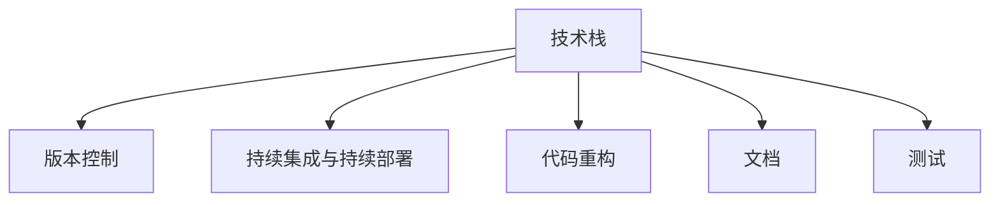

                 

# 程序员如何应对技术升级与变更

技术总是在不断进步，不断有新的技术和工具涌现出来。对于程序员来说，应对这些技术升级与变更是一项重要的工作。无论是公司内部的项目需求，还是行业技术前沿的探索，都需要程序员不断学习新技术、掌握新技能。本文将从背景介绍、核心概念与联系、核心算法原理与操作步骤、数学模型和公式、项目实践、实际应用场景、工具和资源推荐、总结与展望等几个方面，系统性地介绍程序员如何应对技术升级与变更。

## 1. 背景介绍

在信息化时代，技术的快速发展和迭代是常态。软件开发环境、编程语言、框架库、工具等都在不断更新和升级。作为一个程序员，要时刻关注技术动态，学习新技术，跟上技术潮流，以保持自己的竞争力。此外，技术升级与变更也会给项目带来新的需求和挑战，如何高效应对这些变更，也是程序员的一项重要工作。

## 2. 核心概念与联系

### 2.1 核心概念概述

为更好地理解程序员如何应对技术升级与变更，本节将介绍几个密切相关的核心概念：

- **技术栈（Technology Stack）**：程序员在开发项目时所使用的编程语言、框架、库、工具等组合。不同的技术栈有其特点和优劣势。
- **版本控制（Version Control）**：如Git，用于管理代码版本，方便团队协作和代码回退。
- **持续集成与持续部署（CI/CD）**：自动化构建、测试和部署流程，提高开发效率和代码质量。
- **代码重构（Code Refactoring）**：通过重新组织代码，提高代码的可读性、可维护性和可扩展性。
- **文档（Documentation）**：包括项目文档、API文档、代码注释等，帮助团队成员理解代码和项目背景。
- **测试（Testing）**：包括单元测试、集成测试、系统测试等，保证代码质量和系统稳定性。

这些核心概念之间的逻辑关系可以通过以下Mermaid流程图来展示：



这个流程图展示了一个程序员在开发过程中涉及的关键环节，每个环节都有其独特的价值和作用。

## 3. 核心算法原理 & 具体操作步骤

### 3.1 算法原理概述

程序员应对技术升级与变更的核心算法原理是“敏捷开发”（Agile Development）。敏捷开发的核心思想是：快速响应变化，提高迭代速度，增加团队灵活性。敏捷开发方法强调在开发过程中持续与客户沟通和反馈，快速交付高质量的软件。

### 3.2 算法步骤详解

一个完整的敏捷开发流程包括以下几个步骤：

**Step 1: 需求分析与规划**
- 与客户或相关方沟通，明确需求和目标。
- 分解任务，制定项目计划。

**Step 2: 开发**
- 迭代开发，每个迭代周期通常为1-4周。
- 每次迭代后进行评审，评估进展和问题。
- 根据评审结果调整计划和需求。

**Step 3: 测试**
- 在每个迭代结束时进行单元测试、集成测试和系统测试。
- 使用自动化测试工具，如JUnit、Selenium等。
- 测试结果反馈给开发团队，修复问题。

**Step 4: 部署与维护**
- 使用CI/CD工具，如Jenkins、Travis CI等，自动构建和部署。
- 监控系统性能，收集日志和错误信息。
- 定期进行代码重构和优化，提高系统稳定性。

**Step 5: 迭代更新**
- 根据用户反馈和市场变化，不断更新和优化产品。
- 引入新技术和工具，提高开发效率和软件质量。

### 3.3 算法优缺点

敏捷开发方法具有以下优点：

- **快速响应变化**：能够快速适应客户需求和技术变化，避免开发过程中出现问题后返工。
- **团队协作**：通过每日站会、评审等机制，促进团队协作和信息共享。
- **代码质量高**：频繁的测试和评审，确保代码质量和系统稳定性。

同时，敏捷开发方法也存在一些缺点：

- **开发成本高**：需要更多的沟通和协作，开发周期相对较长。
- **文档要求高**：需要详细记录开发过程和测试结果，以便后续维护和迭代。
- **适应性不足**：对于大型项目，敏捷开发可能需要多支团队同时协作，管理复杂。

### 3.4 算法应用领域

敏捷开发方法不仅适用于软件开发，在产品设计和项目管理等领域也有广泛应用。例如：

- **产品设计**：敏捷设计方法通过快速迭代，不断优化产品原型和用户体验。
- **项目管理**：敏捷管理方法通过Scrum、Kanban等框架，提高项目进度和质量。
- **运营管理**：敏捷运营方法通过持续改进和优化，提高运营效率和客户满意度。

## 4. 数学模型和公式 & 详细讲解 & 举例说明

### 4.1 数学模型构建

敏捷开发中的“敏捷”（Agile）一词来源于拉丁语“agilis”，意为“敏捷”。敏捷开发的核心思想是“适应变化”，因此在数学模型构建上，我们可以使用“适应度函数”（Fitness Function）来表示敏捷开发的效果。

设敏捷开发的效果为 $F$，其影响因素包括代码质量 $Q$、项目进度 $T$、客户满意度 $C$、技术债务 $D$ 等。则适应度函数可以表示为：

$$
F(Q, T, C, D) = \alpha Q + \beta T + \gamma C + \delta D
$$

其中 $\alpha, \beta, \gamma, \delta$ 为权值，表示各个因素的重要性。

### 4.2 公式推导过程

为了求解适应度函数 $F(Q, T, C, D)$ 的最大值，需要对方程进行求导：

$$
\frac{\partial F}{\partial Q} = \alpha, \quad \frac{\partial F}{\partial T} = \beta, \quad \frac{\partial F}{\partial C} = \gamma, \quad \frac{\partial F}{\partial D} = -\delta
$$

为了使 $F$ 的值最大，需要对各因素进行优化。例如，为了提高代码质量 $Q$，可以引入自动化测试工具和代码审查机制。为了提高项目进度 $T$，可以采用增量开发和并行开发策略。为了提高客户满意度 $C$，可以加强与客户的沟通和反馈机制。为了减少技术债务 $D$，可以进行代码重构和优化。

### 4.3 案例分析与讲解

假设有一个软件开发项目，采用敏捷开发方法，其中代码质量 $Q$ 为 90%，项目进度 $T$ 为 90%，客户满意度 $C$ 为 80%，技术债务 $D$ 为 10%。使用上述适应度函数进行计算：

$$
F(Q, T, C, D) = \alpha \times 0.9 + \beta \times 0.9 + \gamma \times 0.8 + \delta \times 0.1 = 0.9\alpha + 0.9\beta + 0.8\gamma + 0.1\delta
$$

由于 $\alpha, \beta, \gamma, \delta$ 的值未知，我们可以通过试验和调整，确定最优的权值。例如，假设 $\alpha = 0.3, \beta = 0.3, \gamma = 0.3, \delta = 0.1$，则：

$$
F(Q, T, C, D) = 0.3 \times 0.9 + 0.3 \times 0.9 + 0.3 \times 0.8 + 0.1 \times 0.1 = 0.36 + 0.27 + 0.24 + 0.01 = 0.86
$$

因此，在给定的权值下，该项目的适应度函数值为 0.86。根据这个结果，可以进一步调整开发策略，以提高敏捷开发的效果。

## 5. 项目实践：代码实例和详细解释说明

### 5.1 开发环境搭建

在进行敏捷开发项目实践前，我们需要准备好开发环境。以下是使用Python进行Django开发的开发环境配置流程：

1. 安装Anaconda：从官网下载并安装Anaconda，用于创建独立的Python环境。

2. 创建并激活虚拟环境：
```bash
conda create -n django-env python=3.8 
conda activate django-env
```

3. 安装Django：根据CUDA版本，从官网获取对应的安装命令。例如：
```bash
conda install django 
```

4. 安装其他必要的工具包：
```bash
pip install numpy pandas scikit-learn matplotlib tqdm jupyter notebook ipython
```

完成上述步骤后，即可在`django-env`环境中开始开发实践。

### 5.2 源代码详细实现

下面以一个简单的博客系统为例，给出使用Django进行敏捷开发项目的代码实现。

首先，定义博客模型的数据模型：

```python
from django.db import models

class BlogPost(models.Model):
    title = models.CharField(max_length=100)
    content = models.TextField()
    created_at = models.DateTimeField(auto_now_add=True)
```

然后，定义博客系统的视图和模板：

```python
from django.shortcuts import render
from django.http import HttpResponse

def index(request):
    posts = BlogPost.objects.all()
    return render(request, 'blog/index.html', {'posts': posts})
```

接着，定义博客系统的URL路由：

```python
from django.urls import path

urlpatterns = [
    path('', views.index, name='index'),
]
```

最后，定义博客系统的初始化数据和测试数据：

```python
def create_post(request):
    if request.method == 'POST':
        title = request.POST['title']
        content = request.POST['content']
        post = BlogPost.objects.create(title=title, content=content)
        return HttpResponse('Post created successfully!')
```

以上代码实现了博客系统的基本功能，包括列表展示、创建帖子等。

### 5.3 代码解读与分析

让我们再详细解读一下关键代码的实现细节：

**Django框架**：
- `models.Model`：定义了Django的数据模型，包括字段类型和属性。
- `views.index`：定义了博客系统的视图函数，处理请求并返回响应。
- `urls`：定义了博客系统的URL路由，将请求映射到相应的视图函数。

**数据模型**：
- `title`：表示博客的标题，使用 `CharField` 类型。
- `content`：表示博客的内容，使用 `TextField` 类型。
- `created_at`：表示博客的创建时间，使用 `DateTimeField` 类型，自动设置为创建时间。

**视图函数**：
- `index`：处理博客列表展示请求，查询数据库中的所有博客帖子，并渲染到模板中。
- `create_post`：处理创建博客帖子的请求，使用 POST 方法从请求中获取数据，创建新的博客帖子。

**URL路由**：
- `urlpath`：定义了博客系统的URL路由，将 URL 映射到相应的视图函数。

### 5.4 运行结果展示

运行上述代码，访问本地服务器的 `/` 地址，应该能够看到博客系统的首页，展示所有博客帖子。点击创建帖子链接，输入博客标题和内容，提交表单后，应该能够创建新的博客帖子，并在列表中展示。

## 6. 实际应用场景

### 6.1 软件开发生命周期

敏捷开发方法在软件开发生命周期中有着广泛的应用。例如，在需求分析阶段，可以通过敏捷开发方法与客户或相关方进行沟通，明确需求和目标。在设计和开发阶段，可以通过敏捷开发方法进行迭代开发，快速响应变化。在测试和部署阶段，可以通过敏捷开发方法进行持续集成和持续部署，确保软件质量。

### 6.2 产品开发

敏捷开发方法在产品开发中也得到了广泛应用。例如，在产品设计阶段，可以通过敏捷设计方法进行快速原型设计，收集用户反馈，不断优化产品。在产品开发阶段，可以通过敏捷开发方法进行快速迭代开发，及时调整产品方向。在产品上线后，可以通过敏捷运营方法进行持续改进和优化，提高用户满意度和产品竞争力。

### 6.3 项目管理

敏捷开发方法在项目管理中也具有重要价值。例如，在项目规划阶段，可以通过敏捷管理方法制定项目计划，明确任务和目标。在项目执行阶段，可以通过敏捷开发方法进行迭代开发，确保项目进度和质量。在项目总结阶段，可以通过敏捷管理方法进行项目复盘，总结经验教训，优化项目管理。

## 7. 工具和资源推荐

### 7.1 学习资源推荐

为了帮助程序员系统掌握敏捷开发方法，这里推荐一些优质的学习资源：

1. 《敏捷开发》系列书籍：详细介绍了敏捷开发的理念、方法、实践和工具。
2. 《Scrum》系列书籍：介绍了Scrum框架的基本概念、实践和应用。
3. 《Kanban》系列书籍：介绍了Kanban框架的基本概念、实践和应用。
4. 《代码重构的艺术》书籍：介绍了代码重构的基本原则、方法和工具。
5. 《软件测试的艺术》书籍：介绍了软件测试的基本原则、方法和工具。
6. 《Django官方文档》：提供了Django框架的详细教程和示例代码。

通过对这些资源的学习实践，相信你一定能够快速掌握敏捷开发方法，并用于解决实际的开发问题。

### 7.2 开发工具推荐

高效的开发离不开优秀的工具支持。以下是几款用于敏捷开发的工具：

1. JIRA：项目管理工具，支持敏捷开发方法，提供任务管理和进度跟踪。
2. Confluence：文档管理工具，支持团队协作和知识共享。
3. GitHub：代码托管平台，支持版本控制和代码审查。
4. Jenkins：持续集成和持续部署工具，支持自动化构建和部署。
5. Selenium：自动化测试工具，支持Web应用测试。
6. Docker：容器化平台，支持敏捷开发中的快速部署和测试。

合理利用这些工具，可以显著提升敏捷开发任务的开发效率，加快创新迭代的步伐。

### 7.3 相关论文推荐

敏捷开发方法的发展源于学界的持续研究。以下是几篇奠基性的相关论文，推荐阅读：

1. 《敏捷开发宣言》（Agile Manifesto）：敏捷开发方法的核心理念和原则。
2. 《Scrum指南》（Scrum Guide）：Scrum框架的详细实践指南。
3. 《Kanban：可视化生产管理方法》（Kanban: Successful Evolutionary Change for Your Technology Business）：Kanban框架的详细实践指南。
4. 《代码重构的艺术》（Refactoring: Improving the Design of Existing Code）：代码重构的基本原则和实践。
5. 《软件测试的艺术》（Software Testing: BAsics and Practices）：软件测试的基本原则和实践。

这些论文代表了大规模编程和软件工程的最新研究进展，是程序员学习的宝贵资源。

## 8. 总结：未来发展趋势与挑战

### 8.1 总结

本文对程序员如何应对技术升级与变更进行了全面系统的介绍。首先阐述了敏捷开发方法的核心思想和步骤，明确了敏捷开发在软件开发中的应用价值。其次，从理论到实践，详细讲解了敏捷开发方法的数学模型和公式推导，给出了敏捷开发任务的具体代码实现。同时，本文还探讨了敏捷开发方法在软件开发生命周期、产品开发和项目管理等领域的广泛应用，展示了敏捷开发方法的强大生命力。

通过本文的系统梳理，可以看到，敏捷开发方法已经成为软件开发领域的重要范式，极大地提高了开发效率和软件质量。未来，伴随敏捷开发技术的持续演进，相信软件开发会变得更加高效和灵活，为构建高质量软件奠定坚实基础。

### 8.2 未来发展趋势

展望未来，敏捷开发技术将呈现以下几个发展趋势：

1. 持续改进和优化：敏捷开发方法将更加注重持续改进和优化，通过持续反馈和迭代，不断提升开发效率和软件质量。
2. 多学科融合：敏捷开发方法将更多地与其他学科的知识和方法融合，如项目管理、系统工程、认知心理学等，提升开发过程的系统性和科学性。
3. 自动化工具和平台：随着自动化技术的不断发展，敏捷开发中的自动化测试、持续集成和持续部署等环节将得到进一步优化和提升。
4. 云原生和DevOps：敏捷开发将更加紧密地与云原生和DevOps文化结合，通过自动化和容器化技术，实现更高效的软件交付和运营。
5. 智能化和AI：敏捷开发将引入更多的智能化技术，如自动化设计、智能化测试、智能化运维等，提高开发过程的智能化水平。

以上趋势凸显了敏捷开发技术的广阔前景。这些方向的探索发展，必将进一步提升软件开发过程的效率和质量，为构建高效、智能的软件系统奠定坚实基础。

### 8.3 面临的挑战

尽管敏捷开发技术已经取得了瞩目成就，但在迈向更加智能化、普适化应用的过程中，它仍面临着诸多挑战：

1. 团队协作和沟通：敏捷开发需要团队成员之间的紧密协作和沟通，但在大型项目中，协作难度较大，容易出现沟通断层和信息孤岛。
2. 项目管理和风险控制：敏捷开发需要在快速变化中保持项目进度和质量，需要更高的项目管理能力和风险控制能力。
3. 技术债务和重构：敏捷开发需要频繁的迭代和变更，容易产生技术债务，需要进行大量的代码重构和优化。
4. 自动化和测试覆盖率：敏捷开发需要自动化测试和持续集成，但自动化工具的覆盖率和质量需要不断优化，确保测试效果。
5. 学习成本和适应性：敏捷开发需要团队成员掌握新的方法和工具，有一定的学习成本，团队成员需要不断适应变化。

### 8.4 研究展望

面对敏捷开发所面临的挑战，未来的研究需要在以下几个方面寻求新的突破：

1. 提升团队协作和沟通：引入更多的协作工具和平台，如Slack、Confluence等，促进团队协作和信息共享。
2. 优化项目管理方法和工具：引入更多的项目管理方法和工具，如SAFe、Lean、Kanban等，提高项目管理和风险控制能力。
3. 优化技术债务和重构：引入更多的重构工具和方法，如静态分析工具、代码审查工具等，提高代码重构和优化的效率。
4. 提升自动化和测试覆盖率：引入更多的自动化测试工具和平台，如Selenium、JUnit、GitLab CI等，提高自动化测试的覆盖率和效果。
5. 引入智能化技术：引入更多的智能化技术，如AI驱动的设计和测试、自动化的运维等，提升开发过程的智能化水平。

这些研究方向的探索，必将引领敏捷开发技术迈向更高的台阶，为构建高效、智能的软件系统奠定坚实基础。面向未来，敏捷开发技术还需要与其他人工智能技术进行更深入的融合，如知识表示、因果推理、强化学习等，多路径协同发力，共同推动软件开发过程的进步。

## 9. 附录：常见问题与解答

**Q1：敏捷开发方法适用于所有项目吗？**

A: 敏捷开发方法适用于大多数项目，尤其是复杂的软件项目。但对于一些简单、短期的项目，如数据采集、文档编写等，敏捷开发方法可能显得过于复杂。因此，需要根据项目的复杂度和需求，灵活选择开发方法和工具。

**Q2：敏捷开发中的任务分解粒度如何确定？**

A: 任务分解的粒度需要根据项目的复杂度和团队成员的技能水平来确定。通常，任务分解的粒度越小，团队成员的负担就越轻，但任务管理的复杂度就越高。任务分解的粒度应该适中，既要考虑任务的可管理性，又要保证任务的可执行性。

**Q3：敏捷开发中的测试和测试工具有哪些？**

A: 敏捷开发中的测试方法包括单元测试、集成测试、系统测试等。常用的测试工具包括JUnit、Selenium、TestNG等。测试工具的选择需要根据项目的语言和技术栈来确定，选择适合的工具可以提高测试效率和覆盖率。

**Q4：敏捷开发中的版本控制有哪些方法？**

A: 敏捷开发中常用的版本控制方法包括Git、SVN等。Git以其高效、灵活、分布式等优点，成为敏捷开发中常用的版本控制工具。通过版本控制，可以记录代码的变更历史，方便团队协作和代码回退。

**Q5：敏捷开发中的文档管理有哪些方法？**

A: 敏捷开发中常用的文档管理方法包括Confluence、JIRA、Trello等。通过文档管理工具，可以记录项目的需求、任务、进度等关键信息，方便团队协作和知识共享。

总之，敏捷开发方法虽然有其复杂性和挑战性，但在软件开发领域已经得到了广泛应用，并取得了显著的效果。未来，伴随敏捷开发技术的持续演进，相信软件开发会变得更加高效和灵活，为构建高质量软件奠定坚实基础。

