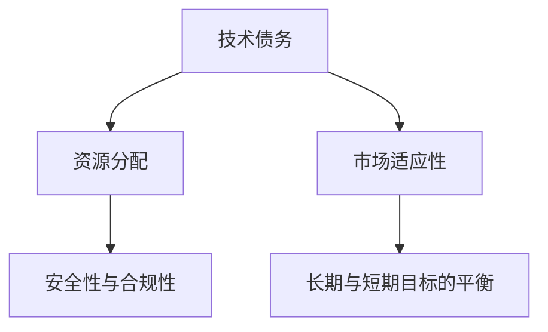

                 

# 程序员如何应对经济 &- &- 挑战

## 1. 背景介绍

### 1.1 问题由来
当前全球经济形势复杂多变，特别是受到新冠疫情、国际政治冲突、供应链危机等多重因素的影响，各国经济增长放缓，市场波动剧烈。在这样的经济环境下，程序员不仅要面对技术挑战，还要应对业务和市场压力，保持企业的可持续发展。

### 1.2 问题核心关键点
在经济不确定性增加的背景下，程序员需要通过合理的技术和管理策略，确保代码质量和软件产品的稳定性，同时应对市场变化，保持业务的持续增长。以下是程序员在当前经济环境下可能需要关注和应对的核心问题：

1. **技术债务**：在快速迭代中积累的技术债务，可能会在经济压力下变得更加突出，影响代码质量与维护成本。
2. **资源分配**：有限的人力、物力和财力资源如何有效分配，以最大化产出和降低成本。
3. **市场适应性**：如何在快速变化的市场环境中，及时调整产品策略和开发方向。
4. **安全性与合规性**：确保软件产品符合法律规定，防范潜在的经济与法律风险。
5. **长期与短期目标的平衡**：如何在快速变化的市场和日益增长的业务需求中，平衡项目的短期交付和长期技术积累。

### 1.3 问题研究意义
对于程序员而言，理解并应对经济挑战，不仅能够保障软件产品的质量和稳定性，还能提升企业的市场竞争力和可持续发展能力。研究如何在这类复杂环境中运用技术手段和策略，对于所有从业人员都具有重要的实践意义。

## 2. 核心概念与联系

### 2.1 核心概念概述

为更好地理解程序员如何在经济压力下运用技术手段和策略，本文将介绍几个关键概念：

- **技术债务**：在软件开发过程中，为了快速交付产品或应对紧急需求，累积的代码质量问题、技术债务、架构不健壮等。
- **资源分配**：如何合理分配有限的资源（如人力、时间、资金等）以实现最大化产出。
- **市场适应性**：指软件系统对市场变化的快速响应和适应能力。
- **安全性与合规性**：软件系统在运行过程中遵守法律和行业规范，确保数据和操作的安全性。
- **长期与短期目标的平衡**：在快速变化的市场需求和企业长期发展目标之间寻找平衡。

这些概念之间的逻辑关系可以通过以下Mermaid流程图来展示：



这个流程图展示了技术债务如何影响资源分配，同时市场适应性、安全性与合规性、长期与短期目标的平衡等概念如何共同作用，最终影响软件产品的整体质量与可持续性。

## 3. 核心算法原理 & 具体操作步骤
### 3.1 算法原理概述

在经济压力下，程序员需要通过技术手段和策略，合理管理技术债务，优化资源分配，提高市场适应性，确保软件产品的安全性与合规性，并在长期目标与短期目标之间找到平衡。以下将详细介绍这些核心问题及其应对策略：

### 3.2 算法步骤详解

#### 3.2.1 技术债务管理

技术债务指在快速交付过程中累积的代码质量和架构问题，可能会在后续的维护和扩展中产生更高的成本。以下是技术债务管理的基本步骤：

1. **评估与识别**：
   - 定期评估代码质量和架构健康度。
   - 识别出技术债务的主要原因和类型。

2. **优先级划分**：
   - 根据债务的影响范围和紧急程度，划分优先级。
   - 优先解决影响最大的债务。

3. **持续改进**：
   - 制定长期的技术债务管理计划。
   - 在项目开发中融入代码审查和自动化测试，避免新债务的产生。

#### 3.2.2 资源分配优化

在有限的资源下，如何高效分配以实现最大的产出？以下是资源分配优化的关键步骤：

1. **需求优先级排序**：
   - 根据市场反馈和业务需求，对项目进行优先级排序。
   - 识别高价值和高风险的需求。

2. **敏捷开发与迭代**：
   - 采用敏捷开发方法，快速迭代产品功能。
   - 定期回顾和调整开发计划，确保资源利用最大化。

3. **自动化工具**：
   - 利用自动化工具（如CI/CD、测试框架等）提高开发效率。
   - 引入自动化测试和持续集成，减少人工错误和重复工作。

#### 3.2.3 市场适应性提升

市场适应性是确保软件产品能够快速响应市场变化的关键。以下是提升市场适应性的策略：

1. **快速反馈机制**：
   - 建立快速收集和分析市场反馈的机制。
   - 使用A/B测试等方法，快速验证假设。

2. **持续集成与交付**：
   - 引入持续集成和持续交付（CI/CD）流程。
   - 快速构建和部署新版本，响应市场变化。

3. **灵活架构设计**：
   - 采用模块化、可扩展的架构设计。
   - 确保架构能够快速适应新的需求和技术变化。

#### 3.2.4 安全性与合规性保障

确保软件系统的安全性与合规性，不仅是为了防范潜在的经济和法律风险，也是对用户负责的表现。以下是保障安全性与合规性的关键步骤：

1. **数据保护**：
   - 使用加密技术和访问控制，保护用户数据。
   - 定期进行安全审计和渗透测试。

2. **法律合规**：
   - 确保软件产品符合所在国家/地区的法律和行业规范。
   - 使用合规性工具进行扫描和检查。

3. **隐私保护**：
   - 遵循GDPR等隐私保护法规，确保用户数据不被滥用。
   - 使用隐私增强技术，如差分隐私和匿名化处理。

#### 3.2.5 长期与短期目标平衡

在快速变化的市场需求和企业长期发展目标之间找到平衡，是确保企业可持续发展的重要策略。以下是平衡长期与短期目标的关键步骤：

1. **战略规划**：
   - 制定长期发展战略，设定明确的目标和里程碑。
   - 定期回顾和调整战略方向，以适应市场变化。

2. **灵活预算**：
   - 根据项目优先级和资源需求，灵活调整预算分配。
   - 确保在应对短期需求的同时，不忽视长期技术积累。

3. **持续学习**：
   - 鼓励团队持续学习新技术和最佳实践。
   - 引入技术培训和知识分享机制，提升整体技术水平。

### 3.3 算法优缺点

技术债务管理、资源分配优化、市场适应性提升、安全性与合规性保障、长期与短期目标平衡等策略，在应对经济挑战时具有以下优缺点：

#### 优点：
1. **提高生产效率**：通过优化资源分配和技术债务管理，可以显著提高开发效率和产品质量。
2. **降低成本**：通过自动化工具和持续集成，降低人力和重复劳动成本。
3. **增强市场竞争力**：通过快速反馈机制和灵活架构设计，提升市场适应性和竞争力。
4. **降低风险**：通过数据保护和法律合规，防范经济和法律风险。
5. **促进持续发展**：通过战略规划和持续学习，确保企业长期可持续发展。

#### 缺点：
1. **初始成本高**：引入新技术和工具可能需要初始投资，短期内可能影响财务表现。
2. **学习曲线陡峭**：新技术和方法的引入需要团队成员进行适应和学习。
3. **需求变化响应慢**：在敏捷开发中，团队可能难以快速响应市场变化。
4. **技术复杂度高**：复杂的架构设计和安全性保障需要较高的技术水平和经验。
5. **资源分配挑战**：在有限资源下，平衡短期交付和长期技术积累可能面临挑战。

### 3.4 算法应用领域

技术债务管理、资源分配优化、市场适应性提升、安全性与合规性保障、长期与短期目标平衡等策略，已经广泛应用于以下领域：

1. **金融科技**：
   - 金融产品开发与维护。
   - 风险控制与合规性管理。

2. **电子商务**：
   - 电商平台建设与运营。
   - 客户关系管理与个性化推荐。

3. **医疗健康**：
   - 电子病历系统开发。
   - 医疗数据分析与决策支持。

4. **智能制造**：
   - 工业互联网平台建设。
   - 设备监控与故障预测。

5. **教育培训**：
   - 在线教育平台开发。
   - 智能辅助教学系统。

6. **公共服务**：
   - 智慧城市建设与管理。
   - 公共安全与社会治理。

以上领域的应用，展示了技术债务管理等策略在实际场景中的广泛适用性和显著效益。

## 4. 数学模型和公式 & 详细讲解  
### 4.1 数学模型构建

在分析程序员在经济压力下如何应对挑战时，可以通过数学模型来抽象和刻画问题。以下是几个核心模型的构建：

#### 4.1.1 技术债务评估模型

技术债务可以通过以下模型进行量化和评估：

$$
\text{Debt}_{total} = \sum_{i=1}^{n} D_i \times \text{Weight}_i
$$

其中 $D_i$ 为第 $i$ 项技术债务的大小，$\text{Weight}_i$ 为该债务的优先级权重。总债务 $\text{Debt}_{total}$ 是所有债务的加权和。

#### 4.1.2 资源分配优化模型

资源分配可以通过以下线性规划模型进行求解：

$$
\max \sum_{i=1}^{m} R_i \times \text{Value}_i
$$

约束条件为：

$$
\begin{cases}
\sum_{i=1}^{m} R_i \leq C\\
R_i \geq 0
\end{cases}
$$

其中 $R_i$ 为分配给第 $i$ 个项目的资源量，$\text{Value}_i$ 为该项目的价值系数，$C$ 为总资源限制。

#### 4.1.3 市场适应性评价模型

市场适应性可以通过以下模型进行量化：

$$
\text{Adaptability} = \frac{\text{Adaptation\_rate}}{\text{Time\_to\_market}}
$$

其中 $\text{Adaptation\_rate}$ 为市场变化适应速度，$\text{Time\_to\_market}$ 为产品上市时间。适应性 $\text{Adaptability}$ 越高，表明市场响应速度越快。

### 4.2 公式推导过程

#### 4.2.1 技术债务评估模型推导

假设技术债务 $D_i$ 的大小为 $d_i$，优先级权重为 $w_i$，总债务为 $D_{total}$，则有：

$$
\begin{aligned}
D_{total} &= \sum_{i=1}^{n} d_i \times w_i \\
&= \sum_{i=1}^{n} d_i \times \frac{w_i}{\sum_{j=1}^{n} w_j} \\
&= \sum_{i=1}^{n} \frac{d_i}{n} \times w_i \\
&= \text{Debt}_{avg} \times \frac{\sum_{i=1}^{n} w_i}{n}
\end{aligned}
$$

其中 $\text{Debt}_{avg}$ 为平均债务，即 $\frac{\sum_{i=1}^{n} d_i}{n}$。

#### 4.2.2 资源分配优化模型推导

线性规划模型的优化目标为：

$$
\max \sum_{i=1}^{m} R_i \times \text{Value}_i
$$

约束条件为：

$$
\begin{cases}
\sum_{i=1}^{m} R_i \leq C\\
R_i \geq 0
\end{cases}
$$

使用简单的代数操作，可得到以下优化方程：

$$
\begin{aligned}
\max \sum_{i=1}^{m} R_i \times \text{Value}_i \\
s.t. \\
\sum_{i=1}^{m} R_i \leq C \\
R_i \geq 0
\end{aligned}
$$

### 4.3 案例分析与讲解

#### 4.3.1 案例背景

某电商公司面临激烈的市场竞争和快速变化的市场需求，开发团队需要在有限的时间内快速交付产品，同时确保代码质量和系统稳定性。公司当前存在技术债务问题，需要进行管理，并优化资源分配，以提高市场适应性。

#### 4.3.2 案例分析

1. **技术债务评估与优先级划分**：
   - 评估项目的技术债务，识别出影响代码质量和系统稳定性的关键问题。
   - 根据债务的影响范围和紧急程度，划分为高、中、低三个优先级。

2. **资源分配优化**：
   - 制定年度和月度开发计划，优先安排高价值和高风险的需求。
   - 引入自动化测试和持续集成流程，提高开发效率和代码质量。

3. **市场适应性提升**：
   - 建立快速反馈机制，收集用户反馈并快速响应。
   - 使用A/B测试验证新功能效果，确保产品快速迭代。

4. **安全性与合规性保障**：
   - 加强数据加密和安全审计，确保用户数据安全。
   - 遵循GDPR等法规，确保合规性。

5. **长期与短期目标平衡**：
   - 制定长期发展战略，设定明确的目标和里程碑。
   - 灵活调整预算，确保在应对短期需求的同时，不忽视长期技术积累。

#### 4.3.3 结果展示

通过以上策略，公司成功应对了市场挑战，保持了产品的高质量与稳定性，同时提高了市场适应性和竞争力。

## 5. 项目实践：代码实例和详细解释说明
### 5.1 开发环境搭建

在进行项目实践前，我们需要准备好开发环境。以下是使用Python进行Django开发的环境配置流程：

1. 安装Anaconda：从官网下载并安装Anaconda，用于创建独立的Python环境。

2. 创建并激活虚拟环境：
```bash
conda create -n django-env python=3.8 
conda activate django-env
```

3. 安装Django：
```bash
pip install django
```

4. 安装Django Rest Framework：
```bash
pip install djangorestframework
```

5. 安装Django Admin：
```bash
pip install django-admin-html
```

完成上述步骤后，即可在`django-env`环境中开始项目实践。

### 5.2 源代码详细实现

下面是使用Django开发的一个电商网站的源代码实现：

```python
from django.conf import settings
from django.contrib import admin
from django.urls import path, include

urlpatterns = [
    path('admin/', admin.site.urls),
    path('', include('store.urls')),
]

# 设置静态文件路径
settings.STATIC_URL = '/static/'
settings.STATIC_ROOT = settings.BASE_DIR / 'static'

# 设置媒体文件路径
settings.MEDIA_URL = '/media/'
settings.MEDIA_ROOT = settings.BASE_DIR / 'media'
```

### 5.3 代码解读与分析

以下是代码中几个关键部分的详细解读和分析：

1. **Django环境配置**：
   - 使用Anaconda创建虚拟环境 `django-env`。
   - 在虚拟环境中安装Django、Django Rest Framework和Django Admin等依赖。

2. **URL路由配置**：
   - 在 `urlpatterns` 中定义了两个路由：`/admin/` 和根路由。
   - 通过 `include` 函数将 `store` 应用中的路由导入到 `urlpatterns`。

3. **静态文件配置**：
   - 设置静态文件路径为 `/static/`，并将静态文件存储在项目根目录下的 `static` 文件夹中。
   - 设置媒体文件路径为 `/media/`，并将媒体文件存储在项目根目录下的 `media` 文件夹中。

### 5.4 运行结果展示

启动项目后，可以在浏览器中访问 `http://localhost:8000`，看到电商网站的主页。通过 Django Admin 界面，可以方便地管理后台数据和配置。

## 6. 实际应用场景
### 6.1 智能制造

智能制造企业面临复杂的生产流程和设备管理需求，程序员需要开发智能化的生产监控和预测系统，以确保生产效率和设备维护。以下是智能制造中的技术债务管理、资源分配优化、市场适应性提升、安全性与合规性保障、长期与短期目标平衡等策略的具体应用：

1. **技术债务管理**：
   - 评估生产监控系统的代码质量和架构健康度。
   - 识别出关键性能瓶颈和架构不健壮的问题。

2. **资源分配优化**：
   - 根据生产需求和设备维护计划，优先安排高价值和高风险的需求。
   - 引入自动化监控和预测工具，提高生产效率和设备维护的准确性。

3. **市场适应性提升**：
   - 建立快速反馈机制，收集生产异常和设备故障信息。
   - 使用机器学习算法进行生产预测和优化，确保快速响应市场变化。

4. **安全性与合规性保障**：
   - 加强设备数据加密和安全审计，确保生产数据安全。
   - 遵循相关工业标准和法规，确保系统合规性。

5. **长期与短期目标平衡**：
   - 制定长期生产优化战略，设定明确的生产目标和里程碑。
   - 灵活调整预算和资源，确保在提升生产效率的同时，不忽视长期技术积累。

### 6.2 智慧城市

智慧城市建设需要集成多种传感器和数据源，实现城市管理的智能化。程序员需要开发集成平台和管理系统，确保数据安全和系统稳定性。以下是智慧城市中的技术债务管理、资源分配优化、市场适应性提升、安全性与合规性保障、长期与短期目标平衡等策略的具体应用：

1. **技术债务管理**：
   - 评估城市管理系统的代码质量和架构健康度。
   - 识别出影响数据集成和处理的关键问题。

2. **资源分配优化**：
   - 根据城市管理需求和数据处理计划，优先安排高价值和高风险的需求。
   - 引入自动化数据处理和分析工具，提高数据处理效率。

3. **市场适应性提升**：
   - 建立快速反馈机制，收集市民反馈和公共事件信息。
   - 使用大数据分析技术，预测城市发展趋势和公共安全事件。

4. **安全性与合规性保障**：
   - 加强市民数据加密和安全审计，确保数据安全。
   - 遵循相关法律法规，确保系统合规性。

5. **长期与短期目标平衡**：
   - 制定长期智慧城市建设战略，设定明确的城市发展目标和里程碑。
   - 灵活调整预算和资源，确保在提升城市管理水平的同时，不忽视长期技术积累。

### 6.3 教育培训

教育培训平台需要提供个性化的学习体验和高效的课程推荐系统。程序员需要开发智能化的课程推荐引擎，确保推荐算法准确性和系统稳定性。以下是教育培训中的技术债务管理、资源分配优化、市场适应性提升、安全性与合规性保障、长期与短期目标平衡等策略的具体应用：

1. **技术债务管理**：
   - 评估课程推荐系统的代码质量和架构健康度。
   - 识别出影响推荐准确性和系统稳定性的关键问题。

2. **资源分配优化**：
   - 根据用户需求和课程内容，优先安排高价值和高风险的需求。
   - 引入自动化推荐算法和课程更新机制，提高推荐准确性和用户满意度。

3. **市场适应性提升**：
   - 建立快速反馈机制，收集用户反馈和课程评价。
   - 使用机器学习算法进行课程推荐和个性化学习路径生成。

4. **安全性与合规性保障**：
   - 加强用户数据加密和安全审计，确保用户数据安全。
   - 遵循教育法规和隐私保护法规，确保系统合规性。

5. **长期与短期目标平衡**：
   - 制定长期教育培训发展战略，设定明确的教育培训目标和里程碑。
   - 灵活调整预算和资源，确保在提升学习体验的同时，不忽视长期技术积累。

## 7. 工具和资源推荐
### 7.1 学习资源推荐

为了帮助程序员更好地应对经济挑战，以下是一些优秀的学习资源推荐：

1. **《深入理解计算机系统》**：
   - 这本书系统介绍了计算机系统的工作原理，帮助程序员理解底层架构和资源管理。

2. **Coursera《软件工程与设计模式》课程**：
   - 该课程涵盖软件开发的最佳实践和设计模式，帮助程序员提高代码质量和系统稳定性。

3. **GitHub上的开源项目**：
   - 搜索相关的开源项目，了解行业最佳实践和解决方案。

4. **Stack Overflow**：
   - 这是一个程序员社区，可以提问、回答和分享技术问题。

5. **LeetCode**：
   - 提供大量的编程练习，提升算法和数据结构能力。

6. **Kaggle**：
   - 参与数据科学竞赛，提升数据分析和模型优化能力。

通过这些学习资源，程序员可以不断提升技术水平，更好地应对经济挑战。

### 7.2 开发工具推荐

以下是几款用于项目管理、代码质量控制和自动化测试的工具：

1. **JIRA**：
   - 项目管理工具，用于任务分配和进度跟踪。

2. **Git**：
   - 版本控制工具，确保代码协作和版本管理。

3. **Django**：
   - 流行的Web框架，提供强大的开发和部署能力。

4. **Jenkins**：
   - 持续集成工具，自动化测试和构建。

5. **SonarQube**：
   - 代码质量控制工具，检测代码质量和潜在问题。

6. **Selenium**：
   - 自动化测试工具，用于UI测试和功能验证。

使用这些工具，程序员可以显著提升开发效率和代码质量，更好地应对经济挑战。

### 7.3 相关论文推荐

以下是几篇经典的论文，推荐程序员阅读：

1. **《代码质量与技术债务》**：
   - 探讨了技术债务对软件开发和系统维护的影响，提出了管理和减少技术债务的策略。

2. **《资源优化与项目管理》**：
   - 介绍了资源优化和项目管理的基本方法和模型，帮助程序员更好地分配和管理资源。

3. **《市场适应性与敏捷开发》**：
   - 探讨了敏捷开发和市场适应性之间的关系，提出了适应快速变化市场的策略。

4. **《安全性与合规性》**：
   - 讨论了数据安全和系统合规性的重要性和实现方法。

5. **《长期与短期目标平衡》**：
   - 探讨了在快速变化的市场需求和企业长期发展目标之间的平衡策略。

这些论文为程序员提供了深入的理论基础和实际方法，帮助他们在复杂环境中更好地应对经济挑战。

## 8. 总结：未来发展趋势与挑战
### 8.1 研究成果总结

本文系统探讨了程序员在经济压力下如何通过技术手段和策略，管理技术债务、优化资源分配、提升市场适应性、保障安全性与合规性、平衡长期与短期目标等。通过理论模型和案例分析，展示了这些策略在实际项目中的具体应用和效果。

### 8.2 未来发展趋势

未来，随着人工智能和大数据技术的进一步发展，程序员将面临更多挑战和机遇：

1. **自动化与智能化**：
   - 自动化工具和智能化算法将大大提升开发效率和代码质量。

2. **云计算与分布式系统**：
   - 云计算和分布式系统将提供更灵活的资源管理和更高效的计算能力。

3. **持续学习和自我进化**：
   - 程序员需要不断学习新技术和方法，以适应快速变化的市场需求。

4. **安全性与隐私保护**：
   - 数据安全和隐私保护将成为软件系统的重要组成部分。

5. **跨领域合作与协作**：
   - 跨领域合作将提升系统的综合性能和应用场景。

### 8.3 面临的挑战

尽管技术手段和策略可以提升程序员应对经济挑战的能力，但在实际应用中仍面临一些挑战：

1. **技术债务累积**：
   - 快速迭代和快速交付可能导致技术债务累积，影响系统质量和维护成本。

2. **资源有限**：
   - 在有限资源下，如何优化分配以最大化产出，仍是一个挑战。

3. **市场变化快**：
   - 如何快速响应市场变化，保持系统灵活性和适应性。

4. **技术复杂度高**：
   - 在引入新技术和方法时，可能面临技术复杂度和学习曲线的挑战。

5. **法律法规要求**：
   - 在保障数据安全和系统合规性时，需确保遵守相关法律法规。

### 8.4 研究展望

未来的研究可以从以下几个方面进一步探索：

1. **智能化自动化**：
   - 研究如何引入更多智能化算法和自动化工具，提高开发效率和代码质量。

2. **云计算资源管理**：
   - 研究如何优化云计算资源管理，提升系统性能和灵活性。

3. **持续学习与自我进化**：
   - 研究如何建立持续学习机制，提升程序员的技术水平和适应能力。

4. **跨领域合作**：
   - 研究如何促进跨领域合作，提升系统的综合性能和应用场景。

5. **数据隐私与安全**：
   - 研究如何建立更强大的数据隐私和安全保护机制。

通过这些研究，程序员可以更好地应对经济挑战，提升软件系统的质量和可持续性。

## 9. 附录：常见问题与解答

**Q1：技术债务管理是否会降低开发效率？**

A: 技术债务管理可能会在短期内降低开发效率，但长期来看，通过解决债务问题，可以提升系统质量和稳定性，减少后续维护成本。

**Q2：如何平衡短期交付和长期技术积累？**

A: 可以通过灵活的资源分配和战略规划，在满足短期需求的同时，不断积累长期技术债务。同时，引入自动化工具和持续学习机制，提升整体技术水平。

**Q3：市场变化快，如何快速响应？**

A: 建立快速反馈机制，引入持续集成和持续交付（CI/CD）流程，使用A/B测试和灰度发布等方法，确保快速响应市场变化。

**Q4：如何在有限资源下优化资源分配？**

A: 通过资源优先级排序、自动化工具和持续集成，优化资源分配。引入敏捷开发和迭代方法，确保在有限资源下最大化产出。

**Q5：如何保障数据安全和合规性？**

A: 加强数据加密和安全审计，确保数据安全。遵循相关法律法规，使用合规性工具进行扫描和检查。

通过对这些问题的解答，程序员可以更好地理解技术债务管理、资源分配优化、市场适应性提升、安全性与合规性保障、长期与短期目标平衡等策略的实际应用和效果。

---

作者：禅与计算机程序设计艺术 / Zen and the Art of Computer Programming

