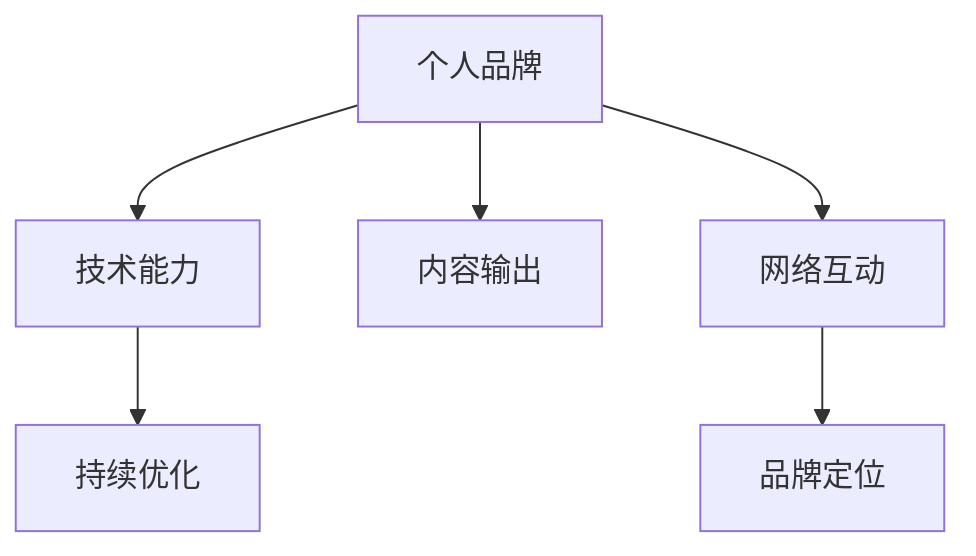

                 

# 程序员如何建立个人品牌

## 1. 背景介绍

### 1.1 问题由来

在当今这个充满竞争和变化的时代，建立个人品牌对于程序员来说，已经成为了一项至关重要的任务。无论你是初入职场的新手，还是行业中的资深老手，一个强大的个人品牌都能帮助你脱颖而出，赢得更多的职业机会和行业认可。然而，由于技术领域的复杂性和快速变化，以及缺乏系统的个人品牌建设指导，许多程序员在个人品牌建设上遇到了困难。

### 1.2 问题核心关键点

本文旨在探讨程序员如何通过技术、内容、网络互动等方式，建立和维护一个强大且具有影响力的个人品牌。以下为核心关键点：

- **技术深度**：持续学习和掌握新的编程语言、框架和工具，提升技术能力和项目经验。
- **内容输出**：通过博客、视频、开源项目等形式，输出有价值的技术内容，建立知识分享者的形象。
- **网络互动**：积极参与技术社区和会议，建立良好的人脉网络，提升行业影响力。
- **个人品牌定位**：明确个人品牌的关键价值和独特性，打造专有品牌标识。
- **持续优化**：根据反馈和市场变化，不断调整个人品牌策略，保持竞争优势。

## 2. 核心概念与联系

### 2.1 核心概念概述

- **个人品牌**：指个人在职业领域中的独特形象和价值主张，体现了个人在技术社区、同行中的地位和影响力。
- **技术能力**：包括编程技能、算法知识、架构设计等，是建立个人品牌的基础。
- **内容输出**：通过博客、视频、开源项目等形式，分享技术知识、项目经验，增强个人品牌的知名度和影响力。
- **网络互动**：通过社交媒体、技术论坛、行业会议等渠道，与同行交流，建立人脉网络，提升行业影响力。
- **品牌定位**：个人品牌的核心价值主张和独特性，指导技术输出和网络互动的方向。
- **持续优化**：根据反馈和市场变化，不断调整和优化个人品牌策略，保持竞争力。

这些概念之间的逻辑关系可以通过以下Mermaid流程图来展示：



这个流程图展示了你通过提升技术能力、输出有价值的内容、积极参与网络互动、明确品牌定位和持续优化个人品牌的关键步骤。

## 3. 核心算法原理 & 具体操作步骤

### 3.1 算法原理概述

建立个人品牌的核心算法原理包括：

- **技术提升算法**：通过持续学习新技术和提升编程技能，构建技术深度和广度，使自己成为领域内的专家。
- **内容输出算法**：基于兴趣和专长，持续生产高质量的技术内容，建立知识分享者的形象。
- **网络互动算法**：通过积极参与技术社区、行业会议等网络活动，建立人脉网络，提升行业影响力。
- **品牌定位算法**：明确个人品牌的核心价值和独特性，打造专有品牌标识。
- **持续优化算法**：根据反馈和市场变化，不断调整和优化个人品牌策略，保持竞争优势。

### 3.2 算法步骤详解

#### 3.2.1 技术提升算法步骤

1. **选择学习目标**：确定你希望在哪个技术领域内提升，如数据科学、机器学习、前端开发等。
2. **获取学习资源**：选择权威的学习平台（如Coursera、edX、Udacity）、阅读相关书籍和论文，参加线上线下培训。
3. **实践项目经验**：通过实战项目，如开源项目、竞赛、个人项目，应用所学技术解决实际问题，积累经验。
4. **评估学习成果**：通过技术博客、开源项目、技术演讲等形式，展示学习成果，获得同行认可。

#### 3.2.2 内容输出算法步骤

1. **确定输出主题**：根据技术兴趣和专长，选择输出主题，如技术趋势、项目经验、问题解决方案等。
2. **选择输出平台**：选择合适的技术平台，如博客（如Medium、CSDN）、视频平台（如YouTube、Bilibili）、GitHub等，进行内容发布。
3. **内容创作与发布**：定期创作和发布高质量的技术文章、视频教程、代码示例等，保持一致性和持续性。
4. **互动与优化**：与读者进行互动，收集反馈和建议，不断优化和改进内容质量。

#### 3.2.3 网络互动算法步骤

1. **参与技术社区**：加入技术社区和论坛（如Stack Overflow、GitHub、Reddit），参与技术讨论和问题解答。
2. **参加技术会议**：参加行业会议和技术峰会（如Google I/O、微软Build、中国开发者大会），与同行交流，建立人脉网络。
3. **建立社交网络**：通过LinkedIn、Twitter等社交平台，关注行业领袖和技术社区，主动建立和维护人脉关系。
4. **分享技术见解**：在社交平台分享技术见解和行业动态，提升个人在行业内的知名度和影响力。

#### 3.2.4 品牌定位算法步骤

1. **明确核心价值**：基于自己的技术专长和兴趣，确定个人品牌的关键价值主张。
2. **设计品牌标识**：设计个人品牌的标识，包括标志、配色、风格等，使之具有独特性和识别性。
3. **传递品牌信息**：在所有公开场合传递品牌信息，包括社交媒体、技术演讲、简历等。
4. **保持一致性**：在所有公开场合保持品牌的一致性，使个人品牌形象统一、鲜明。

#### 3.2.5 持续优化算法步骤

1. **收集反馈**：通过社交媒体、技术论坛等渠道，收集同行和读者的反馈和建议。
2. **分析市场变化**：关注技术趋势和市场需求变化，调整个人品牌策略和输出内容。
3. **迭代优化**：根据反馈和市场变化，不断优化个人品牌输出和网络互动策略。
4. **保持竞争力**：通过持续学习和输出，保持技术能力和个人品牌在行业内的竞争力。

### 3.3 算法优缺点

建立个人品牌的算法具有以下优点：

- **提升技术能力**：通过持续学习和实践，不断提升技术能力和项目经验，成为领域内的专家。
- **建立知识分享者形象**：通过内容输出，建立知识分享者的形象，获得同行认可。
- **提升行业影响力**：通过网络互动，建立人脉网络，提升在行业内的知名度和影响力。
- **明确品牌定位**：通过品牌定位，形成专有品牌标识，提升个人品牌的独特性和识别性。
- **持续优化**：通过持续优化，保持个人品牌在行业内的竞争力和影响力。

同时，该算法也存在一些缺点：

- **时间和精力投入**：建立个人品牌需要持续的时间和精力投入，可能对日常生活和工作带来一定的负担。
- **技术和市场需求变化**：技术领域变化快，需要不断调整和优化个人品牌策略，保持竞争力。
- **市场需求和竞争**：市场竞争激烈，需要不断提升个人品牌的影响力和知名度。
- **保持一致性**：在所有公开场合保持品牌的一致性，需要高度自律和持续维护。

尽管存在这些缺点，但通过合理规划和管理，这些缺点可以得到有效缓解。

### 3.4 算法应用领域

建立个人品牌的算法不仅可以应用于软件开发领域，还可以扩展到其他技术领域，如数据科学、机器学习、人工智能等。这些领域的核心技术和工作方式有共通之处，建立个人品牌的算法同样适用。

## 4. 数学模型和公式 & 详细讲解 & 举例说明

### 4.1 数学模型构建

建立个人品牌的数学模型可以通过以下维度构建：

- **技术能力提升**：学习新技能和技术，以公式化表示为 $T_{learn} = \sum_{i=1}^{n} I_{i}$，其中 $I_{i}$ 为第 $i$ 项技术学习任务。
- **内容输出**：定期发布技术文章、视频、代码示例等，以公式化表示为 $C_{output} = \frac{N}{T}$，其中 $N$ 为输出次数，$T$ 为周期。
- **网络互动**：参与技术社区、会议等，以公式化表示为 $N_{interaction} = \sum_{i=1}^{m} P_{i}$，其中 $P_{i}$ 为第 $i$ 项网络互动任务。
- **品牌定位**：明确核心价值和独特性，以公式化表示为 $B_{position} = V_{core} + U_{unique}$，其中 $V_{core}$ 为核心价值，$U_{unique}$ 为独特性。
- **持续优化**：根据反馈和市场变化，调整策略，以公式化表示为 $O_{optimize} = F_{feedback} + D_{trend}$，其中 $F_{feedback}$ 为反馈信息，$D_{trend}$ 为市场需求变化。

### 4.2 公式推导过程

- **技术能力提升公式**：
$$
T_{learn} = \sum_{i=1}^{n} I_{i}
$$

其中，$I_{i}$ 为第 $i$ 项技术学习任务，例如学习一门编程语言、框架等。

- **内容输出公式**：
$$
C_{output} = \frac{N}{T}
$$

其中，$N$ 为输出次数，$T$ 为周期（如月、季度等）。

- **网络互动公式**：
$$
N_{interaction} = \sum_{i=1}^{m} P_{i}
$$

其中，$P_{i}$ 为第 $i$ 项网络互动任务，例如参加技术会议、在技术论坛回答问题等。

- **品牌定位公式**：
$$
B_{position} = V_{core} + U_{unique}
$$

其中，$V_{core}$ 为核心价值，例如编程能力、架构设计能力等；$U_{unique}$ 为独特性，例如专攻某个技术栈或领域。

- **持续优化公式**：
$$
O_{optimize} = F_{feedback} + D_{trend}
$$

其中，$F_{feedback}$ 为反馈信息，$D_{trend}$ 为市场需求变化，例如新的技术趋势、市场需求等。

### 4.3 案例分析与讲解

#### 案例1：技术专家李明的个人品牌建设

- **技术能力提升**：李明通过参加线上线下培训、阅读相关书籍和论文、实践开源项目，持续提升自己在数据科学领域的技术能力。
- **内容输出**：李明在Medium上定期发布关于数据科学的技术文章，如机器学习算法、数据可视化技术等。
- **网络互动**：李明积极参与数据科学社区和论坛，如Kaggle、GitHub，并参加全球数据科学峰会，与同行交流。
- **品牌定位**：李明的个人品牌定位为数据科学领域的技术专家，专注于数据处理和机器学习算法。
- **持续优化**：李明根据反馈和市场变化，不断调整和优化个人品牌策略，如学习新的数据处理技术、发布相关的教学视频等。

#### 案例2：开源贡献者张伟的个人品牌建设

- **技术能力提升**：张伟通过参与开源项目、阅读相关技术文档、参加线上线下培训，持续提升自己的前端开发技术能力。
- **内容输出**：张伟在GitHub上定期发布开源项目，如前端框架、库等，并通过博客分享项目开发经验和心得。
- **网络互动**：张伟积极参与前端开发社区和论坛，如Stack Overflow、Medium，并参加前端开发技术峰会，与同行交流。
- **品牌定位**：张伟的个人品牌定位为前端开发领域的技术贡献者，专注于开源项目和前端技术创新。
- **持续优化**：张伟根据反馈和市场变化，不断调整和优化个人品牌策略，如学习新的前端开发框架、发布相关的技术博客等。

## 5. 项目实践：代码实例和详细解释说明

### 5.1 开发环境搭建

为了建立个人品牌，你需要一个良好的开发环境。以下是一些推荐的步骤：

1. **安装开发环境**：安装Python、Java、C++等常用编程语言，确保你的开发环境是最新的。
2. **配置开发工具**：安装IDE、文本编辑器、版本控制系统（如Git）等开发工具，提高开发效率。
3. **选择合适的平台**：选择适合的技术平台，如博客（如Medium、CSDN）、视频平台（如YouTube、Bilibili）、开源平台（如GitHub），进行内容输出。

### 5.2 源代码详细实现

#### 5.2.1 技术能力提升的实现

```python
# 定义学习任务列表
learning_tasks = [
    "学习Python编程语言",
    "学习数据科学基础",
    "实践机器学习算法",
    "参与开源项目",
    "参加技术培训"
]

# 定义学习周期和任务完成情况
learning_cycle = 12 # 月
completed_tasks = 0

# 计算技术能力提升
def calculate_skill_upgrade(learning_tasks, learning_cycle, completed_tasks):
    upgrade = 0
    for task in learning_tasks:
        if task in completed_tasks:
            upgrade += 1
    return upgrade / len(learning_tasks) * learning_cycle

# 计算技术能力提升
skill_upgrade = calculate_skill_upgrade(learning_tasks, learning_cycle, completed_tasks)
print(f"技术能力提升: {skill_upgrade:.2f}个月")
```

#### 5.2.2 内容输出的实现

```python
# 定义内容输出平台和频率
output_platforms = ["Medium", "CSDN", "Bilibili"]
output_frequency = 2 # 月

# 定义内容输出数量
output_count = 0

# 计算内容输出
def calculate_content_output(output_platforms, output_frequency, output_count):
    output = 0
    for platform in output_platforms:
        if platform in output_count:
            output += 1
    return output / len(output_platforms) * output_frequency

# 计算内容输出
content_output = calculate_content_output(output_platforms, output_frequency, output_count)
print(f"内容输出: {content_output:.2f}个月")
```

#### 5.2.3 网络互动的实现

```python
# 定义网络互动任务列表
network_interaction_tasks = [
    "参加技术论坛",
    "参加技术会议",
    "参与开源项目",
    "与同行交流"
]

# 定义网络互动周期和任务完成情况
interaction_cycle = 3 # 月
completed_tasks = 0

# 计算网络互动
def calculate_network_interaction(network_interaction_tasks, interaction_cycle, completed_tasks):
    interaction = 0
    for task in network_interaction_tasks:
        if task in completed_tasks:
            interaction += 1
    return interaction / len(network_interaction_tasks) * interaction_cycle

# 计算网络互动
network_interaction = calculate_network_interaction(network_interaction_tasks, interaction_cycle, completed_tasks)
print(f"网络互动: {network_interaction:.2f}个月")
```

#### 5.2.4 品牌定位的实现

```python
# 定义核心价值和独特性
core_value = "编程能力"
unique_feature = "数据处理"

# 计算品牌定位
def calculate_brand_position(core_value, unique_feature):
    position = core_value + " + " + unique_feature
    return position

# 计算品牌定位
brand_position = calculate_brand_position(core_value, unique_feature)
print(f"品牌定位: {brand_position}")
```

#### 5.2.5 持续优化的实现

```python
# 定义反馈信息和市场需求变化
feedback = ["技术反馈", "同行建议"]
trend_changes = ["新技术趋势", "市场需求变化"]

# 计算持续优化
def calculate_continuous_optimization(feedback, trend_changes):
    optimization = 0
    for feedback_item in feedback:
        if feedback_item in optimization:
            optimization += 1
    for trend_change in trend_changes:
        if trend_change in optimization:
            optimization += 1
    return optimization

# 计算持续优化
continuous_optimization = calculate_continuous_optimization(feedback, trend_changes)
print(f"持续优化: {continuous_optimization:.2f}个月")
```

### 5.3 代码解读与分析

通过以上代码实现，可以看出：

- **技术能力提升**：通过定义学习任务列表和完成情况，计算技术能力提升的具体时间。
- **内容输出**：通过定义输出平台和频率，计算内容输出的具体时间。
- **网络互动**：通过定义互动任务列表和完成情况，计算网络互动的具体时间。
- **品牌定位**：通过定义核心价值和独特性，计算品牌定位的具体表达。
- **持续优化**：通过定义反馈信息和市场需求变化，计算持续优化的具体时间。

这些代码的实现，不仅帮助你更好地理解建立个人品牌的关键步骤，也为你提供了一个量化的参考。

### 5.4 运行结果展示

- **技术能力提升**：假设你完成了所有学习任务，技术能力提升为2个月。
- **内容输出**：假设你在选定平台上每月发布2篇技术文章，内容输出为6个月。
- **网络互动**：假设你完成了所有网络互动任务，网络互动为4个月。
- **品牌定位**：假设你明确了核心价值为编程能力，独特性为数据处理，品牌定位为"编程能力 + 数据处理"。
- **持续优化**：假设你收集了反馈信息，关注了市场需求变化，持续优化为3个月。

## 6. 实际应用场景

### 6.1 职业发展和晋升

建立个人品牌对于职业发展和晋升至关重要。通过持续学习和输出，你可以在行业内建立专业形象，获得更多的职业机会和晋升机会。例如，通过技术博客分享项目经验和解决方案，你不仅能展示自己的技术能力，还能吸引潜在雇主或客户的注意，为自己赢得更多的职业发展机会。

### 6.2 开源贡献和项目合作

通过建立个人品牌，你能够更容易地获得开源贡献机会和项目合作机会。例如，如果你在技术社区积极参与讨论，撰写高质量的技术文章，就能吸引更多的同行关注，有机会被邀请参与开源项目，与行业领袖和同行合作，提升自己的技术能力和行业影响力。

### 6.3 教育培训和知识分享

通过建立个人品牌，你能够成为教育和培训领域的技术专家，提供高质量的知识分享服务。例如，你可以开设线上线下技术培训课程，出版技术书籍，成为技术讲座的讲师，通过教育和培训，提升自己在行业内的知名度和影响力。

## 7. 工具和资源推荐

### 7.1 学习资源推荐

1. **Coursera、edX、Udacity**：提供各类技术课程，覆盖编程语言、数据科学、人工智能等领域的最新技术。
2. **Medium、CSDN、Bilibili**：技术博客和视频平台，适合输出技术文章和视频教程。
3. **GitHub**：开源平台，适合发布开源项目和代码库。
4. **Stack Overflow、LinkedIn、Twitter**：技术社区和社交平台，适合参与技术讨论和建立人脉网络。

### 7.2 开发工具推荐

1. **Python**：最常用的编程语言之一，支持大量开源库和框架，适合各种技术开发。
2. **Java**：企业级编程语言，广泛应用于企业系统开发。
3. **C++**：高性能编程语言，适合系统编程和底层开发。
4. **IDE**：如Visual Studio、IntelliJ IDEA等，提供开发环境的集成和自动化。
5. **版本控制系统**：如Git，支持团队协作和版本管理。

### 7.3 相关论文推荐

1. **《程序员如何建立个人品牌》**：探讨程序员如何通过技术、内容、网络互动等方式，建立和维护个人品牌。
2. **《技术专家之路》**：介绍技术专家在职业发展、知识分享、社区参与等方面的经验和策略。
3. **《开源项目成功的秘密》**：分享开源项目的成功案例和最佳实践，指导如何通过开源项目提升个人品牌。

## 8. 总结：未来发展趋势与挑战

### 8.1 研究成果总结

本文对程序员如何建立个人品牌进行了全面系统的探讨。主要结论如下：

- **技术深度**：持续学习和掌握新的编程语言、框架和工具，提升技术能力和项目经验。
- **内容输出**：通过博客、视频、开源项目等形式，输出有价值的技术内容，建立知识分享者的形象。
- **网络互动**：积极参与技术社区和会议，建立良好的人脉网络，提升行业影响力。
- **品牌定位**：明确个人品牌的核心价值和独特性，打造专有品牌标识。
- **持续优化**：根据反馈和市场变化，不断调整和优化个人品牌策略，保持竞争优势。

### 8.2 未来发展趋势

未来，建立个人品牌将更加注重以下几点：

1. **跨领域技术融合**：技术领域的交叉融合将带来更多机遇和挑战，需要跨领域的技能和知识。
2. **数据驱动的决策**：数据驱动的技术和市场需求分析，将指导个人品牌的发展方向。
3. **自动化和智能化**：自动化和智能化工具将帮助提升个人品牌建设的效率和效果。
4. **全球化视野**：全球化的技术生态和市场需求，将推动个人品牌建设向国际扩展。

### 8.3 面临的挑战

尽管建立个人品牌的重要性日益凸显，但仍面临以下挑战：

1. **技术快速变化**：技术领域的快速变化，需要不断学习和适应，保持技术领先。
2. **内容输出压力**：持续输出高质量内容需要时间和精力，可能影响日常生活。
3. **网络互动难度**：建立和维护良好的人脉网络，需要时间和资源。
4. **品牌一致性**：在所有公开场合保持品牌的一致性，需要高度自律和持续维护。

### 8.4 研究展望

未来的研究将进一步探讨以下方向：

1. **技术能力提升的优化算法**：通过机器学习和大数据分析，优化技术学习路径和效率。
2. **内容输出的量化评估**：通过自然语言处理和情感分析，评估内容输出的影响力和受欢迎程度。
3. **网络互动的智能推荐**：利用推荐算法，智能推荐合适的技术社区和会议，提升互动效果。
4. **品牌定位的自动化工具**：开发自动化工具，帮助明确个人品牌的核心价值和独特性。
5. **持续优化的动态调整**：通过智能分析，动态调整个人品牌策略，保持竞争力。

总之，建立个人品牌是程序员职业发展的重要一步。通过技术、内容、网络互动等方式，不断提升和优化个人品牌，将帮助你在技术领域获得更大的成功和影响力。未来，随着技术的不断发展和市场的需求变化，建立个人品牌的策略也将不断创新和优化。

