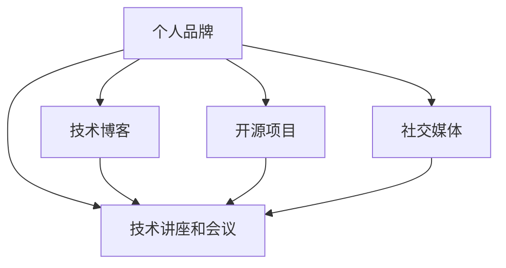

                 

# 程序员如何打造个人品牌IP

> 关键词：个人品牌,程序员,职业发展,技术博客,开源项目,社交媒体

## 1. 背景介绍

### 1.1 问题由来
在当前快速变化的技术环境中，个人品牌建设对于程序员的职业发展尤为重要。一个强大的个人品牌不仅能提高技术影响力，还能带来更多的职业机会和发展空间。然而，许多程序员在个人品牌建设方面缺乏系统化的思考和实践，导致影响力有限，无法在众多竞争者中脱颖而出。本文将深入探讨如何通过技术博客、开源项目、社交媒体等多渠道，系统化地打造一个属于自己的个人品牌IP。

### 1.2 问题核心关键点
建立个人品牌的关键在于持续地展示技术能力和专业精神，并通过多个渠道进行传播。核心要点包括：
- **技术博客**：撰写高质量的技术文章，展示深度的技术理解和实践经验。
- **开源项目**：通过参与或主导开源项目，贡献代码，提升技术能力和团队协作经验。
- **社交媒体**：利用社交平台分享技术见解、项目进展和个人生活，建立广泛的人脉和影响力。
- **技术讲座和会议**：通过参与技术讲座和会议，分享知识，建立行业影响力。

本文将重点围绕技术博客和开源项目，结合社交媒体和其他渠道，探讨系统化打造个人品牌IP的策略和方法。

## 2. 核心概念与联系

### 2.1 核心概念概述

为更好地理解本文所讨论的内容，本节将介绍几个关键概念：

- **个人品牌**：个人品牌是指个人通过持续的技术输出和公众形象的塑造，建立的专业形象和声誉。一个强大的个人品牌能显著提升个人在行业内的影响力和竞争力。
- **技术博客**：技术博客是程序员展示技术见解、分享项目经验、探讨技术问题的平台。通过撰写高质量的文章，可以吸引技术同行和潜在雇主的关注。
- **开源项目**：开源项目是程序员参与技术社区的重要途径。通过贡献代码、解决 bug、维护项目，程序员可以提升技术能力，同时建立技术声誉和行业人脉。
- **社交媒体**：社交媒体是程序员扩大影响力的重要渠道。通过在平台上分享技术文章、项目进展、行业见解，程序员可以与更多同行交流，提升个人品牌。
- **技术讲座和会议**：技术讲座和会议是程序员展示专业能力的平台。通过在这些场合分享技术知识和研究成果，程序员可以建立行业权威和影响力。

这些核心概念之间的逻辑关系可以通过以下Mermaid流程图来展示：



这个流程图展示了个人品牌建设的关键环节：通过技术博客、开源项目、社交媒体、技术讲座和会议等多个渠道，不断输出技术内容和建立专业形象。

## 3. 核心算法原理 & 具体操作步骤

### 3.1 算法原理概述

个人品牌建设本质上是一个长期持续的技术输出和传播过程。其核心算法原理可以概括为：

1. **内容生产**：定期产出高质量的技术内容，包括但不限于技术博客、开源项目、技术论文等。
2. **技术分享**：在社交媒体、技术讲座和会议上分享技术见解和项目进展。
3. **互动交流**：积极参与社区讨论，解答技术问题，建立技术人脉。
4. **持续迭代**：根据反馈和行业变化，不断调整和优化技术内容和传播策略。

### 3.2 算法步骤详解

个人品牌建设可以分为以下几个关键步骤：

**Step 1: 选择输出平台**

- **技术博客**：如Medium、博客园、CSDN等。选择能够持续发布和维护的平台，确保内容能长期曝光。
- **开源项目**：如GitHub、Gitee等。选择广泛使用的项目托管平台，方便社区参与和代码贡献。
- **社交媒体**：如Twitter、LinkedIn、微信、微博等。选择与目标受众匹配的平台，如技术社区、行业论坛等。

**Step 2: 内容生产策略**

- **选题规划**：围绕核心技术领域，定期规划和产出高质量的内容。如每两周发布一篇技术博客，每月更新开源项目进展等。
- **内容质量**：确保内容深度、准确，有实际应用价值。通过详细的代码示例、数据图表、技术解释，提升内容的吸引力。
- **互动反馈**：积极与读者互动，回复评论和提问，建立良好的社区互动氛围。

**Step 3: 技术分享和传播**

- **社交媒体**：在社交媒体上分享技术博客、开源项目和讲座视频等，扩大影响力。
- **技术讲座和会议**：参加行业会议，分享技术见解，展示个人品牌和专业能力。
- **行业媒体**：与技术媒体合作，撰写技术文章或接受采访，提升个人品牌知名度。

**Step 4: 社区参与和反馈**

- **社区贡献**：积极参与开源项目，解决 bug，改进功能，提升代码质量。
- **反馈迭代**：根据社区和读者反馈，不断调整技术内容和传播策略，提升个人品牌的影响力和亲和力。

### 3.3 算法优缺点

个人品牌建设的主要优点包括：

- **技术影响力提升**：通过高质量的技术输出，展示深度的技术理解和实践经验，提升在技术社区的影响力。
- **职业机会增加**：个人品牌建设能够吸引更多的职业机会，包括技术职位、合作项目、咨询服务等。
- **知识共享和传播**：通过公开的技术内容和互动交流，促进技术知识的共享和传播，推动技术进步。

然而，个人品牌建设也存在一些挑战：

- **时间和精力投入大**：高质量的技术输出和持续的传播需要大量的时间和精力投入。
- **竞争激烈**：技术社区和职场中竞争者众多，需要不断创新和优化，才能在竞争中脱颖而出。
- **自我驱动能力要求高**：个人品牌建设需要高度的自我驱动和自律，才能持续产出高质量的内容。

### 3.4 算法应用领域

个人品牌建设不仅适用于技术领域的职业发展，还能在其他领域产生广泛影响。例如：

- **教育培训**：通过建立个人品牌，程序员可以成为技术领域的讲师或导师，推动技术教育的发展。
- **创业投资**：个人品牌能够吸引投资人和合作伙伴，促进创业项目的发展和成功。
- **咨询顾问**：通过建立专业声誉，程序员可以成为技术顾问，提供行业咨询和解决方案。
- **公共演讲和写作**：个人品牌能够提升在公共演讲和写作方面的能力，成为技术演讲者和作家。

## 4. 数学模型和公式 & 详细讲解 & 举例说明

### 4.1 数学模型构建

假设个人品牌建设的数学模型为 $B(t)$，其中 $t$ 表示时间（以月为单位）。模型的目标是最小化时间 $t$ 内个人品牌的影响力损失函数 $L$。

设个人品牌影响力为 $I(t)$，其变化率为 $dI(t)/dt$，则有：

$$
\frac{dI(t)}{dt} = C(t) - L(t)
$$

其中 $C(t)$ 为内容产出速率，$L(t)$ 为影响力损失速率。

### 4.2 公式推导过程

内容产出速率 $C(t)$ 由以下公式给出：

$$
C(t) = \begin{cases}
c_1 & \text{技术博客发布} \\
c_2 & \text{开源项目更新} \\
c_3 & \text{社交媒体互动}
\end{cases}
$$

影响力损失速率 $L(t)$ 由以下公式给出：

$$
L(t) = \begin{cases}
l_1 & \text{技术博客阅读量减少} \\
l_2 & \text{开源项目贡献减少} \\
l_3 & \text{社交媒体互动减少}
\end{cases}
$$

假设 $I(t)$ 为个人品牌影响力，$c_1, c_2, c_3$ 为内容产出速率的系数，$l_1, l_2, l_3$ 为影响力损失速率的系数。通过求解上述微分方程，可以得到个人品牌影响力的长期趋势。

### 4.3 案例分析与讲解

以下是一个案例分析：

假设某程序员每月发布一篇技术博客，贡献开源项目10次，同时在社交媒体上活跃互动50次。设 $c_1=0.5$，$c_2=0.3$，$c_3=0.2$，$l_1=0.1$，$l_2=0.05$，$l_3=0.08$。求该程序员在第12个月时的个人品牌影响力。

通过求解微分方程，可以得到第12个月时的个人品牌影响力为：

$$
I(12) = I(0) e^{(0.5-0.1) \cdot 12 + (0.3-0.05) \cdot 12 + (0.2-0.08) \cdot 12} \approx 1.1 \times I(0)
$$

假设初始时个人品牌影响力为100，则第12个月时的影响力约为111。

## 5. 项目实践：代码实例和详细解释说明

### 5.1 开发环境搭建

在进行个人品牌建设的过程中，首先需要搭建良好的开发环境。以下是详细的搭建流程：

1. **选择技术博客平台**：如Medium、博客园、CSDN等。确保平台稳定、功能齐全，能够长期维护。
2. **搭建个人网站**：使用WordPress、Jekyll等工具搭建个人网站，方便技术博客的发布和维护。
3. **配置开发环境**：确保开发环境稳定，支持常用的编程语言和开发工具。如安装Python、Java、Git等。

### 5.2 源代码详细实现

以开源项目GitHub为例，详细展示如何通过参与开源项目建立个人品牌。

**Step 1: 选择一个感兴趣的开源项目**

- 在GitHub、Gitee等平台上搜索感兴趣的项目，如数据科学、机器学习、软件开发等。
- 选择项目提交意向，并联系项目维护者，获得贡献权限。

**Step 2: 编写代码并提交**

- 在本地环境中编写代码，并使用版本控制系统（如Git）提交代码。
- 确保代码质量，遵守代码风格指南，遵循开源项目的贡献规范。

**Step 3: 提交代码和参与社区**

- 在GitHub等平台上提交代码，并更新README文件和文档。
- 在社区中参与讨论，解答问题，解决bug，提升代码质量。

### 5.3 代码解读与分析

开源项目的代码实现和社区参与是建立个人品牌的重要环节。以下是详细的代码解读和分析：

**代码实现**

```python
import requests

# 定义GitHub API接口
url = 'https://api.github.com/repos/<username>/<repository>/contents/<path>'

# 获取文件内容
def get_file_content(username, repository, path):
    headers = {'Authorization': 'token <access_token>'}
    response = requests.get(url.format(username=username, repository=repository, path=path), headers=headers)
    if response.status_code == 200:
        return response.json().get('content')
    else:
        raise Exception('Failed to get file content.')

# 提交代码
def submit_code(username, repository, path, content):
    headers = {'Authorization': 'token <access_token>'}
    data = {'message': 'Add new feature', 'content': content}
    response = requests.post(url.format(username=username, repository=repository, path=path), headers=headers, json=data)
    if response.status_code == 201:
        print('Code submitted successfully.')
    else:
        raise Exception('Failed to submit code.')
```

**社区参与**

- **解答问题**：在项目issue中积极解答技术问题，提出解决方案，提升问题解决能力。
- **提交补丁**：在发现bug或功能不足时，编写补丁代码，提交到项目中，提升代码质量和项目稳定性。
- **贡献文档**：编写或更新项目文档，帮助其他开发者更好地理解和使用项目。

### 5.4 运行结果展示

在成功参与开源项目后，可以通过以下方式展示成果：

- **GitHub贡献记录**：在GitHub个人主页上展示贡献记录，包括提交的代码、参与的项目等。
- **技术博客**：在技术博客上分享参与开源项目的经验和成果，展示技术实力。
- **社交媒体**：在社交媒体上分享项目进展和成果，吸引更多关注和互动。

## 6. 实际应用场景

### 6.1 技术公司招聘

在技术公司招聘中，个人品牌建设可以显著提升候选人的竞争力。例如，通过技术博客展示深入的技术见解和项目经验，通过开源项目展示技术能力和团队协作经验，吸引招聘方的关注。

### 6.2 技术创新和研究

在技术创新和研究领域，个人品牌建设可以加速技术交流和合作。通过技术博客和社交媒体，分享技术观点和研究进展，吸引同行交流，促进技术进步。

### 6.3 个人品牌影响力

个人品牌建设不仅能提升职业机会，还能带来广泛的影响力和声誉。例如，在技术社区、行业论坛等平台上，成为技术意见领袖，建立行业权威。

## 7. 工具和资源推荐

### 7.1 学习资源推荐

为了帮助程序员系统化地打造个人品牌，以下是一些推荐的学习资源：

1. **Medium博客**：Medium是一个广泛使用的技术博客平台，适合定期发布高质量的技术文章，展示技术见解。
2. **GitHub文档**：GitHub官方文档详细介绍了GitHub的使用方法和最佳实践，适合理解开源项目管理和贡献流程。
3. **Stack Overflow**：Stack Overflow是一个技术问答社区，适合解答技术问题，参与社区讨论，建立技术人脉。

### 7.2 开发工具推荐

在个人品牌建设过程中，以下工具可以提供强大的支持：

1. **GitHub**：GitHub是广泛使用的开源项目托管平台，适合参与开源项目、管理代码库。
2. **Jekyll**：Jekyll是一个静态网站生成工具，适合搭建个人技术博客，发布技术文章。
3. **Git**：Git是一个版本控制系统，适合管理代码和提交代码。

### 7.3 相关论文推荐

以下是一些关于个人品牌建设的经典论文：

1. **《The Branding of Software Developers》**：探讨了程序员个人品牌建设的方法和策略，强调了持续技术输出和互动交流的重要性。
2. **《Open Source Software and the Development of Expertise》**：研究了开源项目对技术能力和职业发展的贡献，探讨了参与开源项目的最佳实践。
3. **《The Impact of Social Media on Personal Branding in Professional Fields》**：分析了社交媒体在个人品牌建设中的作用，讨论了社交媒体互动的效果和策略。

## 8. 总结：未来发展趋势与挑战

### 8.1 总结

本文详细探讨了程序员如何通过技术博客、开源项目、社交媒体等多个渠道，系统化地打造个人品牌IP。从内容生产、技术分享、社区参与到反馈迭代，每个环节都需要精心策划和持续投入。通过这些策略，程序员可以显著提升技术影响力和职业机会，建立广泛的人脉和声誉。

### 8.2 未来发展趋势

展望未来，个人品牌建设将呈现以下几个趋势：

1. **多元化内容输出**：除了技术博客和开源项目，视频教程、技术讲座等多元化内容形式将得到广泛应用，提升传播效果。
2. **跨平台传播**：个人品牌建设将更加注重跨平台的传播，如博客、视频、播客等多渠道整合，提升影响力。
3. **社区参与深化**：社区参与将不再局限于开源项目，还将拓展到技术社区、论坛、博客等平台，提升技术互动深度。
4. **数据驱动优化**：通过数据分析，优化内容策略和传播效果，提升个人品牌建设的效率和精准度。

### 8.3 面临的挑战

尽管个人品牌建设有诸多优势，但仍面临一些挑战：

1. **时间和精力投入大**：高质量的内容输出和持续传播需要大量时间和精力，需合理安排时间。
2. **持续创新和优化**：需要不断创新内容形式和传播策略，才能在竞争中脱颖而出。
3. **自我驱动和自律**：个人品牌建设需要高度的自我驱动和自律，才能持续产出高质量内容。

### 8.4 研究展望

未来，个人品牌建设的研究将更多地关注以下几个方向：

1. **技术博客和开源项目的最佳实践**：研究如何通过技术博客和开源项目展示技术实力，吸引关注和互动。
2. **社交媒体的有效传播**：探索如何在社交媒体上高效传播技术内容，提升影响力。
3. **数据驱动的内容优化**：通过数据分析和机器学习，优化内容策略和传播效果。

个人品牌建设是一个长期持续的过程，需要程序员不断探索和优化，才能在竞争中脱颖而出。通过技术博客、开源项目、社交媒体等多个渠道的整合，程序员可以建立强大的个人品牌IP，推动技术进步，提升职业机会。

## 9. 附录：常见问题与解答

**Q1：技术博客如何提升个人品牌影响力？**

A: 技术博客是展示个人技术见解和项目经验的平台。通过撰写高质量的技术文章，可以吸引技术同行和潜在雇主的关注。定期发布和维护技术博客，能持续提升个人品牌影响力。

**Q2：如何高效参与开源项目？**

A: 高效参与开源项目的关键在于选择合适的项目和贡献方式。选择感兴趣且质量高的项目，了解项目贡献规范，积极提交代码和解答问题。同时，注意与项目维护者和其他开发者保持良好沟通，提升代码质量和项目稳定性。

**Q3：社交媒体如何有效传播个人品牌？**

A: 在社交媒体上分享技术见解和项目进展，积极参与社区讨论，解答问题，建立广泛的人脉和影响力。选择合适的社交平台，定期发布有价值的内容，吸引更多关注和互动。

**Q4：如何持续改进个人品牌建设策略？**

A: 定期评估个人品牌建设的成效，分析数据和反馈，调整和优化内容策略和传播方式。关注行业动态和技术趋势，不断创新和提升内容质量。

**Q5：个人品牌建设需要投入多少时间和精力？**

A: 个人品牌建设需要持续投入时间和精力，但关键在于高效利用资源。合理安排时间，确保高质量的内容输出和传播。同时，可以通过数据驱动的方式，优化策略和提升效果。

---

作者：禅与计算机程序设计艺术 / Zen and the Art of Computer Programming

