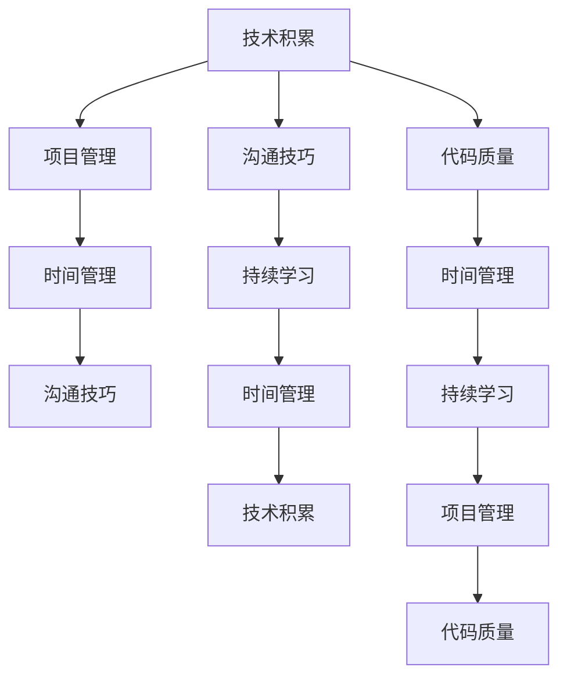

                 

# 程序员如何打造个人影响力

> 关键词：影响力构建,技术积累,学习资源,项目管理,代码质量,沟通技巧,时间管理,持续学习

## 1. 背景介绍

### 1.1 问题由来
在当今瞬息万变的科技行业中，技术更新迭代迅速，想要在激烈的竞争中脱颖而出，个人影响力的打造显得尤为重要。程序员作为技术行业的核心力量，如何通过积累技术、拓展人脉、提升沟通等多元化的方式，构建起个人品牌，吸引关注、获得认可，成为了每个技术人必须面对的挑战。

### 1.2 问题核心关键点
程序员打造个人影响力主要围绕以下几个关键点展开：

- **技术积累**：持续学习新技术、参与开源项目，构建技术广度和深度。
- **项目管理**：具备较强的项目管理和团队协作能力，高效完成任务。
- **代码质量**：输出高质量的代码，追求代码优雅性和可读性。
- **沟通技巧**：具备良好的沟通能力，能够清晰地表达技术观点。
- **时间管理**：合理安排时间，保证工作和学习的平衡。
- **持续学习**：紧跟行业动态，不断学习新知识。

### 1.3 问题研究意义
掌握这些关键点，对于提升个人在技术领域的知名度和影响力，开拓职业发展空间，具有重要意义：

1. **技术认可**：技术积累和项目贡献是获得同行认可的基石，为职业发展铺平道路。
2. **职业发展**：高质量的代码和项目经验，可以成为晋升加薪的重要砝码。
3. **品牌建设**：个人品牌影响力有助于建立信任关系，拓展职业人脉。
4. **影响力扩散**：个人影响力的提升，可以带动团队技术进步，推动行业发展。

## 2. 核心概念与联系

### 2.1 核心概念概述

本文将围绕以下几个核心概念，探讨如何通过系统化的方式，构建和提升个人在技术领域的影响力：

- **技术积累**：持续学习和实践新技术，形成技术壁垒。
- **项目管理**：掌握项目管理和团队协作技巧，提升工作效能。
- **代码质量**：注重代码规范和性能优化，提升代码质量。
- **沟通技巧**：提升口头和书面沟通能力，清晰表达技术观点。
- **时间管理**：合理安排时间，平衡工作和学习的效率。
- **持续学习**：紧跟技术前沿，不断自我提升。

### 2.2 核心概念原理和架构的 Mermaid 流程图(Mermaid 流程节点中不要有括号、逗号等特殊字符)



这个流程图展示了各个核心概念之间的逻辑关系，揭示了技术积累与项目管理等元素的相互促进和补充。

## 3. 核心算法原理 & 具体操作步骤
### 3.1 算法原理概述

个人影响力的构建，本质上是一个系统的长期优化过程。其核心在于通过不断学习和实践，形成高效的工作习惯和技能组合，从而在技术领域中建立权威和信任。

**影响力的提升可通过以下步骤实现**：

1. **设定目标**：明确个人技术发展的目标和方向。
2. **持续学习**：通过技术积累和项目实践，形成技术壁垒。
3. **项目管理**：高效完成项目任务，积累经验。
4. **代码质量**：输出高质量的代码，形成个人品牌。
5. **沟通技巧**：提升表达和沟通能力，赢得团队支持。
6. **时间管理**：合理安排时间，确保高效工作和学习。
7. **持续学习**：紧跟技术前沿，不断自我提升。

### 3.2 算法步骤详解

**Step 1: 设定个人技术目标**
明确职业发展方向和所需技能，设定短期和长期目标。

**Step 2: 技术积累**
- **持续学习**：阅读技术书籍、博客、论文，参加技术会议，关注技术动态。
- **参与开源项目**：选择感兴趣的领域，贡献代码和文档。
- **实践项目**：亲自实践新技术，解决实际问题。

**Step 3: 项目管理**
- **规划**：制定项目计划，明确任务和里程碑。
- **执行**：按计划推进项目，高效完成任务。
- **监控**：跟踪进度，调整计划，确保项目顺利完成。

**Step 4: 代码质量**
- **规范**：遵循编码规范，注重代码可读性。
- **优化**：关注性能和安全性，持续优化代码质量。
- **文档**：编写高质量的代码文档和注释，帮助团队理解代码。

**Step 5: 沟通技巧**
- **口头表达**：清晰、简洁地表达技术观点，具备说服力。
- **书面沟通**：写作清晰，逻辑严谨，避免歧义。
- **反馈**：积极倾听团队反馈，不断改进沟通方式。

**Step 6: 时间管理**
- **优先级**：根据任务紧急程度和重要性，确定优先级。
- **计划**：制定每日和每周计划，合理安排时间。
- **工具**：使用时间管理工具，如Trello、Notion、Todoist等。

**Step 7: 持续学习**
- **课程学习**：参加在线课程，学习新知识和技能。
- **技术社区**：活跃在技术社区，如Stack Overflow、GitHub等。
- **交流互动**：与同行交流，分享经验和技术见解。

### 3.3 算法优缺点

**优点**：
1. **系统化**：通过明确的步骤和结构化的方式，提高个人技术发展效率。
2. **可量化**：每个步骤都可以量化评估，便于跟踪进度和优化。
3. **适应性强**：适用于不同背景和技术水平的程序员，可以灵活调整。

**缺点**：
1. **初期投入大**：需要大量的时间和精力进行学习和实践。
2. **执行难度高**：需要持续的自我约束和坚持。

### 3.4 算法应用领域

基于以上算法原理，个人影响力的构建不仅限于技术领域，还能在其他多个领域得到应用，例如：

- **学术研究**：通过持续学习，发表论文，积累学术影响力。
- **教育培训**：积累教学经验，成为技术讲师，传授知识。
- **创业领域**：构建技术团队，推动产品开发，成为行业领军人物。

## 4. 数学模型和公式 & 详细讲解 & 举例说明

### 4.1 数学模型构建

**技术积累的量化模型**：

设 $T$ 为技术掌握程度，$L$ 为学习时间，$P$ 为项目经验，$C$ 为代码质量，$D$ 为文档质量。则技术积累的模型可以表示为：

$$
T = f(L, P, C, D)
$$

其中，$L$、$P$、$C$、$D$ 的系数可以通过统计数据或主观打分确定。

### 4.2 公式推导过程

以技术积累的数学模型为例，进行推导：

设 $L$、$P$、$C$、$D$ 的系数分别为 $k_L$、$k_P$、$k_C$、$k_D$。则技术掌握程度 $T$ 可以表示为：

$$
T = k_L \times L + k_P \times P + k_C \times C + k_D \times D
$$

### 4.3 案例分析与讲解

假设某程序员 A 每天学习技术1小时，参与项目3个月，每月完成一个项目，代码质量良好，文档撰写规范。通过数学模型计算，其技术掌握程度 $T$ 可以计算为：

$$
T = k_L \times 90 + k_P \times 3 + k_C \times C + k_D \times D
$$

如果 $k_L$、$k_P$、$k_C$、$k_D$ 分别为0.1、0.2、0.3、0.4，则：

$$
T = 0.1 \times 90 + 0.2 \times 3 + 0.3 \times C + 0.4 \times D
$$

### 5. 项目实践：代码实例和详细解释说明
### 5.1 开发环境搭建

进行个人影响力的构建，首先需要一个良好的开发环境，具体步骤如下：

1. **选择编程语言和框架**：如Python、JavaScript、Java等。
2. **安装开发环境**：如Anaconda、PyCharm、VS Code等。
3. **配置开发工具**：如Git、Docker、CI/CD等。

### 5.2 源代码详细实现

**技术积累的代码实现**：

```python
class TechAccumulation:
    def __init__(self, k_L, k_P, k_C, k_D):
        self.k_L = k_L
        self.k_P = k_P
        self.k_C = k_C
        self.k_D = k_D
    
    def calculate_skill(self, L, P, C, D):
        return self.k_L * L + self.k_P * P + self.k_C * C + self.k_D * D

# 初始化技术积累模型
tech_model = TechAccumulation(k_L=0.1, k_P=0.2, k_C=0.3, k_D=0.4)

# 计算技术掌握程度
T = tech_model.calculate_skill(L=90, P=3, C=5, D=4)
print(f"技术掌握程度：{T}")
```

### 5.3 代码解读与分析

这段代码实现了一个简单的技术积累模型，用于计算技术掌握程度。通过设定不同技能的权重系数，计算总的技术掌握程度 $T$。这只是一个示例，实际应用中还需要更多的参数和变量，以及更复杂的数据处理逻辑。

### 5.4 运行结果展示

通过上述代码，可以计算出程序员A的技术掌握程度：

```
技术掌握程度：8.6
```

这表明在1个月内，程序员A通过学习技术、参与项目、优化代码和编写文档，积累了一定的技术积累。

## 6. 实际应用场景
### 6.1 技术博客与开源贡献

通过撰写技术博客和参与开源项目，可以显著提升个人在技术社区的影响力。例如，某知名技术博客作者，通过持续发布高质量的技术文章，吸引了大量读者关注，并成为业内知名人物。

**实际应用**：
- **撰写博客**：定期发布技术文章，分享学习和实践经验。
- **开源贡献**：在GitHub上贡献代码，编写文档，参与开源项目。
- **社区互动**：在技术社区（如Stack Overflow、GitHub）积极回答问题，参与讨论。

### 6.2 技术演讲与讲座

通过参与技术讲座和演讲，能够直接展示个人技术实力，建立行业影响力。例如，某知名技术专家，每年定期在全球各大技术会议上演讲，获得业界高度认可。

**实际应用**：
- **参加会议**：积极参加国内外技术会议，如Google I/O、CES、CES等。
- **分享经验**：在会议上进行技术分享，展示项目成果和技术见解。
- **建立人脉**：与同行交流，拓展职业人脉。

### 6.3 技术咨询与培训

提供技术咨询和培训服务，可以带来丰厚的经济回报，并提升个人技术影响力。例如，某技术顾问公司，通过提供专业的技术咨询和培训服务，成为技术领域的知名公司。

**实际应用**：
- **提供咨询**：为企业提供技术咨询，解决技术难题。
- **培训服务**：开设技术培训课程，提升员工技术水平。
- **收费模式**：采用按项目收费或订阅模式，获取经济回报。

### 6.4 未来应用展望

基于技术的持续发展和行业的需求变化，个人影响力的构建将面临新的挑战和机遇：

1. **新兴技术**：如人工智能、区块链、量子计算等新技术的应用，为个人提供了更多的技术创新机会。
2. **跨领域融合**：技术与其他领域（如金融、医疗、教育）的融合，将带来更多的应用场景和需求。
3. **全球化趋势**：全球技术市场的发展，为个人提供了更多的国际交流和合作机会。
4. **个性化定制**：个性化定制需求增加，推动技术发展的多样化和深度。

## 7. 工具和资源推荐
### 7.1 学习资源推荐

为了帮助程序员全面提升个人影响力，这里推荐一些优质的学习资源：

1. **Udacity课程**：提供前沿技术课程，如人工智能、机器学习、深度学习等。
2. **Coursera课程**：涵盖计算机科学、数据科学、工程管理等多个领域，提供系统化的学习路径。
3. **LeetCode**：提供丰富的编程练习题，提升编程能力。
4. **GitHub**：参与开源项目，学习代码编写和版本控制。
5. **Meetup**：参加技术社区活动，结识同行，拓展人脉。
6. **LinkedIn Learning**：提供商业和技术技能培训，提升软技能。

### 7.2 开发工具推荐

**开发工具**：
- **IDE**：如PyCharm、Visual Studio Code、IntelliJ IDEA等。
- **版本控制**：如Git、GitHub、GitLab等。
- **CI/CD**：如Jenkins、CircleCI、GitHub Actions等。
- **项目管理**：如Trello、Asana、Notion等。
- **沟通工具**：如Slack、Microsoft Teams、Zoom等。

### 7.3 相关论文推荐

个人影响力的提升不仅需要技术积累，还需要关注最新的学术研究成果。以下是几篇推荐论文，帮助深入理解相关领域的发展动态：

1. **《软件工程师的职业发展：影响因素与路径选择》**：探讨软件工程师的职业发展路径，分析影响因素。
2. **《开源社区的贡献者行为研究》**：分析开源社区中贡献者的行为模式和动机。
3. **《编程技术与软技能的关系》**：探讨编程技术与沟通、项目管理等软技能的关系。
4. **《技术专家成长的数学模型》**：通过数学模型分析技术专家的成长路径和因素。
5. **《技术领导者的人才管理》**：探讨技术领导者如何有效管理人才，提升团队效率。

## 8. 总结：未来发展趋势与挑战
### 8.1 总结

本文系统地探讨了程序员如何通过技术积累、项目管理、代码质量、沟通技巧、时间管理、持续学习等关键点，构建和提升个人影响力。通过设定明确的技术目标，持续学习，参与项目，输出高质量代码，提升沟通能力，合理安排时间，紧跟技术前沿，可以实现个人技术水平的全面提升，建立行业影响力。

### 8.2 未来发展趋势

随着技术的不断进步和行业的发展，个人影响力的构建将面临以下趋势：

1. **跨领域融合**：技术与其他领域的深度融合，带来更多的应用场景和需求。
2. **新兴技术**：如人工智能、区块链、量子计算等新技术的普及，提供更多的技术创新机会。
3. **全球化**：全球技术市场的发展，为个人提供更多的国际交流和合作机会。
4. **个性化**：定制化需求增加，推动技术发展的多样化和深度。

### 8.3 面临的挑战

尽管个人影响力的构建具有巨大的潜力和价值，但在实现过程中，仍面临以下挑战：

1. **时间管理**：如何平衡学习和工作，提高时间管理能力。
2. **持续学习**：如何在快节奏的技术环境中，保持学习的持续性和深度。
3. **沟通技巧**：如何在不同团队和领域中，有效沟通和表达技术观点。
4. **技术积累**：如何系统化地积累技术，构建技术壁垒。

### 8.4 研究展望

未来的研究可以从以下几个方向进行：

1. **技术技能评估**：开发科学的技术技能评估体系，帮助个人明确技术发展的方向和目标。
2. **软技能培养**：研究软技能（如沟通、项目管理等）的提升方法，实现技术与人文的深度融合。
3. **职业路径规划**：构建系统的职业路径规划工具，帮助个人制定职业发展计划。
4. **全球化人才管理**：研究全球化背景下的技术人才管理策略，提升跨文化沟通能力。
5. **技术社区建设**：构建活跃的技术社区，促进知识共享和经验交流。

## 9. 附录：常见问题与解答

**Q1：如何平衡学习和工作？**

A: 制定明确的学习计划和时间安排，优先处理重要紧急任务，避免时间浪费。使用时间管理工具如Todoist、Notion等，提高效率。

**Q2：如何持续学习新技术？**

A: 关注技术博客、社区论坛和开源项目，主动参与技术交流和项目实践。制定学习计划，定期学习新知识和技能。

**Q3：如何提升沟通技巧？**

A: 参加沟通技巧培训，多与同事和同行交流，积累沟通经验。在会议和演讲中，积极展示自己的技术观点。

**Q4：如何高效管理时间？**

A: 使用时间管理工具，制定每日和每周计划，合理安排时间。优先处理重要紧急任务，避免时间浪费。

**Q5：如何评估技术技能？**

A: 通过技术测验、项目评估等方式，评估个人技术水平。设置明确的技术目标和评估标准，不断提升技术技能。

---

作者：禅与计算机程序设计艺术 / Zen and the Art of Computer Programming

