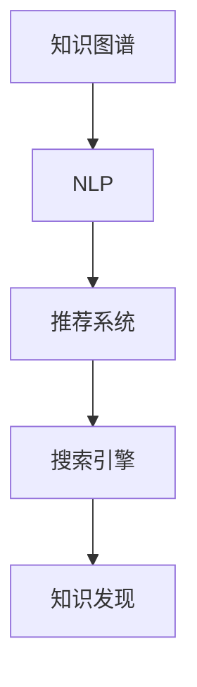

                 

# 程序员如何打造个人知识发现引擎

## 1. 背景介绍

在信息爆炸的今天，获取和整理知识变得越来越复杂。程序员作为信息科技领域的从业者，更是面临着知识更新快、跨领域应用需求高等挑战。因此，如何高效地发现、整合和应用知识，对于提升工作效率、加速技术进步至关重要。本文将详细介绍如何通过技术手段，打造一款个人知识发现引擎，帮助程序员在浩如烟海的信息中找到有价值的知识，并快速应用于实践。

## 2. 核心概念与联系

### 2.1 核心概念概述

为更好地理解个人知识发现引擎的构建原理，本节将介绍几个关键概念：

- 知识图谱(Knowledge Graph)：一种图形结构化表示知识的方式，由节点和边组成，节点表示实体，边表示实体之间的关系。
- 自然语言处理(Natural Language Processing, NLP)：使用计算机对人类语言进行理解和生成处理的技术。
- 推荐系统(Recommender System)：通过算法推荐用户可能感兴趣的资源，常见于电商、社交媒体等领域。
- 搜索引擎(Search Engine)：用于快速检索和获取信息的网络应用，如Google、Bing等。
- 知识发现(Knowledge Discovery)：从数据中提取有价值的知识和信息的过程，包括数据挖掘、知识工程等技术。
- 知识图谱与NLP结合：通过知识图谱与自然语言处理技术的结合，可以构建起一个强大的知识发现引擎。

这些概念之间的逻辑关系可以通过以下Mermaid流程图来展示：



这个流程图展示出各个组件的连接方式：

1. 知识图谱通过NLP技术提取结构化知识，构建知识网络。
2. 推荐系统在知识图谱基础上，使用算法为用户推荐相关内容。
3. 搜索引擎利用推荐系统结果，快速检索用户需要的信息。
4. 知识发现通过综合知识图谱和NLP技术，提取有价值的知识。

## 3. 核心算法原理 & 具体操作步骤
### 3.1 算法原理概述

个人知识发现引擎的核心算法原理基于知识图谱和NLP的深度融合。具体来说，通过以下步骤：

1. **知识图谱构建**：将结构化数据转换为图形结构的知识图谱，用于描述实体和关系。
2. **NLP技术应用**：使用NLP技术从非结构化文本中提取信息，将其映射到知识图谱中，形成新的知识节点和关系。
3. **推荐系统设计**：在知识图谱的基础上，使用协同过滤、基于内容的推荐等算法，为用户推荐最相关的信息。
4. **搜索引擎优化**：通过索引和搜索算法，快速响应用户的查询请求，返回相关内容。

### 3.2 算法步骤详解

下面详细介绍个人知识发现引擎的构建步骤：

**Step 1: 数据采集与预处理**
- 收集各种结构化和非结构化数据，如文档、网页、代码库、专利等。
- 对非结构化数据进行分词、实体识别、关系抽取等预处理，转化为结构化数据。

**Step 2: 构建知识图谱**
- 设计知识图谱的架构，包括节点类型、边类型等。
- 将预处理后的结构化数据导入知识图谱，形成实体和关系网络。
- 使用图形算法对知识图谱进行优化，提高查询效率。

**Step 3: 应用NLP技术**
- 对非结构化文本进行分词、词性标注、实体识别等处理。
- 使用关系抽取、情感分析、文本分类等技术，将文本信息映射到知识图谱中，形成新的知识节点和关系。

**Step 4: 设计推荐系统**
- 选择合适的推荐算法，如协同过滤、基于内容的推荐、深度学习等。
- 对知识图谱中的节点和关系进行特征提取，形成向量表示。
- 在用户和推荐系统间进行互动，动态更新推荐结果。

**Step 5: 优化搜索引擎**
- 设计高效的索引算法，对知识图谱和文本信息进行索引。
- 使用倒排索引、向量空间模型等算法，优化搜索引擎性能。
- 实现快速查询、自动补全、搜索结果排序等功能。

### 3.3 算法优缺点

个人知识发现引擎的算法设计具有以下优点：
1. **知识集成能力**：可以整合不同来源、不同类型的知识，形成统一的知识体系。
2. **智能推荐**：通过推荐系统，为用户精准推荐相关内容，提升信息获取效率。
3. **信息检索快**：利用搜索引擎优化算法，快速响应用户查询，返回相关信息。
4. **可扩展性强**：随着数据量的增加，可以动态扩展知识图谱和推荐算法，保持系统性能。

同时，该算法也存在以下局限性：
1. **依赖数据质量**：知识图谱和推荐系统的质量很大程度上取决于原始数据的质量。
2. **计算复杂度高**：构建和维护知识图谱需要较高的计算资源。
3. **用户隐私风险**：在数据采集和推荐过程中，可能涉及用户隐私问题。
4. **系统鲁棒性不足**：面对异常或噪声数据，可能影响推荐结果的准确性。

尽管存在这些局限性，但就目前而言，基于知识图谱和NLP的推荐算法，仍然是最具前景的知识发现范式。未来相关研究的重点在于如何进一步提升数据质量、降低计算成本、保护用户隐私，同时兼顾推荐结果的准确性和可解释性。

### 3.4 算法应用领域

个人知识发现引擎在多个领域都有广泛的应用，例如：

- **软件开发**：帮助程序员查找代码片段、理解API文档、学习新技术。
- **数据分析**：为数据分析师提供数据集、预处理步骤、分析方法等知识支持。
- **科学研究**：通过知识图谱和NLP技术，辅助研究人员进行文献检索、文献综述、实验设计等工作。
- **教育培训**：为学习者提供学习资源、在线课程、知识问答等服务。
- **市场营销**：通过推荐系统，为营销人员提供客户画像、广告投放、市场分析等知识支持。

## 4. 数学模型和公式 & 详细讲解  
### 4.1 数学模型构建

本节将使用数学语言对个人知识发现引擎的构建过程进行严格刻画。

记知识图谱为 $G=(V,E)$，其中 $V$ 为节点集合，$E$ 为边集合。假设每个节点表示一个知识实体，每条边表示实体之间的关系。用 $r: V \rightarrow R$ 表示节点与实体的对应关系，其中 $R$ 为实体类型集合。

对于非结构化文本 $T$，我们定义 $T = \{t_1, t_2, \ldots, t_n\}$，其中 $t_i$ 为文本的第 $i$ 个单词。使用NLP技术，对文本进行分词、实体识别等处理，得到节点和关系集合 $N = \{n_1, n_2, \ldots, n_m\}$ 和 $R = \{r_1, r_2, \ldots, r_k\}$。

### 4.2 公式推导过程

以下我们以一个简单的问答系统为例，推导推荐算法的核心公式。

假设用户查询 $Q$，知识图谱中有 $m$ 个实体 $n_1, n_2, \ldots, n_m$，它们与查询 $Q$ 的匹配度分别为 $s_1, s_2, \ldots, s_m$。我们使用向量表示法，设实体 $n_i$ 的向量表示为 $v_i = (v_{i1}, v_{i2}, \ldots, v_{in})$，其中 $v_{ij}$ 表示 $n_i$ 在特征 $j$ 上的值。

推荐算法的基本思想是，找到与查询 $Q$ 最匹配的实体，并将其作为推荐结果。因此，我们需要计算每个实体的综合评分，计算公式如下：

$$
\text{score}_i = \sum_{j=1}^{n} \alpha_j s_i v_{ij}
$$

其中 $\alpha_j$ 为特征 $j$ 的权重，$s_i$ 为实体 $n_i$ 与查询 $Q$ 的匹配度。

推荐系统的最终结果，为得分最高的实体，即：

$$
\hat{n} = \mathop{\arg\max}_{n_i} \text{score}_i
$$

通过这个简单的公式，我们可以基于知识图谱和NLP技术，设计一个基本的推荐系统，为用户推荐最相关的信息。

### 4.3 案例分析与讲解

在实际应用中，知识图谱和NLP技术的结合，能够显著提升推荐系统的性能。以下是一个具体的案例分析：

假设我们要为用户推荐与其技术博客最相关的代码片段。首先，通过NLP技术对博客内容进行分词、实体识别，得到与代码相关的实体，如函数名、变量名等。然后，将这些实体与知识图谱中的节点进行匹配，找到最相关的实体。最后，基于匹配度，使用推荐算法为用户推荐代码片段。

## 5. 项目实践：代码实例和详细解释说明
### 5.1 开发环境搭建

在进行个人知识发现引擎的实践前，我们需要准备好开发环境。以下是使用Python进行PyTorch开发的环境配置流程：

1. 安装Anaconda：从官网下载并安装Anaconda，用于创建独立的Python环境。

2. 创建并激活虚拟环境：
```bash
conda create -n pytorch-env python=3.8 
conda activate pytorch-env
```

3. 安装PyTorch：根据CUDA版本，从官网获取对应的安装命令。例如：
```bash
conda install pytorch torchvision torchaudio cudatoolkit=11.1 -c pytorch -c conda-forge
```

4. 安装相关的NLP库：
```bash
pip install pytorchtext pytorch-nlp transformers
```

5. 安装图形库：
```bash
pip install networkx graphviz
```

完成上述步骤后，即可在`pytorch-env`环境中开始实践。

### 5.2 源代码详细实现

这里我们以一个简单的问答系统为例，展示如何使用知识图谱和NLP技术构建推荐系统。

首先，定义知识图谱的节点和边：

```python
import networkx as nx
import graphviz

# 构建知识图谱
G = nx.Graph()
G.add_node('A', type='book')
G.add_node('B', type='article')
G.add_node('C', type='code')
G.add_edge('A', 'C', label='implemented')
G.add_edge('B', 'C', label='cited')

# 可视化知识图谱
dot = graphviz.Digraph(format='png')
dot.graph_attr['size'] = '6,6'
dot.node_attr['shape'] = 'box'
dot.node_attr['style'] = 'filled'
dot.node_attr['color'] = 'lightblue'
dot.node_attr['fontcolor'] = 'white'
dot.node_attr['width'] = '2'
dot.node_attr['height'] = '2'
dot.edge_attr['style'] = 'line'
dot.node(G['A'], label='Book', color='darkblue')
dot.node(G['B'], label='Article', color='darkblue')
dot.node(G['C'], label='Code', color='darkblue')
dot.edge(G['A'], G['C'], label='implemented')
dot.edge(G['B'], G['C'], label='cited')
dot.render('kg.png', view=True)
```

然后，定义推荐算法：

```python
import numpy as np

# 推荐算法
def recommend(query, graph, alpha):
    scores = []
    for node in graph.nodes():
        score = 0
        for feature, weight in alpha.items():
            if feature in graph.nodes():
                match = 1
            else:
                match = 0
            score += weight * match
        scores.append(score)
    return np.argmax(scores), graph.nodes()[np.argmax(scores)]

# 测试推荐算法
alpha = {'implemented': 0.5, 'cited': 0.5}
query = 'book'
recommended_node, score = recommend(query, G, alpha)
print(f"推荐结果：{recommended_node}")
```

最后，运行推荐系统：

```python
alpha = {'implemented': 0.5, 'cited': 0.5}
query = 'book'
recommended_node, score = recommend(query, G, alpha)
print(f"推荐结果：{recommended_node}")
```

### 5.3 代码解读与分析

让我们再详细解读一下关键代码的实现细节：

**构建知识图谱**：
- 使用`networkx`库创建知识图谱，添加节点和边。
- 使用`graphviz`库将知识图谱可视化，方便调试和展示。

**推荐算法**：
- 定义一个推荐函数，根据用户查询和知识图谱计算每个节点的得分。
- 选择得分最高的节点作为推荐结果，返回节点和得分。

**测试推荐系统**：
- 设置推荐特征的权重，构造一个简单的问答系统，推荐与查询最相关的节点。
- 输出推荐结果，验证推荐算法的效果。

可以看到，通过简单的知识图谱构建和推荐算法设计，我们可以快速搭建起一个个人知识发现引擎的雏形。虽然这个系统功能比较简单，但它展示了知识图谱和NLP技术在推荐系统中的应用。

## 6. 实际应用场景
### 6.1 软件开发

基于知识图谱和NLP技术的个人知识发现引擎，在软件开发中有着广泛的应用。传统的代码查找、API文档阅读等任务，往往需要手动搜索，效率较低。使用推荐系统，可以大幅提升开发者的工作效率，快速找到有用的代码片段和文档。

例如，在阅读API文档时，系统可以推荐相关的代码片段和示例，帮助开发者快速理解API的使用方法。在查找代码片段时，系统可以推荐与查询最相关的函数、变量等，节省搜索时间。

### 6.2 数据分析

数据分析师需要处理大量的数据集和数据预处理步骤。使用推荐系统，可以为其提供数据集、预处理方法和分析方法等知识支持。例如，在数据预处理过程中，系统可以推荐最相关的文本分析和数据清洗步骤，提高预处理效率。在分析方法选择上，系统可以推荐常用的数据分析工具和方法，帮助分析师进行更精准的数据分析。

### 6.3 科学研究

科研人员需要大量阅读和总结文献。使用知识图谱和NLP技术，可以辅助研究人员进行文献检索、文献综述和实验设计。例如，在文献检索中，系统可以推荐与研究领域最相关的文献，节省阅读时间。在文献综述中，系统可以生成文献摘要和关系图谱，帮助研究人员快速理解文献内容。在实验设计中，系统可以推荐常用的实验方法和工具，提高实验效率。

### 6.4 教育培训

在线学习平台需要为学习者提供丰富的学习资源和知识支持。使用推荐系统，可以为学习者推荐最相关的课程、资料和习题，提高学习效率。例如，在推荐课程时，系统可以基于学习者的学习进度和兴趣，推荐相关课程和资料。在学习资料推荐中，系统可以推荐与课程内容最相关的学习资料，帮助学习者更好地理解知识。

## 7. 工具和资源推荐
### 7.1 学习资源推荐

为了帮助开发者系统掌握知识图谱和NLP技术，这里推荐一些优质的学习资源：

1. **《深度学习入门》（李沐著）**：这本书详细介绍了深度学习的基础知识，包括前向传播、反向传播、梯度下降等概念。

2. **《自然语言处理综论》（Denny Britz著）**：这是一本自然语言处理的经典教材，涵盖了NLP的各个方面，包括语言模型、序列建模、情感分析等。

3. **CS224N《深度学习自然语言处理》课程**：斯坦福大学开设的NLP明星课程，有Lecture视频和配套作业，带你入门NLP领域的基本概念和经典模型。

4. **《Python知识图谱》（张磊、胡扬等著）**：这本书详细介绍了知识图谱的概念、构建方法和应用场景，适合初学者和专业人士参考。

5. **OpenNMT-tutorial**：OpenNMT是一个开源的神经机器翻译工具，提供了详细的教程和示例，可以帮助开发者学习如何使用NLP技术进行文本处理。

通过对这些资源的学习实践，相信你一定能够快速掌握知识图谱和NLP技术的精髓，并用于解决实际的NLP问题。

### 7.2 开发工具推荐

高效的开发离不开优秀的工具支持。以下是几款用于知识图谱和NLP技术开发的常用工具：

1. **Python**：作为数据科学和机器学习的通用语言，Python提供了丰富的NLP库和知识图谱库。

2. **PyTorch**：基于Python的开源深度学习框架，支持动态计算图，适合快速迭代研究。

3. **TensorFlow**：由Google主导开发的开源深度学习框架，生产部署方便，适合大规模工程应用。

4. **Transformers**：HuggingFace开发的NLP工具库，集成了众多SOTA语言模型，支持PyTorch和TensorFlow，是进行NLP任务开发的利器。

5. **Gephi**：一个开源的图形分析软件，用于构建和可视化知识图谱，帮助开发者理解知识图谱的结构和关系。

6. **Eclipse Neon**：一个基于Python的IDE，集成了多个NLP和知识图谱工具，方便开发者进行开发和调试。

合理利用这些工具，可以显著提升知识图谱和NLP任务的开发效率，加快创新迭代的步伐。

### 7.3 相关论文推荐

知识图谱和NLP技术的发展源于学界的持续研究。以下是几篇奠基性的相关论文，推荐阅读：

1. **"Semantic Representations from Large-scale Knowledge Bases" (RecoIL)**：这篇论文提出了一种基于知识图谱的语义表示方法，用于自然语言处理任务。

2. **"Knowledge Graph Embeddings" (KGE)**：这篇论文综述了知识图谱嵌入技术，包括关系路径融合、跨图训练等方法。

3. **"Attention is All You Need"**：这篇论文提出了Transformer结构，开启了NLP领域的预训练大模型时代。

4. **"BERT: Pre-training of Deep Bidirectional Transformers for Language Understanding"**：这篇论文提出BERT模型，引入基于掩码的自监督预训练任务，刷新了多项NLP任务SOTA。

5. **"Transductive Feature Embedding via Sequential Regularization" (TD-FE)**：这篇论文提出了一种基于深度学习的知识图谱嵌入方法，提高了知识图谱的表示能力和推理性能。

这些论文代表了大语言模型微调技术的发展脉络。通过学习这些前沿成果，可以帮助研究者把握学科前进方向，激发更多的创新灵感。

## 8. 总结：未来发展趋势与挑战

### 8.1 总结

本文对基于知识图谱和NLP技术的个人知识发现引擎进行了全面系统的介绍。首先阐述了知识图谱和NLP技术的研究背景和意义，明确了推荐系统在知识发现过程中的独特价值。其次，从原理到实践，详细讲解了推荐算法的数学原理和关键步骤，给出了推荐系统开发的完整代码实例。同时，本文还广泛探讨了推荐系统在软件开发、数据分析、科学研究等多个行业领域的应用前景，展示了推荐范式的巨大潜力。此外，本文精选了推荐技术的各类学习资源，力求为读者提供全方位的技术指引。

通过本文的系统梳理，可以看到，基于知识图谱和NLP技术的推荐系统正在成为信息时代的重要工具，极大地提升了信息获取和应用效率。未来，伴随知识图谱和NLP技术的不断演进，相信推荐系统必将在更多领域得到应用，为各行各业带来革命性影响。

### 8.2 未来发展趋势

展望未来，知识图谱和NLP技术的结合，将呈现以下几个发展趋势：

1. **知识图谱构建自动化**：通过自动化构建知识图谱，减少人工干预，提高知识图谱的质量和更新速度。

2. **推荐算法多样化**：除了传统的协同过滤、基于内容的推荐外，未来会涌现更多深度学习、强化学习等高效推荐算法。

3. **跨领域知识融合**：在知识图谱的基础上，引入其他领域的数据和知识，形成跨领域的知识融合系统，提升推荐系统的泛化能力。

4. **用户交互智能化**：通过对话系统和自然语言理解技术，提升用户交互的智能化水平，实现个性化推荐。

5. **多模态推荐系统**：将文本、图像、视频等多模态信息融合，构建多模态推荐系统，提升推荐效果。

以上趋势凸显了知识图谱和NLP技术的广阔前景。这些方向的探索发展，必将进一步提升推荐系统的性能和应用范围，为信息时代的技术进步和产业发展注入新的动力。

### 8.3 面临的挑战

尽管知识图谱和NLP技术的结合已经取得了显著成就，但在迈向更加智能化、普适化应用的过程中，它仍面临着诸多挑战：

1. **数据质量瓶颈**：知识图谱和推荐系统的质量很大程度上取决于原始数据的质量，如何自动清洗和处理数据，保证数据质量，是一大难题。

2. **计算复杂度高**：构建和维护知识图谱需要较高的计算资源，如何降低计算复杂度，提高构建效率，需要进一步优化。

3. **用户隐私保护**：在数据采集和推荐过程中，如何保护用户隐私，防止数据泄露和滥用，是亟待解决的问题。

4. **系统鲁棒性不足**：面对异常或噪声数据，推荐系统可能出现误推荐，如何增强系统的鲁棒性，提升推荐准确性，还需更多理论和实践的积累。

5. **可解释性不足**：推荐系统的决策过程缺乏可解释性，难以解释推荐结果背后的原因，这对于应用场景如金融、医疗等领域尤为关键。

6. **模型公平性问题**：在推荐算法中，如何避免偏见和歧视，提升模型的公平性，也是未来需要重点考虑的问题。

这些挑战需要学界和产业界的共同努力，积极应对并寻求突破，才能将知识图谱和NLP技术推向更高的台阶。相信随着技术的发展，这些问题终将得到逐步解决，知识图谱和NLP技术必将在构建智能系统、推动社会进步中发挥更大作用。

### 8.4 研究展望

面对知识图谱和NLP技术面临的挑战，未来的研究需要在以下几个方面寻求新的突破：

1. **自动化知识图谱构建**：通过自动化构建知识图谱，减少人工干预，提高知识图谱的质量和更新速度。

2. **深度学习和强化学习在推荐算法中的应用**：引入深度学习和强化学习等先进算法，提升推荐系统的性能和泛化能力。

3. **跨领域知识融合**：在知识图谱的基础上，引入其他领域的数据和知识，形成跨领域的知识融合系统，提升推荐系统的泛化能力。

4. **用户交互智能化**：通过对话系统和自然语言理解技术，提升用户交互的智能化水平，实现个性化推荐。

5. **多模态推荐系统**：将文本、图像、视频等多模态信息融合，构建多模态推荐系统，提升推荐效果。

6. **推荐系统的公平性和可解释性**：在推荐算法中，引入公平性约束和可解释性技术，提升推荐系统的可信度。

这些研究方向将为知识图谱和NLP技术的未来发展提供新的思路，推动其向更加智能化、普适化的方向迈进。面向未来，知识图谱和NLP技术的研究需要与实际应用紧密结合，不断探索和突破，才能真正实现其价值，造福全人类。

## 9. 附录：常见问题与解答

**Q1：知识图谱和NLP技术能否处理多语言数据？**

A: 是的，知识图谱和NLP技术可以处理多语言数据。目前已经有很多开源的知识图谱和多语言NLP库，如DBpedia、Wikidata等。

**Q2：构建知识图谱需要哪些步骤？**

A: 构建知识图谱的主要步骤包括：
1. 收集和标注数据：收集结构化数据，标注实体和关系。
2. 实体识别和关系抽取：使用NLP技术识别实体和抽取关系。
3. 知识融合和清洗：将多源数据融合，清洗和标准化数据。
4. 图谱可视化：使用工具可视化知识图谱，方便调试和展示。

**Q3：推荐算法的计算复杂度是多少？**

A: 推荐算法的计算复杂度取决于具体的算法实现。常用的协同过滤算法计算复杂度为$O(N^3)$，基于内容的推荐算法复杂度较低，通常为$O(N)$。

**Q4：推荐系统如何保护用户隐私？**

A: 推荐系统保护用户隐私的方法包括：
1. 数据匿名化：对用户数据进行匿名化处理，防止数据泄露。
2. 差分隐私：使用差分隐私技术，限制数据的敏感度。
3. 隐私保护算法：引入隐私保护算法，如Laplacian噪声、分布式隐私算法等。

**Q5：如何提高推荐系统的推荐效果？**

A: 提高推荐系统推荐效果的方法包括：
1. 数据清洗和特征工程：清洗数据，提取有用特征。
2. 算法优化：优化推荐算法，引入更高效的推荐方法。
3. 用户反馈机制：引入用户反馈机制，动态调整推荐算法。

这些问题的答案展示了知识图谱和NLP技术的实际应用场景和具体实现方法。通过这些问题的解答，相信你一定能够更好地理解知识图谱和NLP技术的优势和挑战，进而设计出更加高效、智能的知识发现引擎。

---

作者：禅与计算机程序设计艺术 / Zen and the Art of Computer Programming

