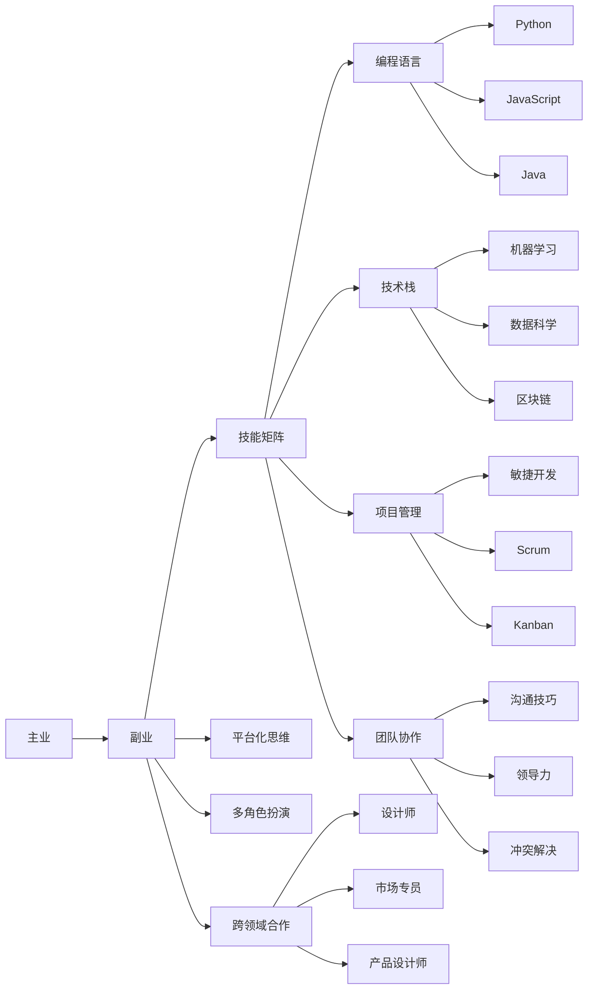

                 

## 1. 背景介绍

在快速发展的科技领域，程序员不仅需要专注于主业，更应该考虑构建多元化的副业生态，以提升自身竞争力，拓展职业路径，实现自我价值最大化。尤其是在疫情后时代，全球经济结构发生深刻变化，技术领域的竞争愈发激烈，副业发展成为了程序员应对职场变化、实现个人成长的重要途径。本文将从核心概念入手，深入探讨程序员如何构建多元化副业生态，助力个人职业发展。

## 2. 核心概念与联系

### 2.1 核心概念概述

为了更好地理解程序员如何构建多元化副业生态，首先明确几个核心概念：

- **副业**：指与主业不同，但能够提升个人技能、增加收入、实现自我价值的多元化职业活动。
- **技能矩阵**：程序员在主业之外掌握的技能组合，包括编程语言、技术栈、项目管理、团队协作等。
- **平台化思维**：将副业项目打造为平台，提升项目的可持续性和扩展性，吸引更多资源参与。
- **多角色扮演**：在不同的副业项目中担任不同的角色，如开发者、产品经理、顾问等，提升综合能力。
- **跨领域合作**：与其他领域的专业人士合作，共享资源和知识，推动副业生态的发展。

### 2.2 核心概念原理和架构的 Mermaid 流程图



此流程图展示了程序员副业生态的核心概念及其相互关系。主业是程序员职业发展的基础，副业则在此基础上扩展技能矩阵，通过平台化思维、多角色扮演和跨领域合作，形成多样化的副业生态，进一步促进个人职业成长和收入提升。

## 3. 核心算法原理 & 具体操作步骤

### 3.1 算法原理概述

构建多元化副业生态的算法原理，主要基于以下几个关键点：

- **技能缺口分析**：通过分析自身技能与市场需求之间的差距，找到适合的副业方向。
- **目标设定与拆解**：明确副业目标，并拆解为具体可执行的任务和步骤。
- **动态调整与反馈**：根据副业进展和市场反馈，动态调整策略，实现持续改进。
- **资源整合与优化**：整合自身资源，优化副业项目，提升其市场竞争力。

### 3.2 算法步骤详解

1. **技能缺口分析**
   - **自我评估**：评估自身技能水平，识别主业和副业中的技能差距。
   - **市场需求分析**：调研市场对副业项目的需求，确定高需求的技能领域。
   - **技能规划**：基于缺口分析，制定学习计划，逐步提升关键技能。

2. **目标设定与拆解**
   - **长期目标**：设定5年甚至更远的职业发展目标，如成为某领域的专家或开创自己的业务。
   - **短期目标**：分解为可执行的年度、月度甚至周目标，如完成某个项目、获得某个认证等。
   - **任务列表**：详细列出每个目标对应的具体任务，如学习一门新语言、参加一个线上课程等。

3. **动态调整与反馈**
   - **进展监控**：定期检查副业进展，调整学习计划和任务列表。
   - **市场反馈**：通过社交媒体、博客、社区等渠道，获取市场和用户的反馈，改进副业项目。
   - **灵活调整**：根据反馈和进展，灵活调整学习路径和项目方向，确保副业目标的实现。

4. **资源整合与优化**
   - **时间管理**：合理分配时间，确保副业与主业之间的平衡。
   - **资金规划**：根据副业项目的投入需求，制定资金使用计划。
   - **团队协作**：组建副业团队，分工合作，提升项目效率。
   - **工具优化**：选择合适的工具和平台，优化副业项目的技术实现和运营管理。

### 3.3 算法优缺点

**优点**：
- **技能提升**：副业项目可以提升多方面的技能，增强职场竞争力。
- **收入增加**：通过副业增加收入来源，提高生活质量。
- **职业成长**：多元化技能和经验丰富职业路径，为未来发展打下坚实基础。

**缺点**：
- **时间和精力成本**：副业需要投入大量的时间和精力，可能影响主业。
- **资源限制**：缺乏足够的资源（如资金、设备）可能会限制副业的发展。
- **市场风险**：副业项目存在市场变化、竞争加剧等风险。

### 3.4 算法应用领域

副业生态构建的应用领域广泛，包括但不限于以下方面：

- **技术咨询**：利用技术优势，提供咨询和解决方案。
- **教育培训**：开发线上或线下的技术培训课程，传授编程和项目开发技能。
- **产品开发**：开发自有产品或参与开源项目，提升技术实力和产品经验。
- **自由职业**：承接各类编程和设计任务，灵活工作，增加收入。
- **创业项目**：基于副业经验，创立自己的公司或团队，实现创业梦想。

## 4. 数学模型和公式 & 详细讲解 & 举例说明

### 4.1 数学模型构建

我们以副业项目的经济效益为例，构建一个数学模型：

设副业项目总收入为 $I$，成本为 $C$，净收益为 $P$，市场对副业项目的接受度为 $A$，自身技能提升的价值为 $S$，全职投入副业的机会成本为 $O$。

**目标函数**：最大化净收益 $P$，即 $P = I - C - O$。

**约束条件**：
- $I = A \times \text{销售额}$
- $C = A \times \text{成本率}$
- $S = A \times \text{技能提升价值}$
- $O = \text{全职投入时间} \times \text{主业收入}$

### 4.2 公式推导过程

假设 $A=0.5$（市场接受度为50%），销售额为 $R=100,000$，成本率为 $CR=0.2$（成本占销售额的20%），技能提升价值为 $SV=20,000$，全职投入时间为 $T=2,000$ 小时（每月40小时），主业收入为 $M=50,000$ 元/月。

推导过程如下：

1. **总收入**：$I = 0.5 \times 100,000 = 50,000$
2. **成本**：$C = 0.5 \times 100,000 \times 0.2 = 10,000$
3. **净收益**：$P = I - C - 2,000 \times 50,000 = 50,000 - 10,000 - 100,000 = -100,000$
4. **全职投入副业的机会成本**：$O = 2,000 \times 50,000 = 100,000$

因此，净收益为 $P = -100,000$，副业项目并不划算。但通过调整市场接受度、销售额、成本率、技能提升价值等因素，可以优化模型，提升副业项目的经济效益。

### 4.3 案例分析与讲解

**案例**：张三是一名Java程序员，副业项目为开源项目贡献代码，每月投入100小时，期望通过副业项目获得额外收入。

**分析**：
- **目标**：每月增加5,000元收入。
- **市场接受度**：50%（参与开源项目社区活跃度高）。
- **销售额**：每月2,000美元（开源项目提供商业化服务）。
- **成本率**：30%（开源项目初期运营成本高）。
- **技能提升价值**：每年5,000美元（通过参与复杂项目提升技术水平）。
- **全职投入时间**：200小时/月（副业与主业时间平衡）。
- **主业收入**：10,000美元/月。

**推导**：
1. **总收入**：$I = 0.5 \times 2,000 = 1,000$
2. **成本**：$C = 0.5 \times 2,000 \times 0.3 = 300$
3. **净收益**：$P = 1,000 - 300 - 200 \times 10,000 = -1,600$
4. **全职投入副业的机会成本**：$O = 200 \times 10,000 = 2,000,000$

尽管净收益为负，但副业项目能够提升技能，增加职业经验，为未来发展打下坚实基础。通过合理调整市场接受度和成本率，可以在未来实现盈利。

## 5. 项目实践：代码实例和详细解释说明

### 5.1 开发环境搭建

构建副业生态的开发环境需要考虑以下因素：

- **编程语言**：根据副业项目需求选择适合的编程语言，如Python、JavaScript、Java等。
- **开发工具**：安装IDE（如PyCharm、VSCode等）、版本控制系统（如Git）等工具。
- **操作系统**：选择稳定可靠的操作系统，如Linux、macOS或Windows。
- **网络环境**：确保良好的网络连接，便于远程协作和资源共享。

### 5.2 源代码详细实现

以开发一个简单的开源项目为例，展示构建副业生态的过程：

```python
# 设置项目路径
import os
os.makedirs('project', exist_ok=True)

# 初始化Git仓库
os.system('git init')
os.system('git remote add origin https://github.com/username/project.git')

# 编写代码
with open('project/README.md', 'w') as f:
    f.write('# My Open Source Project\n')

# 安装依赖
os.system('pip install requests')

# 编写测试
with open('project/test.py', 'w') as f:
    f.write('import requests\n')

# 提交代码到Git
os.system('git add .')
os.system('git commit -m "Initial commit"')
os.system('git push -u origin main')
```

### 5.3 代码解读与分析

**代码解析**：
- `os.makedirs('project', exist_ok=True)`：创建项目目录。
- `os.system('git init')`：初始化Git仓库。
- `os.system('git remote add origin')`：远程关联Git仓库。
- `with open('project/README.md', 'w') as f`：编写README文件。
- `os.system('pip install requests')`：安装第三方依赖。
- `with open('project/test.py', 'w') as f`：编写测试代码。
- `os.system('git add .')`：提交代码到Git。
- `os.system('git commit -m "Initial commit"')`：提交并添加提交信息。
- `os.system('git push -u origin main')`：推送代码到远程仓库。

**分析**：
- **项目管理**：使用Git进行版本控制，确保代码版本和变更的追踪。
- **依赖管理**：通过pip安装第三方库，提升项目效率。
- **文档编写**：编写README文件，便于项目介绍和协作。
- **测试框架**：编写测试代码，确保项目质量和稳定性。

### 5.4 运行结果展示

运行上述代码后，项目结构如图：

```
project/
    README.md
    test.py
    .git/
        config
        index
        info/
            ...
        ...
```

项目结构和代码已提交到Git仓库，未来可以通过协作工具（如GitHub、GitLab）进行团队管理和代码审查。

## 6. 实际应用场景

### 6.1 软件开发咨询

软件开发咨询是程序员最常见的副业方向之一，通过提供专业的技术建议和解决方案，帮助企业解决软件开发中的问题。

**场景**：张三是一名Java专家，副业为软件开发咨询公司提供技术支持。

**操作**：
1. **市场调研**：通过社交媒体、技术论坛了解市场需求。
2. **客户对接**：通过LinkedIn等平台联系潜在客户，提供咨询服务。
3. **项目交付**：根据客户需求，提供代码审查、技术优化、系统架构设计等服务。
4. **项目反馈**：通过客户反馈，不断改进咨询质量和项目管理能力。

### 6.2 教育培训

教育培训也是程序员常见的副业方向，通过教授编程知识和技能，帮助初学者和进阶者提升技术水平。

**场景**：李四是一名Python专家，副业为编程培训机构开设在线课程。

**操作**：
1. **课程设计**：根据市场需求设计课程内容，包括基础编程、高级技术、项目实战等。
2. **在线平台**：使用Udemy、Coursera等在线教育平台发布课程。
3. **课程推广**：通过社交媒体、技术博客、邮件列表推广课程。
4. **学员互动**：通过直播、社群等形式与学员互动，解答问题，提供反馈。

### 6.3 产品开发

产品开发是程序员可以探索的副业方向之一，通过开发自有产品或参与开源项目，提升技术实力和产品经验。

**场景**：王五是一名全栈开发者，副业为开发一款在线学习平台。

**操作**：
1. **市场需求分析**：通过市场调研，确定平台功能和用户需求。
2. **原型设计**：使用 wireframe 工具设计产品原型。
3. **技术实现**：选择合适的技术栈，实现产品功能。
4. **测试发布**：进行全面测试，发布产品到线上。
5. **市场推广**：通过SEO、社交媒体、付费广告推广产品。
6. **用户反馈**：收集用户反馈，不断优化产品功能。

### 6.4 自由职业

自由职业是指利用自身技能承接各类项目，灵活工作，增加收入。程序员可以接手各类编程和设计任务，提升技术水平和实战经验。

**场景**：赵六是一名前端开发者，副业为接手各类网站设计和开发项目。

**操作**：
1. **平台注册**：在Upwork、Freelancer等自由职业平台注册账号。
2. **项目选择**：筛选符合技能需求的项目。
3. **项目投标**：撰写详细项目方案，提交投标。
4. **项目合作**：与客户沟通项目细节，签订合同。
5. **项目交付**：高质量完成项目，并通过平台提交交付。
6. **客户评价**：获得客户好评，提升平台信誉和后续项目接单率。

## 7. 工具和资源推荐

### 7.1 学习资源推荐

1. **Coursera**：提供各类在线编程和商业课程，适合学习新技能和提升实战经验。
2. **Udemy**：丰富的编程和软件工程师课程，涵盖基础到高级技术。
3. **edX**：提供多所顶尖大学和机构开设的在线课程，系统学习编程和项目管理。
4. **Stack Overflow**：技术问答社区，学习问题解决和最佳实践。
5. **GitHub**：代码托管平台，学习和参与开源项目，提升协作和代码管理能力。

### 7.2 开发工具推荐

1. **Visual Studio Code (VSCode)**：强大的代码编辑器，支持多种编程语言。
2. **PyCharm**：专业的Python IDE，提供调试、测试、版本控制等功能。
3. **JIRA**：项目管理工具，帮助跟踪任务进度和协作。
4. **Slack**：团队沟通工具，提升协作效率。
5. **GitHub**：代码托管和版本控制，支持团队协作和开源项目。

### 7.3 相关论文推荐

1. **《软件开发者副业：技能组合与市场匹配》**：探讨软件开发者如何通过副业提升技能和市场匹配度。
2. **《编程教育市场分析与趋势预测》**：分析编程教育市场的现状和未来趋势，提供副业方向建议。
3. **《软件开发咨询实践指南》**：提供软件开发咨询项目管理的实用指南和案例分析。

## 8. 总结：未来发展趋势与挑战

### 8.1 研究成果总结

本文系统探讨了程序员如何构建多元化副业生态，重点从核心概念、算法原理、具体操作步骤、数学模型和公式推导、项目实践、实际应用场景、工具和资源推荐等方面进行深入分析。通过合理规划和执行，程序员可以在主业之外拓展更多职业路径，提升技能和收入，实现个人职业成长。

### 8.2 未来发展趋势

1. **多元化技能提升**：未来副业项目将更注重跨领域技能整合，提升综合素质和市场竞争力。
2. **数字化转型**：数字化转型加速，副业生态将更多地依赖在线协作和远程工作。
3. **AI与副业融合**：人工智能技术的应用将提升副业项目的智能化水平，如自动化测试、智能客服等。
4. **协同创新**：跨领域、跨组织的协同创新将成为副业项目的重要方向。

### 8.3 面临的挑战

1. **时间管理**：副业项目与主业之间的平衡，需要合理安排时间和精力。
2. **资源限制**：缺乏足够的资金、设备和技术支持，可能限制副业发展。
3. **市场竞争**：副业市场竞争激烈，需要不断提升项目质量和竞争力。
4. **法律和伦理**：副业项目可能涉及版权、隐私等问题，需要遵守相关法律和伦理规范。

### 8.4 研究展望

1. **副业生态模型构建**：开发副业生态的数学模型和工具，优化副业项目。
2. **副业平台化**：探索构建副业平台，提升项目的可持续性和扩展性。
3. **副业价值量化**：研究副业项目对个人和企业的经济和社会价值。
4. **副业心理研究**：研究副业对个人心理和职业发展的影响。

## 9. 附录：常见问题与解答

**Q1：如何选择适合的副业方向？**

A: 选择副业方向时，需要考虑自身兴趣、市场需求和技能匹配度。可以通过市场调研、咨询行业专家等方式，找到高需求、适合自身技能和兴趣的项目。

**Q2：如何平衡主业与副业之间的关系？**

A: 制定详细的时间管理和目标规划，合理分配时间，确保主业和副业之间的平衡。可以使用时间管理工具（如Trello、Asana）进行任务管理，提升效率。

**Q3：如何优化副业项目的管理和协作？**

A: 使用项目管理工具（如JIRA、Trello）进行任务跟踪和协作管理，确保项目进度和质量。通过定期会议和沟通工具（如Slack、Zoom）保持团队内部沟通和反馈。

**Q4：如何提升副业项目的市场竞争力？**

A: 通过不断学习和技术创新，提升项目质量和功能，满足市场需求。同时进行市场调研和数据分析，调整项目策略，提升项目竞争力。

**Q5：如何选择副业平台和工具？**

A: 选择适合自身技能和项目需求的平台和工具，如自由职业平台（Upwork、Freelancer）、编程社区（Stack Overflow、GitHub）、项目管理工具（JIRA、Trello）等。

---

作者：禅与计算机程序设计艺术 / Zen and the Art of Computer Programming

