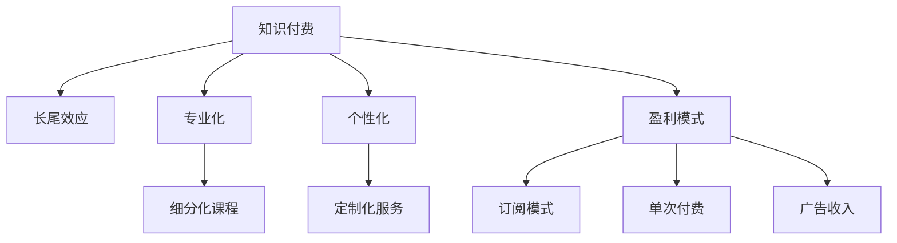

                 

# 程序员如何构建知识付费的长尾效应

> 关键词：知识付费,长尾效应,程序员,编程技术,人工智能,数据科学

## 1. 背景介绍

### 1.1 问题由来
随着互联网技术的发展和知识经济的兴起，知识付费逐渐成为了一种流行的模式。无论是在线课程、技术博客、编程书籍还是视频教程，知识内容正以前所未有的速度和规模流通，成为互联网产业的重要组成部分。对于程序员而言，如何构建知识付费的商业模式，最大化其长尾效应，是当前面临的一个重大挑战。

### 1.2 问题核心关键点
知识付费的长尾效应指的是，尽管大多数用户倾向于购买少数热门课程或内容，但仍有大量用户对专业性强、偏门性的内容具有需求。构建知识付费的长尾效应，旨在通过提供多样化的、细分市场的内容，满足不同层次用户的学习需求，实现可持续的商业盈利。

### 1.3 问题研究意义
深入研究如何构建知识付费的长尾效应，对于程序员而言，不仅有助于提升自身技能的精细化程度，还能够拓展职业发展的边界，实现个人品牌价值和收入的多样化。同时，也符合当前技术领域对个性化、专业化内容需求的增长趋势，有助于推动知识经济的持续健康发展。

## 2. 核心概念与联系

### 2.1 核心概念概述

为更好地理解如何构建知识付费的长尾效应，本节将介绍几个密切相关的核心概念：

- 知识付费：指用户为获取有价值、有深度的专业知识或技能，支付一定费用的商业模式。
- 长尾效应：描述在互联网模式下，提供大量个性化、专业化的商品或内容，虽然每种商品的销量很低，但总体销售额却可以非常高的现象。
- 专业化：指深度掌握某一领域的知识、技能和经验，提供更有深度和价值的知识产品。
- 个性化：根据用户的具体需求，提供量身定制的知识服务。
- 盈利模式：指知识付费平台或内容创作者，通过不同的渠道和策略，实现商业盈利的方式。

这些核心概念之间的逻辑关系可以通过以下Mermaid流程图来展示：



这个流程图展示出知识付费、长尾效应、专业化、个性化和盈利模式之间的内在联系：

1. 知识付费的核心在于提供高质量的内容，满足用户的专业化、个性化需求。
2. 长尾效应强调通过细分化、专业化的内容，尽管单个内容销量不高，但总体销售额可观。
3. 专业化指深度掌握某一领域，提供更有价值的知识。
4. 个性化指根据用户具体需求，提供定制化服务。
5. 盈利模式则描述了知识付费平台和创作者实现商业盈利的多样化渠道。

## 3. 核心算法原理 & 具体操作步骤

### 3.1 算法原理概述

构建知识付费的长尾效应，其核心在于通过个性化、专业化的内容设计，满足不同用户群体的特定需求。以下是核心的算法原理概述：

1. **用户画像分析**：通过用户数据收集与分析，构建详细的用户画像，了解用户的学习偏好、需求和消费习惯。
2. **内容划分与推荐**：根据用户画像，对课程或内容进行细分类别划分，并设计推荐算法，将最符合用户需求的内容推送给用户。
3. **动态定价策略**：根据市场供需、用户反馈等因素，动态调整课程或内容的定价，实现精准定价。
4. **多渠道营销**：结合社交媒体、搜索引擎优化、付费广告等多种营销手段，扩大内容的曝光度和覆盖面。

### 3.2 算法步骤详解

构建知识付费长尾效应的具体算法步骤如下：

**Step 1: 用户画像分析**
1. **数据收集**：通过调查问卷、行为数据分析等方式，收集用户基本信息、学习习惯、偏好等数据。
2. **特征提取**：将收集到的数据进行特征提取，如年龄、职业、学习时长、课程评分等。
3. **聚类分析**：使用聚类算法（如K-Means、层次聚类等）对用户进行分类，形成不同的用户群体。

**Step 2: 内容划分与推荐**
1. **内容分类**：将课程或内容根据难度、主题、形式等属性进行细分类别划分。
2. **推荐算法设计**：设计推荐算法，如协同过滤、内容推荐、基于内容的推荐等，将最适合用户的内容推荐给其。
3. **动态调整**：根据用户反馈，不断调整推荐算法，提升推荐精度。

**Step 3: 动态定价策略**
1. **市场调研**：调研市场中类似课程的定价和销量，了解用户愿意支付的价格区间。
2. **定价模型**：根据市场需求和课程价值，设计定价模型，如动态定价、套餐定价、优惠券等。
3. **反馈优化**：根据用户反馈和销量情况，动态调整定价策略，以实现最佳盈利。

**Step 4: 多渠道营销**
1. **渠道选择**：选择合适的营销渠道，如社交媒体、搜索引擎、电子邮件营销等。
2. **广告投放**：在选定的渠道上进行精准广告投放，提高内容曝光度。
3. **用户互动**：通过社交媒体、在线讨论区等方式，与用户互动，提高用户粘性。

### 3.3 算法优缺点

构建知识付费长尾效应的算法具有以下优点：
1. **满足用户多样化需求**：通过细分类别、个性化推荐，能够满足不同用户群体的特定需求，提高用户满意度。
2. **提高盈利能力**：通过精准定价和动态调整，最大化盈利能力，实现更好的商业效果。
3. **增强用户粘性**：通过多渠道营销和用户互动，提高用户粘性，实现长期收益。

同时，该算法也存在一些局限性：
1. **数据隐私问题**：用户数据收集和分析可能涉及隐私问题，需严格遵守数据保护法规。
2. **算法复杂度**：推荐算法和定价模型的设计需要较高的技术门槛，实现成本较高。
3. **市场变化快**：市场供需关系快速变化，需要实时调整策略，适应变化。
4. **用户依赖性**：过度依赖个性化推荐，可能导致用户对特定内容产生依赖，限制了探索性学习。

尽管存在这些局限性，但构建长尾效应仍是当前知识付费商业模式的重要手段。未来相关研究将侧重于优化推荐算法、提升定价精度、平衡个性化与多样化需求等方面。

### 3.4 算法应用领域

构建知识付费的长尾效应方法，在多个领域均有广泛应用：

- **编程技术**：针对不同层次的开发者，提供从基础到高级的编程课程、框架教程等，满足多样化学习需求。
- **人工智能**：提供深度学习、机器学习、自然语言处理等前沿领域的课程和论文解读，满足专业研究人员的深度需求。
- **数据科学**：提供数据分析、数据可视化、数据工程等技能培训，满足不同领域数据科学家的个性化学习需求。
- **网络安全**：提供网络攻防、渗透测试等实战课程，满足网络安全从业人员的专业需求。
- **云计算**：提供云架构、容器化、微服务等技术培训，满足云计算领域从业人员的深度学习需求。

除了上述这些经典领域外，知识付费的长尾效应还被创新性地应用于更多场景中，如远程教育、职业培训、个人品牌打造等，为知识经济的发展注入了新的动力。

## 4. 数学模型和公式 & 详细讲解 & 举例说明

### 4.1 数学模型构建

构建知识付费长尾效应的数学模型，涉及用户画像、内容推荐、定价策略等多个方面的数学建模。以下是几个关键数学模型的构建：

- **用户画像模型**：通过K-Means算法对用户进行聚类分析，生成用户画像。
- **推荐算法模型**：基于协同过滤和基于内容的推荐算法，设计推荐模型。
- **定价模型**：使用线性回归、随机森林等算法，预测课程销量，动态调整价格。

### 4.2 公式推导过程

以下对用户画像模型和推荐算法模型的公式推导过程进行详细讲解。

**用户画像模型**
假设用户数据为矩阵 $X \in \mathbb{R}^{n \times p}$，其中 $n$ 为用户数，$p$ 为特征数。使用K-Means算法对用户进行聚类，生成 $k$ 个用户群体的均值向量 $\mu_1, \mu_2, \ldots, \mu_k$，且每个用户属于某一类别。用户聚类公式如下：

$$
C_u = \arg\min_k \sum_{i=1}^n d^2(X_u, \mu_k)
$$

其中 $d$ 为欧几里得距离。

**推荐算法模型**
假设用户 $u$ 对课程 $i$ 的评分 $r_{ui}$ 为未知，推荐算法模型 $f_{ui}$ 为已知。通过协同过滤算法，预测用户 $u$ 对课程 $i$ 的评分：

$$
\hat{r}_{ui} = w_0 + \sum_{j=1}^m w_j (X_u \cdot X_j)
$$

其中 $w_0, w_j$ 为权重参数，$X_u$ 和 $X_j$ 分别为用户 $u$ 和课程 $j$ 的特征向量。

### 4.3 案例分析与讲解

假设某编程平台收集了用户行为数据，包含用户ID、编程语言、课程评分、学习时长等特征。通过K-Means算法对用户进行聚类分析，生成三个用户群体：基础学习者、进阶学习者和专家开发者。然后，使用协同过滤算法对每个用户群体推荐最适合的编程课程，提高用户满意度和平台盈利能力。

**Step 1: 用户聚类分析**
1. 数据预处理：对用户行为数据进行缺失值处理、归一化处理等。
2. 特征选择：选择对用户学习行为影响较大的特征，如编程语言、课程评分等。
3. K-Means算法：使用K-Means算法对用户进行聚类，生成三个用户群体。

**Step 2: 协同过滤推荐**
1. 特征提取：将用户和课程的特征向量 $X_u, X_i$ 进行提取。
2. 相似度计算：计算用户与课程的相似度矩阵 $S$。
3. 推荐算法：根据相似度矩阵 $S$，推荐最适合用户 $u$ 的课程 $i$。

## 5. 项目实践：代码实例和详细解释说明

### 5.1 开发环境搭建

在进行知识付费长尾效应项目实践前，我们需要准备好开发环境。以下是使用Python进行项目开发的Python环境配置流程：

1. 安装Anaconda：从官网下载并安装Anaconda，用于创建独立的Python环境。

2. 创建并激活虚拟环境：
```bash
conda create -n knowledge-payment-env python=3.8 
conda activate knowledge-payment-env
```

3. 安装PyTorch、TensorFlow等必要的深度学习库：
```bash
conda install pytorch torchvision torchaudio cudatoolkit=11.1 -c pytorch -c conda-forge
conda install tensorflow
```

4. 安装Flask、SQLAlchemy等必要的Web框架和数据库库：
```bash
pip install flask sqlalchemy flask-sqlalchemy
```

5. 安装第三方推荐库：
```bash
pip install scikit-learn scikit-learn-contrib
```

完成上述步骤后，即可在`knowledge-payment-env`环境中开始项目实践。

### 5.2 源代码详细实现

这里我们以编程课程推荐系统为例，给出使用Flask框架和Python实现的推荐系统代码实现。

首先，定义用户和课程的数据模型：

```python
from flask_sqlalchemy import SQLAlchemy
from sklearn.feature_extraction.text import TfidfVectorizer

db = SQLAlchemy()

class User(db.Model):
    id = db.Column(db.Integer, primary_key=True)
    name = db.Column(db.String(80), nullable=False)
    language = db.Column(db.String(20), nullable=False)
    courses = db.relationship('Course', backref='users', lazy=True)

class Course(db.Model):
    id = db.Column(db.Integer, primary_key=True)
    name = db.Column(db.String(80), nullable=False)
    content = db.Column(db.Text, nullable=False)
    tags = db.Column(db.PickleType, nullable=False)
    user_id = db.Column(db.Integer, db.ForeignKey('user.id'), nullable=False)
    reviews = db.relationship('Review', backref='course', lazy=True)

class Review(db.Model):
    id = db.Column(db.Integer, primary_key=True)
    rating = db.Column(db.Integer, nullable=False)
    comment = db.Column(db.Text, nullable=False)
    course_id = db.Column(db.Integer, db.ForeignKey('course.id'), nullable=False)
```

然后，定义推荐算法：

```python
from sklearn.metrics.pairwise import cosine_similarity
from sklearn.decomposition import TruncatedSVD

class Recommendation:
    def __init__(self, data, k=10):
        self.data = data
        self.k = k

    def similarity_matrix(self):
        tfidf = TfidfVectorizer()
        tfidf_matrix = tfidf.fit_transform([doc['content'] for doc in self.data])
        similarity_matrix = cosine_similarity(tfidf_matrix)
        return similarity_matrix

    def recommend(self, user, courses):
        similarity_matrix = self.similarity_matrix()
        user_vector = similarity_matrix[user]
        recommendations = sorted((idx, similarity_matrix[idx]) for idx in similarity_matrix if idx != user)[:self.k]
        return [doc for doc, _ in recommendations]
```

接着，定义Web界面和推荐服务：

```python
from flask import Flask, render_template, request

app = Flask(__name__)

@app.route('/')
def index():
    users = User.query.all()
    courses = Course.query.all()
    return render_template('index.html', users=users, courses=courses)

@app.route('/recommend', methods=['POST'])
def recommend():
    user_id = request.form.get('user_id')
    courses = request.form.getlist('courses')
    user = User.query.get(user_id)
    recommendations = Recommendation(user.courses, 10).recommend(user_id, courses)
    return render_template('recommend.html', user=user, recommendations=recommendations)
```

最后，启动Flask服务并运行：

```bash
flask run
```

这样，一个简单的编程课程推荐系统就构建完成了。用户可以通过Web界面查询自己的课程，并获得推荐列表。

### 5.3 代码解读与分析

让我们再详细解读一下关键代码的实现细节：

**User和Course模型定义**：
- `User`模型：包含用户的基本信息，如ID、姓名、学习语言等，以及用户学习的课程。
- `Course`模型：包含课程的基本信息，如ID、课程名、课程内容、标签等，以及用户对课程的评价。

**Recommendation类实现**：
- `similarity_matrix`方法：使用TF-IDF和余弦相似度计算课程之间的相似度矩阵。
- `recommend`方法：根据用户已学习的课程，推荐与这些课程相似的其他课程。

**Flask服务实现**：
- `index`路由：展示所有用户和课程。
- `recommend`路由：接收用户ID和已学习的课程ID，返回推荐列表。

通过这些代码，我们能够构建一个简单的知识付费平台，通过推荐算法为用户推荐感兴趣的课程，提升用户满意度和平台盈利能力。

## 6. 实际应用场景

### 6.1 智能教育平台

知识付费的长尾效应在智能教育平台中的应用，能够为不同层次、不同需求的学员提供个性化的学习资源。通过分析学员的学习行为和反馈，智能推荐适合的课程和内容，帮助学员实现高效学习。

例如，某编程平台可以针对初级学员提供基础编程课程，针对高级学员提供深度学习框架的课程，为专业研究人员提供最新科研论文的解读。通过长尾效应，平台能够覆盖更广泛的受众，提供更加精准的学习支持。

### 6.2 企业培训系统

企业培训系统需要根据员工的技能水平和学习需求，提供量身定制的课程内容。通过知识付费的长尾效应，企业可以提供多样化的培训资源，满足不同层次员工的学习需求，提高培训效果。

例如，某企业可以针对新员工提供入门级的编程基础课程，针对中层管理人员提供项目管理和数据分析的高级课程，针对技术骨干提供云计算和人工智能的前沿课程。通过细分类别、个性化推荐，企业能够实现高效、精准的员工培训，提升整体技术水平。

### 6.3 在线课程平台

在线课程平台需要根据用户的学习习惯和偏好，推荐最符合其需求的课程内容。通过长尾效应，平台能够覆盖更多小众、专业化的课程，满足用户的多样化需求。

例如，某编程平台可以提供Python编程基础、机器学习算法、自然语言处理等多个领域的课程，同时推出面向特定行业（如金融、医疗）的高级课程。通过推荐算法和定价策略，平台能够实现精准定价和推广，提升用户粘性和平台盈利能力。

### 6.4 未来应用展望

随着知识付费市场的不断发展和壮大，长尾效应的应用将更加广泛，成为推动知识经济发展的关键手段。未来，知识付费的长尾效应将在更多领域得到应用，如在线医疗咨询、远程金融培训、个人兴趣学习等，为各行各业注入新的活力和动力。

## 7. 工具和资源推荐

### 7.1 学习资源推荐

为了帮助开发者系统掌握知识付费的长尾效应，这里推荐一些优质的学习资源：

1. Coursera《个性化推荐系统》课程：由斯坦福大学教授讲授，系统介绍推荐系统的原理和算法，包括协同过滤、基于内容的推荐等。

2. Kaggle推荐系统竞赛：参与Kaggle的推荐系统竞赛，实际动手解决推荐系统问题，积累实战经验。

3. 《推荐系统》书籍：杨强、李锐合著，详细介绍推荐系统的理论和实践，涵盖协同过滤、模型优化、数据预处理等方面。

4. PyTorch官方文档：PyTorch深度学习框架的官方文档，提供丰富的推荐系统实现和案例。

5. Scikit-learn官方文档：Scikit-learn机器学习库的官方文档，提供多种推荐算法实现和案例。

通过对这些资源的学习实践，相信你一定能够快速掌握知识付费长尾效应的精髓，并用于解决实际的推荐系统问题。

### 7.2 开发工具推荐

高效的开发离不开优秀的工具支持。以下是几款用于知识付费长尾效应开发的常用工具：

1. Python：免费开源的高级编程语言，拥有丰富的第三方库和框架，非常适合推荐系统开发。

2. Flask：轻量级的Web框架，简单易用，适合快速构建推荐系统Web界面。

3. SQLAlchemy：Python的ORM框架，支持多种数据库，方便数据管理和查询。

4. Scikit-learn：Python的机器学习库，提供多种推荐算法实现。

5. Kaggle：数据科学竞赛平台，提供丰富的数据集和开源项目，适合推荐系统算法研究和实践。

6. TensorBoard：TensorFlow配套的可视化工具，可实时监测模型训练状态，帮助优化推荐算法。

7. Weights & Biases：模型训练的实验跟踪工具，可以记录和可视化模型训练过程中的各项指标，方便对比和调优。

合理利用这些工具，可以显著提升知识付费长尾效应的开发效率，加快创新迭代的步伐。

### 7.3 相关论文推荐

知识付费长尾效应的研究源于学界的持续研究。以下是几篇奠基性的相关论文，推荐阅读：

1. Hedonic Regression for Recommendations: A Deep Dive: 探讨推荐系统中的用户满意度预测问题，提出基于回归模型的推荐算法。

2. Context-Aware Recommendations: 介绍上下文感知推荐系统的原理和实现，强调上下文信息在推荐中的重要性。

3. Recommender Systems: The Textbook: 系统介绍推荐系统的理论和实践，涵盖协同过滤、基于内容的推荐、混合推荐等。

4. Deep Collaborative Filtering: 提出深度协同过滤模型，解决推荐系统中的数据稀疏性问题，提升推荐效果。

5. Multi-Armed Bandits in Recommendation Systems: 探讨推荐系统中的多臂投币问题，提出基于强化学习的推荐算法。

这些论文代表了大规模推荐系统的发展脉络。通过学习这些前沿成果，可以帮助研究者把握学科前进方向，激发更多的创新灵感。

## 8. 总结：未来发展趋势与挑战

### 8.1 总结

本文对知识付费长尾效应的构建进行了全面系统的介绍。首先阐述了知识付费长尾效应的研究背景和意义，明确了长尾效应在满足用户多样化需求、提高商业盈利能力等方面的重要作用。其次，从原理到实践，详细讲解了长尾效应的算法原理和关键步骤，给出了长尾效应任务开发的完整代码实例。同时，本文还广泛探讨了长尾效应在智能教育、企业培训、在线课程等多个领域的应用前景，展示了长尾效应的巨大潜力。此外，本文精选了长尾效应的各类学习资源，力求为读者提供全方位的技术指引。

通过本文的系统梳理，可以看到，知识付费长尾效应的构建在满足用户多样化需求、提升商业盈利能力方面具有重大意义。未来，伴随推荐算法的不断发展，长尾效应将有更广泛的应用，推动知识经济的持续健康发展。

### 8.2 未来发展趋势

展望未来，知识付费长尾效应的研究将呈现以下几个发展趋势：

1. 推荐算法不断优化。随着推荐系统研究的深入，推荐算法将更加精准和高效，提升用户体验和平台盈利能力。
2. 多模态推荐系统兴起。未来推荐系统将融合视觉、音频、文本等多模态信息，提供更加全面、个性化的推荐服务。
3. 实时推荐系统普及。实时推荐系统能够动态更新用户画像和推荐内容，适应用户实时需求，提供即时响应。
4. 个性化推荐算法多样。未来推荐系统将结合深度学习、强化学习、知识图谱等多种技术，实现更加多样化的个性化推荐。
5. 用户隐私保护加强。在推荐系统设计中，将更加重视用户隐私保护，引入差分隐私、联邦学习等技术，保障用户数据安全。

以上趋势凸显了知识付费长尾效应的广阔前景。这些方向的探索发展，必将进一步提升推荐系统的性能和应用范围，为知识经济的持续健康发展注入新的动力。

### 8.3 面临的挑战

尽管知识付费长尾效应的研究已经取得了瞩目成就，但在实现高效、精准推荐的过程中，仍面临诸多挑战：

1. 数据隐私问题。用户数据收集和分析可能涉及隐私问题，需严格遵守数据保护法规。
2. 算法复杂度高。推荐算法的优化和调参需要较高的技术门槛，实现成本较高。
3. 市场变化快。市场供需关系快速变化，需要实时调整策略，适应变化。
4. 用户依赖性强。过度依赖推荐算法，可能导致用户对特定内容产生依赖，限制了探索性学习。

尽管存在这些挑战，但未来相关研究将在优化推荐算法、提升隐私保护、增强用户粘性等方面寻求新的突破。

### 8.4 研究展望

面向未来，知识付费长尾效应的研究需要在以下几个方面寻求新的突破：

1. 探索无监督和半监督推荐方法。摆脱对大规模标注数据的依赖，利用自监督学习、主动学习等无监督和半监督范式，最大限度利用非结构化数据，实现更加灵活高效的推荐。
2. 研究参数高效和计算高效的推荐范式。开发更加参数高效的推荐方法，在固定大部分预训练参数的同时，只更新极少量的任务相关参数。同时优化推荐模型的计算图，减少前向传播和反向传播的资源消耗，实现更加轻量级、实时性的部署。
3. 引入更多先验知识。将符号化的先验知识，如知识图谱、逻辑规则等，与神经网络模型进行巧妙融合，引导推荐过程学习更准确、合理的知识表示。同时加强不同模态数据的整合，实现视觉、音频等多模态信息与文本信息的协同建模。
4. 结合因果分析和博弈论工具。将因果分析方法引入推荐系统，识别出推荐决策的关键特征，增强推荐输出的因果性和逻辑性。借助博弈论工具刻画人机交互过程，主动探索并规避推荐系统的脆弱点，提高系统稳定性。

这些研究方向的探索，必将引领知识付费长尾效应的研究迈向更高的台阶，为构建安全、可靠、可解释、可控的推荐系统铺平道路。面向未来，知识付费长尾效应还需要与其他人工智能技术进行更深入的融合，如知识表示、因果推理、强化学习等，多路径协同发力，共同推动知识付费技术的进步。只有勇于创新、敢于突破，才能不断拓展推荐系统的边界，让知识付费技术更好地造福用户和社会。

## 9. 附录：常见问题与解答

**Q1：知识付费长尾效应是否适用于所有用户？**

A: 知识付费长尾效应能够满足大多数用户的学习需求，特别是对专业性强、偏门性内容的需求。但对于部分用户而言，可能更倾向于免费的公开资源，或者对平台推荐的课程不感兴趣。因此，平台需要同时提供多种获取知识的渠道，满足不同用户的需求。

**Q2：如何平衡个性化和多样化推荐？**

A: 个性化推荐能够提升用户满意度，但过度个性化可能导致用户对特定内容产生依赖，限制了探索性学习。因此，平台需要在个性化推荐的基础上，引入多样化推荐的机制，确保用户能够接触到不同领域、不同层次的知识内容。

**Q3：如何提高推荐算法的实时性？**

A: 实时推荐系统能够动态更新用户画像和推荐内容，适应用户实时需求。通过引入流式数据处理技术、实时计算框架（如Apache Storm、Apache Flink），可以实现推荐算法的实时处理。

**Q4：如何保护用户隐私？**

A: 在数据收集和分析过程中，应严格遵守数据保护法规，如GDPR、CCPA等。采用数据匿名化、差分隐私、联邦学习等技术，保护用户隐私。

**Q5：如何评估推荐系统的性能？**

A: 推荐系统的性能评估可以从多个角度进行，如准确率、召回率、用户满意度等。采用A/B测试、用户调查等方式，综合评估推荐系统的效果。

总之，构建知识付费长尾效应需要全面考虑用户需求、推荐算法、数据隐私等多个方面，实现多维度、多层次的优化。只有全面提升推荐系统的性能和用户体验，才能最大化其商业价值和社会效益。

