                 

# 程序员如何评估并购offer

> 关键词：并购、offer、评估、薪水、股票、奖金、福利、文化、团队、发展前景

## 1. 背景介绍

### 1.1 问题由来
在IT行业中，并购收购一直是人才流动的重要途径。特别是在快速增长的科技公司，并购常常被视为获取顶尖技术团队和优秀人才的捷径。然而，许多程序员在面对收购offer时，往往难以做出最优的决策。并购涉及的因素众多，既有薪资福利，又有职业发展，如何全面综合评估，从而做出最适合自己的选择，成为了摆在许多程序员面前的难题。

### 1.2 问题核心关键点
在评估并购offer时，程序员需要考虑的维度包括但不限于以下几个方面：
- **薪水**：基本薪资、绩效奖金、股权激励等。
- **福利**：保险、退休计划、假期、健康计划等。
- **团队**：团队规模、技术栈、团队氛围、领导层素质等。
- **文化**：公司文化、管理方式、员工满意度等。
- **发展前景**：职业发展机会、项目挑战性、行业影响力等。
- **地点**：办公地点、城市生活成本、通勤时间等。
- **技术栈**：是否与个人技能和兴趣相匹配。
- **长期价值**：股票期权、期权行权价格、公司增长潜力等。

本文将系统介绍如何从这些维度全面评估并购offer，并给出实用的建议和分析工具。

## 2. 核心概念与联系

### 2.1 核心概念概述

在评估并购offer时，理解以下核心概念至关重要：

- **并购**：一家公司通过收购另一家公司以实现合并，形成新的公司实体，通常涉及股权、资产的交换或收购。
- **offer**：收购公司向被收购公司提供的条件，包括薪资、福利、期权等。
- **评估**：对并购offer中的各项条件进行综合比较，确定最佳选择。
- **期权**：一种特殊的合同，赋予持有者在未来以预定价格购买或出售资产的权利。
- **股票**：公司的所有权凭证，代表了持有者对公司的所有权。
- **奖金**：根据绩效评估发放的额外报酬。
- **福利**：除了基本薪资外，公司提供的各种额外福利，如健康保险、退休金等。
- **团队**：公司内部的工作团队，包括同事、领导、公司整体氛围。
- **文化**：公司独有的价值观、工作方式和行为准则，影响员工满意度和工作效率。
- **发展前景**：公司未来可能的增长、技术创新、市场份额等。
- **地点**：工作地点对生活质量的影响，如住房成本、通勤时间、生活便利性等。

这些核心概念之间通过并购offer这个中介相联系，共同构成了评估的基础。

### 2.2 核心概念原理和架构的 Mermaid 流程图

```mermaid
graph TB
    A[并购offer] --> B[薪水]
    A --> C[福利]
    A --> D[团队]
    A --> E[文化]
    A --> F[发展前景]
    A --> G[地点]
    A --> H[技术栈]
    A --> I[期权]
    A --> J[股票]
    A --> K[奖金]
    B --> L[基本薪资]
    B --> M[绩效奖金]
    B --> N[股权激励]
    C --> O[健康保险]
    C --> P[退休计划]
    C --> Q[假期]
    C --> R[员工满意度]
    D --> S[团队规模]
    D --> T[技术栈]
    D --> U[团队氛围]
    D --> V[领导层]
    E --> W[公司文化]
    E --> X[管理方式]
    E --> Y[员工满意度]
    F --> Z[增长潜力]
    F --> AA[技术创新]
    F --> AB[市场份额]
    G --> AC[住房成本]
    G --> AD[通勤时间]
    G --> AE[生活便利性]
    H --> AF[技术匹配]
    I --> AG[期权数量]
    I --> AH[行权价格]
    I --> AI[期权期限]
    J --> AJ[股票数量]
    J --> AK[股票价格]
    K --> AL[奖金机制]
    K --> AM[绩效标准]
    K --> AN[发放频率]
```



通过这个流程图，我们可以清晰地看到，并购offer中的各个要素是如何相互关联的。了解每个要素的属性和影响，才能进行全面的评估。

## 3. 核心算法原理 & 具体操作步骤
### 3.1 算法原理概述

评估并购offer的基本算法原理是通过将各个维度进行加权比较，综合得出一个总评分，从而量化每个offer的优劣。核心步骤如下：

1. **要素选择**：根据个人需求和职业规划，确定评估维度。
2. **权重设定**：根据每个维度的相对重要程度，设定权重。
3. **评分量化**：对每个维度的offer条件进行评分，通常为0-10分。
4. **综合评分**：将各个维度的评分乘以对应的权重，相加得到综合评分。
5. **决策分析**：对比不同offer的综合评分，选择最符合自身需求的。

### 3.2 算法步骤详解

1. **要素选择**：根据自身职业规划，如希望提升技能、追求高薪酬、寻求工作稳定性等，选择相应的评估维度。

2. **权重设定**：对各个维度进行重要性的评估，如薪资权重设为70%，职业发展权重设为20%，其他如福利、文化、团队等设为剩余的10%。权重设置应基于个人需求和行业现状。

3. **评分量化**：为每个维度的offer条件进行评分。例如，基本薪资1000万设置为9分，5000万设置为5分。

4. **综合评分计算**：使用加权平均法计算综合评分。假设薪资权重为0.7，职业发展权重为0.2，福利权重为0.1，则综合评分计算公式为：

$$
综合评分 = 0.7 \times 薪资评分 + 0.2 \times 职业发展评分 + 0.1 \times 福利评分
$$

5. **决策分析**：对比不同offer的综合评分，选择得分最高的offer。若评分相同，则深入分析各维度的细节，找到最适合自己的条件。

### 3.3 算法优缺点

**优点**：
- **系统性**：量化评估维度，避免主观偏见。
- **可比性**：通过评分和权重，将不同offer进行比较，找到最优选择。
- **灵活性**：可根据个人需求动态调整权重和评分标准。

**缺点**：
- **主观性强**：权重和评分仍需主观判断，存在误差。
- **信息不全**：可能遗漏重要的细节或隐性条件。
- **权衡困难**：不同维度之间可能存在冲突，难以平衡。

### 3.4 算法应用领域

评估并购offer的方法广泛适用于各类IT公司、初创企业、成长型企业等，特别是在高薪酬、高速增长、技术创新型企业中应用尤为普遍。适用于个人开发者、技术骨干、项目经理等各类技术岗位。

## 4. 数学模型和公式 & 详细讲解 & 举例说明

### 4.1 数学模型构建

设并购offer包含N个维度，每个维度的权重为 $w_i$，对应评分为 $s_i$，综合评分为 $S$。则综合评分计算公式为：

$$
S = \sum_{i=1}^{N} w_i \times s_i
$$

### 4.2 公式推导过程

设权重 $w_i$ 和评分 $s_i$ 均为0-1之间的小数，则综合评分 $S$ 的范围为0-1。根据线性组合的性质，$S$ 可看作权重和评分的加权平均，即：

$$
S = \sum_{i=1}^{N} w_i \times s_i
$$

### 4.3 案例分析与讲解

假设有两个并购offer，分别为A和B，评估维度包括薪资、职业发展、福利。权重和评分如下：

| 维度    | 权重   | 评分 |
| -------- | ------ | ---- |
| A薪资   | 0.7    | 9    |
| A职业发展 | 0.2    | 8    |
| A福利   | 0.1    | 7    |
| B薪资   | 0.7    | 8    |
| B职业发展 | 0.2    | 9    |
| B福利   | 0.1    | 6    |

根据公式计算：

- A综合评分：$0.7 \times 9 + 0.2 \times 8 + 0.1 \times 7 = 7.9$
- B综合评分：$0.7 \times 8 + 0.2 \times 9 + 0.1 \times 6 = 7.6$

因此，A的综合评分高于B，优先考虑A offer。

## 5. 项目实践：代码实例和详细解释说明
### 5.1 开发环境搭建

1. 安装Python环境：选择Python 3.x版本，并确保pip工具已安装。
2. 安装NumPy和Pandas库：`pip install numpy pandas`。
3. 编写评分计算脚本：`python offer_evaluation.py`。

### 5.2 源代码详细实现

```python
import numpy as np
import pandas as pd

# 定义评分表
offer_A = {
    '薪资': 9,
    '职业发展': 8,
    '福利': 7
}
offer_B = {
    '薪资': 8,
    '职业发展': 9,
    '福利': 6
}

# 定义权重表
weights = {
    '薪资': 0.7,
    '职业发展': 0.2,
    '福利': 0.1
}

# 计算综合评分
def calculate_total_score(offer, weights):
    scores = np.array([offer[key] * weights[key] for key in offer.keys()])
    return sum(scores)

# 测试计算
total_A = calculate_total_score(offer_A, weights)
total_B = calculate_total_score(offer_B, weights)

print('A total score:', total_A)
print('B total score:', total_B)
```

### 5.3 代码解读与分析

代码主要实现以下功能：
1. 定义两个offer的评分表和权重表。
2. 定义一个计算综合评分的函数。
3. 使用函数计算两个offer的综合评分。

运行结果显示：
- A的综合评分为7.9。
- B的综合评分为7.6。

根据计算结果，A offer的综合评分高于B，应优先考虑。

## 6. 实际应用场景

### 6.1 企业并购

企业在并购过程中，可以通过这种评分模型评估各个被并购公司的优劣，从而选择最有价值的目标公司。对于被收购公司的员工，同样可以通过评估并购offer，选择最适合自己的团队和岗位。

### 6.2 职业转型

程序员在考虑职业转型时，也可以通过这种评分模型评估不同公司的offer，选择最符合自己职业规划的公司。例如，在考虑从A公司跳至B公司时，可以评估两家公司的薪资福利、职业发展、团队氛围等。

### 6.3 创业投资

创业投资机构在评估潜在投资对象时，也可以使用这种评分模型，量化各个维度的优劣，做出更科学的投资决策。创业公司也可以根据这种评分模型，向投资机构展示自身优势，吸引更多投资。

### 6.4 未来应用展望

随着技术的不断进步，未来评分模型可能引入更多维度，如地理位置、文化多样性、健康福利等，提供更全面的评估依据。同时，人工智能和大数据技术可以应用于评分模型的自动化评估，进一步提高评估效率和准确性。

## 7. 工具和资源推荐
### 7.1 学习资源推荐

1. **《并购理论与实务》**：深入讲解企业并购的各个环节，适合理解并购原理和流程。
2. **《Python数据分析与数据可视化》**：学习如何使用Python进行数据处理和可视化，提升评估效率。
3. **《机器学习与数据挖掘》**：了解机器学习算法和数据挖掘技术，提升评估模型的科学性。
4. **Coursera《金融市场分析》课程**：学习金融市场分析的基本方法，提升评估并购的财务分析能力。
5. **Kaggle数据竞赛**：参与数据竞赛，提升数据处理和模型评估的能力。

### 7.2 开发工具推荐

1. **Jupyter Notebook**：提供交互式编程环境，适合进行代码测试和数据分析。
2. **Excel**：简单易用的数据处理工具，适合快速生成评分表和计算。
3. **Tableau**：数据可视化工具，适合展示和分析评分结果。
4. **Google Colab**：免费在线Jupyter环境，方便远程测试和协作。

### 7.3 相关论文推荐

1. **《企业并购对公司业绩的影响研究》**：深入分析并购对公司业绩的影响，适合理解并购的财务和业务影响。
2. **《金融市场分析》**：介绍金融市场分析的基本方法，适合提升评估并购的财务分析能力。
3. **《机器学习在金融领域的应用》**：介绍机器学习在金融领域的应用，适合提升评估并购的预测能力。

## 8. 总结：未来发展趋势与挑战

### 8.1 总结

本文介绍了程序员如何通过评分模型评估并购offer，帮助其做出最优的职业选择。评分模型通过量化各个维度的权重和评分，综合计算出每个offer的综合评分，从而提供系统的评估依据。通过实例演示和理论分析，本文系统展示了评分模型的原理和操作步骤。

### 8.2 未来发展趋势

1. **多维度扩展**：未来的评分模型将涵盖更多维度，如地理位置、文化多样性、健康福利等，提供更全面的评估依据。
2. **自动化评估**：引入人工智能和大数据技术，自动化评估各个维度的优劣，提升评估效率和准确性。
3. **个性化推荐**：通过深度学习算法，根据个人偏好和历史数据，推荐最符合的offer。
4. **实时动态更新**：根据公司最新发布的offer和市场变化，实时更新评分模型，确保评估的实时性和准确性。

### 8.3 面临的挑战

1. **主观性强**：权重和评分仍需主观判断，存在误差。
2. **信息不全**：可能遗漏重要的细节或隐性条件。
3. **权衡困难**：不同维度之间可能存在冲突，难以平衡。
4. **数据隐私**：评估过程中可能涉及个人隐私数据，需注意保护。

### 8.4 研究展望

未来的研究可以从以下几个方向进行：
1. **模型优化**：引入更复杂的数学模型和算法，提升评分模型的精度和鲁棒性。
2. **跨领域应用**：将评分模型应用于更多领域，如教育、医疗、政府等，提升决策的科学性和公平性。
3. **实时动态评估**：开发实时动态评估系统，根据市场变化和公司最新情况，实时更新评分结果。
4. **跨文化适应**：研究跨文化适应性，确保评分模型在不同国家和地区的适用性。

## 9. 附录：常见问题与解答

**Q1: 如何设定权重？**

A: 权重设定应基于个人需求和行业现状。例如，如果薪资是首要需求，可以设定为70%。根据不同行业和职位的特点，灵活调整权重。

**Q2: 评分如何量化？**

A: 评分应基于具体的评估标准，如1-10分。对于客观条件，如薪资、福利等，可以直接量化。对于主观条件，如文化、团队氛围等，可以参考内部评价和第三方评测结果进行评分。

**Q3: 如何处理维度冲突？**

A: 当不同维度之间存在冲突时，可以通过综合评分的方式进行权衡。例如，如果A offer的薪资和职业发展都很高，但文化氛围较差，可以设定文化氛围的权重较小，综合评分仍较高。

**Q4: 如何评估隐性条件？**

A: 隐性条件如公司内部文化、领导层素质等，可以借助内部员工反馈、第三方评测结果等进行评估。同时，在实际工作中注意观察和体验，及时调整评估结果。

通过这些分析和工具，程序员可以更加系统和科学地评估并购offer，做出最优的职业选择。无论是在企业并购、职业转型、创业投资等场景下，这种评分模型都能提供有力的决策支持。

