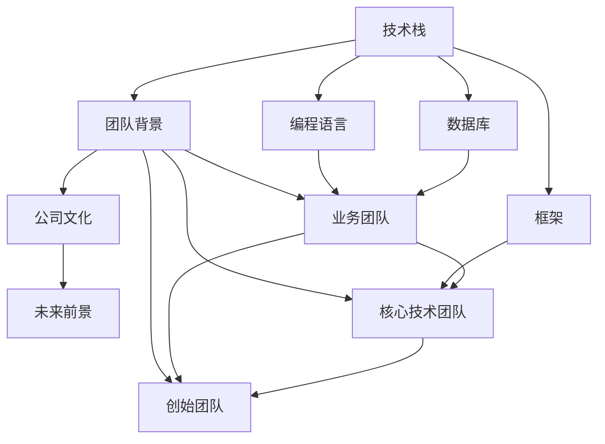

                 

## 1. 背景介绍

在当今科技飞速发展的时代，加入早期创业公司已经成为了许多有志于改变世界的程序员们的热门选择。这些公司往往拥有充满激情和创新精神的团队，并且有着远大的愿景和潜在的市场机会。然而，面对创业公司的offer，许多程序员也会感到困惑和不确定，不知道该如何评估这份offer是否值得接受。本文旨在为程序员提供一套完整的评估方法，帮助他们在选择创业公司时做出明智的决定。

## 2. 核心概念与联系

### 2.1 核心概念概述

评估早期创业公司offer的核心概念包括公司的技术栈、团队背景、公司文化、未来前景等。

- **技术栈**：了解公司的技术栈，包括使用的编程语言、框架、数据库等，可以帮助程序员判断是否符合自己的技术兴趣和职业发展规划。

- **团队背景**：考察公司的团队成员，包括创始团队、核心技术团队、业务团队等，可以帮助程序员评估公司的专业性和技术实力。

- **公司文化**：评估公司的文化氛围和工作环境，包括公司价值观、管理方式、工作方式等，可以帮助程序员判断是否与自己的职业期望和工作方式相匹配。

- **未来前景**：评估公司的市场前景、融资情况、产品路线图等，可以帮助程序员预测公司的成长潜力和发展方向。

这些核心概念之间相互关联，共同构成了评估早期创业公司offer的基础。

### 2.2 核心概念原理和架构的 Mermaid 流程图

## 3. 核心算法原理 & 具体操作步骤

### 3.1 算法原理概述

评估早期创业公司offer的过程可以看作是一个多目标优化问题。需要综合考虑多个因素，并根据个人兴趣、职业规划、生活需求等综合权衡，选出最适合自己的公司。

### 3.2 算法步骤详解

1. **收集信息**：通过公司官网、招聘信息、社交媒体、员工访谈等方式收集公司的信息，包括技术栈、团队背景、公司文化、未来前景等。
2. **评估技术栈**：判断公司的技术栈是否符合自己的技术兴趣和职业发展规划。可以通过查看公司的招聘要求、技术博客、GitHub项目等了解公司的技术栈。
3. **评估团队背景**：考察公司的团队成员，了解其技术实力、工作经验和创新能力。可以通过查看LinkedIn资料、Github贡献、专利等了解团队背景。
4. **评估公司文化**：通过参加面试、与员工交流、公司官网、技术博客等方式了解公司的文化氛围和工作方式。可以通过公司官网、技术博客、员工评论等方式了解公司文化。
5. **评估未来前景**：了解公司的市场前景、融资情况、产品路线图等，判断公司的成长潜力和发展方向。可以通过查看新闻报道、公司财报、产品发布会等了解公司未来前景。

### 3.3 算法优缺点

**优点**：
- 综合考虑多个因素，全面评估公司，帮助程序员做出更明智的决定。
- 可以根据个人兴趣、职业规划和生活需求进行权衡，选择最适合自己的公司。

**缺点**：
- 信息收集和分析过程可能耗费较多时间和精力。
- 公司的情况可能随时间变化，评估结果可能不够准确。

### 3.4 算法应用领域

评估早期创业公司offer的方法可以广泛应用于求职过程中的各个阶段，包括简历筛选、面试准备、offer选择等。

## 4. 数学模型和公式 & 详细讲解 & 举例说明

### 4.1 数学模型构建

设创业公司offer的评价因素包括技术栈、团队背景、公司文化、未来前景等，记为 $x_1, x_2, x_3, x_4$。每个因素的评分分别为 $y_1, y_2, y_3, y_4$。评估目标为找到最优的 $x$ 组合，使得总评分 $S(x) = w_1y_1 + w_2y_2 + w_3y_3 + w_4y_4$ 最大化。其中，$w_1, w_2, w_3, w_4$ 为权重，表示各个因素对程序员的重要性。

### 4.2 公式推导过程

设 $S(x)$ 为总评分，$w$ 为权重向量，$y$ 为评分向量，则有：

$$ S(x) = \sum_{i=1}^4 w_iy_i $$

其中，$w = (w_1, w_2, w_3, w_4)$，$y = (y_1, y_2, y_3, y_4)$。

### 4.3 案例分析与讲解

假设程序员A对技术栈、团队背景、公司文化和未来前景的重要性分别赋值为 $w = (0.3, 0.2, 0.25, 0.25)$，对每个因素的评分如下：

| 因素         | 评分 $y$ |
| ------------ | ------- |
| 技术栈       | 4       |
| 团队背景     | 4       |
| 公司文化     | 3       |
| 未来前景     | 5       |

根据公式 $S(x) = \sum_{i=1}^4 w_iy_i$，计算得：

$$ S(x) = 0.3 \times 4 + 0.2 \times 4 + 0.25 \times 3 + 0.25 \times 5 = 4.3 $$

因此，程序员A的总评分为4.3分。

## 5. 项目实践：代码实例和详细解释说明

### 5.1 开发环境搭建

评估早期创业公司offer的过程不需要编写代码，但可以通过一些工具和资源辅助评估。例如，可以使用表格工具（如Excel、Google Sheets）来记录和分析信息，使用文档工具（如Markdown、Google Docs）来撰写评估报告。

### 5.2 源代码详细实现

由于评估过程不需要编写代码，因此没有具体的源代码实现。

### 5.3 代码解读与分析

由于评估过程不需要编写代码，因此没有具体的代码解读和分析。

### 5.4 运行结果展示

由于评估过程不需要编写代码，因此没有具体的运行结果展示。

## 6. 实际应用场景

评估早期创业公司offer的方法可以应用于各种求职场景，包括但不限于以下场景：

- 简历筛选：根据公司需求和岗位要求，评估公司是否符合自己的职业发展规划和技术兴趣。
- 面试准备：根据公司的技术栈和团队背景，准备相关技术和面试问题，提高面试成功率。
- Offer选择：根据公司的文化氛围、未来前景和职业发展机会，评估Offer的吸引力，选择最适合自己的公司。

## 7. 工具和资源推荐

### 7.1 学习资源推荐

1. **GitHub**：查看公司的技术栈、项目和代码贡献。
2. **LinkedIn**：了解团队成员的背景和工作经历。
3. **Company Website**：查看公司的公司简介、技术博客和招聘信息。
4. **Crunchbase**：了解公司的融资情况和市场前景。
5. **Product Hunt**：了解公司的产品和市场表现。

### 7.2 开发工具推荐

1. **Google Sheets**：记录和分析公司信息，评估各个因素的评分。
2. **Markdown**：撰写评估报告，记录评估过程和结果。
3. **Excel**：进行数值计算和分析，例如计算总评分。

### 7.3 相关论文推荐

1. **"How to Choose a Job: A New Way to Look at Your Job Search Process"**：介绍如何评估工作机会的全面方法。
2. **"The Art of Choosing a Startup to Work For"**：介绍如何选择创业公司的详细指南。

## 8. 总结：未来发展趋势与挑战

### 8.1 研究成果总结

评估早期创业公司offer的方法帮助程序员全面考虑多个因素，做出明智的求职决策。通过综合考虑技术栈、团队背景、公司文化和未来前景，程序员可以选择最适合自己的公司，实现职业发展和个人成长。

### 8.2 未来发展趋势

未来，评估早期创业公司offer的方法将更注重数据分析和量化评估，例如通过大数据分析和机器学习技术，自动化评估过程，提高评估的准确性和效率。

### 8.3 面临的挑战

评估早期创业公司offer的方法可能面临信息不对称、评估指标主观性强等问题。如何更好地获取和分析公司信息，以及如何设计客观、公正的评估指标，将是未来的挑战。

### 8.4 研究展望

未来，评估早期创业公司offer的方法将进一步结合人工智能和大数据分析技术，例如使用自然语言处理技术自动分析公司文化和团队背景，使用机器学习技术预测公司未来前景。这些技术将使得评估过程更加客观、准确和高效。

## 9. 附录：常见问题与解答

**Q1：评估早期创业公司offer需要哪些信息？**

A: 评估早期创业公司offer需要收集公司技术栈、团队背景、公司文化、未来前景等相关信息。

**Q2：如何评估公司的技术栈？**

A: 可以通过查看公司的招聘要求、技术博客、GitHub项目等了解公司的技术栈。

**Q3：如何评估公司的未来前景？**

A: 可以通过查看新闻报道、公司财报、产品发布会等了解公司的未来前景。

**Q4：评估早期创业公司offer的方法有哪些优点和缺点？**

A: 优点是全面考虑多个因素，帮助程序员做出明智的决策；缺点是信息收集和分析过程可能耗费较多时间和精力。

**Q5：评估早期创业公司offer的方法可以应用于哪些求职场景？**

A: 可以应用于简历筛选、面试准备、Offer选择等各个求职场景。

---

作者：禅与计算机程序设计艺术 / Zen and the Art of Computer Programming

