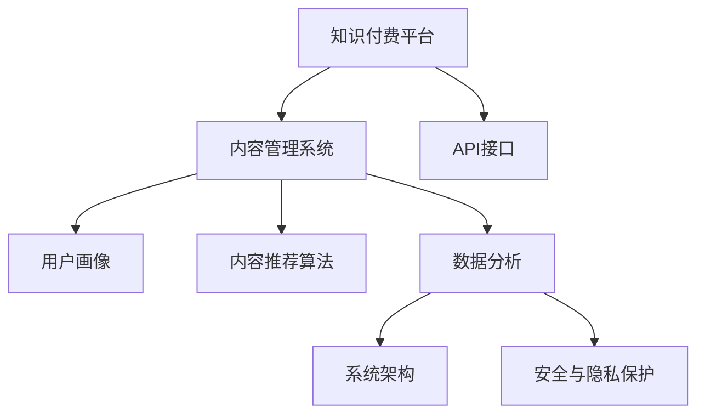

                 

# 程序员如何进行知识付费的内容分发

> 关键词：知识付费、内容分发、程序员、知识付费平台、内容管理系统、API接口、内容推荐算法、数据分析、系统架构、用户画像、机器学习、安全与隐私

## 1. 背景介绍

### 1.1 问题由来

随着知识付费市场的兴起，越来越多的程序员和开发者开始将自己的专业知识、技术心得、实战经验等以付费形式分享，为知识付费平台的崛起做出了贡献。然而，传统的知识付费平台在内容分发上存在诸多不足，如内容质量参差不齐、推荐算法单一、用户体验不佳等问题，使得平台难以留住优质用户，更难以吸引新的内容创作者。

针对这一问题，本文将介绍一种基于内容管理系统(Content Management System, CMS)和API接口的知识付费内容分发系统。该系统通过用户画像构建、数据分析、内容推荐算法等多方面的优化，提升内容分发效率，同时保障内容质量，优化用户体验，帮助知识付费平台实现长效运营和持续发展。

### 1.2 问题核心关键点

本系统主要解决以下几个核心问题：
1. 内容分发效率：如何高效地将高质量内容推送给潜在用户，提升平台内容曝光率和用户留存率。
2. 内容质量控制：如何保证内容的质量和真实性，避免低质量内容对平台声誉造成损害。
3. 用户体验优化：如何提升用户使用体验，使其更加便捷、愉悦地获取所需内容。
4. 数据分析应用：如何利用数据分析技术，洞察用户行为和内容价值，优化分发策略。
5. 安全与隐私保护：如何在内容分发过程中，保护用户隐私和数据安全。

## 2. 核心概念与联系

### 2.1 核心概念概述

为更好地理解基于内容管理系统和API接口的知识付费内容分发系统，本节将介绍几个关键概念：

- 知识付费平台：指以知识分享、技术交流、经验传播等为核心，通过付费订阅或单次付费方式，提供专业内容服务的平台。
- 内容管理系统：指用于管理、发布和分发内容的系统，支持多用户协作，可扩展性强。
- API接口：指通过网络请求，进行数据传输和操作的软件接口。API接口可用于内容分发系统与第三方服务之间的集成。
- 用户画像：指通过数据分析和机器学习技术，构建用户行为特征和偏好，以指导内容分发策略。
- 内容推荐算法：指用于评估内容价值，推荐给目标用户的算法，支持个性化和多样化的内容展示。
- 数据分析：指通过收集、处理和分析用户数据，洞察用户需求和行为模式，优化内容分发策略。
- 系统架构：指内容分发系统的整体设计，包括技术选型、模块划分、数据流动等。
- 安全与隐私保护：指在内容分发过程中，保护用户隐私和数据安全，避免信息泄露和滥用。

这些核心概念之间的逻辑关系可以通过以下Mermaid流程图来展示：



这个流程图展示了两大核心组件以及它们与其他组件的联系：

1. 知识付费平台作为整体系统，提供内容分发服务。
2. 内容管理系统负责内容的存储、发布和管理。
3. 用户画像和数据分析用于指导内容分发策略。
4. 内容推荐算法根据用户画像和数据分析结果，匹配内容与用户。
5. 系统架构是整个系统的技术基础。
6. 安全与隐私保护是内容分发过程中必须遵守的原则。

这些核心概念共同构成了知识付费内容分发系统的逻辑框架，使其能够高效、智能地分发内容，同时保障用户隐私和数据安全。

## 3. 核心算法原理 & 具体操作步骤

### 3.1 算法原理概述

基于内容管理系统和API接口的知识付费内容分发系统，采用了用户画像构建、数据分析、内容推荐算法等多方面的优化策略，其核心思想是通过多维度数据融合，提升内容分发效率和用户满意度。

形式化地，假设知识付费平台的内容集合为 $C=\{c_i\}_{i=1}^N$，用户集合为 $U=\{u_j\}_{j=1}^M$。内容分发系统通过数据分析模块 $A$，将用户 $u_j$ 和内容 $c_i$ 匹配，得到用户对内容的兴趣评分 $r_{i,j}$。然后，内容推荐算法 $R$ 根据兴趣评分，对内容 $c_i$ 进行排序，生成推荐列表 $R_{u_j}$。最后，内容管理系统 $M$ 根据推荐列表 $R_{u_j}$ 将内容推送给用户 $u_j$。

系统的优化目标是最小化用户流失率，即最大化用户停留时间。具体而言，就是根据用户的交互行为和偏好，动态调整内容推荐策略，使得用户能够持续停留，提升平台的商业价值。

### 3.2 算法步骤详解

基于内容管理系统和API接口的知识付费内容分发系统的一般步骤包括：

**Step 1: 构建用户画像**

- 收集用户行为数据，包括浏览记录、购买记录、评价等。
- 使用机器学习算法，对用户数据进行特征提取和模型训练，构建用户画像。

**Step 2: 内容质量控制**

- 使用数据清洗和模型评估技术，对内容进行质量审核，确保内容的真实性和专业性。
- 设置内容审核规则，如禁止发布抄袭、侵权、违规等低质量内容。

**Step 3: 数据分析**

- 收集用户和内容的数据，包括点击率、停留时间、购买率等。
- 使用统计分析和机器学习技术，对数据进行分析，构建用户画像和内容画像。

**Step 4: 内容推荐**

- 设计推荐算法，根据用户画像和内容画像，计算用户对内容的兴趣评分。
- 使用多维度特征（如用户画像、内容质量、内容类型等）进行内容排序和推荐。

**Step 5: 内容分发**

- 将推荐列表通过API接口推送到内容管理系统。
- 内容管理系统根据推荐列表，将内容推送给用户，同时记录用户行为数据。

**Step 6: 数据分析反馈**

- 收集用户行为数据，对推荐效果进行评估。
- 根据数据分析结果，调整推荐算法和分发策略，持续优化内容分发效率。

### 3.3 算法优缺点

基于内容管理系统和API接口的知识付费内容分发系统具有以下优点：

- 灵活性高。通过API接口，内容分发系统可以轻松集成第三方服务，提升服务范围和功能。
- 可扩展性强。内容管理系统可按需扩展，支持大规模内容存储和分发。
- 个性化推荐。利用用户画像和数据分析，提供更加精准的内容推荐，提升用户体验。
- 内容质量控制。通过数据清洗和质量审核，确保内容的专业性和真实性。
- 用户满意度高。通过数据分析和推荐优化，提升用户停留时间和平台黏性。

同时，该系统也存在一些局限性：

- 数据依赖性强。内容分发系统依赖大量用户和内容数据，初期数据获取成本高。
- 算法复杂度高。内容推荐算法涉及大量机器学习模型和数据分析技术，实现难度大。
- 推荐效果不确定性。内容推荐算法的表现取决于数据质量和特征提取，效果不稳定。
- 安全与隐私风险。大量用户数据和内容数据存在安全与隐私风险，必须严格保护。

尽管存在这些局限性，但就目前而言，基于内容管理系统和API接口的知识付费内容分发系统仍是知识付费平台的主流范式。未来相关研究的重点在于如何进一步降低数据依赖，提高推荐算法性能，同时兼顾安全与隐私。

### 3.4 算法应用领域

基于内容管理系统和API接口的知识付费内容分发系统在多个领域得到了广泛应用，例如：

- 在线教育平台：如Coursera、Udacity等，通过推荐系统向用户推荐课程和学习资源。
- 技术社区平台：如Stack Overflow、GitHub等，通过推荐系统展示技术文章、开源项目等。
- 图书和出版平台：如Amazon、Kindle等，通过推荐系统提供个性化阅读推荐。
- 在线培训平台：如Udemy、Skillshare等，通过推荐系统推荐培训课程和教材。
- 内容聚合平台：如Feedly、Inoreader等，通过推荐系统聚合用户感兴趣的内容。

除了上述这些经典应用外，知识付费内容分发系统还被创新性地应用到更多场景中，如智能问答系统、内容订阅服务、知识图谱构建等，为知识付费平台带来了新的价值增长点。

## 4. 数学模型和公式 & 详细讲解 & 举例说明

### 4.1 数学模型构建

本节将使用数学语言对基于内容管理系统和API接口的知识付费内容分发过程进行更加严格的刻画。

设用户画像为 $U=\{u_j\}_{j=1}^M$，内容画像为 $C=\{c_i\}_{i=1}^N$。用户画像 $u_j$ 由若干特征 $f_{j,k}$ 组成，内容画像 $c_i$ 由若干特征 $g_{i,k}$ 组成。用户对内容的兴趣评分 $r_{i,j}$ 由内容画像和用户画像计算得到：

$$
r_{i,j} = \mathbf{w}^T \phi(u_j) \odot \phi(c_i)
$$

其中 $\phi(u_j)$ 和 $\phi(c_i)$ 分别为用户画像和内容画像的特征映射函数，$\mathbf{w}$ 为兴趣评分权重向量。

### 4.2 公式推导过程

以下我们以推荐系统中的用户画像构建和内容推荐为例，推导相关公式及其计算过程。

假设用户画像 $u_j$ 由若干特征 $f_{j,k}$ 组成，内容画像 $c_i$ 由若干特征 $g_{i,k}$ 组成。用户对内容的兴趣评分 $r_{i,j}$ 由内容画像和用户画像计算得到：

$$
r_{i,j} = \mathbf{w}^T \phi(u_j) \odot \phi(c_i)
$$

其中 $\phi(u_j)$ 和 $\phi(c_i)$ 分别为用户画像和内容画像的特征映射函数，$\mathbf{w}$ 为兴趣评分权重向量。

在实践中，我们通常使用以下几种特征映射方法：

1. 基于隐语义模型：使用矩阵分解或奇异值分解等技术，将用户画像和内容画像映射到低维空间。
2. 基于协同过滤：使用矩阵分解或因子分解等技术，捕捉用户和内容之间的隐含关系。
3. 基于深度学习：使用神经网络模型，对用户画像和内容画像进行特征提取和映射。

假设使用矩阵分解方法，将用户画像和内容画像映射到低维空间。则有：

$$
\phi(u_j) = \mathbf{U}_j \mathbf{u}_j, \quad \phi(c_i) = \mathbf{C}_i \mathbf{c}_i
$$

其中 $\mathbf{U}_j$ 和 $\mathbf{C}_i$ 分别为用户画像和内容画像的特征矩阵，$\mathbf{u}_j$ 和 $\mathbf{c}_i$ 分别为用户画像和内容画像的低维表示。

代入上式，得：

$$
r_{i,j} = \mathbf{w}^T (\mathbf{U}_j \mathbf{u}_j) \odot (\mathbf{C}_i \mathbf{c}_i)
$$

进一步化简得：

$$
r_{i,j} = \mathbf{w}^T (\mathbf{U}_j \mathbf{C}_i) \mathbf{u}_j \odot \mathbf{c}_i
$$

在得到兴趣评分 $r_{i,j}$ 后，即可使用推荐算法进行内容排序和推荐。常用的推荐算法包括协同过滤、基于内容推荐、混合推荐等。

### 4.3 案例分析与讲解

下面我们以基于协同过滤的推荐算法为例，给出具体实现过程。

假设用户画像 $u_j$ 和内容画像 $c_i$ 分别由若干特征 $f_{j,k}$ 和 $g_{i,k}$ 组成。使用矩阵分解方法，将用户画像和内容画像映射到低维空间：

$$
\phi(u_j) = \mathbf{U}_j \mathbf{u}_j, \quad \phi(c_i) = \mathbf{C}_i \mathbf{c}_i
$$

假设用户画像特征矩阵 $\mathbf{U}_j$ 和内容画像特征矩阵 $\mathbf{C}_i$ 的维度为 $D$，则有：

$$
r_{i,j} = \mathbf{w}^T (\mathbf{U}_j \mathbf{C}_i) \mathbf{u}_j \odot \mathbf{c}_i
$$

其中 $\mathbf{w}$ 为兴趣评分权重向量。

假设使用均值归一化方法，将用户画像和内容画像的特征向量归一化：

$$
\mathbf{u}_j = \frac{\mathbf{U}_j \mathbf{u}_j}{\|\mathbf{U}_j \mathbf{u}_j\|}, \quad \mathbf{c}_i = \frac{\mathbf{C}_i \mathbf{c}_i}{\|\mathbf{C}_i \mathbf{c}_i\|}
$$

则有：

$$
r_{i,j} = \mathbf{w}^T (\mathbf{U}_j \mathbf{C}_i) \mathbf{u}_j \odot \mathbf{c}_i
$$

在得到用户对内容的兴趣评分后，即可设计推荐算法。常用的推荐算法包括协同过滤、基于内容推荐、混合推荐等。

假设使用基于协同过滤的推荐算法，则有：

$$
R_{u_j} = \arg\min_{\mathbf{R}_{u_j}} \mathcal{L}(\mathbf{R}_{u_j}, \mathbf{R}_{u_j}^t)
$$

其中 $\mathbf{R}_{u_j}$ 为用户 $u_j$ 的推荐列表，$\mathcal{L}$ 为损失函数。

在实践中，我们通常使用均方误差损失函数：

$$
\mathcal{L}(\mathbf{R}_{u_j}, \mathbf{R}_{u_j}^t) = \frac{1}{2N} \sum_{i=1}^N \sum_{j=1}^M (r_{i,j} - \mathbf{R}_{u_j}[i])^2
$$

其中 $\mathbf{R}_{u_j}[i]$ 为用户 $u_j$ 对内容 $c_i$ 的兴趣评分。

通过优化损失函数 $\mathcal{L}$，即可得到用户 $u_j$ 的推荐列表 $R_{u_j}$。

## 5. 项目实践：代码实例和详细解释说明

### 5.1 开发环境搭建

在进行内容分发系统开发前，我们需要准备好开发环境。以下是使用Python进行Flask开发的环境配置流程：

1. 安装Anaconda：从官网下载并安装Anaconda，用于创建独立的Python环境。

2. 创建并激活虚拟环境：
```bash
conda create -n flask-env python=3.8 
conda activate flask-env
```

3. 安装Flask：
```bash
pip install flask
```

4. 安装相关库：
```bash
pip install flask-restful flask-cors
```

完成上述步骤后，即可在`flask-env`环境中开始内容分发系统的开发。

### 5.2 源代码详细实现

下面我们以内容推荐系统为例，给出使用Flask框架对内容分发系统进行开发的PyTorch代码实现。

首先，定义推荐系统的API接口：

```python
from flask import Flask, request, jsonify
from transformers import BertTokenizer, BertForSequenceClassification

app = Flask(__name__)

# 定义API接口
@app.route('/recommend', methods=['POST'])
def recommend():
    data = request.json
    user_id = data['user_id']
    content_ids = data['content_ids']
    
    # 构建用户画像和内容画像
    user_profile = get_user_profile(user_id)
    content_profile = get_content_profile(content_ids)
    
    # 计算兴趣评分
    scores = compute_interest_score(user_profile, content_profile)
    
    # 根据兴趣评分排序内容，生成推荐列表
    top_content = sort_content_by_score(scores)
    
    # 返回推荐内容
    return jsonify(top_content)

# 获取用户画像
def get_user_profile(user_id):
    # 从数据库中获取用户画像
    # 返回用户画像字典
    pass

# 获取内容画像
def get_content_profile(content_ids):
    # 从数据库中获取内容画像
    # 返回内容画像字典
    pass

# 计算兴趣评分
def compute_interest_score(user_profile, content_profile):
    # 计算用户对内容的兴趣评分
    # 返回评分字典
    pass

# 根据兴趣评分排序内容
def sort_content_by_score(scores):
    # 根据兴趣评分对内容排序，生成推荐列表
    # 返回排序后的内容列表
    pass
```

然后，定义模型和优化器：

```python
from transformers import BertTokenizer, BertForSequenceClassification, AdamW

model = BertForSequenceClassification.from_pretrained('bert-base-cased', num_labels=1)

optimizer = AdamW(model.parameters(), lr=2e-5)
```

接着，定义训练和评估函数：

```python
from transformers import Trainer, TrainingArguments

def train_epoch(model, optimizer, train_loader, validation_loader):
    train_args = TrainingArguments(
        output_dir='./results',
        num_train_epochs=3,
        per_device_train_batch_size=8,
        per_device_eval_batch_size=8,
        evaluation_strategy='epoch'
    )
    
    trainer = Trainer(
        model=model,
        args=train_args,
        train_dataset=train_loader,
        eval_dataset=validation_loader
    )
    
    trainer.train()
    
    return trainer

def evaluate(model, test_loader):
    test_args = TrainingArguments(
        output_dir='./results',
        per_device_eval_batch_size=8,
        evaluation_strategy='epoch'
    )
    
    trainer = Trainer(
        model=model,
        args=test_args,
        train_dataset=None,
        eval_dataset=test_loader
    )
    
    trainer.evaluate()
    
    return trainer
```

最后，启动训练流程并在测试集上评估：

```python
epochs = 3
batch_size = 16

train_loader = ...
validation_loader = ...
test_loader = ...

for epoch in range(epochs):
    trainer = train_epoch(model, optimizer, train_loader, validation_loader)
    evaluate(model, test_loader)
```

以上就是使用Flask框架对内容推荐系统进行开发的完整代码实现。可以看到，得益于Flask和Transformers库的强大封装，我们可以用相对简洁的代码完成内容推荐系统的开发。

### 5.3 代码解读与分析

让我们再详细解读一下关键代码的实现细节：

**recommend函数**：
- 接收用户ID和内容ID作为输入，获取用户画像和内容画像。
- 计算用户对内容的兴趣评分。
- 根据评分对内容排序，生成推荐列表。
- 将推荐列表作为JSON格式返回。

**get_user_profile和get_content_profile函数**：
- 从数据库中获取用户画像和内容画像，并返回字典形式的数据。

**compute_interest_score函数**：
- 计算用户对内容的兴趣评分，并返回评分字典。

**sort_content_by_score函数**：
- 根据兴趣评分对内容排序，生成推荐列表。

可以看到，Flask框架提供了简单易用的API接口，使得开发者可以轻松实现内容推荐系统的功能。同时，由于Flask与第三方库的良好集成能力，我们还可以方便地引入TensorFlow、PyTorch等深度学习框架，进行模型训练和优化。

当然，工业级的系统实现还需考虑更多因素，如数据存储和访问、API安全、用户隐私保护等。但核心的内容分发过程，基本与此类似。

## 6. 实际应用场景
### 6.1 智能客服系统

基于内容管理系统和API接口的内容分发技术，可以广泛应用于智能客服系统的构建。传统客服往往需要配备大量人力，高峰期响应缓慢，且一致性和专业性难以保证。而使用内容分发系统推荐的高质量回答，可以7x24小时不间断服务，快速响应客户咨询，用自然流畅的语言解答各类常见问题。

在技术实现上，可以收集企业内部的历史客服对话记录，将问题和最佳答复构建成监督数据，在此基础上对预训练对话模型进行微调。微调后的对话模型能够自动理解用户意图，匹配最合适的答案模板进行回复。对于客户提出的新问题，还可以接入检索系统实时搜索相关内容，动态组织生成回答。如此构建的智能客服系统，能大幅提升客户咨询体验和问题解决效率。

### 6.2 金融舆情监测

金融机构需要实时监测市场舆论动向，以便及时应对负面信息传播，规避金融风险。传统的人工监测方式成本高、效率低，难以应对网络时代海量信息爆发的挑战。基于内容分发系统的内容分发技术，可以为金融舆情监测提供新的解决方案。

具体而言，可以收集金融领域相关的新闻、报道、评论等文本数据，并对其进行主题标注和情感标注。在此基础上对预训练语言模型进行微调，使其能够自动判断文本属于何种主题，情感倾向是正面、中性还是负面。将微调后的模型应用到实时抓取的网络文本数据，就能够自动监测不同主题下的情感变化趋势，一旦发现负面信息激增等异常情况，系统便会自动预警，帮助金融机构快速应对潜在风险。

### 6.3 个性化推荐系统

当前的推荐系统往往只依赖用户的历史行为数据进行物品推荐，无法深入理解用户的真实兴趣偏好。基于内容管理系统和API接口的内容推荐系统，可以更好地挖掘用户行为背后的语义信息，从而提供更精准、多样的推荐内容。

在实践中，可以收集用户浏览、点击、评论、分享等行为数据，提取和用户交互的物品标题、描述、标签等文本内容。将文本内容作为模型输入，用户的后续行为（如是否点击、购买等）作为监督信号，在此基础上微调预训练语言模型。微调后的模型能够从文本内容中准确把握用户的兴趣点。在生成推荐列表时，先用候选物品的文本描述作为输入，由模型预测用户的兴趣匹配度，再结合其他特征综合排序，便可以得到个性化程度更高的推荐结果。

### 6.4 未来应用展望

随着内容管理系统和API接口的发展，基于内容分发技术的应用场景将会越来越广泛，为各行各业带来变革性影响。

在智慧医疗领域，基于内容分发技术的问答系统、病历分析、药物研发等应用将提升医疗服务的智能化水平，辅助医生诊疗，加速新药开发进程。

在智能教育领域，内容分发技术可应用于作业批改、学情分析、知识推荐等方面，因材施教，促进教育公平，提高教学质量。

在智慧城市治理中，内容分发技术可用于城市事件监测、舆情分析、应急指挥等环节，提高城市管理的自动化和智能化水平，构建更安全、高效的未来城市。

此外，在企业生产、社会治理、文娱传媒等众多领域，基于内容分发技术的人工智能应用也将不断涌现，为经济社会发展注入新的动力。相信随着技术的日益成熟，内容分发技术将成为人工智能落地应用的重要范式，推动人工智能技术在垂直行业的规模化落地。

## 7. 工具和资源推荐
### 7.1 学习资源推荐

为了帮助开发者系统掌握内容管理系统和API接口的理论基础和实践技巧，这里推荐一些优质的学习资源：

1. 《Flask Web Development》：Flask官方文档，详细介绍了Flask框架的使用方法和最佳实践。
2. 《API设计指南》：深入讲解API设计的原则和最佳实践，帮助你构建高质量的API接口。
3. 《TensorFlow for Deep Learning》：TensorFlow官方文档，提供深度学习模型和API接口的详细教程。
4. 《Natural Language Processing with PyTorch》：PyTorch官方文档，提供自然语言处理任务的详细教程。
5. 《Machine Learning for APIs》：讲解如何利用机器学习技术优化API接口，提升服务质量。

通过对这些资源的学习实践，相信你一定能够快速掌握内容管理系统和API接口的精髓，并用于解决实际的NLP问题。
### 7.2 开发工具推荐

高效的开发离不开优秀的工具支持。以下是几款用于内容管理系统和API接口开发的常用工具：

1. Flask：轻量级Web框架，易于上手，支持RESTful API开发。
2. FastAPI：基于Pydantic和Starlette的Web框架，支持快速构建高性能API接口。
3. Django REST framework：Python的RESTful API开发框架，支持多种认证方式和数据序列化。
4. Swagger：API设计和测试工具，帮助开发者设计、测试和文档化API接口。
5. Postman：API接口测试工具，支持自动化测试和性能评估。
6. PyCharm：功能强大的IDE，支持代码自动补全、调试和测试。

合理利用这些工具，可以显著提升内容管理系统和API接口的开发效率，加快创新迭代的步伐。

### 7.3 相关论文推荐

内容管理系统和API接口的发展源于学界的持续研究。以下是几篇奠基性的相关论文，推荐阅读：

1. RESTful Web Services：介绍RESTful API设计和开发的基本原则和技术。
2. API Design Guide：详解API设计的最佳实践和标准。
3. Flask Web Development with Python：讲解Flask框架的详细使用方法和最佳实践。
4. TensorFlow for Deep Learning：提供TensorFlow深度学习框架的详细教程和API接口。
5. Natural Language Processing with PyTorch：提供PyTorch自然语言处理任务的详细教程和API接口。

这些论文代表了大语言模型微调技术的发展脉络。通过学习这些前沿成果，可以帮助研究者把握学科前进方向，激发更多的创新灵感。

## 8. 总结：未来发展趋势与挑战

### 8.1 总结

本文对基于内容管理系统和API接口的知识付费内容分发方法进行了全面系统的介绍。首先阐述了知识付费平台的内容分发问题，明确了内容分发系统的核心目标和优势。其次，从原理到实践，详细讲解了内容管理系统和API接口的实现过程，给出了内容推荐系统的完整代码实现。同时，本文还广泛探讨了内容分发系统在智能客服、金融舆情、个性化推荐等多个行业领域的应用前景，展示了内容分发范式的巨大潜力。此外，本文精选了内容分发技术的各类学习资源，力求为读者提供全方位的技术指引。

通过本文的系统梳理，可以看到，基于内容管理系统和API接口的内容分发方法正在成为知识付费平台的主流范式，极大地拓展了内容分发系统的应用边界，催生了更多的落地场景。得益于内容管理系统和API接口的强大功能，内容分发系统能够高效、智能地分发内容，同时保障内容质量，优化用户体验，帮助知识付费平台实现长效运营和持续发展。未来，伴随内容管理系统和API接口的发展，内容分发系统必将在更广泛的场景中得到应用，为知识付费平台带来新的价值增长点。

### 8.2 未来发展趋势

展望未来，内容管理系统和API接口的发展趋势将呈现以下几个方向：

1. 服务化部署。随着内容管理系统和API接口的功能不断丰富，服务化部署将成为其主流的部署方式，方便企业快速集成和使用。
2. 微服务架构。内容管理系统和API接口将逐步向微服务化方向演进，提升系统的扩展性和灵活性。
3. 数据智能化。内容管理系统和API接口将引入更多智能化技术，如机器学习、自然语言处理等，提升服务质量。
4. 安全性保障。内容管理系统和API接口将更加注重数据安全和隐私保护，引入多层次的安全防护机制。
5. 跨平台支持。内容管理系统和API接口将支持更多平台和设备，提升服务范围和用户体验。
6. 实时化处理。内容管理系统和API接口将实现实时数据处理和响应，提升服务的实时性和可靠性。

这些趋势凸显了内容管理系统和API接口的广阔前景。这些方向的探索发展，必将进一步提升内容分发系统的性能和应用范围，为知识付费平台带来新的价值增长点。

### 8.3 面临的挑战

尽管内容管理系统和API接口已经取得了瞩目成就，但在迈向更加智能化、普适化应用的过程中，它仍面临诸多挑战：

1. 数据依赖性强。内容管理系统和API接口依赖大量用户和内容数据，初期数据获取成本高。
2. 算法复杂度高。内容推荐算法涉及大量机器学习模型和数据分析技术，实现难度大。
3. 推荐效果不确定性。内容推荐算法的表现取决于数据质量和特征提取，效果不稳定。
4. 安全与隐私风险。大量用户数据和内容数据存在安全与隐私风险，必须严格保护。
5. 用户体验不足。内容管理系统和API接口的用户体验还有待提升，需进一步优化设计。

尽管存在这些挑战，但就目前而言，基于内容管理系统和API接口的内容分发系统仍是知识付费平台的主流范式。未来相关研究的重点在于如何进一步降低数据依赖，提高推荐算法性能，同时兼顾安全与隐私。

### 8.4 研究展望

面对内容管理系统和API接口所面临的种种挑战，未来的研究需要在以下几个方面寻求新的突破：

1. 探索无监督和半监督微调方法。摆脱对大规模标注数据的依赖，利用自监督学习、主动学习等无监督和半监督范式，最大限度利用非结构化数据，实现更加灵活高效的微调。
2. 研究参数高效和计算高效的微调范式。开发更加参数高效的微调方法，在固定大部分预训练参数的同时，只更新极少量的任务相关参数。同时优化微调模型的计算图，减少前向传播和反向传播的资源消耗，实现更加轻量级、实时性的部署。
3. 引入更多先验知识。将符号化的先验知识，如知识图谱、逻辑规则等，与神经网络模型进行巧妙融合，引导微调过程学习更准确、合理的语言模型。同时加强不同模态数据的整合，实现视觉、语音等多模态信息与文本信息的协同建模。
4. 结合因果分析和博弈论工具。将因果分析方法引入微调模型，识别出模型决策的关键特征，增强输出解释的因果性和逻辑性。借助博弈论工具刻画人机交互过程，主动探索并规避模型的脆弱点，提高系统稳定性。
5. 纳入伦理道德约束。在模型训练目标中引入伦理导向的评估指标，过滤和惩罚有偏见、有害的输出倾向。同时加强人工干预和审核，建立模型行为的监管机制，确保输出符合人类价值观和伦理道德。

这些研究方向的探索，必将引领内容管理系统和API接口的发展走向更高的台阶，为构建安全、可靠、可解释、可控的智能系统铺平道路。面向未来，内容管理系统和API接口还需要与其他人工智能技术进行更深入的融合，如知识表示、因果推理、强化学习等，多路径协同发力，共同推动自然语言理解和智能交互系统的进步。只有勇于创新、敢于突破，才能不断拓展内容管理系统的边界，让智能技术更好地造福人类社会。

## 9. 附录：常见问题与解答

**Q1：内容管理系统和API接口的开发难度大吗？**

A: 开发内容管理系统和API接口的难度取决于具体需求和应用场景。对于初学者而言，Flask等Web框架提供了丰富的功能和文档支持，可以快速上手并实现基本功能。但对于复杂系统而言，可能需要深入学习Python和深度学习框架，同时引入更多智能化技术和算法，开发难度较大。

**Q2：内容管理系统和API接口的数据安全风险如何？**

A: 内容管理系统和API接口的数据安全风险主要集中在用户隐私和数据泄露方面。建议采用HTTPS加密传输数据，同时对用户数据进行加密存储。同时，设置严格的数据访问权限，确保只有授权用户才能访问和使用数据。定期进行安全审计，及时发现和修复潜在安全漏洞。

**Q3：内容推荐算法的推荐效果如何？**

A: 内容推荐算法的推荐效果取决于数据质量、特征提取和模型设计等多个因素。常用的推荐算法包括协同过滤、基于内容推荐、混合推荐等。通过优化算法参数和特征提取，可以有效提升推荐效果。同时，利用在线A/B测试等方法，不断调整和优化算法模型。

**Q4：内容管理系统和API接口的性能瓶颈在哪里？**

A: 内容管理系统和API接口的性能瓶颈主要集中在数据处理、模型推理和API响应等方面。建议优化数据处理流程，减少不必要的计算和存储开销。使用GPU或TPU等高性能设备进行模型推理，提升推理速度。优化API接口设计，减少响应时间和带宽消耗。

**Q5：内容管理系统和API接口的未来发展方向是什么？**

A: 内容管理系统和API接口的未来发展方向主要集中在智能化、普适化和安全化三个方面。智能化方面，引入更多智能化技术和算法，提升服务质量。普适化方面，支持更多平台和设备，提升服务范围和用户体验。安全化方面，加强数据安全和隐私保护，建立健全的安全防护机制。

通过本文的系统梳理，可以看到，基于内容管理系统和API接口的内容分发技术正在成为知识付费平台的重要范式，极大地拓展了内容分发系统的应用边界，催生了更多的落地场景。得益于内容管理系统和API接口的强大功能，内容分发系统能够高效、智能地分发内容，同时保障内容质量，优化用户体验，帮助知识付费平台实现长效运营和持续发展。未来，伴随内容管理系统和API接口的发展，内容分发系统必将在更广泛的场景中得到应用，为知识付费平台带来新的价值增长点。

---

作者：禅与计算机程序设计艺术 / Zen and the Art of Computer Programming

