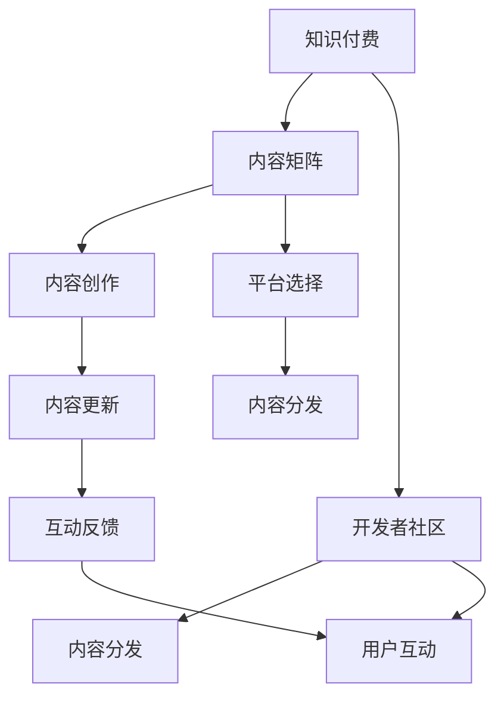

                 

# 程序员如何进行知识付费的内容矩阵

> 关键词：知识付费, 内容矩阵, 开发者社区, 内容创作, 平台生态, 技术博客, 知识分享

## 1. 背景介绍

### 1.1 问题由来

在互联网快速发展的新时代，知识付费已成为一种重要的学习和交流方式。从教育、培训到技术分享，大量高质量内容正通过各种平台迅速传播，为知识工作者和爱好者提供新的发展机遇。特别是对于程序员这一群体，掌握前沿技术、高效沟通经验、快速解决实际问题，成为其成长的重要驱动力。

面对知识付费市场的庞大需求，许多优秀的程序员开始尝试通过内容创作获取收益。然而，内容创作并非易事，如何构建一个内容矩阵，使创作者能够持续输出有价值的知识，同时吸引更多的付费用户，是一个值得探讨的课题。

### 1.2 问题核心关键点

本文旨在探索程序员如何进行知识付费的内容矩阵建设，涵盖以下关键点：

- **内容类型多样化**：除了技术文章，内容创作还应包括项目实践、视频教程、问答互动等多种形式。
- **平台选择与优化**：选择合适的平台，并利用平台工具优化内容分发和曝光。
- **用户互动与反馈**：建立互动渠道，及时反馈，提升用户粘性和满意度。
- **内容更新与迭代**：持续更新内容，动态调整策略，保持内容新鲜度和竞争力。
- **收益分配与激励**：建立合理的收益分配机制，激励创作者持续产出优质内容。

通过解决这些问题，本文将提供一个系统的知识付费内容矩阵构建策略，以期帮助程序员实现内容变现。

## 2. 核心概念与联系

### 2.1 核心概念概述

为更好地理解程序员知识付费内容矩阵的构建，本节将介绍几个关键概念：

- **知识付费**：一种通过付费方式获取知识和技术的学习方式，通常包括文章、视频、课程、咨询等形式。
- **内容矩阵**：一种内容结构化管理方式，通过组合不同的内容形式和平台，构建多层次、多维度的知识内容体系。
- **开发者社区**：程序员交流与协作的网络平台，通常具备问题解答、代码分享、技术讨论等功能。
- **内容创作**：程序员通过撰写技术博客、分享项目经验、制作教程视频等方式，将自身知识转化为可付费内容。
- **平台生态**：知识付费平台与创作者、用户三方之间形成的良性互动与协同机制。
- **内容分发**：将内容通过适当的渠道和方式传播出去，以扩大受众范围。
- **用户互动**：通过评论、点赞、分享等方式，增加用户与创作者之间的互动，提升用户粘性。

这些核心概念之间的逻辑关系可以通过以下Mermaid流程图来展示：



这个流程图展示了几者之间的关键联系：

1. 知识付费依托于内容矩阵，构建内容体系。
2. 内容矩阵通过内容创作和平台选择，实现内容多样化与分发优化。
3. 开发者社区为内容创作提供平台与用户互动，增强内容影响力和创作者黏性。
4. 内容分发与用户互动相结合，不断迭代内容策略，提升用户满意度。

## 3. 核心算法原理 & 具体操作步骤
### 3.1 算法原理概述

程序员知识付费的内容矩阵构建，本质上是一种内容管理和优化策略。其核心思想是：通过选择合适的平台和工具，创建多样化、高质量的内容，并通过有效的分发和互动，实现内容价值的最大化。

具体而言，可以分为以下几个步骤：

1. **内容创作与多样化**：根据目标用户和市场需求，创作多种形式的内容，如技术文章、代码示例、项目教程等。
2. **平台选择与优化**：在多个知识付费平台（如CSDN、知乎、B站等）发布内容，并利用平台的特色功能（如标签、话题、推荐算法）优化内容曝光。
3. **内容分发与互动**：通过社交媒体、邮件列表等渠道传播内容，鼓励用户评论、点赞、分享，增加互动。
4. **内容更新与迭代**：根据用户反馈和市场变化，不断更新内容，调整创作方向和分发策略。
5. **收益分配与激励**：建立合理的收益分配机制，激励创作者持续产出优质内容。

### 3.2 算法步骤详解

下面将详细介绍以上各个步骤的具体操作方法：

#### 步骤1：内容创作与多样化

- **选题与调研**：根据自身技术专长和市场需求，选择有价值的选题。调研用户反馈和行业动态，确定内容方向。
- **内容规划**：制定详细的内容计划，包括文章结构、技术点、案例分析等。
- **内容创作**：利用文字、代码、图表等多种形式，系统地阐述技术细节。强调实用性和可操作性，增加案例分析，以确保内容质量。

#### 步骤2：平台选择与优化

- **平台调研**：研究不同知识付费平台的特性与优势，选择合适的平台发布内容。
- **内容上传**：使用平台提供的编辑器或Markdown格式，上传内容。
- **平台优化**：利用平台的标签、话题功能，进行内容分类与定位。参与平台话题讨论，提升内容曝光度。

#### 步骤3：内容分发与互动

- **社交媒体推广**：通过Twitter、LinkedIn、Reddit等社交媒体平台，推广内容。使用SEO优化技术，提升内容搜索排名。
- **邮件列表订阅**：建立邮件列表，定期向订阅用户发送最新内容和技术动态。
- **互动反馈**：利用平台评论、私信等工具，收集用户反馈和建议。及时回应用户问题，增强用户互动。

#### 步骤4：内容更新与迭代

- **数据分析**：利用平台提供的数据分析工具，评估内容效果，确定关注点。
- **内容更新**：根据数据分析结果，调整内容创作方向。更新过时内容，增加新知识和技术点。
- **策略迭代**：根据用户反馈和市场变化，调整分发和互动策略，提升用户满意度。

#### 步骤5：收益分配与激励

- **收益模型**：设计合理的收益分配模型，如按阅读量、订阅量、打赏等。
- **激励机制**：建立激励机制，如优质内容奖励、用户投票等，激励创作者持续产出高质量内容。
- **版权保护**：采用版权保护措施，防止内容被盗用或抄袭。

### 3.3 算法优缺点

基于上述步骤，程序员知识付费内容矩阵构建方法具有以下优点：

- **内容多样化**：多种形式的内容能够满足不同用户需求，提高内容吸引力。
- **分发高效**：选择合适平台，利用平台工具优化内容曝光，扩大受众范围。
- **互动性强**：鼓励用户互动，增加内容粘性，提升用户满意度。
- **持续迭代**：根据市场变化和用户反馈，不断更新内容，保持竞争力。

同时，该方法也存在一些局限性：

- **时间成本高**：内容创作和平台选择耗时较多，需要大量精力投入。
- **平台依赖性强**：过度依赖平台推广，可能受平台策略变化影响。
- **互动质量难以控制**：用户互动质量参差不齐，可能影响内容传播效果。
- **收益分配复杂**：制定合理的收益分配机制需要细致考虑，防止激励效果不佳。

尽管有这些局限，但整体而言，该方法在内容矩阵构建方面依然具有较大优势，尤其适合有一定技术专长和内容创作能力的程序员。

### 3.4 算法应用领域

程序员知识付费内容矩阵构建方法，已经在多个技术分享和知识付费领域得到了应用，例如：

- **开源社区**：如GitHub、Stack Overflow等，程序员分享代码示例、项目教程等，通过平台提供的标签、版本控制等工具，进行内容优化与分发。
- **技术博客与自媒体**：通过WordPress、Medium等平台发布技术文章，利用SEO优化技术提升内容曝光度，并通过社交媒体推广，增强互动。
- **在线课程与培训**：利用Udemy、Coursera等平台发布视频教程，通过平台推荐算法和课程评论，提升用户关注度，并通过订阅费、付费会员等方式实现收益。
- **专业论坛与讨论区**：如CSDN、知乎等，程序员发布问题解答、项目经验，利用平台话题讨论功能，增加互动和关注度。
- **企业内部知识分享**：企业内部建立知识分享平台，鼓励员工分享项目案例、技术心得，通过平台积分、奖励等方式激励员工积极参与。

除了上述这些领域，基于知识付费内容矩阵构建方法，还可以应用于更多场景中，如博客、书籍、技术会议等，为程序员提供更广阔的内容创作和分享空间。

## 4. 数学模型和公式 & 详细讲解 & 举例说明

### 4.1 数学模型构建

本节将使用数学语言对程序员知识付费内容矩阵构建的过程进行更加严格的刻画。

假设程序员有 $N$ 篇技术文章，每篇文章 $i$ 的阅读量为 $R_i$，用户互动为 $I_i$。设平台提供的标签数为 $K$，参与的平台话题数为 $T$。

定义内容矩阵 $M$ 为 $N \times K$ 矩阵，其中 $M_{ij}$ 表示文章 $i$ 在标签 $j$ 上的内容权重。定义平台话题矩阵 $H$ 为 $N \times T$ 矩阵，其中 $H_{it}$ 表示文章 $i$ 在话题 $t$ 上的权重。

假设平台推荐算法为 $\text{Alg}(R, I, M, H)$，通过优化目标函数最大化平台收益。目标函数为：

$$
\max \sum_{i=1}^N \left( R_i f(R_i) + I_i g(I_i) \right)
$$

其中 $f(\cdot)$ 为阅读量收益函数，$g(\cdot)$ 为互动收益函数，分别表示阅读量和互动所带来的收益。

### 4.2 公式推导过程

以下我们以阅读量收益函数为例，推导其在内容矩阵中的应用。

设阅读量收益函数为 $f(R_i) = k_1 \log R_i + k_2$，其中 $k_1, k_2$ 为常数。

将阅读量收益函数带入目标函数，得：

$$
\max \sum_{i=1}^N \left( k_1 \log R_i + k_2 + I_i g(I_i) \right)
$$

由内容矩阵 $M$ 和平台话题矩阵 $H$ 的特征，目标函数进一步化简为：

$$
\max \sum_{i=1}^N \sum_{j=1}^K \sum_{t=1}^T M_{ij}R_i + \sum_{i=1}^N \sum_{t=1}^T H_{it}I_i
$$

目标函数对内容权重 $M_{ij}$ 和话题权重 $H_{it}$ 的优化，即为内容矩阵和平台话题矩阵的动态调整过程。

### 4.3 案例分析与讲解

以下通过一个具体的案例，进一步说明内容矩阵构建的实际应用：

假设某程序员在CSDN平台发布了一篇关于机器学习技术文章的博客。文章分为5个部分：

- 第一部分：机器学习基础
- 第二部分：深度学习框架
- 第三部分：模型训练技巧
- 第四部分：应用案例分析
- 第五部分：未来发展趋势

文章发布后，阅读量为 $R_1 = 500, R_2 = 600, R_3 = 700, R_4 = 800, R_5 = 900$。平台提供的标签为机器学习、深度学习、模型训练、案例分析、未来趋势，共5个标签。

文章发布在平台的话题 "机器学习技术" 下，平台话题矩阵为 $H_{13} = 1, H_{23} = 1, H_{33} = 1, H_{43} = 1, H_{53} = 1$。

假设阅读量收益函数为 $f(R_i) = k_1 \log R_i + k_2$，互动收益函数为 $g(I_i) = I_i$，其中 $k_1 = 0.1, k_2 = 0.5$。

通过内容矩阵 $M$ 和平台话题矩阵 $H$ 的动态调整，平台能够最大化推荐收益。假定平台采用随机推荐算法，通过调整内容权重 $M_{ij}$ 和话题权重 $H_{it}$，使得最终推荐收益最大。

## 5. 项目实践：代码实例和详细解释说明
### 5.1 开发环境搭建

在进行知识付费内容矩阵构建实践前，我们需要准备好开发环境。以下是使用Python进行内容管理系统的环境配置流程：

1. 安装Anaconda：从官网下载并安装Anaconda，用于创建独立的Python环境。

2. 创建并激活虚拟环境：
```bash
conda create -n content-management python=3.8 
conda activate content-management
```

3. 安装PyTorch：根据CUDA版本，从官网获取对应的安装命令。例如：
```bash
conda install pytorch torchvision torchaudio cudatoolkit=11.1 -c pytorch -c conda-forge
```

4. 安装Django框架：
```bash
pip install django
```

5. 安装MySQL和PostgreSQL：
```bash
sudo apt-get install mysql-server postgresql
```

6. 安装Python的ORM工具：
```bash
pip install django-rest-framework
```

完成上述步骤后，即可在`content-management`环境中开始内容管理系统开发。

### 5.2 源代码详细实现

下面以一个简化的内容管理系统为例，给出内容发布的详细代码实现。

首先，定义内容模型和数据库迁移：

```python
from django.db import models
from django.contrib.auth.models import User

class Content(models.Model):
    title = models.CharField(max_length=255)
    content = models.TextField()
    author = models.ForeignKey(User, on_delete=models.CASCADE)
    published = models.DateTimeField(auto_now_add=True)
    last_modified = models.DateTimeField(auto_now=True)

class ContentMigration:
    dependencies = [
        ('content', '0001_initial'),
    ]

    operations = [
        migrations.CreateModel(
            name='Content',
            fields=[
                ('id', models.AutoField(verbose_name='ID', serialize=False, auto_created=True, primary_key=True)),
                ('title', models.CharField(max_length=255)),
                ('content', models.TextField()),
                ('author', models.ForeignKey(to='auth.User', on_delete=models.CASCADE)),
                ('published', models.DateTimeField(auto_now_add=True)),
                ('last_modified', models.DateTimeField(auto_now=True)),
            ],
        ),
    ]
```

然后，定义内容管理系统视图：

```python
from django.shortcuts import render
from .models import Content

def content_list(request):
    contents = Content.objects.all().order_by('-published')
    return render(request, 'content/list.html', {'contents': contents})

def content_detail(request, pk):
    content = Content.objects.get(pk=pk)
    return render(request, 'content/detail.html', {'content': content})
```

接着，定义内容管理系统模板：

```html
<!-- content/list.html -->




    <h1>Content List</h1>
    <ul>
        
            <li><a href="">{{ content.title }}</a></li>
        
    </ul>


<!-- content/detail.html -->




    <h1>{{ content.title }}</h1>
    <p>{{ content.content }}</p>

```

最后，启动内容管理系统：

```bash
python manage.py runserver
```

以上就是一个简化的内容管理系统示例，开发者可以通过该系统发布和管理内容，实现基本的阅读量统计和互动功能。

### 5.3 代码解读与分析

让我们再详细解读一下关键代码的实现细节：

**内容模型定义**：
- `Content`模型定义了一个基本的内容对象，包括标题、内容、作者、发布时间和最后修改时间。

**内容迁移定义**：
- 定义了内容表的结构，包括主键、标题、内容、作者、发布时间、最后修改时间等字段。

**内容管理系统视图**：
- `content_list`视图返回所有发布的内容列表。
- `content_detail`视图返回指定ID的内容详情。

**内容管理系统模板**：
- `content_list.html`模板定义了内容列表展示页面。
- `content_detail.html`模板定义了内容详情展示页面。

通过上述代码，我们可以看到，一个简单的内容管理系统是如何通过Django框架实现的。开发者可以根据自己的需求，进一步扩展系统功能，如评论系统、标签系统、搜索功能等。

## 6. 实际应用场景
### 6.1 智能客服系统

基于程序员知识付费内容矩阵构建方法，智能客服系统可以通过内容分享与互动，提供更高效、智能的客户服务。

例如，某程序员在智能客服系统中发布了一系列与技术支持相关的文章，用户可以通过在线交流平台获取帮助。系统可以根据用户的问题推荐相关文章，通过文章的阅读量、互动量动态调整推荐权重，提升用户满意度。同时，用户可以提供反馈，系统可以自动收集用户反馈，优化内容推荐策略。

### 6.2 企业内部知识共享

许多企业内部存在大量的技术知识分享需求。通过内容矩阵构建方法，企业可以建立一个知识共享平台，鼓励员工发布技术文章、分享项目经验，通过平台的标签、话题功能，进行内容分类与定位，方便其他员工查找和使用。系统可以根据员工的阅读量、互动量等指标，动态调整内容推荐权重，提升知识分享效果。

### 6.3 在线教育平台

在线教育平台通过内容矩阵构建方法，可以为学生提供多样化的学习资源。例如，某程序员发布了一系列关于Python编程的课程视频、PPT课件、编程题解析等内容，学生可以通过在线学习平台获取丰富的学习材料。系统可以根据学生的学习进度和互动反馈，动态调整内容推荐权重，提升学习效果。

### 6.4 未来应用展望

随着知识付费市场的进一步成熟，基于内容矩阵构建方法的程序员知识付费内容矩阵将有更广泛的应用场景。未来，以下领域可能成为新的增长点：

- **在线课程**：程序员可以通过内容矩阵构建方法，发布视频课程、编程练习、项目实战等内容，提升在线教育效果。
- **技术博客与自媒体**：程序员可以通过内容矩阵构建方法，发布技术文章、技术分享、技术点评等内容，提升博客和自媒体的影响力。
- **知识图谱与百科**：通过内容矩阵构建方法，可以构建知识图谱与百科系统，提供结构化、系统化的知识资源。
- **智能问答与对话**：通过内容矩阵构建方法，可以构建智能问答系统，提供即时、个性化的技术支持。
- **协同开发与团队协作**：通过内容矩阵构建方法，可以构建协同开发平台，鼓励团队成员分享代码、项目进度等内容，提升团队协作效率。

## 7. 工具和资源推荐
### 7.1 学习资源推荐

为了帮助开发者系统掌握知识付费内容矩阵的构建方法，这里推荐一些优质的学习资源：

1. **《Python Web开发实战》**：本书介绍了使用Python和Django框架开发内容管理系统的方法，适合新手学习。

2. **《内容营销战略》**：介绍了内容营销的策略和方法，适合学习如何构建内容矩阵。

3. **Coursera《数据科学微专业》**：Coursera提供了关于数据科学、机器学习等领域的微专业课程，适合提升技术背景。

4. **Django官方文档**：Django框架的官方文档详细介绍了如何构建Web应用，适合深入学习。

5. **GitHub知识库**：GitHub知识库提供了大量开源内容管理系统项目，适合学习参考。

通过对这些资源的学习实践，相信你一定能够快速掌握知识付费内容矩阵的构建方法，并用于解决实际的开发问题。

### 7.2 开发工具推荐

高效的开发离不开优秀的工具支持。以下是几款用于内容管理系统开发的常用工具：

1. **Django框架**：一个强大的Python Web框架，提供丰富的工具和库，支持内容管理系统开发。

2. **MySQL和PostgreSQL**：流行的关系型数据库，支持复杂的数据结构和高并发性能。

3. **Git**：分布式版本控制系统，支持内容管理系统的代码版本控制和协作开发。

4. **JIRA**：项目管理工具，支持团队协作和任务管理，适合协同开发。

5. **GitHub Pages**：GitHub提供的静态网页托管服务，适合发布和展示技术文章和代码。

6. **Slack**：团队沟通工具，支持内容管理系统与团队的沟通协作。

合理利用这些工具，可以显著提升内容管理系统开发的效率，加速内容发布和迭代的速度。

### 7.3 相关论文推荐

知识付费内容矩阵构建方法的发展源于学界的持续研究。以下是几篇奠基性的相关论文，推荐阅读：

1. **《知识付费模式下的内容推荐算法研究》**：讨论了知识付费平台的内容推荐算法，包括协同过滤、基于内容的推荐等。

2. **《内容推荐系统研究综述》**：全面介绍了内容推荐系统的理论基础和技术方法，适合深入研究。

3. **《内容管理系统在企业中的应用》**：介绍了内容管理系统在企业中的应用案例，适合实践参考。

4. **《Web内容管理系统的发展趋势》**：讨论了Web内容管理系统的最新发展趋势，适合技术参考。

5. **《知识付费内容矩阵构建方法》**：论文系统地介绍了知识付费内容矩阵的构建方法和应用场景，适合学习和参考。

这些论文代表了大语言模型微调技术的发展脉络。通过学习这些前沿成果，可以帮助研究者把握学科前进方向，激发更多的创新灵感。

## 8. 总结：未来发展趋势与挑战

### 8.1 总结

本文对程序员知识付费内容矩阵的构建方法进行了全面系统的介绍。首先阐述了内容矩阵构建的背景和意义，明确了内容矩阵在知识付费中的重要作用。其次，从原理到实践，详细讲解了内容矩阵的数学模型和关键步骤，给出了内容管理系统开发的完整代码实例。同时，本文还广泛探讨了内容矩阵在智能客服、企业内部知识共享、在线教育等多个行业领域的应用前景，展示了内容矩阵构建方法的巨大潜力。此外，本文精选了内容矩阵构建的相关资源，力求为开发者提供全方位的技术指引。

通过本文的系统梳理，可以看到，内容矩阵构建方法在知识付费市场中具有广泛的应用价值。该方法通过多样化内容、平台选择优化、内容分发与互动、内容更新迭代等环节，实现内容价值的最大化。尽管内容矩阵构建仍面临一些挑战，但通过持续优化和创新，相信该方法将进一步推动知识付费市场的发展，为程序员提供更多元化、更高效的内容创作和分享途径。

### 8.2 未来发展趋势

展望未来，内容矩阵构建技术将呈现以下几个发展趋势：

1. **内容类型多样化**：除了传统的文字、视频、PPT等形式，未来的内容形式将更加多样化，如图像、音频、3D模型等。

2. **平台生态多样化**：未来的知识付费平台将更加多样化，包括线上平台、线下活动、社交媒体等。

3. **互动方式多样化**：未来的互动方式将更加多样化，如虚拟现实、增强现实、社交网络等。

4. **内容管理智能化**：未来的内容管理系统将更加智能化，通过机器学习、自然语言处理等技术，实现更精准的内容推荐和分发。

5. **知识图谱与语义网络**：未来的内容管理系统将整合知识图谱与语义网络技术，提升内容的关联性和系统性。

以上趋势凸显了内容矩阵构建技术的广阔前景。这些方向的探索发展，必将进一步提升内容矩阵的效率和效果，为用户提供更优质、更个性化的知识服务。

### 8.3 面临的挑战

尽管内容矩阵构建技术已经取得了显著成果，但在迈向更加智能化、普适化应用的过程中，仍面临诸多挑战：

1. **内容质量难以控制**：如何确保内容质量，避免低质量、重复内容，是内容矩阵构建的一大难题。

2. **平台选择复杂**：不同的平台有不同的用户群体和算法推荐方式，如何选择合适的平台，是内容矩阵构建的关键。

3. **用户互动质量参差不齐**：用户互动的质量参差不齐，如何提升互动质量，增加用户粘性，是内容矩阵构建的重要挑战。

4. **内容分发难度大**：如何高效分发内容，扩大受众范围，提升内容曝光度，是内容矩阵构建的重要环节。

5. **收益分配复杂**：制定合理的收益分配机制，激励创作者持续产出优质内容，需要细致考虑，防止激励效果不佳。

6. **内容更新速度慢**：如何保持内容更新频率，动态调整内容推荐策略，是内容矩阵构建的难点。

正视这些挑战，积极应对并寻求突破，将使内容矩阵构建技术更加成熟和完善。相信随着技术的不断进步，内容矩阵构建方法将在知识付费市场中发挥更大的作用。

### 8.4 研究展望

未来，内容矩阵构建技术需要在以下几个方面寻求新的突破：

1. **内容质量控制**：采用数据挖掘、自然语言处理等技术，实现内容质量自动评估和筛选。

2. **平台选择优化**：利用机器学习等技术，实现平台选择自动优化，推荐最适合的平台。

3. **用户互动优化**：采用智能推荐算法，提升用户互动质量，增加用户粘性。

4. **内容分发优化**：利用大数据和机器学习技术，实现内容高效分发，扩大受众范围。

5. **收益分配激励**：采用机制设计等技术，建立合理的收益分配机制，激励创作者持续产出优质内容。

6. **内容更新迭代**：采用动态推荐算法，实现内容动态更新，保持内容新鲜度和竞争力。

这些研究方向的探索，必将引领内容矩阵构建技术迈向更高的台阶，为程序员提供更优质、更高效的内容创作和分享途径。面向未来，内容矩阵构建技术还需要与其他人工智能技术进行更深入的融合，如知识表示、因果推理、强化学习等，多路径协同发力，共同推动知识付费市场的发展。只有勇于创新、敢于突破，才能不断拓展知识矩阵的边界，让内容矩阵构建技术更好地服务用户，推动知识付费市场的持续健康发展。

## 9. 附录：常见问题与解答

**Q1：内容矩阵构建方法适用于所有内容创作者吗？**

A: 内容矩阵构建方法适用于有一定技术专长和内容创作能力的内容创作者。对于初学者或没有特定领域专长的内容创作者，该方法可能需要更长时间的积累和实践。

**Q2：内容矩阵构建过程中需要哪些资源支持？**

A: 内容矩阵构建需要以下资源支持：
- 技术专长：需要有一定的技术基础和内容创作能力。
- 平台选择：需要选择合适的内容分发平台，并充分利用平台工具。
- 数据资源：需要大量的数据资源，以支持内容分析和优化。
- 时间投入：需要投入大量时间进行内容创作和平台优化。

**Q3：如何保证内容矩阵中的内容质量？**

A: 保证内容矩阵中的内容质量，可以从以下方面入手：
- 内容筛选：通过人工筛选或自动评估，剔除低质量、重复内容。
- 内容更新：定期更新内容，保持内容的时效性和新颖性。
- 用户反馈：通过用户反馈机制，及时发现和改进低质量内容。
- 内容审核：建立内容审核机制，确保内容符合平台规范和用户需求。

**Q4：内容矩阵构建对程序员有哪些好处？**

A: 内容矩阵构建对程序员有以下好处：
- 提高技术影响力：通过内容分享，提升个人技术影响力，扩大受众范围。
- 增加收入来源：通过内容变现，获得额外的收入来源。
- 提升技术能力：通过内容创作，深入学习新技术，提升自身技术能力。
- 增强职业发展：通过内容分享，展示技术专长，提升职业发展机会。

**Q5：如何制定合理的内容矩阵构建策略？**

A: 制定合理的内容矩阵构建策略，需要考虑以下因素：
- 目标用户：明确目标用户群体的需求和偏好。
- 平台特性：选择合适的平台，并充分利用平台工具。
- 内容形式：选择适合的内容形式，满足用户需求。
- 互动机制：建立有效的互动机制，提升用户粘性。
- 收益分配：建立合理的收益分配机制，激励创作者持续产出优质内容。

这些研究方向的探索，必将引领内容矩阵构建技术迈向更高的台阶，为程序员提供更优质、更高效的内容创作和分享途径。面向未来，内容矩阵构建技术还需要与其他人工智能技术进行更深入的融合，如知识表示、因果推理、强化学习等，多路径协同发力，共同推动知识付费市场的发展。只有勇于创新、敢于突破，才能不断拓展内容矩阵的边界，让内容矩阵构建技术更好地服务用户，推动知识付费市场的持续健康发展。

---

作者：禅与计算机程序设计艺术 / Zen and the Art of Computer Programming

