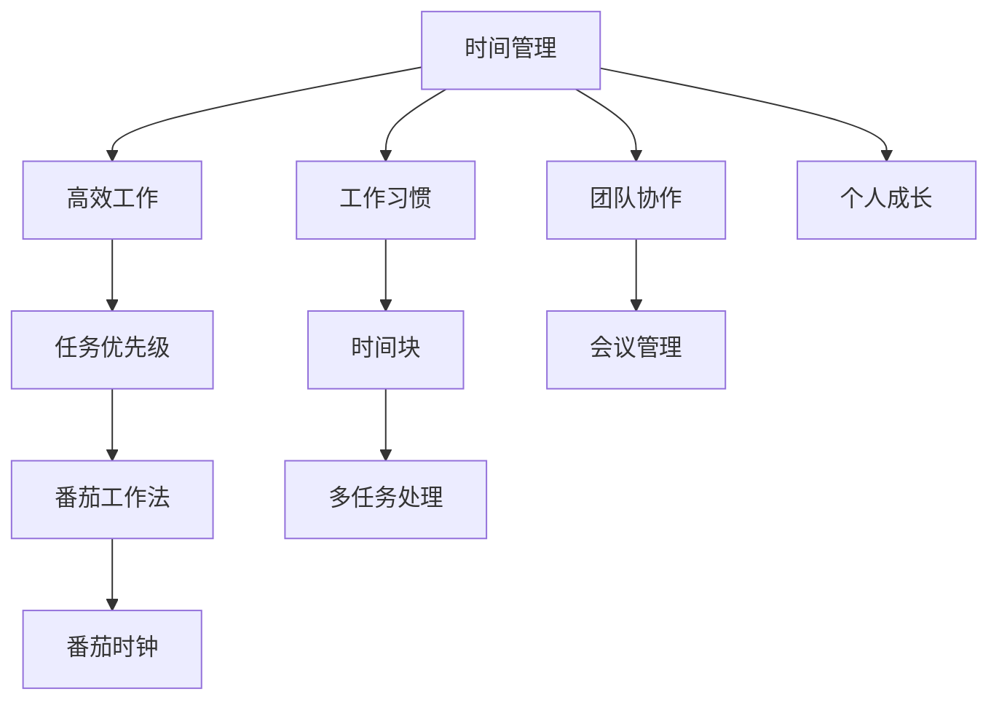

                 

# 程序员的时间管理：效率即财富

> 关键词：时间管理, 高效工作, 任务优先级, 番茄工作法, 番茄时钟, 工作习惯, 时间块, 多任务处理, 团队协作, 会议管理, 个人成长

## 1. 背景介绍

### 1.1 问题由来
在现代信息技术高速发展的今天，程序员已经成为社会各行各业不可或缺的重要力量。然而，面对日益繁重的工作压力，如何在有限的时间内最大化工作效益，成为了许多程序员亟需解决的问题。如何高效管理时间，提升个人和团队的效率，成为了IT行业关注的热点话题。

### 1.2 问题核心关键点
程序员的时间管理问题本质上是如何在时间资源有限的情况下，合理安排工作和休息，优化个人和团队的效率。通过科学的时间管理，不仅可以提高工作效率，还能更好地保持身心健康，提升工作满意度。

### 1.3 问题研究意义
时间管理对于提升程序员的个人和团队效率具有重要意义：

1. **提升工作效率**：合理的时间管理能够帮助程序员在相同的时间内完成更多的工作，减少时间浪费。
2. **改善工作质量**：有效的时间管理可以确保程序员在精力充沛的情况下工作，提高工作质量。
3. **减轻压力**：合理安排工作与休息时间，可以减轻工作压力，避免职业倦怠。
4. **促进个人成长**：有效的时间管理有助于程序员专注于长期目标，如学习新技能、提升技术水平等。
5. **增强团队协作**：良好的时间管理可以帮助团队成员之间更好地协作，提高整体效率。

## 2. 核心概念与联系

### 2.1 核心概念概述

为更好地理解程序员的时间管理方法，本节将介绍几个关键概念及其联系：

- **时间管理**：指通过科学的方法，合理安排时间，最大化工作效益的过程。
- **高效工作**：指在限定时间内完成更多任务，保持高效率的工作状态。
- **任务优先级**：根据任务的紧急程度和重要性，确定优先处理的任务序列。
- **番茄工作法**：一种时间管理技术，通过设定番茄时钟，将工作时间划分为若干25分钟的番茄时间块，每个番茄时间块之间休息5分钟。
- **番茄时钟**：辅助实施番茄工作法的计时工具。
- **工作习惯**：通过长期坚持高效工作方法，形成良好的工作习惯。
- **时间块**：将一天的时间划分为多个时间块，每个时间块专注于特定任务，确保任务集中完成。
- **多任务处理**：同时进行多项任务，通过任务切换提高效率。
- **团队协作**：多个程序员协同工作，合理分配时间，最大化团队效率。
- **会议管理**：通过科学安排会议时间，减少会议对工作时间的占用。
- **个人成长**：通过有效管理时间，投入更多时间学习新技能和知识，实现个人职业发展。

这些核心概念之间通过时间这一要素相互联系，形成一个系统的框架，指导程序员合理分配时间，提升工作效率和质量。

### 2.2 核心概念原理和架构的 Mermaid 流程图



这个流程图展示了时间管理及其相关概念之间的逻辑关系：

1. 时间管理是基础，高效工作是目标。
2. 任务优先级帮助识别哪些任务应首先完成。
3. 番茄工作法通过分段工作，提高专注度。
4. 番茄时钟是工具，辅助番茄工作法实施。
5. 工作习惯和任务块确保专注和集中。
6. 多任务处理通过切换任务提升效率。
7. 团队协作和会议管理优化团队时间。
8. 个人成长通过有效的时间管理，实现自我提升。

这些概念共同构成了程序员时间管理的核心框架，帮助程序员在时间资源有限的情况下，最大化提升工作效率和个人发展。

## 3. 核心算法原理 & 具体操作步骤

### 3.1 算法原理概述

程序员的时间管理方法可以概括为：通过合理安排时间块，合理分配优先级，利用番茄工作法等高效工具，最大化完成工作任务，同时保持身心健康，实现个人和团队的高效协作。

### 3.2 算法步骤详解

基于上述核心概念，程序员的时间管理可以具体分为以下几个步骤：

1. **确定任务优先级**：列出所有待完成的任务，根据紧急程度和重要性，确定优先级。
2. **制定时间块计划**：将一天的时间划分为多个时间块，每个时间块专注于特定任务。
3. **实施番茄工作法**：每个时间块内使用番茄工作法，设定25分钟工作时间，5分钟休息时间，交替进行。
4. **监控和调整**：通过番茄时钟记录工作时间，及时调整时间块计划，优化工作流程。
5. **团队协作管理**：在团队协作中，合理安排会议时间，确保团队高效运作。
6. **个人成长规划**：将学习时间纳入时间块计划，确保有足够时间投入个人成长。

### 3.3 算法优缺点

时间管理方法的优势在于：

1. **提升效率**：通过合理安排时间块和任务优先级，可以最大化完成工作任务。
2. **保持专注**：番茄工作法通过分段工作和休息，提高工作专注度。
3. **减少压力**：合理分配时间，避免过度劳累，减轻工作压力。
4. **促进协作**：科学管理会议时间，优化团队协作效率。
5. **实现成长**：确保有足够时间投入学习，实现个人职业发展。

其缺点主要在于：

1. **过度依赖工具**：依赖番茄时钟等工具，可能影响工作效率。
2. **灵活性不足**：固定的时间块计划可能无法应对突发情况。
3. **心理负担**：过于严格的计划可能导致心理压力。
4. **个人差异**：不同人适合的时间管理方法可能不同，需要不断调整。

### 3.4 算法应用领域

时间管理方法适用于所有需要安排时间、提升工作效率的领域，包括但不限于软件开发、项目管理、数据分析、设计开发等。

## 4. 数学模型和公式 & 详细讲解 & 举例说明

### 4.1 数学模型构建

设一天有 $T$ 个时间块，每个时间块长度为 $t$ 分钟，任务数为 $N$，任务优先级为 $p_i \in [0,1], i=1,\ldots,N$。时间管理的目标是最大化完成任务数量 $N_{total}$，同时保持工作质量和休息时间。

### 4.2 公式推导过程

根据任务优先级和每个时间块的工作效率，可以建立如下优化模型：

$$
\max N_{total} = \sum_{i=1}^N p_i
$$

约束条件包括：
1. 每个时间块工作时间不超过 $t$ 分钟：
$$
\sum_{i=1}^N p_i \leq T \times t
$$
2. 每个任务时间块不超过1个：
$$
p_i \leq 1, i=1,\ldots,N
$$

### 4.3 案例分析与讲解

假设一天有8小时工作时间，共16个时间块，每个时间块25分钟，有5个任务优先级分别为0.8、0.7、0.6、0.5、0.4。

根据约束条件，可以建立线性规划模型，求解最优的任务分配。

$$
\max N_{total} = 0.8 + 0.7 + 0.6 + 0.5 + 0.4
$$

$$
0.8 + 0.7 + 0.6 + 0.5 + 0.4 \leq 16 \times 25
$$

$$
0.8 \leq 1, 0.7 \leq 1, 0.6 \leq 1, 0.5 \leq 1, 0.4 \leq 1
$$

通过求解线性规划，可以得到最优的任务分配方案，确保高效完成任务。

## 5. 项目实践：代码实例和详细解释说明

### 5.1 开发环境搭建

1. **安装PyCharm**：作为主要的IDE，PyCharm支持Python开发，并提供丰富的插件和工具。
2. **安装必要插件**：安装番茄时钟插件、项目管理插件等，辅助时间管理。
3. **配置开发环境**：设置开发环境，配置Python版本、虚拟环境等。

### 5.2 源代码详细实现

以下是使用Python和PyCharm实现时间管理的代码示例：

```python
from tkinter import *
from tkinter import ttk
from functools import partial

# 定义番茄工作时间和休息时间
TOMATO_TIME = 25
SHORT_BREAK = 5
LONG_BREAK = 15

class PomodoroApp:
    def __init__(self, master):
        self.master = master
        self.window.title("番茄时钟")
        self.window.geometry("400x400")

        # 创建界面组件
        self.start_button = ttk.Button(self.window, text="Start", command=self.start)
        self.stop_button = ttk.Button(self.window, text="Stop", command=self.stop)
        self.reset_button = ttk.Button(self.window, text="Reset", command=self.reset)
        self.timer_text = ttk.Label(self.window, text="00:00")

        # 布局组件
        self.start_button.pack()
        self.stop_button.pack()
        self.reset_button.pack()
        self.timer_text.pack()

    def start(self):
        self.timer = self.master.after(TOMATO_TIME * 1000, self.work)
        self.timer_text["text"] = "00:00"

    def stop(self):
        if self.timer:
            self.master.after_cancel(self.timer)
            self.timer_text["text"] = "00:00"

    def reset(self):
        if self.timer:
            self.master.after_cancel(self.timer)
            self.timer_text["text"] = "00:00"

    def work(self):
        self.timer = self.master.after(TOMATO_TIME * 1000, self.work)
        self.timer_text["text"] = str(TOMATO_TIME // 60) + ":" + str(TOMATO_TIME % 60)

# 创建应用程序
root = Tk()
app = PomodoroApp(root)
root.mainloop()
```

**代码解读与分析**：

1. **创建番茄时钟窗口**：使用Tkinter库创建番茄时钟窗口，包含开始、停止、重置按钮和计时器显示。
2. **定义工作时间和休息时间**：设置番茄工作时间和休息时间。
3. **实现番茄工作流程**：当点击“Start”按钮时，启动计时器，每25分钟更新一次计时器显示，每5分钟更新一次休息时间。
4. **实现停止和重置功能**：点击“Stop”和“Reset”按钮，停止计时器并重置显示。

### 5.3 运行结果展示

运行上述代码，将弹出番茄时钟窗口，通过点击“Start”按钮开始计时。每25分钟，计时器显示将更新，提示休息。点击“Stop”按钮可以停止计时器，点击“Reset”按钮重置计时器。

## 6. 实际应用场景

### 6.1 开发项目管理

在开发项目中，合理分配时间块和任务优先级，可以显著提高工作效率。例如，可以将项目分解为多个小任务，每个任务设定优先级，通过番茄工作法，每个时间块专注于特定任务，确保项目按时完成。

### 6.2 团队协作管理

在团队协作中，科学安排会议时间，确保会议高效进行。例如，每周固定时间安排团队讨论，每个会议设定明确的议程，使用番茄时钟控制会议时间，确保讨论高效。

### 6.3 日常工作管理

在日常工作中，合理分配时间块和任务优先级，可以有效管理个人时间。例如，将一天时间划分为若干时间块，每个时间块专注于特定任务，避免任务堆积。

### 6.4 未来应用展望

未来，随着技术的进步和工具的完善，时间管理方法将更加科学和智能化。例如，智能助理可以自动优化时间块计划，根据个人习惯和任务优先级，推荐最佳工作策略。

## 7. 工具和资源推荐

### 7.1 学习资源推荐

1. **《高效能人士的七个习惯》**：史蒂芬·柯维的经典时间管理书籍，帮助读者建立高效能的生活习惯。
2. **《深度工作》**：卡尔·纽波特的畅销书，介绍了如何通过深度工作提高工作效率。
3. **《时间管理》在线课程**：各大在线教育平台提供的相关课程，如Coursera、Udemy等。
4. **《番茄工作法图解》**：弗朗西斯科·西里洛的经典著作，详细介绍了番茄工作法的应用。
5. **《精益开发》**：埃里克·里斯的书籍，介绍了精益开发方法，提升软件开发效率。

### 7.2 开发工具推荐

1. **PyCharm**：强大的Python IDE，支持时间管理插件，帮助程序员管理开发任务。
2. **Jira**：项目管理工具，帮助团队分配任务和跟踪进度。
3. **Trello**：任务管理工具，通过看板形式管理任务，直观清晰。
4. **Slack**：团队协作工具，实时沟通和协作，优化会议管理。
5. **Google Calendar**：时间管理工具，支持事件提醒和时间块规划。

### 7.3 相关论文推荐

1. **“The Pomodoro Technique”**：弗朗西斯科·西里洛的论文，详细介绍了番茄工作法的原理和应用。
2. **“The Eisenhower Matrix: The Ultimate Time Management Tool”**：布莱恩·特雷西的博客文章，介绍了时间管理四象限法。
3. **“Time Management for Engineers”**：Tomas Holme的博客文章，介绍了程序员的时间管理技巧。
4. **“Deep Work: Rules for Focused Success in a Distracted World”**：卡尔·纽波特的书籍，深入探讨了深度工作的重要性。
5. **“Lean Development: Developing and Shaping High-Quality Software in the Face of Adversity”**：艾里克·里斯的书籍，介绍了精益开发方法。

## 8. 总结：未来发展趋势与挑战

### 8.1 总结

本文系统介绍了程序员的时间管理方法，通过科学的时间块分配和任务优先级设定，结合番茄工作法等高效工具，帮助程序员提升工作效率和质量。通过对这些方法的学习和实践，程序员可以在有限的时间内最大化完成任务，同时保持身心健康和职业发展。

### 8.2 未来发展趋势

未来，时间管理方法将呈现以下几个发展趋势：

1. **智能化**：随着人工智能技术的发展，智能助理和自动化工具将帮助程序员更好地规划和管理时间。
2. **个性化**：不同程序员适合的时间管理方法可能不同，未来时间管理工具将更加个性化，根据个人习惯和工作节奏，推荐最佳策略。
3. **多维度优化**：时间管理将结合健康管理、职业发展等多维度因素，提供全方位的优化方案。
4. **跨平台应用**：时间管理工具将支持多平台应用，实现无缝协作。
5. **科学验证**：未来时间管理方法将通过更多的科学研究，提供科学的理论支撑。

### 8.3 面临的挑战

尽管时间管理方法已广泛应用于各行各业，但仍面临一些挑战：

1. **工具依赖性**：过度依赖工具可能影响工作效率，需要找到合适的平衡点。
2. **个性化需求**：不同人的时间管理需求不同，需要不断调整优化。
3. **灵活性不足**：固定的时间块计划可能无法应对突发情况。
4. **心理负担**：过于严格的计划可能导致心理压力。
5. **技术壁垒**：新工具的引入可能带来技术壁垒和学习成本。

### 8.4 研究展望

未来时间管理研究需要在以下几个方面进行深入探索：

1. **结合心理学研究**：时间管理方法需要结合心理学研究成果，帮助程序员更好地理解和管理时间。
2. **数据驱动优化**：通过数据分析，优化时间管理策略，提升工作效率和质量。
3. **跨学科融合**：时间管理方法需要与其他学科如健康管理、经济学等相结合，提供全方位的优化方案。
4. **自动化与个性化**：开发自动化时间管理工具，结合个性化需求，提供更加智能化的时间管理服务。
5. **长期效果评估**：评估时间管理方法对程序员工作效率、职业发展和生活质量的影响，提供科学依据。

通过不断探索和实践，时间管理方法将为程序员提供更加科学、高效的工作方式，推动IT行业的持续发展。

## 9. 附录：常见问题与解答

**Q1：如何使用番茄工作法提升工作效率？**

A: 番茄工作法通过将工作时间分段，每25分钟工作后休息5分钟，帮助提升工作效率。具体步骤如下：
1. 选择待完成的任务。
2. 设定番茄时钟，开始工作。
3. 工作25分钟后，停止并休息5分钟。
4. 每4个番茄时间块后，进行长休息15分钟。
5. 记录完成的任务数量和质量。

**Q2：如何设置任务优先级？**

A: 任务优先级可以根据紧急程度和重要性进行设定。具体步骤如下：
1. 列出所有待完成的任务。
2. 根据任务截止时间和任务的重要性，设定优先级。
3. 优先完成高优先级任务。
4. 定期回顾和调整任务优先级。

**Q3：如何选择合适的开发工具？**

A: 选择合适的开发工具需要考虑以下几个因素：
1. 功能和界面：选择功能齐全、界面友好的工具。
2. 易用性：选择易于上手和使用的工具。
3. 兼容性：选择支持多种平台和操作系统的工具。
4. 社区支持：选择有活跃社区和丰富资源的工具。

**Q4：时间管理工具有哪些推荐？**

A: 以下是几款推荐的时间管理工具：
1. **PyCharm**：强大的Python IDE，支持时间管理插件。
2. **Jira**：项目管理工具，帮助团队分配任务和跟踪进度。
3. **Trello**：任务管理工具，通过看板形式管理任务。
4. **Slack**：团队协作工具，实时沟通和协作。
5. **Google Calendar**：时间管理工具，支持事件提醒和时间块规划。

**Q5：如何应对时间管理的挑战？**

A: 应对时间管理挑战需要采取以下策略：
1. 合理设定期望，避免过高的压力。
2. 灵活调整时间块计划，应对突发情况。
3. 定期反思和调整时间管理策略。
4. 结合心理辅导和健康管理，减轻心理负担。
5. 不断学习和实践，找到适合自己的时间管理方法。

通过不断探索和实践，程序员可以更好地掌握时间管理方法，提升工作效率和质量，实现个人和团队的高效协作。

---

作者：禅与计算机程序设计艺术 / Zen and the Art of Computer Programming

