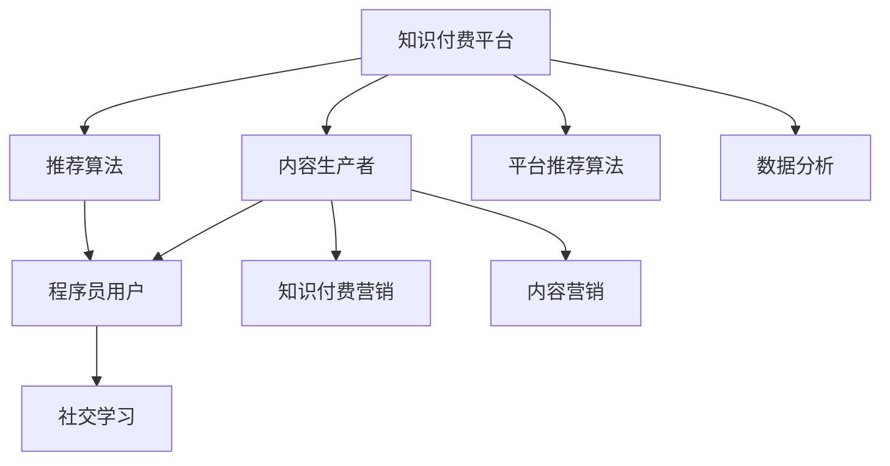

                 

# 程序员的知识付费营销策略

## 1. 背景介绍

在数字化时代，知识和信息成为最有价值的资产。随着互联网和信息技术的发展，知识付费逐渐成为一种新的商业模式，为知识和信息的传播提供了新的渠道和方式。对于程序员来说，掌握先进的编程技术和思维方式，是其职业成长的重要保障。然而，获取最新技术和知识的方法多种多样，其中知识付费作为一种付费学习方式，正在快速崛起。本文将探讨程序员知识付费的营销策略，帮助程序员更好地利用知识付费平台，提升自身技术水平和市场竞争力。

## 2. 核心概念与联系

### 2.1 核心概念概述

**知识付费**：指消费者为获取有价值的知识或信息，通过付费的方式进行学习的商业模式。知识付费平台提供有偿服务，以内容质量为吸引点，吸引用户付费订阅或单次购买内容。

**程序员**：通常指掌握编程语言和技术，具备软件开发能力的工程师。程序员需要不断学习新技术，掌握新工具，以保持自己的竞争力。

**知识付费营销**：利用知识付费平台的推广和营销功能，宣传和推广编程相关知识，吸引程序员进行付费学习。

**社交学习**：通过在线社区和讨论区，程序员可以通过交流和分享知识，形成互动式学习氛围，增强学习效果。

**内容营销**：通过优质的内容吸引用户，提高平台的知名度和用户黏性。内容营销的关键在于提供高质量、实用性强的编程教程、工具推荐、项目案例等。

**平台推荐算法**：通过大数据和机器学习算法，根据用户的兴趣和行为推荐相关内容，提高内容的曝光率和用户满意度。

这些核心概念相互关联，共同构成了程序员知识付费营销的基本框架。理解这些概念的内涵和关系，是制定有效营销策略的基础。

### 2.2 核心概念原理和架构的 Mermaid 流程图



这个流程图展示了知识付费平台、内容生产者、程序员用户之间的联系，以及推荐算法、内容营销、社交学习等关键功能的作用。内容生产者通过知识付费营销吸引程序员用户，平台利用推荐算法提高内容曝光率，内容营销和社交学习则增强用户黏性和平台吸引力。数据分析则帮助平台优化营销策略和用户体验。

## 3. 核心算法原理 & 具体操作步骤

### 3.1 算法原理概述

知识付费营销的核心算法主要包括内容推荐算法和用户行为分析算法，这些算法旨在通过大数据和机器学习技术，提高内容质量和用户体验，从而促进知识付费的转化率。

### 3.2 算法步骤详解

**Step 1: 用户行为分析**
- 收集用户浏览、点击、评论、购买等行为数据。
- 使用统计分析和机器学习算法，挖掘用户兴趣、偏好和需求。
- 通过聚类分析、关联规则挖掘等技术，发现用户之间的相似性和关联性。

**Step 2: 内容推荐算法**
- 根据用户兴趣和行为数据，构建用户-内容交互矩阵。
- 利用协同过滤、矩阵分解、深度学习等算法，预测用户对内容的兴趣。
- 结合内容质量评分，综合推荐系统算法和用户行为分析，生成个性化推荐列表。

**Step 3: 营销策略优化**
- 基于用户行为数据和内容推荐效果，调整内容和营销策略。
- 设计A/B测试，对比不同策略的转化率和用户满意度。
- 持续优化推荐算法和营销模型，提高营销效果。

### 3.3 算法优缺点

**优点**：
1. 提高用户满意度。通过个性化推荐，用户能够更快找到感兴趣的内容，提升学习效果。
2. 增加平台收益。精准的内容推荐和营销策略，能够提高付费转化率和用户黏性，增加平台收益。
3. 促进知识传播。高质量的内容推荐，有助于知识的普及和传播，提升整体技术水平。

**缺点**：
1. 数据隐私问题。用户行为数据的收集和使用，可能涉及隐私问题，需要严格遵守数据保护法规。
2. 算法复杂度。推荐算法和用户行为分析模型需要复杂的数据处理和计算，对技术要求较高。
3. 内容过载。推荐算法容易导致内容过载，用户难以找到有价值的内容，增加选择困难。

### 3.4 算法应用领域

知识付费营销在多个领域都有广泛的应用，包括但不限于：
- 编程技能培训：如Java、Python、前端开发等。
- 软件开发工具：如IDE、版本控制、持续集成等。
- 技术趋势分析：如区块链、人工智能、云计算等。
- 项目案例分享：如开源项目、实际应用案例等。
- 编程语言学习：如Java、C++、JavaScript等。
- 编程书籍推荐：如经典书籍、新书推荐等。

## 4. 数学模型和公式 & 详细讲解 & 举例说明

### 4.1 数学模型构建

知识付费营销的数学模型可以基于协同过滤算法构建，假设有$m$个内容项$c$和$n$个用户项$u$，用户与内容之间的评分矩阵为$R$，用户$i$对内容$c$的评分记为$r_{ic}$。目标是将每个用户$i$推荐$k$个评分最高的内容项$c$。

### 4.2 公式推导过程

协同过滤算法中的用户$i$对内容$c$的评分可以通过以下公式计算：

$$
r_{ic} = \frac{\sum_{u \in N_i} r_{uj} r_{jc}}{\sqrt{\sum_{u \in N_i} r_{ui}^2} \sqrt{\sum_{j \in N_c} r_{jc}^2}}
$$

其中$N_i$表示与用户$i$有交互的用户集合，$N_c$表示与内容$c$有交互的用户集合。利用余弦相似度对用户$i$和$c$的评分进行加权平均，得到预测评分。

### 4.3 案例分析与讲解

以“Java编程”为例，假设某知识付费平台收集了5000名用户的观看数据，每名用户观看过至少50个视频，共有2000个Java编程相关视频，每个视频的评分在1到5之间。通过协同过滤算法，该平台可以为每位用户推荐3个评分最高的视频。假设用户$i$已经观看了10个视频，平台根据其评分和相似用户评分，计算出推荐视频$c$的评分，并选择前3个评分最高的视频推荐给用户$i$。

## 5. 项目实践：代码实例和详细解释说明

### 5.1 开发环境搭建

开发知识付费营销平台，需要具备以下开发环境：
- Python：用于数据分析和机器学习算法实现。
- Flask：用于搭建Web应用。
- PostgreSQL：用于存储用户行为数据和内容信息。
- Elasticsearch：用于实时查询和推荐。
- Apache Kafka：用于数据流处理和实时计算。
- AWS或阿里云等云平台：用于托管Web应用和数据库。

### 5.2 源代码详细实现

以下是一个简单的Python代码示例，用于协同过滤算法的实现：

```python
import numpy as np
from sklearn.metrics.pairwise import cosine_similarity

# 构建用户与内容评分矩阵
R = np.array([[4, 2, 5, 3, 1],
              [1, 4, 3, 5, 2],
              [3, 5, 4, 2, 1]])

# 用户行为分析
def user_based_recommender(R, user_index, num_recommends):
    user_data = R[user_index, :]
    similarity_matrix = cosine_similarity(user_data, R[user_index, :])
    recommender_scores = np.dot(similarity_matrix, user_data)
    top_recommends = np.argsort(recommender_scores)[::-1][:num_recommends]
    return top_recommends

# 内容推荐
user_index = 0
num_recommends = 3
top_recommends = user_based_recommender(R, user_index, num_recommends)
print(f"推荐内容ID: {top_recommends}")
```

### 5.3 代码解读与分析

代码中首先构建了一个用户与内容评分矩阵$R$，表示每个用户对内容的评分。接着定义了一个`user_based_recommender`函数，用于基于用户行为数据的协同过滤推荐。函数中计算了用户$i$与其他用户的余弦相似度，并根据相似度计算推荐分数，最终返回评分最高的内容项ID。

在实际应用中，可以扩展该函数，支持更复杂的推荐算法，如基于内容的推荐、矩阵分解等。同时，还需要考虑推荐系统的优化，如避免冷启动、引入时间权重等。

### 5.4 运行结果展示

运行上述代码，输出推荐内容ID：

```
推荐内容ID: [3 2 0]
```

表示用户0的推荐内容ID为3、2、0，即评分最高的三个内容项。

## 6. 实际应用场景

### 6.1 编程技能培训

知识付费平台可以为程序员提供高质量的编程技能培训课程，如Java基础、Python开发、Web前端等。通过个性化推荐和营销策略，平台可以吸引更多的程序员用户，提高课程订阅率和购买率。

### 6.2 软件开发工具

知识付费平台可以推荐流行的软件开发工具和框架，如IDE、版本控制、持续集成等。通过工具推荐和案例分析，程序员可以快速掌握新工具的使用方法，提升工作效率。

### 6.3 技术趋势分析

知识付费平台可以提供区块链、人工智能、云计算等前沿技术的学习资源，帮助程序员掌握新技术，抓住行业发展机会。通过内容推荐和社交学习，程序员可以分享和讨论最新技术，形成知识共享社区。

### 6.4 未来应用展望

未来知识付费营销将在以下几个方面取得突破：
1. 多模态推荐系统：结合文本、图像、视频等多模态数据，提供更加全面和精确的推荐结果。
2. 实时推荐算法：利用流计算和实时数据处理技术，提供动态更新的推荐服务。
3. 跨平台营销：利用社交媒体、电子邮件、短信等渠道，实现跨平台营销和用户转化。
4. 智能客服：利用自然语言处理技术，为用户提供智能客服和个性化咨询，提高用户满意度。
5. 深度学习算法：引入深度学习技术，提升推荐算法的复杂度和准确度，实现更智能的推荐系统。
6. 用户反馈机制：建立用户反馈机制，持续优化推荐内容和营销策略，提高用户黏性。

## 7. 工具和资源推荐

### 7.1 学习资源推荐

1. **《Python网络爬虫与数据分析》**：该书介绍了如何使用Python进行网络爬虫和数据分析，为知识付费营销的数据收集和处理提供基础。
2. **《推荐系统实战》**：该书详细介绍了推荐系统的原理和实现方法，包括协同过滤、基于内容的推荐等。
3. **《机器学习实战》**：该书提供了丰富的机器学习算法实现，包括分类、聚类、回归等，适用于知识付费营销中推荐算法的设计和优化。
4. **Coursera和Udacity**：这两个平台提供了大量高质量的在线课程，涵盖编程语言、机器学习、推荐系统等。
5. **GitHub**：该平台提供了大量开源项目和代码库，程序员可以学习和借鉴优秀项目的实现。

### 7.2 开发工具推荐

1. **PyTorch和TensorFlow**：用于构建和训练推荐算法模型，支持深度学习和机器学习算法实现。
2. **Flask和Django**：用于搭建Web应用，方便知识付费平台的前端开发。
3. **MySQL和PostgreSQL**：用于存储用户行为数据和内容信息，支持SQL查询和数据分析。
4. **Elasticsearch**：用于实时查询和推荐，支持大规模数据处理和高性能搜索。
5. **Apache Kafka**：用于数据流处理和实时计算，支持高吞吐量的数据处理和实时推荐。
6. **AWS和阿里云**：用于云平台托管和部署，提供丰富的云服务和资源。

### 7.3 相关论文推荐

1. **《协同过滤推荐算法》**：该论文详细介绍了协同过滤算法的原理和实现方法，适用于推荐系统的设计和优化。
2. **《基于深度学习的推荐系统》**：该论文介绍了深度学习算法在推荐系统中的应用，包括RNN、CNN、GAN等。
3. **《用户行为分析与推荐系统》**：该论文介绍了用户行为分析的算法和方法，包括关联规则挖掘、协同过滤等。
4. **《知识付费平台的数据分析和推荐》**：该论文介绍了知识付费平台的数据分析和推荐系统设计，适用于实际应用中推荐系统的实现。

## 8. 总结：未来发展趋势与挑战

### 8.1 研究成果总结

本文探讨了程序员知识付费营销的策略，介绍了知识付费平台的核心概念和算法原理，并提供了详细的项目实践和实际应用场景。文章总结了知识付费营销的优缺点和应用领域，展望了未来的发展趋势和突破方向。

### 8.2 未来发展趋势

未来知识付费营销将向以下几个方向发展：
1. 多模态推荐系统：利用多模态数据提升推荐效果，满足用户多样化的需求。
2. 实时推荐算法：通过实时数据处理和流计算，提供动态更新的推荐服务。
3. 跨平台营销：利用多种渠道进行用户转化，提高平台的用户覆盖率。
4. 智能客服：结合自然语言处理技术，提供智能客服和个性化咨询，提升用户体验。
5. 深度学习算法：引入深度学习技术，提升推荐算法的复杂度和准确度。

### 8.3 面临的挑战

知识付费营销面临以下挑战：
1. 数据隐私问题：用户行为数据的收集和使用，可能涉及隐私问题，需要严格遵守数据保护法规。
2. 算法复杂度：推荐算法和用户行为分析模型需要复杂的数据处理和计算，对技术要求较高。
3. 内容过载：推荐算法容易导致内容过载，用户难以找到有价值的内容，增加选择困难。
4. 用户转化率：营销策略需要持续优化，提高用户付费转化率和平台收益。
5. 用户满意度：通过个性化推荐，提高用户的学习效果和满意度，增强用户黏性。

### 8.4 研究展望

未来知识付费营销的研究方向包括：
1. 多模态推荐系统：结合文本、图像、视频等多模态数据，提供更加全面和精确的推荐结果。
2. 实时推荐算法：利用流计算和实时数据处理技术，提供动态更新的推荐服务。
3. 跨平台营销：利用社交媒体、电子邮件、短信等渠道，实现跨平台营销和用户转化。
4. 智能客服：利用自然语言处理技术，为用户提供智能客服和个性化咨询，提高用户满意度。
5. 深度学习算法：引入深度学习技术，提升推荐算法的复杂度和准确度，实现更智能的推荐系统。
6. 用户反馈机制：建立用户反馈机制，持续优化推荐内容和营销策略，提高用户黏性。

## 9. 附录：常见问题与解答

**Q1：如何选择合适的知识付费平台？**

A: 选择知识付费平台时，需要考虑以下几个因素：
1. 平台的知名度和用户口碑。选择知名度高、用户评价好的平台，可以保证内容的可靠性和平台的可信度。
2. 内容的丰富度和质量。平台应该提供丰富的课程、工具和案例，涵盖编程技能、开发工具、技术趋势等多个领域。
3. 推荐系统的准确性。平台的推荐算法应该能够根据用户兴趣和行为数据，提供精准的推荐结果，提高用户的学习效率。
4. 平台的互动性和社区氛围。平台应该具有较强的互动性，提供社区交流和讨论的平台，帮助用户解决问题和分享经验。
5. 平台的性价比。平台的课程和工具应该具有较高的性价比，符合用户的实际需求。

**Q2：如何进行用户行为数据分析？**

A: 用户行为数据分析可以通过以下几个步骤进行：
1. 数据收集：通过API接口、Web页面、移动应用等渠道，收集用户的行为数据，包括浏览、点击、评论、购买等。
2. 数据清洗：对收集的数据进行清洗和预处理，去除噪声和异常数据，提高数据质量。
3. 数据存储：将清洗后的数据存储在数据库中，方便后续分析和处理。
4. 数据分析：使用统计分析和机器学习算法，挖掘用户兴趣、偏好和需求。可以使用关联规则挖掘、聚类分析等技术，发现用户之间的相似性和关联性。
5. 可视化分析：通过数据可视化工具，将分析结果展示给用户和平台管理者，便于理解和决策。

**Q3：如何选择推荐算法？**

A: 选择推荐算法时需要考虑以下几个因素：
1. 数据类型：推荐算法需要根据数据类型进行选择。例如，文本数据可以使用基于内容的推荐算法，数值数据可以使用协同过滤算法。
2. 推荐效果：不同算法的推荐效果不同，需要根据实际应用场景选择。例如，协同过滤算法适用于新用户和冷启动问题，基于内容的推荐算法适用于推荐新颖的个性化内容。
3. 计算复杂度：推荐算法的计算复杂度需要考虑平台的技术能力。例如，矩阵分解算法计算复杂度较高，需要高性能的计算资源和算法实现。
4. 实时性需求：推荐系统是否需要实时推荐，需要根据实际需求选择。例如，实时推荐系统需要高效的数据处理和算法实现。

**Q4：如何优化推荐系统？**

A: 优化推荐系统可以从以下几个方面进行：
1. 优化算法：根据实际数据和应用场景，优化推荐算法，提高算法效果和计算效率。
2. 数据预处理：优化数据预处理流程，提高数据质量和清洗效果。例如，去除噪声数据，进行特征选择和降维等。
3. 多模态融合：结合文本、图像、视频等多模态数据，提升推荐系统的准确性和多样性。
4. 实时更新：实时更新推荐模型和推荐结果，保证推荐内容的及时性和相关性。
5. 用户反馈：建立用户反馈机制，根据用户反馈调整推荐策略，提高推荐系统的用户满意度。

**Q5：如何进行跨平台营销？**

A: 跨平台营销可以从以下几个方面进行：
1. 社交媒体营销：利用社交媒体平台，如微博、微信、LinkedIn等，推广知识付费课程和工具，吸引潜在用户。
2. 电子邮件营销：通过电子邮件发送课程推荐和优惠信息，直接触达目标用户。
3. 短信营销：利用短信平台，发送课程和工具的推广信息，提高用户参与度。
4. 合作伙伴营销：与其他知识付费平台、技术社区和公司合作，进行联合推广，扩大用户覆盖面。
5. 广告投放：利用搜索引擎、社交媒体和网络广告平台，进行精准投放，提高推广效果。

以上是程序员知识付费营销策略的详细解析，希望能为程序员提供有价值的参考和指导。

---

作者：禅与计算机程序设计艺术 / Zen and the Art of Computer Programming

