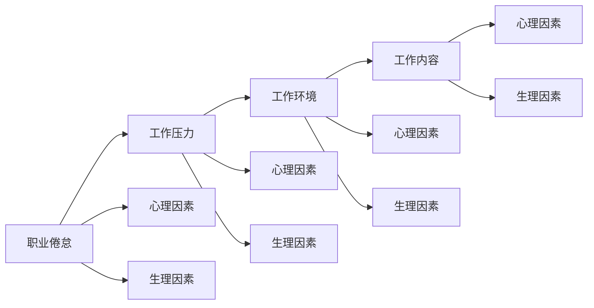

                 

# 程序员的职业倦怠：预防与应对

在当今快速发展的IT行业，程序员的日常工作往往是紧张而高压的，长时间面对代码、调试问题、撰写文档以及与同事和客户进行沟通，使得他们在工作中容易产生职业倦怠。职业倦怠不仅影响程序员的心理健康，还会降低其工作效率和创新能力。为了帮助程序员更好地应对职业倦怠，本文将详细探讨其成因、预防措施及应对方法。

## 1. 背景介绍

### 1.1 问题由来

随着信息技术的飞速发展，程序员在软件开发过程中面临的压力越来越大。他们不仅需要不断学习新技术，还需要快速应对项目需求变更，持续交付高质量的软件。长时间的高强度工作，使得越来越多的程序员出现了职业倦怠。职业倦怠是指员工在工作中感到过度疲劳、工作失去乐趣和效能下降等状态。这种状态不仅对个人的身心健康造成影响，也会对企业和项目的持续发展带来负面影响。

### 1.2 问题核心关键点

职业倦怠的核心关键点在于：
1. **工作压力**：包括工作量过大、时间紧迫、任务复杂等。
2. **工作环境**：包括工作环境嘈杂、同事关系紧张、工作与生活边界模糊等。
3. **工作内容**：包括缺乏成就感、工作内容单一、缺乏成长机会等。
4. **心理因素**：包括自我期望过高、社交支持不足、个人价值观与工作要求冲突等。
5. **生理因素**：包括长时间坐姿、缺乏运动、不规律作息等。

## 2. 核心概念与联系

### 2.1 核心概念概述

要深入理解职业倦怠，需要掌握以下几个核心概念：

- **职业倦怠**：指长期的工作压力、工作环境和工作内容导致的一种心理和生理上的疲劳状态。
- **工作压力**：指在完成工作时感受到的心理和生理上的压力，包括工作量、时间、复杂性等因素。
- **工作环境**：指工作场所的物理环境和人际关系环境，包括噪音、温度、光线、同事关系等。
- **工作内容**：指工作的性质、任务、成就感等，包括任务是否有趣、是否具有挑战性、是否有助于个人成长。
- **心理因素**：指个人的心理状态，包括期望、价值观、情感支持等。
- **生理因素**：指个人的生理状态，包括睡眠质量、饮食习惯、运动等。

这些概念相互交织，共同构成职业倦怠的成因和影响。

### 2.2 核心概念原理和架构的 Mermaid 流程图



这个流程图展示了职业倦怠形成的主要路径。工作压力、工作环境和工作内容是外因，而心理因素和生理因素是内因。这些因素相互影响，共同导致了职业倦怠的发生。

## 3. 核心算法原理 & 具体操作步骤

### 3.1 算法原理概述

为了预防和应对职业倦怠，我们可以采用基于心理学的干预措施，以及基于技术的解决方案。以下是两种主要算法原理：

- **心理干预算法**：包括放松技巧、认知行为疗法、情绪管理等方法，旨在改变个体对工作压力的认知和反应，增强心理韧性。
- **技术干预算法**：包括时间管理工具、任务管理工具、协作工具等，旨在提高工作效率，减少工作压力。

### 3.2 算法步骤详解

#### 3.2.1 心理干预算法

**步骤一：评估职业倦怠状态**
- 使用职业倦怠量表（如MBI量表）对员工进行职业倦怠评估。
- 通过访谈、问卷调查等方法，了解员工的心理状态和工作体验。

**步骤二：制定个性化干预计划**
- 根据评估结果，制定个性化的干预计划。
- 引入放松技巧，如深呼吸、冥想、瑜伽等。
- 应用认知行为疗法，调整员工的负面思维模式。
- 提供情绪管理培训，教授员工有效的情绪调节策略。

**步骤三：实施干预计划**
- 提供专业心理咨询和支持，帮助员工应对职业倦怠。
- 定期跟踪员工的干预效果，调整干预计划。

#### 3.2.2 技术干预算法

**步骤一：使用时间管理工具**
- 引入时间管理工具，如Todoist、Trello等，帮助员工合理规划工作任务。
- 使用时间追踪工具，如RescueTime、Toggl等，了解员工的时间分配情况。

**步骤二：使用任务管理工具**
- 引入任务管理工具，如Asana、Jira等，帮助员工明确任务优先级，高效完成任务。
- 使用自动化工具，如Zapier、IFTTT等，减少重复性任务，提高工作效率。

**步骤三：使用协作工具**
- 引入协作工具，如Slack、Microsoft Teams等，增强团队沟通和协作。
- 使用版本控制工具，如Git、SVN等，提高代码协作效率。

### 3.3 算法优缺点

#### 3.3.1 心理干预算法的优缺点

**优点**：
- 针对性强：根据员工的具体情况制定个性化干预计划。
- 效果持久：通过改变员工的认知和行为模式，提高心理韧性，效果持久。

**缺点**：
- 耗时长：需要较长时间进行心理咨询和支持。
- 依赖性强：需要专业心理咨询师的支持。

#### 3.3.2 技术干预算法的优缺点

**优点**：
- 见效快：通过优化工作流程、提高工具使用效率，快速改善工作状态。
- 成本低：技术工具的使用成本相对较低。

**缺点**：
- 效果有限：技术工具无法解决所有职业倦怠问题。
- 需要自我驱动：员工需要主动使用技术工具，才能发挥其效果。

### 3.4 算法应用领域

基于职业倦怠的心理干预和基于技术的干预方法，在多个领域都有广泛应用。以下是几个典型应用场景：

1. **企业内部**：
   - 为员工提供心理健康支持和职业发展规划。
   - 使用技术工具提高工作效率，优化工作流程。

2. **软件开发团队**：
   - 通过时间管理工具帮助开发者合理规划任务。
   - 引入协作工具增强团队沟通和协作。

3. **远程工作环境**：
   - 使用技术工具帮助远程工作者高效完成任务，保持工作与生活平衡。
   - 提供心理支持，帮助员工应对远程工作的挑战。

4. **教育培训**：
   - 在职业培训课程中加入心理干预和放松技巧的培训。
   - 提供时间管理、任务管理和协作工具的培训。

## 4. 数学模型和公式 & 详细讲解 & 举例说明

### 4.1 数学模型构建

职业倦怠的评估可以通过心理量表进行，如MBI量表。该量表包括情感耗竭（Emotional Exhaustion, EE）、去人性化（Depersonalization, DP）和成就感（Personal Accomplishment, PA）三个维度，各维度得分越高，表示职业倦怠程度越高。

MBI量表的数学模型如下：

$$
\text{MBI Score} = \alpha \times EE + \beta \times DP + \gamma \times PA
$$

其中，$\alpha$, $\beta$, $\gamma$ 为各维度的权重系数。

### 4.2 公式推导过程

**步骤一：设计量表题目**
- 根据职业倦怠的三个维度，设计相应的问题。

**步骤二：收集数据**
- 通过问卷调查或访谈，收集员工的数据。

**步骤三：数据预处理**
- 对数据进行去噪、归一化等预处理操作。

**步骤四：计算得分**
- 根据各维度的得分计算MBI总得分。

### 4.3 案例分析与讲解

假设某软件开发团队成员的MBI量表得分如下：
- EE = 80
- DP = 70
- PA = 60

代入公式，得到MBI总得分：

$$
\text{MBI Score} = 1 \times 80 + 0.5 \times 70 + 0.3 \times 60 = 171.5
$$

根据MBI得分，该成员的职业倦怠程度较高，需要进一步干预。

## 5. 项目实践：代码实例和详细解释说明

### 5.1 开发环境搭建

在进行职业倦怠干预系统的开发前，我们需要准备好开发环境。以下是使用Python进行Flask开发的环境配置流程：

1. 安装Anaconda：从官网下载并安装Anaconda，用于创建独立的Python环境。

2. 创建并激活虚拟环境：
```bash
conda create -n pyenv python=3.8 
conda activate pyenv
```

3. 安装Flask：
```bash
pip install Flask
```

4. 安装SQLite：
```bash
pip install sqlite3
```

5. 安装PyTorch：
```bash
pip install torch torchvision torchaudio
```

完成上述步骤后，即可在`pyenv`环境中开始开发。

### 5.2 源代码详细实现

以下是使用Flask和SQLite实现职业倦怠评估和干预系统的Python代码实现：

```python
from flask import Flask, request, jsonify
from flask_sqlalchemy import SQLAlchemy
from flask_marshmallow import Marshmallow
import pandas as pd
import numpy as np

app = Flask(__name__)
app.config['SQLALCHEMY_DATABASE_URI'] = 'sqlite:////tmp/test.db'
app.config['SQLALCHEMY_TRACK_MODIFICATIONS'] = False

db = SQLAlchemy(app)
ma = Marshmallow(app)

class Employee(db.Model):
    id = db.Column(db.Integer, primary_key=True)
    name = db.Column(db.String(50))
    age = db.Column(db.Integer)
    gender = db.Column(db.String(10))
    mbi_score = db.Column(db.Float)

    def __init__(self, name, age, gender, mbi_score):
        self.name = name
        self.age = age
        self.gender = gender
        self.mbi_score = mbi_score

class EmployeeSchema(ma.SQLAlchemyAutoSchema):
    class Meta:
        model = Employee
        fields = ('id', 'name', 'age', 'gender', 'mbi_score')

employee_schema = EmployeeSchema()
employees_schema = EmployeeSchema(many=True)

@app.route('/add_employee', methods=['POST'])
def add_employee():
    name = request.json['name']
    age = request.json['age']
    gender = request.json['gender']
    mbi_score = request.json['mbi_score']
    
    employee = Employee(name, age, gender, mbi_score)
    db.session.add(employee)
    db.session.commit()
    
    return employee_schema.jsonify(employee), 201

@app.route('/get_all_employees', methods=['GET'])
def get_all_employees():
    employees = Employee.query.all()
    result = employees_schema.dump(employees)
    return jsonify(result)

@app.route('/get_employee_by_id', methods=['GET'])
def get_employee_by_id():
    id = request.args.get('id')
    employee = Employee.query.get(id)
    return employee_schema.jsonify(employee)

if __name__ == '__main__':
    app.run(debug=True)
```

以上代码实现了一个简单的职业倦怠评估和干预系统，包括员工信息录入和查询功能。使用Flask框架和SQLite数据库，可以轻松搭建起一个Web应用程序。

### 5.3 代码解读与分析

让我们再详细解读一下关键代码的实现细节：

**Employee类**：
- 定义了一个Employee模型，包括员工的基本信息（姓名、年龄、性别）和MBI得分。
- 使用Flask-SQLAlchemy扩展，将模型与数据库进行关联。

**EmployeeSchema类**：
- 使用Flask-Marshmallow扩展，将模型映射为JSON格式。
- 使用SQLAlchemyAutoSchema自动生成Schema。

**add_employee函数**：
- 处理员工信息录入请求，将数据保存到数据库。
- 返回新创建的员工数据，并设置状态码201。

**get_all_employees函数**：
- 查询所有员工数据，并使用EmployeeSchema进行序列化，返回JSON格式。

**get_employee_by_id函数**：
- 根据ID查询单个员工数据，并使用EmployeeSchema进行序列化，返回JSON格式。

通过这个简单的系统，可以轻松收集员工的数据，进行职业倦怠评估和干预。开发者可以在此基础上，进一步扩展功能，如数据分析、干预计划生成等。

## 6. 实际应用场景

### 6.1 企业管理

在大公司中，管理层可以通过职业倦怠评估系统，了解员工的心理健康状况，制定相应的干预措施。例如，针对高得分员工，可以提供心理健康培训、调整工作任务等。通过系统化的干预，可以提高员工的工作满意度和绩效，降低离职率。

### 6.2 远程办公

在远程办公环境下，员工面临着孤独感、沟通障碍等问题。通过职业倦怠评估系统，管理者可以及时发现员工的倦怠状态，提供远程支持和心理干预。同时，使用协作工具和任务管理工具，帮助员工保持高效工作，提高远程办公的满意度。

### 6.3 教育培训

在教育培训领域，学校和培训机构可以评估学生的学习状态，提供针对性的辅导和支持。通过职业倦怠评估系统，教师可以了解学生的心理压力和需求，调整教学方法和策略，提升教学效果。

### 6.4 未来应用展望

随着技术的进步，职业倦怠评估和干预系统将变得更加智能化和个性化。未来的发展趋势可能包括：

1. **人工智能辅助**：引入自然语言处理和机器学习技术，自动分析员工的情绪和行为，提供个性化的干预建议。
2. **多模态数据融合**：结合生理数据（如心率、血压）和心理数据，进行综合评估，提供更全面的干预措施。
3. **远程协作支持**：增强远程工作的协作和沟通功能，提高远程办公的体验和效率。
4. **实时监测**：实时监测员工的状态和行为，提供即时的干预和支持。
5. **大数据分析**：通过大数据分析，发现职业倦怠的规律和趋势，提供更具针对性的干预策略。

这些趋势将进一步提升职业倦怠评估和干预系统的效能，帮助企业和员工更好地应对职业倦怠，提升工作效率和幸福感。

## 7. 工具和资源推荐

### 7.1 学习资源推荐

为了帮助开发者系统掌握职业倦怠的评估和干预技术，这里推荐一些优质的学习资源：

1. **《职业倦怠心理学》**：一本系统介绍职业倦怠的心理学原理和干预方法的书籍，适合入门和深入学习。
2. **《时间管理：掌控你的工作和生活》**：一本经典的时间管理书籍，提供了许多实用的时间管理技巧和工具。
3. **《认知行为疗法：基本原理和干预》**：一本关于认知行为疗法的经典教材，介绍了认知行为疗法的原理和应用。
4. **Coursera职业倦怠课程**：Coursera提供的职业倦怠课程，涵盖职业倦怠的评估、干预和支持等内容，适合在线学习。
5. **LinkedIn Learning**：LinkedIn Learning提供的职业倦怠管理课程，介绍了许多实用的职业倦怠管理和干预技巧。

通过对这些资源的学习实践，相信你一定能够系统掌握职业倦怠的评估和干预方法，并将其应用到实际工作中。

### 7.2 开发工具推荐

高效的开发离不开优秀的工具支持。以下是几款用于职业倦怠评估和干预开发的常用工具：

1. **Flask**：Python编写的轻量级Web框架，适合快速搭建Web应用。
2. **SQLite**：轻量级的关系型数据库，适合小型项目和测试环境。
3. **PyTorch**：Python编写的深度学习框架，适合开发和训练AI模型。
4. **TensorFlow**：Google开发的深度学习框架，适合大规模工程应用。
5. **Keras**：高层次的深度学习API，适合快速搭建和训练神经网络模型。

合理利用这些工具，可以显著提升职业倦怠评估和干预系统的开发效率，加快创新迭代的步伐。

### 7.3 相关论文推荐

职业倦怠评估和干预技术的研究源于学界的持续探索。以下是几篇奠基性的相关论文，推荐阅读：

1. **《职业倦怠量表编制和问卷化研究》**：介绍MBI量表的编制和应用方法，适合职业倦怠评估。
2. **《认知行为疗法在职业倦怠干预中的应用》**：研究认知行为疗法在职业倦怠干预中的效果和机制。
3. **《基于时间管理的时间优化方法》**：介绍时间管理技巧和方法，适合提高工作效率。
4. **《工作与生活平衡对职业倦怠的影响》**：研究工作和生活的平衡对职业倦怠的影响，适合制定干预策略。

这些论文代表了大数据评估和干预技术的发展脉络。通过学习这些前沿成果，可以帮助研究者把握学科前进方向，激发更多的创新灵感。

## 8. 总结：未来发展趋势与挑战

### 8.1 总结

本文对职业倦怠的评估和干预方法进行了全面系统的介绍。首先阐述了职业倦怠的成因和影响，明确了预防和应对职业倦怠的重要意义。其次，从心理干预和基于技术的干预两个方面，详细讲解了职业倦怠的预防措施和应对方法。通过实际案例和代码实现，展示了这些方法的可行性和实用性。

通过本文的系统梳理，可以看到，职业倦怠评估和干预方法正在成为企业人力资源管理的重要工具，极大地提升员工的工作满意度和幸福感。未来，伴随技术的不断发展，这些方法将变得更加智能化和个性化，进一步提升职业倦怠管理的效能。

### 8.2 未来发展趋势

展望未来，职业倦怠评估和干预技术将呈现以下几个发展趋势：

1. **智能化和自动化**：引入人工智能和大数据技术，实现智能化的职业倦怠评估和干预。
2. **个性化和定制化**：根据员工的个人特征和需求，提供个性化的干预方案。
3. **跨平台和跨设备**：开发跨平台和跨设备的应用，方便员工随时随地进行职业倦怠评估和干预。
4. **实时监测和反馈**：通过实时监测员工的状态和行为，提供即时的干预和支持。
5. **多学科融合**：将心理学、社会学、医学等多学科知识融入职业倦怠管理中，提供更全面的干预策略。

这些趋势凸显了职业倦怠评估和干预技术的广阔前景，将进一步提升企业和员工的幸福感，提高工作效率和生活质量。

### 8.3 面临的挑战

尽管职业倦怠评估和干预技术已经取得了一定的进展，但在迈向更加智能化和个性化的过程中，仍面临诸多挑战：

1. **数据隐私和安全**：职业倦怠评估需要收集和分析员工的个人信息，如何在保护隐私的前提下进行数据处理，是一个重要问题。
2. **干预效果评估**：如何科学评估干预效果，确保干预措施的有效性，是一个关键挑战。
3. **多学科整合**：职业倦怠管理涉及心理学、社会学、医学等多个学科，如何有效整合这些知识，是一个复杂问题。
4. **技术实现难度**：实现智能化的职业倦怠评估和干预，需要复杂的技术架构和算法支持，技术实现难度较高。
5. **员工接受度**：员工对新工具和新技术的接受度，也是一个重要因素。

这些挑战需要研究者和技术开发者共同努力，不断探索和创新，才能实现职业倦怠评估和干预技术的进一步突破。

### 8.4 研究展望

为了应对职业倦怠评估和干预技术面临的挑战，未来的研究方向包括：

1. **隐私保护技术**：研究隐私保护技术，确保员工数据的安全和隐私。
2. **干预效果评估方法**：开发科学的干预效果评估方法，确保干预措施的有效性。
3. **多学科整合**：将心理学、社会学、医学等多学科知识整合到职业倦怠管理中，提供更全面的干预策略。
4. **技术架构优化**：优化职业倦怠评估和干预系统的技术架构，降低技术实现的难度。
5. **用户接受度提升**：通过用户参与和反馈，提升员工对新工具和新技术的接受度。

这些研究方向将进一步推动职业倦怠评估和干预技术的成熟，帮助企业和员工更好地应对职业倦怠，提升工作满意度和幸福感。

## 9. 附录：常见问题与解答

**Q1：职业倦怠评估如何确保数据隐私和安全？**

A: 在职业倦怠评估中，保护员工数据隐私和安全是至关重要的。以下是几种常用的隐私保护技术：

1. **数据匿名化**：对员工数据进行去标识化处理，保护员工隐私。
2. **数据加密**：使用加密技术保护数据在传输和存储过程中的安全性。
3. **访问控制**：严格控制数据的访问权限，确保只有授权人员可以访问员工数据。
4. **匿名化查询**：使用匿名化查询技术，保护员工数据隐私。
5. **隐私保护算法**：引入隐私保护算法，如差分隐私、同态加密等，保护员工数据隐私。

**Q2：如何科学评估职业倦怠干预效果？**

A: 科学评估职业倦怠干预效果，需要设定明确的评估指标，并采用科学的评估方法。以下是几种常用的评估方法：

1. **前后对比法**：通过干预前后的数据对比，评估干预效果。
2. **标准评估工具**：使用职业倦怠量表等标准评估工具，进行科学的评估。
3. **随机对照试验**：通过随机对照试验，评估干预措施的效果。
4. **自我报告法**：通过员工的自我报告，了解其对干预措施的感受和反馈。
5. **行为观察法**：通过观察员工的行为变化，评估干预效果。

**Q3：职业倦怠评估和干预系统应该如何设计？**

A: 职业倦怠评估和干预系统的设计需要考虑以下几个方面：

1. **数据收集**：设计数据收集模块，方便员工输入和管理数据。
2. **数据存储**：设计数据存储模块，确保数据的安全和可访问性。
3. **数据分析**：设计数据分析模块，对员工数据进行科学分析和评估。
4. **干预措施**：设计干预措施模块，提供个性化的干预方案。
5. **用户界面**：设计用户界面，方便员工进行操作和使用。

**Q4：如何提升员工对职业倦怠评估和干预系统的接受度？**

A: 提升员工对职业倦怠评估和干预系统的接受度，需要从以下几个方面入手：

1. **培训和宣传**：对员工进行培训和宣传，介绍系统的功能和好处。
2. **反馈机制**：建立反馈机制，收集员工的意见和建议，不断改进系统。
3. **用户体验**：优化系统的用户体验，使其易于使用和操作。
4. **心理支持**：提供心理支持和干预服务，帮助员工克服心理障碍。
5. **文化建设**：建设良好的企业文化，增强员工的信任和认同感。

**Q5：职业倦怠评估和干预技术有哪些应用场景？**

A: 职业倦怠评估和干预技术在多个领域都有广泛应用，以下是几个典型应用场景：

1. **企业管理**：帮助管理层了解员工的心理健康状况，制定相应的干预措施。
2. **远程办公**：帮助远程工作者提高工作效率，保持工作与生活平衡。
3. **教育培训**：帮助学校和培训机构评估学生的学习状态，提供针对性的辅导和支持。
4. **人力资源管理**：帮助人力资源部门进行员工招聘、绩效评估和职业发展管理。
5. **职业发展规划**：帮助员工制定职业发展规划，提升职业发展路径。

---

作者：禅与计算机程序设计艺术 / Zen and the Art of Computer Programming

