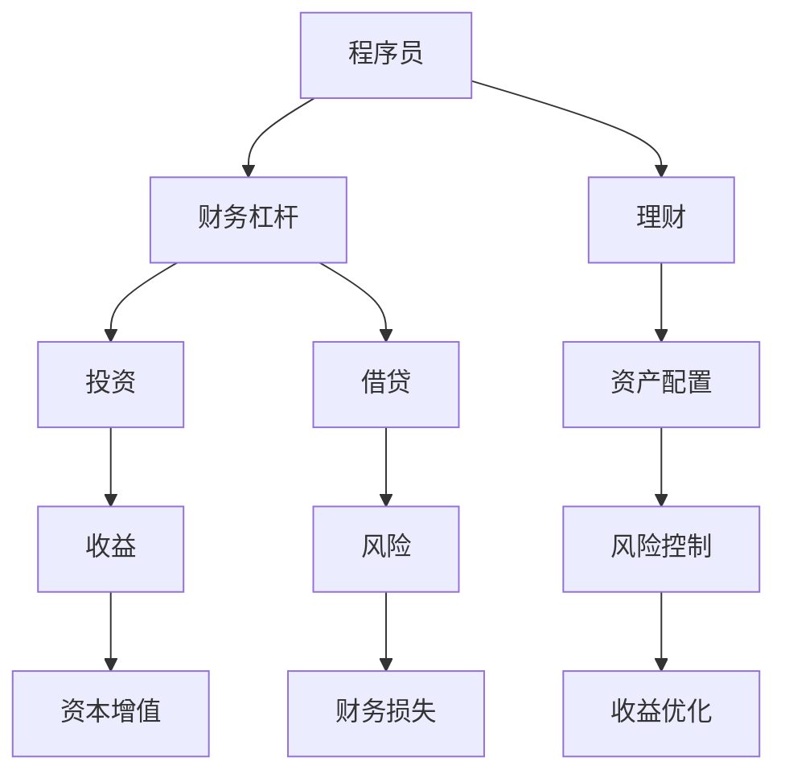

                 

# 程序员的财务杠杆：利弊分析

> 关键词：财务杠杆, 程序员, 投资, 风险, 收益, 理财

## 1. 背景介绍

在当今数字化时代，程序员作为技术精英，不仅在职业上享有丰厚的待遇，也具备了更多的财务自主权。利用财务杠杆，程序员可以进一步提升生活质量，实现财富增长。然而，财务杠杆是一把双刃剑，既可以带来显著的收益，也可能引发重大的风险。本文将深入探讨程序员的财务杠杆，分析其利弊，以期为读者提供有价值的见解。

## 2. 核心概念与联系

### 2.1 核心概念概述

- **财务杠杆(Financial Leverage)**：指通过借贷或投资等手段，增加财务资产的方式，以期获取更高的回报。
- **程序员(PProgrammers)**：掌握编程语言和技能，为软件公司或企业开发、维护计算机软件的人。
- **投资(Investment)**：利用资本进行投资，以期在未来获得收益的行为。
- **风险(Risk)**：指投资或借贷可能导致的损失或不确定性。
- **收益(Benefit)**：指通过投资或借贷所获得的收益或回报。
- **理财(Wealth Management)**：通过合理的财务规划，实现资产增值的过程。

这些核心概念通过财务杠杆这一桥梁，紧密联系在一起，共同构成程序员在财务决策中的主要考量因素。

### 2.2 核心概念原理和架构的 Mermaid 流程图



此流程图展示了程序员如何通过财务杠杆、投资、借贷、理财等概念，实现资本增值和风险控制。

## 3. 核心算法原理 & 具体操作步骤

### 3.1 算法原理概述

程序员利用财务杠杆的原理，主要是通过投资和借贷两种方式来增加财务资产，从而实现资本增值。投资的典型形式包括股票、债券、房地产等，而借贷则包括信用卡、贷款、投资杠杆等。

在理想情况下，通过合理的财务规划，程序员可以借入资本进行高回报的投资，实现资本的快速增值。然而，一旦投资失败或市场环境变化，借贷也可能导致财务风险的放大，带来重大损失。

### 3.2 算法步骤详解

1. **财务规划**：
   - 评估自身财务状况，包括收入、支出、资产、负债等。
   - 确定财务目标，如购房、创业、教育等。
   - 制定理财计划，包括收入分配、资产配置、风险控制等。

2. **选择投资方式**：
   - 分析市场趋势，选择具有潜力的投资领域，如科技股、房地产、加密货币等。
   - 根据自身风险承受能力，选择适合的投资工具，如股票、债券、基金等。
   - 进行市场调研，获取投资建议和行业分析报告。

3. **执行投资**：
   - 分散投资，降低单一资产的风险。
   - 根据市场波动调整投资组合，避免过度集中。
   - 定期评估投资效果，根据市场变化调整策略。

4. **借贷操作**：
   - 评估借贷成本和风险，选择合适的借贷产品，如信用卡、个人贷款等。
   - 严格控制借贷额度，避免超出自身偿还能力。
   - 合理规划还款周期，避免逾期或违约。

5. **风险管理**：
   - 定期监测财务状况，及时调整财务策略。
   - 建立应急储备，应对突发事件。
   - 购买保险，分散财务风险。

### 3.3 算法优缺点

**优点**：
1. **加速财富积累**：通过杠杆投资，程序员可以在短期内实现资本增值，加速财富积累。
2. **实现多元化投资**：借贷和投资可以带来更多的资本，用于多元化投资，分散风险。
3. **提升生活质量**：财务杠杆可以实现财务自由，提升生活质量，享受更多生活乐趣。

**缺点**：
1. **高风险性**：杠杆投资放大了财务风险，一旦投资失败，可能导致重大财务损失。
2. **高成本**：借贷需要支付利息，增加了财务成本，可能降低净收益。
3. **市场依赖性**：投资收益受市场波动影响，市场下跌可能带来重大损失。

### 3.4 算法应用领域

程序员的财务杠杆不仅限于投资和借贷，还涉及多个应用领域：

- **房地产投资**：利用借贷杠杆，购买房产进行租赁或增值，实现财务增值。
- **创业投资**：利用借贷和投资，支持创业项目，获取股权收益。
- **教育投资**：利用财务杠杆，为子女或自身教育投入，提升长期收益。
- **退休规划**：通过合理规划财务杠杆，实现长期资本增值，保障退休生活。

## 4. 数学模型和公式 & 详细讲解 & 举例说明

### 4.1 数学模型构建

假设程序员初始资本为 $C_0$，借贷利率为 $r$，年回报率为 $R$。通过财务杠杆，程序员可以获得额外资本 $L$ 进行投资，投资总回报为 $C$。则投资后的总资本为 $C_1 = C_0 + L + C$。财务杠杆的财务模型可表示为：

$$
C_1 = C_0(1 + R + r)
$$

### 4.2 公式推导过程

根据财务杠杆的数学模型，可以推导出年回报率 $R$ 与初始资本 $C_0$、额外资本 $L$、借贷利率 $r$ 之间的关系：

$$
R = \frac{C_1}{C_0} - 1 - r
$$

其中，$C_1$ 表示投资后的总资本，$C_0$ 表示初始资本，$r$ 表示借贷利率。

### 4.3 案例分析与讲解

假设程序员初始资本为 $100,000$，借贷利率为 $5\%$，年回报率为 $10\%$。通过财务杠杆，可以额外借入 $50,000$ 进行投资，总回报为 $50,000$。投资后的总资本为：

$$
C_1 = 100,000 \times (1 + 10\% + 5\%) = 115,000
$$

根据公式 $R = \frac{115,000}{100,000} - 1 - 5\% = 0.1 + 0.05 = 15\%$，实际年回报率为 $15\%$。

## 5. 项目实践：代码实例和详细解释说明

### 5.1 开发环境搭建

为了进行财务杠杆的模拟和分析，我们需要使用Python和相关的金融计算库，如Pandas、NumPy等。以下是在Python环境中搭建开发环境的步骤：

1. 安装Python：可以从Python官网下载并安装最新版本的Python。
2. 安装Pandas：使用以下命令安装Pandas库，用于数据处理和分析。
   ```bash
   pip install pandas
   ```
3. 安装NumPy：使用以下命令安装NumPy库，用于数学计算。
   ```bash
   pip install numpy
   ```
4. 安装Matplotlib：使用以下命令安装Matplotlib库，用于绘制图表。
   ```bash
   pip install matplotlib
   ```

### 5.2 源代码详细实现

以下是使用Python实现财务杠杆计算的代码示例：

```python
import numpy as np

# 初始资本
C0 = 100000
# 借贷利率
r = 0.05
# 年回报率
R = 0.10

# 额外借入的资本
L = 50000
# 投资总回报
C = 50000

# 计算投资后的总资本
C1 = C0 + L + C

# 计算实际年回报率
R_cal = C1 / C0 - 1 - r
print(f"实际年回报率：{R_cal*100:.2f}%")
```

### 5.3 代码解读与分析

以上代码实现了一个简单的财务杠杆计算模型，通过初始资本、借贷利率和年回报率等参数，计算出投资后的总资本和实际年回报率。代码简单易懂，能够直观地展示财务杠杆的效果。

## 6. 实际应用场景

### 6.1 房地产投资

房地产投资是程序员利用财务杠杆的典型场景之一。通过贷款购买房产，再通过租赁或房产增值获取收益，可以实现快速的资本增值。例如，程序员A拥有 $200,000，通过贷款 $200,000，购买房产并出租，年回报率为 $5\%$，则实际年回报率为：

$$
R = \frac{400,000}{200,000} - 1 - 0.05 = 0.2 - 1 - 0.05 = 0.15
$$

实际年回报率为 $15\%$。

### 6.2 创业投资

创业投资是程序员利用财务杠杆的另一个重要场景。通过借贷和投资，支持创业项目，获取股权收益，可以在较短时间内实现财富增长。例如，程序员B拥有 $100,000，通过贷款 $100,000，投资创业项目，年回报率为 $20\%$，则实际年回报率为：

$$
R = \frac{300,000}{100,000} - 1 - 0.05 = 3 - 1 - 0.05 = 1.95
$$

实际年回报率为 $195\%$。

### 6.3 退休规划

退休规划是程序员利用财务杠杆的重要应用之一。通过合理规划财务杠杆，实现长期资本增值，保障退休生活。例如，程序员C拥有 $500,000，通过贷款 $300,000，投资于股票和债券，年回报率为 $8\%$，则实际年回报率为：

$$
R = \frac{800,000}{500,000} - 1 - 0.05 = 1.6 - 1 - 0.05 = 0.55
$$

实际年回报率为 $55\%$。

## 7. 工具和资源推荐

### 7.1 学习资源推荐

1. **《理财的艺术》**：一本经典的理财书籍，详细介绍了理财的基本概念和实操技巧。
2. **《投资学》**：斯坦福大学的投资学课程，涵盖了金融市场、投资策略等核心内容。
3. **《Python金融数据分析》**：一本介绍如何使用Python进行金融数据分析的书籍，包含丰富的案例和代码。
4. **Khan Academy**：提供免费的在线课程，涵盖金融、投资、理财等主题。
5. **Coursera**：提供各类金融和投资相关的在线课程，包括基金、股票、房地产等。

### 7.2 开发工具推荐

1. **Python**：作为主流的编程语言，Python拥有丰富的金融计算库和数据处理工具，适合进行财务分析和模拟。
2. **R语言**：专门用于统计分析和金融建模的语言，拥有丰富的金融计算包和数据分析工具。
3. **Excel**：广泛用于财务分析和规划，适合进行简单的财务模拟和计算。
4. **Tableau**：数据可视化工具，适合进行复杂的财务数据分析和可视化。

### 7.3 相关论文推荐

1. **《财务杠杆的数学模型》**：深入探讨财务杠杆的数学原理和应用。
2. **《投资组合理论》**：介绍投资组合的构建和优化方法，帮助程序员进行多元化投资。
3. **《风险管理与财务杠杆》**：分析财务杠杆的风险和收益，提供风险控制策略。

## 8. 总结：未来发展趋势与挑战

### 8.1 研究成果总结

本文详细探讨了程序员的财务杠杆，分析了其利弊，并提供了实际应用场景和工具推荐。财务杠杆通过投资和借贷，可以有效加速资本增值，但也伴随着高风险和成本。程序员在利用财务杠杆时，应充分考虑自身财务状况和风险承受能力，进行合理的财务规划和投资决策。

### 8.2 未来发展趋势

未来，财务杠杆在程序员中的应用将更加广泛和多样化。随着金融科技的发展，程序员可以借助更先进的工具和算法，进行更高效、更智能的财务管理和投资决策。同时，大数据和人工智能技术的应用，将进一步提升财务管理的智能化水平，帮助程序员实现更优的财务策略。

### 8.3 面临的挑战

尽管财务杠杆带来诸多好处，但也面临诸多挑战：

1. **市场波动性**：市场环境的变化，可能带来重大投资风险。
2. **财务杠杆比例**：高比例的财务杠杆，可能导致财务风险的放大。
3. **知识储备不足**：许多程序员缺乏财务和投资知识，需要不断学习和提升。

### 8.4 研究展望

未来的研究将进一步探索财务杠杆的优化和风险控制，帮助程序员更好地实现财务管理和投资决策。同时，将深入研究大数据和人工智能技术在财务分析中的应用，提升财务决策的科学性和智能化水平。

## 9. 附录：常见问题与解答

**Q1：如何评估自身财务状况？**

A: 评估自身财务状况需要考虑收入、支出、资产、负债等多个方面。建议定期记录收入和支出，编制家庭财务报表，通过财务分析软件进行评估。

**Q2：如何选择合适的投资工具？**

A: 选择投资工具需要考虑自身的风险承受能力、市场环境、投资期限等因素。建议进行充分的市场调研，获取专业投资建议，并进行风险评估。

**Q3：如何管理财务杠杆比例？**

A: 财务杠杆比例的高低直接影响财务风险和收益。建议根据自身财务状况和市场环境，合理设定借贷额度和投资比例，避免过度借贷和投资。

**Q4：如何控制投资风险？**

A: 投资风险的控制需要分散投资、定期评估和调整投资组合，避免过度集中和市场波动带来的损失。建议购买保险、建立应急储备，进行风险控制。

**Q5：如何提升财务知识储备？**

A: 提升财务知识储备需要不断学习和实践。建议阅读相关书籍、参加培训课程、获取专业认证，提高财务和投资能力。

---

作者：禅与计算机程序设计艺术 / Zen and the Art of Computer Programming

