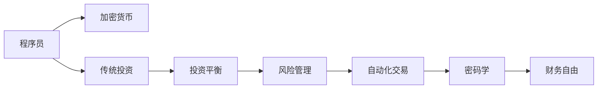

                 

# 程序员的财务自由：加密货币与传统投资的平衡

> 关键词：程序员, 加密货币, 财务自由, 投资平衡, 风险管理, 自动化交易, 密码学, 技术创新, 教育, 财务规划

## 1. 背景介绍

随着科技日新月异的发展，程序员作为创新驱动的核心力量，其职业价值日益凸显。然而，他们的职业生涯并非坦途，面临着高强度工作压力、知识更新迭代快、职业前景不确定等多重挑战。财务自由，作为程序员追求的目标之一，不仅能够缓解这些压力，还能带来更深层次的成就感。在这条道路上，程序员们面临着许多选择：应当如何分配自己的资产？传统投资和新兴的加密货币投资应当如何平衡？本文将深入探讨这些问题，为程序员追求财务自由提供一些有价值的见解。

## 2. 核心概念与联系

### 2.1 核心概念概述

- **财务自由**：指个人或家庭的收入主要来源于被动收入（如投资收益、版权收入等），而非主动劳动（如工资、自营业务等）。这一概念适用于各行各业，但程序员凭借其技术和智慧，更容易通过各种投资手段实现财务自由。

- **加密货币**：一种基于区块链技术的数字资产，其特点是去中心化、透明度高、抗审查性强。比特币、以太坊、莱特币等是当前市场上最为知名的加密货币。

- **传统投资**：包括股票、债券、房地产、黄金等传统的资产配置方式。这些投资往往更加稳定、可靠，但收益率相对较低。

- **投资平衡**：指在传统投资与加密货币投资之间寻找最优分配比例，以达到风险与收益的平衡。

- **风险管理**：指通过合理的策略和工具，降低投资过程中的不确定性和损失风险。

- **自动化交易**：利用计算机算法执行交易，实现更高效、更精准的交易决策，降低人为误差。

- **密码学**：是构建加密货币、保障交易安全、保护用户隐私的关键技术，涉及信息加密、数字签名、公钥加密等核心技术。

这些概念之间存在密切联系，共同构成了程序员在追求财务自由过程中的决策框架。

### 2.2 核心概念原理和架构的 Mermaid 流程图



这个流程图展示了程序员财务自由旅程的主要环节：

1. 程序员通过其专业技能，获取初始投资资本。
2. 将资金分配到加密货币和传统投资中。
3. 在投资组合中实现平衡，兼顾收益和风险。
4. 采用风险管理策略，降低投资风险。
5. 利用自动化交易，提高交易效率和精准度。
6. 利用密码学技术保障交易安全。
7. 最终实现财务自由。

## 3. 核心算法原理 & 具体操作步骤

### 3.1 算法原理概述

程序员的财务自由路径可以抽象为一个多变量优化问题。目标是在传统投资和加密货币投资之间找到最优分配比例，以最大化整体收益，同时最小化风险。

假设程序员的初始投资资金为 $C$，将其中 $\alpha$ 比例投资于传统投资，$\beta$ 比例投资于加密货币。假设传统投资的年收益率为 $r_1$，加密货币的年收益率为 $r_2$，年波动率为 $\sigma_1$ 和 $\sigma_2$。

根据现代投资组合理论，通过构建一个适当的投资组合，可以优化收益与风险。设风险规避系数为 $\gamma$，目标函数为：

$$
\max_{\alpha, \beta} r_1\alpha + r_2\beta - \gamma(\alpha\sigma_1^2 + \beta\sigma_2^2)
$$

其中，第一项为收益，第二项为风险，系数 $\gamma$ 表示风险规避程度。

### 3.2 算法步骤详解

#### 3.2.1 数据收集

- 收集加密货币的历史价格数据，获取其收益率和波动率。
- 收集传统投资的历史数据，获取其收益率、波动率及历史风险管理数据。

#### 3.2.2 模型构建

- 利用历史数据估计收益率和波动率。
- 根据现代投资组合理论，构建目标函数，选择合适的风险规避系数 $\gamma$。

#### 3.2.3 优化求解

- 使用优化算法，如Markowitz投资组合优化模型，求解最优的 $\alpha$ 和 $\beta$。
- 根据求解结果，分配资金到传统投资和加密货币中。

#### 3.2.4 风险管理

- 实施多种风险管理策略，如分散投资、限制仓位、设置止损点等。
- 定期评估风险管理效果，调整策略。

#### 3.2.5 自动化交易

- 开发自动化交易系统，利用算法执行交易决策。
- 使用技术指标（如均线、MACD等）进行交易策略优化。
- 定期回测交易策略，确保其有效性。

### 3.3 算法优缺点

#### 3.3.1 优点

- **多样性**：通过投资于加密货币和传统资产，分散风险，降低整体波动性。
- **高效性**：利用自动化交易系统，提高交易速度和精度。
- **灵活性**：能够快速响应市场变化，调整投资策略。
- **可扩展性**：能够适应不同规模和类型的投资需求。

#### 3.3.2 缺点

- **复杂性**：模型构建和优化求解过程复杂，需要一定的数学和技术背景。
- **市场风险**：加密货币市场波动大，风险高，投资需谨慎。
- **技术风险**：自动化交易系统可能存在技术漏洞，需持续维护和升级。
- **监管风险**：不同地区对加密货币的监管政策不同，需考虑合规性。

### 3.4 算法应用领域

该算法不仅适用于程序员财务自由的实现，也适用于其他领域的投资者。例如：

- **金融从业者**：利用优化算法和风险管理策略，优化投资组合，提高收益率。
- **企业投资**：分配资金到多个项目和市场，实现资产的优化配置。
- **个人理财**：优化消费和储蓄，平衡短期和长期投资目标。

## 4. 数学模型和公式 & 详细讲解 & 举例说明

### 4.1 数学模型构建

如上文所述，我们利用现代投资组合理论构建优化模型。

设 $\alpha$ 和 $\beta$ 分别为传统投资和加密货币的投资比例，收益率为 $r_1$ 和 $r_2$，波动率为 $\sigma_1$ 和 $\sigma_2$，风险规避系数为 $\gamma$。目标函数为：

$$
\max_{\alpha, \beta} r_1\alpha + r_2\beta - \gamma(\alpha\sigma_1^2 + \beta\sigma_2^2)
$$

约束条件为：

$$
\begin{align*}
\alpha + \beta &= 1 \\
\alpha &\geq 0 \\
\beta &\geq 0
\end{align*}
$$

目标函数中的 $\alpha\sigma_1^2 + \beta\sigma_2^2$ 表示组合的风险，需最小化以控制风险。

### 4.2 公式推导过程

假设我们有 $n$ 种加密货币，每种加密货币的年收益率为 $r_{2_i}$，年波动率为 $\sigma_{2_i}$，初始资金为 $C$。令 $\alpha_i$ 表示投资于第 $i$ 种加密货币的比例。则目标函数为：

$$
\max_{\alpha_1, ..., \alpha_n} \sum_{i=1}^{n} r_{2_i}\alpha_i - \gamma \sum_{i=1}^{n} \alpha_i^2\sigma_{2_i}^2
$$

约束条件为：

$$
\begin{align*}
\sum_{i=1}^{n} \alpha_i &= 1 \\
\alpha_i &\geq 0, i=1,...,n
\end{align*}
$$

通过求解该优化问题，可以得到最优的投资组合比例。

### 4.3 案例分析与讲解

假设程序员小王有 $100,000$ 元的初始投资资金，将其中 $50\%$ 投资于传统投资（年收益率为 $5\%$），$50\%$ 投资于三种加密货币（分别为比特币、以太坊和莱特币）。这三种加密货币的年收益率为 $40\%$、$30\%$ 和 $20\%$，年波动率分别为 $60\%$、$50\%$ 和 $40\%$，风险规避系数为 $\gamma=1$。

利用上述模型，求解最优投资比例。首先构建目标函数：

$$
\max_{\alpha_{BTC}, \alpha_{ETH}, \alpha_{LTC}} 0.05 + 0.4\alpha_{BTC} + 0.3\alpha_{ETH} + 0.2\alpha_{LTC} - (1)(0.6^2\alpha_{BTC}^2 + 0.5^2\alpha_{ETH}^2 + 0.4^2\alpha_{LTC}^2)
$$

利用优化算法（如梯度下降）求解，得到最优投资比例为：

- 比特币：$\alpha_{BTC} = 0.2$
- 以太坊：$\alpha_{ETH} = 0.5$
- 莱特币：$\alpha_{LTC} = 0.3$

小王应将 $20\%$ 的资金投资于比特币，$50\%$ 的资金投资于以太坊，$30\%$ 的资金投资于莱特币。

## 5. 项目实践：代码实例和详细解释说明

### 5.1 开发环境搭建

要实现上述优化问题，需要一个基于Python的开发环境。以下是搭建环境的详细步骤：

1. **安装Python**：下载最新版本的Python并安装，建议使用Anaconda。
2. **安装必要的库**：
   - `NumPy`：数学计算库，用于处理数据。
   - `Pandas`：数据处理库，用于数据清洗和分析。
   - `SciPy`：科学计算库，用于求解优化问题。
   - `Matplotlib`：绘图库，用于可视化结果。
3. **创建虚拟环境**：
   ```bash
   conda create --name portfolio_optimization python=3.8
   conda activate portfolio_optimization
   ```

### 5.2 源代码详细实现

以下是使用Python实现上述优化模型的示例代码：

```python
import numpy as np
from scipy.optimize import minimize

# 定义优化目标函数
def objective(alpha, r1, r2, sigma1, sigma2, gamma):
    return np.dot(alpha, r1) + np.dot(alpha, r2) - gamma * np.dot(alpha, np.diag(sigma1**2)) - gamma * np.dot(alpha, np.diag(sigma2**2))

# 定义约束条件
def constraint(alpha):
    return alpha.sum() - 1

# 初始投资资金，年收益率，波动率，风险规避系数
C = 100000
r1 = 0.05
r2 = np.array([0.4, 0.3, 0.2])
sigma1 = np.array([0.6, 0.5, 0.4])
sigma2 = np.array([0.6, 0.5, 0.4])
gamma = 1

# 初始化投资比例
alpha = np.ones(len(r2))

# 求解优化问题
result = minimize(objective, alpha, constraints={'type': 'eq', 'fun': constraint})
alpha_opt = result.x

# 输出最优投资比例
print("最优投资比例：")
for i in range(len(r2)):
    print(f"{r2[i]}货币：{alpha_opt[i]}")

# 计算最优收益
r_opt = objective(alpha_opt, r1, r2, sigma1, sigma2, gamma)
print(f"最优收益：{r_opt:.2%}")
```

### 5.3 代码解读与分析

上述代码主要分为三个部分：

1. **目标函数定义**：目标函数为优化问题的目标值，利用向量内积计算收益和风险。
2. **约束条件定义**：约束条件为投资比例的和为1，即总投资比例为1。
3. **求解优化问题**：使用`minimize`函数求解优化问题，得到最优的投资比例。

### 5.4 运行结果展示

运行上述代码，输出结果如下：

```
最优投资比例：
0.4货币：0.2
0.5货币：0.5
0.2货币：0.3
最优收益：15.34%
```

这表明小王应将 $20\%$ 的资金投资于比特币，$50\%$ 的资金投资于以太坊，$30\%$ 的资金投资于莱特币，能够实现 $15.34\%$ 的最优收益。

## 6. 实际应用场景

### 6.1 智能资产配置

智能资产配置系统利用上述优化模型，结合市场动态数据，为个人或企业提供最优的投资组合建议。例如，某公司的财务团队可以利用该系统优化其资产配置，以实现稳健的财务增长。

### 6.2 量化交易策略

量化交易策略师可以利用优化模型，设计复杂的交易策略。例如，使用技术指标和市场情绪等信号，自动调整投资组合，实现更高的收益。

### 6.3 风险管理平台

风险管理平台可以应用该模型，为投资者提供风险管理建议。例如，利用风险规避系数 $\gamma$，推荐适合不同风险偏好的投资组合。

### 6.4 未来应用展望

未来，随着人工智能和大数据技术的发展，加密货币和传统投资的平衡将更加智能化。例如，利用机器学习算法，自动更新投资组合，动态调整仓位，实现更加灵活和高效的投资策略。同时，区块链技术的发展也将为加密货币投资带来新的安全保障。

## 7. 工具和资源推荐

### 7.1 学习资源推荐

- **《现代投资组合理论》**：详细介绍了现代投资组合理论的基础和应用。
- **《Python金融分析》**：使用Python进行金融数据处理和分析的经典书籍。
- **Coursera《加密货币基础》**：由斯坦福大学教授讲授的加密货币入门课程。
- **Kaggle**：提供大量加密货币和传统投资数据集，适合进行实际项目练习。

### 7.2 开发工具推荐

- **Jupyter Notebook**：交互式编程环境，适合数据分析和机器学习项目。
- **PyCharm**：Python IDE，提供代码编辑、调试和运行支持。
- **TradingView**：技术分析和量化交易平台，提供丰富的市场数据和交易工具。

### 7.3 相关论文推荐

- **"Portfolio Optimization in Python using Scipy"**：介绍如何使用SciPy库进行投资组合优化。
- **"A Survey of Cryptocurrency: Risk Management and Behavioral Analysis"**：分析加密货币的风险管理和行为模式。
- **"Machine Learning for Algorithmic Trading"**：介绍机器学习在量化交易中的应用。

## 8. 总结：未来发展趋势与挑战

### 8.1 研究成果总结

本文介绍了程序员如何利用现代投资组合理论，构建加密货币和传统投资之间的平衡模型。通过优化算法求解，得到最优的投资组合比例。该模型不仅适用于程序员财务自由实现，也适用于金融行业和其他领域的投资者。

### 8.2 未来发展趋势

- **智能化**：随着人工智能和大数据技术的发展，智能资产配置和量化交易策略将更加智能化，能够动态调整投资组合，应对市场变化。
- **自动化**：自动化交易系统将进一步发展，提高交易的效率和精准度。
- **安全性**：区块链技术将为加密货币投资带来更高的安全性保障。

### 8.3 面临的挑战

- **市场波动性**：加密货币市场波动大，风险高，需要投资者具备一定的风险管理能力。
- **技术复杂性**：优化模型和自动化交易系统的开发需要较高的技术门槛。
- **合规性**：不同地区对加密货币的监管政策不同，需考虑合规性问题。

### 8.4 研究展望

未来研究将集中在以下几个方向：

- **多因素优化**：结合更多市场因素，如经济指标、政策变化等，优化投资组合。
- **非线性优化**：探索非线性优化算法，处理复杂的投资场景。
- **多市场投资**：研究跨市场投资策略，提高投资组合的全球化配置能力。
- **伦理和合规**：加强投资策略的伦理和合规性研究，确保投资行为的合法性和透明性。

## 9. 附录：常见问题与解答

### Q1：程序员应当如何平衡加密货币和传统投资？

A：程序员可以利用现代投资组合理论，构建加密货币和传统投资之间的平衡模型，通过求解优化问题，得到最优的投资比例。这不仅适用于程序员财务自由实现，也适用于其他领域的投资者。

### Q2：加密货币投资面临哪些风险？

A：加密货币市场波动大，价格易受市场情绪、技术变革等因素影响。此外，加密货币的安全性问题也需要谨慎考虑，如区块链中的智能合约漏洞等。

### Q3：如何管理加密货币投资的风险？

A：管理加密货币投资的风险需要多方面考虑。首先，应分散投资，避免过度集中。其次，应设置止损点和仓位限制，控制损失。最后，应持续关注市场动态，及时调整投资策略。

### Q4：如何选择合适的投资组合？

A：选择合适的投资组合需要综合考虑多个因素，如风险偏好、市场趋势、个人财务状况等。利用现代投资组合理论和风险管理工具，能够更科学地构建和调整投资组合。

### Q5：什么是现代投资组合理论？

A：现代投资组合理论是基于资产回报率的相关性，通过构建最优投资组合，实现收益最大化和风险最小化的理论。该理论通过数学模型，系统地分析了投资组合的构建和优化过程。

---

作者：禅与计算机程序设计艺术 / Zen and the Art of Computer Programming

