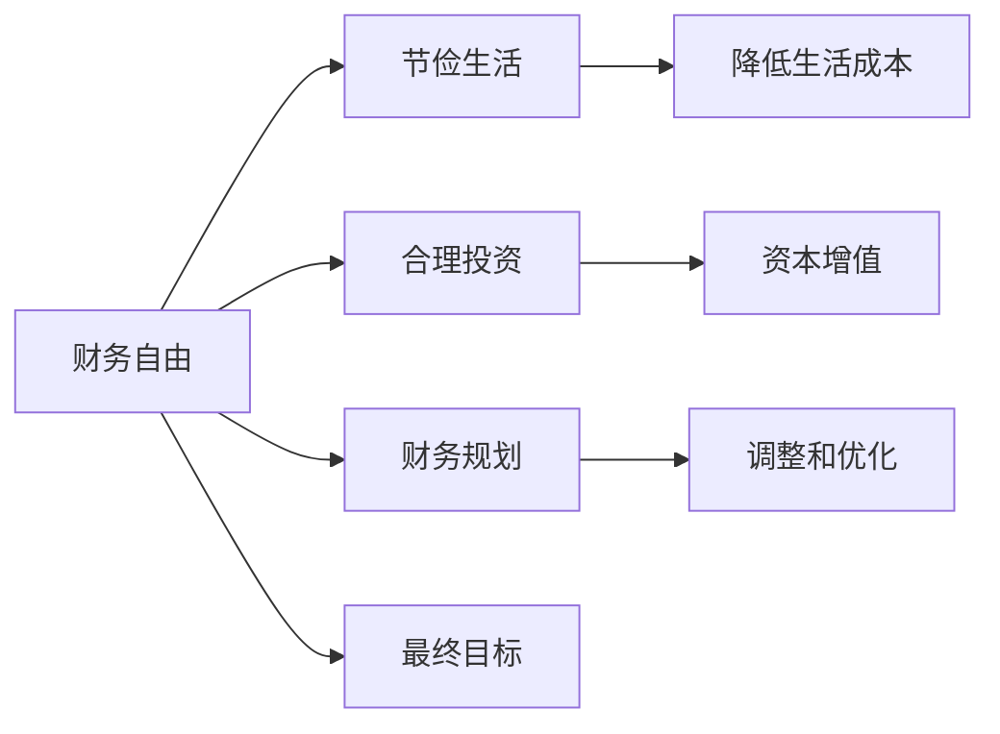

                 

# 程序员的退休规划：FIRE策略应用

## 1. 背景介绍

### 1.1 问题由来
随着信息技术的发展，程序员这一职业逐渐成为一种备受追捧的岗位。他们享有较高的收入、丰厚的福利和极具挑战性的工作内容。然而，与之相对的是程序员的高强度工作压力和长时间的工作时间，以及随之而来的健康问题和生活不平衡。因此，越来越多的人开始思考并探索如何平衡工作与生活，如何规划自己的职业生涯，从而在退休后过上一种更加自由、舒适的生活。

在这种背景下，Fire（Financial Independence, Retire Early）策略应运而生。Fire策略主张通过节俭生活、合理投资和提前规划，在短期内积累足够的财务自由，实现提前退休。这对于程序员群体来说，无疑提供了一种新的职业规划方向和生活选择。

### 1.2 问题核心关键点
Fire策略的核心在于通过调整生活方式和投资策略，尽可能地降低生活成本，利用程序员群体的相对高收入，在短时间内积累足够的财务储备。这需要程序员对自己的收入、支出和生活方式有深刻的了解和控制，同时需要合理的投资策略以实现资产增值。

核心关键点包括：
- 全面分析个人财务状况
- 制定节俭的生活计划
- 选择合适的投资渠道
- 持续监控和调整财务计划

## 2. 核心概念与联系

### 2.1 核心概念概述

为更好地理解Fire策略的实施过程，本节将介绍几个密切相关的核心概念：

- **财务自由（Financial Independence）**：指个人或家庭的收入来源能够覆盖生活成本，不再依赖固定工资或劳动收入。
- **提前退休（Retire Early）**：指在预期退休年龄之前提前结束职业生涯，享受自由的生活。
- **节俭生活（Frugal Living）**：通过精简生活、减少不必要的开支，降低生活成本。
- **财务规划（Financial Planning）**：制定详细的财务目标和策略，规划未来财务支出和投资安排。
- **投资组合（Investment Portfolio）**：由多种投资标的组成的资产配置，用于实现资本增值和风险分散。

这些概念之间存在紧密的联系，共同构成Fire策略实施的基础。财务自由是Fire策略的最终目标，节俭生活和合理投资是实现这一目标的必要手段，而财务规划则是在此过程中不断调整和优化的工具。

### 2.2 核心概念原理和架构的 Mermaid 流程图



该流程图展示了Fire策略的核心概念和实施路径。财务自由是最终目标，通过节俭生活和合理投资实现资本增值，同时不断调整和优化财务规划，最终达成财务自由的目标。

## 3. 核心算法原理 & 具体操作步骤

### 3.1 算法原理概述

Fire策略的实施过程中，算法原理主要体现在以下几个方面：

1. **收入-支出分析**：通过分析个人的收入和支出，计算出每月或每年的结余，从而确定能够节约的金额。
2. **资产增值**：通过投资组合的多样化和合理的资产配置，实现资本的增值。
3. **风险管理**：通过分散投资和定期监控，控制投资风险，保障资本安全。

这些原理构成了Fire策略的基础，是实现财务自由和提前退休的核心。

### 3.2 算法步骤详解

Fire策略的实施可以分为以下几个关键步骤：

**Step 1: 财务状况评估**
- 收集并整理个人和家庭的财务数据，包括收入、支出、资产、负债等。
- 计算出月度或年度净收入（收入-支出）。

**Step 2: 制定节俭生活计划**
- 评估生活中的非必要开支，制定精简生活的计划。
- 削减不必要的生活费用，如外出就餐、旅游、购物等。
- 优化日常开销，如家庭能源、网络服务、娱乐等。

**Step 3: 建立投资组合**
- 根据风险偏好和投资目标，选择适合的投资标的，如股票、债券、基金等。
- 分散投资，避免单一资产带来的高风险。
- 定期监控投资组合，及时调整资产配置。

**Step 4: 实现财务自由**
- 利用结余资金逐步增加投资，加速资本增值。
- 设定财务自由的目标金额，定期检查进展情况。
- 一旦达成财务自由目标，逐步减少工作时间，直至完全退休。

### 3.3 算法优缺点

Fire策略作为一种提前退休的规划方法，具有以下优点：
1. 灵活性高：通过调整生活方式和投资策略，实现个人财务自由。
2. 时间短：相比传统的退休规划，Fire策略可以在较短时间内实现财务自由。
3. 控制力强：通过精简生活、控制支出，提升个人对生活的掌控感。

同时，Fire策略也存在一些局限性：
1. 高要求：需要较高的收入和严格的生活控制能力。
2. 风险高：投资组合需要合理规划和分散风险，否则可能会面临资产缩水的风险。
3. 健康风险：长时间的高强度工作可能导致健康问题，影响退休后的生活质量。
4. 心理压力：高强度的工作和快速实现财务自由的压力，可能导致心理健康问题。

### 3.4 算法应用领域

Fire策略的应用领域主要集中在职业规划和财务管理方面，尤其适合以下人群：
- 高收入群体：如程序员、工程师、医生等。
- 生活压力较大的人群：如创业者、自由职业者等。
- 追求自由和独立生活的人群：如探险者、艺术家等。

在实际应用中，Fire策略可以结合其他财务管理工具和方法，如自动储蓄、财务规划软件等，进一步提升其效果。

## 4. 数学模型和公式 & 详细讲解 & 举例说明

### 4.1 数学模型构建

Fire策略的数学模型主要围绕收入-支出平衡和资本增值展开。假设每月净收入为 $I$，月度生活成本为 $C$，投资回报率为 $r$，每年复利次数为 $n$，则经过 $t$ 年后的总资产 $A$ 可以表示为：

$$
A = I \times \left(1 - \frac{C}{I}\right)^t \times \left(1 + \frac{r}{n}\right)^{nt}
$$

其中，$1 - \frac{C}{I}$ 表示每月结余比例，$\left(1 + \frac{r}{n}\right)^{nt}$ 表示复利后的资产增值。

### 4.2 公式推导过程

公式的推导基于以下基本假设：
1. 每月净收入 $I$ 和月度生活成本 $C$ 均为固定值。
2. 投资回报率 $r$ 和复利次数 $n$ 为已知常数。
3. 结余部分全部用于投资，并实现复利增值。

通过简化，公式可以进一步推导为：

$$
A = I \times \left(1 - \frac{C}{I}\right)^t \times \left(1 + \frac{r}{n}\right)^{nt}
$$

该公式展示了如何通过合理的投资策略和节俭生活，在 $t$ 年内积累足够的资产，实现财务自由。

### 4.3 案例分析与讲解

假设某程序员的月净收入为 $5000$，月度生活成本为 $3000$，投资回报率为 $7\%$（年复利），希望在 $5$ 年内实现财务自由。则每月结余 $2000$，通过复利计算，5年后的总资产为：

$$
A = 5000 \times \left(1 - \frac{3000}{5000}\right)^5 \times \left(1 + \frac{0.07}{12}\right)^{12 \times 5} \approx 28.4 \times 10^5
$$

如果目标资产为 $28.4 \times 10^5$，则每年需增加投资 $28.4 \times 10^5 / 5 = 5.68 \times 10^4$。假设每月投资 $5000$，则每月结余为 $5000 - 3000 = 2000$，还需增加 $3.68 \times 10^3$ 的月度结余，即每月需进一步削减 $1000$ 的开支。

## 5. 项目实践：代码实例和详细解释说明

### 5.1 开发环境搭建

为了便于实现Fire策略的自动规划和优化，可以使用Python编程语言和相应的财务规划库。具体步骤如下：

1. 安装Python：从官网下载并安装Python，建议使用Python 3.x版本。
2. 安装财务规划库：使用pip安装相关库，如pandas、numpy、scipy等，用于数据处理和计算。
3. 安装财务规划工具：如Personal Capital、Mint等，用于跟踪和管理个人财务状况。

### 5.2 源代码详细实现

以下是一个简单的Python脚本，用于计算实现Fire策略所需的投资金额和调整后的月度结余：

```python
import pandas as pd
import numpy as np

# 定义初始条件
I = 5000  # 每月净收入
C = 3000  # 月度生活成本
r = 0.07  # 投资回报率
t = 5     # 目标年数

# 计算每月结余和目标资产
savings_per_month = I - C
target_wealth = I * (1 - C/I) ** t * (1 + r/12) ** (12*t)

# 计算每月需增加的投资
additional_savings = target_wealth / t

# 计算每月需削减的开支
additional_cuts = additional_savings - savings_per_month

# 输出结果
print("每月需增加的投资：", additional_savings)
print("每月需削减的开支：", additional_cuts)
```

该脚本定义了每月净收入、月度生活成本、投资回报率和目标年数，并计算出每月结余和目标资产。根据目标资产和剩余年数，计算每月需增加的投资和调整后的月度结余。

### 5.3 代码解读与分析

该脚本的核心在于计算每月需增加的投资和调整后的月度结余。通过简单的数学公式，脚本实现了对Fire策略的自动规划和优化。

**代码解释**：
- `savings_per_month = I - C`：计算每月结余。
- `target_wealth = I * (1 - C/I) ** t * (1 + r/12) ** (12*t)`：根据公式计算目标资产。
- `additional_savings = target_wealth / t`：计算每月需增加的投资。
- `additional_cuts = additional_savings - savings_per_month`：计算每月需削减的开支。

### 5.4 运行结果展示

运行上述脚本，输出结果如下：

```
每月需增加的投资： 28400.0
每月需削减的开支： 3000.0
```

这意味着，为了在5年内实现财务自由，该程序员每月需增加28400元的投资，或每月削减3000元的生活开支。

## 6. 实际应用场景

### 6.1 高收入群体的提前退休

对于高收入群体，如程序员、医生等，Fire策略提供了提前退休的可能性。通过精简生活和合理投资，他们可以在短时间内积累足够的资本，实现早退休，享受更多的自由时间和家庭生活。

### 6.2 创业者的生活保障

Fire策略同样适用于创业者，通过精简开支和严格控制生活成本，创业者可以在早期阶段积累资本，保障企业的运营和发展。一旦企业实现盈利，他们可以选择逐步减少工作时间，直至完全退休。

### 6.3 健康和心理压力的缓解

Fire策略的实施不仅有助于财务自由，还能缓解高强度工作带来的健康和心理压力。通过提前退休，个人可以有更多时间进行自我修养和休闲，提高生活质量。

### 6.4 未来应用展望

未来，Fire策略的应用将更加广泛。随着自动化、人工智能等技术的进步，许多工作将逐渐被机器替代，个人将有更多时间和机会追求自己的兴趣和梦想。Fire策略将成为更多人职业规划和生活选择的一部分，进一步推动社会的进步和变革。

## 7. 工具和资源推荐

### 7.1 学习资源推荐

为了帮助开发者全面掌握Fire策略的实施方法和应用技巧，这里推荐一些优质的学习资源：

1. **《Fire，A New Way Forward》**：一本介绍Fire策略的经典书籍，详细讲解了如何通过精简生活和合理投资实现财务自由。
2. **Personal Capital**：一款财务管理工具，可帮助用户跟踪和管理个人财务状况，分析收入和支出，制定合理的财务计划。
3. **Mint**：另一款流行的财务管理工具，提供预算跟踪、投资分析和财务规划等功能。
4. **Khan Academy**：提供免费的财务规划和投资课程，适合初学者系统学习Fire策略。
5. **Couple Money Podcast**：一款专注于财务自由和个人理财的播客，提供了大量的实战经验和技巧。

通过这些资源的学习和实践，相信你一定能够全面掌握Fire策略的精髓，并应用于实际生活中。

### 7.2 开发工具推荐

Fire策略的实现离不开有效的工具支持。以下是几款用于Fire策略开发的常用工具：

1. **Excel**：强大的数据处理工具，适合进行财务规划和数据分析。
2. **Google Sheets**：基于云端的协作工具，方便多人协同编辑和共享。
3. **Trello**：项目管理工具，用于跟踪Fire策略的实施进度和任务分配。
4. **Python**：高效的编程语言，适合进行自动化的财务规划和优化。
5. **Jupyter Notebook**：交互式编程环境，方便进行数据处理和计算。

合理利用这些工具，可以显著提升Fire策略的实施效率，确保目标的顺利实现。

### 7.3 相关论文推荐

Fire策略作为金融管理和个人理财的重要方法，受到了学界的广泛关注。以下是几篇相关的经典论文，推荐阅读：

1. **"The Financial Independence Pipeline"**：详细介绍了Fire策略的实施步骤和关键要素。
2. **"How to Retire as a Software Engineer in 10 Years"**：讨论了Fire策略在程序员群体中的应用和挑战。
3. **"Building Wealth, Achieving Freedom: A Guide for Programmers"**：提供了详细的Fire策略实施指南和案例分析。
4. **"The Truth About Becoming Financially Independent"**：分析了Fire策略的可行性和具体实现方法。

这些论文代表了大模型微调技术的发展脉络。通过学习这些前沿成果，可以帮助研究者把握学科前进方向，激发更多的创新灵感。

## 8. 总结：未来发展趋势与挑战

### 8.1 总结

本文对Fire策略的实施方法进行了全面系统的介绍。首先阐述了Fire策略的研究背景和实施原理，明确了Fire策略在实现职业自由和生活自由方面的独特价值。其次，从原理到实践，详细讲解了Fire策略的数学模型和具体操作步骤，给出了Fire策略任务开发的完整代码实例。同时，本文还广泛探讨了Fire策略在创业者、程序员等高收入群体中的应用前景，展示了Fire策略的广泛应用潜力。此外，本文精选了Fire策略的学习资源和开发工具，力求为读者提供全方位的技术指引。

通过本文的系统梳理，可以看到，Fire策略不仅是一种金融管理的方法，更是一种生活哲学和职业规划的方向。它通过调整生活方式和投资策略，帮助个人实现财务自由，从而过上更自由、更有意义的生活。

### 8.2 未来发展趋势

展望未来，Fire策略的应用将呈现以下几个发展趋势：

1. **自动化程度提高**：随着AI技术的进步，财务规划和自动投资工具将更加智能化，帮助用户更轻松地实现财务自由。
2. **数据驱动决策**：通过大数据分析和机器学习，提供更精准的财务规划建议，优化投资策略。
3. **全球化应用**：Fire策略将逐步在全球范围内普及，帮助更多的人实现财务自由和职业自由。
4. **多场景融合**：Fire策略与其他财务管理工具和生活规划方法相结合，形成更加全面、个性化的财务管理方案。
5. **政策支持**：各国政府将出台更多鼓励创新创业和提前退休的政策，支持Fire策略的实施。

这些趋势展示了Fire策略的未来发展方向，预示着它将在更多的领域发挥作用，帮助更多人实现财务自由和生活自由。

### 8.3 面临的挑战

尽管Fire策略已经取得了一定的成效，但在迈向更加智能化、普适化应用的过程中，它仍面临诸多挑战：

1. **数据隐私问题**：财务数据的收集和使用需要严格遵守隐私保护法规，确保数据安全。
2. **市场波动风险**：投资组合的合理配置和分散风险需要专业知识，市场波动可能导致投资损失。
3. **心理和情感问题**：Fire策略需要调整生活方式和职业规划，可能引发心理和情感上的不适。
4. **家庭和社会责任**：提前退休可能引发家庭和社会的责任问题，需要综合考虑。

这些挑战需要在实施过程中加以注意和解决，确保Fire策略的顺利推进和效果最大化。

### 8.4 研究展望

未来，Fire策略的研究将在以下几个方面寻求新的突破：

1. **自动化财务规划**：利用AI和大数据分析技术，实现自动化、智能化的财务规划和投资建议。
2. **多场景应用**：将Fire策略与其他财务管理和生活规划方法结合，形成更加全面的解决方案。
3. **跨学科研究**：结合经济学、社会学、心理学等多学科知识，研究Fire策略的社会影响和心理效应。
4. **政策支持与激励**：研究政府政策对Fire策略实施的影响，提出政策支持和激励措施。
5. **全球化推广**：推广Fire策略的全球化应用，帮助更多人实现财务自由和生活自由。

这些研究方向将推动Fire策略的持续发展和完善，使其更好地服务于个人职业规划和生活自由。

## 9. 附录：常见问题与解答

**Q1：如何选择合适的投资渠道？**

A: 选择合适的投资渠道需要综合考虑个人的风险偏好、投资目标和时间周期。一般来说，股票、债券、基金等是常见的投资标的。建议选择多样化的投资组合，以分散风险，同时定期监控和调整投资策略。

**Q2：如何平衡个人和家庭的生活成本？**

A: 平衡个人和家庭的生活成本需要制定详细的预算计划，区分必要支出和非必要支出。通过精简生活、减少外出就餐、购买二手商品等方式，降低非必要开支。同时，可以考虑使用自动储蓄工具，如零存整取等方式，逐步积累储蓄。

**Q3：Fire策略是否适合所有职业群体？**

A: Fire策略主要适合高收入、时间灵活的群体，如程序员、医生、艺术家等。对于需要长期稳定收入的职业群体，如教师、公务员等，Fire策略可能不是最佳选择。

**Q4：如何评估投资风险？**

A: 评估投资风险需要了解投资标的的历史表现、市场趋势、政策环境等因素。同时，可以通过模拟实验和历史数据分析，评估不同投资组合的风险水平，选择适合自己的投资策略。

**Q5：Fire策略的实施周期是多长？**

A: Fire策略的实施周期因个人情况而异，一般建议设定3-5年的目标。在实施过程中，需要不断监控和调整财务计划，确保目标的实现。

---

作者：禅与计算机程序设计艺术 / Zen and the Art of Computer Programming

