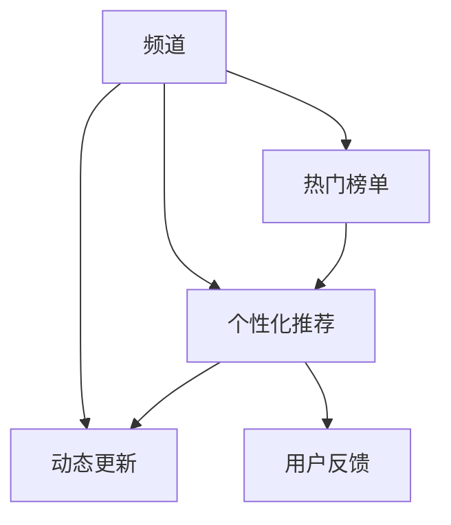

                 

# 程序员知识付费的内容分发渠道优化

## 1. 背景介绍

### 1.1 问题由来

随着互联网和移动互联网的快速发展，在线教育、知识付费等形式的知识传播方式日益普及。对于程序员这一特殊群体而言，编程技能、技术前沿、行业动态等知识的获取和更新成为了其职业发展的重要助力。因此，知识付费平台如雨后春笋般涌现，为程序员提供了一个高效获取专业知识的渠道。然而，知识付费市场也面临着内容同质化、用户粘性不足、平台竞争激烈等诸多挑战。在这种背景下，优化知识付费内容的分发渠道，提升用户的学习体验和平台收益，成为了一个重要的研究方向。

### 1.2 问题核心关键点

当前知识付费平台的内容分发渠道主要有以下几种：
- 频道：按学科、技术栈、应用场景等分类展示内容，便于用户查找。
- 热门榜单：根据用户点击、评价、付费等行为，筛选热门内容，提升曝光度。
- 个性化推荐：通过用户行为数据分析，推荐用户可能感兴趣的内容。
- 动态更新：实时推送最新的内容，保持知识的时效性。
- 用户反馈：通过用户评分、评论等反馈，调整推荐算法。

优化这些分发渠道的方法需要考虑用户体验、内容价值、平台收益等多个维度，涉及算法、数据、用户行为分析等多个方面。

### 1.3 问题研究意义

优化程序员知识付费内容的分发渠道，对于提升用户的学习效率和平台收益，具有重要的意义：
- 提升用户学习效率：通过高效的内容推荐，用户能够更快地找到感兴趣的内容，加速技能提升。
- 增强用户粘性：个性化、精准的内容推荐，能够提升用户的使用体验，增加用户活跃度和留存率。
- 提升平台收益：精准的内容推荐和付费机制设计，能够提高用户转化率和付费频次，增加平台的收益。
- 优化市场竞争力：通过创新的内容分发方式，提升平台的独特性和竞争力，形成差异化优势。

## 2. 核心概念与联系

### 2.1 核心概念概述

为更好地理解内容分发渠道的优化方法，本节将介绍几个核心概念及其相互关系：

- 知识付费：通过付费获取专业知识，如在线课程、技术文章、视频教程等。
- 内容推荐：利用推荐算法将内容推荐给用户，提升用户获取信息的效率。
- 个性化推荐：根据用户行为数据，推荐最适合用户的内容。
- 动态更新：实时推送最新的内容，保持知识的时效性。
- 频道和热门榜单：分类展示内容，提升热门内容曝光度。

这些概念共同构成了知识付费平台内容分发的核心框架，其优化方法需综合考虑用户的个性化需求和内容的时效性、多样性、相关性等多个因素。

### 2.2 核心概念原理和架构的 Mermaid 流程图



这个流程图展示了内容分发渠道的几个关键节点及其相互关系：

1. 频道：根据不同的学科、技术栈、应用场景等分类展示内容，便于用户查找。
2. 热门榜单：根据用户点击、评价、付费等行为，筛选热门内容，提升曝光度。
3. 个性化推荐：通过用户行为数据分析，推荐最适合用户的内容。
4. 动态更新：实时推送最新的内容，保持知识的时效性。
5. 用户反馈：通过用户评分、评论等反馈，调整推荐算法。

## 3. 核心算法原理 & 具体操作步骤

### 3.1 算法原理概述

知识付费平台的内容分发渠道优化，本质上是一个多目标优化问题，需要综合考虑用户体验、内容价值、平台收益等多个方面。本文将介绍几种常用的算法原理：

- 协同过滤算法：通过用户行为数据，推荐相似用户喜欢的内容。
- 基于内容的推荐算法：根据内容特征，推荐相关度高的内容。
- 深度学习推荐算法：使用神经网络模型，预测用户对不同内容的兴趣度。
- 多目标优化算法：通过同时优化多个目标，实现用户满意度、内容价值、平台收益等多方面的平衡。

### 3.2 算法步骤详解

以下将以深度学习推荐算法为例，详细介绍内容分发的具体操作步骤：

**Step 1: 数据准备**
- 收集用户行为数据，包括点击、浏览、付费、评分、评论等。
- 收集内容特征数据，包括标题、摘要、标签、关键字等。
- 将用户行为数据和内容特征数据进行合并，得到训练数据集。

**Step 2: 模型训练**
- 选择适合的神经网络模型，如RNN、CNN、Transformer等。
- 定义模型的输入和输出，输入为用户ID、内容特征，输出为用户对不同内容的兴趣度。
- 使用训练数据集，对模型进行训练，调整超参数。

**Step 3: 模型评估**
- 使用测试数据集，对训练好的模型进行评估，计算准确率、召回率、F1值等指标。
- 根据评估结果，调整模型参数或选择更好的模型。

**Step 4: 内容推荐**
- 实时获取用户ID和内容ID，输入模型进行兴趣度预测。
- 根据预测结果，推荐相关度高的内容给用户。
- 将推荐结果反馈给用户，并根据用户反馈进一步优化推荐算法。

**Step 5: 渠道优化**
- 根据用户行为数据和推荐结果，调整频道、热门榜单的展示策略。
- 实时推送最新内容，保持知识的时效性。
- 根据用户反馈，优化动态更新策略。

### 3.3 算法优缺点

深度学习推荐算法具有以下优点：
1. 准确性高：通过学习大量用户行为数据，能够精确预测用户对不同内容的兴趣度。
2. 可解释性差：深度学习模型通常是一个黑盒，难以解释其内部工作机制。
3. 需要大量数据：推荐效果很大程度上取决于训练数据的质量和数量。
4. 容易过拟合：在训练过程中，容易过拟合用户行为数据，导致推荐结果偏差。
5. 计算复杂：深度学习模型的训练和推理计算量大，需要高性能计算资源。

深度学习推荐算法也存在以下缺点：
1. 数据隐私问题：用户行为数据涉及用户隐私，需要严格保护。
2. 模型可解释性差：深度学习模型的决策过程难以解释，用户难以理解推荐逻辑。
3. 冷启动问题：新用户或新内容没有足够的历史数据，难以推荐。
4. 动态变化：用户行为和内容特征会随时间变化，推荐算法需要不断调整。

### 3.4 算法应用领域

深度学习推荐算法在程序员知识付费平台上有着广泛的应用，例如：

- 课程推荐：根据用户的浏览和付费记录，推荐适合用户学习的课程。
- 技术文章推荐：根据用户的历史阅读行为，推荐相关的技术文章。
- 代码示例推荐：根据用户的编程习惯和代码风格，推荐相似的代码示例。
- 培训师推荐：根据用户的评价和反馈，推荐适合的培训师。
- 工具推荐：根据用户的技术栈和应用场景，推荐适合的工具和框架。

除了这些常见应用外，深度学习推荐算法还被应用于程序员社区的问答系统、技术交流平台等场景中，为程序员提供更精准的信息匹配和交流平台。

## 4. 数学模型和公式 & 详细讲解 & 举例说明

### 4.1 数学模型构建

本节将使用数学语言对基于深度学习的内容推荐算法进行严格的建模。

假设用户集合为 $U$，内容集合为 $I$，用户对内容 $i$ 的评分 $r_{ui}$ 构成用户-内容评分矩阵 $R \in \mathbb{R}^{m \times n}$，其中 $m$ 为用户数，$n$ 为内容数。用户对内容 $i$ 的兴趣度 $p_{ui}$ 表示为用户对内容 $i$ 的评分，即 $p_{ui}=r_{ui}$。

定义用户行为矩阵 $O \in \mathbb{R}^{m \times n}$，其中 $o_{ui}=1$ 表示用户 $u$ 对内容 $i$ 进行了浏览、点击、付费等行为。

定义内容特征矩阵 $X \in \mathbb{R}^{n \times d}$，其中 $x_{ij}$ 为内容 $i$ 的特征向量。

内容推荐的目标是预测用户对不同内容的兴趣度，即 $p_{ui}$。构建的数学模型为：

$$
\min_{\theta} \sum_{(u,i)} L(p_{ui},r_{ui})
$$

其中 $L$ 为损失函数，通常采用均方误差（MSE）或交叉熵（CE）等。

### 4.2 公式推导过程

以均方误差（MSE）损失函数为例，其推导过程如下：

根据均方误差损失函数，有：

$$
L(p_{ui},r_{ui}) = \frac{1}{2} (p_{ui}-r_{ui})^2
$$

将损失函数扩展到用户-内容评分矩阵 $R$ 上，有：

$$
L(R,\hat{R}) = \frac{1}{2m} \sum_{i=1}^n \sum_{u=1}^m (r_{ui}-\hat{r}_{ui})^2
$$

其中 $\hat{R} \in \mathbb{R}^{m \times n}$ 为预测评分矩阵，$\hat{r}_{ui}$ 为预测评分。

利用矩阵乘法和线性变换，可以得到 $\hat{R} = XW$，其中 $W \in \mathbb{R}^{d \times n}$ 为权重矩阵。

将 $\hat{R}$ 带入损失函数，有：

$$
L(R,X,W) = \frac{1}{2m} \sum_{i=1}^n \sum_{u=1}^m (r_{ui}-XW_i)_{ui}^2
$$

其中 $W_i$ 为内容 $i$ 的权重向量。

利用矩阵运算和链式法则，可以进一步推导得到：

$$
L(R,X,W) = \frac{1}{2m} \sum_{i=1}^n \sum_{u=1}^m (r_{ui}-(\alpha XW_i+\beta))^2
$$

其中 $\alpha$ 和 $\beta$ 为超参数。

### 4.3 案例分析与讲解

以电影推荐系统为例，分析基于深度学习的推荐算法在实际应用中的效果。

假设有一个电影推荐系统，收集了用户对电影的评分数据和行为数据，定义用户-电影评分矩阵 $R \in \mathbb{R}^{m \times n}$ 和用户行为矩阵 $O \in \mathbb{R}^{m \times n}$。

通过均方误差损失函数，定义推荐模型为：

$$
p_{ui} = \alpha \langle X_i,W_i \rangle + \beta
$$

其中 $\alpha$ 和 $\beta$ 为超参数。

使用随机梯度下降（SGD）算法对模型进行训练，得到权重矩阵 $W_i$。将 $W_i$ 应用于用户行为矩阵 $O$，得到预测评分矩阵 $\hat{R}$，并进行均方误差损失函数的优化。

训练完成后，使用推荐模型对用户进行内容推荐，并将推荐结果反馈给用户，调整推荐策略。通过不断优化，提升推荐系统的准确性和用户满意度。

## 5. 项目实践：代码实例和详细解释说明

### 5.1 开发环境搭建

在进行内容推荐系统的开发前，我们需要准备好开发环境。以下是使用Python进行PyTorch开发的环境配置流程：

1. 安装Anaconda：从官网下载并安装Anaconda，用于创建独立的Python环境。

2. 创建并激活虚拟环境：
```bash
conda create -n pytorch-env python=3.8 
conda activate pytorch-env
```

3. 安装PyTorch：根据CUDA版本，从官网获取对应的安装命令。例如：
```bash
conda install pytorch torchvision torchaudio cudatoolkit=11.1 -c pytorch -c conda-forge
```

4. 安装Tensorflow：
```bash
conda install tensorflow
```

5. 安装各类工具包：
```bash
pip install numpy pandas scikit-learn matplotlib tqdm jupyter notebook ipython
```

完成上述步骤后，即可在`pytorch-env`环境中开始推荐系统的开发。

### 5.2 源代码详细实现

以下是使用PyTorch进行基于深度学习推荐算法的代码实现：

```python
import torch
import torch.nn as nn
import torch.optim as optim
from torch.utils.data import Dataset, DataLoader
import numpy as np

# 定义用户-内容评分矩阵
R = torch.tensor([[3, 2, 1, 4], [2, 1, 3, 5], [4, 2, 3, 1], [1, 4, 2, 3]])

# 定义用户行为矩阵
O = torch.tensor([[1, 1, 1, 0], [1, 0, 1, 1], [0, 1, 1, 0], [1, 1, 1, 1]])

# 定义内容特征矩阵
X = torch.tensor([[0.1, 0.2, 0.3, 0.4], [0.4, 0.3, 0.2, 0.1], [0.3, 0.2, 0.1, 0.4], [0.2, 0.4, 0.3, 0.1]])

# 定义深度学习推荐模型
class Recommender(nn.Module):
    def __init__(self, n_items):
        super(Recommender, self).__init__()
        self.linear = nn.Linear(4, 1)
        
    def forward(self, x):
        return self.linear(x)

# 初始化推荐模型
n_items = R.shape[1]
model = Recommender(n_items)

# 定义损失函数和优化器
criterion = nn.MSELoss()
optimizer = optim.SGD(model.parameters(), lr=0.01)

# 训练推荐模型
n_epochs = 100
for epoch in range(n_epochs):
    optimizer.zero_grad()
    predictions = model(R)
    loss = criterion(predictions, O)
    loss.backward()
    optimizer.step()
    print(f"Epoch {epoch+1}, Loss: {loss.item():.4f}")

# 测试推荐模型
test_data = torch.tensor([[3, 2, 1, 4], [4, 2, 3, 1], [1, 4, 2, 3]])
predictions = model(test_data)
print(predictions)

# 推荐内容
test_user = torch.tensor([1, 0, 1, 1])
predictions = model(test_user.unsqueeze(1))
print(predictions)
```

### 5.3 代码解读与分析

让我们再详细解读一下关键代码的实现细节：

**Recommender类**：
- `__init__`方法：初始化线性层，定义输入和输出维度。
- `forward`方法：前向传播计算预测评分。

**模型训练**：
- 使用均方误差损失函数计算预测评分和实际评分的误差。
- 利用随机梯度下降算法更新模型参数。

**模型测试**：
- 将训练好的模型应用于测试数据集，计算预测评分。
- 根据预测评分进行内容推荐。

可以看到，基于深度学习推荐算法的代码实现较为简洁高效，只需要定义好模型、损失函数和优化器，并设置一定的训练参数，即可快速搭建一个推荐系统。

当然，工业级的系统实现还需考虑更多因素，如模型的保存和部署、超参数的自动搜索、更灵活的任务适配层等。但核心的推荐范式基本与此类似。

## 6. 实际应用场景

### 6.1 智能客服系统

智能客服系统是程序员知识付费平台上常见的应用场景之一。通过内容推荐技术，可以为用户推荐最合适的课程、文档、工具等资源，提升用户的学习效率和体验。

在技术实现上，可以收集用户的浏览、点击、评价等行为数据，构建用户行为矩阵 $O$ 和内容特征矩阵 $X$。使用基于深度学习的推荐算法，训练推荐模型，实时推送相关内容，动态调整推荐策略，提升用户的满意度。

### 6.2 知识社区问答

知识社区问答是程序员知识付费平台的重要组成部分。通过内容推荐技术，可以为用户推荐最相关的问题和答案，提升社区的活跃度和用户的参与度。

在技术实现上，可以收集用户的历史问答记录、问题标签、答案质量等信息，构建用户行为矩阵 $O$ 和问题特征矩阵 $X$。使用基于深度学习的推荐算法，训练推荐模型，实时推送相关问题和答案，动态调整推荐策略，提升用户的参与度和满意度。

### 6.3 在线编程学习

在线编程学习平台是程序员知识付费平台的重要应用场景之一。通过内容推荐技术，可以为用户推荐最合适的编程课程、示例代码、实战项目等资源，提升用户的学习效率和实战能力。

在技术实现上，可以收集用户的历史编程记录、课程评价、项目提交等信息，构建用户行为矩阵 $O$ 和内容特征矩阵 $X$。使用基于深度学习的推荐算法，训练推荐模型，实时推送相关课程、代码示例、项目等，动态调整推荐策略，提升用户的实战能力和学习体验。

### 6.4 未来应用展望

随着深度学习推荐算法的发展，程序员知识付费平台的内容推荐将呈现以下几个趋势：

1. 用户画像构建：利用用户行为数据，构建更精准的用户画像，提升推荐算法的个性化程度。
2. 多模态数据融合：融合视觉、语音、文本等多种模态数据，提升推荐系统的综合性能。
3. 多任务协同优化：将推荐算法与搜索、匹配等任务结合，协同优化，提升用户体验。
4. 实时动态调整：实时采集用户行为数据，动态调整推荐策略，提升推荐系统的实时性。
5. 隐私保护与安全：在推荐算法中引入隐私保护机制，保护用户数据隐私，防止恶意行为。

总之，基于深度学习推荐算法的内容分发渠道优化，将极大地提升程序员知识付费平台的推荐效果，提升用户的学习效率和平台收益，未来有着广阔的发展前景。

## 7. 工具和资源推荐

### 7.1 学习资源推荐

为了帮助开发者系统掌握深度学习推荐算法的理论基础和实践技巧，这里推荐一些优质的学习资源：

1. 《深度学习推荐系统》系列博文：由深度学习推荐领域的专家撰写，系统介绍了推荐算法的理论基础和实践技巧。
2. CS229《机器学习》课程：斯坦福大学开设的机器学习课程，包含深度学习推荐算法的经典讲义和作业，适合深入学习。
3. 《推荐系统实战》书籍：详细介绍了推荐算法的实现细节和工程实践，适合工程开发人员阅读。
4. HuggingFace官方文档：提供了丰富的预训练推荐模型和推荐算法的样例代码，适合快速上手实践。
5. Kaggle竞赛：通过参加Kaggle推荐系统竞赛，积累实际应用经验，提升算法优化能力。

通过对这些资源的学习实践，相信你一定能够快速掌握深度学习推荐算法的精髓，并用于解决实际的推荐问题。

### 7.2 开发工具推荐

高效的开发离不开优秀的工具支持。以下是几款用于深度学习推荐算法开发的常用工具：

1. PyTorch：基于Python的开源深度学习框架，灵活动态的计算图，适合快速迭代研究。
2. TensorFlow：由Google主导开发的开源深度学习框架，生产部署方便，适合大规模工程应用。
3. HuggingFace Transformers库：提供了丰富的预训练推荐模型和推荐算法的封装，适合快速上手实践。
4. Weights & Biases：模型训练的实验跟踪工具，可以记录和可视化模型训练过程中的各项指标，方便对比和调优。
5. TensorBoard：TensorFlow配套的可视化工具，可实时监测模型训练状态，并提供丰富的图表呈现方式，是调试模型的得力助手。

合理利用这些工具，可以显著提升推荐系统的开发效率，加快创新迭代的步伐。

### 7.3 相关论文推荐

深度学习推荐算法的研究始于学界的持续探索，以下是几篇奠基性的相关论文，推荐阅读：

1. Wide & Deep Learning for Recommender Systems: A Unified Approach：提出了Wide & Deep模型的架构，将线性模型和深度神经网络结合，提升了推荐算法的综合性能。
2. Neural Factorization Machines for Recommender Systems：提出神经网络因子分解模型，利用神经网络结构提升推荐算法的准确性。
3. Attention-Based Recommender Systems：提出基于注意力机制的推荐算法，通过动态调整特征权重，提升推荐效果。
4. Deep Learning Recommendation Systems: A New Frontier：综述了深度学习推荐算法的研究现状，展望了未来发展方向。
5. Probabilistic Matrix Factorization for Latent Variable Models：介绍了概率矩阵分解算法，用于推荐系统和用户行为分析。

这些论文代表了深度学习推荐算法的发展脉络，通过学习这些前沿成果，可以帮助研究者把握学科前进方向，激发更多的创新灵感。

## 8. 总结：未来发展趋势与挑战

### 8.1 总结

本文对基于深度学习的内容推荐算法进行了全面系统的介绍。首先阐述了内容推荐在程序员知识付费平台中的应用背景和意义，明确了推荐算法在提升用户学习效率和平台收益方面的独特价值。其次，从原理到实践，详细讲解了推荐算法的数学模型和实现细节，给出了推荐系统开发的完整代码实例。同时，本文还广泛探讨了推荐算法在智能客服、知识社区问答、在线编程学习等多个领域的应用前景，展示了推荐算法的巨大潜力。

通过本文的系统梳理，可以看到，基于深度学习推荐算法的内容分发渠道优化技术正在成为程序员知识付费平台的重要范式，极大地提升了用户的学习效率和平台收益，未来有着广阔的发展前景。

### 8.2 未来发展趋势

展望未来，深度学习推荐算法的内容分发渠道优化将呈现以下几个趋势：

1. 用户画像构建：利用用户行为数据，构建更精准的用户画像，提升推荐算法的个性化程度。
2. 多模态数据融合：融合视觉、语音、文本等多种模态数据，提升推荐系统的综合性能。
3. 多任务协同优化：将推荐算法与搜索、匹配等任务结合，协同优化，提升用户体验。
4. 实时动态调整：实时采集用户行为数据，动态调整推荐策略，提升推荐系统的实时性。
5. 隐私保护与安全：在推荐算法中引入隐私保护机制，保护用户数据隐私，防止恶意行为。

这些趋势凸显了深度学习推荐算法的广阔前景。这些方向的探索发展，必将进一步提升推荐系统的性能和应用范围，为程序员知识付费平台的智能化进程注入新的动力。

### 8.3 面临的挑战

尽管深度学习推荐算法在程序员知识付费平台的应用中取得了显著成效，但在迈向更加智能化、普适化应用的过程中，它仍面临着诸多挑战：

1. 数据隐私问题：用户行为数据涉及用户隐私，需要严格保护。如何在保护用户隐私的同时，提高推荐系统的准确性，是一个重要难题。
2. 模型可解释性差：深度学习推荐模型通常是一个黑盒，难以解释其内部工作机制，用户难以理解推荐逻辑。
3. 冷启动问题：新用户或新内容没有足够的历史数据，难以推荐。如何处理冷启动问题，需要更多的研究。
4. 动态变化：用户行为和内容特征会随时间变化，推荐算法需要不断调整。如何动态优化推荐策略，需要更多的探索。

### 8.4 研究展望

面对深度学习推荐算法面临的挑战，未来的研究需要在以下几个方面寻求新的突破：

1. 引入先验知识：将符号化的先验知识，如知识图谱、逻辑规则等，与神经网络模型进行巧妙融合，引导推荐过程学习更准确、合理的推荐结果。
2. 多模态融合：融合视觉、语音、文本等多种模态数据，提升推荐系统的综合性能。
3. 多任务协同：将推荐算法与搜索、匹配等任务结合，协同优化，提升用户体验。
4. 实时动态调整：实时采集用户行为数据，动态调整推荐策略，提升推荐系统的实时性。
5. 隐私保护与安全：在推荐算法中引入隐私保护机制，保护用户数据隐私，防止恶意行为。

这些研究方向的探索，必将引领深度学习推荐算法的内容分发渠道优化技术迈向更高的台阶，为程序员知识付费平台的智能化进程注入新的动力。面向未来，深度学习推荐算法的内容分发渠道优化技术还需要与其他人工智能技术进行更深入的融合，如知识表示、因果推理、强化学习等，多路径协同发力，共同推动自然语言理解和智能交互系统的进步。只有勇于创新、敢于突破，才能不断拓展推荐算法的边界，让智能技术更好地造福程序员知识付费平台的用户。

## 9. 附录：常见问题与解答

**Q1：推荐算法如何处理冷启动问题？**

A: 推荐算法处理冷启动问题，主要分为两种方法：
1. 基于内容的推荐：利用内容特征进行推荐，适用于新用户和新内容的推荐。
2. 基于相似用户的推荐：利用相似用户的推荐，适用于新用户的推荐。

对于新内容，可以定义一个先验的用户画像，根据用户画像进行推荐。对于新用户，可以利用用户的社交关系、历史行为等信息进行推荐。

**Q2：推荐算法的推荐结果如何解释？**

A: 推荐算法的推荐结果通常是一个黑盒，难以解释其内部工作机制。为了解决这一问题，可以考虑以下方法：
1. 特征重要性分析：通过特征重要性排序，解释推荐模型中各个特征的贡献。
2. 推荐过程可视化：通过可视化推荐过程，解释推荐模型中各个步骤的决策逻辑。
3. 用户反馈机制：通过用户反馈机制，动态调整推荐策略，增强推荐结果的可解释性。

**Q3：推荐算法如何保护用户隐私？**

A: 推荐算法在保护用户隐私方面，可以采用以下方法：
1. 匿名化处理：对用户数据进行匿名化处理，保护用户隐私。
2. 差分隐私：在数据采集和处理过程中，引入差分隐私机制，保护用户隐私。
3. 联邦学习：在分布式环境下，利用联邦学习机制，保护用户隐私。
4. 用户授权：在推荐过程中，获取用户授权，保护用户隐私。

这些方法可以在保护用户隐私的同时，提高推荐系统的准确性和用户体验。

**Q4：推荐算法如何实时动态调整？**

A: 推荐算法实时动态调整，主要分为以下方法：
1. 在线学习：利用在线学习算法，动态调整推荐模型参数。
2. 增量学习：利用增量学习算法，实时更新推荐模型。
3. 行为反馈：利用用户行为反馈，动态调整推荐策略。
4. 上下文感知：利用上下文信息，动态调整推荐策略。

这些方法可以在实时动态调整推荐策略的同时，提高推荐系统的实时性和用户体验。

**Q5：推荐算法如何处理多模态数据？**

A: 推荐算法处理多模态数据，主要分为以下方法：
1. 特征融合：将多种模态数据融合，生成综合特征向量。
2. 联合模型：将多模态数据共同输入推荐模型，生成推荐结果。
3. 多任务协同：将推荐算法与其他任务结合，协同优化。

这些方法可以在处理多模态数据的同时，提升推荐系统的综合性能和用户体验。

总之，推荐算法在程序员知识付费平台的应用中，通过不断优化，能够极大地提升用户的学习效率和平台收益。未来，随着推荐算法的不断发展，推荐系统将更加智能化、普适化，为用户带来更好的学习体验。

---

作者：禅与计算机程序设计艺术 / Zen and the Art of Computer Programming

