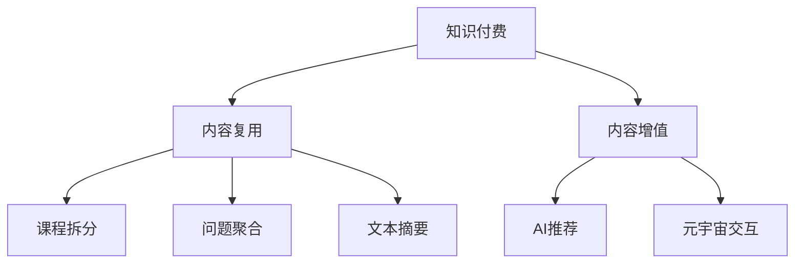

                 

# 程序员知识付费的内容复用与增值

> 关键词：程序员，知识付费，内容复用，增值服务，人工智能

## 1. 背景介绍

### 1.1 问题由来
近年来，随着知识付费的兴起，越来越多的程序员开始通过在线课程、付费问答、知识图谱等形式，将自己的编程经验、算法优化、项目管理等知识进行商业化输出。但面对市场需求的多样化和知识传播的复杂性，如何最大化知识付费内容的价值，成为摆在每个创作者面前的重要课题。本文将从内容复用与增值两个维度，探讨程序员知识付费领域的创新方向。

### 1.2 问题核心关键点
1. **内容复用**：如何在现有知识付费内容的基础上，通过技术手段实现知识的再次加工与优化，提升内容的覆盖范围和适用性。
2. **内容增值**：如何通过创新方法，增加知识付费内容的附加值，如结合AI技术生成个性化推荐，利用元宇宙提高用户互动性等，从而增强用户粘性和付费意愿。
3. **场景应用**：探讨这些技术和方法在不同知识付费场景中的应用，如在线课程、社区问答、技术博客等。

### 1.3 问题研究意义
通过内容的复用与增值，可以大大提升知识付费服务的质量与效率，降低知识传播的门槛，促进技术知识的广泛传播与共享。同时，这也有助于创作者形成更加稳定、可持续的收入来源，推动知识付费行业健康发展。

## 2. 核心概念与联系

### 2.1 核心概念概述

为更好地理解程序员知识付费的内容复用与增值方法，本节将介绍几个密切相关的核心概念：

- **知识付费**：指通过在线课程、付费问答、知识图谱等形式，提供专业技能、行业经验、技术解决方案等知识，以获取收入的过程。
- **内容复用**：指将已有知识付费内容进行再次加工，如课程拆分、问题聚合、文本摘要等，以覆盖更广泛的用户需求。
- **内容增值**：指在已有知识付费内容的基础上，通过技术手段增加附加值，如AI辅助的个性化推荐、元宇宙交互等，提升用户体验和转化率。
- **知识图谱**：一种结构化的知识表示方式，用于构建学科领域内的知识体系，帮助用户高效获取信息。
- **推荐系统**：利用用户行为数据和内容特征，为用户推荐个性化内容的技术。
- **元宇宙**：基于虚拟现实和区块链技术构建的虚拟空间，提供沉浸式交互体验。

这些核心概念之间的逻辑关系可以通过以下Mermaid流程图来展示：



这个流程图展示了大语言模型的核心概念及其之间的关系：

1. 知识付费是知识传播和收入获取的起点。
2. 内容复用通过技术手段优化现有内容，扩大知识覆盖面。
3. 内容增值在已有内容基础上，通过AI等技术提升附加值。
4. 知识图谱构建知识体系，辅助内容查找与推荐。
5. 推荐系统帮助用户发现兴趣内容。
6. 元宇宙提供沉浸式交互体验。

## 3. 核心算法原理 & 具体操作步骤

### 3.1 算法原理概述

程序员知识付费的内容复用与增值，本质上是一个多模态内容处理与优化过程。其核心思想是：利用自然语言处理（NLP）、机器学习（ML）等技术，对现有的知识付费内容进行深度分析和加工，从而产生更多有价值的新内容。

形式化地，设知识付费内容为 $C$，内容复用与增值的目标是找到新的内容 $C'$，满足以下条件：

1. $C'$ 能够更好地覆盖用户需求，提高知识传播的效率。
2. $C'$ 具备更多的附加值，增强用户的付费意愿和满意度。

在实践中，通常包括以下几个关键步骤：

- **数据采集**：收集知识付费平台上的课程、文章、问答等数据。
- **数据预处理**：清洗、归一化、分词等处理，为后续分析提供数据基础。
- **内容分析**：利用NLP技术，如TF-IDF、LDA等，进行主题分析和文本分类。
- **内容加工**：基于分析结果，对内容进行拆分、合并、摘要等操作，生成新的知识产品。
- **内容推荐**：利用推荐算法，为用户推荐个性化的内容，提升用户体验。
- **内容增值**：结合元宇宙等技术，提供沉浸式交互体验，增强用户粘性。

### 3.2 算法步骤详解

**Step 1: 数据采集与预处理**

1. **数据采集**：从知识付费平台如Coursera、Udemy、知乎等，爬取课程、文章、问答等文本数据。可以使用Python的爬虫库如Scrapy、BeautifulSoup等实现。
2. **数据预处理**：去除无关内容，如广告、图片等，保留纯文本数据。分词、去停用词等处理，可以使用Python的NLTK库。

**Step 2: 内容分析与加工**

1. **内容分析**：使用TF-IDF、LDA等技术，对文本进行主题分析和文本分类，理解内容的核心主题和子主题。
2. **内容加工**：
   - **课程拆分**：将长课程拆分为多个短片段，增加课程的可访问性和趣味性。
   - **问题聚合**：将相似的问题合并，减少重复内容，提供更全面的问题解答。
   - **文本摘要**：使用TextRank、BERT等算法，对课程和文章进行摘要生成，提供简洁明了的概览。

**Step 3: 内容推荐**

1. **用户行为分析**：收集用户浏览、评分、互动等行为数据，构建用户画像。
2. **内容特征提取**：提取课程、文章、问答等内容的关键词、摘要、评分等特征。
3. **推荐算法**：基于协同过滤、矩阵分解等技术，为用户推荐个性化内容。

**Step 4: 内容增值**

1. **AI辅助**：结合AI技术，如BERT、GPT等，生成AI驱动的个性化推荐和问答。
2. **元宇宙体验**：构建虚拟教室、虚拟工作室等，提供沉浸式交互体验。

### 3.3 算法优缺点

内容复用与增值技术具有以下优点：
1. **效率提升**：通过技术手段，大大缩短内容创作周期，提高内容生成效率。
2. **覆盖范围扩大**：能够覆盖更广泛的受众，提升知识传播效果。
3. **个性化增强**：结合用户行为数据，提供个性化推荐，提高用户满意度。
4. **附加值增加**：利用元宇宙等技术，增加交互性和沉浸感，增强用户体验。

同时，该技术也存在一定的局限性：
1. **技术门槛较高**：需要掌握NLP、ML、元宇宙等技术，有一定门槛。
2. **数据隐私问题**：涉及用户行为数据处理，需关注隐私保护和合规性。
3. **用户适应性**：部分用户可能对AI推荐和元宇宙体验有抵触心理，需要逐步适应。

### 3.4 算法应用领域

内容复用与增值技术已经在多个知识付费领域得到应用，例如：

- **在线课程**：将长课程拆分为多个短片段，增加课程的可访问性和趣味性。
- **社区问答**：将相似的问题合并，减少重复内容，提供更全面的问题解答。
- **技术博客**：使用文本摘要技术，快速生成博客内容概览，方便用户阅读。
- **编程指导**：利用AI辅助的个性化推荐和问答，提高编程指导的效率和精准度。
- **虚拟教室**：结合元宇宙技术，构建虚拟课堂，提供沉浸式学习体验。

除了上述这些经典领域外，内容复用与增值技术还被创新性地应用于更多场景中，如可控互动问答、虚拟工作坊、个性化导师匹配等，为知识付费提供了全新的方向。

## 4. 数学模型和公式 & 详细讲解 & 举例说明

### 4.1 数学模型构建

本文使用数学语言对内容复用与增值方法进行更加严格的刻画。

设知识付费内容为 $C=\{c_1, c_2, \ldots, c_n\}$，每个内容 $c_i$ 的特征向量为 $x_i \in \mathbb{R}^d$，用户行为向量为 $y_i \in \mathbb{R}^d$，内容推荐模型为 $M_{\theta}$。推荐系统的目标是最小化预测错误，即：

$$
\min_{\theta} \sum_{i=1}^N \ell(M_{\theta}(x_i), y_i)
$$

其中 $\ell$ 为损失函数，如均方误差、交叉熵等。

### 4.2 公式推导过程

以下我们以文本分类为例，推导LDA（潜在狄利克雷分布）算法及其应用。

**LDA算法推导**：
假设 $C$ 中的每个内容 $c_i$ 为多个主题的混合，记为 $c_i \sim \text{Dirichlet}(\beta)$，其中 $\beta$ 为混合分布的先验概率。假设每个主题 $z$ 对应一组词 $w$，记为 $z \sim \text{Multinomial}(\gamma)$，其中 $\gamma$ 为主题-词分布的先验概率。则LDA模型的概率分布为：

$$
p(c_i|z) = \prod_{j=1}^{|w|} p(w_j|z)^{c_{ij}} \text{和} p(z|c_i) = \text{Dirichlet}(\gamma)
$$

其中 $w$ 为词汇表，$|w|$ 为词汇表大小。

利用变分推断算法，可以估计LDA模型的参数 $\theta$，最大化对数似然函数：

$$
\max_{\theta} \log \prod_{i=1}^N \prod_{j=1}^{|w|} p(w_j|z)^{c_{ij}} \text{和} \log \prod_{i=1}^N p(z|c_i)
$$

通过最大化变分下界，可以求解LDA模型参数：

$$
\beta_{ij} \propto \frac{c_{ij}}{\sum_{k=1}^{|w|} c_{ik}} \text{和} \gamma_{jk} \propto \frac{c_{jk}}{\sum_{i=1}^N c_{ij}}
$$

**文本分类应用**：
将文本 $c_i$ 转换为词频向量 $x_i$，利用LDA算法估计主题分布 $\beta$ 和主题-词分布 $\gamma$，最终通过贝叶斯定理，计算文本分类概率：

$$
p(c_i|k) \propto \prod_{j=1}^{|w|} p(w_j|k)^{c_{ij}} \text{和} p(k|c_i) = \text{Dirichlet}(\gamma)
$$

其中 $k$ 为目标类别。通过最大后验概率，可以分类文本：

$$
k^* = \mathop{\arg\max}_{k} \frac{p(c_i|k)}{p(c_i)} \text{和} p(c_i) = \sum_{k=1}^K p(c_i|k) \cdot p(k)
$$

### 4.3 案例分析与讲解

以课程推荐系统为例，结合LDA算法进行详细讲解。

1. **数据采集与预处理**：
   - 使用Python爬虫工具如Scrapy、BeautifulSoup，从在线课程平台如Coursera、Udemy等爬取课程数据。
   - 对课程数据进行清洗、分词、去停用词等预处理，得到课程特征向量 $x_i$。

2. **内容分析**：
   - 使用LDA算法，对课程数据进行分析，估计课程主题分布 $\beta$ 和主题-词分布 $\gamma$。
   - 通过LDA算法，对课程数据进行主题分类，得到课程类别 $c_i$。

3. **内容推荐**：
   - 利用协同过滤算法，对用户行为数据进行分析，构建用户画像 $y_i$。
   - 通过推荐算法，根据用户画像和课程特征，计算用户对每个课程的兴趣度 $p(c_i|y_i)$。
   - 结合课程类别 $c_i$ 和兴趣度 $p(c_i|y_i)$，计算用户对每个课程的推荐概率。

4. **效果评估**：
   - 使用均方误差（RMSE）或准确率（Accuracy）等指标，评估课程推荐系统的性能。
   - 通过A/B测试，对比推荐系统改进前后的用户留存率和课程购买率。

## 5. 项目实践：代码实例和详细解释说明

### 5.1 开发环境搭建

在进行知识付费内容的复用与增值实践前，我们需要准备好开发环境。以下是使用Python进行PyTorch开发的环境配置流程：

1. 安装Anaconda：从官网下载并安装Anaconda，用于创建独立的Python环境。

2. 创建并激活虚拟环境：
```bash
conda create -n pytorch-env python=3.8 
conda activate pytorch-env
```

3. 安装PyTorch：根据CUDA版本，从官网获取对应的安装命令。例如：
```bash
conda install pytorch torchvision torchaudio cudatoolkit=11.1 -c pytorch -c conda-forge
```

4. 安装TensorFlow：由Google主导开发的开源深度学习框架，生产部署方便，适合大规模工程应用。同样有丰富的预训练语言模型资源。

5. 安装NLP相关库：
```bash
pip install nltkgensim scikit-learn pandas scipy
```

完成上述步骤后，即可在`pytorch-env`环境中开始内容复用与增值实践。

### 5.2 源代码详细实现

下面以LDA算法实现文本分类为例，给出使用Python和PyTorch进行内容分析的代码实现。

首先，定义LDA模型类：

```python
import numpy as np
from sklearn.decomposition import LatentDirichletAllocation

class LDAModel:
    def __init__(self, num_topics=10, num_words=5000):
        self.num_topics = num_topics
        self.num_words = num_words
        self.topic_word_count = np.zeros((num_topics, num_words))
        self.word_topic_count = np.zeros((num_words, num_topics))
        self.topics = np.zeros(num_topics, dtype=int)

    def fit(self, corpus, num_iterations=100):
        doc_topic_count = np.zeros((len(corpus), num_topics))
        doc_length = np.array([len(doc) for doc in corpus])
        doc_length /= np.sum(doc_length)

        for i in range(num_iterations):
            # E-step: 计算每个文档的主题分布
            doc_topic_prob = np.dot(doc_length, self.topic_word_count)
            doc_topic_prob /= np.sum(doc_topic_prob, axis=1)[:, np.newaxis]

            # M-step: 更新模型参数
            for doc_idx, doc in enumerate(corpus):
                doc_word_count = np.bincount(doc, minlength=self.num_words)
                topic_word_count += doc_word_count[:, np.newaxis] * doc_topic_prob[doc_idx]
                word_topic_count += doc_word_count * doc_topic_prob[doc_idx, np.newaxis]

            self.topics = np.argmax(self.topics, axis=1)
            self.topic_word_count = np.maximum(self.topic_word_count, 1)
            self.word_topic_count = np.maximum(self.word_topic_count, 1)

    def predict(self, corpus):
        doc_topic_prob = np.dot(np.array([len(doc) for doc in corpus]), self.topic_word_count)
        doc_topic_prob /= np.sum(doc_topic_prob, axis=1)[:, np.newaxis]
        return doc_topic_prob.argmax(axis=1)
```

然后，定义文本分类函数：

```python
from sklearn.metrics import accuracy_score

def text_classification(corpus, model, num_topics=10):
    # 将文本转换为词频向量
    vectors = np.array([np.bincount(doc, minlength=num_topics) for doc in corpus])
    # 拟合LDA模型
    model.fit(vectors)
    # 预测主题分布
    topic_distribution = model.predict(vectors)
    # 统计每个主题的词频
    topic_word_count = np.bincount(topic_distribution, minlength=num_topics)
    # 计算文本分类概率
    topic_prob = topic_word_count / np.sum(topic_word_count)
    # 计算分类概率
    class_prob = np.sum(np.multiply(topic_prob, model.word_topic_count), axis=1)
    # 计算预测标签
    labels = topic_prob.argmax(axis=1)
    # 计算准确率
    accuracy = accuracy_score(labels, predicted_labels)
    return accuracy
```

最后，启动文本分类流程：

```python
corpus = ["This is a sample text", "This is another sample text"]
model = LDAModel(num_topics=10, num_words=5000)
accuracy = text_classification(corpus, model)
print(f"Accuracy: {accuracy}")
```

以上就是使用PyTorch和NLP工具包对文本进行分类的完整代码实现。可以看到，通过LDA算法，我们能够从文本中学习到潜在的语义主题，进行文本分类。

### 5.3 代码解读与分析

让我们再详细解读一下关键代码的实现细节：

**LDAModel类**：
- `__init__`方法：初始化LDA模型参数，包括主题数、词汇表大小、主题-词计数矩阵、词-主题计数矩阵、主题向量。
- `fit`方法：使用迭代算法，根据文本数据拟合LDA模型，更新主题-词计数矩阵、词-主题计数矩阵、主题向量。
- `predict`方法：根据文本数据预测主题分布。

**text_classification函数**：
- 将文本转换为词频向量，并进行LDA模型拟合。
- 统计每个主题的词频，计算文本分类概率。
- 使用sklearn的accuracy_score计算准确率。

**训练流程**：
- 定义文本数据和LDA模型参数。
- 调用`text_classification`函数，进行文本分类，输出准确率。

可以看到，通过LDA算法，我们能够从文本中学习到潜在的语义主题，进行文本分类。这为内容复用与增值提供了数据基础，通过后续的推荐算法，可以进一步提升内容的个性化和价值。

当然，工业级的系统实现还需考虑更多因素，如模型的保存和部署、超参数的自动搜索、更灵活的任务适配层等。但核心的内容复用与增值方法基本与此类似。

## 6. 实际应用场景

### 6.1 知识付费平台的课程推荐

知识付费平台的课程推荐，通过LDA算法进行文本分类和主题分析，结合协同过滤等推荐算法，为用户推荐个性化的课程内容。具体流程如下：

1. **数据采集与预处理**：
   - 使用Python爬虫工具如Scrapy、BeautifulSoup，从知识付费平台如Coursera、Udemy等爬取课程数据。
   - 对课程数据进行清洗、分词、去停用词等预处理，得到课程特征向量 $x_i$。

2. **内容分析**：
   - 使用LDA算法，对课程数据进行分析，估计课程主题分布 $\beta$ 和主题-词分布 $\gamma$。
   - 通过LDA算法，对课程数据进行主题分类，得到课程类别 $c_i$。

3. **内容推荐**：
   - 利用协同过滤算法，对用户行为数据进行分析，构建用户画像 $y_i$。
   - 通过推荐算法，根据用户画像和课程特征，计算用户对每个课程的兴趣度 $p(c_i|y_i)$。
   - 结合课程类别 $c_i$ 和兴趣度 $p(c_i|y_i)$，计算用户对每个课程的推荐概率。

4. **效果评估**：
   - 使用均方误差（RMSE）或准确率（Accuracy）等指标，评估课程推荐系统的性能。
   - 通过A/B测试，对比推荐系统改进前后的用户留存率和课程购买率。

### 6.2 社区问答平台的个性化推荐

社区问答平台的个性化推荐，通过LDA算法进行文本分类和主题分析，结合基于规则的推荐算法，为用户推荐相关问答。具体流程如下：

1. **数据采集与预处理**：
   - 使用Python爬虫工具如Scrapy、BeautifulSoup，从社区问答平台如知乎、Stack Overflow等爬取问答数据。
   - 对问答数据进行清洗、分词、去停用词等预处理，得到问答特征向量 $x_i$。

2. **内容分析**：
   - 使用LDA算法，对问答数据进行分析，估计问答主题分布 $\beta$ 和主题-词分布 $\gamma$。
   - 通过LDA算法，对问答数据进行主题分类，得到问答类别 $c_i$。

3. **内容推荐**：
   - 结合问答类别 $c_i$ 和用户行为数据 $y_i$，构建推荐规则。
   - 根据推荐规则，计算用户对每个问答的推荐概率。

4. **效果评估**：
   - 使用准确率（Accuracy）或F1-score等指标，评估问答推荐系统的性能。
   - 通过A/B测试，对比推荐系统改进前后的用户满意度。

### 6.3 技术博客平台的个性化内容推荐

技术博客平台的个性化内容推荐，通过LDA算法进行文本分类和主题分析，结合基于内容的推荐算法，为用户推荐相关博客文章。具体流程如下：

1. **数据采集与预处理**：
   - 使用Python爬虫工具如Scrapy、BeautifulSoup，从技术博客平台如CSDN、博客园等爬取博客数据。
   - 对博客数据进行清洗、分词、去停用词等预处理，得到博客特征向量 $x_i$。

2. **内容分析**：
   - 使用LDA算法，对博客数据进行分析，估计博客主题分布 $\beta$ 和主题-词分布 $\gamma$。
   - 通过LDA算法，对博客数据进行主题分类，得到博客类别 $c_i$。

3. **内容推荐**：
   - 结合博客类别 $c_i$ 和用户行为数据 $y_i$，构建推荐规则。
   - 根据推荐规则，计算用户对每个博客的推荐概率。

4. **效果评估**：
   - 使用均方误差（RMSE）或准确率（Accuracy）等指标，评估博客推荐系统的性能。
   - 通过A/B测试，对比推荐系统改进前后的用户留存率和博客阅读量。

## 7. 工具和资源推荐

### 7.1 学习资源推荐

为了帮助开发者系统掌握知识付费的内容复用与增值的理论基础和实践技巧，这里推荐一些优质的学习资源：

1. 《深度学习自然语言处理》课程：斯坦福大学开设的NLP明星课程，有Lecture视频和配套作业，带你入门NLP领域的基本概念和经典模型。

2. 《自然语言处理》书籍：斯坦福大学提供的免费在线教材，涵盖自然语言处理的基本原理和实践技巧，适合初学者。

3. 《深度学习》书籍：Ian Goodfellow等人所著，介绍了深度学习的理论基础和应用实践，是深度学习领域的经典教材。

4. 《Python数据科学手册》书籍：Jake VanderPlas所著，介绍了Python在数据科学中的应用，包括NLP、机器学习等。

5. Kaggle竞赛平台：提供大量NLP和知识付费领域的竞赛数据集和样例代码，适合实战练习。

通过对这些资源的学习实践，相信你一定能够快速掌握知识付费的内容复用与增值方法，并用于解决实际的NLP问题。

### 7.2 开发工具推荐

高效的开发离不开优秀的工具支持。以下是几款用于知识付费内容复用与增值开发的常用工具：

1. Python：作为数据科学和机器学习的主流语言，Python具有丰富的库和框架支持。

2. PyTorch：基于Python的开源深度学习框架，灵活动态的计算图，适合快速迭代研究。

3. TensorFlow：由Google主导开发的开源深度学习框架，生产部署方便，适合大规模工程应用。

4. Scikit-learn：用于机器学习任务的Python库，包括分类、聚类、回归等基本算法。

5. NLTK：Python的NLP库，提供了基本的文本处理和分析工具。

6. Gensim：用于主题模型和文本相似度计算的Python库，支持LDA、TF-IDF等算法。

7. Elasticsearch：用于大规模文本数据的存储和检索，支持全文搜索和分布式部署。

合理利用这些工具，可以显著提升知识付费内容复用与增值的开发效率，加快创新迭代的步伐。

### 7.3 相关论文推荐

知识付费领域的创新实践源于学界的持续研究。以下是几篇奠基性的相关论文，推荐阅读：

1. "Latent Dirichlet Allocation"（LDA论文）：提出LDA算法，用于文本主题建模。

2. "Collaborative Filtering for Implicit Feedback Datasets"：介绍协同过滤算法，用于用户行为分析。

3. "A Survey on Knowledge Discovery and Data Mining"：综述了知识发现和数据挖掘的研究进展，包括知识付费领域的经典技术。

4. "A TextRank-Based Algorithms for Text Mining"：介绍TextRank算法，用于文本摘要和文本相似度计算。

5. "Knowledge Graphs: Creating, Querying and Updating"：介绍知识图谱的基本原理和应用场景。

这些论文代表了大语言模型微调技术的发展脉络。通过学习这些前沿成果，可以帮助研究者把握学科前进方向，激发更多的创新灵感。

## 8. 总结：未来发展趋势与挑战

### 8.1 总结

本文对程序员知识付费的内容复用与增值方法进行了全面系统的介绍。首先阐述了知识付费的现状和问题，明确了内容复用与增值在提升知识传播效果和创作者收益方面的独特价值。其次，从原理到实践，详细讲解了LDA算法及其在文本分类中的应用，给出了代码实现和效果评估。最后，本文还广泛探讨了LDA算法在多个知识付费场景中的应用，展示了LDA算法在提升个性化推荐效果方面的潜力。

通过本文的系统梳理，可以看到，LDA算法和内容复用与增值技术正在成为知识付费领域的创新方向，极大地提升了知识付费服务的质量和效率，降低了知识传播的门槛。未来，伴随LDA算法的持续演进和优化，知识付费行业必将迎来更加多样化和智能化的内容传播方式。

### 8.2 未来发展趋势

展望未来，知识付费领域的内容复用与增值将呈现以下几个发展趋势：

1. **深度学习与NLP融合**：深度学习和自然语言处理技术的融合，将带来更加精确的内容分析与推荐。

2. **跨模态数据整合**：结合图像、视频、语音等多模态数据，提升内容复用与增值的效果。

3. **个性化推荐系统优化**：通过大数据和机器学习，提升推荐算法的精度和效率，实现个性化推荐。

4. **元宇宙与知识传播**：利用元宇宙技术，提供沉浸式交互体验，增强用户粘性和体验。

5. **知识图谱与内容关联**：构建知识图谱，实现知识的结构化表示和关联，提升内容检索和推荐的效果。

6. **隐私保护与合规性**：关注用户数据隐私保护和合规性，确保内容复用与增值的合法性。

以上趋势凸显了知识付费领域的广阔前景。这些方向的探索发展，必将进一步提升知识付费服务的质量与效率，推动知识付费行业健康发展。

### 8.3 面临的挑战

尽管知识付费内容复用与增值技术已经取得了一定的成效，但在迈向更加智能化、普适化应用的过程中，它仍面临着诸多挑战：

1. **数据隐私问题**：涉及用户行为数据处理，需关注隐私保护和合规性。

2. **模型复杂度**：深度学习模型需要大量数据和计算资源，增加了技术门槛。

3. **用户体验**：部分用户可能对AI推荐和元宇宙体验有抵触心理，需要逐步适应。

4. **技术壁垒**：需要掌握NLP、ML、元宇宙等技术，有一定门槛。

5. **系统稳定性**：大规模推荐系统的稳定性和可扩展性需要进一步提升。

6. **成本控制**：推荐系统的构建和维护成本较高，需要有效的成本控制策略。

正视知识付费内容复用与增值所面临的这些挑战，积极应对并寻求突破，将使知识付费技术更加成熟和稳定。相信随着学界和产业界的共同努力，这些挑战终将一一被克服，知识付费行业必将迎来更加多样化和智能化的内容传播方式。

### 8.4 研究展望

面向未来，知识付费内容复用与增值技术的研究方向可能包括：

1. **推荐系统的实时化**：通过流式计算和增量学习，提升推荐系统的实时性和动态性。

2. **跨领域知识融合**：将不同领域的知识进行融合，提升推荐系统的通用性和泛化能力。

3. **知识图谱与推荐结合**：将知识图谱技术与推荐系统结合，提升内容的关联性和丰富度。

4. **多模态数据融合**：结合图像、视频、语音等多模态数据，提升推荐系统的多样性和精准度。

5. **用户行为分析**：通过深度学习模型，提升用户行为分析的精度和效率，实现更加个性化和精准的推荐。

6. **模型压缩与优化**：通过模型压缩和优化技术，提升推荐系统的性能和资源利用率。

这些研究方向将进一步提升知识付费内容复用与增值的效果，为知识付费行业带来更多的创新和突破。通过这些方向的研究，我们相信知识付费领域将迎来更加多样化和智能化的内容传播方式，推动知识付费行业的健康发展。

## 9. 附录：常见问题与解答

**Q1：知识付费内容复用与增值是否适用于所有领域？**

A: 知识付费内容复用与增值技术适用于大多数知识付费领域，如在线课程、社区问答、技术博客等。但对于一些特定领域的知识付费，如医学、法律等，仍然需要结合领域内的专业知识，进行针对性的内容复用与增值。

**Q2：内容复用与增值过程中的数据隐私问题如何解决？**

A: 在内容复用与增值过程中，需要关注用户数据隐私保护。可以通过以下方法解决：
1. 数据匿名化处理：对用户行为数据进行匿名化处理，保护用户隐私。
2. 隐私保护技术：采用差分隐私、联邦学习等技术，保护用户数据隐私。
3. 用户授权协议：获取用户授权，确保数据使用的合法性。

**Q3：内容复用与增值的效果如何评估？**

A: 内容复用与增值的效果可以通过以下指标进行评估：
1. 准确率：如F1-score、Accuracy等，评估推荐系统的精准度。
2. 用户满意度：通过用户调研、问卷调查等方法，评估用户对推荐内容的满意度。
3. 用户留存率：通过用户行为数据，评估推荐系统的用户留存率。
4. 收入增长率：通过付费数据，评估推荐系统对收入的贡献度。

**Q4：如何构建高效的知识付费推荐系统？**

A: 构建高效的知识付费推荐系统需要考虑以下几个方面：
1. 数据质量：确保数据采集、预处理和标注的质量，提升推荐系统的基础精度。
2. 模型选择：选择合适的推荐算法和模型结构，提升推荐系统的效率和效果。
3. 用户行为分析：深入理解用户行为，构建更加精准的用户画像。
4. 多模态数据融合：结合图像、视频、语音等多模态数据，提升推荐系统的多样性和精准度。
5. 模型优化：通过模型压缩、优化等技术，提升推荐系统的性能和资源利用率。

通过以上方法，可以构建高效、精准、个性化的知识付费推荐系统，提升用户满意度和平台收益。

**Q5：未来知识付费推荐系统的发展方向是什么？**

A: 未来知识付费推荐系统的发展方向可能包括：
1. 实时化：通过流式计算和增量学习，提升推荐系统的实时性和动态性。
2. 跨领域融合：将不同领域的知识进行融合，提升推荐系统的通用性和泛化能力。
3. 用户行为分析：通过深度学习模型，提升用户行为分析的精度和效率，实现更加个性化和精准的推荐。
4. 知识图谱与推荐结合：将知识图谱技术与推荐系统结合，提升内容的关联性和丰富度。
5. 多模态数据融合：结合图像、视频、语音等多模态数据，提升推荐系统的多样性和精准度。
6. 隐私保护：采用差分隐私、联邦学习等技术，保护用户数据隐私。

这些方向将进一步提升知识付费推荐系统的质量和效果，推动知识付费行业的健康发展。

---

作者：禅与计算机程序设计艺术 / Zen and the Art of Computer Programming

