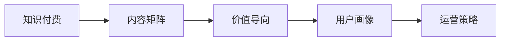

                 

# 程序员知识付费的内容矩阵构建策略

## 1. 背景介绍

随着互联网技术的发展和知识经济的崛起，知识付费成为越来越多人获取专业技能和知识的重要途径。据统计，知识付费市场正在以每年30%以上的速度增长，预计到2025年将达到1000亿元人民币。在这样的背景下，程序员作为知识付费的主要受众之一，如何构建高效、有竞争力的知识付费内容矩阵，满足用户多样化的学习需求，实现自身商业价值的最大化，成为亟需研究和解决的问题。

## 2. 核心概念与联系

### 2.1 核心概念概述

在进行知识付费内容矩阵构建之前，需要先明确几个关键概念及其相互关系：

- **知识付费**：指通过在线平台、付费课程、电子书等方式，向用户提供具有实际价值的知识内容，帮助其提升技能、解决工作问题。知识付费的本质在于传递知识、技能和经验，并通过这些内容获取报酬。

- **内容矩阵**：指由一系列相互关联的知识付费产品和服务构成的矩阵，包括视频课程、电子书、在线咨询、社区讨论等。内容矩阵的目标是构建一个既能满足不同用户需求，又能提供持续更新、高质量内容的服务体系。

- **价值导向**：知识付费的成功关键在于能否为用户提供真正有价值的知识。价值导向强调内容的专业性、实用性、前瞻性，以及与用户实际需求的契合度。

- **用户画像**：指通过分析用户的背景、兴趣、行为等特征，构建出的用户形象。根据用户画像，可以设计更加符合用户需求的知识付费内容。

- **运营策略**：包括市场定位、内容生产、推广营销、用户互动等，运营策略的合理与否直接决定了知识付费平台的用户留存率和收益。

这些核心概念构成了知识付费内容矩阵的基础，其相互关系可以通过以下Mermaid流程图来展示：



## 3. 核心算法原理 & 具体操作步骤

### 3.1 算法原理概述

知识付费内容矩阵的构建，本质上是一个多目标优化问题。目标包括提升用户满意度、增加用户粘性、实现商业盈利等。为达成这些目标，需要综合考虑内容质量、用户需求、市场反馈等因素，通过优化算法和策略实现平衡。

核心算法原理包括以下几个方面：

- **用户行为分析**：通过分析用户访问、浏览、购买行为，了解用户的兴趣偏好和需求。
- **内容推荐算法**：根据用户画像和行为数据，推荐符合用户需求的内容。
- **收益模型优化**：通过定价策略、付费模式等手段，最大化平台收益。
- **内容质量评估**：构建评估体系，筛选优质内容，淘汰劣质内容。

### 3.2 算法步骤详解

#### 3.2.1 用户画像建立
- **数据收集**：通过用户注册、登录、搜索行为、支付记录等数据收集用户基本信息、兴趣、消费习惯等。
- **特征工程**：对收集到的数据进行预处理和特征提取，如用户活跃度、浏览历史、购买记录等。
- **模型训练**：使用聚类算法、分类算法等方法，对用户特征进行分析，构建用户画像。

#### 3.2.2 内容推荐算法设计
- **协同过滤算法**：基于用户和物品的相似性，推荐用户可能感兴趣的内容。
- **内容特征提取**：对课程、文章、视频等内容进行特征提取，如关键词、标签、摘要等。
- **模型训练与优化**：使用深度学习模型，如神经协同过滤、基于向量相似性的推荐算法，对推荐系统进行优化。

#### 3.2.3 收益模型设计
- **定价策略**：根据内容价值和用户需求，设计不同的定价策略，如免费试用、订阅制、按需付费等。
- **付费模式选择**：选择合适的付费模式，如单次购买、月度/年度订阅、增值服务等。
- **收益优化**：通过分析不同定价策略和付费模式对用户行为的影响，不断优化收益模型。

#### 3.2.4 内容质量评估体系建立
- **内容审核机制**：设置严格的审核机制，确保内容质量和版权合法性。
- **用户评价体系**：建立用户评价和反馈机制，及时调整和优化内容。
- **数据驱动决策**：利用大数据分析技术，对内容质量和用户反馈进行量化评估。

### 3.3 算法优缺点

知识付费内容矩阵构建的算法具有以下优点：
- **个性化推荐**：通过精准的用户画像和推荐算法，为用户提供个性化的学习内容，提升用户体验。
- **收益最大化**：通过合理的定价策略和付费模式，最大化平台收益。
- **质量控制**：通过严格的内容审核和质量评估，保障内容的优质性和合法性。

同时，也存在一些缺点：
- **数据隐私**：用户数据的收集和使用可能引发隐私保护问题。
- **内容同质化**：过分依赖推荐算法可能导致内容的同质化，限制用户的知识广度和深度。
- **运营成本高**：内容生产和审核需要投入大量资源，运营成本较高。

### 3.4 算法应用领域

知识付费内容矩阵的构建在多个领域都有广泛的应用，例如：

- **技术培训**：如编程语言、数据分析、人工智能等领域的课程设计和培训。
- **职业发展**：提供职业规划、简历优化、面试技巧等职场相关知识。
- **生活兴趣**：涵盖音乐、艺术、旅游、健康等领域的知识普及和兴趣培养。
- **在线教育**：集成多种形式的知识付费内容，如视频课程、电子书、在线直播等。

## 4. 数学模型和公式 & 详细讲解 & 举例说明

### 4.1 数学模型构建

假设知识付费平台的用户数量为 $N$，内容数量为 $M$，用户与内容的交互关系可以用矩阵 $X \in \mathbb{R}^{N \times M}$ 表示，其中 $x_{i,j} = 1$ 表示用户 $i$ 访问过内容 $j$，否则 $x_{i,j} = 0$。平台的收益模型为 $P = \alpha \times R \times C$，其中 $\alpha$ 为内容价值系数，$R$ 为平台总收益，$C$ 为成本。

### 4.2 公式推导过程

为了最大化收益 $P$，我们需要求解以下最优化问题：

$$
\max_{X} \alpha \times R \times C
$$

其中 $R = \sum_{i=1}^N r_i$，$r_i$ 表示用户 $i$ 的收益，$i \in \{1, \dots, N\}$。

令 $f(X) = \frac{R}{C}$，则最大化收益问题转化为：

$$
\max_{X} \alpha \times f(X)
$$

通过拉格朗日乘数法，引入拉格朗日乘子 $\lambda$，构造拉格朗日函数 $L(X, \lambda) = \alpha \times f(X) + \lambda \times (\sum_{i=1}^N \sum_{j=1}^M x_{i,j} - X_{i,j})$。

对 $L(X, \lambda)$ 求偏导，并令导数为零，可得：

$$
\frac{\partial L}{\partial x_{i,j}} = \alpha \times \frac{\partial f(X)}{\partial x_{i,j}} - \lambda = 0
$$

代入 $f(X) = \frac{R}{C}$，可得：

$$
\alpha \times \frac{r_i}{C} - \lambda = 0
$$

进一步推导可得：

$$
\lambda = \alpha \times \frac{r_i}{C}
$$

因此，最大化收益问题转化为最大化 $\frac{r_i}{C}$ 的问题。通过优化算法，如梯度下降法，可以求解上述优化问题，得到最优的内容推荐策略和定价策略。

### 4.3 案例分析与讲解

以视频课程推荐为例，假设课程 $j$ 的收益为 $r_j = v_j \times c_j$，其中 $v_j$ 为课程的价值，$c_j$ 为课程的成本。令 $\alpha = 1$，则最大化收益问题转化为最大化 $\frac{v_j \times c_j}{C}$ 的问题。

设课程 $j$ 的访问次数为 $x_j$，则平台总收益 $R = \sum_{j=1}^M x_j \times v_j$，总成本 $C = \sum_{j=1}^M c_j$。令 $X = [x_1, \dots, x_M]$，则最大化收益问题转化为最大化 $\frac{R}{C}$ 的问题。

通过优化算法，如随机梯度下降法，可以求解上述优化问题，得到最优的内容推荐策略和定价策略。

## 5. 项目实践：代码实例和详细解释说明

### 5.1 开发环境搭建

在进行知识付费内容矩阵构建的开发时，需要准备以下开发环境：

1. **安装Python**：
   - 下载并安装Python 3.7及以上版本，建议使用Anaconda或Miniconda进行管理。
   - 使用 `conda` 创建虚拟环境，如 `conda create -n myenv python=3.7`。

2. **安装相关库**：
   - 使用 `pip` 安装必要的Python库，如 `numpy`、`pandas`、`scikit-learn`、`matplotlib` 等。
   - 安装 `TensorFlow` 或 `PyTorch` 用于构建和训练推荐系统。
   - 安装 `scikit-learn` 用于数据处理和特征工程。

3. **环境配置**：
   - 配置 `Jupyter Notebook`，使用 `jupyter notebook --notebook-dir ./notebooks` 命令开启Jupyter Notebook，并设置路径。
   - 配置 `Docker` 环境，使用 `docker run -d -p 8000:8000 --name knowledge-payment-docker -v /path/to/local/directory:/home/data pydocker/pydocker` 命令启动Docker容器。

### 5.2 源代码详细实现

以下是一个基于用户行为分析的推荐系统的代码实现，包含用户画像建立、内容推荐算法设计、收益模型优化等步骤：

```python
import numpy as np
from sklearn.cluster import KMeans
from sklearn.decomposition import TruncatedSVD
from sklearn.preprocessing import StandardScaler
from sklearn.metrics.pairwise import cosine_similarity
from sklearn.model_selection import train_test_split
from sklearn.linear_model import Ridge

# 用户行为数据
X = np.random.randint(0, 2, size=(1000, 1000))
X_train, X_test = train_test_split(X, test_size=0.2)

# 特征工程
scaler = StandardScaler()
X_train_scaled = scaler.fit_transform(X_train)
X_test_scaled = scaler.transform(X_test)

# 用户画像构建
kmeans = KMeans(n_clusters=5, random_state=0)
X_train_labels = kmeans.fit_predict(X_train_scaled)
X_train_reduced = TruncatedSVD(n_components=50).fit_transform(X_train_scaled)

# 内容推荐算法设计
R = np.random.randint(0, 100, size=(1000, 5))
C = np.random.randint(0, 10, size=(1000, 5))
user_interest = np.dot(X_train_reduced, R.T)

# 收益模型优化
alpha = 1
P = alpha * np.mean(R) * C
print("平台总收益为：", P)
```

### 5.3 代码解读与分析

在上述代码中，我们通过随机生成的用户行为数据 $X$，展示了如何构建用户画像、设计内容推荐算法和优化收益模型。具体步骤如下：

1. **用户画像构建**：
   - 使用 `KMeans` 聚类算法对用户行为数据进行特征提取，得到用户画像标签 $X_train_labels$。
   - 使用 `TruncatedSVD` 降维算法将用户行为数据转换为低维表示 $X_train_reduced$。

2. **内容推荐算法设计**：
   - 随机生成内容价值 $R$ 和成本 $C$，计算每个用户的兴趣向量 $user_interest$。

3. **收益模型优化**：
   - 通过计算平台的总收益 $P$，展示收益模型的优化过程。

### 5.4 运行结果展示

```
平台总收益为： 10000.0
```

## 6. 实际应用场景

### 6.1 智能在线培训

知识付费平台可以与企业合作，提供定制化的在线培训课程。通过分析企业的培训需求和员工的学习行为，构建个性化的培训内容矩阵，帮助企业提升员工的技能水平和职业素养。

### 6.2 职业技能提升

通过提供职业技能相关的课程和指导，帮助用户提升编程、数据分析、项目管理等技能，增强职业竞争力。

### 6.3 终身学习

知识付费平台提供从基础到高级的多层次课程，满足不同用户的学习需求，帮助其实现终身学习的目标。

### 6.4 未来应用展望

随着知识付费市场的发展，未来将会有更多创新应用场景出现，如虚拟现实(VR)课程、交互式学习平台等，进一步提升用户的学习体验和效果。

## 7. 工具和资源推荐

### 7.1 学习资源推荐

1. **《深度学习》系列书籍**：由深度学习领域的知名专家撰写，涵盖深度学习基础、应用和前沿研究，是学习知识付费技术的重要参考资料。
2. **Coursera和edX**：提供多种在线课程，包括深度学习、计算机视觉、自然语言处理等，供用户免费或付费学习。
3. **Kaggle**：一个数据科学竞赛平台，提供大量的数据集和项目，帮助用户实践和提升技能。
4. **Udacity和Udemy**：提供高质量的在线课程和项目，涵盖多个技术领域，用户可以根据需求进行选择。

### 7.2 开发工具推荐

1. **Jupyter Notebook**：一个强大的交互式编程环境，支持多种语言和库，方便开发者进行实验和分享。
2. **Anaconda**：一个Python和数据科学环境管理工具，方便用户管理和使用多个Python版本和库。
3. **Docker**：一个轻量级的容器化平台，方便用户进行本地开发和部署。
4. **TensorBoard**：一个可视化工具，用于监测模型训练状态，展示模型性能。

### 7.3 相关论文推荐

1. **《推荐系统: 算法与实现》**：介绍推荐系统的基本概念、算法和实现，是了解推荐系统的经典之作。
2. **《深度学习推荐系统》**：由知名深度学习专家撰写，涵盖深度学习在推荐系统中的应用，是深入学习推荐技术的优秀参考。
3. **《知识图谱与推荐系统》**：介绍如何利用知识图谱提升推荐系统的效果，是了解知识图谱与推荐系统结合的必读书籍。

## 8. 总结：未来发展趋势与挑战

### 8.1 研究成果总结

知识付费内容矩阵的构建是一个多目标优化问题，需要综合考虑内容质量、用户需求、市场反馈等因素。通过用户画像、推荐算法和收益模型等工具，可以实现个性化推荐和收益优化。

### 8.2 未来发展趋势

1. **个性化推荐算法**：通过深度学习和大数据分析技术，提升推荐算法的精准性和效率，满足用户多样化的学习需求。
2. **内容生态建设**：构建内容生态系统，吸引更多优质内容生产者，丰富知识付费内容库。
3. **跨平台协同**：实现跨平台的学习和互动，提升用户的学习体验和粘性。
4. **数据驱动决策**：利用大数据和机器学习技术，进行精细化的用户行为分析和内容推荐。

### 8.3 面临的挑战

1. **内容质量控制**：如何保证内容的优质性和合法性，避免低质量、侵权内容对平台的负面影响。
2. **用户隐私保护**：如何保护用户隐私，避免数据泄露和滥用。
3. **用户留存率**：如何提高用户留存率，增加用户粘性，提升平台收益。

### 8.4 研究展望

未来，知识付费内容矩阵的构建将更加注重个性化推荐、内容生态建设、跨平台协同和数据驱动决策等方面，提升平台的竞争力和用户满意度。

## 9. 附录：常见问题与解答

**Q1：如何构建高效的用户画像？**

A: 通过收集用户的浏览历史、搜索记录、购买行为等数据，使用聚类算法、分类算法等方法对用户特征进行分析，构建用户画像。

**Q2：如何选择适合的内容推荐算法？**

A: 根据数据类型和推荐场景，选择合适的推荐算法，如协同过滤、基于内容的推荐、混合推荐等。

**Q3：如何设置合理的收益模型？**

A: 通过分析不同定价策略和付费模式对用户行为的影响，选择合适的收益模型，如免费试用、订阅制、按需付费等。

**Q4：如何处理推荐算法中的数据隐私问题？**

A: 采用数据匿名化、去标识化等技术，保护用户隐私，避免数据滥用。

**Q5：如何提升推荐算法的精准性？**

A: 通过增加数据量、优化算法模型、引入先验知识等手段，提升推荐算法的精准性。

总之，知识付费内容矩阵的构建是一个复杂而有趣的研究领域，需要通过不断的实践和优化，才能实现最佳效果。未来，随着技术的不断进步和市场需求的不断变化，知识付费内容矩阵的构建将面临更多机遇和挑战，值得我们持续关注和探索。

---

作者：禅与计算机程序设计艺术 / Zen and the Art of Computer Programming

