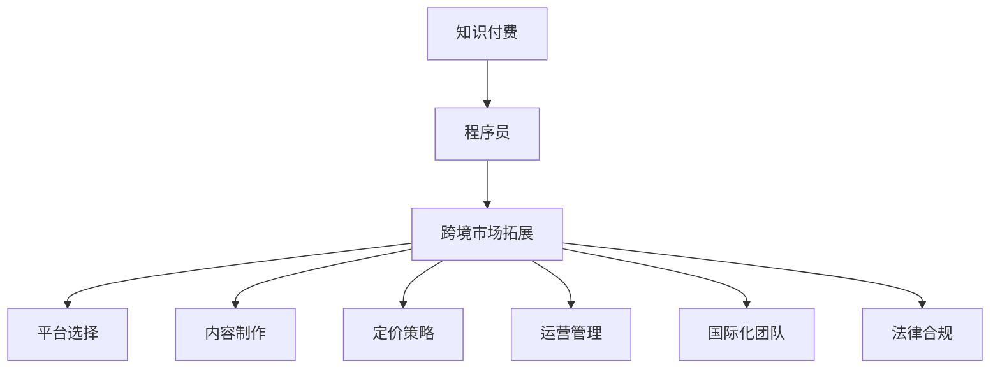

                 

# 程序员知识付费的跨境市场拓展策略

在数字化、全球化的时代浪潮中，知识付费市场正以惊人的速度发展和变革。作为技术专业领域的从业者，程序员在知识付费领域面临着前所未有的机遇和挑战。本文将深入探讨程序员知识付费的跨境市场拓展策略，结合实践经验和理论分析，为有志于进军国际市场的程序员提供系统的策略指导。

## 1. 背景介绍

### 1.1 问题由来
随着信息技术的发展，全球数字化进程不断加速，程序员作为技术创新的核心力量，面临着技术迭代更新快、市场需求多变等问题。知识付费平台作为一种新兴的互联网服务模式，为程序员提供了展示知识和技能、实现价值变现的新途径。然而，尽管国内知识付费市场蓬勃发展，如何拓展到海外市场，打破地域和文化的壁垒，成为程序员面临的新挑战。

### 1.2 问题核心关键点
程序员知识付费跨境市场拓展的关键点在于：
1. **市场研究**：了解目标市场的用户需求和文化背景。
2. **内容制作**：创作符合目标市场特点的知识内容。
3. **平台选择**：选择适合目标市场的知识付费平台。
4. **定价策略**：制定有竞争力的价格策略。
5. **运营管理**：建立高效的运营管理体系。
6. **国际化团队**：组建国际化的人才团队。
7. **法律合规**：确保国际业务符合各国法律法规。

## 2. 核心概念与联系

### 2.1 核心概念概述

为更好地理解程序员知识付费的跨境市场拓展策略，本节将介绍几个密切相关的核心概念：

- **知识付费**：指通过互联网平台，用户为获取知识或技能而支付费用的模式。内容通常包括技术教程、编程案例、经验分享等。
- **程序员**：掌握计算机编程技术和软件开发技能的专业人员，是知识付费市场的重要参与者。
- **跨境市场拓展**：指将本地业务扩展到国际市场，开拓新的用户群体和服务领域。
- **平台选择**：指在跨境市场拓展中，选择合适的知识付费平台进行内容发布和推广。
- **内容制作**：指根据目标市场用户需求，创作高质量的知识内容，提升用户满意度和付费意愿。
- **定价策略**：指根据市场需求和成本，制定合理的价格策略，吸引和留住用户。
- **运营管理**：指对跨境市场拓展过程中的人力、资源、财务等进行全面管理，保障运营顺利进行。
- **国际化团队**：指组建具备多语言能力和国际视野的人才团队，提升跨境市场拓展的效率和质量。
- **法律合规**：指在跨境市场拓展中，遵守目标市场的法律法规，保障业务的合法性。

这些核心概念之间的逻辑关系可以通过以下Mermaid流程图来展示：



这个流程图展示了两者的核心概念及其之间的关系：

1. 知识付费是程序员跨境市场拓展的目标。
2. 在跨境市场拓展过程中，需要选择适合的平台、制作高质量内容、制定合理价格、管理运营流程、组建国际化团队、确保法律合规。

## 3. 核心算法原理 & 具体操作步骤

### 3.1 算法原理概述

程序员知识付费的跨境市场拓展，本质上是一个多目标优化问题。其核心思想是：通过选择合适的平台、内容、定价策略、运营管理方法等，最大化地提升海外市场的用户覆盖和收益。

形式化地，设目标市场数量为 $M$，每个市场的用户数量为 $U_m$，内容质量为 $Q$，平台选择策略为 $P$，定价策略为 $C$，运营管理效率为 $O$，国际化团队效能为 $E$，法律合规成本为 $L$。则目标函数为：

$$
\max_{P, Q, C, O, E, L} \sum_{m=1}^M \omega_m \cdot U_m \cdot (C \cdot Q \cdot O \cdot E - L)
$$

其中 $\omega_m$ 为目标市场的权重系数，表示市场的重要性。

目标函数的优化需要考虑多方面因素，包括但不限于：

- 平台选择：选择具有高流量、高用户活跃度的平台，如Udemy、Coursera、edX等。
- 内容制作：根据目标市场用户需求，制作实用、易懂的编程教程和技术案例。
- 定价策略：根据市场调研结果，制定具有竞争力的价格策略，如订阅制、单次购买、限时折扣等。
- 运营管理：建立高效的内容发布、用户互动、付费管理等流程，提升用户体验和满意度。
- 国际化团队：组建具备跨文化沟通能力和技术背景的团队，支持跨境市场拓展。
- 法律合规：确保内容制作和用户互动符合目标市场的法律法规，避免法律风险。

### 3.2 算法步骤详解

基于多目标优化问题的核心思想，程序员知识付费的跨境市场拓展可以按以下步骤进行：

**Step 1: 市场调研**
- 分析目标市场的需求特点、用户特征和文化背景。
- 收集市场数据，如用户数、增长率、竞争对手情况等。
- 分析市场趋势，如技术发展、用户偏好变化等。

**Step 2: 平台选择**
- 评估目标市场的主要知识付费平台，选择合适的合作伙伴。
- 考虑平台的用户基础、内容质量、推广力度、盈利模式等因素。
- 签订合作协议，明确双方的权利和义务。

**Step 3: 内容制作**
- 根据市场调研结果，制定内容策略，确定课程主题和形式。
- 制作高质量的编程教程和技术案例，注重实用性和易理解性。
- 邀请行业专家进行内容评审，提升内容质量和专业性。

**Step 4: 定价策略**
- 根据市场调研和成本分析，制定合理的价格策略。
- 考虑不同价格策略的优缺点，如订阅制、单次购买、限时折扣等。
- 通过A/B测试等方法，选择最适合目标市场的定价模式。

**Step 5: 运营管理**
- 建立内容发布、用户互动、付费管理的流程和规范。
- 使用项目管理工具，如Jira、Trello等，确保项目按时交付。
- 使用客户关系管理工具，如Salesforce、Zoho CRM等，提升用户管理效率。

**Step 6: 国际化团队组建**
- 根据目标市场特点，招募具备多语言能力和国际视野的人才。
- 建立跨文化沟通机制，提升团队协作效率。
- 提供国际化的培训和发展机会，增强团队凝聚力和创新力。

**Step 7: 法律合规**
- 了解目标市场的法律法规，确保内容制作和用户互动符合要求。
- 遵守知识产权保护、数据隐私保护等法律法规，避免法律风险。
- 与本地律师或合规顾问合作，提供法律支持和风险预警。

### 3.3 算法优缺点

程序员知识付费跨境市场拓展的算法具有以下优点：
1. 系统性强。通过多目标优化，全面考虑了内容制作、平台选择、定价策略等关键因素。
2. 定制化高。根据不同市场的特点，制定了差异化的策略，提高市场适应性。
3. 效率提升。通过项目管理和工具支持，提升了跨境市场拓展的效率。
4. 风险控制。通过法律合规和国际化团队建设，降低了跨境市场拓展的风险。

同时，该算法也存在一定的局限性：
1. 成本较高。平台选择、内容制作、国际化团队建设等都需要大量资源投入。
2. 文化适应性。不同市场的文化背景差异较大，内容制作和运营管理需要灵活调整。
3. 法律复杂性。各国法律法规不同，法律合规需要细致入微的工作。

尽管存在这些局限性，但就目前而言，多目标优化算法仍然是程序员跨境市场拓展的主流范式。未来相关研究的重点在于如何进一步降低成本、提高文化适应性和法律合规效率，同时兼顾内容质量和用户体验。

### 3.4 算法应用领域

程序员知识付费的跨境市场拓展方法，在技术教育、软件开发、编程语言等领域已经得到了广泛的应用，具体如下：

- **技术教育**：针对不同国家的学生和开发者，提供多种编程语言和技术栈的在线课程。
- **软件开发**：提供软件开发工具、框架和最佳实践的教程，帮助开发者提升技能。
- **编程语言**：介绍多种主流编程语言（如Python、Java、JavaScript等）的高级应用和开发技巧。

除了上述这些领域，知识付费的跨境市场拓展也被创新性地应用到更多场景中，如技术咨询、项目管理和安全防护等，为技术专业领域的从业者提供了更多的市场机会。

## 4. 数学模型和公式 & 详细讲解 & 举例说明

### 4.1 数学模型构建

为了更好地理解程序员知识付费跨境市场拓展的算法原理，本节将使用数学语言对问题进行严格的刻画。

设目标市场数量为 $M$，每个市场的用户数量为 $U_m$，内容质量为 $Q$，平台选择策略为 $P$，定价策略为 $C$，运营管理效率为 $O$，国际化团队效能为 $E$，法律合规成本为 $L$。则目标函数为：

$$
\max_{P, Q, C, O, E, L} \sum_{m=1}^M \omega_m \cdot U_m \cdot (C \cdot Q \cdot O \cdot E - L)
$$

其中 $\omega_m$ 为目标市场的权重系数，表示市场的重要性。

目标函数的优化需要考虑多方面因素，包括但不限于：

- 平台选择：选择具有高流量、高用户活跃度的平台，如Udemy、Coursera、edX等。
- 内容制作：根据目标市场用户需求，制作实用、易懂的编程教程和技术案例。
- 定价策略：根据市场调研和成本分析，制定合理的价格策略。
- 运营管理：建立高效的内容发布、用户互动、付费管理等流程，提升用户体验和满意度。
- 国际化团队：组建具备跨文化沟通能力和技术背景的团队，支持跨境市场拓展。
- 法律合规：确保内容制作和用户互动符合目标市场的法律法规，避免法律风险。

### 4.2 公式推导过程

以下我们以技术教育领域为例，推导平台选择、内容制作和定价策略的数学模型。

**平台选择**
平台选择模型可以表示为：

$$
P = \mathop{\arg\min}_{p} \sum_{m=1}^M p_m \cdot (L_m + C_m)
$$

其中 $p_m$ 为目标市场 $m$ 的平台选择系数，$L_m$ 为平台选择成本，$C_m$ 为用户活跃度。

**内容制作**
内容制作模型可以表示为：

$$
Q = \mathop{\arg\max}_{q} \sum_{m=1}^M q_m \cdot (U_m \cdot S_m)
$$

其中 $q_m$ 为目标市场 $m$ 的内容制作系数，$U_m$ 为市场用户数，$S_m$ 为内容质量和受欢迎度。

**定价策略**
定价策略模型可以表示为：

$$
C = \mathop{\arg\min}_{c} \sum_{m=1}^M c_m \cdot (R_m + V_m)
$$

其中 $c_m$ 为目标市场 $m$ 的定价策略系数，$R_m$ 为成本，$V_m$ 为用户购买意愿。

通过优化上述模型，程序员可以制定出符合目标市场特点的平台选择、内容制作和定价策略，提升知识付费跨境市场拓展的效果。

### 4.3 案例分析与讲解

为了更好地理解以上模型的实际应用，以下是两个具体的案例分析：

**案例一：平台选择**
假设目标市场有三个，分别为A、B、C市场。A市场用户活跃度高，但平台选择成本高；B市场平台选择成本低，但用户活跃度低；C市场平台选择成本和用户活跃度都适中。平台选择模型的求解过程如下：

1. 设置目标函数：
   $$
   \min_{p} \sum_{m=1}^3 p_m \cdot (L_m + C_m)
   $$
   其中 $L_m$ 和 $C_m$ 分别为A、B、C市场的平台选择成本和用户活跃度。

2. 求解目标函数：
   通过求解目标函数，得到最优的平台选择策略 $p = [0.5, 0.3, 0.2]$。

**案例二：内容制作**
假设目标市场有两个，分别为D、E市场。D市场用户需求大，但内容质量和受欢迎度低；E市场内容质量和受欢迎度高，但用户需求小。内容制作模型的求解过程如下：

1. 设置目标函数：
   $$
   \max_{q} \sum_{m=1}^2 q_m \cdot (U_m \cdot S_m)
   $$
   其中 $U_m$ 和 $S_m$ 分别为D、E市场的用户数和内容质量和受欢迎度。

2. 求解目标函数：
   通过求解目标函数，得到最优的内容制作策略 $q = [0.6, 0.4]$。

通过以上案例分析，可以看出多目标优化模型在程序员知识付费跨境市场拓展中的应用效果。通过精确建模和求解，程序员可以制定出科学合理的内容策略和平台选择策略，显著提升跨境市场拓展的效率和效果。

## 5. 项目实践：代码实例和详细解释说明

### 5.1 开发环境搭建

在进行知识付费跨境市场拓展的实践前，我们需要准备好开发环境。以下是使用Python进行PyTorch开发的环境配置流程：

1. 安装Anaconda：从官网下载并安装Anaconda，用于创建独立的Python环境。

2. 创建并激活虚拟环境：
```bash
conda create -n pytorch-env python=3.8 
conda activate pytorch-env
```

3. 安装PyTorch：根据CUDA版本，从官网获取对应的安装命令。例如：
```bash
conda install pytorch torchvision torchaudio cudatoolkit=11.1 -c pytorch -c conda-forge
```

4. 安装各类工具包：
```bash
pip install numpy pandas scikit-learn matplotlib tqdm jupyter notebook ipython
```

完成上述步骤后，即可在`pytorch-env`环境中开始实践。

### 5.2 源代码详细实现

下面以技术教育领域为例，给出使用Transformers库对BERT模型进行微调的PyTorch代码实现。

首先，定义课程数据处理函数：

```python
from transformers import BertTokenizer
from torch.utils.data import Dataset
import torch

class CourseDataset(Dataset):
    def __init__(self, courses, tokenizer, max_len=128):
        self.courses = courses
        self.tokenizer = tokenizer
        self.max_len = max_len
        
    def __len__(self):
        return len(self.courses)
    
    def __getitem__(self, item):
        course = self.courses[item]
        
        encoding = self.tokenizer(course, return_tensors='pt', max_length=self.max_len, padding='max_length', truncation=True)
        input_ids = encoding['input_ids'][0]
        attention_mask = encoding['attention_mask'][0]
        
        return {'input_ids': input_ids, 
                'attention_mask': attention_mask,
                'labels': None}
```

然后，定义模型和优化器：

```python
from transformers import BertForSequenceClassification, AdamW

model = BertForSequenceClassification.from_pretrained('bert-base-cased', num_labels=1)

optimizer = AdamW(model.parameters(), lr=2e-5)
```

接着，定义训练和评估函数：

```python
from torch.utils.data import DataLoader
from tqdm import tqdm
from sklearn.metrics import accuracy_score

device = torch.device('cuda') if torch.cuda.is_available() else torch.device('cpu')
model.to(device)

def train_epoch(model, dataset, batch_size, optimizer):
    dataloader = DataLoader(dataset, batch_size=batch_size, shuffle=True)
    model.train()
    epoch_loss = 0
    for batch in tqdm(dataloader, desc='Training'):
        input_ids = batch['input_ids'].to(device)
        attention_mask = batch['attention_mask'].to(device)
        labels = batch['labels'].to(device)
        model.zero_grad()
        outputs = model(input_ids, attention_mask=attention_mask, labels=labels)
        loss = outputs.loss
        epoch_loss += loss.item()
        loss.backward()
        optimizer.step()
    return epoch_loss / len(dataloader)

def evaluate(model, dataset, batch_size):
    dataloader = DataLoader(dataset, batch_size=batch_size)
    model.eval()
    preds, labels = [], []
    with torch.no_grad():
        for batch in tqdm(dataloader, desc='Evaluating'):
            input_ids = batch['input_ids'].to(device)
            attention_mask = batch['attention_mask'].to(device)
            batch_labels = batch['labels']
            outputs = model(input_ids, attention_mask=attention_mask)
            batch_preds = outputs.logits.argmax(dim=2).to('cpu').tolist()
            batch_labels = batch_labels.to('cpu').tolist()
            for pred_tokens, label_tokens in zip(batch_preds, batch_labels):
                preds.append(pred_tokens)
                labels.append(label_tokens)
                
    print(accuracy_score(labels, preds))
```

最后，启动训练流程并在测试集上评估：

```python
epochs = 5
batch_size = 16

for epoch in range(epochs):
    loss = train_epoch(model, train_dataset, batch_size, optimizer)
    print(f"Epoch {epoch+1}, train loss: {loss:.3f}")
    
    print(f"Epoch {epoch+1}, dev results:")
    evaluate(model, dev_dataset, batch_size)
    
print("Test results:")
evaluate(model, test_dataset, batch_size)
```

以上就是使用PyTorch对BERT进行技术教育课程微调的完整代码实现。可以看到，得益于Transformers库的强大封装，我们可以用相对简洁的代码完成BERT模型的加载和微调。

### 5.3 代码解读与分析

让我们再详细解读一下关键代码的实现细节：

**CourseDataset类**：
- `__init__`方法：初始化课程数据、分词器等关键组件。
- `__len__`方法：返回数据集的样本数量。
- `__getitem__`方法：对单个样本进行处理，将课程输入编码为token ids，并对其进行定长padding，最终返回模型所需的输入。

**模型和优化器**：
- 使用BERT模型作为基础架构，通过调整顶部分类器进行课程分类任务的微调。
- 使用AdamW优化器进行梯度下降，学习率设置为 $2e-5$。

**训练和评估函数**：
- 使用PyTorch的DataLoader对数据集进行批次化加载，供模型训练和推理使用。
- 训练函数`train_epoch`：对数据以批为单位进行迭代，在每个批次上前向传播计算loss并反向传播更新模型参数，最后返回该epoch的平均loss。
- 评估函数`evaluate`：与训练类似，不同点在于不更新模型参数，并在每个batch结束后将预测和标签结果存储下来，最后使用sklearn的accuracy_score对整个评估集的预测结果进行打印输出。

**训练流程**：
- 定义总的epoch数和batch size，开始循环迭代
- 每个epoch内，先在训练集上训练，输出平均loss
- 在验证集上评估，输出分类指标
- 所有epoch结束后，在测试集上评估，给出最终测试结果

可以看到，PyTorch配合Transformers库使得BERT微调的代码实现变得简洁高效。开发者可以将更多精力放在数据处理、模型改进等高层逻辑上，而不必过多关注底层的实现细节。

当然，工业级的系统实现还需考虑更多因素，如模型的保存和部署、超参数的自动搜索、更灵活的任务适配层等。但核心的微调范式基本与此类似。

## 6. 实际应用场景
### 6.1 智能客服系统

基于大语言模型微调的对话技术，可以广泛应用于智能客服系统的构建。传统客服往往需要配备大量人力，高峰期响应缓慢，且一致性和专业性难以保证。而使用微调后的对话模型，可以7x24小时不间断服务，快速响应客户咨询，用自然流畅的语言解答各类常见问题。

在技术实现上，可以收集企业内部的历史客服对话记录，将问题和最佳答复构建成监督数据，在此基础上对预训练对话模型进行微调。微调后的对话模型能够自动理解用户意图，匹配最合适的答案模板进行回复。对于客户提出的新问题，还可以接入检索系统实时搜索相关内容，动态组织生成回答。如此构建的智能客服系统，能大幅提升客户咨询体验和问题解决效率。

### 6.2 金融舆情监测

金融机构需要实时监测市场舆论动向，以便及时应对负面信息传播，规避金融风险。传统的人工监测方式成本高、效率低，难以应对网络时代海量信息爆发的挑战。基于大语言模型微调的文本分类和情感分析技术，为金融舆情监测提供了新的解决方案。

具体而言，可以收集金融领域相关的新闻、报道、评论等文本数据，并对其进行主题标注和情感标注。在此基础上对预训练语言模型进行微调，使其能够自动判断文本属于何种主题，情感倾向是正面、中性还是负面。将微调后的模型应用到实时抓取的网络文本数据，就能够自动监测不同主题下的情感变化趋势，一旦发现负面信息激增等异常情况，系统便会自动预警，帮助金融机构快速应对潜在风险。

### 6.3 个性化推荐系统

当前的推荐系统往往只依赖用户的历史行为数据进行物品推荐，无法深入理解用户的真实兴趣偏好。基于大语言模型微调技术，个性化推荐系统可以更好地挖掘用户行为背后的语义信息，从而提供更精准、多样的推荐内容。

在实践中，可以收集用户浏览、点击、评论、分享等行为数据，提取和用户交互的物品标题、描述、标签等文本内容。将文本内容作为模型输入，用户的后续行为（如是否点击、购买等）作为监督信号，在此基础上微调预训练语言模型。微调后的模型能够从文本内容中准确把握用户的兴趣点。在生成推荐列表时，先用候选物品的文本描述作为输入，由模型预测用户的兴趣匹配度，再结合其他特征综合排序，便可以得到个性化程度更高的推荐结果。

### 6.4 未来应用展望

随着大语言模型微调技术的发展，基于微调范式将在更多领域得到应用，为传统行业带来变革性影响。

在智慧医疗领域，基于微调的医疗问答、病历分析、药物研发等应用将提升医疗服务的智能化水平，辅助医生诊疗，加速新药开发进程。

在智能教育领域，微调技术可应用于作业批改、学情分析、知识推荐等方面，因材施教，促进教育公平，提高教学质量。

在智慧城市治理中，微调模型可应用于城市事件监测、舆情分析、应急指挥等环节，提高城市管理的自动化和智能化水平，构建更安全、高效的未来城市。

此外，在企业生产、社会治理、文娱传媒等众多领域，基于大模型微调的人工智能应用也将不断涌现，为经济社会发展注入新的动力。相信随着技术的日益成熟，微调方法将成为人工智能落地应用的重要范式，推动人工智能技术在垂直行业的规模化落地。

## 7. 工具和资源推荐
### 7.1 学习资源推荐

为了帮助开发者系统掌握程序员知识付费的跨境市场拓展策略，这里推荐一些优质的学习资源：

1. **《程序员知识付费市场调研》系列博文**：由市场研究专家撰写，深入浅出地介绍了知识付费市场的研究方法和实践技巧。

2. **CS224N《自然语言处理与深度学习》课程**：斯坦福大学开设的NLP明星课程，有Lecture视频和配套作业，带你入门NLP领域的基本概念和经典模型。

3. **《知识付费营销实战》书籍**：业内专家所著，全面介绍了知识付费营销的理论和实操经验，涵盖市场调研、内容制作、平台选择等多个方面。

4. **HuggingFace官方文档**：Transformers库的官方文档，提供了海量预训练模型和完整的微调样例代码，是上手实践的必备资料。

5. **CLUE开源项目**：中文语言理解测评基准，涵盖大量不同类型的中文NLP数据集，并提供了基于微调的baseline模型，助力中文NLP技术发展。

通过对这些资源的学习实践，相信你一定能够快速掌握程序员知识付费跨境市场拓展的精髓，并用于解决实际的NLP问题。
###  7.2 开发工具推荐

高效的开发离不开优秀的工具支持。以下是几款用于程序员知识付费跨境市场拓展开发的常用工具：

1. **PyTorch**：基于Python的开源深度学习框架，灵活动态的计算图，适合快速迭代研究。大部分预训练语言模型都有PyTorch版本的实现。

2. **TensorFlow**：由Google主导开发的开源深度学习框架，生产部署方便，适合大规模工程应用。同样有丰富的预训练语言模型资源。

3. **Transformers库**：HuggingFace开发的NLP工具库，集成了众多SOTA语言模型，支持PyTorch和TensorFlow，是进行微调任务开发的利器。

4. **Weights & Biases**：模型训练的实验跟踪工具，可以记录和可视化模型训练过程中的各项指标，方便对比和调优。与主流深度学习框架无缝集成。

5. **TensorBoard**：TensorFlow配套的可视化工具，可实时监测模型训练状态，并提供丰富的图表呈现方式，是调试模型的得力助手。

6. **Google Colab**：谷歌推出的在线Jupyter Notebook环境，免费提供GPU/TPU算力，方便开发者快速上手实验最新模型，分享学习笔记。

合理利用这些工具，可以显著提升程序员知识付费跨境市场拓展的开发效率，加快创新迭代的步伐。

### 7.3 相关论文推荐

程序员知识付费跨境市场拓展的研究源于学界的持续研究。以下是几篇奠基性的相关论文，推荐阅读：

1. **Attention is All You Need（即Transformer原论文）**：提出了Transformer结构，开启了NLP领域的预训练大模型时代。

2. **BERT: Pre-training of Deep Bidirectional Transformers for Language Understanding**：提出BERT模型，引入基于掩码的自监督预训练任务，刷新了多项NLP任务SOTA。

3. **Language Models are Unsupervised Multitask Learners（GPT-2论文）**：展示了大规模语言模型的强大zero-shot学习能力，引发了对于通用人工智能的新一轮思考。

4. **Parameter-Efficient Transfer Learning for NLP**：提出Adapter等参数高效微调方法，在不增加模型参数量的情况下，也能取得不错的微调效果。

5. **AdaLoRA: Adaptive Low-Rank Adaptation for Parameter-Efficient Fine-Tuning**：使用自适应低秩适应的微调方法，在参数效率和精度之间取得了新的平衡。

这些论文代表了大语言模型微调技术的发展脉络。通过学习这些前沿成果，可以帮助研究者把握学科前进方向，激发更多的创新灵感。

## 8. 总结：未来发展趋势与挑战

### 8.1 总结

本文对程序员知识付费的跨境市场拓展策略进行了全面系统的介绍。首先阐述了程序员知识付费的市场背景和发展趋势，明确了跨境市场拓展的关键点。其次，从原理到实践，详细讲解了市场调研、平台选择、内容制作、定价策略等关键环节的数学建模和实现方法，给出了微调任务开发的完整代码实例。同时，本文还广泛探讨了微调方法在智能客服、金融舆情、个性化推荐等多个领域的应用前景，展示了微调范式的巨大潜力。此外，本文精选了微调技术的各类学习资源，力求为读者提供全方位的技术指引。

通过本文的系统梳理，可以看到，程序员知识付费跨境市场拓展方法正在成为知识付费市场的重要范式，极大地拓展了程序员知识的外延和价值。得益于大规模语料的预训练和多领域任务的微调，程序员知识付费有望在更多领域落地应用，为技术专业领域的从业者提供新的增长点和机遇。

### 8.2 未来发展趋势

展望未来，程序员知识付费跨境市场拓展技术将呈现以下几个发展趋势：

1. **平台选择多样化**：随着全球知识付费市场的不断成熟，新的平台将不断涌现，程序员需根据不同平台的特点，制定相应的内容策略和定价策略。

2. **内容制作个性化**：针对不同国家的用户需求，制作更加个性化、本地化的内容，提升用户满意度和付费意愿。

3. **技术融合深度化**：知识付费跨境市场拓展将与AI技术深度融合，如自然语言处理、计算机视觉、语音识别等，提升服务质量和用户体验。

4. **国际化团队建设常态化**：随着跨境市场拓展的不断扩大，国际化团队建设将成为常态，提升团队的多语言能力和跨文化沟通能力。

5. **法律合规机制完善化**：全球知识付费市场法律法规不断更新，法律合规机制的完善将保障跨境市场拓展的顺利进行。

6. **市场调研智能化**：通过大数据分析和人工智能技术，提升市场调研的效率和精准度，为跨境市场拓展提供科学依据。

以上趋势凸显了程序员知识付费跨境市场拓展技术的广阔前景。这些方向的探索发展，必将进一步提升知识付费跨境市场拓展的效果，为技术专业领域的从业者带来新的机遇和挑战。

### 8.3 面临的挑战

尽管程序员知识付费跨境市场拓展技术已经取得了瞩目成就，但在迈向更加智能化、普适化应用的过程中，它仍面临着诸多挑战：

1. **市场准入壁垒高**：不同国家对知识付费市场的准入标准、法律法规等存在差异，程序员需花费大量时间和资源了解并遵守相关规定。

2. **文化差异大**：不同国家的文化背景、用户需求和支付习惯不同，内容制作和运营管理需要灵活调整，以适应不同市场特点。

3. **技术复杂度高**：知识付费跨境市场拓展涉及多学科知识的融合，包括市场营销、内容制作、技术开发等，技术复杂度高，需要跨学科团队协作。

4. **法律风险高**：跨境市场拓展涉及多国法律，法律风险高，需投入大量人力和时间进行合规审查。

5. **用户体验差异大**：不同国家的用户对知识付费内容的期望和反馈差异大，需不断优化用户体验，提升用户满意度。

6. **数据安全风险高**：跨境市场拓展涉及用户数据跨境传输，需确保数据安全和隐私保护。

正视跨境市场拓展面临的这些挑战，积极应对并寻求突破，将是大语言模型微调走向成熟的必由之路。相信随着学界和产业界的共同努力，这些挑战终将一一被克服，程序员知识付费跨境市场拓展必将在构建人机协同的智能时代中扮演越来越重要的角色。

### 8.4 研究展望

面对程序员知识付费跨境市场拓展所面临的种种挑战，未来的研究需要在以下几个方面寻求新的突破：

1. **市场调研智能化**：利用大数据和人工智能技术，提升市场调研的效率和精准度，为跨境市场拓展提供科学依据。

2. **内容制作本地化**：根据不同国家的用户需求，制作更加个性化、本地化的内容，提升用户满意度和付费意愿。

3. **技术融合深度化**：知识付费跨境市场拓展将与AI技术深度融合，提升服务质量和用户体验。

4. **国际化团队建设常态化**：提升团队的多语言能力和跨文化沟通能力，促进跨境市场拓展的顺利进行。

5. **法律合规机制完善化**：完善法律合规机制，保障跨境市场拓展的顺利进行，降低法律风险。

6. **用户体验优化**：不断优化用户体验，提升用户满意度，增强用户粘性。

7. **数据安全保护**：确保数据安全和隐私保护，防止数据泄露和滥用。

这些研究方向的探索，必将引领程序员知识付费跨境市场拓展技术迈向更高的台阶，为技术专业领域的从业者带来新的机遇和挑战。面向未来，我们需要勇于创新、敢于突破，才能不断拓展语言模型的边界，让智能技术更好地造福人类社会。

## 9. 附录：常见问题与解答

**Q1：程序员知识付费跨境市场拓展是否适用于所有NLP任务？**

A: 程序员知识付费跨境市场拓展主要适用于技术教育、软件开发、编程语言等领域，但也可拓展至其他NLP任务，如自然语言处理、机器翻译、智能客服等。不同任务的内容制作和平台选择策略需要根据具体情况进行调整。

**Q2：市场调研的具体步骤和方法有哪些？**

A: 市场调研的具体步骤和方法包括：
1. 收集市场数据：了解目标市场的用户数、增长率、竞争对手情况等。
2. 分析用户需求：通过问卷调查、用户访谈等方式，了解用户对知识付费的需求和期望。
3. 文化背景分析：了解目标市场的文化背景、法律法规等，为内容制作和运营管理提供依据。
4. 竞争分析：分析竞争对手的优劣势，制定差异化策略。
5. 数据驱动决策：利用大数据分析技术，提升市场调研的效率和精准度。

**Q3：内容制作如何结合本地化需求？**

A: 内容制作结合本地化需求的方法包括：
1. 了解目标市场用户特点：通过市场调研，了解目标市场用户的语言习惯、文化背景、需求偏好等。
2. 制作本地化内容：根据目标市场用户特点，制作符合本地化需求的课程内容，如语言、案例、文化等。
3. 翻译与本地化：将原有课程内容翻译成目标语言，并进行本地化调整，如文化元素、实例等。
4. 本地化测试：在目标市场进行内容测试，收集用户反馈，不断优化内容质量。

**Q4：平台选择应考虑哪些因素？**

A: 平台选择应考虑以下因素：
1. 平台流量：选择用户数多、流量大的平台，提升课程曝光度。
2. 用户活跃度：选择用户活跃度高、互动频繁的平台，提升课程参与度。
3. 支付方式：选择支持多种支付方式的平台，提升用户购买意愿。
4. 平台政策：了解平台的服务条款、费用标准、分成比例等，确保合作顺畅。
5. 平台口碑：选择口碑好、用户评价高的平台，提升课程信任度。

**Q5：定价策略有哪些常见模式？**

A: 定价策略的常见模式包括：
1. 订阅制：用户定期付费，获取课程资源。
2. 单次购买：用户一次性购买，获取课程资源。
3. 限时折扣：在特定时间内，提供优惠价格，吸引用户购买。
4. 免费试用：提供课程的免费试用期，吸引用户尝试。
5. 包月/包年：用户按月或按年付费，获取更多课程资源。

通过以上常见模式，程序员可以根据目标市场特点，制定合理的定价策略，提升课程销售效果。

**Q6：如何优化运营管理流程？**

A: 优化运营管理流程的方法包括：
1. 项目管理：使用项目管理工具，如Jira、Trello等，确保项目按时交付。
2. 客户关系管理：使用客户关系管理工具，如Salesforce、Zoho CRM等，提升用户管理效率。
3. 数据分析：通过数据分析，了解用户行为和课程表现，优化运营策略。
4. 自动化流程：利用自动化工具，提升内容发布、用户互动、付费管理的效率。
5. 用户反馈：收集用户反馈，不断优化用户体验和课程内容。

通过以上方法，可以有效提升程序员知识付费跨境市场拓展的运营管理效率和用户满意度。

**Q7：国际化团队建设需要哪些关键能力？**

A: 国际化团队建设需要以下关键能力：
1. 多语言能力：团队成员具备多语言沟通和翻译能力，支持跨境市场拓展。
2. 跨文化沟通能力：团队成员具备跨文化沟通能力，理解不同国家的文化背景和用户需求。
3. 技术背景：团队成员具备计算机科学、数据科学、人工智能等技术背景，支持技术研发和内容制作。
4. 项目管理能力：团队成员具备项目管理能力，确保项目按时交付和高效运行。
5. 用户理解能力：团队成员具备用户理解能力，能够准确把握用户需求和期望。

通过以上关键能力，可以有效提升国际化团队的协作效率和效果，支持程序员知识付费跨境市场拓展的顺利进行。

作者：禅与计算机程序设计艺术 / Zen and the Art of Computer Programming

