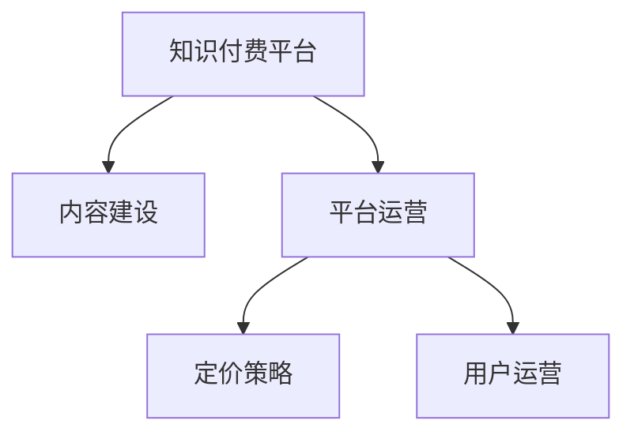

                 

## 1. 背景介绍

在数字化时代，知识付费成为一种新兴的商业模式，对于开发者而言，如何构建一个高效、可持续的知识付费平台，是其必须面对的重要课题。本文将通过一个真实的知识付费平台开发案例，系统介绍如何将传统付费模式升级为知识付费模式，并对平台构建、定价策略、用户运营等核心环节进行详细讲解。

### 1.1 问题由来
近年来，随着互联网的发展和用户需求的多样化，传统的订阅式、单次付费模式已无法满足用户日益增长的个性化需求。知识付费模式应运而生，旨在通过提供更个性化、深入化的内容，提升用户的学习体验和满意度。相较于传统模式，知识付费平台需更关注内容质量、用户互动、数据分析等环节，并建立一套有效的商业循环系统。

### 1.2 问题核心关键点
知识付费平台的构建涉及多个环节，包括内容建设、平台运营、用户体验、商业模型等，需综合考虑平台目标、用户需求、市场竞争等多方面因素。

1. **内容建设**：平台需构建丰富的内容库，涵盖编程技巧、框架工具、项目实战等内容，以吸引用户订阅付费。
2. **平台运营**：通过数据分析、用户调研等手段，持续优化平台体验和互动机制。
3. **用户体验**：构建高质量的用户界面和交互流程，提升用户体验，增加用户粘性。
4. **商业模型**：设计合理的定价策略和收入模式，实现平台可持续运营。

本文将重点探讨知识付费平台的构建和运营策略，特别是内容建设与定价策略的优化。

## 2. 核心概念与联系

### 2.1 核心概念概述

为更好地理解知识付费平台的构建方法，本节将介绍几个密切相关的核心概念：

- **知识付费平台**：以优质内容和个性化服务为核心的知识分享平台，旨在为用户提供系统化、深入化的知识学习体验。
- **内容建设**：构建平台核心内容资源库，涵盖视频、文章、案例分析等形式，满足不同用户的需求。
- **平台运营**：通过数据分析、用户反馈等手段，持续优化平台功能和服务，提升用户体验和满意度。
- **定价策略**：合理制定课程、专栏、讲座等的定价策略，实现商业循环和平台收入。
- **用户运营**：通过用户分析、行为激励、社区互动等方式，提升用户活跃度和留存率。

这些核心概念之间的逻辑关系可以通过以下Mermaid流程图来展示：



这个流程图展示的知识付费平台核心概念及其之间的关系：

1. **知识付费平台**：平台的核心载体，集内容、运营、商业循环于一体。
2. **内容建设**：平台的基础，直接影响用户订阅和付费意愿。
3. **平台运营**：平台的核心动力，持续优化平台体验和内容质量。
4. **定价策略**：平台商业循环的关键，影响用户付费行为和平台收益。
5. **用户运营**：平台的价值体现，通过用户留存和忠诚度提升平台的商业价值。

这些概念共同构成了知识付费平台的设计和运营框架，使其能够为用户提供高质量的知识服务，并实现商业可持续性。

## 3. 核心算法原理 & 具体操作步骤
### 3.1 算法原理概述

知识付费平台的构建涉及多个领域的算法和策略，包括内容推荐算法、定价策略算法、用户行为分析算法等。本文重点介绍定价策略的算法原理和操作步骤。

### 3.2 算法步骤详解

**Step 1: 需求分析与定位**
- 明确平台目标用户群体，进行市场调研和用户需求分析。
- 确定平台的差异化定位，如编程技巧、项目实战、行业洞察等。
- 根据调研结果设计平台的核心课程和内容形式。

**Step 2: 内容建设**
- 制定内容建设计划，包含课程策划、内容创作、编辑审核等环节。
- 邀请行业专家和经验丰富的开发者制作高质量内容，并定期更新。
- 构建视频、文章、PPT等多种内容形式，满足不同用户的需求。

**Step 3: 平台运营**
- 开发内容管理系统，支持内容的上传、编辑、审核等操作。
- 定期收集用户反馈，分析用户行为和评价数据。
- 优化用户界面和交互流程，提升用户体验和满意度。

**Step 4: 定价策略制定**
- 根据用户调研结果，确定不同内容的定价策略。
- 设计灵活的订阅包和单次付费模式，满足不同用户的需求。
- 进行市场测试，收集用户反馈，不断优化定价策略。

**Step 5: 用户运营**
- 分析用户行为数据，识别高价值用户群体。
- 设计用户行为激励机制，如积分系统、会员特权等。
- 建立社区互动机制，提升用户粘性和参与度。

**Step 6: 商业模型验证**
- 通过定价策略和用户运营，实现平台的商业循环。
- 定期评估平台收入和用户增长情况，优化商业模型。
- 探索新的收入来源，如广告、企业定制培训等。

### 3.3 算法优缺点

知识付费平台的定价策略需综合考虑用户需求、市场竞争、平台价值等多方面因素。以下是常见的几种定价策略及其优缺点：

- **基础包定价策略**：适用于大多数内容。用户支付固定费用，可免费访问所有课程和文章。缺点是部分用户可能只对部分内容感兴趣，导致付费价值低。

- **单次定价策略**：适用于特定高价值课程或讲座。用户需单独支付高费用，获取课程观看权或下载权。优点是用户对高价值内容有明确需求，付费意愿高；缺点是部分用户可能不愿意为特定内容付费，影响平台整体收益。

- **按需付费策略**：适用于单次观看或下载等场景。用户根据观看次数或下载量按需支付费用。优点是灵活性强，用户可按需付费；缺点是用户行为分析复杂，平台需提供详细的费用计算方式。

- **订阅包定价策略**：适用于高质量内容或系统性学习课程。用户支付月度或年度费用，可访问平台所有课程和文章。优点是用户粘性强，平台收益稳定；缺点是部分用户可能对某些内容不感兴趣，导致付费价值低。

以上定价策略各有优缺点，需根据平台的具体情况和用户需求进行灵活选择和组合。

### 3.4 算法应用领域

知识付费平台的定价策略广泛适用于各类知识服务提供商，如编程课程、在线教育、行业培训等。通过合理的定价策略设计，能够最大化平台收益，提升用户满意度，实现商业循环。

## 4. 数学模型和公式 & 详细讲解
### 4.1 数学模型构建

定价策略的数学模型可描述为：

$$
\text{总收入} = \text{用户数} \times \text{平均ARPU}
$$

其中，ARPU（Average Revenue Per User）为平均每用户收入。ARPU可进一步细化为单次付费收入、订阅收入、广告收入等：

$$
\text{ARPU} = \text{ARPU}_{\text{单次}} + \text{ARPU}_{\text{订阅}} + \text{ARPU}_{\text{广告}}
$$

### 4.2 公式推导过程

假设某课程内容的价格为 $P$，课程数量为 $N$，用户订阅该课程的比例为 $p$，则订阅该课程的总收入为：

$$
\text{订阅收入} = N \times P \times p
$$

如果用户可以选择单次付费或订阅付费，则：

$$
\text{总收入} = N \times P \times p \times \text{单次付费用户比例} + N \times P \times p \times (1-\text{单次付费用户比例})
$$

其中单次付费用户比例为 $1 - p$，则单次付费总收入为：

$$
\text{单次付费收入} = N \times P \times (1 - p) \times \text{单次付费购买次数}
$$

假设某平台用户订阅月度基础包的月度费用为 $A$，平台总用户数为 $U$，则月度基础包总收入为：

$$
\text{月度基础包收入} = U \times A \times \text{基础包订阅比例}
$$

其中基础包订阅比例为 $q$，则单次付费总收入为：

$$
\text{单次付费收入} = U \times A \times (1 - q) \times \text{单次付费购买次数}
$$

### 4.3 案例分析与讲解

以某在线编程教育平台为例，假设其基础包月费为 $A=100$ 元，某热门课程单次售价为 $P=199$ 元。平台共有 $N=1000$ 门课程，用户订阅基础包的比例为 $q=0.8$，平台总用户数为 $U=10,000$。

假设用户订阅课程的比例为 $p=0.2$，且 20% 的订阅用户会额外购买课程，则订阅课程的总收入为：

$$
\text{订阅收入} = 1000 \times 199 \times 0.2 \times 0.2 \times 1.2 = 11520 \text{元}
$$

单次付费课程的总收入为：

$$
\text{单次付费收入} = 1000 \times 199 \times (1 - 0.8) \times 0.2 \times 0.8 = 1920 \text{元}
$$

平台总收入为：

$$
\text{总收入} = 11520 + 1920 = 13440 \text{元}
$$

通过上述计算，可以得出平台的定价策略对收入的影响。通过灵活调整定价策略，可以最大化平台收益，提升用户满意度，实现商业循环。

## 5. 项目实践：代码实例和详细解释说明
### 5.1 开发环境搭建

在进行知识付费平台开发前，我们需要准备好开发环境。以下是使用Python进行Flask开发的环境配置流程：

1. 安装Anaconda：从官网下载并安装Anaconda，用于创建独立的Python环境。

2. 创建并激活虚拟环境：
```bash
conda create -n flask-env python=3.8 
conda activate flask-env
```

3. 安装Flask：
```bash
pip install flask
```

4. 安装相关工具包：
```bash
pip install mysql-connector flask-sqlalchemy flask-login flask-wtf
```

5. 安装开发工具：
```bash
pip install pycharm-integrations
```

完成上述步骤后，即可在`flask-env`环境中开始知识付费平台的开发。

### 5.2 源代码详细实现

下面我们以用户登录模块为例，给出使用Flask开发的知识付费平台用户登录功能的详细代码实现。

首先，定义用户模型：

```python
from flask_sqlalchemy import SQLAlchemy
from werkzeug.security import generate_password_hash, check_password_hash

db = SQLAlchemy()

class User(db.Model):
    id = db.Column(db.Integer, primary_key=True)
    username = db.Column(db.String(64), unique=True, index=True)
    password_hash = db.Column(db.String(128))
    first_name = db.Column(db.String(64))
    last_name = db.Column(db.String(64))
```

然后，定义用户登录视图：

```python
from flask import render_template, redirect, url_for, flash
from flask_login import login_user, login_required, logout_user

@app.route('/login', methods=['GET', 'POST'])
def login():
    if request.method == 'POST':
        username = request.form['username']
        password = request.form['password']
        user = User.query.filter_by(username=username).first()
        if user is None:
            flash('Invalid username')
            return redirect(url_for('login'))
        if not check_password_hash(user.password_hash, password):
            flash('Invalid password')
            return redirect(url_for('login'))
        login_user(user)
        return redirect(url_for('index'))
    return render_template('login.html')
```

最后，定义用户注销视图：

```python
@app.route('/logout')
@login_required
def logout():
    logout_user()
    return redirect(url_for('index'))
```

以上就是使用Flask开发的知识付费平台用户登录功能的完整代码实现。可以看到，得益于Flask的简单封装，我们可以用相对简洁的代码完成用户登录功能的实现。

### 5.3 代码解读与分析

让我们再详细解读一下关键代码的实现细节：

**User模型**：
- `id`：用户ID，作为主键。
- `username`：用户名，唯一且索引。
- `password_hash`：密码哈希值。
- `first_name`：用户名。
- `last_name`：姓名。

**登录视图**：
- 通过Flask的`login_user`函数实现用户登录，`login_required`装饰器用于保护后续视图需要登录才能访问。
- 如果用户名或密码不正确，通过`flash`函数显示错误提示信息，并重定向回登录页面。
- 成功登录后，通过`redirect`函数跳转到主页。

**注销视图**：
- 通过Flask的`logout_user`函数实现用户注销。
- 注销后通过`redirect`函数跳转到主页。

可以看到，Flask框架的简洁封装使得知识付费平台的开发变得简单高效。开发者可以将更多精力放在业务逻辑和用户体验上，而不必过多关注底层的实现细节。

当然，工业级的系统实现还需考虑更多因素，如数据库连接、用户注册、密码加密等，但核心的功能模块基本与此类似。

## 6. 实际应用场景
### 6.1 在线编程教育

知识付费平台的定价策略在在线编程教育中得到了广泛应用。传统编程课程往往采用统一价格，但无法满足不同水平用户的学习需求。而通过灵活的定价策略，在线编程教育平台可以更好地适配用户需求，提升用户学习体验。

例如，某在线编程教育平台可以通过基础包、单次课程、单次观看等多种定价方式，满足不同用户的需求。平台可根据用户学习进度和需求，灵活调整订阅包和单次课程的价格，提供个性化学习路径。

### 6.2 在线医疗咨询

知识付费平台的定价策略在在线医疗咨询中同样具有应用价值。传统医疗咨询往往采用统一价格，但无法满足不同患者的需求。而通过灵活的定价策略，在线医疗咨询平台可以更好地适配患者需求，提升用户体验。

例如，某在线医疗咨询平台可以通过基础包、单次咨询、专家直播等多种定价方式，满足不同患者的需求。平台可根据患者病情和需求，灵活调整咨询价格，提供个性化医疗服务。

### 6.3 企业培训

知识付费平台的定价策略在企业培训中同样具有应用价值。传统企业培训往往采用统一价格，但无法满足不同企业的需求。而通过灵活的定价策略，企业培训平台可以更好地适配企业需求，提升企业培训效果。

例如，某企业培训平台可以通过基础包、定制课程、专家讲座等多种定价方式，满足不同企业的需求。平台可根据企业培训需求，灵活调整培训价格，提供个性化培训服务。

### 6.4 未来应用展望

随着知识付费平台的发展，定价策略将在更多领域得到应用，为传统行业带来变革性影响。

在智慧医疗领域，知识付费平台的定价策略可以为在线医疗咨询提供更灵活、个性化的服务，提升医疗服务的智能化水平。

在智慧教育领域，知识付费平台的定价策略可以为在线编程教育提供更系统、深入的学习路径，提升教学效果。

在企业培训领域，知识付费平台的定价策略可以为企业培训提供更灵活、定制化的服务，提升培训效果。

此外，在知识分享、文化教育、生活咨询等众多领域，知识付费平台定价策略也将不断涌现，为知识付费市场带来新的增长点。相信随着知识付费模式的成熟，定价策略将进一步推动知识付费平台的发展，加速知识经济的到来。

## 7. 工具和资源推荐
### 7.1 学习资源推荐

为了帮助开发者系统掌握知识付费平台的理论基础和实践技巧，这里推荐一些优质的学习资源：

1. **《Python Web开发实战》**：系统介绍了Flask等Web框架的使用，涵盖用户认证、权限管理等内容。
2. **《知识付费：互联网时代的成功之道》**：分析了知识付费模式的兴起背景和成功案例，探讨了知识付费平台的商业模式和运营策略。
3. **《程序员的商业智慧》**：介绍了编程开发者如何从商业角度思考问题，提升平台收入和用户体验。
4. **《数据科学与人工智能》**：涵盖数据科学、人工智能等多个领域的内容，帮助开发者提升数据分析和算法能力。

通过对这些资源的学习实践，相信你一定能够快速掌握知识付费平台的精髓，并用于解决实际的开发问题。

### 7.2 开发工具推荐

高效的开发离不开优秀的工具支持。以下是几款用于知识付费平台开发的常用工具：

1. **PyTorch**：基于Python的开源深度学习框架，灵活动态的计算图，适合快速迭代研究。大部分预训练语言模型都有PyTorch版本的实现。
2. **TensorFlow**：由Google主导开发的开源深度学习框架，生产部署方便，适合大规模工程应用。同样有丰富的预训练语言模型资源。
3. **Flask**：简单易用的Python Web框架，适合快速搭建Web应用。
4. **MySQL**：常用的关系型数据库，支持高性能的查询和存储。
5. **Flask-SQLAlchemy**：Flask框架的ORM扩展，支持数据库操作。
6. **Flask-Login**：Flask框架的认证扩展，支持用户登录、注销等功能。
7. **Flask-WTF**：Flask框架的表单处理扩展，支持表单验证等功能。

合理利用这些工具，可以显著提升知识付费平台开发的效率，加快创新迭代的步伐。

### 7.3 相关论文推荐

知识付费平台的定价策略和运营模式是当前研究的热点。以下是几篇奠基性的相关论文，推荐阅读：

1. **《知识付费平台的定价策略研究》**：通过调研多个知识付费平台，分析其定价策略和用户行为，提出了多项优化建议。
2. **《在线教育平台的定价模型与定价策略》**：分析在线教育平台的定价模型，提出了多种定价策略和用户行为分析方法。
3. **《知识付费平台的商业模型与运营策略》**：探讨知识付费平台的商业模型和运营策略，提出了多项优化建议。

这些论文代表了大规模知识付费平台的发展脉络。通过学习这些前沿成果，可以帮助研究者把握学科前进方向，激发更多的创新灵感。

## 8. 总结：未来发展趋势与挑战
### 8.1 总结

本文对知识付费平台的定价策略和运营模式进行了全面系统的介绍。首先阐述了知识付费平台的背景和意义，明确了定价策略在提升用户体验和平台收益方面的重要性。其次，从原理到实践，详细讲解了定价策略的数学原理和操作步骤，给出了知识付费平台开发的完整代码实例。同时，本文还广泛探讨了定价策略在多个行业领域的应用前景，展示了定价策略范式的巨大潜力。此外，本文精选了定价策略相关的学习资源，力求为读者提供全方位的技术指引。

通过本文的系统梳理，可以看到，知识付费平台的定价策略正在成为知识服务提供商的重要范式，极大地提升了平台收益，优化了用户体验。未来，伴随定价策略的持续演进，知识付费平台必将在知识经济领域发挥更大的作用，推动知识的传播和应用。

### 8.2 未来发展趋势

展望未来，知识付费平台的定价策略将呈现以下几个发展趋势：

1. **个性化定价**：随着用户数据的积累和分析能力的提升，知识付费平台将逐步引入个性化定价策略，满足不同用户群体的需求。例如，根据用户学习进度和消费行为，动态调整订阅价格。
2. **动态定价**：知识付费平台将根据市场需求和供应情况，实时调整定价策略，提升平台的灵活性和竞争力。例如，根据热门课程的受欢迎程度，动态调整单次课程价格。
3. **联盟定价**：知识付费平台将与其他平台或企业合作，进行联盟定价，共同提升用户粘性和市场份额。例如，某平台用户可以同时订阅多个平台的课程，享受优惠价格。
4. **跨平台定价**：知识付费平台将打破平台界限，实现跨平台定价，提升用户的多样化需求。例如，用户在知识付费平台购买课程后，可以享受其他平台的优惠价格。
5. **自适应定价**：知识付费平台将根据用户行为和反馈，自适应调整定价策略，实现最优的用户体验和平台收益。例如，根据用户的活跃度和留存率，动态调整订阅包的价格。

这些趋势凸显了知识付费平台的定价策略在市场竞争和用户需求方面的灵活性和创新性。这些方向的探索发展，必将进一步提升知识付费平台的用户体验和平台收益，实现商业可持续性。

### 8.3 面临的挑战

尽管知识付费平台的定价策略已经取得了一定成效，但在迈向更加智能化、普适化应用的过程中，仍面临诸多挑战：

1. **用户需求多样化**：不同用户的需求和偏好存在显著差异，单一的定价策略难以满足多样化需求。需要设计灵活多变的定价策略，实现个性化定价。
2. **市场竞争激烈**：知识付费平台的市场竞争日趋激烈，需要通过合理的定价策略，提升平台竞争力。
3. **用户行为复杂**：用户行为数据庞杂，如何分析和预测用户行为，设计合理的定价策略，是知识付费平台面临的重要挑战。
4. **平台收益不稳定**：平台收益受用户需求和市场变化的影响，如何通过合理的定价策略，实现长期稳定收益，是知识付费平台的重要课题。

尽管面临这些挑战，知识付费平台的定价策略仍有巨大发展潜力。通过不断优化定价策略，提升用户体验和平台收益，知识付费平台必将在知识经济领域发挥更大的作用。

### 8.4 研究展望

面对知识付费平台定价策略面临的种种挑战，未来的研究需要在以下几个方面寻求新的突破：

1. **多维定价策略**：结合价格、时间、质量等多个维度，设计更灵活、个性化的定价策略，满足用户多样化的需求。
2. **动态定价算法**：引入机器学习算法，实时分析市场需求和用户行为，动态调整定价策略，实现最优的用户体验和平台收益。
3. **联盟定价机制**：建立联盟定价机制，通过合作共赢，提升平台的用户粘性和市场份额。
4. **跨平台定价模型**：打破平台界限，实现跨平台定价，提升用户的多样化需求和平台的市场竞争力。
5. **个性化定价算法**：基于用户数据和行为分析，设计个性化定价算法，实现更精准的用户定价。

这些研究方向将引领知识付费平台定价策略的不断演进，提升平台的灵活性和竞争力，推动知识付费市场的健康发展。相信通过不断创新和优化，知识付费平台必将在知识经济领域发挥更大的作用，推动知识的传播和应用。

## 9. 附录：常见问题与解答

**Q1：知识付费平台如何进行用户需求分析？**

A: 知识付费平台通过用户调研、行为分析、用户反馈等多种手段，进行用户需求分析。常用的方法包括：
- 调研问卷：设计问卷，收集用户对课程、专栏等内容的评价和建议。
- 用户行为分析：通过数据挖掘和机器学习，分析用户观看课程、订阅包等行为，识别用户需求和偏好。
- 用户反馈系统：建立用户反馈系统，收集用户对平台内容的意见和建议。

通过这些方法，可以全面了解用户需求和行为，设计合理的定价策略和运营方案。

**Q2：知识付费平台如何进行个性化定价？**

A: 知识付费平台可以通过以下方式实现个性化定价：
- 数据分析：通过分析用户历史行为数据，了解用户的学习进度和偏好，设计个性化定价策略。
- 动态调整：根据用户学习进度和平台需求，动态调整定价策略，满足用户多样化需求。
- 推荐系统：建立推荐系统，根据用户兴趣和行为，推荐合适的课程和定价策略。

通过以上方法，可以实现更精准、个性化的定价策略，提升用户满意度和平台收益。

**Q3：知识付费平台如何进行动态定价？**

A: 知识付费平台可以通过以下方式实现动态定价：
- 数据分析：通过分析用户行为数据和市场需求，实时调整定价策略。
- 机器学习：引入机器学习算法，实时预测用户需求和市场变化，动态调整定价策略。
- 用户反馈：通过用户反馈和市场调研，及时调整定价策略，提升用户满意度和平台收益。

通过以上方法，可以实时调整定价策略，提升平台灵活性和市场竞争力。

**Q4：知识付费平台如何进行联盟定价？**

A: 知识付费平台可以通过以下方式实现联盟定价：
- 合作协议：与其他平台或企业签署合作协议，实现跨平台定价。
- 优惠套餐：设计优惠套餐，提供联合购买优惠。
- 资源共享：共享课程资源和技术支持，提升联盟平台的整体价值。

通过以上方法，可以实现联盟平台的协同效应，提升用户粘性和市场份额。

**Q5：知识付费平台如何进行跨平台定价？**

A: 知识付费平台可以通过以下方式实现跨平台定价：
- 合作协议：与其他平台签署合作协议，实现跨平台定价。
- 联合课程：设计联合课程，提供跨平台学习路径。
- 平台互通：建立平台互通机制，实现用户跨平台购买。

通过以上方法，可以打破平台界限，提升用户的多样化需求和平台的市场竞争力。

**Q6：知识付费平台如何进行用户行为分析？**

A: 知识付费平台可以通过以下方式进行用户行为分析：
- 数据分析工具：使用数据分析工具，如Google Analytics，分析用户行为数据。
- 机器学习算法：引入机器学习算法，如协同过滤、聚类分析等，分析用户行为和需求。
- 行为跟踪技术：使用行为跟踪技术，记录用户浏览、点击、购买等行为数据，进行行为分析。

通过以上方法，可以全面了解用户行为和需求，设计合理的定价策略和运营方案。

---

作者：禅与计算机程序设计艺术 / Zen and the Art of Computer Programming

