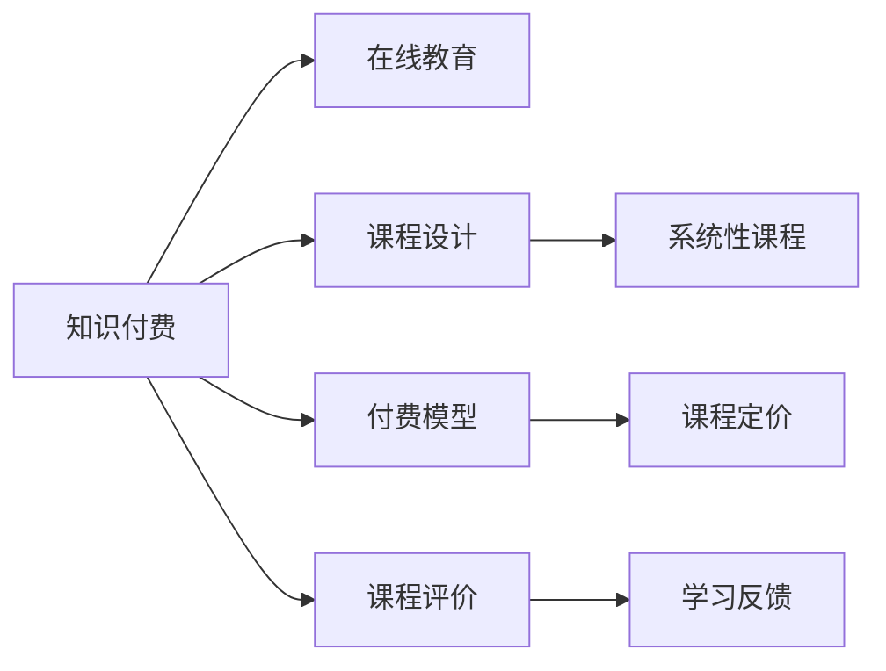

                 

# 程序员知识付费：打造闭环式课程

> 关键词：知识付费, 在线教育, 课程设计, 付费模型, 课程评价

## 1. 背景介绍

### 1.1 问题由来
随着互联网的普及和在线教育的兴起，知识付费逐渐成为一种流行的学习方式。程序员作为互联网技术的重要应用者，也需要不断学习和提升技能。在线课程、视频教程、技术博客等资源虽然丰富多样，但缺乏系统性、针对性，导致学习效果大打折扣。如何通过付费模式，构建一套闭环式课程体系，提升学习效率和实际应用能力，成为程序员教育领域的一大挑战。

### 1.2 问题核心关键点
构建闭环式课程体系的核心在于建立一个持续的、有组织的知识传递和反馈机制。其关键点包括：

- 系统性课程设计：构建从基础到进阶的知识体系，将理论与实践相结合，形成完整的学习闭环。
- 针对性培训：针对不同层次和需求，提供个性化定制课程，适应不同背景的学员。
- 高效互动机制：设计互动环节，如即时答疑、代码评测、项目实战等，及时反馈学习效果。
- 付费模式设计：构建合理的付费模型，实现平台盈利和学员价值最大化，促进课程质量的提升。

## 2. 核心概念与联系

### 2.1 核心概念概述

为更好地理解闭环式课程体系的构建方法，本节将介绍几个密切相关的核心概念：

- **知识付费（Knowledge-as-a-Service, KaaS）**：指通过付费方式获取高质量教育资源的商业模式，强调通过知识服务获取价值。
- **在线教育（Online Education）**：指利用互联网平台进行的远程教育，涵盖线上直播、录播、互动讨论等多种形式。
- **课程设计（Curriculum Design）**：指根据学习目标和学员需求，系统地规划课程内容和学习路径的过程。
- **付费模型（Pricing Model）**：指如何根据课程内容和学员需求，合理定价的策略。
- **课程评价（Course Evaluation）**：指对课程体系和学习效果的评估，通过反馈机制不断优化课程内容。

这些核心概念之间存在紧密联系，通过将它们有机结合，可以构建一个高效、有序的知识付费教育体系。

### 2.2 核心概念原理和架构的 Mermaid 流程图



这个流程图展示了知识付费体系的核心组件及其之间的关系：

1. **知识付费**：通过在线教育平台提供知识服务。
2. **课程设计**：根据学习目标和需求，设计系统性课程。
3. **付费模型**：确定课程定价策略，实现平台盈利。
4. **课程评价**：通过学员反馈不断优化课程内容。

**系统性课程**和**课程定价**是课程设计的两大关键环节，而**学习反馈**则作为评价和优化的依据，确保课程质量持续提升。

## 3. 核心算法原理 & 具体操作步骤
### 3.1 算法原理概述

构建闭环式课程体系，本质上是将知识付费与在线教育深度融合的过程。其核心算法原理主要包括以下几个方面：

1. **系统性课程设计**：构建从基础到进阶的课程体系，确保学员在学习过程中逐步掌握核心技能。
2. **针对性培训**：根据学员的学习进度和需求，提供个性化定制课程。
3. **高效互动机制**：设计即时答疑、代码评测、项目实战等环节，确保学习效果。
4. **付费模型设计**：根据课程内容和学习效果，合理定价。

### 3.2 算法步骤详解

构建闭环式课程体系，一般需要经历以下关键步骤：

**Step 1: 课程需求分析**
- 确定目标学员群体，分析其学习需求和知识水平。
- 调研市场需求，了解当前市场竞争状况和学员痛点。
- 收集业界反馈，了解同行成功案例和失败教训。

**Step 2: 设计课程内容**
- 制定课程大纲，明确学习目标和路径。
- 划分课程模块，确保理论知识的系统性和实践操作的连贯性。
- 设计互动环节，增加学习趣味性和有效性。

**Step 3: 开发课程平台**
- 选择适合的在线教育平台和开发工具。
- 实现课程功能，如视频录播、实时互动、代码评测等。
- 优化用户界面，提升用户体验。

**Step 4: 课程定价与销售**
- 根据课程价值和市场反馈，制定合理定价策略。
- 设置优惠活动，吸引新学员。
- 实施营销推广，提高课程知名度。

**Step 5: 课程效果评估**
- 收集学员反馈，通过问卷调查、即时评分等方式评估学习效果。
- 定期进行课程改进，优化课程内容和教学方法。
- 引入KPI指标，监控课程销售和学员满意度。

### 3.3 算法优缺点

构建闭环式课程体系，具有以下优点：

- **系统性和针对性**：系统性课程设计能够确保学习路径的完整性，针对性培训可以满足不同学员的需求。
- **互动性和实践性**：即时答疑、代码评测等环节可以实时反馈学习效果，项目实战可以增强学员的实战能力。
- **盈利性和持续性**：合理的定价策略可以保障平台盈利，持续优化课程内容可以吸引更多学员。

同时，该方法也存在一定的局限性：

- **成本较高**：课程设计和开发需要大量的人力和时间投入，前期成本较高。
- **市场风险**：课程定价和销售策略需要根据市场需求进行调整，存在一定的风险。
- **用户粘性**：如何保持学员的持续学习兴趣和参与度，需要精心设计课程内容和互动机制。

尽管存在这些局限性，但就目前而言，闭环式课程体系仍然是教育领域的主流范式。未来相关研究的重点在于如何进一步降低前期成本，提高课程的灵活性和适配性，同时兼顾盈利性和用户粘性等因素。

### 3.4 算法应用领域

闭环式课程体系在多个领域中已经得到了广泛应用，例如：

- **技术培训**：针对程序员、数据分析师等技术岗位，提供系统性课程和实战项目。
- **企业管理**：为企业员工提供管理知识、职业技能培训，提升企业竞争力。
- **在线教育**：为广大学生提供从基础到进阶的全面学习路径，涵盖K-12、大学选修课等多个阶段。
- **职业认证**：与专业机构合作，提供认证课程，满足行业认证需求。
- **个人发展**：为个人用户提供兴趣技能培训、健康管理、心理辅导等综合课程。

除了上述这些经典应用外，闭环式课程体系还被创新性地应用到更多场景中，如行业技能培训、远程协作工具、生活技能教育等，为不同领域的学习者提供了丰富的学习资源。

## 4. 数学模型和公式 & 详细讲解 & 举例说明

### 4.1 数学模型构建

为了更好地理解闭环式课程体系的构建方法，本节将使用数学语言对课程设计和评估过程进行更加严格的刻画。

记课程总数为 $N$，每门课程的时长为 $T$，学员总人数为 $M$，每门课程的价格为 $P$。课程的平均评分（1-5分）为 $R$，学员的满意度（1-10分）为 $S$。

课程销售的总收入为 $T_{\text{total}}$，总收入与课程价格的比值为 $\text{PCC}$（Price-Per-Course）。课程平均评分的总和为 $R_{\text{total}}$，课程平均评分的总和与课程价格的乘积为 $\text{PRR}$（Price-Return-Relation）。课程平均满意度的总和为 $S_{\text{total}}$，课程平均满意度的总和与课程价格的乘积为 $\text{SPR}$（Satisfaction-Price-Relation）。

数学模型构建如下：

- **收入模型**：$T_{\text{total}} = M \times P \times \text{PCC}$
- **评分模型**：$R_{\text{total}} = \frac{1}{N} \sum_{i=1}^N R_i$
- **满意度模型**：$S_{\text{total}} = \frac{1}{N} \sum_{i=1}^N S_i$

- **价格与评分关系**：$\text{PRR} = \frac{R_{\text{total}}}{P}$
- **价格与满意度关系**：$\text{SPR} = \frac{S_{\text{total}}}{P}$

通过这些数学模型，可以系统地评估课程的收入和学员的满意度，并根据市场反馈不断优化课程内容和定价策略。

### 4.2 公式推导过程

以**收入模型**为例，推导课程总收入的计算公式：

假设课程总数为 $N$，每门课程的价格为 $P$，学员总人数为 $M$。则总收入 $T_{\text{total}}$ 可以表示为：

$$
T_{\text{total}} = M \times P \times \text{PCC}
$$

其中，$\text{PCC}$ 为每门课程的平均销售次数，即每门课程平均能够吸引多少学员购买。

### 4.3 案例分析与讲解

以在线编程训练营为例，介绍如何构建和优化闭环式课程体系：

1. **需求分析**：针对初学者和有一定编程基础的学员，设计基础和进阶课程。
2. **课程设计**：划分基础和进阶模块，确保从Python基础到项目实战的连贯性。设计实时答疑、代码评测等互动环节。
3. **开发平台**：选择适合的在线教育平台，实现课程功能。优化用户界面，提升用户体验。
4. **定价与销售**：根据课程内容和学员反馈，设定合理价格。实施营销推广活动，吸引新学员。
5. **效果评估**：通过学员反馈和课程评分，评估学习效果。根据评估结果优化课程内容。

通过这个案例，可以看到闭环式课程体系的各个环节如何有机结合，确保课程质量和学员满意度。

## 5. 项目实践：代码实例和详细解释说明
### 5.1 开发环境搭建

在进行课程开发前，我们需要准备好开发环境。以下是使用Python进行Django开发的环境配置流程：

1. 安装Anaconda：从官网下载并安装Anaconda，用于创建独立的Python环境。

2. 创建并激活虚拟环境：
```bash
conda create -n course-env python=3.8 
conda activate course-env
```

3. 安装Django：
```bash
pip install django==3.2.7
```

4. 安装其他必要的Python库：
```bash
pip install numpy pandas scikit-learn django-cors-headers django-ckeditor
```

5. 初始化Django项目：
```bash
django-admin startproject course
cd course
```

6. 初始化Django应用：
```bash
python manage.py startapp course_app
```

完成上述步骤后，即可在`course-env`环境中开始课程开发。

### 5.2 源代码详细实现

下面我们以在线编程训练营为例，给出使用Django框架对课程进行开发的PyTorch代码实现。

首先，定义课程模型和数据库迁移：

```python
# models.py
from django.db import models
from django.contrib.auth.models import User

class Course(models.Model):
    title = models.CharField(max_length=100)
    description = models.TextField()
    price = models.DecimalField(max_digits=10, decimal_places=2)
    enrollment_count = models.IntegerField(default=0)
    is_published = models.BooleanField(default=False)
    publish_date = models.DateTimeField(auto_now_add=True)
    created_by = models.ForeignKey(User, on_delete=models.CASCADE)
```

```bash
# migrations/0001_initial.py
from django.db import migrations, models

# Create model definitions here.
class Migration(migrations.Migration):

    dependencies = [
    ]

    operations = [
        migrations.CreateModel(
            name='Course',
            fields=[
                ('id', models.AutoField(auto_created=True, primary_key=True, serialize=False, verbose_name='ID')),
                ('title', models.CharField(max_length=100)),
                ('description', models.TextField()),
                ('price', models.DecimalField(decimal_places=2, max_digits=10)),
                ('enrollment_count', models.IntegerField(default=0)),
                ('is_published', models.BooleanField(default=False)),
                ('publish_date', models.DateTimeField(auto_now_add=True)),
                ('created_by', models.ForeignKey(on_delete=models.CASCADE, to='auth.User')),
            ],
        ),
    ]
```

然后，定义课程注册视图和页面：

```python
# views.py
from django.shortcuts import render, redirect
from django.contrib.auth.decorators import login_required
from .forms import CourseForm
from .models import Course

@login_required
def course_list(request):
    courses = Course.objects.filter(is_published=True)
    return render(request, 'course_list.html', {'courses': courses})

@login_required
def course_detail(request, id):
    course = Course.objects.get(id=id)
    return render(request, 'course_detail.html', {'course': course})

@login_required
def course_create(request):
    if request.method == 'POST':
        form = CourseForm(request.POST)
        if form.is_valid():
            form.save()
            return redirect('course_list')
    else:
        form = CourseForm()
    return render(request, 'course_create.html', {'form': form})
```

```html
<!-- templates/course_list.html -->
<ul>
    
    <li><a href="">{{ course.title }}</a></li>
    
</ul>
```

```html
<!-- templates/course_detail.html -->
<h1>{{ course.title }}</h1>
<p>{{ course.description }}</p>
<p>{{ course.price }}</p>
<p><a href="">Back to courses</a></p>
```

```html
<!-- templates/course_create.html -->
<form method="post">
    
    {{ form.title.label }}
    {{ form.title }}
    {{ form.description.label }}
    {{ form.description }}
    {{ form.price.label }}
    {{ form.price }}
    {{ form.enrollment_count.label }}
    {{ form.enrollment_count }}
    {{ form.is_published.label }}
    {{ form.is_published }}
    <button type="submit">Create</button>
</form>
```

最后，启动Django服务器，运行项目：

```bash
python manage.py runserver
```

以上即为使用Django框架对在线编程训练营课程进行开发的完整代码实现。可以看到，Django框架提供了强大的Web开发功能，可以快速实现课程管理、学员注册、实时互动等功能。

### 5.3 代码解读与分析

让我们再详细解读一下关键代码的实现细节：

**models.py**：定义了课程模型，包括课程标题、描述、价格、发布状态等字段。

**migrations/0001_initial.py**：创建课程表数据模型，确保课程信息存储在数据库中。

**views.py**：定义了课程列表、课程详情、课程创建等视图函数，通过Django的URL反序列化函数将请求映射到对应的视图上。

**templates/**：包含课程列表、课程详情、课程创建的HTML模板，通过模板语言实现数据渲染和交互。

可以看到，Django框架的强大和灵活性使得课程开发变得简洁高效。开发者可以专注于业务逻辑的实现，而无需过多关注底层Web开发细节。

当然，实际应用中还需要进一步考虑数据的安全性、性能优化、多语言支持等高级功能。但核心的闭环式课程体系构建方法基本与此类似。

## 6. 实际应用场景
### 6.1 智能教育

基于闭环式课程体系的在线教育平台，可以为学生提供个性化、系统化的学习资源。通过定期更新课程内容，确保知识的时效性和前瞻性。实时互动环节，如即时答疑、作业批改等，可以及时反馈学习效果，帮助学生掌握核心技能。

### 6.2 企业培训

企业可以使用闭环式课程体系进行内部培训，提升员工的专业技能和职业素养。通过系统化课程和实战项目，确保培训的全面性和针对性。学员反馈和满意度调查，可以不断优化培训内容和方式，提升培训效果。

### 6.3 远程协作

远程团队可以通过闭环式课程体系进行技能培训和技术交流。系统化课程和互动环节，可以确保知识的有效传递。实时反馈和学习评价，可以及时发现和解决问题，提升团队协作效率。

### 6.4 未来应用展望

随着技术的不断进步，闭环式课程体系的应用将更加广泛：

1. **多模态学习**：课程体系不仅包含文本信息，还支持图像、视频、音频等多模态内容，提供更加全面的学习体验。
2. **AI辅助教学**：引入AI技术，如自然语言处理、图像识别等，提升课程的互动性和实用性。
3. **跨领域应用**：课程体系不仅限于某个具体领域，而是支持跨领域的学习和应用，提升学员的综合素质。
4. **自适应学习**：根据学员的学习进度和需求，动态调整课程内容和学习路径，实现个性化学习。
5. **知识图谱融合**：将知识图谱与课程内容结合，增强课程的逻辑性和系统性。

这些发展趋势将进一步拓展闭环式课程体系的应用场景，提升其价值和实用性。

## 7. 工具和资源推荐
### 7.1 学习资源推荐

为了帮助开发者系统掌握闭环式课程体系的构建方法，这里推荐一些优质的学习资源：

1. **《在线教育系统设计》书籍**：系统讲解了在线教育系统的整体设计和核心组件，涵盖课程设计、用户管理、互动机制等多个方面。
2. **Coursera平台**：全球知名的在线教育平台，提供大量高质量的课程资源，涵盖技术、管理、人文等多个领域。
3. **edX平台**：另一个知名的在线教育平台，提供由世界名校和知名机构提供的课程资源。
4. **Kaggle平台**：数据科学竞赛平台，提供丰富的学习资源和实战项目，帮助开发者提升数据处理和机器学习能力。
5. **Python在线教程**：如Codecademy、LeetCode等，提供Python语言学习的在线教程和实战项目。

通过这些资源的学习实践，相信你一定能够快速掌握闭环式课程体系的精髓，并用于解决实际的在线教育问题。

### 7.2 开发工具推荐

高效的开发离不开优秀的工具支持。以下是几款用于闭环式课程体系开发的常用工具：

1. **Django框架**：强大的Web开发框架，灵活的模板引擎，适用于构建复杂的应用系统。
2. **TensorFlow**：开源的机器学习框架，支持深度学习模型的训练和部署。
3. **Kubernetes**：容器编排工具，支持大规模分布式应用的管理和调度。
4. **Jupyter Notebook**：交互式编程环境，支持实时代码执行和数据可视化。
5. **Git/GitHub**：版本控制系统，支持代码管理和团队协作。

合理利用这些工具，可以显著提升闭环式课程体系的开发效率，加快创新迭代的步伐。

### 7.3 相关论文推荐

闭环式课程体系的研究源于学界的持续研究。以下是几篇奠基性的相关论文，推荐阅读：

1. **《知识付费平台用户行为分析》**：分析了知识付费平台的用户行为，探讨了付费模型的合理性。
2. **《在线教育平台的课程设计和实施》**：介绍了在线教育平台的课程设计和实施方法，涵盖课程体系构建、学习效果评估等。
3. **《企业内部培训系统设计与实现》**：探讨了企业内部培训系统的设计思路和实现方法，强调个性化学习路径的重要性。
4. **《基于机器学习的在线课程推荐系统》**：介绍了利用机器学习算法进行在线课程推荐的实现方法，优化用户学习体验。
5. **《自适应学习系统的设计与实现》**：介绍了自适应学习系统的设计思路，通过动态调整课程内容实现个性化学习。

这些论文代表了大规模课程体系的研究进展，通过学习这些前沿成果，可以帮助研究者把握学科前进方向，激发更多的创新灵感。

## 8. 总结：未来发展趋势与挑战
### 8.1 总结

本文对闭环式课程体系的构建方法进行了全面系统的介绍。首先阐述了知识付费和在线教育的研究背景和意义，明确了课程设计和付费模型的核心要素。其次，从原理到实践，详细讲解了课程体系的数学模型和具体实现步骤，给出了课程开发的完整代码实例。同时，本文还广泛探讨了课程体系在智能教育、企业培训、远程协作等多个领域的应用前景，展示了闭环式课程体系的价值和潜力。此外，本文精选了课程体系的各类学习资源，力求为读者提供全方位的技术指引。

通过本文的系统梳理，可以看到，闭环式课程体系在在线教育领域的应用前景广阔，通过系统性的课程设计和持续的互动反馈，可以显著提升学习效果和实际应用能力。未来，伴随技术的不断进步，闭环式课程体系将在教育、培训、协作等多个领域得到更广泛的应用，为各行各业的人才培养提供有力支持。

### 8.2 未来发展趋势

展望未来，闭环式课程体系将呈现以下几个发展趋势：

1. **智能化和自动化**：引入AI技术，如自然语言处理、机器学习等，提升课程的互动性和实用性。
2. **个性化和自适应**：根据学员的学习进度和需求，动态调整课程内容和学习路径，实现个性化学习。
3. **多模态和跨领域**：支持多模态内容的学习和应用，实现跨领域知识的融合和拓展。
4. **去中心化和分布式**：利用区块链等技术，实现去中心化的知识传递和验证。
5. **全球化和本地化**：将国际化的课程内容与本地化的市场需求相结合，提升课程的全球覆盖和本地适配能力。

这些发展趋势将进一步拓展闭环式课程体系的应用场景，提升其价值和实用性。

### 8.3 面临的挑战

尽管闭环式课程体系已经取得了显著进展，但在迈向更加智能化、普适化应用的过程中，仍面临诸多挑战：

1. **内容更新频率**：需要不断更新课程内容，以保持知识的及时性和前瞻性，但更新频率过高或过低都可能影响学习效果。
2. **学员参与度**：如何保持学员的持续学习兴趣和参与度，是课程体系面临的重要挑战。
3. **技术架构复杂性**：课程体系的构建需要复杂的架构设计，技术难度较高。
4. **数据安全和隐私**：需要确保学员数据的安全性和隐私保护，防止信息泄露和滥用。
5. **商业化运营**：如何实现课程体系的市场化运营和盈利，需要综合考虑成本、价格和学员需求等多个因素。

### 8.4 研究展望

面对闭环式课程体系面临的挑战，未来的研究需要在以下几个方面寻求新的突破：

1. **智能推荐系统**：利用机器学习算法，实现个性化课程推荐，提升学员学习体验。
2. **自适应学习框架**：开发自适应学习平台，动态调整课程内容和节奏，实现个性化学习路径。
3. **多模态内容融合**：将多模态内容（如图像、视频、音频等）与文本内容相结合，提供更加全面的学习体验。
4. **去中心化平台**：利用区块链等技术，构建去中心化的知识传递和验证平台，提升课程体系的透明度和安全性。
5. **社交化学习**：引入社交元素，增强学员之间的互动和交流，提升学习效果。

这些研究方向将进一步推动闭环式课程体系的发展，为在线教育、企业培训、远程协作等多个领域带来革命性变革。

## 9. 附录：常见问题与解答

**Q1：闭环式课程体系是否适用于所有课程内容？**

A: 闭环式课程体系适用于各种类型的课程内容，包括编程、管理、艺术、人文等多个领域。通过系统性设计，可以确保课程内容的全面性和连贯性，通过互动环节，可以提升学员的学习效果。

**Q2：如何设计合理的付费模型？**

A: 付费模型的设计需要综合考虑课程价值、市场需求和学员支付能力。一般建议采用灵活的定价策略，如按课程模块收费、按学习进度收费、按完成度收费等。同时，提供优惠活动，吸引新学员，提高课程销售。

**Q3：如何确保课程体系的学习效果？**

A: 通过设置学员反馈机制，如即时评分、问卷调查等，可以及时了解学员的学习效果和需求。根据反馈结果，不断优化课程内容和教学方法，确保课程体系的有效性。

**Q4：如何构建高效的课程平台？**

A: 选择适合的在线教育平台和开发工具，实现课程功能。优化用户界面，提升用户体验。引入AI技术，如自然语言处理、机器学习等，提升课程的互动性和实用性。

这些问题的解答，可以帮助你更好地理解闭环式课程体系的构建方法，并应用于实际的项目开发和运营中。

---

作者：禅与计算机程序设计艺术 / Zen and the Art of Computer Programming

