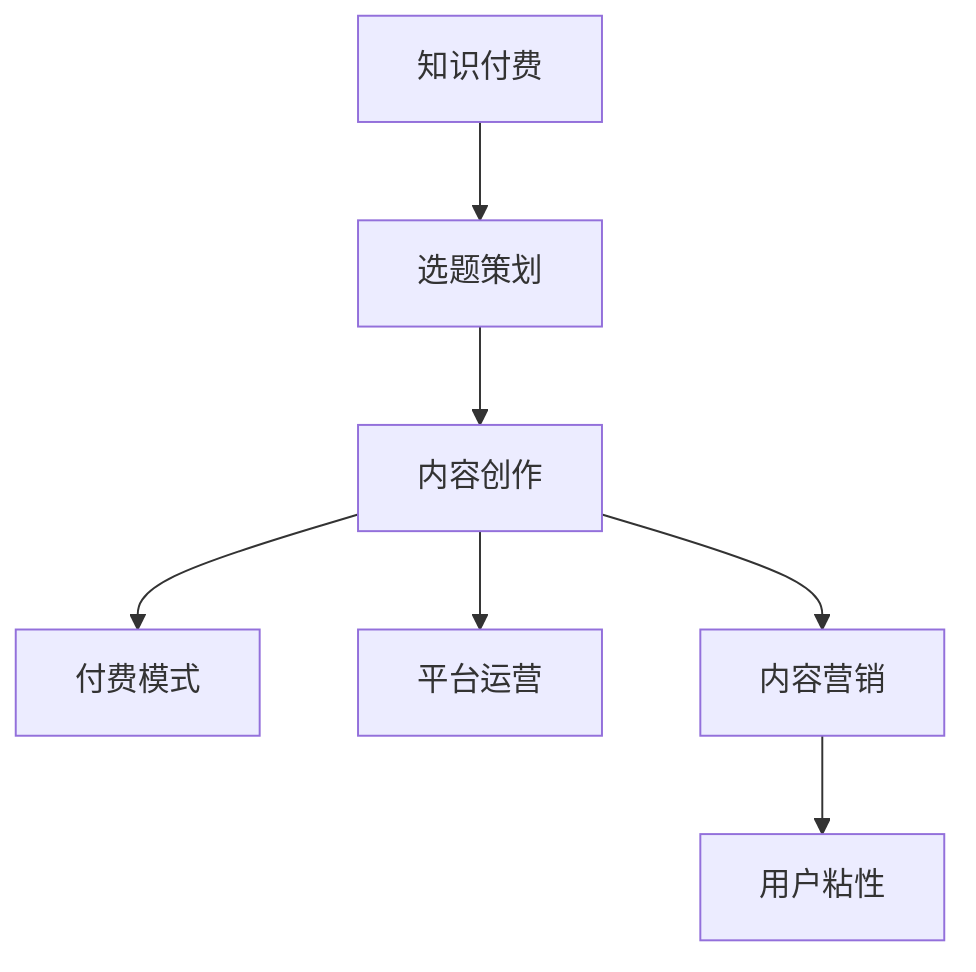

                 

# 程序员知识付费：选题与策划

> 关键词：知识付费,选题策划,内容创作,付费模式,平台运营,内容营销

## 1. 背景介绍

### 1.1 问题由来
随着信息爆炸和知识碎片化时代的到来，互联网用户对高质量、系统化、有价值的内容需求越来越强烈。传统免费的在线教育模式逐渐被知识付费的商业模式所取代。程序员作为互联网行业的重要参与者，也面临着从零碎的技能学习到系统化知识体系的转变。知识付费平台，如Coursera、Udemy、CSDN学院、极客时间等，成为了程序员获取系统化、高质量技术知识的重要渠道。选题与策划，作为知识付费项目成功的关键环节，对平台的价值实现和用户粘性提升起到了至关重要的作用。本文将详细探讨程序员知识付费的选题与策划问题。

### 1.2 问题核心关键点
选题与策划的核心关键点在于：
- 如何根据市场需求和用户痛点，选择适合的知识内容
- 如何构建系统化、结构化的课程体系
- 如何制定有效的营销策略，吸引用户付费
- 如何打造精品内容，提升用户粘性和口碑

## 2. 核心概念与联系

### 2.1 核心概念概述

为更好地理解程序员知识付费的选题与策划，本节将介绍几个密切相关的核心概念：

- **知识付费**：指用户为获取高质量、系统化的知识和技能而愿意支付费用的模式。该模式通过付费机制，激励创作者提供高质量内容，并建立用户与创作者间的稳定关系。

- **选题策划**：指内容制作团队根据市场需求和用户痛点，确定知识内容的选题和设计方案，旨在通过精心策划的内容吸引用户付费。

- **内容创作**：指根据选题策划的方案，系统化、专业地制作课程内容，包括视频录制、PPT制作、教学大纲编写、作业布置等。

- **付费模式**：指平台提供的不同付费方式，如单课付费、包月订阅、单次咨询等。不同模式适用于不同的内容类型和用户需求。

- **平台运营**：指内容平台对知识内容的维护、更新、推广等运营管理活动，旨在提升用户粘性、增加用户留存率、提升内容价值。

- **内容营销**：指通过各种营销手段，如社交媒体推广、SEO优化、内容软文等，增加内容的曝光度和用户获取量。

- **用户粘性**：指用户对平台内容的依赖程度和忠诚度，是衡量知识付费平台成功的关键指标之一。

这些核心概念之间的逻辑关系可以通过以下Mermaid流程图来展示：



这个流程图展示了一系列相互关联的概念，其共同构成了程序员知识付费的平台运作框架。

## 3. 核心算法原理 & 具体操作步骤
### 3.1 算法原理概述

程序员知识付费的选题与策划，本质上是一个以用户需求为导向的内容创造与推广过程。其核心思想是：通过市场调研和数据分析，识别用户的痛点和需求，并结合自身资源和能力，制定科学合理的选题和内容规划，通过有效的营销手段推广至目标用户，从而实现用户的付费转化和平台价值的最大化。

形式化地，假设知识内容集合为 $\mathcal{C}$，用户需求集合为 $\mathcal{D}$，内容推广策略为 $\mathcal{S}$，付费模式为 $\mathcal{P}$，则选题与策划的优化目标可以表示为：

$$
\max_{\mathcal{C},\mathcal{S}} \sum_{d \in \mathcal{D}} \mathcal{P}(d,\mathcal{C},\mathcal{S})
$$

其中，$\mathcal{P}$ 为内容推广和付费转化的函数，需要根据不同内容和用户需求选择最合适的付费模式，并设计相应的推广策略。

### 3.2 算法步骤详解

程序员知识付费的选题与策划一般包括以下几个关键步骤：

**Step 1: 市场调研**
- 收集用户需求：通过问卷调查、用户反馈、社交媒体分析等方式，了解用户对编程技能的需求和痛点。
- 分析市场趋势：跟踪编程领域的技术发展和趋势，识别新兴技能和热门话题。
- 竞争对手分析：研究同领域其他知识付费平台的内容体系和用户反馈，寻找差异化和互补点。

**Step 2: 选题策划**
- 确定目标受众：根据用户画像，明确知识内容的受众群体，如初级开发者、中高级开发者、架构师等。
- 制定课程大纲：围绕目标受众的痛点和需求，制定课程主题、章节结构和知识点。
- 设计内容格式：确定课程内容的呈现形式，如视频、文本、代码示例、实战项目等。
- 安排制作计划：根据课程难度和课时要求，制定内容制作的时间表和资源分配。

**Step 3: 内容创作**
- 组建制作团队：根据课程大纲，招聘或组建内容制作人员，包括讲师、技术支持、编辑等。
- 制作课程内容：讲师录制课程视频、编写教学大纲、开发实战项目等，技术支持团队进行代码编写和调试。
- 编辑和审校：编辑对课程内容进行校对和优化，确保内容的完整性和准确性。
- 发布和更新：将课程内容发布到知识付费平台，并根据用户反馈和市场趋势，持续更新和优化内容。

**Step 4: 付费模式选择**
- 选择合适的付费模式：根据课程类型和用户需求，选择单次购买、包月订阅、课程组合等付费模式。
- 制定价格策略：根据成本、市场竞争和用户价值，制定合理的价格策略，吸引用户付费。
- 提供增值服务：为付费用户提供额外的学习支持、在线答疑、代码库下载等增值服务，提升用户粘性。

**Step 5: 平台运营**
- 推广与曝光：通过SEO优化、社交媒体推广、内容软文等手段，增加课程内容的曝光度和用户获取量。
- 用户互动：建立用户社区，鼓励用户互动和反馈，提升课程的互动性和用户粘性。
- 数据监控：实时监控课程的访问量、用户留存率、付费转化率等关键指标，及时调整推广策略和优化内容。

**Step 6: 内容营销**
- 制作营销材料：制作课程海报、介绍视频、用户评价等营销材料，吸引用户关注和参与。
- 社交媒体推广：在微博、知乎、CSDN等社交媒体平台，发布课程相关内容，增加曝光度。
- 内容软文：撰写与课程相关的高质量技术文章，发布在技术社区和专业论坛，吸引目标用户。

### 3.3 算法优缺点

程序员知识付费的选题与策划方法具有以下优点：
1. 聚焦用户需求：通过市场调研和数据分析，精准定位用户痛点和需求，提供具有针对性的知识内容。
2. 提升用户粘性：通过精心策划的内容和优质的付费模式，提高用户粘性，增加用户留存率。
3. 增加平台价值：高质量的知识内容和高转化率的付费模式，帮助平台建立良好的品牌形象和市场地位。

同时，该方法也存在一定的局限性：
1. 内容生产成本高：制作高质量的课程内容需要投入大量的时间和人力成本，且门槛较高。
2. 用户需求多样：不同用户的痛点和需求各异，单一课程难以覆盖全部用户需求。
3. 营销效果不确定：内容营销的推广效果具有不确定性，需要反复测试和优化。
4. 付费转化率受限：部分用户对知识付费的接受程度较低，付费转化率可能受限。
5. 版权和知识产权问题：内容制作过程中可能涉及版权和知识产权问题，需要谨慎处理。

尽管存在这些局限性，但就目前而言，程序员知识付费的选题与策划方法仍然是实现高质量知识付费项目的关键。未来相关研究的重点在于如何进一步降低内容生产成本，提高内容覆盖面和营销效果，同时兼顾版权和知识产权的保护。

### 3.4 算法应用领域

程序员知识付费的选题与策划方法，在以下领域得到了广泛应用：

- 编程基础教育：针对初学者，提供系统化的编程基础课程，涵盖Python、Java、C++等主流编程语言。
- 技术进阶提升：针对中高级开发者，提供深度学习、人工智能、大数据等前沿技术的进阶课程。
- 实战项目开发：提供企业级项目开发实战案例，帮助开发者掌握实际工作中的技术和工具。
- 职业技能认证：与企业合作，提供企业内部培训课程，帮助员工获得职业资格认证。
- 软件架构设计：提供架构设计、DevOps、云服务等相关课程，提升开发人员的技术能力。

除了上述这些经典领域外，程序员知识付费还创新性地应用于更多场景中，如项目管理、软技能培训、个性化课程定制等，为程序员提供了更多的学习和发展路径。

## 4. 数学模型和公式 & 详细讲解 & 举例说明

### 4.1 数学模型构建

程序员知识付费的选题与策划模型可以表示为：

$$
\max_{\mathcal{C},\mathcal{S}} \sum_{d \in \mathcal{D}} \mathcal{P}(d,\mathcal{C},\mathcal{S})
$$

其中：
- $\mathcal{C}$：知识内容集合，包括视频、文本、代码示例等。
- $\mathcal{S}$：内容推广策略集合，包括SEO优化、社交媒体推广、内容软文等。
- $\mathcal{P}$：付费模式函数，定义付费模式与知识内容、推广策略之间的关系。

### 4.2 公式推导过程

以单次购买和包月订阅为例，假设知识内容集合为 $\mathcal{C}$，推广策略为 $\mathcal{S}$，则付费模式的计算公式可以表示为：

$$
\mathcal{P}(d,\mathcal{C},\mathcal{S}) = \begin{cases}
    p_1 & \text{单次购买}, \\
    p_2 & \text{包月订阅}, \\
    0 & \text{其他}
\end{cases}
$$

其中 $p_1$ 和 $p_2$ 分别为单次购买和包月订阅的价格，$\mathcal{C}$ 和 $\mathcal{S}$ 分别表示知识内容和推广策略，$0$ 表示其他付费模式。

通过上述公式，可以计算出知识付费平台在特定内容推广策略下的总收入：

$$
\text{总收入} = \sum_{d \in \mathcal{D}} \mathcal{P}(d,\mathcal{C},\mathcal{S})
$$

### 4.3 案例分析与讲解

假设某程序员知识付费平台推出了Python基础课程，采用单次购买和包月订阅两种付费模式。通过市场调研，确定了目标受众为初级开发者，制定了详细的课程大纲，并邀请了知名讲师录制视频。在内容推广策略上，平台选择了SEO优化和社交媒体推广两种方式。根据公式推导，计算出在不同推广策略下的总收入，并选取最优策略。

## 5. 项目实践：代码实例和详细解释说明
### 5.1 开发环境搭建

在进行知识付费项目开发前，我们需要准备好开发环境。以下是使用Python进行Flask框架开发的环境配置流程：

1. 安装Anaconda：从官网下载并安装Anaconda，用于创建独立的Python环境。

2. 创建并激活虚拟环境：
```bash
conda create -n paypal-env python=3.8 
conda activate paypal-env
```

3. 安装Flask：
```bash
pip install flask
```

4. 安装所需库：
```bash
pip install flask-login flask-wtf flask-migrate
```

5. 安装数据库连接库：
```bash
pip install sqlalchemy
```

6. 安装ORM库：
```bash
pip install flask-sqlalchemy
```

完成上述步骤后，即可在`paypal-env`环境中开始知识付费项目的开发。

### 5.2 源代码详细实现

下面以Flask框架为例，给出知识付费平台用户管理功能的代码实现。

首先，定义User模型：

```python
from flask_sqlalchemy import SQLAlchemy

db = SQLAlchemy(app)

class User(db.Model):
    id = db.Column(db.Integer, primary_key=True)
    username = db.Column(db.String(50), unique=True, nullable=False)
    email = db.Column(db.String(120), unique=True, nullable=False)
    password_hash = db.Column(db.String(128), nullable=False)
```

然后，定义登录和注册功能：

```python
from flask_login import LoginManager, login_user, logout_user, login_required
from werkzeug.security import generate_password_hash, check_password_hash

login_manager = LoginManager(app)

@login_manager.user_loader
def load_user(user_id):
    return User.query.get(int(user_id))

@app.route('/login', methods=['GET', 'POST'])
def login():
    if request.method == 'POST':
        username = request.form.get('username')
        password = request.form.get('password')
        user = User.query.filter_by(username=username).first()
        if user and check_password_hash(user.password_hash, password):
            login_user(user)
            return redirect(url_for('index'))
        else:
            flash('Invalid username or password', 'error')
    return render_template('login.html')

@app.route('/logout')
@login_required
def logout():
    logout_user()
    return redirect(url_for('index'))
```

最后，在模板中实现用户登录和注册页面：

```html
<!-- login.html -->
<h1>Login</h1>
<form method="post">
    {{ form.hidden_tag() }}
    <div>
        {{ form.username.label }} {{ form.username(size=30) }}
    </div>
    <div>
        {{ form.password.label }} {{ form.password(size=30) }}
    </div>
    <div>
        <button type="submit">Login</button>
        <a href="{{ url_for('register') }}">Register</a>
    </div>
</form>

<!-- register.html -->
<h1>Register</h1>
<form method="post">
    {{ form.hidden_tag() }}
    <div>
        {{ form.username.label }} {{ form.username(size=30) }}
    </div>
    <div>
        {{ form.password.label }} {{ form.password(size=30) }}
    </div>
    <div>
        {{ form.confirm_password.label }} {{ form.confirm_password(size=30) }}
    </div>
    <div>
        <button type="submit">Register</button>
    </div>
</form>
```

以上代码实现了一个简单的用户登录和注册功能。通过Flask框架和SQLAlchemy库，可以方便地实现用户管理功能。

### 5.3 代码解读与分析

让我们再详细解读一下关键代码的实现细节：

**User模型**：
- 定义了用户ID、用户名、邮箱和密码哈希字段。

**登录功能**：
- 通过Flask-Login库实现用户登录状态的管理。
- 使用werkzeug.security库对用户密码进行加密和验证。
- 在login.html和register.html中，使用form表单收集用户输入的信息，提交到后台进行验证和登录。

**注册功能**：
- 在register.html中，使用Flask-Form库定义了注册表单。
- 表单中的密码和确认密码字段要求一致，以防止输入错误。

**模板文件**：
- 使用Flask的模板引擎jinja2，将HTML代码嵌入到Python脚本中，实现动态渲染。

可以看出，通过Flask框架和SQLAlchemy库，可以方便地实现用户管理功能，为知识付费平台的开发提供了一个稳固的基础。

## 6. 实际应用场景
### 6.1 智能教育

程序员知识付费平台的选题与策划，在智能教育领域具有广泛的应用前景。传统教育模式往往缺乏个性化的学习方案，难以满足不同学生的个性化需求。通过知识付费平台，可以根据学生的知识水平和兴趣爱好，推荐适合的学习内容和课程，提高学习效果。

在技术实现上，知识付费平台可以收集学生的历史学习数据，分析其知识掌握情况和薄弱环节，并根据学习数据分析推荐适合的学习内容。同时，平台还可以通过在线互动和社区讨论，增强学生之间的互动和交流，提升学习效果。

### 6.2 企业培训

在企业培训场景中，知识付费平台的选题与策划可以为企业提供系统化的培训课程，帮助员工快速掌握新技术和新方法。通过与企业内部培训需求结合，知识付费平台可以提供定制化的课程，满足企业的培训需求。

具体实现时，知识付费平台可以与企业合作，收集员工的学习需求和反馈，定制化设计和发布企业内部培训课程。同时，平台还可以通过在线答疑和社区支持，增强员工的学习效果和满意度。

### 6.3 职业认证

在职业认证场景中，知识付费平台的选题与策划可以帮助用户获得专业技能认证，提升其职业竞争力。通过与行业协会和职业认证机构合作，知识付费平台可以提供标准化的培训课程，帮助用户系统化掌握职业技能，并通过认证考试。

具体实现时，知识付费平台可以提供职业认证课程的详细教学大纲和课程内容，帮助用户系统化学习。同时，平台还可以通过在线测试和模拟考试，帮助用户熟悉考试内容和流程，提升认证通过率。

### 6.4 未来应用展望

随着知识付费市场的不断成熟和技术的持续进步，基于选题与策划的知识付费平台将在更多领域得到应用，为各行各业带来变革性影响。

在智慧医疗领域，知识付费平台可以提供系统的医学知识和技能培训课程，帮助医务人员提升专业能力。在智能金融领域，平台可以提供系统的金融知识和技能培训课程，帮助金融从业者掌握最新的金融技术和法规。

在智能制造领域，平台可以提供系统的智能制造知识和技能培训课程，帮助制造企业提升生产效率和产品竞争力。在智慧城市领域，平台可以提供系统的智慧城市知识和技能培训课程，帮助城市管理者提升城市治理能力。

此外，在教育、文化、健康、农业等多个领域，基于选题与策划的知识付费平台也将得到广泛应用，为各行各业的知识传播和技能提升提供有力支持。

## 7. 工具和资源推荐
### 7.1 学习资源推荐

为了帮助开发者系统掌握知识付费的选题与策划理论基础和实践技巧，这里推荐一些优质的学习资源：

1. **知识付费平台运营之道**：深入剖析知识付费平台的运营模式、市场分析和用户行为，提供系统化的运营策略和实践指南。

2. **内容创作与版权管理**：详细介绍知识付费平台的内容创作流程、版权管理策略和版权保护措施，确保内容的原创性和合法性。

3. **知识付费平台技术架构**：涵盖知识付费平台的前端、后端、数据库和架构设计，提供全面的技术框架和实现方案。

4. **课程设计理论与实践**：讲解课程设计的理论基础、内容设计和教学方法，提供实用的课程设计和开发指南。

5. **知识付费平台用户体验设计**：介绍知识付费平台的用户体验设计原则、用户需求分析和界面设计方法，提升用户体验和用户满意度。

通过这些资源的学习实践，相信你一定能够快速掌握知识付费平台选题与策划的精髓，并用于解决实际的问题。

### 7.2 开发工具推荐

高效的开发离不开优秀的工具支持。以下是几款用于知识付费平台开发的常用工具：

1. **Flask框架**：基于Python的开源Web开发框架，灵活便捷，适合快速迭代开发。

2. **SQLAlchemy**：Python的数据库ORM工具，支持多种数据库，提供高效的数据访问和管理功能。

3. **Flask-Login**：Python的Flask扩展，用于管理用户登录状态，实现用户认证和授权功能。

4. **Flask-WTF**：Python的Flask扩展，用于构建表单验证和用户输入处理功能。

5. **Flask-Migrate**：Python的Flask扩展，用于数据库迁移和版本控制，方便开发和维护。

6. **TensorBoard**：TensorFlow配套的可视化工具，用于实时监测模型训练状态，提供丰富的图表呈现方式。

合理利用这些工具，可以显著提升知识付费平台开发的效率和效果，加快创新迭代的步伐。

### 7.3 相关论文推荐

知识付费平台的选题与策划研究源于学界的持续研究。以下是几篇奠基性的相关论文，推荐阅读：

1. **知识付费平台的内容推荐算法**：介绍基于协同过滤和深度学习的推荐算法，提高知识付费平台的内容推荐效果。

2. **知识付费平台的用户行为分析**：通过数据分析和机器学习技术，研究用户行为特征，提升平台的运营效果。

3. **知识付费平台的内容质量评估**：建立内容质量评估模型，评估知识付费平台的内容质量和用户满意度。

4. **知识付费平台的用户流失预测**：利用机器学习技术，预测用户流失行为，优化平台的运营策略。

5. **知识付费平台的内容多样性**：研究内容多样性对用户粘性和平台价值的影响，提供多样性提升策略。

这些论文代表了大语言模型微调技术的发展脉络。通过学习这些前沿成果，可以帮助研究者把握学科前进方向，激发更多的创新灵感。

## 8. 总结：未来发展趋势与挑战
### 8.1 总结

本文对程序员知识付费的选题与策划问题进行了全面系统的介绍。首先阐述了知识付费的背景和选题策划的核心关键点，明确了选题与策划在知识付费平台价值实现和用户粘性提升方面的独特价值。其次，从原理到实践，详细讲解了知识付费的数学模型和操作步骤，给出了知识付费平台开发的完整代码实例。同时，本文还广泛探讨了知识付费平台在多个行业领域的应用前景，展示了选题与策划范式的巨大潜力。

通过本文的系统梳理，可以看到，基于知识付费的选题与策划方法已经成为知识付费平台成功的重要保障。这些方法的不断优化和创新，将为知识付费平台带来更广阔的发展空间，为各行各业的知识传播和技能提升提供有力支持。

### 8.2 未来发展趋势

展望未来，程序员知识付费的选题与策划技术将呈现以下几个发展趋势：

1. **数据驱动的个性化推荐**：通过大数据分析和机器学习技术，实现个性化推荐，满足不同用户的需求。

2. **多模态内容形式**：引入视频、音频、图像等多种形式的内容，丰富学习体验和互动方式。

3. **动态更新与自适应学习**：基于用户反馈和学习效果，动态调整课程内容和推荐算法，实现自适应学习。

4. **混合学习模式**：结合线上学习和线下培训，提供混合学习模式，提升学习效果和用户粘性。

5. **实时反馈与互动**：提供实时反馈和互动功能，增强学习的即时性和互动性。

6. **AI辅助教学**：引入AI辅助教学技术，如智能答疑、智能推荐等，提升教学效果和用户体验。

这些趋势凸显了知识付费平台的选题与策划技术的广阔前景。这些方向的探索发展，将进一步提升知识付费平台的内容质量和学习效果，为知识付费平台带来更大的商业价值和用户粘性。

### 8.3 面临的挑战

尽管知识付费平台的选题与策划技术已经取得了瞩目成就，但在迈向更加智能化、普适化应用的过程中，它仍面临着诸多挑战：

1. **内容生产成本高**：制作高质量的课程内容需要投入大量的时间和人力成本，且门槛较高。

2. **用户需求多样**：不同用户的需求各异，单一课程难以覆盖全部用户需求。

3. **营销效果不确定**：内容营销的推广效果具有不确定性，需要反复测试和优化。

4. **付费转化率受限**：部分用户对知识付费的接受程度较低，付费转化率可能受限。

5. **版权和知识产权问题**：内容制作过程中可能涉及版权和知识产权问题，需要谨慎处理。

6. **用户反馈处理**：如何及时处理用户反馈和需求变化，调整课程内容，提升用户满意度。

7. **技术平台迭代**：技术平台的持续迭代和升级，需要不断投入人力和资源，保持平台的竞争力。

这些挑战需要通过持续的技术创新和优化来解决，以确保知识付费平台的长久发展。

### 8.4 研究展望

面对知识付费平台选题与策划所面临的种种挑战，未来的研究需要在以下几个方面寻求新的突破：

1. **自动化内容创作**：通过人工智能技术，自动化生成课程内容，降低内容制作成本，提升内容创作效率。

2. **内容智能化优化**：引入机器学习技术，动态调整课程内容和推荐算法，实现自适应学习。

3. **多模态内容融合**：引入视频、音频、图像等多种形式的内容，丰富学习体验和互动方式。

4. **混合学习模式**：结合线上学习和线下培训，提供混合学习模式，提升学习效果和用户粘性。

5. **AI辅助教学**：引入AI辅助教学技术，如智能答疑、智能推荐等，提升教学效果和用户体验。

6. **动态更新与自适应学习**：基于用户反馈和学习效果，动态调整课程内容和推荐算法，实现自适应学习。

7. **版权和知识产权保护**：建立版权和知识产权保护机制，确保内容的原创性和合法性。

这些研究方向将引领知识付费平台的选题与策划技术迈向更高的台阶，为知识付费平台带来更广泛的商业价值和用户粘性。面向未来，知识付费平台的选题与策划技术还需要与其他人工智能技术进行更深入的融合，共同推动知识付费平台的发展。只有勇于创新、敢于突破，才能不断拓展知识付费平台的边界，让知识付费平台更好地服务于用户。

## 9. 附录：常见问题与解答

**Q1：知识付费平台如何选择合适的选题？**

A: 知识付费平台的选题选择要考虑市场需求、用户痛点和技术能力三个方面：
1. 市场需求：通过市场调研和数据分析，了解用户对哪些技能和知识有需求。
2. 用户痛点：识别用户的痛点和问题，如学习时间紧张、知识体系不完整等，制定解决方案。
3. 技术能力：评估自身技术团队的内容制作能力和资源投入，选择合适的选题。

**Q2：如何设计知识付费平台的课程大纲？**

A: 设计知识付费平台的课程大纲需要考虑以下几个方面：
1. 目标受众：明确课程的目标受众，如初级开发者、中高级开发者、架构师等。
2. 知识体系：系统化构建课程的知识体系，涵盖相关技术和工具。
3. 课程结构：合理规划课程的章节结构，如理论讲解、实践操作、案例分析等。
4. 学习路径：设计符合用户学习路径的课程内容，确保学习的连贯性和系统性。

**Q3：如何制定有效的营销策略？**

A: 制定有效的营销策略需要考虑以下几个方面：
1. 目标用户：明确目标用户群体，选择适合的营销渠道，如社交媒体、技术社区、邮件营销等。
2. 内容包装：制作有吸引力的营销材料，如课程海报、介绍视频、用户评价等。
3. 社交互动：通过社交媒体推广和社区讨论，增加课程的曝光度和用户互动。
4. 数据驱动：利用数据分析和用户反馈，优化营销策略和推广效果。

**Q4：如何提升知识付费平台的课程质量？**

A: 提升知识付费平台的课程质量需要从以下几个方面进行优化：
1. 课程设计：系统化设计课程内容，确保课程的完整性和准确性。
2. 讲师选择：邀请知名讲师或行业专家，提升课程的专业性和权威性。
3. 教学方法：采用互动式教学方法，如提问、互动讨论等，增强用户的学习效果。
4. 学习支持：提供学习支持服务，如在线答疑、作业批改等，提升学习体验。

**Q5：如何优化知识付费平台的运营管理？**

A: 优化知识付费平台的运营管理需要从以下几个方面进行优化：
1. 用户互动：建立用户社区，鼓励用户互动和反馈，提升用户粘性。
2. 数据分析：实时监控课程的访问量、用户留存率、付费转化率等关键指标，及时调整推广策略和优化内容。
3. 内容更新：根据用户反馈和学习效果，动态调整课程内容和推荐算法，实现自适应学习。
4. 版权保护：建立版权和知识产权保护机制，确保内容的原创性和合法性。

**Q6：如何构建知识付费平台的用户社区？**

A: 构建知识付费平台的用户社区需要从以下几个方面进行优化：
1. 社区平台：建立专用的社区平台，方便用户交流和互动。
2. 用户参与：鼓励用户参与社区讨论和活动，提升社区的活跃度和粘性。
3. 内容共享：提供内容共享和知识交流的平台，让用户分享自己的学习心得和经验。
4. 社区管理：建立社区管理机制，维护社区秩序，处理用户纠纷和投诉。

这些问题的解答，将有助于你更好地理解知识付费平台选题与策划的关键技术和策略，为知识付费平台的发展提供有力支持。

---

作者：禅与计算机程序设计艺术 / Zen and the Art of Computer Programming

