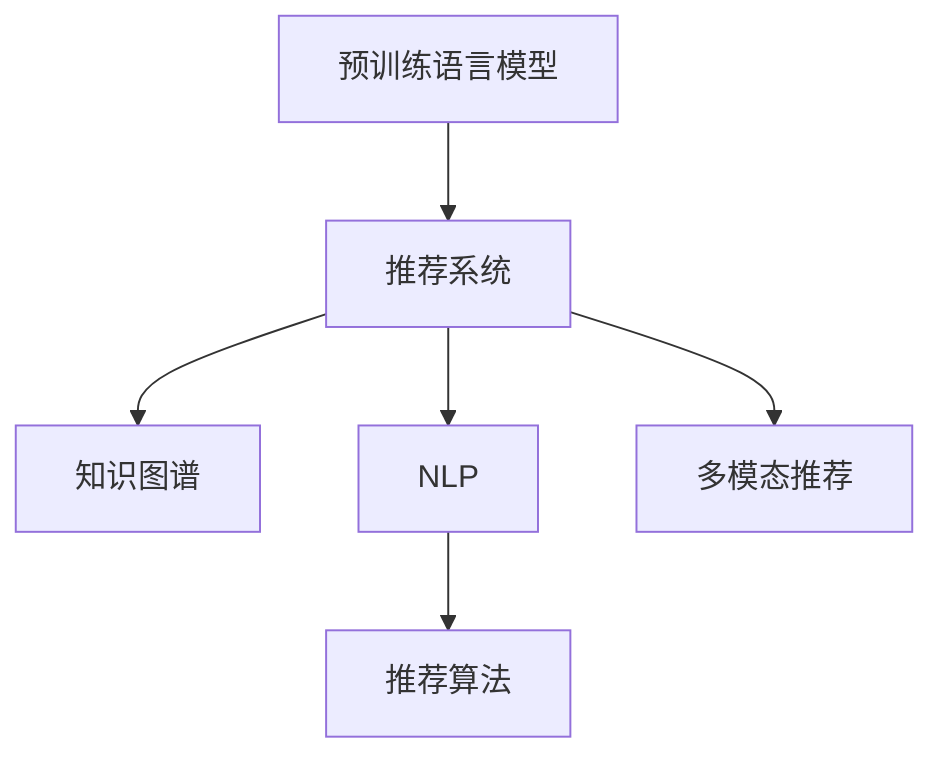

                 

## 1. 背景介绍

### 1.1 问题由来
推荐系统作为现代互联网应用的核心组件，帮助用户发现新内容、满足个性化需求。从Netflix的个性化推荐、亚马逊的商品推荐，到社交网络的兴趣推荐、在线广告的定向投放，推荐系统已经渗透到生活的方方面面。

然而，当前的推荐系统也存在许多局限性：
- **缺乏上下文理解**：传统的协同过滤、基于内容的推荐方法忽略了用户行为和物品属性的上下文信息。
- **泛化能力不足**：许多推荐算法依赖于大规模历史数据，难以泛化到新用户和新物品。
- **长尾物品问题**：用户行为数据通常集中在少数热门物品上，长尾物品的推荐效果欠佳。
- **公平性和多样性**：算法难以兼顾个性化推荐和公平性、多样性，容易导致"信息茧房"。

随着预训练语言模型(Pretrained Language Models, LLMs)的兴起，利用其在自然语言处理(NLP)领域的强大能力，有望突破上述推荐系统的局限，构建更加智能化、个性化、公平、可解释的推荐系统。

### 1.2 问题核心关键点
基于预训练语言模型的推荐系统具有以下特点：
- **上下文理解**：通过语言模型对用户行为和物品属性的上下文信息进行建模，捕捉用户偏好和物品特性。
- **泛化能力**：利用大规模预训练数据和丰富的语言知识，实现更好的泛化性能，适应新用户和新物品。
- **长尾物品推荐**：利用大模型的语言生成能力，可以自动生成描述长尾物品的文本信息，提高长尾物品的曝光率和推荐效果。
- **公平性和多样性**：通过语言生成，可以有效控制推荐结果的公平性和多样性，减少"信息茧房"的风险。
- **可解释性**：利用语言模型可解释性强的特点，可以提供推荐结果的语义解释，增强系统的透明度和可信度。

这些特点使得基于预训练语言模型的推荐系统在诸多应用中展现出前所未有的优势，推动了推荐系统的智能化升级。

## 2. 核心概念与联系

### 2.1 核心概念概述

为更好地理解基于预训练语言模型的推荐系统，本节将介绍几个密切相关的核心概念：

- 预训练语言模型(LLMs)：如BERT、GPT等，通过在大规模无标签文本语料上进行自监督学习，学习到语言的通用表示。
- 推荐系统：根据用户历史行为和物品属性，为用户推荐新物品的推荐系统。
- 知识图谱(KG)：结构化的实体关系图，帮助推荐系统理解实体之间的语义关系，如商品类别、用户画像等。
- 自然语言处理(NLP)：涉及语言理解、生成、分析和应用的技术，预训练语言模型是其核心技术之一。
- 推荐算法：基于协同过滤、内容匹配等规则的推荐方法，预训练语言模型可以结合这些算法优化推荐结果。
- 多模态推荐：结合文本、图像、语音等多模态信息，提高推荐的全面性和准确性。

这些核心概念之间的逻辑关系可以通过以下Mermaid流程图来展示：



这个流程图展示了大语言模型在推荐系统中的应用框架：

1. 预训练语言模型学习到语言的通用表示，作为推荐系统的重要组件。
2. 推荐系统利用大模型的上下文理解能力，优化推荐结果。
3. 知识图谱通过实体关系描述，补充大模型的知识体系。
4. NLP技术帮助理解自然语言输入，增强推荐系统的人机交互能力。
5. 推荐算法结合大模型能力，提升推荐系统的性能。
6. 多模态信息结合，丰富推荐系统的内容维度。

## 3. 核心算法原理 & 具体操作步骤
### 3.1 算法原理概述

基于预训练语言模型的推荐系统，本质上是利用大模型的语言生成能力，从自然语言描述中抽取特征，优化推荐结果。具体来说，可以包括以下几个步骤：

1. 利用大模型的预训练权重作为推荐模型的初始化参数。
2. 在推荐任务上，通过有监督学习更新模型参数，优化推荐结果。
3. 结合知识图谱和多模态信息，增强推荐的全面性和准确性。

这些步骤结合大模型的上下文理解能力和泛化能力，使得推荐系统能够突破传统方法的局限，实现更加智能化和个性化的推荐。

### 3.2 算法步骤详解

以下详细介绍基于预训练语言模型的推荐系统的具体实现步骤：

**Step 1: 数据预处理**

1. **数据收集**：收集用户行为数据、物品属性数据、用户画像、知识图谱等多源数据。
2. **数据清洗**：去除无效数据，处理缺失值和异常值，统一数据格式。
3. **特征提取**：对用户行为和物品属性进行编码，生成适合输入大模型的特征向量。

**Step 2: 模型初始化**

1. **选择预训练模型**：根据推荐任务的特点，选择合适的预训练语言模型，如BERT、GPT等。
2. **加载预训练权重**：从预训练模型库中加载模型权重，作为推荐模型的初始化参数。

**Step 3: 模型训练**

1. **设计训练目标**：根据推荐任务，设计训练目标函数，如点击率预测、转化率预测等。
2. **构建损失函数**：选择适合推荐任务的损失函数，如交叉熵损失、均方误差损失等。
3. **训练模型**：使用有监督学习算法(如梯度下降)训练推荐模型，更新模型参数。

**Step 4: 模型评估**

1. **划分数据集**：将数据集划分为训练集、验证集和测试集，进行模型评估。
2. **评估指标**：根据推荐任务，选择适合的评估指标，如准确率、召回率、F1-score等。
3. **模型调优**：根据评估结果，调整模型参数，提高模型性能。

**Step 5: 多模态融合**

1. **特征融合**：将不同模态的信息进行融合，生成统一的特征向量。
2. **模型优化**：结合多模态信息，优化推荐模型，提高推荐效果。

**Step 6: 部署上线**

1. **模型保存**：将训练好的推荐模型保存为模型文件，便于后续使用。
2. **服务部署**：将模型封装为API服务，部署到生产环境中，提供推荐服务。

### 3.3 算法优缺点

基于预训练语言模型的推荐系统具有以下优点：
1. **上下文理解**：能够从自然语言描述中捕捉到用户行为和物品属性的上下文信息，提高推荐的准确性和个性化程度。
2. **泛化能力**：利用大规模预训练数据和丰富的语言知识，实现更好的泛化性能，适应新用户和新物品。
3. **长尾物品推荐**：能够自动生成描述长尾物品的文本信息，提高长尾物品的曝光率和推荐效果。
4. **公平性和多样性**：能够通过语言生成，有效控制推荐结果的公平性和多样性，减少"信息茧房"的风险。
5. **可解释性**：利用语言模型可解释性强的特点，可以提供推荐结果的语义解释，增强系统的透明度和可信度。

同时，该方法也存在一定的局限性：
1. **计算资源需求高**：预训练语言模型参数量较大，训练和推理需要高性能计算资源。
2. **模型复杂度高**：大模型的复杂度较高，模型训练和推理过程较为复杂。
3. **数据质量和标注需求**：推荐任务的标注数据质量要求高，需要大量高质量的标注数据。
4. **过拟合风险**：大模型容易过拟合，尤其是当标注数据较少时。
5. **可解释性不足**：语言模型的黑盒特性，难以解释其内部工作机制和决策逻辑。

尽管存在这些局限性，但基于预训练语言模型的推荐系统仍然具有很大的发展潜力，特别是在数据质量和标注要求较高的推荐任务中。

### 3.4 算法应用领域

基于预训练语言模型的推荐系统，已经在多个领域得到了应用，例如：

- 电子商务推荐：帮助用户发现感兴趣的商品，提高转化率。
- 在线教育推荐：推荐适合用户兴趣和能力的学习内容，提高学习效果。
- 视频推荐：为用户推荐感兴趣的视频内容，提高观看体验。
- 音乐推荐：推荐符合用户口味的音乐，提升音乐平台的用户黏性。
- 新闻推荐：根据用户兴趣，推荐感兴趣的新闻内容，提高信息获取效率。
- 旅行推荐：推荐符合用户旅行目的地的旅行方案，提升旅游体验。

除了上述这些经典应用外，预训练语言模型在推荐系统中的创新应用也在不断涌现，如社交网络推荐、新闻广告定向等，为推荐系统带来了新的发展方向。

## 4. 数学模型和公式 & 详细讲解 & 举例说明

### 4.1 数学模型构建

假设推荐系统输入为用户行为数据 $X$ 和物品属性数据 $Y$，输出为推荐结果 $Z$。利用预训练语言模型 $M_{\theta}$，可以建立如下推荐模型：

$$
Z = M_{\theta}(X, Y)
$$

其中 $X$ 和 $Y$ 为输入的特征向量，$Z$ 为输出推荐结果。$\theta$ 为模型参数，通过有监督学习进行更新。

### 4.2 公式推导过程

在推荐任务中，常见的训练目标为预测用户点击行为。假设用户点击物品的概率为 $p(y=1|X, Y, \theta)$，则点击率预测的目标函数为：

$$
\mathcal{L}(\theta) = -\frac{1}{N}\sum_{i=1}^N \log p(y_i=1|X_i, Y_i, \theta)
$$

其中 $N$ 为训练样本数，$(X_i, Y_i, y_i)$ 为第 $i$ 个样本，$y_i \in \{0, 1\}$ 为标签。

根据大模型的输出，可以得到点击率的预测公式为：

$$
p(y_i=1|X_i, Y_i, \theta) = \sigma(\text{softmax}(M_{\theta}(X_i, Y_i)))
$$

其中 $\sigma$ 为 sigmoid 函数，$\text{softmax}$ 为softmax函数。$M_{\theta}(X_i, Y_i)$ 为预训练语言模型的输出。

结合上述公式，可以通过梯度下降等优化算法，训练推荐模型，最小化目标函数 $\mathcal{L}(\theta)$。

### 4.3 案例分析与讲解

以新闻推荐为例，假设用户的历史行为数据为 $X$，新闻文章的标题和内容为 $Y$。预训练语言模型 $M_{\theta}$ 可以捕捉到文章的语义信息，生成适合输入的语言特征。训练目标为预测用户是否会点击某篇文章，目标函数为：

$$
\mathcal{L}(\theta) = -\frac{1}{N}\sum_{i=1}^N \log p(y_i=1|X_i, Y_i, \theta)
$$

在训练过程中，可以通过样本标注数据，计算损失函数 $\mathcal{L}(\theta)$，并使用梯度下降等优化算法更新模型参数 $\theta$。最终，得到的推荐模型 $M_{\theta}$ 可以用于预测新用户是否会点击某篇文章，实现个性化新闻推荐。

## 5. 项目实践：代码实例和详细解释说明
### 5.1 开发环境搭建

在进行推荐系统开发前，我们需要准备好开发环境。以下是使用Python进行PyTorch开发的环境配置流程：

1. 安装Anaconda：从官网下载并安装Anaconda，用于创建独立的Python环境。

2. 创建并激活虚拟环境：
```bash
conda create -n pytorch-env python=3.8 
conda activate pytorch-env
```

3. 安装PyTorch：根据CUDA版本，从官网获取对应的安装命令。例如：
```bash
conda install pytorch torchvision torchaudio cudatoolkit=11.1 -c pytorch -c conda-forge
```

4. 安装Transformers库：
```bash
pip install transformers
```

5. 安装各类工具包：
```bash
pip install numpy pandas scikit-learn matplotlib tqdm jupyter notebook ipython
```

完成上述步骤后，即可在`pytorch-env`环境中开始推荐系统开发。

### 5.2 源代码详细实现

下面我们以新闻推荐系统为例，给出使用Transformers库进行推荐系统开发的PyTorch代码实现。

首先，定义推荐系统的数据处理函数：

```python
from transformers import BertTokenizer
from torch.utils.data import Dataset
import torch

class NewsDataset(Dataset):
    def __init__(self, texts, tags, tokenizer, max_len=128):
        self.texts = texts
        self.tags = tags
        self.tokenizer = tokenizer
        self.max_len = max_len
        
    def __len__(self):
        return len(self.texts)
    
    def __getitem__(self, item):
        text = self.texts[item]
        tags = self.tags[item]
        
        encoding = self.tokenizer(text, return_tensors='pt', max_length=self.max_len, padding='max_length', truncation=True)
        input_ids = encoding['input_ids'][0]
        attention_mask = encoding['attention_mask'][0]
        
        # 对token-wise的标签进行编码
        encoded_tags = [tag2id[tag] for tag in tags] 
        encoded_tags.extend([tag2id['O']] * (self.max_len - len(encoded_tags)))
        labels = torch.tensor(encoded_tags, dtype=torch.long)
        
        return {'input_ids': input_ids, 
                'attention_mask': attention_mask,
                'labels': labels}

# 标签与id的映射
tag2id = {'O': 0, 'B-NEWS': 1, 'I-NEWS': 2}
id2tag = {v: k for k, v in tag2id.items()}

# 创建dataset
tokenizer = BertTokenizer.from_pretrained('bert-base-cased')

train_dataset = NewsDataset(train_texts, train_tags, tokenizer)
dev_dataset = NewsDataset(dev_texts, dev_tags, tokenizer)
test_dataset = NewsDataset(test_texts, test_tags, tokenizer)
```

然后，定义模型和优化器：

```python
from transformers import BertForTokenClassification, AdamW

model = BertForTokenClassification.from_pretrained('bert-base-cased', num_labels=len(tag2id))

optimizer = AdamW(model.parameters(), lr=2e-5)
```

接着，定义训练和评估函数：

```python
from torch.utils.data import DataLoader
from tqdm import tqdm
from sklearn.metrics import classification_report

device = torch.device('cuda') if torch.cuda.is_available() else torch.device('cpu')
model.to(device)

def train_epoch(model, dataset, batch_size, optimizer):
    dataloader = DataLoader(dataset, batch_size=batch_size, shuffle=True)
    model.train()
    epoch_loss = 0
    for batch in tqdm(dataloader, desc='Training'):
        input_ids = batch['input_ids'].to(device)
        attention_mask = batch['attention_mask'].to(device)
        labels = batch['labels'].to(device)
        model.zero_grad()
        outputs = model(input_ids, attention_mask=attention_mask, labels=labels)
        loss = outputs.loss
        epoch_loss += loss.item()
        loss.backward()
        optimizer.step()
    return epoch_loss / len(dataloader)

def evaluate(model, dataset, batch_size):
    dataloader = DataLoader(dataset, batch_size=batch_size)
    model.eval()
    preds, labels = [], []
    with torch.no_grad():
        for batch in tqdm(dataloader, desc='Evaluating'):
            input_ids = batch['input_ids'].to(device)
            attention_mask = batch['attention_mask'].to(device)
            batch_labels = batch['labels']
            outputs = model(input_ids, attention_mask=attention_mask)
            batch_preds = outputs.logits.argmax(dim=2).to('cpu').tolist()
            batch_labels = batch_labels.to('cpu').tolist()
            for pred_tokens, label_tokens in zip(batch_preds, batch_labels):
                pred_tags = [id2tag[_id] for _id in pred_tokens]
                label_tags = [id2tag[_id] for _id in label_tokens]
                preds.append(pred_tags[:len(label_tags)])
                labels.append(label_tags)

    print(classification_report(labels, preds))
```

最后，启动训练流程并在测试集上评估：

```python
epochs = 5
batch_size = 16

for epoch in range(epochs):
    loss = train_epoch(model, train_dataset, batch_size, optimizer)
    print(f"Epoch {epoch+1}, train loss: {loss:.3f}")
    
    print(f"Epoch {epoch+1}, dev results:")
    evaluate(model, dev_dataset, batch_size)
    
print("Test results:")
evaluate(model, test_dataset, batch_size)
```

以上就是使用PyTorch对BERT进行新闻推荐系统开发的完整代码实现。可以看到，得益于Transformers库的强大封装，我们可以用相对简洁的代码完成BERT模型的加载和微调。

### 5.3 代码解读与分析

让我们再详细解读一下关键代码的实现细节：

**NewsDataset类**：
- `__init__`方法：初始化文本、标签、分词器等关键组件。
- `__len__`方法：返回数据集的样本数量。
- `__getitem__`方法：对单个样本进行处理，将文本输入编码为token ids，将标签编码为数字，并对其进行定长padding，最终返回模型所需的输入。

**tag2id和id2tag字典**：
- 定义了标签与数字id之间的映射关系，用于将token-wise的预测结果解码回真实的标签。

**训练和评估函数**：
- 使用PyTorch的DataLoader对数据集进行批次化加载，供模型训练和推理使用。
- 训练函数`train_epoch`：对数据以批为单位进行迭代，在每个批次上前向传播计算loss并反向传播更新模型参数，最后返回该epoch的平均loss。
- 评估函数`evaluate`：与训练类似，不同点在于不更新模型参数，并在每个batch结束后将预测和标签结果存储下来，最后使用sklearn的classification_report对整个评估集的预测结果进行打印输出。

**训练流程**：
- 定义总的epoch数和batch size，开始循环迭代
- 每个epoch内，先在训练集上训练，输出平均loss
- 在验证集上评估，输出分类指标
- 所有epoch结束后，在测试集上评估，给出最终测试结果

可以看到，PyTorch配合Transformers库使得BERT微调的代码实现变得简洁高效。开发者可以将更多精力放在数据处理、模型改进等高层逻辑上，而不必过多关注底层的实现细节。

当然，工业级的系统实现还需考虑更多因素，如模型的保存和部署、超参数的自动搜索、更灵活的任务适配层等。但核心的微调范式基本与此类似。

## 6. 实际应用场景
### 6.1 智慧医疗推荐系统

基于大语言模型的推荐系统在医疗领域也有着广泛的应用前景。传统的医疗推荐系统往往只能提供简单的疾病查询和诊断建议，难以满足复杂多变的临床需求。而使用基于大模型的推荐系统，可以实现更加智能化、个性化的医疗推荐。

在医疗推荐中，可以利用大模型的语言生成能力，自动生成医嘱、诊断报告等自然语言文本，提高医疗信息的完整性和可读性。同时，结合医疗知识图谱，将专家知识引入推荐模型，实现更加准确、安全的医疗推荐。

### 6.2 智能客服推荐系统

智能客服推荐系统也是预训练语言模型在NLP领域的重要应用。传统的客服系统依赖于固定的知识库和规则，难以应对复杂多变的用户需求。而使用基于大模型的推荐系统，可以实时生成推荐答案，提高客服系统的智能化水平。

在智能客服中，可以利用大模型的上下文理解能力，结合用户对话历史和问题上下文，自动生成推荐回答。结合多模态信息，如用户情绪、对话语境等，可以进一步提高推荐结果的准确性和多样性。

### 6.3 内容推荐系统

内容推荐系统是推荐系统的典型应用，帮助用户发现感兴趣的内容，提高信息获取效率。传统的推荐算法依赖于用户历史行为和物品属性，难以捕捉到用户真正的兴趣偏好。而使用基于大模型的推荐系统，可以更好地理解用户偏好和内容特性，实现更加个性化的推荐。

在内容推荐中，可以利用大模型的语言生成能力，自动生成推荐内容的摘要、标题等，提高推荐结果的可读性。结合多模态信息，如图像、视频、音频等，可以进一步丰富推荐内容的多样性。

### 6.4 未来应用展望

随着大语言模型和推荐系统的不断发展，基于大模型的推荐系统将呈现以下几个发展趋势：

1. **上下文理解**：未来推荐系统将更加注重上下文信息的理解，结合用户行为、物品属性、时间信息等，提供更加个性化和多样化的推荐。
2. **泛化能力**：利用大规模预训练数据和丰富的语言知识，实现更好的泛化性能，适应新用户和新物品。
3. **长尾物品推荐**：能够自动生成描述长尾物品的文本信息，提高长尾物品的曝光率和推荐效果。
4. **公平性和多样性**：通过语言生成，有效控制推荐结果的公平性和多样性，减少"信息茧房"的风险。
5. **可解释性**：利用语言模型可解释性强的特点，可以提供推荐结果的语义解释，增强系统的透明度和可信度。

## 7. 工具和资源推荐
### 7.1 学习资源推荐

为了帮助开发者系统掌握大语言模型推荐系统的理论基础和实践技巧，这里推荐一些优质的学习资源：

1. 《推荐系统实战》系列博文：由大模型技术专家撰写，深入浅出地介绍了推荐系统的工作原理和最新进展。

2. CS373《推荐系统》课程：斯坦福大学开设的推荐系统经典课程，涵盖推荐系统理论基础和实际应用案例。

3. 《推荐系统》书籍：经典推荐系统专著，深入讲解推荐系统的工作原理和应用方法。

4. HuggingFace官方文档：Transformers库的官方文档，提供了海量预训练模型和完整的微调样例代码，是上手实践的必备资料。

5. KDD Cup推荐系统竞赛：全球顶级数据科学竞赛，涉及推荐系统领域的最新研究和前沿技术，推荐系统从业者的必看资源。

通过对这些资源的学习实践，相信你一定能够快速掌握大语言模型推荐系统的精髓，并用于解决实际的推荐问题。
###  7.2 开发工具推荐

高效的开发离不开优秀的工具支持。以下是几款用于大语言模型推荐系统开发的常用工具：

1. PyTorch：基于Python的开源深度学习框架，灵活动态的计算图，适合快速迭代研究。大部分预训练语言模型都有PyTorch版本的实现。

2. TensorFlow：由Google主导开发的开源深度学习框架，生产部署方便，适合大规模工程应用。同样有丰富的预训练语言模型资源。

3. Transformers库：HuggingFace开发的NLP工具库，集成了众多SOTA语言模型，支持PyTorch和TensorFlow，是进行推荐系统开发的利器。

4. Weights & Biases：模型训练的实验跟踪工具，可以记录和可视化模型训练过程中的各项指标，方便对比和调优。与主流深度学习框架无缝集成。

5. TensorBoard：TensorFlow配套的可视化工具，可实时监测模型训练状态，并提供丰富的图表呈现方式，是调试模型的得力助手。

6. Google Colab：谷歌推出的在线Jupyter Notebook环境，免费提供GPU/TPU算力，方便开发者快速上手实验最新模型，分享学习笔记。

合理利用这些工具，可以显著提升大语言模型推荐系统的开发效率，加快创新迭代的步伐。

### 7.3 相关论文推荐

大语言模型推荐系统的发展源于学界的持续研究。以下是几篇奠基性的相关论文，推荐阅读：

1. Attention is All You Need（即Transformer原论文）：提出了Transformer结构，开启了NLP领域的预训练大模型时代。

2. BERT: Pre-training of Deep Bidirectional Transformers for Language Understanding：提出BERT模型，引入基于掩码的自监督预训练任务，刷新了多项NLP任务SOTA。

3. Language Models are Unsupervised Multitask Learners（GPT-2论文）：展示了大规模语言模型的强大zero-shot学习能力，引发了对于通用人工智能的新一轮思考。

4. Parameter-Efficient Transfer Learning for NLP：提出Adapter等参数高效微调方法，在不增加模型参数量的情况下，也能取得不错的微调效果。

5. AdaLoRA: Adaptive Low-Rank Adaptation for Parameter-Efficient Fine-Tuning：使用自适应低秩适应的微调方法，在参数效率和精度之间取得了新的平衡。

这些论文代表了大语言模型推荐系统的发展脉络。通过学习这些前沿成果，可以帮助研究者把握学科前进方向，激发更多的创新灵感。

## 8. 总结：未来发展趋势与挑战

### 8.1 总结

本文对基于预训练语言模型的推荐系统进行了全面系统的介绍。首先阐述了推荐系统面临的诸多局限，明确了大语言模型推荐系统的优势和适用性。其次，从原理到实践，详细讲解了大语言模型推荐系统的核心算法和操作步骤，给出了推荐系统开发的完整代码实例。同时，本文还广泛探讨了大语言模型推荐系统在医疗、客服、内容推荐等多个领域的应用前景，展示了其广阔的发展潜力。此外，本文精选了推荐系统的各类学习资源，力求为读者提供全方位的技术指引。

通过本文的系统梳理，可以看到，基于大语言模型的推荐系统正在成为NLP领域的重要范式，极大地拓展了推荐系统的应用边界，催生了更多的落地场景。受益于大规模语料的预训练，推荐系统能够更好地捕捉用户行为和物品属性的上下文信息，实现更加智能化和个性化的推荐。未来，伴随大语言模型的不断发展，推荐系统将进一步突破传统方法的局限，构建更加高效、公平、可信的推荐服务。

### 8.2 未来发展趋势

展望未来，基于预训练语言模型的推荐系统将呈现以下几个发展趋势：

1. **上下文理解**：未来推荐系统将更加注重上下文信息的理解，结合用户行为、物品属性、时间信息等，提供更加个性化和多样化的推荐。
2. **泛化能力**：利用大规模预训练数据和丰富的语言知识，实现更好的泛化性能，适应新用户和新物品。
3. **长尾物品推荐**：能够自动生成描述长尾物品的文本信息，提高长尾物品的曝光率和推荐效果。
4. **公平性和多样性**：通过语言生成，有效控制推荐结果的公平性和多样性，减少"信息茧房"的风险。
5. **可解释性**：利用语言模型可解释性强的特点，可以提供推荐结果的语义解释，增强系统的透明度和可信度。

这些趋势凸显了大语言模型推荐系统的广泛应用前景。这些方向的探索发展，必将进一步提升推荐系统的性能和应用范围，为推荐系统带来新的突破。

### 8.3 面临的挑战

尽管基于大语言模型的推荐系统已经取得了瞩目成就，但在迈向更加智能化、普适化应用的过程中，它仍面临着诸多挑战：

1. **计算资源需求高**：预训练语言模型参数量较大，训练和推理需要高性能计算资源。
2. **模型复杂度高**：大模型的复杂度较高，模型训练和推理过程较为复杂。
3. **数据质量和标注需求**：推荐任务的标注数据质量要求高，需要大量高质量的标注数据。
4. **过拟合风险**：大模型容易过拟合，尤其是当标注数据较少时。
5. **可解释性不足**：语言模型的黑盒特性，难以解释其内部工作机制和决策逻辑。

尽管存在这些挑战，但基于大语言模型的推荐系统仍然具有很大的发展潜力，特别是在数据质量和标注要求较高的推荐任务中。

### 8.4 研究展望

面对基于大语言模型的推荐系统所面临的种种挑战，未来的研究需要在以下几个方面寻求新的突破：

1. **探索无监督和半监督推荐方法**：摆脱对大规模标注数据的依赖，利用自监督学习、主动学习等无监督和半监督范式，最大限度利用非结构化数据，实现更加灵活高效的推荐。

2. **研究参数高效和计算高效的推荐范式**：开发更加参数高效的推荐方法，在固定大部分预训练参数的同时，只更新极少量的任务相关参数。同时优化推荐模型的计算图，减少前向传播和反向传播的资源消耗，实现更加轻量级、实时性的部署。

3. **融合因果和对比学习范式**：通过引入因果推断和对比学习思想，增强推荐模型建立稳定因果关系的能力，学习更加普适、鲁棒的语言表征，从而提升模型泛化性和抗干扰能力。

4. **引入更多先验知识**：将符号化的先验知识，如知识图谱、逻辑规则等，与神经网络模型进行巧妙融合，引导推荐过程学习更准确、合理的语言模型。同时加强不同模态数据的整合，实现视觉、语音等多模态信息与文本信息的协同建模。

5. **结合因果分析和博弈论工具**：将因果分析方法引入推荐模型，识别出模型决策的关键特征，增强推荐结果的因果性和逻辑性。借助博弈论工具刻画人机交互过程，主动探索并规避模型的脆弱点，提高系统稳定性。

6. **纳入伦理道德约束**：在模型训练目标中引入伦理导向的评估指标，过滤和惩罚有偏见、有害的输出倾向。同时加强人工干预和审核，建立模型行为的监管机制，确保输出符合人类价值观和伦理道德。

这些研究方向的探索，必将引领基于大语言模型的推荐系统技术迈向更高的台阶，为构建安全、可靠、可解释、可控的推荐服务提供坚实基础。面向未来，基于大语言模型的推荐系统还需要与其他人工智能技术进行更深入的融合，如知识表示、因果推理、强化学习等，多路径协同发力，共同推动自然语言理解和智能交互系统的进步。只有勇于创新、敢于突破，才能不断拓展语言模型的边界，让智能技术更好地造福人类社会。

## 9. 附录：常见问题与解答

**Q1：大语言模型推荐系统是否适用于所有推荐任务？**

A: 大语言模型推荐系统在大多数推荐任务上都能取得不错的效果，特别是对于数据量较小的任务。但对于一些特定领域的任务，如医学、法律等，仅仅依靠通用语料预训练的模型可能难以很好地适应。此时需要在特定领域语料上进一步预训练，再进行微调，才能获得理想效果。此外，对于一些需要时效性、个性化很强的任务，如对话、推荐等，微调方法也需要针对性的改进优化。

**Q2：推荐系统中如何选择合适的预训练模型？**

A: 在选择预训练模型时，需要考虑任务的特点和数据的分布。常见的预训练模型如BERT、GPT等，在不同的任务上表现有所不同。一般建议根据任务类型，选择与数据分布相匹配的预训练模型。例如，对于文本处理任务，BERT和GPT表现较好；对于图像处理任务，可以考虑ViT等视觉模型。

**Q3：推荐系统中的用户行为数据处理有哪些关键点？**

A: 用户行为数据是推荐系统的重要输入，处理得当可以显著提升推荐效果。关键点包括：
1. 数据清洗：去除无效数据，处理缺失值和异常值，统一数据格式。
2. 特征提取：将用户行为数据转换为适合输入的特征向量，如点击次数、浏览时长、评分等。
3. 数据增强：通过数据增强技术，如随机缺失、回放等，提高数据的多样性和泛化能力。
4. 用户画像构建：利用用户行为数据构建用户画像，用于推荐模型的输入。

**Q4：推荐系统中的物品属性数据处理有哪些关键点？**

A: 物品属性数据是推荐系统的重要输入，处理得当可以显著提升推荐效果。关键点包括：
1. 属性提取：从物品的标题、描述、标签等文本数据中提取关键属性。
2. 属性编码：将物品属性转换为适合输入的特征向量，如词向量、稠密向量等。
3. 属性聚合：利用文本处理技术，将物品属性进行聚合，提取有意义的特征。
4. 属性生成：利用大模型的语言生成能力，自动生成物品的描述文本，用于推荐模型的输入。

**Q5：推荐系统中的模型训练有哪些关键点？**

A: 模型训练是推荐系统的核心环节，关键点包括：
1. 损失函数设计：根据推荐任务的特点，选择合适的损失函数，如交叉熵损失、均方误差损失等。
2. 优化算法选择：根据任务的特点和数据分布，选择合适的优化算法，如Adam、SGD等。
3. 超参数调优：根据实验结果，调整学习率、批大小、迭代轮数等超参数，提升模型性能。
4. 正则化技术：使用L2正则、Dropout、Early Stopping等正则化技术，防止模型过度拟合。
5. 数据增强：通过数据增强技术，如回译、近义替换等，提高模型的泛化能力。

这些关键点需要在推荐系统开发中加以关注，方能得到理想的推荐效果。

---

作者：禅与计算机程序设计艺术 / Zen and the Art of Computer Programming

