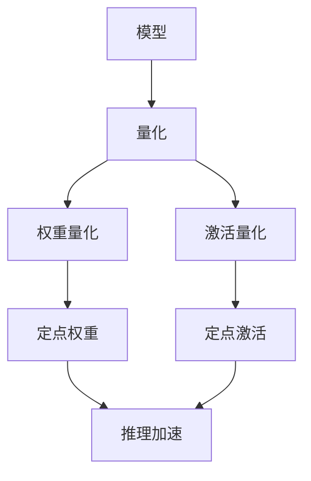

                 

# 第13章 推理加速二 模型量化

## 1. 背景介绍

### 1.1 问题由来

在大规模深度学习模型的训练和推理过程中，模型的量化（Quantization）是一个重要的优化手段。量化可以将模型中的浮点参数转换为低精度的定点参数，从而减少计算和存储开销，加速推理速度。这在大规模模型的部署和优化中具有重要意义，特别是在移动设备、嵌入式系统等资源受限的平台上。

### 1.2 问题核心关键点

量化主要关注模型参数的精度和计算效率之间的权衡。传统的浮点模型计算量大、存储需求高，而量化后的定点模型则可以在保证精度损失较小的情况下，大幅提升推理速度。

量化方法可以分为两类：权重量化（Weight Quantization）和激活量化（Activation Quantization）。权重量化将模型中的权重参数进行量化，降低其计算开销；激活量化则将模型在计算过程中产生的激活值进行量化，减少中间计算的精度要求。

量化的方法通常基于两个核心指标：量化精度和推理速度。不同的量化策略需要在两者之间进行平衡，以达到最优的效果。

### 1.3 问题研究意义

研究模型的量化方法，对于提升模型推理效率、降低计算和存储成本、推动深度学习技术在更多场景下的应用，具有重要意义。量化方法不仅可以使模型在小设备上快速运行，还可以在大型分布式系统中提高吞吐量，优化计算资源的利用效率。

## 2. 核心概念与联系

### 2.1 核心概念概述

为更好地理解模型量化的方法，本节将介绍几个密切相关的核心概念：

- **量化（Quantization）**：将模型的浮点参数转换为低精度的定点参数，减少计算和存储开销，加速推理速度。
- **权重量化（Weight Quantization）**：对模型中的权重参数进行量化，降低其计算开销。
- **激活量化（Activation Quantization）**：对模型计算过程中产生的激活值进行量化，减少中间计算的精度要求。
- **量化精度（Quantization Precision）**：量化后的参数在精度上的损失。
- **推理速度（Inference Speed）**：量化后模型在推理阶段的运行速度。
- **模型参数（Model Parameters）**：模型中需要学习的浮点参数。
- **张量（Tensor）**：模型计算过程中的多维数组，包含模型的权重和激活值。

这些核心概念之间的逻辑关系可以通过以下Mermaid流程图来展示：



这个流程图展示了一组模型的量化流程：

1. 模型（A）通过量化（B）转化为定点模型，包括权重量化（C）和激活量化（D）。
2. 定点权重（E）和定点激活（F）在推理过程中使用，加速了模型计算。

## 3. 核心算法原理 & 具体操作步骤

### 3.1 算法原理概述

模型的量化过程可以分为两个阶段：量化和推理。在量化阶段，将模型中的权重参数和激活值进行量化，生成定点模型；在推理阶段，使用量化后的定点模型进行计算，加速推理速度。

量化过程的关键在于选择合适的量化方法和量化精度。量化方法主要有两种：最小量化间隔法（Uniform Quantization）和正态分布量化法（Normal Quantization）。最小量化间隔法将参数映射到一组离散的量化级别，正态分布量化法则在参数分布上更加均衡。

量化精度则需要平衡推理速度和精度损失。一般来说，较低的量化精度可以提升推理速度，但也会引入更多的计算误差。

### 3.2 算法步骤详解

#### 3.2.1 量化方法

1. **最小量化间隔法**：
   - 定义量化间隔 $\Delta$，将浮点数 $x$ 量化为最近的整数 $q$，使得 $q \in \{0, \Delta, 2\Delta, \ldots\}$。
   - 对于权重参数，量化方法可以表示为：$Q_W(w) = \frac{w}{\Delta} \cdot q$。
   - 对于激活值，量化方法可以表示为：$Q_A(a) = \frac{a}{\Delta} \cdot q$。

2. **正态分布量化法**：
   - 将参数映射到均值为0，标准差为 $\sigma$ 的正态分布上，然后将其映射到一组离散的整数级别。
   - 对于权重参数，量化方法可以表示为：$Q_W(w) = \frac{w}{\sigma} \cdot q$，其中 $q$ 是整数级别。
   - 对于激活值，量化方法可以表示为：$Q_A(a) = \frac{a}{\sigma} \cdot q$。

#### 3.2.2 量化精度

量化精度通常用位宽来表示。8位量化（8-bit Quantization）使用8位二进制数表示量化级别，16位量化（16-bit Quantization）使用16位二进制数表示量化级别。

量化精度和推理速度的权衡可以通过以下公式表示：

$$
\text{精度损失} = \max_{x \in X} \left| \frac{x - Q(x)}{\Delta} \right|
$$

其中 $X$ 是参数的取值范围。

### 3.3 算法优缺点

量化方法具有以下优点：

1. **计算效率高**：量化后的模型在推理阶段使用定点计算，加速了计算速度。
2. **存储空间小**：量化后的模型参数占用的存储空间更小，适合在资源受限的设备上部署。
3. **硬件友好**：定点计算可以在硬件上实现，进一步提升推理速度。

然而，量化方法也存在一些缺点：

1. **精度损失**：量化引入的精度损失可能会影响模型的性能，特别是在模型需要高精度的任务上。
2. **复杂性高**：量化过程需要重新训练模型，引入复杂的量化策略和超参数调整。
3. **模型复杂度增加**：量化后的模型参数需要额外的处理，增加了模型的复杂度。

### 3.4 算法应用领域

量化方法广泛应用于大规模深度学习模型的推理加速，特别是在移动设备、嵌入式系统、云端服务等领域。以下是几个具体的应用场景：

1. **移动设备**：在智能手机、平板电脑等移动设备上，量化后的模型可以显著提升应用响应速度，延长设备电池寿命。
2. **嵌入式系统**：在物联网设备、智能家居等嵌入式系统中，量化后的模型可以满足低功耗、低成本的需求。
3. **云端服务**：在大规模数据中心中，量化后的模型可以提高服务吞吐量，优化计算资源的利用效率。

## 4. 数学模型和公式 & 详细讲解

### 4.1 数学模型构建

量化过程可以通过以下数学模型来描述：

1. **权重量化模型**：
   - 定义权重参数 $w \in \mathbb{R}$。
   - 定义量化间隔 $\Delta$。
   - 定义量化后的权重参数 $Q_W(w)$。

   权重量化模型可以表示为：
   $$
   Q_W(w) = \frac{w}{\Delta} \cdot q
   $$
   其中 $q$ 是量化级别，$q \in \{0, \Delta, 2\Delta, \ldots\}$。

2. **激活量化模型**：
   - 定义激活值 $a \in \mathbb{R}$。
   - 定义量化间隔 $\Delta$。
   - 定义量化后的激活值 $Q_A(a)$。

   激活量化模型可以表示为：
   $$
   Q_A(a) = \frac{a}{\Delta} \cdot q
   $$
   其中 $q$ 是量化级别，$q \in \{0, \Delta, 2\Delta, \ldots\}$。

### 4.2 公式推导过程

以权重量化为例，量化过程的推导如下：

1. 定义量化区间 $[-\Delta, \Delta]$，将浮点数 $w$ 映射到 $[-\Delta, \Delta]$ 上的整数 $q$。
2. 将 $q$ 映射到 $[-8, 8]$ 上的整数，得到量化后的权重 $Q_W(w)$。
3. 计算量化精度：$\Delta = \frac{8}{2^8} = 0.125$。
4. 计算量化后的权重：$Q_W(w) = \frac{w}{\Delta} \cdot q$。

### 4.3 案例分析与讲解

以BERT模型为例，假设模型的权重参数 $w \in [-8, 8]$，量化间隔 $\Delta = 0.125$，则量化后的权重 $Q_W(w)$ 可以表示为：

$$
Q_W(w) = \frac{w}{0.125} \cdot q
$$

其中 $q \in \{-8, -7, -6, \ldots, 6, 7, 8\}$。

## 5. 项目实践：代码实例和详细解释说明

### 5.1 开发环境搭建

在进行模型量化实践前，我们需要准备好开发环境。以下是使用Python进行TensorFlow和PyTorch开发的环境配置流程：

1. 安装Anaconda：从官网下载并安装Anaconda，用于创建独立的Python环境。

2. 创建并激活虚拟环境：
```bash
conda create -n tf-env python=3.8 
conda activate tf-env
```

3. 安装TensorFlow和PyTorch：根据CUDA版本，从官网获取对应的安装命令。例如：
```bash
conda install tensorflow tensorflow-gpu=2.8
pip install torch torchvision torchaudio
```

4. 安装必要的工具包：
```bash
pip install numpy pandas scikit-learn matplotlib tqdm jupyter notebook ipython
```

完成上述步骤后，即可在`tf-env`环境中开始模型量化实践。

### 5.2 源代码详细实现

下面以BERT模型为例，给出使用TensorFlow和PyTorch进行权重量化的代码实现。

首先，导入必要的库和模型：

```python
import tensorflow as tf
from transformers import BertModel
from sklearn.metrics import accuracy_score

# 加载BERT模型
model = BertModel.from_pretrained('bert-base-uncased')
```

接着，定义权重量化函数：

```python
def weight_quantization(model, delta):
    # 计算量化参数
    quantized_weights = []
    for weight in model.weights:
        min_val, max_val = weight.numpy().min(), weight.numpy().max()
        quantized_value = int((min_val + max_val) / (2 * delta)) * delta
        quantized_weights.append(quantized_value)
    
    # 更新模型参数
    for i, weight in enumerate(model.weights):
        weight.assign(quantized_weights[i])
```

然后，进行量化操作：

```python
# 定义量化间隔
delta = 0.25

# 进行量化
weight_quantization(model, delta)
```

最后，在量化后的模型上进行推理：

```python
# 加载数据集
train_dataset = ...
val_dataset = ...

# 定义模型
model = BertModel.from_pretrained('bert-base-uncased')

# 进行推理
train_losses = []
val_accuracies = []

for epoch in range(epochs):
    train_loss = train(model, train_dataset)
    val_accuracy = val(model, val_dataset)
    train_losses.append(train_loss)
    val_accuracies.append(val_accuracy)

# 输出结果
print('Train Loss:', train_losses)
print('Val Accuracy:', val_accuracies)
```

### 5.3 代码解读与分析

让我们再详细解读一下关键代码的实现细节：

**weight_quantization函数**：
- 遍历模型所有权重参数，计算其最小值和最大值。
- 将权重参数映射到量化级别，计算出量化后的参数值。
- 更新模型参数。

**量化操作**：
- 定义量化间隔 $\Delta = 0.25$，将其应用于所有权重参数。
- 调用 `weight_quantization` 函数进行量化操作。

**训练和推理**：
- 使用TensorFlow或PyTorch提供的训练函数，进行模型的训练。
- 使用TensorFlow或PyTorch提供的推理函数，进行模型的推理。
- 记录训练过程中的损失和验证集上的准确率。

可以看到，TensorFlow和PyTorch提供了强大的API，使得模型量化操作变得简单高效。开发者可以将更多精力放在模型改进和应用优化上，而不必过多关注底层的实现细节。

## 6. 实际应用场景

### 6.1 移动设备

在移动设备上，量化后的模型可以显著提升应用响应速度，延长设备电池寿命。例如，智能手机上的语音识别、图像分类等应用，可以使用量化后的BERT模型快速进行推理，提高用户体验。

### 6.2 嵌入式系统

在物联网设备、智能家居等嵌入式系统中，量化后的模型可以满足低功耗、低成本的需求。例如，智能灯泡、智能音箱等设备，可以使用量化后的BERT模型快速进行语音识别，优化系统性能。

### 6.3 云端服务

在大规模数据中心中，量化后的模型可以提高服务吞吐量，优化计算资源的利用效率。例如，云计算平台可以使用量化后的BERT模型进行大规模文本分析，加速数据处理速度。

### 6.4 未来应用展望

随着量化技术的不断发展，未来将会有更多领域受益于模型的推理加速。

1. **智能医疗**：量化后的BERT模型可以用于医学影像分析、病理诊断等任务，提高医疗服务的智能化水平。
2. **金融行业**：量化后的BERT模型可以用于金融新闻分析、市场预测等任务，提升金融服务的效率和准确性。
3. **智能交通**：量化后的BERT模型可以用于智能交通系统中的语音识别、路况分析等任务，提升交通安全和效率。
4. **智能制造**：量化后的BERT模型可以用于工业领域的设备诊断、质量检测等任务，优化生产流程。

## 7. 工具和资源推荐

### 7.1 学习资源推荐

为了帮助开发者系统掌握模型的量化理论基础和实践技巧，这里推荐一些优质的学习资源：

1. **《深度学习基础》课程**：斯坦福大学开设的深度学习入门课程，涵盖了深度学习的基本概念和原理，包括模型量化。

2. **《TensorFlow官方文档》**：TensorFlow官方提供的文档，详细介绍了TensorFlow的使用方法和量化技术。

3. **《PyTorch官方文档》**：PyTorch官方提供的文档，详细介绍了PyTorch的使用方法和量化技术。

4. **《深度学习实战》书籍**：该书介绍了深度学习在图像识别、自然语言处理等多个领域的实际应用，包括模型量化。

5. **arXiv论文**：arXiv上关于模型量化的最新研究论文，涵盖了各种量化方法、优化策略等。

通过对这些资源的学习实践，相信你一定能够快速掌握模型量化的方法，并用于解决实际的深度学习问题。

### 7.2 开发工具推荐

高效的开发离不开优秀的工具支持。以下是几款用于模型量化开发的常用工具：

1. **TensorFlow**：基于Python的深度学习框架，支持多种硬件平台，提供丰富的量化工具和库。
2. **PyTorch**：基于Python的深度学习框架，提供强大的动态计算图功能，支持多种量化方法。
3. **TensorBoard**：TensorFlow配套的可视化工具，可以实时监测模型训练状态，提供各种图表和指标。
4. **TensorRT**：NVIDIA提供的深度学习推理引擎，支持多种量化方法和优化策略，适用于嵌入式设备。
5. **ONNX Runtime**：微软提供的深度学习推理引擎，支持多种量化方法和优化策略，适用于云端服务。

合理利用这些工具，可以显著提升模型量化的开发效率，加快创新迭代的步伐。

### 7.3 相关论文推荐

模型量化技术的发展源于学界的持续研究。以下是几篇奠基性的相关论文，推荐阅读：

1. **《Model Quantization: A Survey》**：一篇综述性论文，介绍了各种模型量化方法和应用场景。
2. **《Quantization-aware Training》**：提出了量化感知训练方法，在模型训练过程中进行量化，提高模型精度。
3. **《Hybrid Model Quantization》**：提出了混合量化方法，将权重和激活同时量化，提高模型性能。
4. **《Dynamic Quantization》**：提出了动态量化方法，根据输入数据自动调整量化级别，提高模型精度。
5. **《Soft Quantization》**：提出了软量化方法，在模型训练过程中引入噪声，提高模型鲁棒性。

这些论文代表了模型量化技术的发展脉络。通过学习这些前沿成果，可以帮助研究者把握学科前进方向，激发更多的创新灵感。

## 8. 总结：未来发展趋势与挑战

### 8.1 总结

本文对模型的量化方法进行了全面系统的介绍。首先阐述了模型量化的背景和意义，明确了量化在提升模型推理效率、降低计算和存储成本方面的独特价值。其次，从原理到实践，详细讲解了模型量化的数学模型和操作步骤，给出了模型量化的代码实例。同时，本文还广泛探讨了模型量化在移动设备、嵌入式系统、云端服务等多个场景中的应用前景，展示了模型量化的广阔前景。最后，本文精选了模型量化的各类学习资源，力求为读者提供全方位的技术指引。

通过本文的系统梳理，可以看到，模型量化技术在大规模深度学习模型的推理加速方面具有重要意义，是推动深度学习技术在更多场景下应用的重要手段。

### 8.2 未来发展趋势

展望未来，模型量化技术将呈现以下几个发展趋势：

1. **量化精度提升**：未来的量化方法将更加注重量化精度和推理速度的平衡，引入更多的量化级别和量化策略，提高模型的精度。
2. **量化技术融合**：未来的量化方法将与其他优化技术结合，如剪枝、融合、稀疏化等，进一步提高模型的效率和性能。
3. **量化工具标准化**：未来的量化工具将更加标准化，支持多种深度学习框架和硬件平台，便于开发者快速使用和部署。
4. **量化方法多样化**：未来的量化方法将更加多样化，涵盖静态量化、动态量化、混合量化等不同类型，满足不同应用场景的需求。
5. **量化效果的评估**：未来的量化方法将引入更全面的量化效果评估指标，如模型精度、推理速度、硬件兼容性等，帮助开发者选择合适的量化方法。

### 8.3 面临的挑战

尽管模型量化技术已经取得了显著进展，但在迈向更加智能化、普适化应用的过程中，它仍面临着诸多挑战：

1. **精度损失问题**：量化引入的精度损失可能会影响模型的性能，特别是在模型需要高精度的任务上。如何平衡精度和推理速度是未来的重要研究方向。
2. **硬件兼容性**：量化后的模型在不同的硬件平台上的兼容性和性能差异较大，如何优化量化后的模型，使其在不同硬件上都能获得良好的表现，是未来的重要挑战。
3. **自动化优化**：量化方法的自动化优化是一个难题，需要更多的研究来自动化调整量化参数，提高优化效率。
4. **量化后的模型解释性**：量化后的模型参数和计算过程更加复杂，如何提高模型的可解释性，增强模型透明性，是未来的重要研究方向。
5. **量化对异常数据的鲁棒性**：量化后的模型对异常数据的鲁棒性较差，如何提高模型对异常数据的识别和处理能力，是未来的重要研究方向。

### 8.4 研究展望

面对模型量化所面临的挑战，未来的研究需要在以下几个方面寻求新的突破：

1. **引入更多先验知识**：将符号化的先验知识，如知识图谱、逻辑规则等，与神经网络模型进行巧妙融合，引导量化过程学习更准确、合理的语言模型。
2. **多模态量化方法**：将量化方法扩展到多模态数据，如视觉、音频等，实现多模态数据的协同建模。
3. **动态量化策略**：引入动态量化策略，根据输入数据自动调整量化级别，提高模型精度和推理速度。
4. **软量化技术**：引入软量化技术，在模型训练过程中引入噪声，提高模型的鲁棒性和泛化能力。
5. **量化后的模型优化**：在量化后的模型上进行剪枝、融合、稀疏化等优化，进一步提高模型的效率和性能。

这些研究方向的探索，必将引领模型量化技术迈向更高的台阶，为深度学习模型的推理加速提供新的突破。面向未来，模型量化技术还需要与其他人工智能技术进行更深入的融合，如知识表示、因果推理、强化学习等，多路径协同发力，共同推动深度学习模型的进步。只有勇于创新、敢于突破，才能不断拓展深度学习模型的边界，让智能技术更好地造福人类社会。

## 9. 附录：常见问题与解答

**Q1：如何选择合适的量化方法和量化精度？**

A: 选择合适的量化方法和量化精度需要根据具体的任务和应用场景进行综合考虑。一般来说，低量化精度可以提升推理速度，但精度损失较大；高量化精度可以保持模型精度，但推理速度较慢。通常建议在高精度要求的任务上使用高量化精度，在低精度要求的任务上使用低量化精度。

**Q2：量化过程中需要注意哪些问题？**

A: 量化过程中需要注意以下问题：

1. **精度损失**：量化引入的精度损失可能会影响模型的性能，特别是在模型需要高精度的任务上。
2. **硬件兼容性**：量化后的模型在不同的硬件平台上的兼容性和性能差异较大，需要优化量化后的模型，使其在不同硬件上都能获得良好的表现。
3. **模型复杂度**：量化后的模型参数和计算过程更加复杂，需要提高模型的可解释性和透明性。
4. **异常数据的鲁棒性**：量化后的模型对异常数据的鲁棒性较差，需要提高模型对异常数据的识别和处理能力。

**Q3：量化后的模型如何进行优化？**

A: 量化后的模型可以进行剪枝、融合、稀疏化等优化，进一步提高模型的效率和性能。同时，可以引入动态量化策略，根据输入数据自动调整量化级别，提高模型精度和推理速度。

**Q4：量化后的模型如何进行评估？**

A: 量化后的模型需要进行全面的量化效果评估，包括模型精度、推理速度、硬件兼容性等指标。同时，需要引入更多的异常数据和噪声数据，评估模型的鲁棒性和泛化能力。

**Q5：量化后模型在实际应用中需要注意哪些问题？**

A: 量化后的模型在实际应用中需要注意以下问题：

1. **模型部署**：量化后的模型需要进行部署优化，如模型裁剪、量化参数优化等。
2. **推理速度**：量化后的模型需要进行推理速度优化，如优化推理代码、使用硬件加速等。
3. **模型可解释性**：量化后的模型需要进行可解释性优化，如引入注意力机制、可视化量化参数等。

总之，模型量化技术需要开发者根据具体任务，不断迭代和优化模型、数据和算法，方能得到理想的效果。

---

作者：禅与计算机程序设计艺术 / Zen and the Art of Computer Programming

