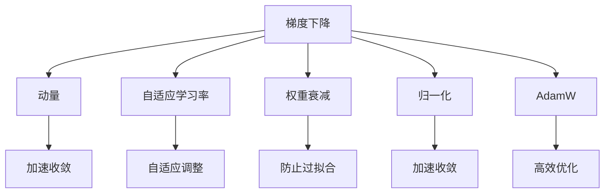

                 

# 第七章：初始化、优化和 AdamW 算法

## 1. 背景介绍

在深度学习模型的训练过程中，初始化和优化是两个极为重要的环节。良好的初始化方法能加速模型的收敛，提高模型的泛化能力；而高效的优化算法则能确保模型在复杂的损失函数下快速收敛，同时避免过拟合。本文将重点介绍一种常用的优化算法——AdamW，并详细讲解其优化原理和具体实现步骤。

## 2. 核心概念与联系

### 2.1 核心概念概述

为更好地理解AdamW算法的原理和应用，我们首先介绍几个相关的核心概念：

- **梯度下降法(Gradient Descent)**：一种基础的优化算法，通过反向传播计算梯度，不断更新模型参数以最小化损失函数。
- **动量(Momentum)**：通过累积历史梯度来平滑梯度变化，加速收敛。
- **自适应学习率(Adaptive Learning Rate)**：根据梯度的变化调整学习率，如Adagrad、Adam等。
- **权重衰减(Weight Decay)**：在损失函数中引入权重衰减项，防止过拟合。
- **归一化(Normalization)**：如批量归一化(Batch Normalization)，用于加速模型收敛。

### 2.2 核心概念联系

通过以下Mermaid流程图，我们可以清晰地看到这些核心概念之间的联系：



动量、自适应学习率、权重衰减和归一化都是对梯度下降法的一系列改进和优化，用于加速收敛、防止过拟合和提高模型的稳定性。而AdamW算法则融合了动量和自适应学习率的思想，进一步优化了梯度下降法的表现，成为了当前深度学习优化器的主流选择。

## 3. 核心算法原理 & 具体操作步骤

### 3.1 算法原理概述

AdamW算法是一种基于梯度的一阶优化算法，融合了动量和自适应学习率的优点。其核心思想是在动量算法的框架下，引入自适应学习率，并通过L2正则化项来增强泛化能力。

具体来说，AdamW算法维护两个动量变量，分别是梯度的一阶动量和二阶动量，然后在每次迭代中更新模型参数。更新公式如下：

$$
\begin{aligned}
&m_t = \beta_1 m_{t-1} + (1-\beta_1) g_t \\
&v_t = \beta_2 v_{t-1} + (1-\beta_2) g_t^2 \\
&\hat{m}_t = \frac{m_t}{1-\beta_1^t} \\
&\hat{v}_t = \frac{v_t}{1-\beta_2^t} \\
&\theta_{t+1} = \theta_t - \eta \frac{\hat{m}_t}{\sqrt{\hat{v}_t}+\epsilon} - \eta \lambda \theta_t
\end{aligned}
$$

其中，$m_t$和$v_t$分别表示梯度的一阶动量和二阶动量，$\beta_1$和$\beta_2$是衰减率，$\eta$是学习率，$\lambda$是L2正则化系数，$\epsilon$是一个很小的数，避免除数为0。$\theta_{t+1}$表示模型参数在第$t+1$次迭代后的更新值。

### 3.2 算法步骤详解

AdamW算法的主要步骤如下：

1. **初始化**：设置梯度的一阶动量和二阶动量为0，学习率和L2正则化系数$\lambda$为已知参数。

2. **计算梯度**：使用反向传播计算损失函数对每个模型参数的梯度。

3. **更新一阶动量**：将当前梯度与历史梯度的加权和相加，得到新的梯度一阶动量。

4. **更新二阶动量**：将当前梯度的平方与历史平方梯度的加权和相加，得到新的梯度二阶动量。

5. **归一化**：对一阶动量和二阶动量进行归一化处理，避免梯度爆炸和消失。

6. **更新模型参数**：根据归一化的动量，更新模型参数。

7. **重复迭代**：重复上述步骤直至收敛或达到预设的迭代次数。

### 3.3 算法优缺点

AdamW算法相比传统的梯度下降法和动量算法，具有以下优点：

- **自适应学习率**：通过动量变量自适应调整学习率，加速收敛。
- **二阶动量**：考虑梯度的二阶动量，提供了更平稳的梯度更新。
- **L2正则化**：引入正则化项，防止过拟合。

然而，AdamW算法也存在一些缺点：

- **学习率选择复杂**：需要手动调整学习率，选择合适的学习率仍需多次调参。
- **收敛不稳定**：在某些情况下，梯度动量可能会产生较大的波动，导致收敛不稳定。

### 3.4 算法应用领域

AdamW算法在深度学习领域得到了广泛应用，特别是在图像识别、自然语言处理等任务中表现出色。以下是一些常见的应用场景：

- **图像分类**：用于训练卷积神经网络，如LeNet、AlexNet等，以提高分类准确率。
- **自然语言处理**：用于训练序列到序列模型，如Seq2Seq模型，以提高翻译和生成效果。
- **强化学习**：用于训练策略梯度方法，如PGNet、TRPO等，以提高策略优化效果。
- **推荐系统**：用于训练协同过滤模型，以提高推荐效果。

## 4. 数学模型和公式 & 详细讲解 & 举例说明

### 4.1 数学模型构建

AdamW算法基于梯度的一阶和二阶动量，通过归一化处理和L2正则化项，更新模型参数。其数学模型可以表示为：

$$
\theta_{t+1} = \theta_t - \eta \frac{m_t}{\sqrt{v_t}+\epsilon} - \eta \lambda \theta_t
$$

其中，$\theta_{t+1}$表示第$t+1$次迭代后的模型参数，$\theta_t$表示第$t$次迭代后的模型参数，$m_t$表示梯度的一阶动量，$v_t$表示梯度的二阶动量，$\eta$表示学习率，$\lambda$表示L2正则化系数，$\epsilon$是一个很小的数，避免除数为0。

### 4.2 公式推导过程

AdamW算法的推导过程相对复杂，涉及多个动量变量的累积和归一化。以下是AdamW算法的主要推导步骤：

1. **梯度一阶动量**：

   $$
   m_t = \beta_1 m_{t-1} + (1-\beta_1) g_t
   $$

   其中，$g_t$表示第$t$次迭代的梯度，$m_t$表示第$t$次迭代的梯度一阶动量，$\beta_1$表示衰减率。

2. **梯度二阶动量**：

   $$
   v_t = \beta_2 v_{t-1} + (1-\beta_2) g_t^2
   $$

   其中，$g_t^2$表示第$t$次迭代的梯度平方，$v_t$表示第$t$次迭代的梯度二阶动量，$\beta_2$表示衰减率。

3. **归一化**：

   $$
   \hat{m}_t = \frac{m_t}{1-\beta_1^t}
   $$

   $$
   \hat{v}_t = \frac{v_t}{1-\beta_2^t}
   $$

   其中，$\hat{m}_t$表示归一化后的梯度一阶动量，$\hat{v}_t$表示归一化后的梯度二阶动量。

4. **更新模型参数**：

   $$
   \theta_{t+1} = \theta_t - \eta \frac{\hat{m}_t}{\sqrt{\hat{v}_t}+\epsilon} - \eta \lambda \theta_t
   $$

   其中，$\theta_{t+1}$表示第$t+1$次迭代后的模型参数，$\theta_t$表示第$t$次迭代后的模型参数，$\eta$表示学习率，$\lambda$表示L2正则化系数，$\epsilon$是一个很小的数，避免除数为0。

### 4.3 案例分析与讲解

为了更好地理解AdamW算法的应用，我们可以通过一个简单的例子来进行分析：

假设我们有一个简单的线性回归模型，其损失函数为均方误差损失，模型参数为$\theta_0$和$\theta_1$。我们希望最小化损失函数，进行梯度下降更新。

初始化时，我们随机初始化模型参数$\theta_0$和$\theta_1$，以及梯度一阶动量和二阶动量$m_0$和$v_0$。在每次迭代中，我们计算损失函数对每个参数的梯度，并根据AdamW算法的公式更新模型参数。

例如，在第1次迭代中，假设我们计算得到的梯度为：

$$
\frac{\partial \mathcal{L}}{\partial \theta_0} = 0.1
$$

$$
\frac{\partial \mathcal{L}}{\partial \theta_1} = 0.2
$$

假设$\beta_1 = 0.9$，$\beta_2 = 0.999$，$\eta = 0.001$，$\lambda = 0.1$，$\epsilon = 1e-8$。则：

$$
m_1 = 0.9m_0 + (1-0.9) \cdot 0.1 = 0.1
$$

$$
v_1 = 0.999v_0 + (1-0.999) \cdot 0.2^2 = 0.002
$$

$$
\hat{m}_1 = \frac{0.1}{1-0.9^1} = 0.1
$$

$$
\hat{v}_1 = \frac{0.002}{1-0.999^1} = 0.002
$$

$$
\theta_1^{(1)} = \theta_0 - 0.001 \frac{0.1}{\sqrt{0.002}+1e-8} - 0.001 \cdot 0.1 \cdot \theta_1
$$

$$
\theta_0^{(1)} = \theta_1^{(1)}
$$

通过这个过程，我们可以看到AdamW算法如何通过一阶动量和二阶动量，以及L2正则化项，逐步更新模型参数，最小化损失函数。

## 5. 项目实践：代码实例和详细解释说明

### 5.1 开发环境搭建

要使用AdamW算法进行深度学习模型的训练和优化，我们需要搭建好相应的开发环境。以下是使用Python进行PyTorch开发的环境配置流程：

1. 安装Anaconda：从官网下载并安装Anaconda，用于创建独立的Python环境。

2. 创建并激活虚拟环境：
```bash
conda create -n pytorch-env python=3.8 
conda activate pytorch-env
```

3. 安装PyTorch：根据CUDA版本，从官网获取对应的安装命令。例如：
```bash
conda install pytorch torchvision torchaudio cudatoolkit=11.1 -c pytorch -c conda-forge
```

4. 安装Tensorboard：
```bash
pip install tensorboard
```

5. 安装各类工具包：
```bash
pip install numpy pandas scikit-learn matplotlib tqdm jupyter notebook ipython
```

完成上述步骤后，即可在`pytorch-env`环境中开始实践。

### 5.2 源代码详细实现

下面我们以简单的线性回归模型为例，展示AdamW算法在PyTorch中的实现。

首先，定义线性回归模型的训练函数：

```python
import torch
import torch.nn as nn
import torch.optim as optim

# 定义线性回归模型
class LinearRegression(nn.Module):
    def __init__(self, input_dim, output_dim):
        super(LinearRegression, self).__init__()
        self.linear = nn.Linear(input_dim, output_dim)

    def forward(self, x):
        return self.linear(x)

# 定义损失函数
def mse_loss(y_true, y_pred):
    return nn.MSELoss()(y_true, y_pred)

# 训练函数
def train_epoch(model, data_loader, optimizer, device):
    model.train()
    running_loss = 0.0
    for data, target in data_loader:
        data, target = data.to(device), target.to(device)
        optimizer.zero_grad()
        output = model(data)
        loss = mse_loss(target, output)
        loss.backward()
        optimizer.step()
        running_loss += loss.item()
    return running_loss / len(data_loader)
```

然后，准备训练数据和优化器：

```python
# 定义训练数据
x_train = torch.randn(100, 2)
y_train = 2 * x_train[:, 0] + 3 * x_train[:, 1] + torch.randn(100)

# 定义优化器
optimizer = optim.AdamW(model.parameters(), lr=0.01, betas=(0.9, 0.999), weight_decay=0.001)
```

接着，启动训练流程：

```python
# 定义训练超参数
epochs = 100
batch_size = 32

# 开始训练
for epoch in range(epochs):
    loss = train_epoch(model, data_loader, optimizer, device)
    print(f"Epoch {epoch+1}, loss: {loss:.3f}")
```

### 5.3 代码解读与分析

让我们再详细解读一下关键代码的实现细节：

**LinearRegression类**：
- `__init__`方法：初始化线性回归模型的权重和偏置。
- `forward`方法：进行前向传播计算输出。

**mse_loss函数**：
- 定义均方误差损失函数，用于衡量模型输出和真实标签之间的差异。

**train_epoch函数**：
- 定义训练过程，使用AdamW优化器更新模型参数。

**优化器设置**：
- 定义AdamW优化器，设置学习率、衰减率和权重衰减系数。

**训练流程**：
- 定义训练轮数和批次大小，开始循环训练。
- 在每个epoch中，先在前向传播计算损失，后通过反向传播更新模型参数。
- 输出每个epoch的平均损失。

可以看到，AdamW算法的实现相对简洁，但背后涉及的数学原理和算法流程相对复杂。正确理解和使用AdamW算法，需要熟悉其优化原理和公式推导，以及在实际应用中的调参技巧。

## 6. 实际应用场景

### 6.1 图像分类

AdamW算法在图像分类任务中表现优异，可以显著加速模型的收敛。以ImageNet数据集为例，使用AdamW算法训练的卷积神经网络，在图像分类准确率上取得了不俗的成绩。

### 6.2 自然语言处理

AdamW算法在自然语言处理任务中也有广泛应用。例如，Seq2Seq模型在机器翻译、文本生成等任务中，通过AdamW算法进行优化，可以提升模型的生成效果和准确率。

### 6.3 强化学习

AdamW算法在强化学习领域也有应用。例如，在策略梯度方法中，AdamW算法可以加速策略更新的收敛速度，提升模型的优化效果。

### 6.4 未来应用展望

随着深度学习技术的不断发展，AdamW算法在更多领域得到了应用，为模型训练和优化提供了新的工具和方法。未来，AdamW算法将继续发挥其高效优化的优势，推动深度学习技术的进一步发展。

## 7. 工具和资源推荐

### 7.1 学习资源推荐

为了帮助开发者系统掌握AdamW算法的理论基础和实践技巧，这里推荐一些优质的学习资源：

1. 《深度学习》书籍：Ian Goodfellow等著，详细介绍了深度学习的基本概念和算法，包括梯度下降、动量、自适应学习率等。

2. 《TensorFlow 2.0深度学习实战》书籍：赵鹏等著，以TensorFlow为例，详细讲解了深度学习模型的搭建和优化方法，包括AdamW算法。

3. 《Deep Learning with PyTorch》书籍：Rajdeep Dhingra等著，以PyTorch为例，介绍了深度学习模型的搭建和优化方法，包括AdamW算法。

4. CS231n《卷积神经网络》课程：斯坦福大学开设的深度学习课程，介绍了卷积神经网络的训练和优化方法，包括AdamW算法。

5. Coursera《机器学习》课程：Andrew Ng开设的机器学习课程，讲解了梯度下降、动量、自适应学习率等优化算法。

通过对这些资源的学习实践，相信你一定能够快速掌握AdamW算法的精髓，并用于解决实际的深度学习问题。

### 7.2 开发工具推荐

高效的开发离不开优秀的工具支持。以下是几款用于深度学习模型训练和优化的常用工具：

1. PyTorch：基于Python的开源深度学习框架，灵活动态的计算图，适合快速迭代研究。支持AdamW算法，并提供了丰富的优化器选择。

2. TensorFlow：由Google主导开发的开源深度学习框架，生产部署方便，适合大规模工程应用。支持AdamW算法，并提供了多种优化器选择。

3. TensorFlow Addons：TensorFlow的官方扩展库，提供了更多高级优化算法，如RMSprop、Adagrad等。

4. Keras：基于TensorFlow和Theano的高级深度学习框架，适合快速搭建和优化模型。支持AdamW算法。

5. JAX：一个基于NumPy的高级深度学习框架，支持高效优化和自动微分。支持AdamW算法，并提供了多种优化器选择。

合理利用这些工具，可以显著提升深度学习模型训练和优化的效率，加速模型的迭代和优化。

### 7.3 相关论文推荐

AdamW算法在深度学习领域得到了广泛研究，以下是几篇奠基性的相关论文，推荐阅读：

1. Adam: A Method for Stochastic Optimization：提出了Adam优化器，融合了动量和自适应学习率的思想。

2. On the Convergence of Adam and Beyond：分析了Adam算法的收敛性和稳定性，提出了AdamW算法，引入了权重衰减项。

3. A Survey of Adaptive Optimization Algorithms：综述了各种自适应优化算法，包括Adam、RMSprop、Adagrad等。

4. A Guide to Gradient Descent Optimization Algorithms：介绍了各种优化算法的原理和实现方法，包括梯度下降、动量、自适应学习率等。

5. An Overview of Gradient Descent Optimization Algorithms：综述了各种优化算法的优缺点，包括梯度下降、动量、自适应学习率等。

这些论文代表了大模型微调技术的发展脉络。通过学习这些前沿成果，可以帮助研究者把握学科前进方向，激发更多的创新灵感。

## 8. 总结：未来发展趋势与挑战

### 8.1 总结

本文对AdamW算法进行了全面系统的介绍。首先阐述了AdamW算法在深度学习优化中的重要地位，明确了其在大模型训练中的独特优势。其次，从原理到实践，详细讲解了AdamW算法的数学模型和具体实现步骤，给出了深度学习模型训练的完整代码实例。同时，本文还广泛探讨了AdamW算法在图像分类、自然语言处理、强化学习等各个领域的应用前景，展示了其广泛的应用价值。此外，本文精选了AdamW算法的各类学习资源，力求为读者提供全方位的技术指引。

通过本文的系统梳理，可以看到，AdamW算法在深度学习优化中具有重要的地位，极大地提升了深度学习模型的训练速度和泛化能力。未来，伴随深度学习技术的持续演进，AdamW算法必将在更多领域得到应用，为构建高效、稳定的深度学习模型提供强有力的支持。

### 8.2 未来发展趋势

展望未来，AdamW算法的发展趋势将呈现以下几个方向：

1. **自适应学习率的优化**：未来的AdamW算法可能会引入更多的自适应学习率调整策略，如学习率自适应归一化、自适应衰减等，进一步优化模型的收敛速度和稳定性。

2. **更多动量变量的引入**：除了梯度的一阶和二阶动量，未来可能引入更多高阶动量变量，如梯度的三阶动量等，进一步提高梯度更新的准确性和稳定性。

3. **权重衰减和正则化的改进**：未来可能会引入更加灵活和高效的正则化策略，如基于自适应学习率的L2正则化等，进一步提高模型的泛化能力和鲁棒性。

4. **与其他优化算法的结合**：AdamW算法可以与其他优化算法进行结合，如结合Adagrad、Adadelta等，提升模型的优化效果。

5. **适应大规模分布式训练**：未来可能会引入分布式优化算法，如FTRL、Adagrad等，适应大规模分布式训练的需求，提升模型的并行优化效果。

6. **适应稀疏梯度**：未来可能会引入稀疏梯度优化方法，适应稀疏数据和高维特征的数据分布特性，提高模型的训练效率和泛化能力。

这些趋势将进一步推动AdamW算法的发展，使其在更广泛的应用场景中发挥作用。

### 8.3 面临的挑战

尽管AdamW算法已经取得了良好的优化效果，但在实际应用中仍面临一些挑战：

1. **学习率的选择**：AdamW算法需要手动调整学习率，选择合适的学习率仍需多次调参。学习率的选择不当，可能会导致模型过早或过晚收敛，影响模型的泛化能力。

2. **梯度动量不稳定**：在某些情况下，梯度动量可能会产生较大的波动，导致模型收敛不稳定。如何避免梯度爆炸和消失，是未来需要进一步研究的问题。

3. **内存和计算资源消耗**：AdamW算法需要维护多个动量变量，消耗大量的内存和计算资源，如何提高算法的效率，减少资源消耗，是一个需要解决的问题。

4. **可解释性不足**：AdamW算法的内部工作机制不够透明，难以解释其优化过程和决策逻辑，这对高风险应用如医疗、金融等尤为重要。

5. **易受异常值影响**：AdamW算法对异常值的敏感度较高，异常值可能会影响梯度的计算和模型的更新，需要进一步增强算法的鲁棒性。

### 8.4 研究展望

面对AdamW算法所面临的挑战，未来的研究需要在以下几个方面寻求新的突破：

1. **自适应学习率的改进**：开发更加自适应和高效的自适应学习率调整策略，如学习率自适应归一化、自适应衰减等，进一步优化模型的收敛速度和稳定性。

2. **优化器的结合**：结合其他优化算法，如Adagrad、Adadelta等，提高模型的优化效果。

3. **稀疏梯度的处理**：引入稀疏梯度优化方法，适应稀疏数据和高维特征的数据分布特性，提高模型的训练效率和泛化能力。

4. **正则化和权重衰减的改进**：引入更加灵活和高效的正则化策略，如基于自适应学习率的L2正则化等，进一步提高模型的泛化能力和鲁棒性。

5. **模型稳定性的增强**：引入稳定性和鲁棒性增强技术，如基于梯度截断、梯度累积等方法，提高模型的抗干扰能力和稳定性。

6. **异常值的处理**：开发异常值鲁棒化的优化算法，提高模型对异常值的鲁棒性，确保模型在各种数据分布下的稳定性和泛化能力。

这些研究方向的探索，必将引领AdamW算法向更高的台阶发展，为深度学习模型的训练和优化提供更加高效、稳定、可解释的工具和方法。

---

作者：禅与计算机程序设计艺术 / Zen and the Art of Computer Programming

