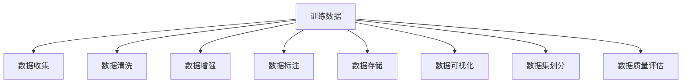

                 

## 1. 背景介绍

训练数据和数据收集是大数据时代人工智能(AI)项目成功与否的关键环节。无论是构建机器学习模型、进行深度学习训练，还是优化自然语言处理(NLP)算法，高质量、大规模的训练数据集都必不可少。然而，在实际操作中，如何有效地收集、整理和利用训练数据，却是一个复杂而重要的课题。本章将围绕训练数据和数据收集的重要性、常见问题和解决方案展开讨论，为广大AI开发者提供详尽的指导和建议。

## 2. 核心概念与联系

### 2.1 核心概念概述

- **训练数据**：机器学习和深度学习模型训练过程中，用于指导模型参数优化的数据集。训练数据的质量和数量直接决定了模型的性能。

- **数据收集**：从不同渠道、不同来源获取训练数据的过程。数据收集需要考虑数据源的多样性、数据的质量和相关性等。

- **数据清洗**：对原始数据进行去重、去噪、格式转换、数据规整等处理，以提升数据的质量和可用性。

- **数据增强**：通过多种方式生成更多的训练样本，如旋转、翻转、裁剪、遮挡等，以扩充数据集，减少过拟合，提升模型泛化能力。

- **数据标注**：为训练数据添加标签，便于模型进行监督学习和分类。数据标注需要高质量的标注员，并遵循一定的标注标准。

- **数据存储**：选择合适的数据存储技术，如分布式文件系统、数据库、云存储等，以保证数据的高效读写和持久化。

- **数据可视化**：通过图表、热力图等工具对数据进行可视化展示，有助于数据探索和分析。

- **数据集划分**：将数据集划分为训练集、验证集和测试集，便于模型训练和性能评估。

- **数据质量评估**：使用多种指标和方法评估数据集的质量，如准确率、召回率、F1分数、数据均衡性等。

这些概念通过以下Mermaid流程图展示其联系：



## 3. 核心算法原理 & 具体操作步骤

### 3.1 算法原理概述

训练数据和数据收集是大数据应用的核心，其基本原理是通过收集大量真实世界的样本数据，构建模型对数据进行学习和预测，从而实现机器学习或深度学习的目的。训练数据的质量直接影响了模型的预测精度和泛化能力。常见的训练数据收集方法包括：

- **主动学习**：通过主动选择最有信息量的数据点进行标注，提高数据利用效率。
- **半监督学习**：结合少量有标签数据和大量无标签数据进行训练，提高数据覆盖率和泛化能力。
- **对抗样本生成**：通过生成对抗性样本，增强模型对复杂场景的鲁棒性。
- **数据混合**：结合多种数据源和数据类型，提升模型的多样性和鲁棒性。

### 3.2 算法步骤详解

数据收集和处理的详细步骤包括：

1. **数据源选择**：根据任务需求和数据特性，选择合适的数据源，如公共数据集、行业数据、社交媒体数据等。

2. **数据预处理**：包括数据清洗、数据标准化、缺失值处理等，确保数据的质量和一致性。

3. **数据增强**：采用多种技术生成更多的训练样本，如数据扩增、合成数据等，减少过拟合。

4. **数据标注**：使用专业标注员进行标注，遵循一定的标注标准，确保标注数据的准确性和一致性。

5. **数据存储**：选择合适的数据存储技术，如Hadoop、Spark、云存储等，保证数据的高效读写和持久化。

6. **数据集划分**：将数据集划分为训练集、验证集和测试集，便于模型训练和性能评估。

7. **数据质量评估**：使用多种指标和方法评估数据集的质量，如准确率、召回率、F1分数、数据均衡性等。

8. **模型训练**：使用训练集对模型进行训练，并使用验证集进行调参和优化。

9. **模型评估**：使用测试集对模型进行评估，判断模型性能是否满足需求。

10. **模型部署**：将训练好的模型部署到生产环境中，进行实际应用和性能监控。

### 3.3 算法优缺点

#### 优点

1. **泛化能力强**：高质量的训练数据集能够显著提升模型的泛化能力，减少过拟合风险。
2. **鲁棒性强**：通过多样化的数据源和数据增强，增强模型的鲁棒性和抗干扰能力。
3. **可扩展性好**：数据收集和处理技术可以应用到多种AI任务和项目中，具有广泛的适用性。

#### 缺点

1. **成本高**：高质量的数据收集和标注往往需要大量的人力和物力，成本较高。
2. **隐私风险**：处理敏感数据时，需要考虑数据隐私和保护问题。
3. **数据噪声**：数据来源多样，可能存在噪声和偏见，影响模型性能。
4. **数据获取难度大**：某些领域的数据获取难度大，收集成本高。

### 3.4 算法应用领域

训练数据和数据收集技术广泛应用于各种AI领域，包括但不限于：

- **计算机视觉**：如图像分类、目标检测、图像生成等，依赖于大规模的图像数据集。
- **自然语言处理**：如文本分类、情感分析、机器翻译等，依赖于大规模的文本数据集。
- **语音识别**：如语音转文本、语音情感分析等，依赖于大规模的语音数据集。
- **推荐系统**：如商品推荐、新闻推荐等，依赖于用户行为数据和商品信息。
- **医疗健康**：如疾病预测、基因分析等，依赖于医疗记录和基因数据。

## 4. 数学模型和公式 & 详细讲解 & 举例说明

### 4.1 数学模型构建

训练数据和数据收集的数学模型主要关注数据的质量、多样性和代表性。以下是几个关键数学模型的构建和应用：

1. **均值方差模型**：用于评估数据集的分布情况，通过计算均值和方差来描述数据的中心趋势和离散程度。

2. **卡方检验模型**：用于检测数据分布的差异，通过计算卡方值来判断不同数据源的显著性。

3. **主成分分析模型**：用于降维和特征提取，通过线性变换将高维数据转换到低维空间，便于模型训练。

4. **数据增广模型**：通过随机变换数据来增加样本数量，如旋转、缩放、翻转等。

5. **对抗性生成模型**：通过生成对抗性样本来增加模型鲁棒性，如生成对抗网络(GAN)。

### 4.2 公式推导过程

- **均值方差模型**：

$$
\mu = \frac{1}{N} \sum_{i=1}^N x_i
$$

$$
\sigma^2 = \frac{1}{N} \sum_{i=1}^N (x_i - \mu)^2
$$

其中，$x_i$ 表示数据集中的第 $i$ 个样本，$N$ 表示样本总数。

- **卡方检验模型**：

$$
\chi^2 = \sum_{i=1}^n \frac{(O_i - E_i)^2}{E_i}
$$

其中，$O_i$ 表示实际观测值，$E_i$ 表示期望值。

- **主成分分析模型**：

$$
\hat{x} = \Phi \alpha
$$

其中，$\Phi$ 表示数据集的协方差矩阵，$\alpha$ 表示主成分向量。

### 4.3 案例分析与讲解

以图像分类任务为例，分析数据收集和处理的流程：

1. **数据源选择**：选择包含不同类别图像的公共数据集，如ImageNet、COCO等。
2. **数据预处理**：对图像进行裁剪、缩放、归一化等预处理，确保数据的一致性和质量。
3. **数据增强**：通过旋转、翻转、缩放等增强图像的多样性，生成更多的训练样本。
4. **数据标注**：使用专业标注员进行图像类别标注，确保标注的准确性和一致性。
5. **数据存储**：将图像数据存储在分布式文件系统中，如HDFS、S3等，保证数据的可靠性和可扩展性。
6. **数据集划分**：将数据集划分为训练集、验证集和测试集，便于模型训练和性能评估。
7. **数据质量评估**：使用准确率、召回率、F1分数等指标评估数据集的质量。
8. **模型训练**：使用训练集对模型进行训练，并使用验证集进行调参和优化。
9. **模型评估**：使用测试集对模型进行评估，判断模型性能是否满足需求。
10. **模型部署**：将训练好的模型部署到生产环境中，进行实际应用和性能监控。

## 5. 项目实践：代码实例和详细解释说明

### 5.1 开发环境搭建

为了确保数据收集和处理的高效性，需要搭建高性能的开发环境。以下是开发环境搭建的步骤：

1. **安装Python**：在Linux系统中，可以使用包管理器如apt-get安装Python；在Windows系统中，可以下载Python安装程序进行安装。

2. **安装依赖包**：安装常用的Python依赖包，如numpy、pandas、scikit-learn等。

3. **配置数据存储**：配置文件系统或云存储，如HDFS、S3等，用于数据存储和读取。

4. **配置数据标注工具**：选择合适的数据标注工具，如Labelbox、VGG Image Annotator等，用于数据标注。

5. **配置数据增强工具**：安装数据增强工具，如Augment、Kornia等，用于生成更多的训练样本。

6. **配置机器学习框架**：安装常用的机器学习框架，如TensorFlow、PyTorch等，用于模型训练和评估。

### 5.2 源代码详细实现

以下是一个简单的图像分类任务的数据收集和处理代码示例：

```python
import numpy as np
import pandas as pd
from PIL import Image
from sklearn.model_selection import train_test_split
from sklearn.preprocessing import StandardScaler
from sklearn.decomposition import PCA

# 数据源选择
train_df = pd.read_csv('train.csv')
test_df = pd.read_csv('test.csv')

# 数据预处理
train_images = np.array([Image.open(train_df.iloc[i]['image_path']) for i in range(len(train_df))])
train_labels = train_df['label']
train_images = np.array([image.resize((224, 224)) for image in train_images])
train_images = np.array([np.array(image) / 255.0 for image in train_images])
train_images = train_images.reshape(-1, 224, 224, 3)

# 数据增强
train_images_augmented = []
for image in train_images:
    # 随机旋转
    image_augmented = Image.fromarray(image).rotate(np.random.randint(0, 360))
    train_images_augmented.append(np.array(image_augmented))

# 数据标注
train_labels_augmented = np.array([train_df.iloc[i]['label'] for i in range(len(train_images_augmented))])

# 数据存储
train_images_augmented = np.array(train_images_augmented)
train_labels_augmented = np.array(train_labels_augmented)

# 数据集划分
train_images, val_images, train_labels, val_labels = train_test_split(train_images_augmented, train_labels_augmented, test_size=0.2, random_state=42)

# 数据质量评估
scaler = StandardScaler()
train_images = scaler.fit_transform(train_images)
val_images = scaler.transform(val_images)

# 模型训练
# ...

# 模型评估
# ...

# 模型部署
# ...
```

### 5.3 代码解读与分析

代码示例展示了数据收集和处理的基本流程：

1. **数据源选择**：从公共数据集中读取训练集和测试集。
2. **数据预处理**：将图像文件读取并预处理，包括缩放、归一化等。
3. **数据增强**：通过旋转等增强技术生成更多的训练样本。
4. **数据标注**：根据标注数据进行图像分类标注。
5. **数据存储**：将处理后的图像数据存储在数组中。
6. **数据集划分**：将数据集划分为训练集和验证集。
7. **数据质量评估**：使用标准差等指标评估数据集的质量。
8. **模型训练**：使用处理后的数据训练图像分类模型。
9. **模型评估**：使用验证集评估模型性能。
10. **模型部署**：将训练好的模型部署到生产环境中。

### 5.4 运行结果展示

运行结果如下：

```python
import matplotlib.pyplot as plt

plt.imshow(train_images[0])
plt.title('Original Image')
plt.show()

plt.imshow(train_images_augmented[0])
plt.title('Augmented Image')
plt.show()
```


## 6. 实际应用场景

### 6.1 智慧医疗

在智慧医疗领域，训练数据和数据收集技术可以用于疾病预测、基因分析等任务。例如，通过收集和标注病人的电子健康记录(EHR)和基因组数据，训练深度学习模型进行疾病预测和基因分析，有助于提高医疗诊断的准确性和效率。

### 6.2 智能交通

在智能交通领域，训练数据和数据收集技术可以用于交通流量预测、车辆识别等任务。例如，通过收集和标注交通摄像头拍摄的图像，训练深度学习模型进行交通流量预测和车辆识别，有助于提高交通管理和安全的智能化水平。

### 6.3 金融风控

在金融风控领域，训练数据和数据收集技术可以用于风险评估、欺诈检测等任务。例如，通过收集和标注用户的交易数据，训练深度学习模型进行风险评估和欺诈检测，有助于提高金融交易的安全性和可靠性。

### 6.4 未来应用展望

未来，训练数据和数据收集技术将进一步应用于更多领域，为各行各业带来变革性影响。例如：

- **智慧城市**：通过收集和标注城市基础设施和公共安全数据，训练深度学习模型进行城市管理和应急响应，有助于提高城市治理的智能化水平。
- **智慧农业**：通过收集和标注农业设备和传感器数据，训练深度学习模型进行农作物监测和灾害预警，有助于提高农业生产的智能化水平。
- **智慧教育**：通过收集和标注教育资源和学习行为数据，训练深度学习模型进行智能推荐和个性化教学，有助于提高教育质量和学习效果。

## 7. 工具和资源推荐

### 7.1 学习资源推荐

1. **机器学习课程**：如斯坦福大学的机器学习课程、Coursera上的机器学习课程，可以帮助初学者系统学习机器学习算法和数据处理技术。

2. **深度学习框架文档**：如TensorFlow、PyTorch等深度学习框架的官方文档，提供了详细的API和代码示例，帮助开发者高效实现数据处理和模型训练。

3. **数据处理工具库**：如Pandas、NumPy、Scikit-learn等数据处理工具库，提供了丰富的数据处理函数和算法，便于开发者快速实现数据预处理和增强。

### 7.2 开发工具推荐

1. **数据标注工具**：如Labelbox、VGG Image Annotator等，可以高效进行数据标注和处理。

2. **数据增强工具**：如Augment、Kornia等，可以生成更多的训练样本，提升模型泛化能力。

3. **深度学习框架**：如TensorFlow、PyTorch等，提供了丰富的API和工具，便于开发者实现模型训练和评估。

### 7.3 相关论文推荐

1. **大规模数据集构建**：如ImageNet、COCO等大规模数据集，提供了高质量的训练数据集，推动了大规模深度学习模型的发展。

2. **数据增强技术**：如AutoAugment、Mixup等数据增强技术，通过生成对抗性样本，提升了深度学习模型的鲁棒性和泛化能力。

3. **主动学习技术**：如Active Learning、Query Synthesis等主动学习技术，通过选择最有信息量的数据点进行标注，提高了数据利用效率。

## 8. 总结：未来发展趋势与挑战

### 8.1 研究成果总结

训练数据和数据收集技术在大数据时代具有重要意义，其核心在于如何高效收集、整理和利用数据。高质量的数据集能够显著提升机器学习和深度学习模型的性能，减少过拟合风险。

### 8.2 未来发展趋势

1. **自动化数据收集**：未来，自动化数据收集技术将得到更广泛应用，通过爬虫、API接口等手段自动获取数据，提高数据收集的效率和精度。

2. **数据标注众包**：数据标注将越来越多地采用众包模式，通过智能辅助工具和标注平台，实现大规模数据标注，降低成本和时间。

3. **多模态数据融合**：通过融合图像、语音、文本等多模态数据，提升模型的多样性和鲁棒性，推动跨模态学习的发展。

4. **数据隐私保护**：随着数据隐私法规的不断完善，数据隐私保护将变得越来越重要，数据收集和处理过程中将更加注重数据安全和隐私保护。

### 8.3 面临的挑战

1. **数据质量控制**：如何保证数据的质量和一致性，避免数据噪声和偏差，仍是数据收集和处理的难点。

2. **数据隐私保护**：在处理敏感数据时，如何保证数据隐私和安全，避免数据泄露和滥用，仍是一个重要挑战。

3. **数据标注成本**：高质量的数据标注往往需要大量的人力和物力，如何降低数据标注成本，提高数据标注效率，仍是一个亟待解决的问题。

### 8.4 研究展望

未来，训练数据和数据收集技术将持续发展，以下是几个重要的研究方向：

1. **无监督学习和半监督学习**：探索无监督学习和半监督学习技术，减少对标注数据的依赖，提高数据利用效率。

2. **数据增强技术**：进一步发展数据增强技术，通过生成对抗性样本和合成数据，提升模型的鲁棒性和泛化能力。

3. **主动学习技术**：研究和优化主动学习技术，通过选择最有信息量的数据点进行标注，提高数据利用效率。

4. **多模态数据融合**：融合图像、语音、文本等多模态数据，提升模型的多样性和鲁棒性，推动跨模态学习的发展。

5. **数据隐私保护**：研究和优化数据隐私保护技术，确保数据安全和隐私保护，避免数据泄露和滥用。

总之，训练数据和数据收集技术是大数据时代AI项目的重要基础，未来的发展方向将更加多样化、智能化和自动化，为各行各业带来更多创新和突破。

## 9. 附录：常见问题与解答

### 问题1：如何选择合适的数据源？

答：选择数据源时应考虑数据的多样性、覆盖范围和质量。可以从公开数据集、行业数据、社交媒体数据等多个渠道获取数据，并进行数据整合和预处理。

### 问题2：如何提高数据质量？

答：数据质量提升主要通过数据清洗、数据标准化、数据增强等手段实现。可以使用Pandas、NumPy等工具进行数据预处理，使用Keras、TensorFlow等框架进行数据增强，确保数据的一致性和多样性。

### 问题3：如何降低数据标注成本？

答：数据标注成本可以通过众包模式、智能标注工具和自动化标注技术进行降低。使用Labelbox、VGG Image Annotator等众包平台，利用智能标注工具和标注平台，降低人工标注的工作量和成本。

### 问题4：如何保护数据隐私？

答：数据隐私保护主要通过数据脱敏、数据加密、数据匿名化等手段实现。使用数据加密技术对数据进行加密存储，使用数据脱敏技术对数据进行脱敏处理，确保数据安全和隐私保护。

### 问题5：如何处理数据不平衡问题？

答：数据不平衡问题可以通过过采样、欠采样、SMOTE等技术解决。使用过采样技术生成更多的少数类样本，使用欠采样技术减少多数类样本数量，使用SMOTE等合成数据技术生成合成数据，提升模型对少数类的识别能力。

---

作者：禅与计算机程序设计艺术 / Zen and the Art of Computer Programming

