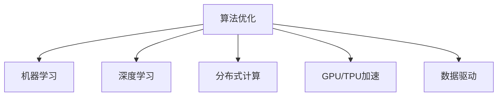

                 

# 算法优化：提升人类计算的效率和准确性

> 关键词：算法优化,计算效率,计算准确性,数据驱动,机器学习,深度学习

## 1. 背景介绍

### 1.1 问题由来

随着信息技术的发展，计算能力成为了现代社会的一项基础能力。计算的效率和准确性直接影响到我们生活的方方面面，从日常办公到科研实验，无处不在。然而，在面对大规模数据和复杂计算任务时，现有的计算资源和方法往往显得捉襟见肘。

算法优化作为提升计算能力的重要手段，其作用日益凸显。无论是基于硬件的计算加速，还是基于软件的算法改进，都是人类追求更高效率和更准确计算的探索路径。机器学习和深度学习等新兴技术的发展，为算法优化带来了新的方法论和工具。

### 1.2 问题核心关键点

算法优化的核心在于通过科学的方法和工具，对现有计算过程进行改进，提升其效率和准确性。具体来说，主要包括以下几个方面：

- **算法优化策略**：包括但不限于动态规划、贪心算法、启发式搜索等，是提升计算效率和准确性的核心工具。
- **机器学习与深度学习**：通过训练模型，自动地学习最优的计算策略，进一步提升算法的效果。
- **硬件加速**：如GPU、TPU等硬件加速器，通过并行计算、数据高速传输等方式，极大提升计算效率。
- **分布式计算**：通过分布式系统，将计算任务并行化，充分利用多台机器的计算能力。
- **数据驱动**：利用大量的实验数据，进行性能优化，找到最优的算法参数。

这些方法不仅在学术界和工业界广泛应用，而且正在不断进步和完善。

## 2. 核心概念与联系

### 2.1 核心概念概述

为更好地理解算法优化，本节将介绍几个密切相关的核心概念：

- **算法优化**：指通过分析和改进算法，使其在计算效率和准确性方面达到最优的过程。
- **机器学习**：一种让机器通过数据自动学习任务的方法，广泛应用于算法优化中。
- **深度学习**：机器学习的一个分支，通过多层神经网络进行非线性建模，适用于复杂的计算问题。
- **分布式计算**：将计算任务分解为多个子任务，分配到多台计算机上并行计算。
- **GPU/TPU加速**：使用图形处理器或张量处理器等硬件加速器，提升计算速度。
- **数据驱动**：通过实验数据和模型评估结果，指导算法的改进。

这些概念之间的逻辑关系可以通过以下Mermaid流程图来展示：



这个流程图展示了大规模数据和复杂计算任务中，算法优化方法的选择和优化过程。

## 3. 核心算法原理 & 具体操作步骤

### 3.1 算法原理概述

算法优化旨在通过科学的方法和工具，改进计算过程，提升效率和准确性。具体来说，算法优化的目标可以分解为以下几个方面：

- **减少计算量**：通过优化算法结构和策略，减少不必要的计算，提升计算速度。
- **提高计算精度**：通过调整算法参数和优化模型结构，提升计算结果的准确性。
- **提高可扩展性**：通过分布式计算等技术，使算法能够适应大规模数据的计算需求。
- **增强鲁棒性**：通过引入噪声抑制、异常检测等技术，提高算法对噪声和异常数据的鲁棒性。

### 3.2 算法步骤详解

基于上述目标，算法优化的一般步骤包括：

**Step 1: 算法选择与设计**
- 根据计算任务的特点，选择合适的算法模型，设计合适的算法结构和策略。
- 对于复杂问题，可以采用分解策略，将问题分解为多个子问题进行求解。

**Step 2: 算法实现与验证**
- 将算法模型转化为具体的实现代码，并进行测试验证。
- 利用实验数据和模型评估结果，调整算法参数和结构，以提高算法性能。

**Step 3: 硬件与分布式优化**
- 利用GPU、TPU等硬件加速器，提升计算速度。
- 通过分布式计算技术，将计算任务分配到多台计算机上并行计算，提高计算效率。

**Step 4: 性能监控与优化**
- 实时监控算法运行性能，发现和解决性能瓶颈。
- 根据监控结果，进行算法优化，进一步提升性能。

### 3.3 算法优缺点

算法优化具有以下优点：

- **效率提升**：通过优化算法结构和策略，显著提升计算效率，节省计算资源。
- **精度提高**：通过调整算法参数和优化模型结构，提升计算结果的准确性，减少误差。
- **可扩展性增强**：通过分布式计算等技术，使算法能够适应大规模数据的计算需求，提高算法的可扩展性。

同时，算法优化也存在一定的局限性：

- **开发成本高**：算法优化需要大量的实验数据和测试验证，开发成本较高。
- **依赖硬件**：依赖于GPU、TPU等高性能硬件加速器，硬件成本较高。
- **难以自动化**：许多算法优化需要经验丰富的专家进行手工调参，难以实现自动化。

尽管存在这些局限性，但就目前而言，算法优化仍是大规模数据和复杂计算任务中的核心方法。未来相关研究的重点在于如何进一步降低算法优化的开发成本，提高算法的自动化程度，同时兼顾可扩展性和鲁棒性等因素。

### 3.4 算法应用领域

算法优化在多个领域中得到了广泛应用，包括但不限于：

- **科学计算**：如气候模拟、物理模拟等，需要处理大规模数据和复杂计算任务。
- **金融计算**：如高频交易、风险评估等，需要高效、精确地处理大量数据。
- **医疗计算**：如医学影像分析、基因组测序等，需要处理复杂的数据结构和计算模型。
- **大数据处理**：如数据挖掘、文本分析等，需要高效处理海量数据。
- **机器人控制**：如路径规划、传感器数据处理等，需要高效、精确的计算和控制。

这些领域中的算法优化，都依赖于优化算法的科学性和效率，以及高效的计算资源和工具。

## 4. 数学模型和公式 & 详细讲解 & 举例说明

### 4.1 数学模型构建

算法优化问题可以形式化为一个数学优化问题。假设优化目标为 $f(x)$，约束条件为 $g(x) \leq 0$ 和 $h(x) = 0$。优化问题可以表示为：

$$
\min_{x} f(x) \quad \text{subject to} \quad g(x) \leq 0, h(x) = 0
$$

其中 $x$ 为决策变量，$f(x)$ 为优化目标函数，$g(x)$ 和 $h(x)$ 为约束条件函数。

### 4.2 公式推导过程

以线性回归问题为例，推导最小二乘法的优化过程。假设训练集为 $(x_i,y_i)$，$x \in \mathbb{R}^d$，$y \in \mathbb{R}$。线性回归模型的优化目标为最小化预测误差：

$$
f(x) = \frac{1}{2N} \sum_{i=1}^N (y_i - \hat{y}_i)^2
$$

其中 $\hat{y}_i = \theta^T x_i$，$\theta \in \mathbb{R}^d$ 为模型参数。

对 $f(x)$ 求导，得到：

$$
\nabla f(x) = \frac{1}{N} \sum_{i=1}^N (y_i - \hat{y}_i) x_i
$$

根据梯度下降法，每次迭代更新参数 $\theta$：

$$
\theta_{t+1} = \theta_t - \alpha \nabla f(x)
$$

其中 $\alpha$ 为学习率。通过多次迭代，可以使得 $\theta$ 收敛于最优解。

### 4.3 案例分析与讲解

以深度学习中的卷积神经网络(CNN)为例，介绍如何通过优化算法提升模型性能。

假设CNN模型包含多个卷积层和全连接层，每个层的参数数量为 $n$。训练数据集为 $(x_i,y_i)$，$x_i \in \mathbb{R}^{d\times d \times c}$，$y_i \in \{0,1\}$。

模型优化目标为最小化交叉熵损失：

$$
f(\theta) = \frac{1}{N} \sum_{i=1}^N \ell(y_i, \hat{y}_i)
$$

其中 $\hat{y}_i$ 为模型预测结果，$\ell$ 为交叉熵损失函数。

根据梯度下降法，每次迭代更新参数 $\theta$：

$$
\theta_{t+1} = \theta_t - \alpha \nabla f(\theta)
$$

其中 $\nabla f(\theta)$ 为损失函数对参数 $\theta$ 的梯度，可通过反向传播算法高效计算。

通过多次迭代，可以使得 $\theta$ 收敛于最优解。为了提高训练效率，常常采用批量梯度下降(Batch Gradient Descent)，每次迭代使用一批数据进行更新：

$$
\theta_{t+1} = \theta_t - \alpha \frac{1}{m} \sum_{i=1}^m \nabla f(x_i)
$$

其中 $m$ 为批次大小，$x_i$ 为批次中的样本数据。

## 5. 项目实践：代码实例和详细解释说明

### 5.1 开发环境搭建

在进行算法优化实践前，我们需要准备好开发环境。以下是使用Python进行机器学习和深度学习开发的常见环境配置流程：

1. 安装Anaconda：从官网下载并安装Anaconda，用于创建独立的Python环境。

2. 创建并激活虚拟环境：
```bash
conda create -n pytorch-env python=3.8 
conda activate pytorch-env
```

3. 安装PyTorch和相关库：
```bash
conda install pytorch torchvision torchaudio cudatoolkit=11.1 -c pytorch -c conda-forge
```

4. 安装TensorFlow和相关库：
```bash
conda install tensorflow tensorflow-gpu -c conda-forge
```

5. 安装Keras和相关库：
```bash
pip install keras tensorflow
```

完成上述步骤后，即可在`pytorch-env`环境中开始算法优化实践。

### 5.2 源代码详细实现

下面我们以线性回归问题为例，给出使用PyTorch实现最小二乘法线性回归的PyTorch代码实现。

```python
import torch
import torch.nn as nn
import torch.optim as optim

# 定义训练数据
x_train = torch.tensor([[1., 2., 3.], [4., 5., 6.], [7., 8., 9.]])
y_train = torch.tensor([[2.], [4.], [6.]])
N = len(x_train)

# 定义模型参数
theta = torch.randn(N, 1)

# 定义优化器
optimizer = optim.SGD(theta, lr=0.1)

# 定义损失函数
def mse_loss(y_pred, y_true):
    return torch.mean((y_pred - y_true) ** 2)

# 定义训练函数
def train_epoch(x_train, y_train, theta, optimizer, loss_fn, epochs):
    for epoch in range(epochs):
        optimizer.zero_grad()
        y_pred = x_train @ theta
        loss = loss_fn(y_pred, y_train)
        loss.backward()
        optimizer.step()
        print(f"Epoch {epoch+1}, loss: {loss.item()}")

# 训练模型
train_epoch(x_train, y_train, theta, optimizer, mse_loss, epochs=100)
```

这段代码定义了训练数据、模型参数、优化器和损失函数，并通过训练函数进行最小二乘法线性回归的优化训练。可以看到，PyTorch库提供了丰富的函数和类，大大简化了算法优化的代码实现。

### 5.3 代码解读与分析

让我们再详细解读一下关键代码的实现细节：

**定义训练数据**：
- `x_train`和`y_train`分别为训练数据的特征和标签。
- `N`为训练样本数量。

**定义模型参数**：
- `theta`为线性回归模型的参数，用于存储模型输出。

**定义优化器**：
- `optimizer`为随机梯度下降优化器，用于更新模型参数。

**定义损失函数**：
- `mse_loss`为均方误差损失函数，用于衡量模型输出与真实标签之间的差异。

**定义训练函数**：
- `train_epoch`函数定义了模型训练过程，包括前向传播、损失计算、反向传播和参数更新等步骤。
- `optimizer.zero_grad()`用于清空梯度缓存。
- `y_pred = x_train @ theta`进行前向传播计算，得到模型输出。
- `loss = loss_fn(y_pred, y_train)`计算损失。
- `loss.backward()`进行反向传播计算梯度。
- `optimizer.step()`更新模型参数。

在得到模型参数后，训练函数会输出当前epoch的平均损失值。

## 6. 实际应用场景

### 6.1 机器学习模型优化

在机器学习中，模型优化的目标是通过调整模型参数，使得模型在测试集上的性能达到最优。常用的方法包括网格搜索、随机搜索、贝叶斯优化等。

以随机搜索为例，其核心思想是通过随机采样模型参数，逐步逼近最优解。具体实现步骤如下：

1. 定义模型参数空间。
2. 生成一批随机参数。
3. 使用模型训练数据进行训练，计算损失。
4. 根据损失评估模型性能。
5. 更新随机参数生成策略，继续进行下一轮随机搜索。

**代码实现**：

```python
from sklearn.model_selection import RandomizedSearchCV
from sklearn.ensemble import RandomForestClassifier

# 定义模型参数空间
param_dist = {
    'n_estimators': [10, 50, 100],
    'max_features': ['auto', 'sqrt', 'log2'],
    'min_samples_split': [2, 5, 10],
    'min_samples_leaf': [1, 2, 4]
}

# 定义随机搜索
random_search = RandomizedSearchCV(RandomForestClassifier(), param_distributions=param_dist, n_iter=10)

# 训练模型
random_search.fit(X_train, y_train)

# 输出最佳参数和性能
print(f"Best params: {random_search.best_params_}")
print(f"Best score: {random_search.best_score_}")
```

### 6.2 深度学习模型优化

深度学习模型的优化目标是通过调整模型结构和参数，使得模型在测试集上的性能达到最优。常用的方法包括梯度下降法、Adam等优化算法，以及L1、L2正则化、Dropout等正则化技术。

以深度学习中常用的Adam优化器为例，其核心思想是通过自适应地调整学习率，加速模型收敛。具体实现步骤如下：

1. 定义模型结构。
2. 定义损失函数。
3. 定义优化器。
4. 使用训练数据进行训练，计算损失。
5. 根据损失更新模型参数。

**代码实现**：

```python
import torch.nn as nn
import torch.optim as optim

# 定义模型结构
class Net(nn.Module):
    def __init__(self):
        super(Net, self).__init__()
        self.fc1 = nn.Linear(784, 128)
        self.fc2 = nn.Linear(128, 10)

    def forward(self, x):
        x = x.view(-1, 784)
        x = torch.relu(self.fc1(x))
        x = self.fc2(x)
        return x

# 定义损失函数
criterion = nn.CrossEntropyLoss()

# 定义优化器
optimizer = optim.Adam(model.parameters(), lr=0.001)

# 训练模型
for epoch in range(10):
    optimizer.zero_grad()
    outputs = model(X_train)
    loss = criterion(outputs, y_train)
    loss.backward()
    optimizer.step()
```

### 6.3 分布式计算优化

分布式计算通过将计算任务分配到多台计算机上并行计算，大大提升了计算效率。常用的分布式计算框架包括Apache Spark、Hadoop、TensorFlow等。

以TensorFlow为例，其核心思想是通过分布式训练，加速模型训练过程。具体实现步骤如下：

1. 定义模型结构。
2. 定义分布式计算策略。
3. 使用训练数据进行分布式训练，计算损失。
4. 根据损失更新模型参数。

**代码实现**：

```python
import tensorflow as tf

# 定义模型结构
model = tf.keras.Sequential([
    tf.keras.layers.Dense(128, activation='relu', input_shape=(784,)),
    tf.keras.layers.Dense(10, activation='softmax')
])

# 定义分布式计算策略
strategy = tf.distribute.MirroredStrategy()

# 定义损失函数
criterion = tf.keras.losses.SparseCategoricalCrossentropy()

# 定义优化器
optimizer = tf.keras.optimizers.Adam()

# 训练模型
with strategy.scope():
    model.compile(optimizer=optimizer, loss=criterion, metrics=['accuracy'])
    model.fit(X_train, y_train, epochs=10, batch_size=32)
```

## 7. 工具和资源推荐

### 7.1 学习资源推荐

为了帮助开发者系统掌握算法优化的理论基础和实践技巧，这里推荐一些优质的学习资源：

1. 《算法设计与分析基础》（原书第2版）：由普林斯顿大学开设的算法设计与分析课程，详细介绍了经典算法的设计与分析方法。

2. 《机器学习实战》：通过大量的代码实例，介绍了机器学习和深度学习的基本概念和实现方法。

3. 《深度学习》（Goodfellow等著）：深度学习领域的经典教材，深入浅出地介绍了深度学习的理论和实践方法。

4. 《动手学深度学习》：由DeepLearning.ai团队开发的深度学习课程，结合理论和代码实现，讲解了深度学习的核心算法和应用方法。

5. 《TensorFlow实战》：通过大量的代码实例，介绍了TensorFlow的基本功能和应用方法。

通过对这些资源的学习实践，相信你一定能够快速掌握算法优化的精髓，并用于解决实际的计算问题。

### 7.2 开发工具推荐

高效的开发离不开优秀的工具支持。以下是几款用于算法优化开发的常用工具：

1. Python：作为Python的科学计算库，NumPy、SciPy、Pandas等库提供了丰富的数值计算和数据处理功能。

2. TensorFlow和PyTorch：分别由Google和Facebook开发的深度学习框架，提供了强大的模型训练和优化能力。

3. Keras：由François Chollet开发的深度学习库，提供了高级API，方便快速搭建深度学习模型。

4. Scikit-learn：Python的机器学习库，提供了丰富的模型选择和优化工具。

5. PyTorch Lightning：一个基于PyTorch的轻量级深度学习框架，提供了灵活的模型训练和分布式优化功能。

6. Jupyter Notebook：一个基于Web的交互式编程环境，方便开发者进行模型训练和调试。

合理利用这些工具，可以显著提升算法优化的开发效率，加快创新迭代的步伐。

### 7.3 相关论文推荐

算法优化的研究源于学界的持续研究。以下是几篇奠基性的相关论文，推荐阅读：

1. "A new dimensionality reduction approach based on the discrete wavelet transform"（I. Daubechies等）：提出了离散小波变换，为数据压缩和信号处理提供了新的算法基础。

2. "A Simple Fast Algorithm for Constrained Total Least Squares and Extensions"（G. Wahba）：提出了最小二乘法的改进算法，加速了模型训练过程。

3. "Stochastic Gradient Descent Tricks"（T. Tieleman等）：提出了随机梯度下降算法的改进方法，提高了模型训练效率。

4. "Deep Learning"（Y. Bengio等）：深度学习领域的经典教材，介绍了深度学习的理论基础和实践方法。

5. "Convolutional Neural Networks for Sentence Classification"（K. Kim）：提出了卷积神经网络用于自然语言处理的方法，提升了模型性能。

这些论文代表了大规模数据和复杂计算任务中算法优化的发展脉络。通过学习这些前沿成果，可以帮助研究者把握学科前进方向，激发更多的创新灵感。

## 8. 总结：未来发展趋势与挑战

### 8.1 总结

本文对算法优化进行了全面系统的介绍。首先阐述了算法优化的背景和意义，明确了优化在计算效率和准确性提升中的关键作用。其次，从原理到实践，详细讲解了算法优化的数学模型和关键步骤，给出了算法优化任务开发的完整代码实例。同时，本文还广泛探讨了算法优化方法在多个领域的应用前景，展示了算法优化的广阔应用空间。

通过本文的系统梳理，可以看到，算法优化在大规模数据和复杂计算任务中具有不可替代的作用。这些方向的探索发展，必将进一步提升算法优化方法的效率和准确性，为计算技术的应用带来新的突破。

### 8.2 未来发展趋势

展望未来，算法优化技术将呈现以下几个发展趋势：

1. **自动化优化**：通过机器学习和深度学习，自动地优化算法参数和结构，减少人工干预。

2. **多模态优化**：结合视觉、语音等多模态信息，进行联合优化，提升算法的综合性能。

3. **分布式优化**：通过分布式计算技术，将计算任务并行化，进一步提升计算效率。

4. **硬件加速优化**：利用GPU、TPU等高性能硬件加速器，提升计算速度。

5. **动态优化**：根据实时数据反馈，动态调整算法策略，适应动态变化的计算需求。

6. **异构优化**：结合不同类型硬件的特性，进行异构优化，提升算法的整体效率。

这些趋势凸显了算法优化技术的广泛应用前景，并将不断推动计算技术的发展。

### 8.3 面临的挑战

尽管算法优化技术已经取得了显著成就，但在实现高效率、高准确性计算的过程中，仍面临诸多挑战：

1. **高成本**：优化算法的开发和调优需要大量时间和人力投入，成本较高。

2. **复杂性**：优化算法的实现和调优过程较为复杂，需要经验丰富的专家进行手工调参。

3. **数据依赖**：优化算法的性能依赖于数据的质量和数量，数据的获取和处理较为困难。

4. **可扩展性**：优化算法的可扩展性受到硬件和网络带宽的限制，难以应对大规模数据和高并行度计算需求。

5. **鲁棒性**：优化算法对噪声和异常数据的鲁棒性较差，容易受到数据分布变化的影响。

6. **安全性和公平性**：优化算法可能受到恶意攻击和偏见影响，导致计算结果的安全性和公平性问题。

这些挑战需要不断改进算法优化方法，提升算法的设计和实现水平，确保优化算法在实际应用中的有效性和可靠性。

### 8.4 研究展望

面对算法优化面临的种种挑战，未来的研究需要在以下几个方面寻求新的突破：

1. **自动化优化算法**：开发自动化的算法优化工具，减少人工干预，提升优化效率。

2. **混合优化方法**：结合不同优化算法，综合利用其优点，提高优化效果。

3. **分布式优化框架**：开发通用的分布式优化框架，支持多台计算机并行计算，提升计算效率。

4. **异构优化策略**：结合不同类型硬件的特性，进行异构优化，提升算法的整体效率。

5. **鲁棒性和安全性优化**：通过鲁棒性和安全性分析，优化算法的鲁棒性和安全性，减少计算结果的风险。

6. **公平性和可解释性**：通过公平性和可解释性分析，优化算法的公平性和可解释性，提高算法的可信度和可靠性。

这些研究方向的探索，必将引领算法优化技术迈向更高的台阶，为计算技术的应用带来新的突破。面向未来，算法优化技术还需要与其他人工智能技术进行更深入的融合，如知识表示、因果推理、强化学习等，多路径协同发力，共同推动计算技术的进步。

## 9. 附录：常见问题与解答

**Q1：什么是算法优化？**

A: 算法优化是指通过分析和改进算法，使其在计算效率和准确性方面达到最优的过程。

**Q2：算法优化与机器学习和深度学习有什么区别？**

A: 算法优化是提高算法性能的通用方法，而机器学习和深度学习是具体应用算法优化的技术。算法优化旨在提升算法的计算效率和准确性，而机器学习和深度学习则是在算法优化的基础上，进一步通过数据训练和学习，使算法能够适应特定的计算任务。

**Q3：如何选择合适的算法优化策略？**

A: 选择算法优化策略需要考虑计算任务的特性和需求。对于大规模数据和复杂计算任务，可以采用分布式优化和硬件加速策略。对于数据分布较为均匀的任务，可以采用随机搜索和网格搜索策略。对于需要高精度的任务，可以采用梯度下降法和Adam等优化算法。

**Q4：算法优化在实际应用中需要注意哪些问题？**

A: 算法优化在实际应用中需要注意以下几点：

1. 数据质量和数据处理。优化算法的性能依赖于数据的质量和数量，数据的获取和处理较为困难。

2. 优化算法的成本和复杂性。优化算法的开发和调优需要大量时间和人力投入，成本较高。

3. 优化算法的可扩展性和鲁棒性。优化算法的可扩展性受到硬件和网络带宽的限制，难以应对大规模数据和高并行度计算需求。优化算法对噪声和异常数据的鲁棒性较差，容易受到数据分布变化的影响。

4. 优化算法的安全性和公平性。优化算法可能受到恶意攻击和偏见影响，导致计算结果的安全性和公平性问题。

5. 优化算法的可解释性和可审计性。优化算法的内部工作机制和决策逻辑难以解释，难以对其推理逻辑进行分析和调试。

这些因素都需要在实际应用中予以充分考虑，确保优化算法的有效性和可靠性。

**Q5：算法优化有哪些常见的优化方法？**

A: 算法优化常见的优化方法包括但不限于：

1. 动态规划。通过将复杂问题分解为多个子问题，递归求解，提升计算效率。

2. 贪心算法。通过每一步选择当前最优解，逐步逼近最优解，提升计算效率。

3. 启发式搜索。通过模拟自然界的搜索机制，寻找最优解。

4. 随机搜索。通过随机采样算法参数，逐步逼近最优解。

5. 网格搜索。通过遍历算法参数空间，寻找最优解。

6. 贝叶斯优化。通过构建高斯过程模型，寻找最优解。

7. 梯度下降法。通过反向传播计算梯度，更新算法参数，提升计算效率。

8. Adam优化器。通过自适应地调整学习率，加速模型收敛。

9. L1、L2正则化。通过加入正则项，防止过拟合，提升计算精度。

10. Dropout。通过随机丢弃神经元，防止过拟合，提升计算精度。

这些方法在实际应用中需要根据具体任务进行灵活选择和组合，以达到最优的优化效果。

