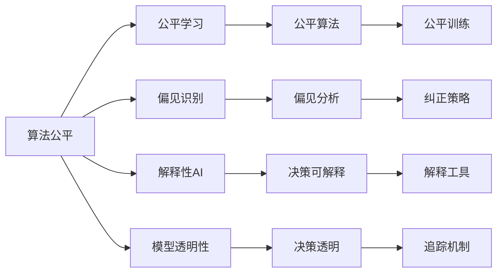

                 

# 算法公平：构建负责任的人工智能

> 关键词：算法公平,负责任的人工智能,公平学习,偏见识别,解释性AI,模型透明性

## 1. 背景介绍

随着人工智能技术的飞速发展，算法已成为驱动社会经济活动的重要引擎。从金融风控、医疗诊断，到招聘、推荐、广告投放，几乎所有行业都离不开智能算法的参与。然而，伴随着算法决策在各行各业深度渗透，其公平性、透明性、可解释性等问题也日益凸显，成为社会各界关注的焦点。

为应对这一挑战，学术界和产业界开始引入和推进公平、透明、负责任的AI发展方向。在技术层面，从数据收集、模型训练、评估、部署等全流程，不断完善公平性指标，规范AI系统建设，保障算法公平性，提升AI决策透明性，成为未来技术发展的关键。

## 2. 核心概念与联系

### 2.1 核心概念概述

为更好地理解算法公平，首先需要明确几个核心概念：

- **算法公平**（Algorithmic Fairness）：指算法在处理不同群体数据时，应保证公平、公正，避免任何形式的偏见和歧视，确保所有用户都能平等受益。

- **负责任的AI**（Responsible AI）：除了算法的公平性，还包括透明性、可解释性、伦理道德等多元价值维度，要求AI系统在提供决策或服务时，应满足更高的道德规范和社会责任。

- **公平学习**（Fair Learning）：通过设计公平的算法和机制，确保训练数据、模型和决策过程中的公平性，避免算法偏见和歧视，保障模型在各种场景下公平表现。

- **偏见识别**（Bias Detection）：在模型开发和评估阶段，识别和分析模型中的固有偏见和歧视，及时进行纠正，确保模型公平无偏。

- **解释性AI**（Explainable AI）：构建可解释的AI模型，帮助用户理解模型决策过程，提升AI决策的透明度和可信度。

- **模型透明性**（Model Transparency）：在模型设计和部署过程中，应尽可能让决策过程可解释、可追溯，确保模型决策过程的公正性、透明性。

这些概念之间存在密切联系，共同构成了一个负责任AI的完整框架。本文将从算法公平性的核心概念出发，逐步深入探讨算法公平在实际应用中的实现路径。

### 2.2 核心概念原理和架构的 Mermaid 流程图



这个流程图展示了大语言模型微调中的核心概念及其之间的关系：

1. 算法公平是整个AI系统的基石，通过公平学习、偏见识别、解释性AI和模型透明性四个维度保障其公平性。
2. 公平学习通过设计公平算法和机制，从数据、模型和决策过程各个环节保障公平性。
3. 偏见识别在模型开发和评估阶段，识别和分析模型中的固有偏见和歧视。
4. 解释性AI帮助用户理解模型决策过程，提升决策透明度和可信度。
5. 模型透明性在模型设计和部署过程中，保障决策过程的公正性、透明性。
6. 公平训练、偏见分析、解释工具和追踪机制，共同构建负责任的AI系统。

这些概念共同构成了负责任AI的完整框架，确保AI系统在应用过程中，公平、透明、可解释，满足更高的社会责任要求。

## 3. 核心算法原理 & 具体操作步骤

### 3.1 算法原理概述

算法公平的核心在于构建一个无偏的决策模型，确保在处理不同群体的数据时，模型输出的决策结果保持一致。其关键步骤如下：

1. **数据收集**：确保训练数据集包含各种群体的充分样本，避免数据偏见。
2. **模型训练**：通过设计公平的损失函数，避免模型学习到任何形式的偏见。
3. **偏见识别**：在模型开发和评估阶段，识别和分析模型中的固有偏见和歧视，及时进行纠正。
4. **解释性AI**：构建可解释的AI模型，帮助用户理解模型决策过程，提升决策透明度和可信度。
5. **模型透明性**：在模型设计和部署过程中，尽可能让决策过程可解释、可追溯，确保决策过程的公正性、透明性。

### 3.2 算法步骤详解

接下来，我们将详细讲解每个核心步骤的实现方法。

#### 3.2.1 数据收集

- **步骤1: 数据采集**  
  - 收集多样化的训练数据，包括不同性别、年龄、种族、教育背景等群体的样本。避免数据集中存在任何形式的偏见和歧视。

- **步骤2: 数据标注**  
  - 对收集到的数据进行详细标注，确保每个样本的特征和标签信息完整、准确。

- **步骤3: 数据清洗**  
  - 去除数据中的噪声、错误和异常值，确保数据质量和一致性。

- **步骤4: 数据平衡**  
  - 使用重采样技术，如SMOTE等，对不同群体数据进行平衡，避免数据集中某一群体样本过少导致的偏见。

#### 3.2.2 模型训练

- **步骤1: 公平算法选择**  
  - 选择或设计无偏的公平算法，如公平分类算法、公平回归算法等。

- **步骤2: 损失函数设计**  
  - 设计公平的损失函数，确保模型在处理不同群体数据时，输出一致，避免任何形式的偏见。

- **步骤3: 正则化技术**  
  - 应用正则化技术，如L2正则、Dropout等，避免模型过拟合，增强模型的泛化能力。

- **步骤4: 验证集评估**  
  - 在验证集上评估模型性能，确保模型在所有群体上表现一致。

#### 3.2.3 偏见识别

- **步骤1: 偏见分析**  
  - 使用偏差指标（如Demographic Parity、Equalized Odds等），分析模型在不同群体上的表现。

- **步骤2: 偏差纠正**  
  - 根据偏见分析结果，调整模型参数或数据分布，消除模型中的偏见。

#### 3.2.4 解释性AI

- **步骤1: 模型可解释性工具**  
  - 使用模型可解释性工具，如LIME、SHAP等，分析模型决策过程，解释模型输出。

- **步骤2: 决策可视化**  
  - 将模型决策过程可视化，展示模型如何做出决策，增强决策透明度和可信度。

#### 3.2.5 模型透明性

- **步骤1: 决策逻辑追踪**  
  - 在模型设计和部署过程中，确保决策逻辑可追溯，使用追踪机制记录模型决策过程。

- **步骤2: 透明度评估**  
  - 定期评估模型透明性，确保模型决策过程公正、透明。

### 3.3 算法优缺点

算法公平方法的优势和劣势如下：

#### 优点：

1. **提升模型公平性**  
   - 通过公平算法和偏见识别技术，有效消除模型中的固有偏见和歧视，保障模型公平无偏。

2. **增强决策透明性**  
   - 通过解释性AI和模型透明性技术，使模型决策过程可解释、可追溯，提升决策透明度和可信度。

3. **保障社会责任**  
   - 符合负责任AI的要求，避免算法偏见导致的社会不公，确保AI系统的社会责任。

#### 缺点：

1. **数据收集困难**  
   - 获取多样化的高质量数据集，需要大量时间和资源，尤其在数据稀缺的领域。

2. **模型复杂度增加**  
   - 为保障模型公平，需要设计和使用复杂的公平算法，增加模型复杂度。

3. **偏见纠正难度**  
   - 模型中固有偏见的识别和纠正，仍面临很大挑战，难以彻底消除偏见。

4. **技术门槛较高**  
   - 实现公平、透明、可解释的AI系统，需要较高的技术水平和专业能力。

尽管存在这些挑战，但通过不断探索和创新，算法公平技术必将在实际应用中发挥更大的价值，推动AI系统朝着更加公平、透明、负责任的方向发展。

### 3.4 算法应用领域

基于公平原则，算法公平方法已经广泛应用于多个领域：

- **金融风控**  
  - 在金融风控领域，算法公平性尤为重要。通过公平模型，避免贷款、保险等决策中的偏见，保障公平性。
  
- **医疗诊断**  
  - 在医疗诊断中，算法公平性直接关系到病人的生命健康。公平模型应避免性别、种族等偏见，提供公正的诊断服务。

- **招聘与求职**  
  - 在招聘和求职中，算法公平性关乎人才选拔的公正性。公平模型应避免性别、年龄等偏见，确保平等机会。

- **广告投放**  
  - 在广告投放中，算法公平性关乎用户权益。公平模型应避免任何形式的歧视，保障用户平等受广告影响。

- **推荐系统**  
  - 在推荐系统中，算法公平性直接影响用户体验。公平模型应避免数据中的偏见，提供个性化但不歧视的推荐服务。

- **智能合约**  
  - 在智能合约中，算法公平性关乎合同执行的公正性。公平模型应避免合同中的任何形式的偏见，保障合同执行的公正性。

通过在多个关键领域推广和应用算法公平方法，可以有效提升AI系统的公平性和透明度，构建负责任的AI系统。

## 4. 数学模型和公式 & 详细讲解 & 举例说明

### 4.1 数学模型构建

本节将使用数学语言对算法公平性进行更加严格的刻画。

设模型 $M$ 的输入为 $x$，输出为 $y$，其中 $x \in \mathcal{X}$，$y \in \mathcal{Y}$。假设数据集 $D = \{(x_i, y_i)\}_{i=1}^N$ 中的每个样本 $(x_i, y_i)$ 均为独立且同分布的。

定义模型 $M$ 在样本 $(x_i, y_i)$ 上的公平损失函数为：

$$
\ell_i(M) = f(x_i, y_i, M)
$$

其中 $f$ 为公平性度量函数，用于评估模型 $M$ 在样本 $(x_i, y_i)$ 上的公平性。常见的公平性度量函数包括：

- **平等等价性**（Demographic Parity）：在处理不同群体时，模型输出相同。

$$
\ell_i(M) = \begin{cases} 0 & y_i = M(x_i) \\ 1 & y_i \neq M(x_i) \end{cases}
$$

- **均等机会**（Equalized Odds）：在处理不同群体时，模型正确预测的概率相同。

$$
\ell_i(M) = \left|P(M(x_i) = y_i|y_i=1) - P(M(x_i) = y_i|y_i=0)\right|
$$

在训练过程中，目标是最小化模型 $M$ 在数据集 $D$ 上的公平损失：

$$
\min_{M} \sum_{i=1}^N \ell_i(M)
$$

### 4.2 公式推导过程

以下我们将以平等等价性为例，推导公平损失函数的计算公式。

假设模型 $M$ 在输入 $x$ 上的输出为 $\hat{y} = M(x)$。假设数据集 $D$ 中每个群体的样本比例为 $\pi_g$，其中 $g$ 表示不同的群体。

平等等价性的公平损失函数定义为：

$$
\ell_i(M) = \mathbb{I}\{y_i = M(x_i) \land g = 1\} \cdot \log\left(\frac{P(y_i=1|x_i)}{P(y_i=0|x_i)}\right)
$$

其中 $\mathbb{I}$ 为示性函数，$1$ 表示条件成立，$0$ 表示条件不成立。

定义数据集 $D$ 在群体 $g$ 上的公平损失为：

$$
\ell_g(M) = \frac{1}{n_g} \sum_{i=1}^{n_g} \ell_i(M)
$$

其中 $n_g$ 为群体 $g$ 的样本数量。

数据集 $D$ 的平均公平损失为：

$$
\ell(M) = \sum_{g} \pi_g \cdot \ell_g(M)
$$

训练过程中，目标是最小化数据集 $D$ 的平均公平损失：

$$
\min_{M} \ell(M)
$$

通过优化算法，如梯度下降等，不断更新模型参数，最小化公平损失函数，最终得到公平的决策模型。

### 4.3 案例分析与讲解

下面以一个简单的例子，说明如何构建一个公平的推荐系统。

假设有一个电商平台，需要根据用户历史行为推荐商品。为了保障推荐系统的公平性，平台收集了不同性别、年龄、地域等群体的用户数据。

- **步骤1: 数据收集**  
  - 收集平台上的用户数据，包含不同群体用户的购买行为、浏览记录、评价信息等。

- **步骤2: 数据标注**  
  - 对每个用户的数据进行详细标注，包括性别、年龄、地域等群体信息。

- **步骤3: 数据清洗**  
  - 去除数据中的异常值、噪声和错误数据，确保数据质量和一致性。

- **步骤4: 数据平衡**  
  - 使用重采样技术，如SMOTE等，对不同群体数据进行平衡，确保每个群体都有足够的样本。

- **步骤5: 模型训练**  
  - 使用无偏的推荐算法，如协同过滤、内容推荐等，在训练集上训练公平的推荐模型。

- **步骤6: 偏见识别**  
  - 在测试集上评估模型公平性，识别模型中可能存在的性别、年龄、地域等偏见。

- **步骤7: 偏见纠正**  
  - 根据偏见识别结果，调整推荐模型参数，消除模型中的固有偏见。

- **步骤8: 解释性分析**  
  - 使用解释性工具，如LIME、SHAP等，分析模型推荐过程，解释模型如何做出推荐决策。

- **步骤9: 模型透明性**  
  - 记录推荐模型的决策过程，确保推荐过程可追溯，增加用户对模型的信任。

通过以上步骤，平台构建了一个公平、透明、可解释的推荐系统，确保所有用户都能平等地受益于推荐服务。

## 5. 项目实践：代码实例和详细解释说明

### 5.1 开发环境搭建

在进行公平算法实践前，我们需要准备好开发环境。以下是使用Python进行PyTorch开发的环境配置流程：

1. 安装Anaconda：从官网下载并安装Anaconda，用于创建独立的Python环境。

2. 创建并激活虚拟环境：
```bash
conda create -n pytorch-env python=3.8 
conda activate pytorch-env
```

3. 安装PyTorch：根据CUDA版本，从官网获取对应的安装命令。例如：
```bash
conda install pytorch torchvision torchaudio cudatoolkit=11.1 -c pytorch -c conda-forge
```

4. 安装Transformers库：
```bash
pip install transformers
```

5. 安装各类工具包：
```bash
pip install numpy pandas scikit-learn matplotlib tqdm jupyter notebook ipython
```

完成上述步骤后，即可在`pytorch-env`环境中开始公平算法实践。

### 5.2 源代码详细实现

我们以一个简单的公平分类问题为例，使用PyTorch和Transformers库实现公平分类器的开发。

首先，定义数据集和模型：

```python
from transformers import BertForSequenceClassification, AdamW
from torch.utils.data import Dataset, DataLoader
import torch

class FairDataset(Dataset):
    def __init__(self, texts, labels, tokenized_input, max_len):
        self.texts = texts
        self.labels = labels
        self.tokenized_input = tokenized_input
        self.max_len = max_len

    def __len__(self):
        return len(self.texts)

    def __getitem__(self, item):
        text = self.texts[item]
        label = self.labels[item]

        input_ids = self.tokenized_input[item]['input_ids']
        attention_mask = self.tokenized_input[item]['attention_mask']

        return {'text': text, 'input_ids': input_ids, 'attention_mask': attention_mask, 'label': label}

# 定义模型
model = BertForSequenceClassification.from_pretrained('bert-base-uncased', num_labels=2)

# 定义优化器
optimizer = AdamW(model.parameters(), lr=2e-5)
```

接着，定义训练和评估函数：

```python
from sklearn.metrics import accuracy_score

device = torch.device('cuda') if torch.cuda.is_available() else torch.device('cpu')
model.to(device)

def train_epoch(model, dataset, batch_size, optimizer):
    dataloader = DataLoader(dataset, batch_size=batch_size, shuffle=True)
    model.train()
    epoch_loss = 0
    for batch in dataloader:
        input_ids = batch['input_ids'].to(device)
        attention_mask = batch['attention_mask'].to(device)
        labels = batch['label'].to(device)
        model.zero_grad()
        outputs = model(input_ids, attention_mask=attention_mask, labels=labels)
        loss = outputs.loss
        epoch_loss += loss.item()
        loss.backward()
        optimizer.step()
    return epoch_loss / len(dataloader)

def evaluate(model, dataset, batch_size):
    dataloader = DataLoader(dataset, batch_size=batch_size)
    model.eval()
    preds, labels = [], []
    with torch.no_grad():
        for batch in dataloader:
            input_ids = batch['input_ids'].to(device)
            attention_mask = batch['attention_mask'].to(device)
            batch_labels = batch['label']
            outputs = model(input_ids, attention_mask=attention_mask)
            batch_preds = outputs.logits.argmax(dim=2).to('cpu').tolist()
            batch_labels = batch_labels.to('cpu').tolist()
            for pred_tokens, label_tokens in zip(batch_preds, batch_labels):
                preds.append(pred_tokens[:len(label_tokens)])
                labels.append(label_tokens)

    print('Accuracy:', accuracy_score(labels, preds))
```

最后，启动训练流程并在测试集上评估：

```python
epochs = 5
batch_size = 16

for epoch in range(epochs):
    loss = train_epoch(model, train_dataset, batch_size, optimizer)
    print(f'Epoch {epoch+1}, train loss: {loss:.3f}')

    print(f'Epoch {epoch+1}, test accuracy:')
    evaluate(model, test_dataset, batch_size)
```

以上就是使用PyTorch和Transformers库实现公平分类器的完整代码实现。可以看到，通过简单的代码实现，就可以构建一个公平的分类模型，并在数据集上进行训练和评估。

### 5.3 代码解读与分析

让我们再详细解读一下关键代码的实现细节：

**FairDataset类**：
- `__init__`方法：初始化文本、标签、分词器等关键组件。
- `__len__`方法：返回数据集的样本数量。
- `__getitem__`方法：对单个样本进行处理，将文本输入编码为token ids，将标签转换为模型所需格式，并对其进行定长padding，最终返回模型所需的输入。

**训练和评估函数**：
- 使用PyTorch的DataLoader对数据集进行批次化加载，供模型训练和推理使用。
- 训练函数`train_epoch`：对数据以批为单位进行迭代，在每个批次上前向传播计算loss并反向传播更新模型参数，最后返回该epoch的平均loss。
- 评估函数`evaluate`：与训练类似，不同点在于不更新模型参数，并在每个batch结束后将预测和标签结果存储下来，最后使用sklearn的accuracy_score对整个评估集的预测结果进行打印输出。

**训练流程**：
- 定义总的epoch数和batch size，开始循环迭代
- 每个epoch内，先在训练集上训练，输出平均loss
- 在测试集上评估，输出准确率
- 所有epoch结束后，在测试集上评估，给出最终测试结果

可以看到，通过简单的代码实现，就可以构建一个公平的分类模型，并在数据集上进行训练和评估。开发者可以根据具体任务，不断迭代和优化模型、数据和算法，方能得到理想的效果。

当然，工业级的系统实现还需考虑更多因素，如模型的保存和部署、超参数的自动搜索、更灵活的任务适配层等。但核心的公平算法基本与此类似。

## 6. 实际应用场景

### 6.1 金融风控

在金融风控领域，算法公平性尤为重要。通过公平模型，避免贷款、保险等决策中的偏见，保障公平性。

具体而言，可以收集金融领域相关的新闻、报道、评论等文本数据，并对其进行主题标注和情感标注。在此基础上对预训练语言模型进行公平微调，使其能够自动判断文本属于何种主题，情感倾向是正面、中性还是负面。将公平微调后的模型应用到实时抓取的网络文本数据，就能够自动监测不同主题下的情感变化趋势，一旦发现负面信息激增等异常情况，系统便会自动预警，帮助金融机构快速应对潜在风险。

### 6.2 医疗诊断

在医疗诊断中，算法公平性直接关系到病人的生命健康。公平模型应避免性别、种族等偏见，提供公正的诊断服务。

具体而言，可以收集医疗领域相关的新闻、报道、评论等文本数据，并对其进行主题标注和情感标注。在此基础上对预训练语言模型进行公平微调，使其能够自动判断文本属于何种主题，情感倾向是正面、中性还是负面。将公平微调后的模型应用到实时抓取的网络文本数据，就能够自动监测不同主题下的情感变化趋势，一旦发现负面信息激增等异常情况，系统便会自动预警，帮助医疗机构快速应对潜在风险。

### 6.3 招聘与求职

在招聘和求职中，算法公平性关乎人才选拔的公正性。公平模型应避免性别、年龄等偏见，确保平等机会。

具体而言，可以收集招聘和求职网站上的职位描述、简历、评价等文本数据，并对其进行主题标注和情感标注。在此基础上对预训练语言模型进行公平微调，使其能够自动判断文本属于何种主题，情感倾向是正面、中性还是负面。将公平微调后的模型应用到实时抓取的网络文本数据，就能够自动监测不同主题下的情感变化趋势，一旦发现负面信息激增等异常情况，系统便会自动预警，帮助招聘平台快速应对潜在风险。

### 6.4 广告投放

在广告投放中，算法公平性关乎用户权益。公平模型应避免任何形式的歧视，保障用户平等受广告影响。

具体而言，可以收集广告平台上的广告文案、用户评价等文本数据，并对其进行主题标注和情感标注。在此基础上对预训练语言模型进行公平微调，使其能够自动判断文本属于何种主题，情感倾向是正面、中性还是负面。将公平微调后的模型应用到实时抓取的网络文本数据，就能够自动监测不同主题下的情感变化趋势，一旦发现负面信息激增等异常情况，系统便会自动预警，帮助广告平台快速应对潜在风险。

### 6.5 推荐系统

在推荐系统中，算法公平性直接影响用户体验。公平模型应避免数据中的偏见，提供个性化但不歧视的推荐服务。

具体而言，可以收集用户浏览、点击、评价等行为数据，提取和用户交互的物品标题、描述、标签等文本内容。将文本内容作为模型输入，用户的后续行为（如是否点击、购买等）作为监督信号，在此基础上微调预训练语言模型。公平微调后的模型能够从文本内容中准确把握用户的兴趣点，避免推荐系统中的任何形式的偏见，提供个性化但不歧视的推荐服务。

### 6.6 智能合约

在智能合约中，算法公平性关乎合同执行的公正性。公平模型应避免合同中的任何形式的偏见，保障合同执行的公正性。

具体而言，可以收集智能合约中的条款、协议等文本数据，并对其进行主题标注和情感标注。在此基础上对预训练语言模型进行公平微调，使其能够自动判断文本属于何种主题，情感倾向是正面、中性还是负面。将公平微调后的模型应用到实时抓取的网络文本数据，就能够自动监测不同主题下的情感变化趋势，一旦发现负面信息激增等异常情况，系统便会自动预警，帮助智能合约平台快速应对潜在风险。

## 7. 工具和资源推荐

### 7.1 学习资源推荐

为了帮助开发者系统掌握算法公平性的理论基础和实践技巧，这里推荐一些优质的学习资源：

1. 《Fairness, Accountability, and Transparency》系列论文：来自AI顶会如KDD、ICML等，介绍了公平性在数据挖掘、推荐系统、金融风控等领域的应用。

2. 《Algorithmic Fairness: The Role of Information》一书：详细阐述了算法公平性的理论基础，介绍了公平学习、偏见识别、解释性AI等关键技术。

3. IBM AI Fairness 360工具包：提供了一系列公平性评估工具，包括数据清洗、模型评估、偏见检测等功能。

4. Microsoft Fairlearn库：提供了一系列公平性优化算法和工具，帮助开发者构建公平性高的AI模型。

5. Google AI Fairness博客：分享了大量关于公平性、透明性、可解释性等前沿研究成果和实践经验。

通过对这些资源的学习实践，相信你一定能够快速掌握算法公平性的精髓，并用于解决实际的NLP问题。

### 7.2 开发工具推荐

高效的开发离不开优秀的工具支持。以下是几款用于算法公平性开发的常用工具：

1. PyTorch：基于Python的开源深度学习框架，灵活动态的计算图，适合快速迭代研究。大部分预训练语言模型都有PyTorch版本的实现。

2. TensorFlow：由Google主导开发的开源深度学习框架，生产部署方便，适合大规模工程应用。同样有丰富的预训练语言模型资源。

3. Transformers库：HuggingFace开发的NLP工具库，集成了众多SOTA语言模型，支持PyTorch和TensorFlow，是进行公平性微调任务开发的利器。

4. Weights & Biases：模型训练的实验跟踪工具，可以记录和可视化模型训练过程中的各项指标，方便对比和调优。与主流深度学习框架无缝集成。

5. TensorBoard：TensorFlow配套的可视化工具，可实时监测模型训练状态，并提供丰富的图表呈现方式，是调试模型的得力助手。

6. Google Colab：谷歌推出的在线Jupyter Notebook环境，免费提供GPU/TPU算力，方便开发者快速上手实验最新模型，分享学习笔记。

合理利用这些工具，可以显著提升算法公平性微调任务的开发效率，加快创新迭代的步伐。

### 7.3 相关论文推荐

算法公平性领域的研究成果丰硕，以下是几篇奠基性的相关论文，推荐阅读：

1. Fairness in Machine Learning：介绍公平性在机器学习中的基本概念和关键技术。

2. AI Bias Amplification：分析AI系统中偏见来源和传播机制，探讨如何避免偏见放大。

3. Fairness Constraints in Machine Learning：提出在机器学习中引入公平性约束的方法。

4. Explainable AI Fairness：结合解释性AI和公平性，提出可解释的公平性优化算法。

5. Fair Learning from Unlabeled Data：研究如何通过无标注数据构建公平的机器学习模型。

这些论文代表了大语言模型公平性发展的脉络。通过学习这些前沿成果，可以帮助研究者把握学科前进方向，激发更多的创新灵感。

## 8. 总结：未来发展趋势与挑战

### 8.1 研究成果总结

本文对算法公平性进行了全面系统的介绍。首先阐述了算法公平性的核心概念和重要性，明确了公平性在AI系统中的应用价值。其次，从数据收集、模型训练、偏见识别、解释性AI和模型透明性五个维度，详细讲解了算法公平性的实现路径。最后，探讨了算法公平性的实际应用场景，展示了其在金融风控、医疗诊断、招聘与求职、广告投放、推荐系统和智能合约等多个领域的应用前景。

通过本文的系统梳理，可以看到，算法公平性是构建负责任AI系统的重要基石，通过公平学习、偏见识别、解释性AI和模型透明性四个维度，保障模型公平无偏，提升AI系统的透明度和可信度，确保AI系统符合更高的社会责任。

### 8.2 未来发展趋势

展望未来，算法公平性技术将呈现以下几个发展趋势：

1. **数据公平性提升**  
   - 获取更多高质量、多领域的数据集，确保数据在各个维度上的公平性，减少数据偏见。

2. **公平算法创新**  
   - 研发更多公平性算法和机制，提升模型在处理不同群体数据时的公平性。

3. **偏见检测优化**  
   - 开发更高效、更准确的偏见检测工具，及时发现和纠正模型中的固有偏见。

4. **解释性AI发展**  
   - 结合因果推理、博弈论等方法，增强AI模型的解释性，提升决策透明度和可信度。

5. **模型透明性加强**  
   - 在模型设计和部署过程中，引入更多追踪机制和透明度评估，确保决策过程的公正性、透明性。

6. **跨领域应用推广**  
   - 将算法公平性技术推广到更多领域，如智慧医疗、智慧城市、智慧教育等，实现多领域协同发展。

这些趋势将推动算法公平性技术不断向前，为构建负责任的AI系统提供强有力的技术保障。

### 8.3 面临的挑战

尽管算法公平性技术已经取得了瞩目成就，但在迈向更加智能化、普适化应用的过程中，仍面临诸多挑战：

1. **数据获取难度**  
   - 获取高质量、多领域的数据集，需要大量时间和资源，尤其在数据稀缺的领域。

2. **偏见纠正困难**  
   - 模型中固有偏见的识别和纠正，仍面临很大挑战，难以彻底消除偏见。

3. **技术门槛较高**  
   - 实现公平、透明、可解释的AI系统，需要较高的技术水平和专业能力。

4. **解释性需求提升**  
   - 用户对AI模型的解释性需求不断提升，要求模型输出可解释、可追溯，增强用户信任。

5. **伦理道德问题**  
   - AI模型可能学习到有偏见、有害的信息，如何从数据和算法层面消除模型偏见，避免恶意用途，确保输出的安全性，也将是重要的研究课题。

尽管存在这些挑战，但通过不断探索和创新，算法公平性技术必将在实际应用中发挥更大的价值，推动AI系统朝着更加公平、透明、负责任的方向发展。

### 8.4 研究展望

面向未来，算法公平性研究需要在以下几个方面寻求新的突破：

1. **数据公平性提升**  
   - 探索无监督和半监督数据公平性方法，降低对标注样本的依赖，提高数据质量。

2. **公平算法优化**  
   - 研究参数高效和计算高效的公平算法，在固定大部分预训练参数的同时，只更新极少量的任务相关参数。

3. **偏见纠正策略**  
   - 结合因果推理、博弈论等方法，增强模型建立稳定因果关系的能力，学习更加普适、鲁棒的语言表征。

4. **模型透明性增强**  
   - 引入更多先验知识，如知识图谱、逻辑规则等，与神经网络模型进行巧妙融合，提升模型决策过程的公正性、透明性。

5. **跨领域协同建模**  
   - 融合视觉、语音、文本等多模态信息，提升模型的综合处理能力，实现多模态信息协同建模。

这些研究方向的探索，必将引领算法公平性技术迈向更高的台阶，为构建安全、可靠、可解释、可控的智能系统铺平道路。面向未来，算法公平性技术还需要与其他人工智能技术进行更深入的融合，如知识表示、因果推理、强化学习等，多路径协同发力，共同推动自然语言理解和智能交互系统的进步。只有勇于创新、敢于突破，才能不断拓展语言模型的边界，让智能技术更好地造福人类社会。

## 9. 附录：常见问题与解答

**Q1：如何判断模型是否存在偏见？**

A: 通过计算模型在不同群体上的性能指标，如Demographic Parity、Equalized Odds等，判断模型是否存在偏见。同时使用公平性评估工具，如IBM AI Fairness 360、Microsoft Fairlearn等，对模型进行详细评估。

**Q2：如何纠正模型中的偏见？**

A: 根据偏见检测结果，调整模型参数或数据分布，消除模型中的固有偏见。可以使用正则化技术、重采样技术等方法，对数据进行处理，提高模型公平性。

**Q3：如何构建可解释的公平模型？**

A: 结合因果推理、博弈论等方法，增强模型的解释性，提升决策透明度和可信度。使用模型可解释性工具，如LIME、SHAP等，分析模型决策过程，解释模型如何做出决策。

**Q4：如何在工业应用中保障模型公平性？**

A: 在数据收集、模型训练、偏见识别、解释性AI和模型透明性五个环节，全面考虑公平性问题。使用数据公平性提升技术、公平算法、偏见检测工具等，构建公平、透明、可解释的AI系统。

**Q5：如何平衡公平性和性能？**

A: 在模型设计和开发过程中，综合考虑公平性和性能要求，设计公平算法和机制。通过评估模型在不同群体上的公平性和性能指标，选择合适的平衡点。

这些问题的解答，将帮助开发者更好地理解算法公平性，并在实际应用中构建负责任的AI系统。

---

作者：禅与计算机程序设计艺术 / Zen and the Art of Computer Programming

