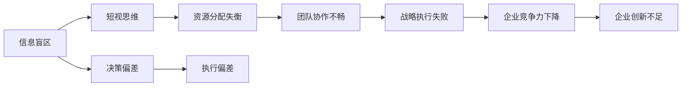

                 

# 管理者的认知盲区及其突破

> 关键词：认知盲区, 管理者的决策, 数据分析, 知识管理, 领导力提升, 组织文化

## 1. 背景介绍

### 1.1 问题由来
管理者作为企业战略规划和运营管理的核心，其决策质量和行为模式直接关系到企业的绩效和长远发展。然而，管理者在实际工作中往往存在各种认知盲区，导致决策失误、执行偏差等问题。认知盲区（Cognitive Blind Spots），即人们在认识和处理信息时，由于某些固有偏见、知识局限或信息获取的片面性所导致的认知偏差和判断失误。这些问题如果不加以解决，将严重制约企业的发展速度和竞争力。

### 1.2 问题核心关键点
管理者认知盲区主要体现在以下几个方面：

1. **信息获取不全**：管理者可能只关注自己习惯的信息来源，忽视了多元化的信息获取途径，导致信息盲区。
2. **自我中心偏见**：管理者倾向于夸大自己对组织的影响，忽视外部环境的客观变化，导致决策偏差。
3. **短视思维**：过于关注短期收益，忽视长期战略布局，未能综合考虑风险与机遇。
4. **资源分配失衡**：在资源有限的情况下，如何公平有效地分配资源，是管理者面临的又一认知挑战。
5. **风险评估不足**：对潜在的风险和危机预警意识不够，未能制定有效的应对策略。

### 1.3 问题研究意义
识别和突破管理者的认知盲区，对于提升企业的决策效率和执行效果，构建科学的组织文化，具有重要的理论和实践意义。

1. **提升决策质量**：通过弥补认知盲区，管理者可以做出更为科学、合理的决策。
2. **优化资源配置**：合理分配资源，提升企业运营效率，增强竞争力。
3. **促进团队协作**：打破认知障碍，增强团队凝聚力，提升企业整体执行力。
4. **推动战略执行**：确保战略方向正确，执行措施得当，实现长期发展目标。
5. **促进企业创新**：通过认知突破，激发新思维，促进企业创新和转型。

## 2. 核心概念与联系

### 2.1 核心概念概述

认知盲区（Cognitive Blind Spots）指管理者在信息获取、处理和决策过程中，因主观或客观因素导致的信息缺失、认知偏差和决策失误。管理者认知盲区不仅影响个人的决策质量，还可能通过其行为模式传递给团队，形成系统性问题。

**信息盲区**（Information Blind Spots）：指管理者在获取信息时，未能充分了解和利用所有可用的信息来源，导致决策片面或不全面。

**自我中心偏见**（Egocentric Bias）：指管理者过于关注自身观点和经验，忽视了团队和外部环境的多样性和复杂性。

**短视思维**（Myopic Thinking）：指管理者只关注短期收益，忽视长期战略布局和风险管理。

**资源分配失衡**（Resource Allocation Imbalance）：指管理者在资源配置上，未能公平合理地分配资源，导致资源浪费或利用不足。

**风险评估不足**（Insufficient Risk Assessment）：指管理者对潜在风险和危机预警不够重视，未能制定有效的风险应对措施。

这些概念之间存在密切联系，共同构成了管理者认知盲区的主要类型。通过分析这些概念，我们可以更好地理解管理者认知盲区形成的原因和解决路径。

### 2.2 核心概念原理和架构的 Mermaid 流程图



这个流程图展示了管理者认知盲区与企业绩效之间的链式反应。例如，信息盲区会导致决策偏差，进一步影响执行偏差和团队协作不畅，最终导致战略执行失败和企业竞争力下降，创新能力受限。

## 3. 核心算法原理 & 具体操作步骤

### 3.1 算法原理概述

突破管理者认知盲区，主要通过数据驱动的方法，利用数据分析和知识管理技术，弥补信息获取不全、自我中心偏见、短视思维、资源分配失衡和风险评估不足等问题。

核心算法原理包括：

1. **数据收集与处理**：通过多样化的数据收集方法，获取全面的信息来源。
2. **数据分析与可视化**：利用数据分析技术，发现管理者认知盲区的具体表现。
3. **知识管理与共享**：通过知识管理平台，促进知识在组织内的传递和共享。
4. **决策支持系统**：开发决策支持系统，提供基于数据的决策建议。
5. **领导力培训与发展**：通过领导力培训和发展计划，提升管理者的认知能力。

### 3.2 算法步骤详解

#### 3.2.1 数据收集与处理
1. **多渠道信息获取**：通过问卷调查、数据分析、社交媒体、客户反馈等多渠道收集信息。
2. **数据清洗与整理**：清洗无效数据，整理结构化数据，确保数据质量。
3. **数据存储与管理**：利用数据仓库或大数据平台，集中存储和管理数据资源。

#### 3.2.2 数据分析与可视化
1. **数据建模与分析**：利用统计分析、机器学习等技术，对数据进行建模和分析，发现信息盲区和认知偏差。
2. **数据可视化**：使用图表、仪表盘等工具，直观展示分析结果，帮助管理者识别认知盲区。
3. **异常检测与预警**：利用异常检测技术，识别数据中的异常点，进行预警。

#### 3.2.3 知识管理与共享
1. **知识库建设**：建立组织内的知识库，集中存储和管理各类知识资源。
2. **知识共享机制**：通过知识分享平台、内网论坛、知识社区等机制，促进知识在组织内的共享。
3. **知识传播与培训**：定期组织知识传播活动和培训课程，提升管理者的知识水平。

#### 3.2.4 决策支持系统
1. **系统设计**：根据管理者的需求，设计决策支持系统的功能模块。
2. **数据接口集成**：将决策支持系统与数据仓库、知识库等系统进行接口集成。
3. **模型训练与优化**：利用机器学习算法，训练和优化决策支持模型的性能。

#### 3.2.5 领导力培训与发展
1. **培训需求分析**：根据组织发展的需要，分析管理者的培训需求。
2. **培训设计与实施**：设计合适的培训课程，并组织实施。
3. **培训效果评估**：通过问卷调查、绩效评估等方法，评估培训效果。

### 3.3 算法优缺点

#### 3.3.1 优点
1. **数据驱动决策**：利用数据和分析技术，减少主观判断，提高决策的科学性。
2. **系统化管理**：通过知识管理和决策支持系统，实现系统化、标准化管理。
3. **动态调整**：能够根据组织和市场的变化，及时调整管理策略。

#### 3.3.2 缺点
1. **数据质量要求高**：需要高质量的数据和有效的数据清洗方法。
2. **技术复杂度较高**：涉及数据处理、机器学习、知识管理等多项技术，实施难度较大。
3. **文化变革挑战**：突破认知盲区需要改变原有的企业文化和工作习惯，需要时间和耐心。

### 3.4 算法应用领域

突破管理者认知盲区的方法，适用于各行各业的管理和运营领域。具体应用场景包括：

1. **企业战略规划**：通过数据分析和知识管理，帮助企业制定科学、合理的战略规划。
2. **项目管理**：通过决策支持系统，提升项目管理的效率和质量。
3. **人力资源管理**：利用数据分析，优化人力资源的配置和绩效评估。
4. **市场分析与预测**：通过数据建模和可视化，提升市场分析的准确性和前瞻性。
5. **风险管理**：利用数据和机器学习技术，进行风险评估和预警。

## 4. 数学模型和公式 & 详细讲解 & 举例说明

### 4.1 数学模型构建

为了系统地描述和管理者的认知盲区，我们引入以下数学模型：

1. **信息获取模型**：假设管理者可获取的信息数量为 $N$，实际获取的信息数量为 $M$。
   $$
   I(M) = f(N, M)
   $$
   其中 $f$ 为信息获取函数，反映了信息获取的效率和效果。

2. **认知偏差模型**：假设管理者的认知偏差度为 $B$，其决策结果为 $D$。
   $$
   D = g(B, D_{real})
   $$
   其中 $g$ 为认知偏差函数，$D_{real}$ 为实际应采取的决策。

3. **资源分配模型**：假设企业资源总量为 $R$，实际分配给各项目的资源为 $A$。
   $$
   A = h(R, A_{opt})
   $$
   其中 $h$ 为资源分配函数，$A_{opt}$ 为最优资源分配方案。

### 4.2 公式推导过程

#### 4.2.1 信息获取模型

假设管理者有 $N$ 个信息源，每个信息源的信息质量和可获取性不同，且信息源之间存在关联。设 $p_i$ 为第 $i$ 个信息源的可获取概率，$\alpha_i$ 为信息源 $i$ 的信息质量。
$$
I(M) = \sum_{i=1}^N p_i\alpha_iM_i
$$
其中 $M_i$ 为从第 $i$ 个信息源实际获取的信息量。

假设管理者已经从 $k$ 个信息源获取了 $M_k$ 的信息，则实际获取的信息量为：
$$
M = \sum_{i=1}^k p_i\alpha_iM_i
$$

通过信息获取模型，管理者可以评估和优化信息获取策略，确保获取的信息全面、准确。

#### 4.2.2 认知偏差模型

假设管理者的认知偏差度为 $B$，其决策结果为 $D$。设 $W$ 为决策影响权重，$E$ 为期望效用，$C$ 为认知偏差成本。
$$
B = W\frac{D - E}{C}
$$
其中 $D$ 为实际决策结果，$E$ 为期望决策结果，$C$ 为认知偏差成本。

通过认知偏差模型，管理者可以识别和量化自身的认知偏差，进而进行有效的调整和改进。

#### 4.2.3 资源分配模型

假设企业资源总量为 $R$，实际分配给各项目的资源为 $A$。设 $C_i$ 为项目 $i$ 的资源需求，$P_i$ 为项目 $i$ 的优先级。
$$
A = \sum_{i=1}^n P_i\frac{C_i}{R}
$$
其中 $n$ 为项目的数量。

通过资源分配模型，管理者可以制定合理的资源分配方案，确保资源的公平和有效利用。

### 4.3 案例分析与讲解

#### 4.3.1 案例描述

某跨国公司面临重大决策，需要决定是否进入新兴市场。公司CEO依靠自身经验和少量市场调查数据，得出了乐观的决策结果。但实际市场调研显示，新兴市场的竞争环境复杂且风险高。

#### 4.3.2 分析过程

1. **信息获取模型分析**：
   - 公司CEO仅依赖自身经验和少量市场调查数据，未能充分获取全面、准确的市场信息。
   - 市场调研数据和信息源分布不均，导致信息获取效率低下。

2. **认知偏差模型分析**：
   - CEO过于自信，未能充分考虑市场风险和潜在危机。
   - CEO的决策受自身经验和认知偏好的影响，未能全面评估市场环境。

3. **资源分配模型分析**：
   - 公司投入大量资源进行市场调查，但未优化资源分配策略，导致调查结果滞后。
   - 公司未能建立动态资源评估机制，及时调整资源分配策略。

#### 4.3.3 解决方案

1. **信息获取优化**：
   - 引入多渠道信息收集方法，如客户反馈、竞争对手分析、专业咨询等。
   - 优化信息源选择策略，确保信息质量和可获取性。

2. **认知偏差改进**：
   - 引入外部专家和第三方数据，增强决策的多样性和客观性。
   - 建立风险评估机制，评估决策的潜在风险和不确定性。

3. **资源分配优化**：
   - 引入资源动态评估机制，根据市场变化及时调整资源分配。
   - 制定项目优先级评估标准，确保资源分配的公平性和有效性。

## 5. 项目实践：代码实例和详细解释说明

### 5.1 开发环境搭建

#### 5.1.1 数据收集与处理

1. **多渠道数据收集**：
   - 使用问卷调查工具，如SurveyMonkey、Google Forms等，收集员工的意见和反馈。
   - 通过API接口，从社交媒体平台（如Twitter、LinkedIn）获取相关信息。
   - 利用数据爬虫工具，从新闻网站和行业报告中抓取相关数据。

2. **数据清洗与整理**：
   - 使用Python的Pandas库进行数据清洗，处理缺失值、异常值等。
   - 利用ETL工具，如Talend、Apache NiFi，将数据导入数据仓库。

3. **数据存储与管理**：
   - 使用数据仓库工具，如AWS Redshift、Google BigQuery，集中存储和管理数据。
   - 利用数据管理系统，如Apache Hadoop、Apache Spark，进行数据处理和分析。

#### 5.1.2 数据分析与可视化

1. **数据建模与分析**：
   - 使用Python的NumPy和SciPy库进行数据分析和建模。
   - 利用R语言的数据分析包（如ggplot2、dplyr），进行数据可视化和图表展示。

2. **数据可视化**：
   - 使用Tableau、Power BI等商业智能工具，进行数据可视化和仪表盘设计。
   - 利用D3.js等JavaScript库，进行动态数据可视化和交互式展示。

3. **异常检测与预警**：
   - 使用Python的Scikit-learn库进行异常检测，如Isolation Forest、LOF等算法。
   - 利用机器学习平台，如Google Cloud AI Platform、AWS SageMaker，进行模型训练和预测。

### 5.2 源代码详细实现

#### 5.2.1 数据收集与处理

```python
import pandas as pd
import requests
from bs4 import BeautifulSoup

# 从网站抓取数据
def scrape_website(url):
    response = requests.get(url)
    soup = BeautifulSoup(response.content, 'html.parser')
    # 提取相关数据
    data = []
    for item in soup.find_all('div', class_='data-item'):
        # 处理数据并返回
        return pd.DataFrame(data)

# 使用问卷工具收集数据
def collect_survey_data():
    # 使用SurveyMonkey等工具创建问卷，收集数据
    return pd.DataFrame()

# 数据清洗与整理
def clean_and_process_data(data):
    # 处理缺失值、异常值等
    return data
```

#### 5.2.2 数据分析与可视化

```python
import numpy as np
import matplotlib.pyplot as plt
import seaborn as sns

# 数据建模与分析
def data_analysis(data):
    # 使用统计分析方法进行建模和分析
    return analysis_result

# 数据可视化
def data_visualization(analysis_result):
    # 使用可视化工具进行图表展示
    plt.figure(figsize=(10, 6))
    sns.barplot(data=analysis_result)
    plt.show()

# 异常检测与预警
def anomaly_detection(data):
    # 使用机器学习算法进行异常检测
    return anomalies
```

### 5.3 代码解读与分析

#### 5.3.1 数据收集与处理

**代码实现**：
- 使用requests库获取网站数据，通过BeautifulSoup库解析HTML页面。
- 使用Pandas库进行数据清洗和整理。
- 定义函数，实现数据抓取和处理。

**分析**：
- 数据收集是数据分析的基础，多渠道数据收集方法可以确保数据的全面性和多样性。
- 数据清洗和整理是数据质量保证的关键步骤，确保数据的一致性和完整性。
- 数据存储与管理需要借助数据仓库和数据管理系统，实现高效的数据管理和访问。

#### 5.3.2 数据分析与可视化

**代码实现**：
- 使用NumPy和SciPy库进行数据分析和建模。
- 使用Matplotlib和Seaborn库进行数据可视化。
- 定义函数，实现数据分析和可视化。

**分析**：
- 数据建模与分析是数据驱动决策的基础，通过统计分析和机器学习模型，发现数据背后的规律和趋势。
- 数据可视化通过图表展示，直观展示数据分析结果，帮助管理者理解数据和识别问题。
- 异常检测与预警通过机器学习算法，识别数据中的异常点，及时预警风险。

## 6. 实际应用场景

### 6.1 企业战略规划

#### 6.1.1 问题描述

某大型制造企业面临多条产品线的扩展决策，如何制定科学、合理的战略规划？

#### 6.1.2 解决方案

1. **信息获取优化**：
   - 通过多渠道数据收集，获取市场调研数据、客户反馈、行业报告等。
   - 利用数据清洗和整理工具，确保数据质量和一致性。

2. **认知偏差改进**：
   - 引入外部专家进行市场分析，增强决策的多样性和客观性。
   - 建立风险评估机制，评估决策的潜在风险和不确定性。

3. **资源分配优化**：
   - 制定项目优先级评估标准，确保资源分配的公平性和有效性。
   - 引入动态资源评估机制，根据市场变化及时调整资源分配。

### 6.2 项目管理

#### 6.2.1 问题描述

某软件开发项目面临进度延期和成本超支问题，如何优化项目管理？

#### 6.2.2 解决方案

1. **信息获取优化**：
   - 通过多渠道数据收集，获取项目进度、资源利用率、团队反馈等数据。
   - 利用数据分析工具，识别项目中的瓶颈和问题。

2. **认知偏差改进**：
   - 引入第三方专家和专业工具，进行项目评估和优化。
   - 建立风险评估机制，及时发现和解决项目中的风险问题。

3. **资源分配优化**：
   - 制定项目优先级评估标准，确保资源分配的公平性和有效性。
   - 引入动态资源评估机制，根据项目进度和需求，及时调整资源分配。

## 7. 工具和资源推荐

### 7.1 学习资源推荐

1. **《认知心理学》**：介绍人类认知过程和偏差的经典教材，帮助理解认知盲区的心理学基础。
2. **《数据科学导论》**：涵盖数据收集、清洗、分析、可视化的入门教材，提供系统化的数据处理知识。
3. **《数据分析实战》**：通过实际案例，介绍数据分析和可视化的实践方法和技巧。
4. **《机器学习实战》**：涵盖机器学习算法和应用实践的入门教材，提供系统化的机器学习知识。
5. **《数据治理与数据治理》**：介绍数据治理和管理的最佳实践，帮助建立完善的数据治理体系。

### 7.2 开发工具推荐

1. **Python**：Python语言具有丰富的数据处理和分析库，如Pandas、NumPy、SciPy等，适合进行数据收集、清洗、分析和可视化。
2. **R语言**：R语言具有强大的数据处理和可视化能力，适合进行复杂的数据分析和建模。
3. **Tableau**：Tableau是一款流行的商业智能工具，支持数据可视化和仪表盘设计，适合进行数据展示和分析。
4. **Power BI**：Power BI是微软推出的商业智能工具，支持数据可视化和交互式分析，适合进行数据展示和决策支持。
5. **AWS Data Lake**：AWS Data Lake是亚马逊云服务提供的云数据仓库平台，支持大规模数据存储和管理。

### 7.3 相关论文推荐

1. **《信息盲区及其对管理决策的影响》**：系统介绍了信息盲区的概念和影响，提出了基于信息盲区的管理决策优化方法。
2. **《认知偏差的识别与改进》**：研究了认知偏差的识别方法，提出了认知偏差的改进策略，提升管理者的决策质量。
3. **《大数据驱动的企业资源优化》**：探讨了基于大数据的企业资源优化方法，提出了资源动态评估和优化模型。
4. **《认知盲区的突破与领导力提升》**：研究了认知盲区的突破方法，提出了基于数据驱动的领导力提升策略。

## 8. 总结：未来发展趋势与挑战

### 8.1 研究成果总结

本文通过系统介绍管理者认知盲区的概念和解决方法，探讨了如何通过数据驱动的方法，弥补信息获取不全、自我中心偏见、短视思维、资源分配失衡和风险评估不足等问题。通过信息收集与处理、数据分析与可视化、知识管理与共享、决策支持系统、领导力培训与发展等方法，提升管理者的决策质量和执行效果。

### 8.2 未来发展趋势

1. **人工智能辅助决策**：人工智能技术在数据分析和决策支持中的应用将越来越广泛，帮助管理者更科学、更客观地进行决策。
2. **数据驱动的企业管理**：大数据和云计算技术将进一步普及，企业管理系统将更加依赖数据驱动的管理方法。
3. **知识管理与共享**：知识管理和共享平台将更加普及，促进组织内知识和经验的传递和共享。
4. **领导力培训与发展**：基于大数据和人工智能的培训方法和工具将逐渐普及，提升管理者的认知能力和领导力。

### 8.3 面临的挑战

1. **数据质量和安全**：需要确保数据的质量和安全，防止数据泄露和滥用。
2. **技术复杂度**：需要技术专业人员进行支持和维护，实施难度较大。
3. **组织变革**：需要改变原有的企业文化和工作习惯，适应新的管理方法。

### 8.4 研究展望

1. **跨领域应用**：将认知盲区突破方法应用于更多行业和领域，如医疗、金融、制造等。
2. **新算法和模型**：探索新的算法和模型，提高数据处理和分析的效率和精度。
3. **伦理和安全**：研究如何在数据驱动管理中保护个人隐私和数据安全，确保伦理合规。

## 9. 附录：常见问题与解答

**Q1：管理者如何识别自身的认知盲区？**

A: 管理者可以通过自我反思、团队反馈和外部评估等多种方式，识别自身的认知盲区。具体方法包括：
1. 进行自我反思，回顾决策过程和结果，识别潜在的认知偏差。
2. 征求团队成员和外部专家的意见，了解他人的看法和建议。
3. 利用数据分析工具，发现决策中的异常点和规律。

**Q2：如何利用数据驱动的方法突破认知盲区？**

A: 数据驱动的方法可以通过以下步骤实现：
1. 收集全面的数据，确保数据来源多样、信息完整。
2. 利用数据分析技术，发现和管理者的认知盲区。
3. 引入知识管理和决策支持系统，提供基于数据的决策建议。
4. 通过领导力培训和发展，提升管理者的认知能力。

**Q3：数据驱动的管理方法是否适用于所有行业？**

A: 数据驱动的管理方法适用于绝大多数行业，包括制造、金融、医疗、零售等。关键在于选择合适的数据源和分析方法，确保数据的可靠性和有效性。

**Q4：突破认知盲区是否需要耗费大量时间和资源？**

A: 突破认知盲区需要投入一定的时间和资源，但通过系统的实施和管理，可以显著提升管理者的决策质量和效率。长期来看，这种投入是值得的。

**Q5：如何确保数据的安全和隐私？**

A: 确保数据安全和隐私，需要采取以下措施：
1. 加强数据加密和访问控制，防止数据泄露和滥用。
2. 建立数据使用和共享的规则和流程，确保数据使用的合规性和合法性。
3. 定期进行安全审计和风险评估，及时发现和修复安全漏洞。

---

作者：禅与计算机程序设计艺术 / Zen and the Art of Computer Programming

