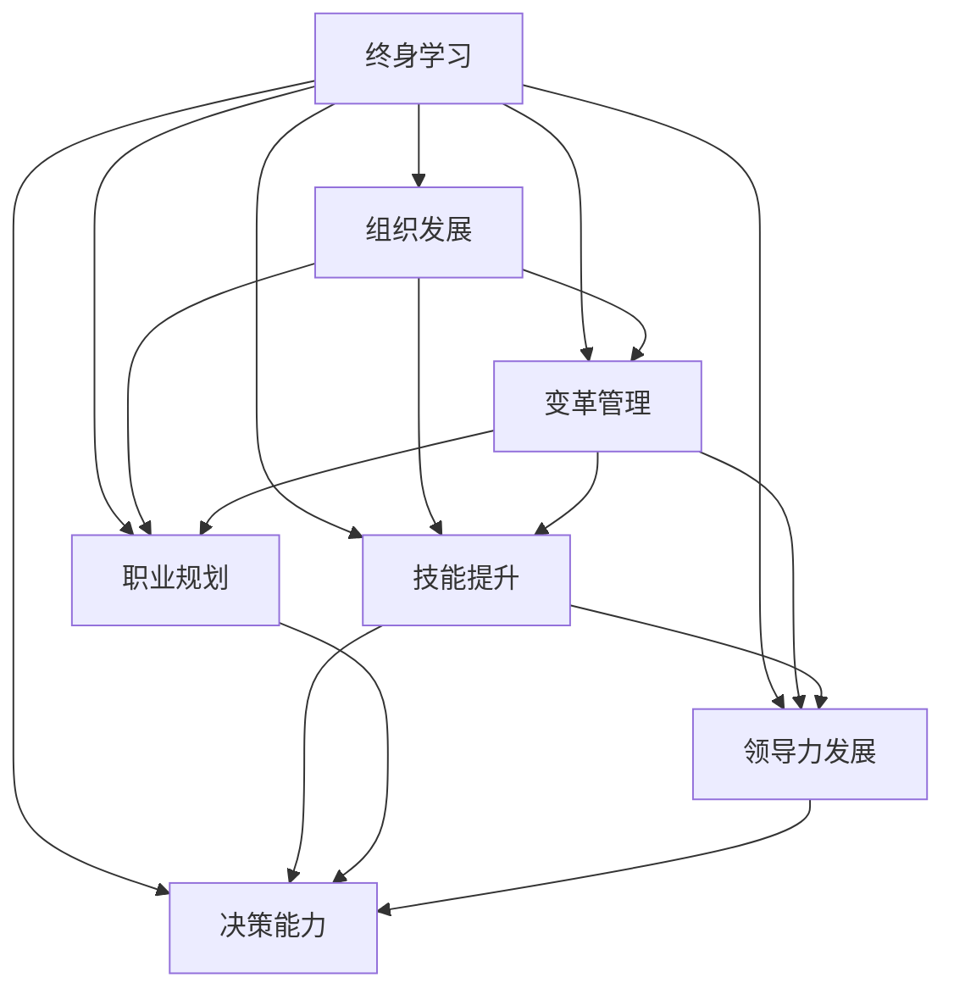

                 

# 管理者终身学习的重要性与方法

> 关键词：管理者, 终身学习, 组织发展, 变革管理, 技能提升, 职业规划, 领导力发展, 决策能力

## 1. 背景介绍

在当今快速变化的市场环境中，企业面临着前所未有的挑战。技术的飞速发展、消费者偏好的变化、全球化的加速以及竞争的加剧，都对企业提出了更高的要求。在这样的背景下，管理者的作用比以往任何时候都更加重要。管理者不仅需要具备战略思维、领导能力，还需要具备适应新环境、创新解决问题的能力。终身学习成为管理者适应变化、提升竞争力的关键。

管理者终身学习的重要性体现在以下几个方面：

1. **适应变化**：世界在不断变化，管理者需要持续更新知识和技能，以适应新的商业环境和技术趋势。
2. **提升竞争力**：终身学习帮助管理者不断提升自己的专业知识和领导力，从而在激烈的竞争中脱颖而出。
3. **组织发展**：管理者通过不断学习，能够更好地引领组织的发展，推动组织的创新和进步。
4. **决策能力**：持续学习使管理者能够更好地理解和分析复杂的信息，做出更加科学的决策。

然而，尽管终身学习的重要性不言而喻，但在实践中，许多管理者仍然面临诸多挑战。如何系统性地进行终身学习？如何结合工作实际有效地应用所学知识？这些问题值得深入探讨。

## 2. 核心概念与联系

### 2.1 核心概念概述

- **终身学习(Lifelong Learning)**：指在个人职业生涯中，通过不断学习新知识、新技能，适应变化，提升自身能力和素质。
- **组织发展(Organizational Development)**：指通过改进组织结构、流程和人员，提升组织的整体绩效和竞争优势。
- **变革管理(Change Management)**：指在组织内部推动重大变革的过程，确保变革顺利实施，减少对员工的负面影响。
- **技能提升(Skill Enhancement)**：指通过培训、实践等方式，提升管理者的专业技能和通用技能。
- **职业规划(Career Planning)**：指根据个人的职业目标和发展需要，制定和实施职业发展计划。
- **领导力发展(Leadership Development)**：指通过培训、辅导等方式，提升管理者的领导能力和管理技巧。
- **决策能力(Decision Making)**：指在复杂环境中，做出明智、高效的决策能力。

这些核心概念之间相互关联，共同构成管理者终身学习的理论基础。例如，组织发展需要通过管理者的终身学习来实现，而变革管理则依赖于管理者的领导力提升。因此，理解这些概念的联系，对于管理者终身学习具有重要意义。

### 2.2 核心概念原理和架构的 Mermaid 流程图



这个流程图展示了终身学习与各个核心概念之间的联系和相互作用。

## 3. 核心算法原理 & 具体操作步骤

### 3.1 算法原理概述

管理者终身学习的核心算法原理可以概括为以下几个步骤：

1. **需求分析**：评估个人当前的能力和技能水平，确定需要提升的领域。
2. **目标设定**：根据需求分析结果，设定明确的学习目标和职业规划。
3. **学习策略制定**：选择合适的学习方式和资源，制定学习计划。
4. **实践应用**：将所学知识应用于实际工作中，验证学习效果。
5. **反馈和调整**：根据实践结果，调整学习策略和职业规划。

这一过程是一个持续迭代、不断优化的过程。

### 3.2 算法步骤详解

以下是基于终身学习理论的管理者学习步骤的详细步骤：

1. **需求分析**：通过自我评估、360度反馈等方式，识别个人技能和知识的缺口。可以使用SWOT分析等工具，全面分析自身优势、劣势、机会和威胁。

2. **目标设定**：根据需求分析结果，设定具体的学习目标。例如，提升数据分析能力、加强团队管理技能、改进沟通技巧等。

3. **学习策略制定**：选择合适的学习资源，如在线课程、书籍、研讨会、工作坊等。制定详细的学习计划，包括学习时间、方式、评估标准等。

4. **实践应用**：将所学知识应用到实际工作中，通过项目实践、跨部门合作等方式，验证学习效果。

5. **反馈和调整**：收集反馈信息，评估学习效果。根据反馈结果，调整学习策略和职业规划，确保学习目标的实现。

### 3.3 算法优缺点

终身学习的优点包括：

- **适应变化**：终身学习帮助管理者适应不断变化的市场环境和组织需求。
- **提升能力**：通过持续学习，管理者能够不断提升自己的专业技能和领导能力。
- **促进创新**：终身学习促使管理者不断探索新知识，推动组织创新。

但同时也存在一些缺点：

- **时间和精力投入**：终身学习需要管理者投入大量的时间和精力，可能影响日常工作。
- **学习资源选择困难**：选择适合自己的学习资源和课程，可能比较困难。
- **学习效果评估困难**：学习效果难以量化，难以直接反映在业务成果上。

### 3.4 算法应用领域

终身学习在多个领域都有广泛应用，包括但不限于：

1. **企业管理**：通过持续学习，提升企业战略规划、组织管理、人力资源管理等方面的能力。
2. **科技创新**：管理者持续学习新技术、新方法，推动企业科技创新和产品创新。
3. **市场营销**：学习市场分析、客户关系管理、品牌建设等知识，提升企业的市场竞争力。
4. **财务管理和会计**：学习财务分析、预算管理、税务筹划等技能，提升企业的财务健康水平。
5. **人力资源管理**：学习人力资源开发、绩效管理、员工关系等知识，提升企业的员工满意度和绩效。

## 4. 数学模型和公式 & 详细讲解 & 举例说明

### 4.1 数学模型构建

管理者终身学习的效果可以通过以下数学模型进行描述：

$$
E = \sum_{i=1}^{n} f(x_i)
$$

其中，$E$ 表示终身学习的总体效果，$x_i$ 表示第 $i$ 个学习活动，$f(x_i)$ 表示该活动对学习效果的贡献。

### 4.2 公式推导过程

假设 $f(x_i)$ 为 $x_i$ 的线性函数，则有：

$$
f(x_i) = a \cdot x_i + b
$$

其中，$a$ 和 $b$ 为常数。将上述公式代入总体效果模型中，得到：

$$
E = \sum_{i=1}^{n} (a \cdot x_i + b) = a \cdot \sum_{i=1}^{n} x_i + nb
$$

### 4.3 案例分析与讲解

假设管理者 $M$ 在一个季度内参加了四个学习活动，每次活动的贡献值分别为 $x_1, x_2, x_3, x_4$，则其终身学习的总体效果 $E$ 可以通过公式计算：

$$
E = a \cdot (x_1 + x_2 + x_3 + x_4) + 4b
$$

假设 $a=0.5, b=1$，且每次活动的贡献值分别为 $x_1=10, x_2=15, x_3=20, x_4=25$，则：

$$
E = 0.5 \cdot (10 + 15 + 20 + 25) + 4 \cdot 1 = 5.5 \cdot 70 + 4 = 392.5 + 4 = 396.5
$$

这意味着，通过四个学习活动，管理者的终身学习效果增加了396.5个单位。

## 5. 项目实践：代码实例和详细解释说明

### 5.1 开发环境搭建

为了进行终身学习效果的量化分析，我们可以使用Python和相关库来搭建开发环境。

1. **安装Python**：从官网下载并安装Python，创建虚拟环境。
2. **安装相关库**：安装Numpy、Pandas、Matplotlib等数据分析和可视化库。
3. **准备数据**：收集管理者参加的学习活动数据，包括活动名称、时间、贡献值等。

### 5.2 源代码详细实现

以下是Python代码实现：

```python
import numpy as np
import pandas as pd
import matplotlib.pyplot as plt

# 准备数据
data = {
    'Activity': ['管理课程', '在线课程', '行业研讨会', '读书笔记'],
    'Duration': [30, 20, 40, 5],
    'Contribution': [20, 15, 25, 10]
}
df = pd.DataFrame(data)

# 计算终身学习效果
total_contribution = np.sum(df['Contribution'])
total_duration = df['Duration'].sum()
effect = 0.5 * total_contribution + 4

# 输出结果
print(f"终身学习效果：{effect}")
```

### 5.3 代码解读与分析

- **导入库**：导入Numpy、Pandas和Matplotlib库，用于数据分析和可视化。
- **准备数据**：使用字典创建DataFrame，存储学习活动的相关信息。
- **计算终身学习效果**：计算所有学习活动的贡献值之和，并根据公式计算终身学习效果。
- **输出结果**：打印终身学习效果。

## 6. 实际应用场景

### 6.1 企业管理

在企业管理中，终身学习可以帮助管理者提升战略规划能力、组织管理能力、人力资源管理能力等。例如，某公司CEO通过参加领导力培训、参与战略研讨会等方式，提升了公司的战略规划和组织管理能力，从而提升了公司的市场竞争力。

### 6.2 科技创新

科技创新是企业发展的核心驱动力。管理者通过持续学习新技术、新方法，能够推动企业的科技创新和产品创新。例如，某IT公司CTO通过学习机器学习、人工智能等前沿技术，推动公司的科技创新，保持公司在技术领域的领先地位。

### 6.3 市场营销

市场营销是企业竞争的关键环节。管理者通过学习市场分析、客户关系管理、品牌建设等知识，提升企业的市场竞争力。例如，某零售公司市场总监通过参加市场营销课程，学习了市场分析和客户关系管理技巧，提升了公司的市场竞争力。

### 6.4 财务管理和会计

财务管理和会计是企业管理的基础。管理者通过学习财务分析、预算管理、税务筹划等技能，提升企业的财务健康水平。例如，某制造企业财务总监通过参加财务管理课程，提升了公司的财务健康水平，降低了财务风险。

### 6.5 人力资源管理

人力资源管理是企业发展的关键。管理者通过学习人力资源开发、绩效管理、员工关系等知识，提升企业的员工满意度和绩效。例如，某人力资源经理通过参加人力资源管理课程，提升了公司的员工满意度和绩效。

## 7. 工具和资源推荐

### 7.1 学习资源推荐

以下是一些优质的学习资源，帮助管理者进行终身学习：

1. **Coursera**：提供各类在线课程，包括管理、技术、金融等多个领域。
2. **edX**：提供来自全球顶尖大学和机构的在线课程。
3. **Udemy**：提供各类实用技能课程，如编程、设计、营销等。
4. **LinkedIn Learning**：提供职业发展和技能提升的在线课程。
5. **Harvard Business Review**：提供商业和管理领域的最新研究文章和案例分析。

### 7.2 开发工具推荐

以下是一些常用的开发工具，帮助管理者进行终身学习：

1. **Google Colab**：免费在线Jupyter Notebook环境，方便进行数据分析和可视化。
2. **Jupyter Notebook**：强大的交互式编程环境，支持Python、R等多种语言。
3. **R Studio**：数据科学和统计分析的平台，支持R语言。
4. **Tableau**：数据可视化的工具，帮助管理者理解和分析数据。
5. **Power BI**：商业智能和数据分析工具，支持Excel、SQL等多种数据源。

### 7.3 相关论文推荐

以下是几篇重要的相关论文，值得管理者关注：

1. **"Learning to Learn: A Tutorial"**：来自Coursera，介绍了终身学习的理论基础和实践方法。
2. **"Lifelong Learning for Decision-Making in a Volatile World"**：探讨了在快速变化的世界中，终身学习对管理者决策的重要性。
3. **"Beyond Basic Technical Skills: The Role of Soft Skills in Lifelong Learning"**：分析了软技能在终身学习中的重要性。
4. **"The Role of Learning in Organizational Change and Development"**：讨论了学习在组织变革和发展中的作用。
5. **"Leadership Development: A Lifelong Learning Approach"**：探讨了终身学习对管理者领导能力提升的影响。

## 8. 总结：未来发展趋势与挑战

### 8.1 研究成果总结

管理者终身学习的重要性已经得到了广泛的认可。通过持续学习，管理者能够适应变化、提升能力、促进创新，从而推动组织的发展。

### 8.2 未来发展趋势

未来，管理者终身学习的发展趋势包括：

1. **数字化学习**：随着在线教育的发展，数字化学习将成为终身学习的重要形式。
2. **跨领域学习**：管理者将更加注重跨领域知识的学习，提升综合素质。
3. **终身学习平台**：将出现更多的终身学习平台，提供更加个性化、便捷的学习体验。
4. **虚拟现实学习**：虚拟现实技术将用于终身学习，提供更加沉浸式的学习体验。
5. **AI辅助学习**：AI技术将用于终身学习，提供更加智能的学习推荐和评估。

### 8.3 面临的挑战

尽管终身学习对管理者具有重要意义，但在实践中仍面临诸多挑战：

1. **时间和精力投入**：管理者需要平衡工作和学习，可能面临时间和精力的压力。
2. **学习资源选择困难**：选择合适的学习资源和课程，可能比较困难。
3. **学习效果评估困难**：学习效果难以量化，难以直接反映在业务成果上。
4. **个性化需求难以满足**：不同管理者的需求和学习风格不同，难以找到适合自己的学习资源。
5. **学习环境缺乏支持**：企业缺乏支持终身学习的文化和机制，可能影响学习效果。

### 8.4 研究展望

未来，管理者终身学习的方向包括：

1. **企业支持**：企业应建立支持终身学习的文化和机制，鼓励管理者进行终身学习。
2. **个性化学习**：提供更加个性化、定制化的学习资源和计划，满足不同管理者的需求。
3. **在线学习**：充分利用在线教育资源，提升学习的便捷性和效率。
4. **混合学习**：结合在线学习和线下培训，提供更加灵活的学习方式。
5. **技术支持**：引入AI等技术，提升学习的智能化和个性化水平。

## 9. 附录：常见问题与解答

**Q1: 管理者终身学习是否有必要？**

A: 管理者终身学习非常必要。在快速变化的市场环境中，管理者需要不断更新知识和技能，才能适应变化、提升竞争力。

**Q2: 如何进行有效的终身学习？**

A: 有效的终身学习需要系统性规划和持续努力。需求分析、目标设定、学习策略制定、实践应用和反馈调整是关键步骤。

**Q3: 学习资源如何选择合适的？**

A: 选择学习资源需要考虑个人需求、学习目标、时间安排等因素。可以咨询行业专家、参考在线评价、参加培训课程等方式，找到适合自己的学习资源。

**Q4: 学习效果如何评估？**

A: 学习效果可以通过实际工作表现、技能测试、同事反馈等方式进行评估。同时，可以通过设定明确的KPI指标，量化学习效果。

**Q5: 如何平衡工作和学习？**

A: 管理者需要合理规划时间，将学习时间纳入工作计划。可以采用碎片化学习、混合学习等方式，提高学习效率。

---

作者：禅与计算机程序设计艺术 / Zen and the Art of Computer Programming

