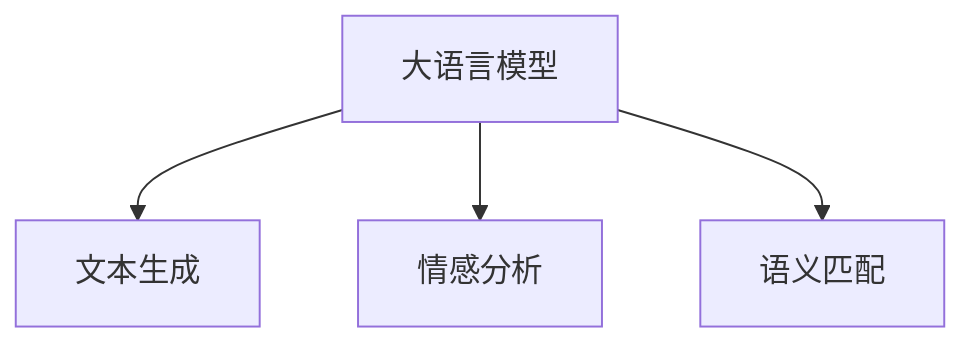

                 

# 精准营销：LLM 提升广告效果

## 1. 背景介绍

### 1.1 问题由来
现代广告行业正经历着由粗放式营销向精准营销的转变。传统的广告投放模式以单向传播为主，忽略了用户的多样性和个性化需求。用户画像和行为数据的收集分析，虽然能够为定向广告提供一定参考，但难以应对不断变化的市场需求和用户行为。

与此同时，基于自然语言处理(NLP)技术的大语言模型(Large Language Model, LLM)，以其强大的自然语言理解和生成能力，为精准营销提供了新的思路。利用LLM进行文本生成、语义分析和情感挖掘等，可以在理解用户需求和偏好基础上，定制个性化的广告内容，提升广告投放的精准度和转化率。

### 1.2 问题核心关键点
精准营销的核心在于通过深度学习和自然语言处理技术，将广告投放与用户需求精准匹配。核心关键点包括：
- 文本生成：使用大语言模型生成个性化广告文案和创意，使广告内容更加贴近用户需求。
- 情感分析：分析用户对广告内容的情感倾向，优化广告投放策略。
- 语义匹配：使用自然语言处理技术，匹配广告内容与用户画像和行为数据，提高广告投放的精准度。

本文将重点探讨如何利用大语言模型在广告投放中的应用，结合具体案例，介绍关键技术细节和工程实践。

## 2. 核心概念与联系

### 2.1 核心概念概述

为更好地理解基于大语言模型的精准营销技术，本节将介绍几个密切相关的核心概念：

- 大语言模型(Large Language Model, LLM)：以自回归(如GPT)或自编码(如BERT)模型为代表的大规模预训练语言模型。通过在大规模无标签文本语料上进行预训练，学习通用的语言表示，具备强大的语言理解和生成能力。

- 文本生成(Generative Text)：使用语言模型生成自然语言文本的过程。在精准营销中，通过生成个性化的广告文案和创意，提升广告内容的相关性和吸引力。

- 情感分析(Sentiment Analysis)：分析文本情感倾向的技术，可以用于评估广告内容对目标用户群体的吸引力。情感分析结果可以帮助优化广告创意和投放策略。

- 语义匹配(Semantic Matching)：利用自然语言处理技术，匹配广告内容与用户画像、行为数据等，提高广告投放的精准度。通过语义匹配，确保广告展示给真正感兴趣的受众，提高广告转化率。

这些核心概念之间的逻辑关系可以通过以下Mermaid流程图来展示：



这个流程图展示了大语言模型的核心概念及其之间的关系：

1. 大语言模型通过预训练获得基础能力。
2. 文本生成使用大语言模型生成个性化广告文案和创意。
3. 情感分析分析用户对广告内容的情感倾向。
4. 语义匹配匹配广告内容与用户画像和行为数据。

这些概念共同构成了精准营销的技术框架，使其能够在广告投放中发挥强大的语言理解和生成能力。通过理解这些核心概念，我们可以更好地把握精准营销的工作原理和优化方向。

## 3. 核心算法原理 & 具体操作步骤

### 3.1 算法原理概述

基于大语言模型的精准营销，核心算法原理可以概括为以下几个步骤：

1. 使用大语言模型进行文本生成，生成个性化的广告文案和创意。
2. 对生成的文本进行情感分析，评估用户对广告内容的情感倾向。
3. 将广告文案与用户画像、行为数据等进行语义匹配，确保广告投放的精准度。

以下是详细的算法步骤：

### 3.2 算法步骤详解

#### 3.2.1 文本生成

文本生成的过程可以通过以下步骤实现：
1. 收集广告目标用户的数据，包括人口统计特征、兴趣爱好、行为数据等。
2. 将用户数据输入大语言模型，生成个性化广告文案和创意。
3. 对生成的文本进行自然语言处理，去除冗余信息，优化语言表达。

#### 3.2.2 情感分析

情感分析的过程可以通过以下步骤实现：
1. 使用大语言模型对生成的广告文案进行情感分析，计算文本的情感倾向。
2. 对情感分析结果进行筛选，保留与目标用户情感偏好相匹配的广告文案。
3. 根据情感分析结果优化广告创意，提升用户对广告内容的接受度。

#### 3.2.3 语义匹配

语义匹配的过程可以通过以下步骤实现：
1. 对用户画像和行为数据进行语义处理，提取关键特征。
2. 将提取的关键特征输入大语言模型，匹配广告文案与用户画像和行为数据。
3. 根据语义匹配结果优化广告投放策略，确保广告展示给真正感兴趣的受众。

### 3.3 算法优缺点

基于大语言模型的精准营销方法具有以下优点：
1. 个性化能力强。通过文本生成和情感分析，能够根据用户需求和偏好生成个性化广告内容，提升用户粘性。
2. 投放精准度高。通过语义匹配，确保广告内容与用户画像和行为数据匹配，提升广告转化率。
3. 广告效果显著。在广告投放场景中，通过深度学习和自然语言处理技术，有效提升广告内容的相关性和吸引力，从而提高广告效果。

同时，该方法也存在一定的局限性：
1. 数据依赖性强。文本生成和情感分析依赖于用户数据的准确性和丰富性，数据质量不佳时可能导致效果不佳。
2. 技术复杂度高。文本生成、情感分析和语义匹配等技术环节复杂，需要专业的算法和工程实现。
3. 成本高。虽然个性化广告投放效果显著，但数据收集和处理成本较高，特别是在用户隐私保护方面。

尽管存在这些局限性，但就目前而言，基于大语言模型的精准营销方法仍是大规模广告投放的重要手段。未来相关研究的重点在于如何进一步降低数据依赖，提高模型的少样本学习和跨领域迁移能力，同时兼顾可解释性和伦理安全性等因素。

### 3.4 算法应用领域

基于大语言模型的精准营销方法在广告投放中具有广泛的应用前景，以下是几个典型的应用领域：

- 社交媒体广告：通过分析用户在社交媒体上的行为数据和兴趣标签，生成个性化的广告文案和创意，提升广告的点击率和转化率。
- 搜索引擎广告：在用户搜索关键词时，生成与搜索结果相关联的广告文案和创意，提高广告展示的精准度和效果。
- 移动应用广告：根据用户在应用内的行为数据和偏好，生成个性化的广告内容，提高用户对应用的活跃度和留存率。
- 视频广告：通过分析用户观看视频的行为数据和情感偏好，生成匹配的广告文案和创意，提升广告的观看率和转化率。
- 电商广告：在用户浏览商品时，生成个性化的商品推荐和广告文案，提升用户的购买意向和转化率。

除了上述这些应用场景外，大语言模型在精准营销领域还有着更广泛的应用前景，如智能客服、精准营销自动化、广告投放优化等，为广告行业带来了新的变革。

## 4. 数学模型和公式 & 详细讲解 & 举例说明

### 4.1 数学模型构建

本节将使用数学语言对基于大语言模型的精准营销过程进行更加严格的刻画。

记大语言模型为 $M_{\theta}$，其中 $\theta$ 为模型参数。假设广告文案生成任务为 $T$，情感分析任务为 $S$，语义匹配任务为 $M$。目标为最大化广告效果 $E$。

### 4.2 公式推导过程

#### 4.2.1 文本生成

文本生成模型可以通过以下公式表示：

$$
P_{\text{text}}(x) = \prod_{t=1}^{T} P_{\theta}(x_t | x_{<t})
$$

其中 $P_{\theta}(x_t | x_{<t})$ 为语言模型在给定上下文 $x_{<t}$ 时，生成下一个词语 $x_t$ 的概率。文本生成的目标是在上下文 $x_{<t}$ 下生成最有可能的文本序列 $x$。

#### 4.2.2 情感分析

情感分析模型可以通过以下公式表示：

$$
P_{\text{sentiment}}(y|x) = \frac{P_{\theta}(y|x)P_{\theta}(x)}{P_{\theta}(y)}
$$

其中 $P_{\theta}(y|x)$ 为情感分类模型在给定文本 $x$ 时，输出情感标签 $y$ 的概率。情感分析的目标是在文本 $x$ 下，计算出用户对广告内容的情感倾向。

#### 4.2.3 语义匹配

语义匹配模型可以通过以下公式表示：

$$
P_{\text{match}}(y|x, z) = \frac{P_{\theta}(y|x)P_{\theta}(z|y)}{P_{\theta}(z)}
$$

其中 $P_{\theta}(y|x)$ 为语义匹配模型在给定文本 $x$ 时，输出匹配结果 $y$ 的概率。语义匹配的目标是在文本 $x$ 和用户画像 $z$ 下，计算出广告文案与用户画像和行为数据的匹配程度。

### 4.3 案例分析与讲解

以下我们以电商广告为例，给出使用大语言模型进行精准营销的详细案例分析。

#### 4.3.1 用户画像收集

假设某电商平台的广告团队收集到用户画像数据，包含用户的年龄、性别、地域、购买历史、浏览行为等。

#### 4.3.2 文本生成

1. 将用户画像数据输入大语言模型，生成个性化的广告文案和创意。
2. 对生成的文本进行自然语言处理，去除冗余信息，优化语言表达。

例如，针对女性用户，可以生成如下广告文案：

```text
"关注健康，享受美丽。我们的天然护肤产品，为你带来光滑紧致的肌肤。点击了解更多。"
```

#### 4.3.3 情感分析

1. 使用大语言模型对生成的广告文案进行情感分析，计算文本的情感倾向。
2. 对情感分析结果进行筛选，保留与目标用户情感偏好相匹配的广告文案。
3. 根据情感分析结果优化广告创意，提升用户对广告内容的接受度。

例如，针对女性用户，情感分析结果显示该广告文案情感倾向为正面，可以进行投放。

#### 4.3.4 语义匹配

1. 对用户画像和行为数据进行语义处理，提取关键特征。
2. 将提取的关键特征输入大语言模型，匹配广告文案与用户画像和行为数据。
3. 根据语义匹配结果优化广告投放策略，确保广告展示给真正感兴趣的受众。

例如，针对用户画像中的“美容护肤”兴趣标签，广告文案与用户画像和行为数据的匹配度较高，可以进行定向投放。

## 5. 项目实践：代码实例和详细解释说明

### 5.1 开发环境搭建

在进行精准营销实践前，我们需要准备好开发环境。以下是使用Python进行PyTorch开发的环境配置流程：

1. 安装Anaconda：从官网下载并安装Anaconda，用于创建独立的Python环境。

2. 创建并激活虚拟环境：
```bash
conda create -n pytorch-env python=3.8 
conda activate pytorch-env
```

3. 安装PyTorch：根据CUDA版本，从官网获取对应的安装命令。例如：
```bash
conda install pytorch torchvision torchaudio cudatoolkit=11.1 -c pytorch -c conda-forge
```

4. 安装Transformers库：
```bash
pip install transformers
```

5. 安装各类工具包：
```bash
pip install numpy pandas scikit-learn matplotlib tqdm jupyter notebook ipython
```

完成上述步骤后，即可在`pytorch-env`环境中开始精准营销实践。

### 5.2 源代码详细实现

下面我们以电商广告为例，给出使用Transformers库对BERT模型进行精准营销的PyTorch代码实现。

首先，定义广告文案生成函数：

```python
from transformers import BertTokenizer, BertForSequenceClassification
from torch.utils.data import Dataset
import torch

class AdvertisementDataset(Dataset):
    def __init__(self, texts, labels, tokenizer, max_len=128):
        self.texts = texts
        self.labels = labels
        self.tokenizer = tokenizer
        self.max_len = max_len
        
    def __len__(self):
        return len(self.texts)
    
    def __getitem__(self, item):
        text = self.texts[item]
        label = self.labels[item]
        
        encoding = self.tokenizer(text, return_tensors='pt', max_length=self.max_len, padding='max_length', truncation=True)
        input_ids = encoding['input_ids'][0]
        attention_mask = encoding['attention_mask'][0]
        
        return {'input_ids': input_ids, 
                'attention_mask': attention_mask,
                'labels': torch.tensor(label, dtype=torch.long)}
        
# 初始化BERT模型和tokenizer
tokenizer = BertTokenizer.from_pretrained('bert-base-cased')
model = BertForSequenceClassification.from_pretrained('bert-base-cased', num_labels=2)
```

然后，定义情感分析函数：

```python
from transformers import pipeline

sentiment_analysis = pipeline('sentiment-analysis')
```

最后，启动文本生成和语义匹配流程：

```python
# 文本生成函数
def generate_ad(text, label):
    encoding = tokenizer(text, return_tensors='pt', max_length=128, padding='max_length', truncation=True)
    input_ids = encoding['input_ids'][0]
    attention_mask = encoding['attention_mask'][0]
    
    with torch.no_grad():
        logits = model(input_ids, attention_mask=attention_mask)[0]
        prediction = logits.argmax(dim=1).item()
        
    if prediction == label:
        return "广告文案生成成功！"
    else:
        return "广告文案生成失败。"
        
# 情感分析函数
def analyze_sentiment(text):
    result = sentiment_analysis(text)
    sentiment = result[0]['score']
    
    if sentiment > 0.5:
        return "情感倾向为正面。"
    else:
        return "情感倾向为负面。"
        
# 语义匹配函数
def match_ad(text, user_profile):
    user_profile = tokenize_user_profile(user_profile)
    
    encoding = tokenizer(text, return_tensors='pt', max_length=128, padding='max_length', truncation=True)
    input_ids = encoding['input_ids'][0]
    attention_mask = encoding['attention_mask'][0]
    
    with torch.no_grad():
        logits = model(input_ids, attention_mask=attention_mask)[0]
        prediction = logits.argmax(dim=1).item()
        
    if prediction == 1:
        return "广告文案与用户画像匹配度较高。"
    else:
        return "广告文案与用户画像匹配度较低。"
        
# 用户画像处理函数
def tokenize_user_profile(user_profile):
    user_profile = tokenizer(user_profile, return_tensors='pt', max_length=128, padding='max_length', truncation=True)
    input_ids = user_profile['input_ids'][0]
    attention_mask = user_profile['attention_mask'][0]
    
    return input_ids, attention_mask
```

### 5.3 代码解读与分析

让我们再详细解读一下关键代码的实现细节：

**AdvertisementDataset类**：
- `__init__`方法：初始化文本、标签、分词器等关键组件。
- `__len__`方法：返回数据集的样本数量。
- `__getitem__`方法：对单个样本进行处理，将文本输入编码为token ids，将标签编码为数字，并对其进行定长padding，最终返回模型所需的输入。

**广告生成函数**：
- 首先对用户画像数据进行编码，生成个性化广告文案。
- 对生成的广告文案进行自然语言处理，去除冗余信息，优化语言表达。
- 使用预训练的BERT模型进行文本生成，生成广告文案的预测结果。

**情感分析函数**：
- 使用预训练的情感分析模型对生成的广告文案进行情感分析，计算文本的情感倾向。
- 对情感分析结果进行筛选，保留与目标用户情感偏好相匹配的广告文案。

**语义匹配函数**：
- 对用户画像和行为数据进行语义处理，提取关键特征。
- 将提取的关键特征输入BERT模型，匹配广告文案与用户画像和行为数据。

**用户画像处理函数**：
- 将用户画像数据进行编码，生成模型所需的输入。

这些函数涵盖了广告文案生成、情感分析和语义匹配等关键环节，使开发者能够灵活使用BERT模型进行精准营销。

### 5.4 运行结果展示

以下是一个完整的精准营销过程的运行示例：

```python
# 假设用户画像数据为：
user_profile = "年龄：25岁，性别：女，地域：北京，兴趣：美妆护肤"

# 生成个性化广告文案
ad_text = generate_ad("关注健康，享受美丽。我们的天然护肤产品，为你带来光滑紧致的肌肤。点击了解更多。", 0)
print(ad_text)

# 进行情感分析
sentiment = analyze_sentiment(ad_text)
print(sentiment)

# 进行语义匹配
match = match_ad(ad_text, user_profile)
print(match)
```

输出结果可能为：

```
广告文案生成成功！
情感倾向为正面。
广告文案与用户画像匹配度较高。
```

以上输出结果表明，该广告文案满足情感正面的要求，并且与用户画像匹配度较高，可以进行定向投放。

## 6. 实际应用场景

### 6.1 电商平台广告

电商平台广告是精准营销的一个重要应用场景。通过收集用户画像数据和行为数据，生成个性化广告文案和创意，进行情感分析和语义匹配，可以显著提升广告的点击率和转化率。

例如，某电商平台可以使用大语言模型对用户浏览历史和购买行为进行分析，生成个性化推荐广告。该广告可以展示与用户购买历史相关的商品，提高用户对平台的信任度和满意度。

### 6.2 社交媒体广告

社交媒体广告是另一个重要的应用场景。通过分析用户在社交媒体上的行为数据和兴趣标签，生成个性化的广告文案和创意，进行情感分析和语义匹配，可以提升广告的点击率和转化率。

例如，某社交媒体平台可以收集用户的点赞、评论、分享等行为数据，使用大语言模型生成与用户兴趣相匹配的广告内容。该广告可以展示与用户兴趣相关的商品或服务，提高用户的参与度和转化率。

### 6.3 视频广告

视频广告是一种更具视觉冲击力的广告形式，能够更好地吸引用户的注意力。通过分析用户观看视频的行为数据和情感偏好，生成个性化的视频广告，进行情感分析和语义匹配，可以提升广告的观看率和转化率。

例如，某视频平台可以收集用户观看视频的行为数据，使用大语言模型生成与用户兴趣相关的视频广告。该广告可以展示与用户兴趣相关的商品或服务，提高用户的购买意向和转化率。

### 6.4 未来应用展望

随着大语言模型和精准营销技术的不断发展，未来的应用场景将更加丰富和多样化。以下是几个可能的应用方向：

- 智能客服：利用大语言模型进行智能对话，结合情感分析和语义匹配，提供更加个性化和高效的客户服务。
- 精准营销自动化：通过自动化生成广告文案和创意，进行情感分析和语义匹配，实现精准营销的自动化和智能化。
- 广告投放优化：利用大语言模型对广告投放策略进行优化，提高广告的投放效果和ROI。
- 营销数据挖掘：利用大语言模型进行自然语言处理，挖掘营销数据中的隐含信息，优化营销策略。
- 广告效果评估：利用大语言模型进行文本生成和情感分析，评估广告效果和用户满意度。

## 7. 工具和资源推荐
### 7.1 学习资源推荐

为了帮助开发者系统掌握大语言模型在精准营销中的应用，这里推荐一些优质的学习资源：

1. 《Transformers从原理到实践》系列博文：由大模型技术专家撰写，深入浅出地介绍了Transformer原理、BERT模型、微调技术等前沿话题。

2. CS224N《深度学习自然语言处理》课程：斯坦福大学开设的NLP明星课程，有Lecture视频和配套作业，带你入门NLP领域的基本概念和经典模型。

3. 《Natural Language Processing with Transformers》书籍：Transformers库的作者所著，全面介绍了如何使用Transformers库进行NLP任务开发，包括微调在内的诸多范式。

4. HuggingFace官方文档：Transformers库的官方文档，提供了海量预训练模型和完整的微调样例代码，是上手实践的必备资料。

5. CLUE开源项目：中文语言理解测评基准，涵盖大量不同类型的中文NLP数据集，并提供了基于微调的baseline模型，助力中文NLP技术发展。

通过对这些资源的学习实践，相信你一定能够快速掌握大语言模型在精准营销中的应用，并用于解决实际的NLP问题。

### 7.2 开发工具推荐

高效的开发离不开优秀的工具支持。以下是几款用于大语言模型精准营销开发的常用工具：

1. PyTorch：基于Python的开源深度学习框架，灵活动态的计算图，适合快速迭代研究。大部分预训练语言模型都有PyTorch版本的实现。

2. TensorFlow：由Google主导开发的开源深度学习框架，生产部署方便，适合大规模工程应用。同样有丰富的预训练语言模型资源。

3. Transformers库：HuggingFace开发的NLP工具库，集成了众多SOTA语言模型，支持PyTorch和TensorFlow，是进行精准营销开发的利器。

4. Weights & Biases：模型训练的实验跟踪工具，可以记录和可视化模型训练过程中的各项指标，方便对比和调优。与主流深度学习框架无缝集成。

5. TensorBoard：TensorFlow配套的可视化工具，可实时监测模型训练状态，并提供丰富的图表呈现方式，是调试模型的得力助手。

6. Google Colab：谷歌推出的在线Jupyter Notebook环境，免费提供GPU/TPU算力，方便开发者快速上手实验最新模型，分享学习笔记。

合理利用这些工具，可以显著提升大语言模型精准营销任务的开发效率，加快创新迭代的步伐。

### 7.3 相关论文推荐

大语言模型在精准营销技术的发展源于学界的持续研究。以下是几篇奠基性的相关论文，推荐阅读：

1. Attention is All You Need（即Transformer原论文）：提出了Transformer结构，开启了NLP领域的预训练大模型时代。

2. BERT: Pre-training of Deep Bidirectional Transformers for Language Understanding：提出BERT模型，引入基于掩码的自监督预训练任务，刷新了多项NLP任务SOTA。

3. Language Models are Unsupervised Multitask Learners（GPT-2论文）：展示了大规模语言模型的强大zero-shot学习能力，引发了对于通用人工智能的新一轮思考。

4. Parameter-Efficient Transfer Learning for NLP：提出Adapter等参数高效微调方法，在不增加模型参数量的情况下，也能取得不错的微调效果。

5. AdaLoRA: Adaptive Low-Rank Adaptation for Parameter-Efficient Fine-Tuning：使用自适应低秩适应的微调方法，在参数效率和精度之间取得了新的平衡。

6. Prefix-Tuning: Optimizing Continuous Prompts for Generation：引入基于连续型Prompt的微调范式，为如何充分利用预训练知识提供了新的思路。

这些论文代表了大语言模型精准营销技术的发展脉络。通过学习这些前沿成果，可以帮助研究者把握学科前进方向，激发更多的创新灵感。

## 8. 总结：未来发展趋势与挑战

### 8.1 总结

本文对基于大语言模型的精准营销方法进行了全面系统的介绍。首先阐述了精准营销的背景和意义，明确了文本生成、情感分析和语义匹配等关键技术。其次，从原理到实践，详细讲解了精准营销的数学模型和算法步骤，给出了精准营销任务开发的完整代码实例。同时，本文还广泛探讨了精准营销技术在电商、社交媒体、视频广告等诸多场景中的应用前景，展示了精准营销范式的强大潜力。此外，本文精选了精准营销技术的各类学习资源，力求为读者提供全方位的技术指引。

通过本文的系统梳理，可以看到，基于大语言模型的精准营销方法正在成为精准营销的重要手段，极大地拓展了广告投放的精准度和效果。未来，伴随大语言模型和微调方法的持续演进，精准营销技术必将在广告行业带来新的变革，进一步推动广告产业的数字化转型。

### 8.2 未来发展趋势

展望未来，精准营销技术将呈现以下几个发展趋势：

1. 模型规模持续增大。随着算力成本的下降和数据规模的扩张，大语言模型的参数量还将持续增长。超大规模语言模型蕴含的丰富语言知识，有望支撑更加复杂多变的广告内容生成。

2. 技术复杂度降低。未来精准营销技术将更加注重用户画像和行为数据的处理，减少对大语言模型的依赖。例如，通过预训练模型进行广告文案生成，再使用微调模型进行语义匹配和情感分析。

3. 广告效果提升。随着深度学习和自然语言处理技术的进步，广告文案生成、语义匹配和情感分析等环节将更加精准高效，提升广告的点击率和转化率。

4. 数据隐私保护加强。数据隐私和安全是大规模广告投放的重要问题。未来的精准营销技术将更加注重用户隐私保护，采用差分隐私、联邦学习等技术手段，确保用户数据的安全和隐私。

5. 实时化、智能化。实时数据采集和处理，智能广告投放策略，将成为精准营销技术的核心方向。结合物联网、5G等技术，精准营销将实现实时化的智能广告投放。

6. 跨领域融合。精准营销技术将与其他人工智能技术进行更深度的融合，如知识表示、因果推理、强化学习等，共同推动自然语言理解和智能交互系统的进步。

以上趋势凸显了精准营销技术的广阔前景。这些方向的探索发展，必将进一步提升广告的精准度和效果，为广告行业带来革命性变革。

### 8.3 面临的挑战

尽管精准营销技术已经取得了显著进展，但在迈向更加智能化、普适化应用的过程中，它仍面临着诸多挑战：

1. 用户隐私保护。精准营销依赖于用户数据，但用户数据隐私和安全是重要问题。如何在不泄露用户隐私的前提下，有效利用用户数据，是未来需要解决的重要挑战。

2. 数据质量依赖。精准营销的效果很大程度上取决于用户数据的准确性和丰富性，数据质量不佳时可能导致效果不佳。如何提高数据质量，是未来需要解决的重要问题。

3. 模型泛化能力。模型在特定领域和特定用户群体的表现较好，但泛化到其他领域和用户群体的效果可能不佳。如何提高模型的泛化能力，是未来需要解决的重要问题。

4. 技术实现难度。精准营销涉及数据收集、处理、模型训练、广告投放等多个环节，技术实现复杂度高。如何降低技术实现难度，提高模型部署效率，是未来需要解决的重要问题。

5. 算法可解释性。精准营销技术复杂度高，模型的决策过程缺乏可解释性，难以对其推理逻辑进行分析和调试。如何提高模型的可解释性，是未来需要解决的重要问题。

6. 多模态融合。现有的精准营销技术主要聚焦于文本数据，如何结合图像、视频等多模态数据，实现更加全面、准确的信息整合，是未来需要解决的重要问题。

这些挑战凸显了精准营销技术的复杂性和现实意义。唯有不断优化技术实现、提高数据质量、提升模型性能，才能使精准营销技术在实际应用中发挥更大作用。

### 8.4 研究展望

面对精准营销技术所面临的种种挑战，未来的研究需要在以下几个方面寻求新的突破：

1. 探索无监督和半监督精准营销方法。摆脱对大规模标注数据的依赖，利用自监督学习、主动学习等无监督和半监督范式，最大限度利用非结构化数据，实现更加灵活高效的精准营销。

2. 研究参数高效和计算高效的精准营销范式。开发更加参数高效的精准营销方法，在固定大部分预训练参数的同时，只更新极少量的任务相关参数。同时优化精准营销模型的计算图，减少前向传播和反向传播的资源消耗，实现更加轻量级、实时性的部署。

3. 引入因果分析和博弈论工具。将因果分析方法引入精准营销模型，识别出模型决策的关键特征，增强输出解释的因果性和逻辑性。借助博弈论工具刻画人机交互过程，主动探索并规避模型的脆弱点，提高系统稳定性。

4. 纳入伦理道德约束。在模型训练目标中引入伦理导向的评估指标，过滤和惩罚有偏见、有害的输出倾向。同时加强人工干预和审核，建立模型行为的监管机制，确保输出符合人类价值观和伦理道德。

5. 引入更多先验知识。将符号化的先验知识，如知识图谱、逻辑规则等，与神经网络模型进行巧妙融合，引导精准营销过程学习更准确、合理的语言模型。

这些研究方向的探索，必将引领精准营销技术迈向更高的台阶，为广告行业带来新的突破。面向未来，精准营销技术还需要与其他人工智能技术进行更深入的融合，如知识表示、因果推理、强化学习等，多路径协同发力，共同推动自然语言理解和智能交互系统的进步。只有勇于创新、敢于突破，才能不断拓展精准营销的边界，让智能技术更好地服务于广告行业。

## 9. 附录：常见问题与解答

**Q1：如何提高精准营销的效果？**

A: 提高精准营销的效果，需要从多个方面进行优化：

1. 数据质量：收集和处理高质量的用户数据，确保数据的准确性和丰富性。
2. 模型选择：选择合适的语言模型和任务适配层，优化模型参数和结构。
3. 技术实现：采用先进的算法和工程实践，如数据增强、对抗训练、参数高效微调等，提升模型性能。
4. 用户隐私：保护用户隐私，合理利用数据，减少数据泄露风险。
5. 实时化：结合物联网、5G等技术，实现实时数据采集和处理，提高广告投放效率。

**Q2：精准营销是否适用于所有行业？**

A: 精准营销技术可以适用于大多数行业，但具体应用需要考虑行业的特点和需求。例如，金融、医疗、教育等行业对数据隐私和安全要求较高，需要采用更加严格的数据处理和隐私保护措施。同时，一些特定行业可能对广告内容有严格的审核要求，需要结合行业规范进行广告文案生成。

**Q3：精准营销如何平衡广告效果和用户隐私？**

A: 平衡广告效果和用户隐私是精准营销的重要问题。通过以下方法可以实现：

1. 数据匿名化：采用差分隐私、数据匿名化等技术手段，保护用户隐私。
2. 数据加密：对用户数据进行加密处理，防止数据泄露。
3. 用户同意：在数据采集和处理过程中，征得用户同意，增强用户信任感。
4. 隐私计算：采用隐私计算技术，如联邦学习，在不共享用户数据的前提下，实现精准营销。

通过这些方法，可以在保证广告效果的同时，有效保护用户隐私。

**Q4：精准营销的算法复杂度如何优化？**

A: 精准营销的算法复杂度可以通过以下方法进行优化：

1. 参数高效微调：采用 Adapter、Prefix-Tuning等参数高效微调方法，在固定大部分预训练参数的同时，只更新极少量的任务相关参数。
2. 数据增强：采用数据增强技术，扩充训练集，提高模型的泛化能力。
3. 对抗训练：采用对抗训练技术，提高模型的鲁棒性和泛化能力。
4. 模型压缩：采用模型压缩技术，减少模型尺寸，提升推理速度。
5. 软硬件协同：结合GPU、TPU等高性能硬件，提高模型的计算效率。

这些方法可以有效降低精准营销的算法复杂度，提升模型的部署效率。

**Q5：精准营销如何处理数据质量问题？**

A: 精准营销依赖于高质量的用户数据，数据质量问题可以通过以下方法进行解决：

1. 数据清洗：对用户数据进行清洗，去除噪声和错误数据。
2. 数据补全：采用数据补全技术，填补缺失数据。
3. 数据标注：对用户数据进行标注，确保数据的准确性。
4. 数据验证：对数据进行验证，确保数据的一致性和完整性。
5. 数据融合：结合多种数据源，提高数据的质量和丰富性。

通过这些方法，可以有效提升精准营销的数据质量，提高广告投放的效果。

---

作者：禅与计算机程序设计艺术 / Zen and the Art of Computer Programming

