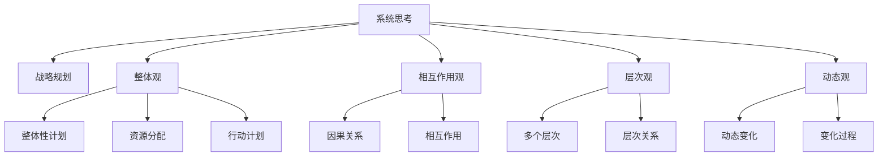

                 

## 1. 背景介绍

### 1.1 问题由来
在当今快速变化的商业环境中，企业面临着前所未有的挑战和机遇。如何在复杂的市场环境下制定出有效的战略规划，以实现长期目标和短期目标的平衡，成为了企业管理者的重要课题。系统思考（Systems Thinking）作为一种全面的思考方式，能够帮助管理者从系统的角度出发，理解并应对复杂系统的行为和影响。

### 1.2 问题核心关键点
系统思考的核心在于理解系统各部分之间的相互联系和相互作用，以及这些联系如何影响系统的整体行为。其核心原则包括整体观、相互作用观、层次观和动态观。通过系统思考，管理者可以更加全面地了解企业的运营情况，识别潜在风险和机遇，从而制定出更加科学、合理的战略规划。

## 2. 核心概念与联系

### 2.1 核心概念概述

为更好地理解系统思考在战略规划中的应用，本节将介绍几个密切相关的核心概念：

- **系统思考(Systems Thinking)**：一种从整体和相互作用的角度出发，全面理解复杂系统行为和影响的思考方式。系统思考强调整体观、相互作用观、层次观和动态观，旨在揭示系统各部分之间的联系和相互作用，以及这些联系如何影响系统的整体行为。

- **战略规划(Strategic Planning)**：企业为了实现长期目标和短期目标的平衡，制定出的整体性计划和部署。战略规划涉及企业愿景、目标、资源分配、行动计划等多个方面，旨在引导企业朝着预定的方向发展。

- **整体观(Holistic View)**：系统思考的核心理念之一，强调将系统看作一个整体，而不是简单地关注系统各部分的功能和行为。整体观要求从全局的角度理解系统的行为和影响，识别系统各部分之间的相互作用和依赖关系。

- **相互作用观(Interaction View)**：系统思考的另一重要原则，强调系统各部分之间的相互作用和影响。相互作用观要求理解系统各部分之间的因果关系，以及这些关系如何影响系统的整体行为。

- **层次观(Layered View)**：系统思考的另一个关键原则，强调系统由多个层次构成，每个层次都有其独特的功能和作用。层次观要求从多个层次分析系统行为，识别不同层次之间的相互作用和依赖关系。

- **动态观(Dynamic View)**：系统思考的重要原则之一，强调系统是动态变化的，而不是静态不变的。动态观要求理解系统的变化过程，识别影响系统动态变化的关键因素。

这些核心概念之间的逻辑关系可以通过以下Mermaid流程图来展示：



这个流程图展示了一系列与系统思考相关的核心概念及其之间的关系：

1. 系统思考指导战略规划。
2. 系统思考包括整体观、相互作用观、层次观和动态观。
3. 这些概念在战略规划中分别对应整体性计划、资源分配、行动计划、因果关系、相互作用、多个层次、层次关系和动态变化。

通过理解这些核心概念，我们可以更好地把握系统思考在战略规划中的作用和应用方法。

## 3. 核心算法原理 & 具体操作步骤
### 3.1 算法原理概述

系统思考在战略规划中的应用，本质上是一种全面、系统化的思考和决策方式。其核心思想是：将企业看作一个复杂的系统，通过理解系统的整体性、相互作用、层次性和动态性，识别系统各部分之间的联系和依赖关系，从而制定出更加科学、合理的战略规划。

具体来说，系统思考在战略规划中的主要步骤如下：

1. **整体观**：识别系统各部分之间的整体关系，从全局角度理解系统的行为和影响。
2. **相互作用观**：理解系统各部分之间的相互作用和因果关系，识别关键影响因素。
3. **层次观**：从多个层次分析系统行为，识别不同层次之间的相互作用和依赖关系。
4. **动态观**：理解系统的动态变化过程，识别影响系统动态变化的关键因素。

### 3.2 算法步骤详解

以下详细介绍系统思考在战略规划中的应用步骤：

**Step 1: 收集和分析数据**
- 收集企业的运营数据，包括财务数据、市场数据、生产数据、员工数据等。
- 使用系统思维工具（如因果图、系统动力学模型等）分析数据，识别系统各部分之间的联系和相互作用。

**Step 2: 建立系统模型**
- 使用系统思维工具建立系统的模型，描述系统的整体性、相互作用、层次性和动态性。
- 模型应包括系统的各个部分、各部分之间的相互作用、系统的整体行为和动态变化过程。

**Step 3: 识别关键因素**
- 通过系统模型识别系统的关键因素，包括输入、输出、反馈机制等。
- 识别影响系统动态变化的关键因素，如市场变化、技术创新、员工行为等。

**Step 4: 制定战略规划**
- 根据系统模型和关键因素，制定系统的战略规划。
- 战略规划应包括系统的整体目标、资源分配、行动计划等，确保系统各部分之间协调一致。

**Step 5: 实施和监控**
- 实施战略规划，并使用系统思维工具监控系统的行为和变化。
- 根据监控结果，及时调整战略规划，确保系统朝着预定目标发展。

### 3.3 算法优缺点

系统思考在战略规划中的应用具有以下优点：
1. 全面性：系统思考从整体和相互作用的角度出发，能够全面理解系统的行为和影响，避免局部视角的片面性。
2. 系统性：系统思考强调系统的整体性和各部分之间的相互作用，能够识别系统的关键因素和依赖关系，制定出更加科学合理的战略规划。
3. 动态性：系统思考理解系统的动态变化过程，能够及时识别和应对系统动态变化，保持战略规划的灵活性和适应性。

同时，该方法也存在一定的局限性：
1. 复杂性：系统思考涉及多个层次和相互作用，需要较高的分析能力和系统思维工具的使用技巧。
2. 数据依赖：系统思考依赖于准确的数据收集和分析，数据的准确性和完整性直接影响系统的理解和预测。
3. 执行难度：系统思考的实施和监控需要耗费大量时间和资源，可能存在执行难度较大的问题。

尽管存在这些局限性，但就目前而言，系统思考已成为战略规划中不可或缺的重要工具，其全面性和系统性使其在制定战略规划时具有显著优势。未来相关研究的重点在于如何进一步提高系统思考的易用性和可操作性，降低其复杂性，以更好地服务于企业战略规划。

### 3.4 算法应用领域

系统思考在战略规划中的应用已经得到了广泛的应用，覆盖了几乎所有战略规划的领域，例如：

- **市场营销战略**：通过系统思考识别市场需求、竞争环境和消费者行为，制定出具有市场竞争力的营销策略。
- **人力资源战略**：使用系统思维工具分析员工行为和组织结构，制定出合理的人才吸引、培养和激励策略。
- **研发战略**：识别技术发展趋势和市场需求，制定出具有前瞻性的研发战略和创新方向。
- **供应链战略**：理解供应链各环节的相互作用和依赖关系，制定出高效、灵活的供应链管理策略。
- **环境战略**：通过系统思维工具识别环境影响因素，制定出符合可持续发展目标的环保战略。

除了上述这些经典领域外，系统思考也被创新性地应用到更多场景中，如风险管理、资本运作、品牌管理等，为战略规划提供了新的视角和方法。

## 4. 数学模型和公式 & 详细讲解 & 举例说明

### 4.1 数学模型构建

系统思考在战略规划中的应用，并不依赖复杂的数学模型，而是依赖系统的整体性、相互作用、层次性和动态性理解。但为了更好地展示系统思考的应用，以下将介绍一个简单的系统动力学模型，用于说明系统思考的应用。

假设企业生产过程由多个部分构成，包括原材料采购、生产、仓储、销售等。系统动力学模型可以使用系统动力学软件（如Vensim、AnyLogic等）进行构建。

**Step 1: 定义系统变量**
- 原材料库存量
- 在制品库存量
- 成品库存量
- 销售量
- 采购量

**Step 2: 建立系统方程**
- 原材料库存量 = 上期原材料库存量 + 采购量 - 生产量
- 在制品库存量 = 上期在制品库存量 + 生产量 - 成品量
- 成品库存量 = 上期成品库存量 + 生产量 - 销售量
- 销售量 = 市场趋势 + 促销活动 + 渠道策略

**Step 3: 建立反馈机制**
- 原材料库存量影响采购量
- 在制品库存量影响生产量
- 成品库存量影响销售量

通过系统动力学模型，可以全面理解企业的生产过程，识别影响系统动态变化的关键因素，从而制定出更加科学合理的生产战略。

### 4.2 公式推导过程

以下以简单的系统动力学模型为例，展示系统思考在战略规划中的应用：

**Step 1: 定义变量**
- 原材料库存量 $S_{原材料}$ 
- 在制品库存量 $S_{在制品}$
- 成品库存量 $S_{成品}$
- 销售量 $Q_{销售}$
- 采购量 $Q_{采购}$

**Step 2: 建立方程**
- 原材料库存量 $S_{原材料}(n+1) = S_{原材料}(n) + Q_{采购} - \text{生产量}(n)$
- 在制品库存量 $S_{在制品}(n+1) = S_{在制品}(n) + \text{生产量}(n) - S_{成品}(n)$
- 成品库存量 $S_{成品}(n+1) = S_{成品}(n) + \text{生产量}(n) - Q_{销售}(n)$
- 销售量 $Q_{销售}(n+1) = Q_{销售}(n) + \text{市场趋势} + \text{促销活动} + \text{渠道策略}$

**Step 3: 建立反馈机制**
- $Q_{采购} = \text{原材料库存量} + \text{安全库存量}$
- $\text{生产量} = \text{需求量} + \text{生产计划}$

通过以上方程和反馈机制，可以全面理解企业的生产过程，识别影响系统动态变化的关键因素，从而制定出更加科学合理的生产战略。

### 4.3 案例分析与讲解

以下以一家制造企业的生产过程为例，展示系统思考在战略规划中的应用：

**案例背景**：一家制造企业生产某种产品，包括原材料采购、生产、仓储、销售等多个环节。企业希望通过系统思考，制定出科学合理的生产战略。

**Step 1: 收集和分析数据**
- 收集企业的生产数据，包括原材料库存量、在制品库存量、成品库存量、销售量等。
- 分析数据，识别系统各部分之间的联系和相互作用。

**Step 2: 建立系统模型**
- 使用系统动力学软件建立系统的模型，描述系统的整体性、相互作用、层次性和动态性。
- 模型应包括原材料采购、生产、仓储、销售等各个环节，以及各环节之间的相互作用和依赖关系。

**Step 3: 识别关键因素**
- 通过系统模型识别系统的关键因素，包括原材料采购量、生产计划、市场需求、促销活动等。
- 识别影响系统动态变化的关键因素，如市场需求变化、原材料供应波动、生产设备故障等。

**Step 4: 制定战略规划**
- 根据系统模型和关键因素，制定出科学合理的生产战略。
- 战略规划应包括原材料采购计划、生产计划、库存管理、销售策略等。

**Step 5: 实施和监控**
- 实施战略规划，并使用系统动力学软件监控系统的行为和变化。
- 根据监控结果，及时调整战略规划，确保系统朝着预定目标发展。

通过系统思考的应用，企业可以更加全面、系统地理解生产过程，识别关键因素和依赖关系，制定出科学合理的生产战略，提高企业的生产效率和市场竞争力。

## 5. 项目实践：代码实例和详细解释说明
### 5.1 开发环境搭建

在进行系统思考在战略规划中的应用实践前，我们需要准备好开发环境。以下是使用Python进行系统动力学建模的环境配置流程：

1. 安装Anaconda：从官网下载并安装Anaconda，用于创建独立的Python环境。

2. 创建并激活虚拟环境：
```bash
conda create -n system dynamics python=3.8 
conda activate system dynamics
```

3. 安装Vensim：
```bash
conda install vensim
```

4. 安装其他必要工具：
```bash
pip install pandas numpy matplotlib seaborn
```

完成上述步骤后，即可在`system dynamics`环境中开始系统动力学建模实践。

### 5.2 源代码详细实现

这里我们以一个简单的生产过程系统动力学模型为例，给出使用Python进行系统动力学建模的代码实现。

首先，定义系统变量和方程：

```python
from vensim import Vensim

# 定义系统变量
S原材料 = Vensim.Var('S原材料', '原材料库存量')
S在制品 = Vensim.Var('S在制品', '在制品库存量')
S成品 = Vensim.Var('S成品', '成品库存量')
Q销售 = Vensim.Var('Q销售', '销售量')
Q采购 = Vensim.Var('Q采购', '采购量')

# 建立系统方程
S原材料 = S原材料 + Q采购 - 生产量
S在制品 = S在制品 + 生产量 - S成品
S成品 = S成品 + 生产量 - Q销售
Q销售 = Q销售 + 市场趋势 + 促销活动 + 渠道策略
Q采购 = S原材料 + 安全库存量
生产量 = 需求量 + 生产计划

# 定义参数
需求量 = 5000
市场趋势 = 0.05
促销活动 = 1000
渠道策略 = 500
安全库存量 = 1000
生产计划 = 2000
```

接着，使用Vensim软件进行系统动力学模型的搭建和仿真：

1. 打开Vensim软件，选择"New Project"新建项目。
2. 在"Simplify"模式下，定义系统变量和方程。
3. 在"Diagram"视图中，绘制系统的因果关系图。
4. 在"Simulation"视图中，设置仿真参数和初始值。
5. 运行仿真，观察系统行为。

最后，展示系统仿真结果：

```python
# 仿真设置
时间步长 = 10
仿真周期 = 100
仿真输出文件 = 'system_dynamics_model.csv'

# 运行仿真
Vensim.Solver.solve(time = 时间步长, max_steps = 仿真周期, output = 仿真输出文件)
```

### 5.3 代码解读与分析

让我们再详细解读一下关键代码的实现细节：

**变量定义**：
- 使用`Vensim.Var()`定义系统变量，包括原材料库存量、在制品库存量、成品库存量、销售量、采购量等。

**方程定义**：
- 定义系统的方程，描述原材料采购、生产、仓储、销售等环节的相互关系。
- 使用Vensim提供的方程功能，如`=`, `+`, `-`等，建立方程关系。

**参数设置**：
- 设置系统的参数，如需求量、市场趋势、促销活动、渠道策略、安全库存量、生产计划等。
- 参数设置直接影响系统的行为和结果。

**仿真设置**：
- 定义仿真时间步长、仿真周期和仿真输出文件。
- 使用Vensim的`solve()`函数，设置仿真参数，运行仿真。

通过Vensim软件，可以更加直观地理解系统各部分之间的相互作用和影响，通过仿真模拟系统行为，从而制定出更加科学合理的生产战略。

## 6. 实际应用场景
### 6.1 智能制造

系统思考在智能制造中的应用，通过全面理解生产系统的整体性和动态变化，优化生产过程，提高生产效率和质量。

**应用场景**：一家汽车制造企业，通过系统思考优化生产流程，减少生产过程中的浪费，提高生产效率和质量。

**实现方法**：
1. 收集生产过程中的数据，包括原材料库存量、在制品库存量、成品库存量、生产设备利用率等。
2. 使用系统思考工具建立系统的模型，描述生产过程的各个环节和相互关系。
3. 识别影响生产动态变化的关键因素，如市场需求、原材料供应、设备故障等。
4. 根据系统模型和关键因素，制定出科学合理的生产战略。
5. 实施战略规划，并使用系统思考工具监控生产行为和变化，及时调整战略规划。

通过系统思考的应用，汽车制造企业可以全面理解生产过程，识别关键因素和依赖关系，制定出科学合理的生产战略，提高生产效率和质量，降低生产成本。

### 6.2 智能供应链

系统思考在智能供应链中的应用，通过全面理解供应链各环节的相互作用和动态变化，优化供应链管理，提高供应链的效率和稳定性。

**应用场景**：一家电商平台，通过系统思考优化供应链管理，确保商品供应的及时性和稳定性。

**实现方法**：
1. 收集供应链各环节的数据，包括原材料采购、生产、仓储、销售等环节的库存量、需求量、生产计划、运输时间等。
2. 使用系统思考工具建立供应链系统的模型，描述供应链各环节的相互关系和动态变化。
3. 识别影响供应链动态变化的关键因素，如市场需求、原材料供应、物流瓶颈等。
4. 根据系统模型和关键因素，制定出科学合理的供应链战略。
5. 实施战略规划，并使用系统思考工具监控供应链行为和变化，及时调整战略规划。

通过系统思考的应用，电商平台可以全面理解供应链各环节的相互作用和依赖关系，制定出科学合理的供应链战略，提高供应链的效率和稳定性，降低供应链成本，提高客户满意度。

### 6.3 智能投资

系统思考在智能投资中的应用，通过全面理解市场环境、投资行为和动态变化，优化投资决策，提高投资回报率。

**应用场景**：一家投资公司，通过系统思考优化投资决策，降低投资风险，提高投资回报率。

**实现方法**：
1. 收集市场环境、投资行为和动态变化的数据，包括股票价格、市场趋势、投资策略等。
2. 使用系统思考工具建立投资系统的模型，描述市场环境、投资行为和动态变化的关系。
3. 识别影响投资动态变化的关键因素，如市场趋势、政策变化、公司业绩等。
4. 根据系统模型和关键因素，制定出科学合理的投资战略。
5. 实施战略规划，并使用系统思考工具监控投资行为和变化，及时调整战略规划。

通过系统思考的应用，投资公司可以全面理解市场环境、投资行为和动态变化，制定出科学合理的投资战略，降低投资风险，提高投资回报率，优化资产配置，提高投资效率。

### 6.4 未来应用展望

随着系统思考在企业中的应用日益广泛，未来将在更多领域得到应用，为企业的战略规划提供新的思路和方法。

**展望方向**：
1. 在智能制造、智能供应链、智能投资等领域，系统思考的应用将进一步深入，推动各行业向智能化、自动化方向发展。
2. 在医疗、金融、教育等行业，系统思考的应用将帮助企业更好地理解和应对复杂的系统行为和影响，优化运营效率和决策质量。
3. 在政府和企业合作中，系统思考的应用将帮助政府和企业共同制定出更加科学合理的政策规划和发展战略。

系统思考的应用将为企业带来更加全面、系统、动态的视角，帮助企业更好地理解和应对复杂系统的行为和影响，制定出更加科学合理的战略规划。相信在未来，系统思考将为企业的发展带来更加广阔的前景和更多可能。

## 7. 工具和资源推荐
### 7.1 学习资源推荐

为了帮助开发者系统掌握系统思考的理论基础和应用技巧，这里推荐一些优质的学习资源：

1. 《系统思考：改变世界的基础》（The Systems Thinking Web）：提供系统思考的全面介绍和实践指南，涵盖系统思考的核心概念、方法论和应用案例。
2. 《系统动力学建模与仿真》（System Dynamics Modeling and Simulation）：详细介绍系统动力学模型的构建和仿真方法，提供丰富的案例分析和实际应用。
3. Coursera系统动力学课程：斯坦福大学开设的系统动力学课程，涵盖系统思考的基本原理和方法，适合初学者学习。
4. MIT系统动力学建模课程：麻省理工学院开设的系统动力学建模课程，涵盖系统思考的高级应用和实践技巧，适合进阶学习。

通过对这些资源的学习实践，相信你一定能够快速掌握系统思考的精髓，并应用于实际问题解决中。

### 7.2 开发工具推荐

高效的开发离不开优秀的工具支持。以下是几款用于系统动力学建模和仿真的常用工具：

1. Vensim：系统动力学软件，支持复杂的系统建模和仿真分析，适合企业级的应用需求。
2. AnyLogic：系统动力学建模和仿真软件，支持多线程模拟和动态仿真，适合复杂系统的分析和优化。
3. Simulink：MATLAB提供的系统仿真软件，支持离散和连续系统的建模和仿真分析，适合科学研究和技术开发。
4. VisSim：系统动力学建模和仿真软件，支持图形化建模和仿真分析，适合教学和入门学习。
5. Arena：离散事件仿真软件，支持流程建模和仿真分析，适合物流、制造等领域的系统优化。

合理利用这些工具，可以显著提升系统动力学建模和仿真的开发效率，快速迭代和优化系统思考的实践应用。

### 7.3 相关论文推荐

系统思考在战略规划中的应用受到了学界的广泛关注，以下是几篇奠基性的相关论文，推荐阅读：

1. "Systems Thinking in Action: A Guide to Getting Started"（系统思考在行动：一个开始指南）：提供了系统思考的全面介绍和实践方法，适合初学者学习。
2. "System Dynamics: A Handbook for Research, Policy and Management"（系统动力学手册：研究、政策和管理）：提供了系统动力学建模和仿真的详细介绍和案例分析，适合进阶学习。
3. "Strategic Planning Using System Dynamics"（使用系统动力学进行战略规划）：介绍如何使用系统动力学工具进行战略规划，适合企业管理者学习。
4. "Complexity and the Organization"（复杂性和组织）：分析了系统思考在组织管理中的应用，适合研究者学习。
5. "Learning with System Dynamics"（使用系统动力学进行学习）：介绍了系统思考在教育和学习中的应用，适合教育工作者学习。

这些论文代表了大系统思考理论的发展脉络，通过学习这些前沿成果，可以帮助研究者把握学科前进方向，激发更多的创新灵感。

## 8. 总结：未来发展趋势与挑战
### 8.1 总结

本文对系统思考在战略规划中的应用进行了全面系统的介绍。首先阐述了系统思考的基本概念和核心原则，明确了其在战略规划中的重要价值。其次，从原理到实践，详细讲解了系统思考在战略规划中的应用步骤，给出了系统动力学建模的代码实例。同时，本文还广泛探讨了系统思考在多个行业领域的应用前景，展示了其巨大的应用潜力。最后，本文精选了系统思考的学习资源，力求为读者提供全方位的技术指引。

通过本文的系统梳理，可以看到，系统思考在战略规划中的应用已经取得了显著成效，成为企业战略规划的重要工具。全面、系统、动态的视角帮助企业更好地理解和应对复杂系统行为，制定出更加科学合理的战略规划，提升企业的运营效率和决策质量。未来，随着系统思考的不断发展和应用，相信其将在更多领域得到应用，为企业的发展带来更加广阔的前景和更多可能。

### 8.2 未来发展趋势

展望未来，系统思考在战略规划中的应用将呈现以下几个发展趋势：

1. **技术进步**：系统动力学模型的构建和仿真技术将不断进步，新的工具和方法将进一步提升系统思考的易用性和可操作性。
2. **跨领域应用**：系统思考将逐步扩展到更多领域，如医疗、金融、教育、政府等，为企业提供更加全面的系统视角和决策支持。
3. **深度学习融合**：系统思考将与深度学习等前沿技术进行更深入的融合，形成更加全面、系统的分析和优化方法。
4. **人工智能结合**：系统思考将与人工智能技术进行更紧密的结合，形成更加智能化、自动化的系统思考工具，提升系统思考的应用效果。
5. **可持续发展**：系统思考将更加注重可持续发展目标，帮助企业在追求经济效益的同时，兼顾环境保护和社会责任。

这些趋势凸显了系统思考的广阔前景，将进一步推动其在战略规划中的应用和发展。系统思考的应用将为企业带来更加全面、系统、动态的视角，帮助企业更好地理解和应对复杂系统的行为和影响，制定出更加科学合理的战略规划。

### 8.3 面临的挑战

尽管系统思考在战略规划中的应用取得了显著成效，但在迈向更加智能化、普适化应用的过程中，它仍面临着诸多挑战：

1. **复杂性**：系统思考涉及多个层次和相互作用，需要较高的分析能力和系统思维工具的使用技巧。
2. **数据依赖**：系统思考依赖于准确的数据收集和分析，数据的准确性和完整性直接影响系统的理解和预测。
3. **执行难度**：系统思考的实施和监控需要耗费大量时间和资源，可能存在执行难度较大的问题。
4. **跨学科融合**：系统思考涉及多个学科领域，如系统动力学、统计学、经济学等，跨学科的融合和协作难度较大。
5. **知识更新**：系统思考的理论与实践不断发展，需要不断更新知识，跟上最新的研究进展。

尽管存在这些挑战，但通过不断探索和实践，相信系统思考的应用将不断突破，为企业带来更加全面、系统、动态的视角，帮助企业更好地理解和应对复杂系统的行为和影响，制定出更加科学合理的战略规划。

### 8.4 研究展望

未来，系统思考的研究方向可以从以下几个方面寻求新的突破：

1. **跨学科融合**：系统思考将与更多学科进行融合，形成更加全面、系统的分析和优化方法。
2. **人工智能结合**：系统思考将与人工智能技术进行更紧密的结合，形成更加智能化、自动化的系统思考工具，提升系统思考的应用效果。
3. **可持续发展**：系统思考将更加注重可持续发展目标，帮助企业在追求经济效益的同时，兼顾环境保护和社会责任。
4. **新技术应用**：系统思考将结合新的技术手段，如区块链、物联网、大数据等，形成更加全面、系统的分析和优化方法。

这些研究方向将引领系统思考理论的进步，为企业的战略规划带来新的突破。系统思考的应用将为企业带来更加全面、系统、动态的视角，帮助企业更好地理解和应对复杂系统的行为和影响，制定出更加科学合理的战略规划。

## 9. 附录：常见问题与解答

**Q1: 系统思考的核心理念是什么？**

A: 系统思考的核心理念包括整体观、相互作用观、层次观和动态观。整体观强调将系统看作一个整体，相互作用观强调系统各部分之间的相互作用和因果关系，层次观强调系统由多个层次构成，动态观强调系统是动态变化的。

**Q2: 系统思考和系统动力学有什么区别？**

A: 系统思考是一种全面的思考方式，从整体和相互作用的角度出发，理解复杂系统的行为和影响。系统动力学则是基于系统思考的理论，使用系统动力学模型进行定量分析和仿真的一种方法。

**Q3: 系统思考在战略规划中的应用步骤是什么？**

A: 系统思考在战略规划中的应用步骤包括：
1. 收集和分析数据
2. 建立系统模型
3. 识别关键因素
4. 制定战略规划
5. 实施和监控

**Q4: 系统动力学模型和系统思考有什么关系？**

A: 系统动力学模型是基于系统思考的理论，使用系统动力学软件进行定量分析和仿真的一种方法。系统动力学模型可以帮助企业全面理解系统的行为和影响，识别关键因素和依赖关系，制定出科学合理的战略规划。

**Q5: 系统思考和复杂性科学有什么区别？**

A: 系统思考是一种全面的思考方式，从整体和相互作用的角度出发，理解复杂系统的行为和影响。而复杂性科学则是研究复杂系统的科学，涉及复杂系统的理论、方法和应用。虽然系统思考和复杂性科学有交集，但系统思考更加关注实践应用，而复杂性科学更多地关注理论研究。

通过对这些问题的解答，可以看到系统思考在战略规划中的核心思想和方法，以及其在企业应用中的广泛价值。相信系统思考将为企业的发展带来更加全面、系统、动态的视角，帮助企业更好地理解和应对复杂系统的行为和影响，制定出更加科学合理的战略规划。

