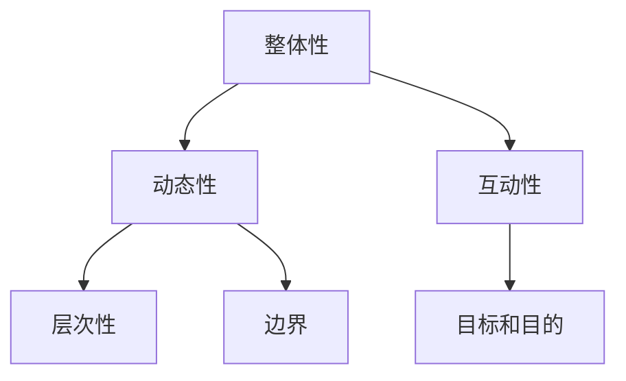

                 

# 系统思考对于管理复杂项目的重要性

> 关键词：系统思考,复杂系统,项目管理,软件开发,创新管理

## 1. 背景介绍

### 1.1 问题由来
在当今这个快速变化和高度互联的世界中，复杂项目在各个行业中变得越来越普遍。这些项目可能涉及多个组织、多个领域、多个国家、多个时间尺度和多个利益相关者。例如，一个新产品的开发项目可能包括从市场研究、需求分析、设计、编码、测试到发布的全过程，跨越了多个部门和多个层级。这些项目的复杂性使得传统的管理方法无法适应，因此需要更系统、更全面、更灵活的管理方法。

### 1.2 问题核心关键点
系统思考（Systems Thinking）是一种强调系统整体性的管理方法，旨在理解和改善复杂系统的行为。在项目管理的背景下，系统思考涉及对项目作为一个整体的全面理解，包括其各个组成部分及其相互关系。系统思考的核心在于其“整体性”（Holism），即认识到项目的所有组成部分都是相互关联的，而不是孤立的。

系统思考特别适用于管理复杂项目，因为它提供了一种全面、动态和互动的方法来处理项目中的各种因素。它有助于识别项目中的关键瓶颈、风险和机遇，并指导决策者采取行动，以优化项目绩效。

## 2. 核心概念与联系

### 2.1 核心概念概述

系统思考涉及以下几个核心概念：

- **整体性**（Holism）：系统思考强调系统各组成部分之间的相互关系和依赖，而不是孤立地看待每个部分。
- **动态性**（Dynamics）：系统思考认识到系统是不断变化的，需要动态地理解和适应这种变化。
- **互动性**（Interactivity）：系统中的各个部分是相互作用的，系统思考强调这种互动关系。
- **层次性**（Hierarchy）：系统可以分解为多个层次，从宏观到微观，每层都有其独特的属性和行为。
- **边界**（Boundaries）：系统与其环境之间存在边界，这些边界定义了系统的输入和输出。
- **目标和目的**（Goals and Purposes）：系统有其独特的目标和目的，这些目标和目的可能与环境的目标和目的不同。

这些概念通过以下Mermaid流程图连接起来，展示了系统思考的各个要素及其相互作用：



这个图表展示了一个系统思考的基本框架，其中各个概念相互依赖，共同构成了对复杂项目的全面理解。

## 3. 核心算法原理 & 具体操作步骤

### 3.1 算法原理概述

系统思考的核心算法原理是“整体-部分”（Holistic-Particular）模型。该模型认为系统是由一系列相互关联的部分组成的，这些部分共同作用形成一个整体。通过对系统的整体理解，可以更好地理解其各个部分的行为和相互作用。

在项目管理中，系统思考的应用包括以下几个步骤：

1. **系统建模**：建立系统的图形化模型，识别系统中的关键组成部分和它们之间的关系。
2. **系统分析**：分析系统模型，识别系统中的瓶颈、风险和机遇。
3. **系统优化**：设计优化策略，改善系统的整体性能。
4. **实施和监控**：实施优化策略，并持续监控系统的表现，以确保其按预期运行。

### 3.2 算法步骤详解

**步骤1：系统建模**

1. **收集信息**：收集与项目相关的所有信息，包括需求、资源、时间表、风险、利益相关者等。
2. **识别组成部分**：识别项目的各个组成部分，并列出它们的关键属性和行为。
3. **建立关系图**：建立各个组成部分之间的相互关系图，包括输入、输出、交互和依赖。

**步骤2：系统分析**

1. **识别瓶颈**：通过系统建模，识别系统中的瓶颈和潜在问题。
2. **评估风险**：评估系统中的风险，包括技术、资源、时间等方面的风险。
3. **识别机遇**：识别系统中的潜在机遇，如新的技术、市场趋势或合作伙伴关系。

**步骤3：系统优化**

1. **设计优化策略**：基于系统分析的结果，设计优化策略，如重新分配资源、调整时间表或改变利益相关者关系。
2. **实施策略**：实施优化策略，并对项目进行调整。
3. **监控和反馈**：持续监控系统的表现，收集反馈，并根据需要进行调整。

**步骤4：实施和监控**

1. **实施优化策略**：将优化策略应用到项目中，并对项目进行调整。
2. **持续监控**：持续监控系统的表现，收集反馈，并根据需要进行调整。
3. **优化循环**：根据监控结果和反馈，不断优化系统，直到达到预期目标。

### 3.3 算法优缺点

系统思考在管理复杂项目中具有以下优点：

- **全面性**：系统思考提供了对项目整体性的全面理解，超越了传统管理方法的局部视角。
- **动态性**：系统思考认识到项目是动态的，能够适应变化的环境和需求。
- **互动性**：系统思考强调项目中各部分之间的相互作用，能够更有效地协调和整合资源。

然而，系统思考也存在一些缺点：

- **复杂性**：系统思考需要复杂的建模和分析，对初学者和缺乏经验的管理者来说，可能过于复杂。
- **实施难度**：系统思考的实施需要高度的协调和沟通，可能面临组织和文化上的阻力。
- **资源需求**：系统思考的实施需要大量的资源和时间，包括时间、金钱和专业知识。

### 3.4 算法应用领域

系统思考在以下领域具有广泛的应用：

- **软件开发**：系统思考有助于识别软件项目中的关键瓶颈和风险，优化软件架构和设计。
- **项目管理**：系统思考提供了一种全面、动态和互动的方法来管理复杂的项目，协调和整合项目中的各个组成部分。
- **创新管理**：系统思考可以帮助企业识别新的市场机遇和创新点，优化产品和服务的设计。
- **风险管理**：系统思考提供了一种识别和管理项目风险的全面方法，确保项目按预期运行。

## 4. 数学模型和公式 & 详细讲解 & 举例说明

### 4.1 数学模型构建

系统思考的数学模型通常是通过系统动力学模型（System Dynamics Model）构建的。系统动力学模型是一种动态建模方法，用于模拟和分析复杂系统的行为。它通常使用差分方程来描述系统各部分之间的相互作用和依赖关系。

例如，考虑一个生产系统的系统动力学模型，可以使用以下差分方程来描述：

$$
\dot{x} = f(x, y)
$$

其中 $x$ 和 $y$ 分别代表系统的状态变量和输入变量，$f(x, y)$ 是描述系统行为的动力学函数。

### 4.2 公式推导过程

系统动力学模型的推导过程通常包括以下几个步骤：

1. **定义状态变量**：定义系统的状态变量，代表系统的关键属性和行为。
2. **建立动力学方程**：基于系统各部分之间的相互作用，建立动力学方程，描述系统行为。
3. **求解动力学方程**：使用数值方法或仿真工具，求解动力学方程，预测系统行为。
4. **分析和优化**：基于仿真结果，分析和优化系统行为，提出改进策略。

例如，考虑一个简单的生产系统的动力学模型：

$$
\dot{I} = D - S
$$

其中 $I$ 表示库存水平，$D$ 表示需求量，$S$ 表示生产量。通过求解这个方程，可以预测库存水平的变化，并识别库存管理中的瓶颈和机遇。

### 4.3 案例分析与讲解

考虑一个软件开发项目的系统思考应用案例。假设项目涉及多个团队、多个技术和多个时间尺度。项目的关键组成部分包括需求分析、设计、编码、测试和发布。

**步骤1：系统建模**

1. **收集信息**：收集与项目相关的所有信息，包括需求、资源、时间表、风险和利益相关者等。
2. **识别组成部分**：识别项目的关键组成部分，并列出它们的关键属性和行为。例如，需求分析需要专家知识，设计需要时间，编码需要资源，测试需要反馈，发布需要市场评估。
3. **建立关系图**：建立各个组成部分之间的相互关系图，包括输入、输出、交互和依赖。例如，需求分析输出设计输入，设计输出编码输入，编码输出测试输入等。

**步骤2：系统分析**

1. **识别瓶颈**：通过系统建模，识别项目中的瓶颈和潜在问题。例如，需求分析可能成为项目进展的瓶颈，因为需要专家的深度参与。
2. **评估风险**：评估项目中的风险，包括技术、资源、时间等方面的风险。例如，技术变化可能导致编码和测试难度增加。
3. **识别机遇**：识别项目中的潜在机遇，如新的技术、市场趋势或合作伙伴关系。例如，新的自动化工具可以提高编码和测试效率。

**步骤3：系统优化**

1. **设计优化策略**：基于系统分析的结果，设计优化策略，如重新分配资源、调整时间表或改变利益相关者关系。例如，增加需求分析的资源，缩短设计周期。
2. **实施策略**：实施优化策略，并对项目进行调整。例如，引入自动化工具，加速编码和测试过程。
3. **监控和反馈**：持续监控项目的表现，收集反馈，并根据需要进行调整。例如，定期评估项目进展，调整时间表和资源分配。

**步骤4：实施和监控**

1. **实施优化策略**：将优化策略应用到项目中，并对项目进行调整。例如，引入新的需求分析方法，提高需求理解的准确性。
2. **持续监控**：持续监控项目的表现，收集反馈，并根据需要进行调整。例如，通过定期的会议和报告，确保项目按预期进行。
3. **优化循环**：根据监控结果和反馈，不断优化项目，直到达到预期目标。例如，通过持续改进，提高项目质量和效率。

## 5. 项目实践：代码实例和详细解释说明

### 5.1 开发环境搭建

在进行系统思考的实践前，我们需要准备好开发环境。以下是使用Python进行系统动力学建模的环境配置流程：

1. **安装Python**：从官网下载并安装Python，选择3.x版本。
2. **安装系统动力学库**：使用pip安装system dynamics相关的库，如PySD、Vensim等。例如，

```bash
pip install pySD
```

3. **准备数据**：准备项目相关的所有数据，包括需求、资源、时间表、风险、利益相关者等。
4. **编写模型代码**：根据系统动力学模型的定义，编写模型代码。

### 5.2 源代码详细实现

下面是一个简单的系统动力学模型代码示例，用于模拟一个生产系统的库存水平：

```python
from pySD import system, state, equations

# 定义状态变量
inventory = state('inventory')

# 建立动力学方程
equations({
    'dI': 'D - S',
    'D': 10,  # 每天需求量
    'S': 5    # 每天生产量
})

# 运行模型
model = system.run()
```

### 5.3 代码解读与分析

**状态变量**：
- `inventory`：表示库存水平。

**动力学方程**：
- `dI = D - S`：库存变化率等于需求量减去生产量。
- `D = 10`：每天需求量为10。
- `S = 5`：每天生产量为5。

这个代码示例展示了如何使用Python进行系统动力学建模。通过定义状态变量和动力学方程，可以预测系统行为。在实际项目中，需要根据具体需求，建立更复杂的模型，并使用数值方法或仿真工具进行求解。

### 5.4 运行结果展示

运行上述代码，可以模拟生产系统的库存水平变化。通过可视化工具，可以展示库存水平随时间的变化趋势，并识别库存管理中的瓶颈和机遇。

## 6. 实际应用场景

### 6.1 智能制造系统

智能制造系统涉及复杂的供应链、生产流程和质量控制。通过系统思考，可以识别系统中的瓶颈和潜在问题，优化生产流程，提高生产效率和质量。

在实际应用中，可以将智能制造系统分解为多个组成部分，如原材料采购、生产调度、质量检测和物流管理。通过系统建模，可以识别系统中的关键瓶颈和风险，优化生产计划和资源分配，提高生产效率和质量。

### 6.2 城市交通系统

城市交通系统涉及多个组成部分，如道路、公共交通、自行车和步行。通过系统思考，可以优化交通流量，减少交通拥堵，提高出行效率。

在实际应用中，可以将城市交通系统分解为多个组成部分，如交通流量、交通信号、公共交通和自行车道。通过系统建模，可以识别系统中的瓶颈和潜在问题，优化交通信号和公交车路线，减少交通拥堵，提高出行效率。

### 6.3 金融风险管理

金融风险管理涉及复杂的市场、资产和风险因素。通过系统思考，可以识别系统中的风险和机遇，优化风险管理策略，降低风险暴露。

在实际应用中，可以将金融风险管理分解为多个组成部分，如市场风险、信用风险、操作风险和流动性风险。通过系统建模，可以识别系统中的关键瓶颈和风险，优化风险管理策略，降低风险暴露。

## 7. 工具和资源推荐

### 7.1 学习资源推荐

为了帮助开发者系统掌握系统思考的理论基础和实践技巧，这里推荐一些优质的学习资源：

1. **《系统思考导论》**：由MIT教授JonATHAN DRUMM和Linda MADIGAN合著，是一本系统思考的经典入门书籍，深入浅出地介绍了系统思考的基本原理和应用方法。
2. **《系统思考与领导力》**：由C«ESA ELIAS合著，是一本系统思考的进阶书籍，探讨了系统思考在组织变革和领导力中的应用。
3. **《系统动力学建模与分析》**：由MIT教授JANE BURTON和JOSHUA GRAHAM合著，介绍了系统动力学建模的基本方法和工具。
4. **Coursera系统思考课程**：由MIT和其它大学的教授开设的系统思考相关课程，涵盖了系统思考的基本概念和实践方法。
5. **System Dynamics Professional Online (SDPRO)**：由MIT Sloan管理学院提供，提供了系统动力学建模和分析的专业培训。

通过这些资源的学习实践，相信你一定能够系统掌握系统思考的理论基础和实践技巧，并在实际项目中灵活应用。

### 7.2 开发工具推荐

高效的开发离不开优秀的工具支持。以下是几款用于系统思考开发的常用工具：

1. **Vensim**：一个功能强大的系统动力学建模工具，支持复杂系统的建模和分析。
2. **STEPS**：一个可视化的系统动力学建模工具，支持复杂的模型构建和仿真。
3. **PySD**：一个基于Python的系统动力学建模工具，支持数值求解和可视化分析。
4. **Simio**：一个用于建模和仿真系统动力学和供应链的可视化工具。
5. **AnyLogic**：一个综合的建模和仿真工具，支持系统动力学、运筹学和离散事件仿真。

合理利用这些工具，可以显著提升系统思考的开发效率，加快创新迭代的步伐。

### 7.3 相关论文推荐

系统思考的研究源于学界的持续研究。以下是几篇奠基性的相关论文，推荐阅读：

1. **《系统思考与组织学习》**（The Systems Thinking Toolkit）：由MIT教授PETER SENGE合著，介绍了系统思考的基本原理和方法，并提供了丰富的实践案例。
2. **《系统思考与战略规划》**（Systems Thinking for Strategy）：由MIT教授Peter Senge和Linda G. represents等合著，探讨了系统思考在战略规划中的应用。
3. **《系统思考与创新》**（Systems Thinking and Innovation）：由MIT教授Peter Senge和Johannes Hoffer合著，探讨了系统思考在创新管理中的应用。

这些论文代表了大系统思考理论的发展脉络。通过学习这些前沿成果，可以帮助研究者把握学科前进方向，激发更多的创新灵感。

## 8. 总结：未来发展趋势与挑战

### 8.1 总结

本文对系统思考在复杂项目中的应用进行了全面系统的介绍。首先阐述了系统思考的背景和重要性，明确了系统思考在管理复杂项目中的独特价值。其次，从原理到实践，详细讲解了系统思考的数学模型和操作步骤，给出了系统思考任务开发的完整代码实例。同时，本文还广泛探讨了系统思考在智能制造、城市交通、金融风险管理等多个领域的应用前景，展示了系统思考范式的巨大潜力。

通过本文的系统梳理，可以看到，系统思考为复杂项目提供了全新的管理视角和方法，能够更全面、更动态、更互动地处理项目中的各种因素。相信系统思考将在更多领域得到应用，为项目管理带来新的变革性影响。

### 8.2 未来发展趋势

展望未来，系统思考将呈现以下几个发展趋势：

1. **模型自动化**：随着自动化建模工具的发展，系统思考模型的构建将更加高效和精确。
2. **数据驱动**：系统思考将更多地依赖于数据驱动的建模方法，提高模型的准确性和鲁棒性。
3. **跨学科整合**：系统思考将与其他学科的理论与方法进行更深入的融合，如运筹学、系统工程等，提供更加全面和高效的管理方法。
4. **人工智能的应用**：系统思考将与人工智能技术进行更深入的结合，利用机器学习和大数据分析技术，提升系统的预测和优化能力。
5. **可持续性**：系统思考将更加关注系统的可持续性，注重环境的保护和资源的优化。

以上趋势凸显了系统思考的广阔前景。这些方向的探索发展，必将进一步提升复杂项目管理的效果，为人类社会的发展带来深远影响。

### 8.3 面临的挑战

尽管系统思考已经取得了瞩目成就，但在迈向更加智能化、普适化应用的过程中，它仍面临着诸多挑战：

1. **复杂性**：系统思考的建模和分析过程复杂，需要高度的专业知识和技能。
2. **实施难度**：系统思考的实施需要高度的协调和沟通，可能面临组织和文化上的阻力。
3. **数据需求**：系统思考需要大量的高质量数据，这些数据的获取和处理可能存在困难。
4. **资源需求**：系统思考的实施需要大量的资源和时间，包括时间、金钱和专业知识。
5. **模型准确性**：系统模型的准确性依赖于数据的完整性和模型构建的质量，模型构建不当可能导致误导性的决策。

### 8.4 研究展望

面对系统思考面临的这些挑战，未来的研究需要在以下几个方面寻求新的突破：

1. **模型自动化**：开发自动化的系统建模工具，减少模型的构建时间和错误率。
2. **数据驱动**：探索数据驱动的系统建模方法，提高模型的准确性和鲁棒性。
3. **跨学科整合**：研究跨学科的系统建模方法，如运筹学、系统工程等，提供更加全面和高效的管理方法。
4. **人工智能的应用**：研究系统思考与人工智能技术的结合，利用机器学习和大数据分析技术，提升系统的预测和优化能力。
5. **可持续性**：研究系统思考的可持续性方法，注重环境的保护和资源的优化。

这些研究方向的探索，必将引领系统思考技术迈向更高的台阶，为复杂项目的全面、动态、互动管理提供新的解决方案。面向未来，系统思考需要与其他技术和管理方法进行更深入的融合，共同推动复杂项目管理的进步。只有勇于创新、敢于突破，才能不断拓展系统思考的边界，让系统思考更好地服务于人类的发展。

## 9. 附录：常见问题与解答

**Q1：系统思考是否适用于所有复杂项目？**

A: 系统思考适用于大多数复杂项目，特别是那些涉及多个组成部分和相互依赖的项目。但对于一些特定领域和特定项目，可能需要结合其他方法进行综合管理。

**Q2：如何选择合适的系统思考模型？**

A: 选择合适的系统思考模型需要考虑项目的规模、复杂性和目标。对于简单项目，可以使用相对简单的模型；对于复杂项目，则需要更复杂的模型。模型选择应基于项目的实际情况和需求。

**Q3：系统思考的实施过程需要哪些资源？**

A: 系统思考的实施需要高度的协调和沟通，可能面临组织和文化上的阻力。同时，需要大量的资源和时间，包括时间、金钱和专业知识。项目团队需要具备系统思考的相关知识和技能，并使用适当的工具和方法。

**Q4：系统思考的应用有哪些实际案例？**

A: 系统思考在多个领域得到了广泛应用，如智能制造、城市交通、金融风险管理等。在智能制造中，系统思考用于优化生产流程，提高生产效率和质量；在城市交通中，系统思考用于优化交通流量，减少交通拥堵；在金融风险管理中，系统思考用于识别风险和优化风险管理策略。

**Q5：系统思考的未来发展方向是什么？**

A: 系统思考的未来发展方向包括模型自动化、数据驱动、跨学科整合、人工智能的应用和可持续性。这些方向将使系统思考更加高效、精确和普适，适应更多的复杂项目管理需求。

---

作者：禅与计算机程序设计艺术 / Zen and the Art of Computer Programming

