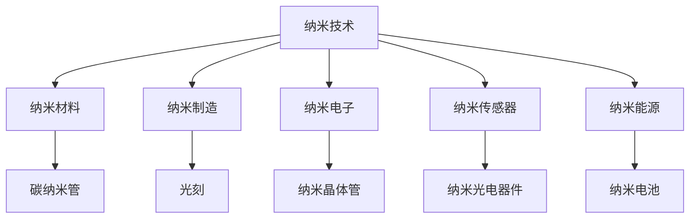

                 

# 纳米技术创业：微观世界的宏观应用

> 关键词：纳米技术, 创业, 纳米材料, 纳米制造, 纳米医学, 纳米电子, 纳米传感器, 纳米能源

## 1. 背景介绍

### 1.1 问题由来
纳米技术（Nanotechnology）是指在纳米尺度（1到100纳米）下操控和操作物质的技术，涉及材料科学、化学、物理、工程学等多个学科。纳米技术在制造、能源、医学、电子等领域展现出了广阔的应用前景。近年来，全球范围内兴起了一波纳米创业热潮，吸引了大量科研人员和资本投入。

随着技术的不断进步，纳米技术的商业化应用已逐渐从实验室走向市场。纳米创业者通过技术突破和商业模式创新，推动了纳米技术在现实世界中的应用。

### 1.2 问题核心关键点
纳米技术创业的核心问题在于如何在微观尺度下制造和操作物质，并将其转化为实际的产品和商业价值。涉及的关键点包括：

- 纳米材料的设计与合成
- 纳米制造设备的开发
- 纳米产品的商业化路径
- 纳米技术的市场推广与品牌建设
- 纳米技术创业中的伦理与安全问题

### 1.3 问题研究意义
纳米技术创业不仅能够推动科学技术进步，更能为社会带来经济和医疗等多方面的深刻变革。具体而言，研究纳米技术创业的意义包括：

- 促进新兴产业的崛起：纳米技术创业有助于培育新兴产业，解决传统产业面临的资源和环境问题。
- 提升经济竞争力：纳米产品往往具有高附加值，能够推动经济增长和就业。
- 改善医疗健康：纳米技术在药物输送、疾病诊断、医疗成像等领域的应用，能够大幅提升医疗效果。
- 保障能源安全：纳米技术在太阳能、储能等领域的应用，有助于提升能源效率和安全性。
- 促进环境可持续性：纳米技术在环境监测、污染治理等方面的应用，能够提升环境保护水平。

## 2. 核心概念与联系

### 2.1 核心概念概述

为更好地理解纳米技术创业的核心概念，本节将介绍几个密切相关的核心概念：

- 纳米技术（Nanotechnology）：涉及在纳米尺度下操纵和操作物质的技术，主要包括纳米材料、纳米制造、纳米电子、纳米生物等领域。
- 纳米材料（Nanomaterials）：指在纳米尺度下具有特殊物理化学性质的物质，如碳纳米管、石墨烯、纳米颗粒等。
- 纳米制造（Nanofabrication）：指在纳米尺度下制造和处理物质的技术，包括光刻、电子束刻蚀、分子组装等方法。
- 纳米电子（Nanoelectronics）：涉及在纳米尺度下设计和制造电子器件，如纳米晶体管、纳米存储器等。
- 纳米传感器（Nanosensors）：指在纳米尺度下制造的传感器，如纳米光电器件、纳米生物传感器等。
- 纳米能源（Nanoenergy）：指利用纳米技术提升能源效率和开发新型的能源存储、转换技术。

这些核心概念之间的逻辑关系可以通过以下Mermaid流程图来展示：



这个流程图展示了纳米技术相关的核心概念及其之间的关系：

1. 纳米技术是基础，涵盖纳米材料、制造、电子、传感器、能源等多个领域。
2. 纳米材料是纳米技术的重要组成部分，如碳纳米管、石墨烯等。
3. 纳米制造和纳米电子是实现纳米材料功能的重要手段。
4. 纳米传感器和纳米能源是纳米技术在特定应用中的具体表现。

## 3. 核心算法原理 & 具体操作步骤
### 3.1 算法原理概述

纳米技术创业的核心算法原理主要涉及纳米材料的设计与合成、纳米制造设备的开发、纳米产品的商业化路径等方面。其核心在于：

- 使用计算机模拟和优化算法，设计性能最优的纳米材料。
- 利用先进制造技术，精确控制纳米尺度下的物质形态。
- 通过市场和用户需求分析，确定纳米产品的市场定位和推广策略。

### 3.2 算法步骤详解

纳米技术创业的一般流程包括以下几个关键步骤：

**Step 1: 纳米材料设计**
- 选择合适的分子或材料作为纳米材料的前驱体。
- 使用计算机模拟和优化算法，确定最佳的设计方案。
- 使用实验室小试验证设计方案的可行性。

**Step 2: 纳米制造设备开发**
- 设计并制造出能够在纳米尺度下进行物质操控的设备。
- 优化设备的精度、稳定性和可靠性。
- 进行设备的性能测试和认证。

**Step 3: 纳米产品开发**
- 根据市场需求，确定纳米产品的功能和规格。
- 使用开发出的纳米制造设备，批量生产纳米产品。
- 进行产品的质量控制和检测。

**Step 4: 市场推广与品牌建设**
- 制定市场推广策略，包括定价、渠道、广告等。
- 建立品牌形象，提升消费者对产品的认知度和信任度。
- 收集用户反馈，不断优化产品和服务。

### 3.3 算法优缺点

纳米技术创业算法具有以下优点：

1. 精确控制：能够实现对纳米尺度下物质的高精度控制。
2. 效率高：利用先进制造技术，批量生产成本相对较低。
3. 创新性强：设计出新的纳米材料和设备，推动技术进步。
4. 应用广泛：纳米技术在多个领域都有广泛应用前景。

同时，该算法也存在以下局限性：

1. 技术门槛高：纳米技术创业需要高精度的实验设备和技术支持。
2. 研发周期长：从材料设计到产品制造再到市场推广，周期较长。
3. 风险较大：投入巨大，且不确定性高，存在失败的风险。
4. 商业化难度大：纳米产品的高附加值决定了其价格较高，市场需求有限。
5. 伦理与安全问题：纳米材料和产品可能带来环境与安全问题，需要严格监管。

### 3.4 算法应用领域

纳米技术创业算法在多个领域有广泛应用，具体包括：

- **纳米医药**：纳米药物载体、纳米诊疗设备、纳米诊断试剂等。
- **纳米电子**：纳米晶体管、纳米存储器、纳米传感器等。
- **纳米能源**：纳米电池、纳米太阳能电池、纳米超级电容器等。
- **纳米制造**：纳米加工、纳米打印、纳米组装等。
- **纳米生物**：纳米生物传感器、纳米药物递送系统、纳米生物医学成像等。

这些领域的应用不仅推动了科学技术进步，也为解决人类面临的诸多问题提供了新的途径。

## 4. 数学模型和公式 & 详细讲解  
### 4.1 数学模型构建

纳米技术创业的核心算法原理涉及大量的数学模型和公式。以下将简要介绍其中的几个关键模型：

- **分子动力学模拟**：用于预测纳米材料的热力学和动力学行为。
- **蒙特卡洛模拟**：用于优化纳米材料的结构和性质。
- **有限元分析**：用于模拟纳米制造设备的力学和应力分布。
- **统计力学**：用于理解纳米材料的相变和临界现象。

这些模型通常涉及复杂的数学公式和计算方法，需要高度专业化的知识和技术。

### 4.2 公式推导过程

这里以分子动力学模拟为例，介绍其数学模型和公式推导过程。

分子动力学模拟通常使用Langevin方程来描述分子运动：

$$
\mathbf{F}=-\nabla U(\mathbf{r}) + \gamma \mathbf{a} + \eta_t(\Delta t)
$$

其中，$\mathbf{F}$ 为作用力，$U(\mathbf{r})$ 为势能函数，$\gamma$ 为摩擦系数，$\mathbf{a}$ 为加速度，$\eta_t(\Delta t)$ 为随机噪声。

在模拟过程中，通过对作用力和随机噪声的不断计算，模拟分子在不同温度和压力下的运动状态。

### 4.3 案例分析与讲解

以石墨烯为例，分析其纳米材料设计过程：

**Step 1: 分子结构设计**
- 确定石墨烯的基本结构：由碳原子组成的六角晶格。
- 设计石墨烯的化学修饰和功能化方案。

**Step 2: 模拟与优化**
- 使用分子动力学模拟软件，预测石墨烯在各种环境下的结构稳定性。
- 使用蒙特卡洛模拟，优化石墨烯的化学性质。

**Step 3: 实验验证**
- 在实验室中合成石墨烯，并对其进行结构表征和性能测试。
- 根据实验结果，进一步优化石墨烯的设计方案。

## 5. 项目实践：代码实例和详细解释说明
### 5.1 开发环境搭建

在进行纳米技术创业项目开发前，需要先准备好开发环境。以下是使用Python进行纳米技术创业项目开发的常见环境配置流程：

1. 安装Python：推荐安装Python 3.8及以上版本。
2. 安装相关库：如NumPy、SciPy、Pymatgen等，用于材料模拟和计算。
3. 安装纳米制造设备模拟器：如GPTool、GIPSY等，用于仿真纳米制造过程。
4. 安装纳米材料数据库：如Materials Project、JANUS等，用于材料设计和性能查询。

### 5.2 源代码详细实现

以下是一个使用Python进行纳米材料设计的示例代码：

```python
import pymatgen as pm
from pymatgen.io.vasp import VaspParser
from pymatgen.ext.matproj import MPRester

# 设计纳米材料
structure = pm.Structure.from_file('Si_Oxide.cif')
material = pm.Matter.from_structure(structure)

# 使用VASP进行模拟
vasp_parser = VaspParser('Si_Oxide.vasp')
vasp_results = vasp_parser.get_results()
structure = vasp_results[0].get_structure()

# 查询纳米材料数据库
mp_rest = MPRester('YOUR_API_KEY')
material_data = mp_rest.get_material_by_id(1)
print(material_data)
```

这个代码示例使用pymatgen库进行纳米材料的结构设计和模拟，同时使用VASP进行模拟数据的解析。

### 5.3 代码解读与分析

让我们再详细解读一下关键代码的实现细节：

**pymatgen库**：
- `pymatgen` 是用于材料模拟和计算的Python库，支持多种材料结构和性质的计算。
- `pymatgen.io.vasp` 提供了与VASP数据格式的交互接口，支持解析VASP的输出结果。
- `pymatgen.ext.matproj` 提供了与Materials Project数据库的交互接口，支持查询和下载纳米材料数据。

**VASP模拟数据解析**：
- `VaspParser` 是pymatgen库中用于解析VASP数据结果的类。
- `get_results()` 方法返回VASP模拟的结果对象，包含模拟的晶格结构和能量等信息。

**材料数据库查询**：
- `MPRester` 是pymatgen库中用于查询Materials Project数据库的类。
- `get_material_by_id()` 方法通过材料ID查询材料的基本信息和性质数据。

**运行结果展示**

通过执行上述代码，可以得到纳米材料的结构信息和能量数据，并查询到材料的基本性质和应用信息。这些数据对于纳米材料的进一步设计和优化具有重要参考价值。

## 6. 实际应用场景
### 6.1 纳米医药

纳米医药是纳米技术创业的重要应用领域之一，主要涉及纳米药物载体、纳米诊疗设备和纳米诊断试剂等。纳米药物载体能够有效提高药物的生物利用度，减少副作用，增强治疗效果。

- **纳米药物载体**：如纳米胶囊、纳米球、纳米颗粒等，能够将药物包裹在纳米尺度下，增加其在体内的稳定性，减少在组织中的分布和代谢。
- **纳米诊疗设备**：如纳米机器人、纳米传感器等，能够实时监测和引导药物在体内的分布，提高治疗的精准性。
- **纳米诊断试剂**：如量子点、碳纳米管等，能够进行高灵敏度的生物标记和成像，辅助疾病诊断。

### 6.2 纳米电子

纳米电子涉及在纳米尺度下设计和制造电子器件，如纳米晶体管、纳米存储器等。这些器件具有更高的集成度、更快的运行速度和更低的功耗。

- **纳米晶体管**：采用纳米技术制造的晶体管，能够实现更小的沟道长度和更高的栅极氧化层厚度，提升电子器件的性能。
- **纳米存储器**：如纳米级闪存、RAM等，能够提供更高的存储密度和更快的读写速度，推动存储技术的发展。

### 6.3 纳米能源

纳米能源涉及利用纳米技术提升能源效率和开发新型的能源存储、转换技术。这些技术有望解决传统能源面临的资源和环境问题。

- **纳米电池**：如纳米级超级电容、锂离子电池等，能够提供更高的能量密度和更长的寿命，推动电池技术的发展。
- **纳米太阳能电池**：如量子点太阳能电池、石墨烯太阳能电池等，能够提高太阳能转换效率，降低光伏系统的成本。

### 6.4 纳米制造

纳米制造涉及在纳米尺度下进行加工、组装和制造，推动传统制造业的转型升级。

- **纳米加工**：如纳米光刻、电子束刻蚀等，能够实现更高的加工精度和更小的特征尺寸，提升制造的复杂度和精细度。
- **纳米组装**：如分子组装、纳米打印等，能够实现更高效率和更低的成本，推动纳米制造技术的发展。

### 6.5 纳米生物

纳米生物涉及在纳米尺度下进行生物材料和生物医学成像等，推动生物医学技术的发展。

- **纳米生物传感器**：如量子点传感器、纳米生物传感器等，能够进行高灵敏度的生物标记和成像，辅助疾病诊断。
- **纳米药物递送系统**：如纳米颗粒、纳米胶囊等，能够将药物包裹在纳米尺度下，增加其在体内的稳定性，减少副作用。

## 7. 工具和资源推荐
### 7.1 学习资源推荐

为了帮助开发者系统掌握纳米技术创业的理论基础和实践技巧，这里推荐一些优质的学习资源：

1. **纳米技术课程**：如麻省理工学院的《纳米技术：原理与应用》课程，系统介绍了纳米技术的原理、历史和应用。
2. **纳米材料数据库**：如Materials Project、JANUS等，提供了大量的纳米材料数据，方便查询和下载。
3. **纳米制造设备模拟器**：如GPTool、GIPSY等，提供了多种纳米制造设备的模拟工具，用于仿真纳米制造过程。
4. **纳米医药资源**：如Nanomedicine网站，提供了丰富的纳米医药研究资源和文献。
5. **纳米能源资源**：如Nano Energy Journal，提供了大量的纳米能源研究成果和论文。

通过对这些资源的学习实践，相信你一定能够快速掌握纳米技术创业的精髓，并用于解决实际的纳米技术问题。

### 7.2 开发工具推荐

高效的开发离不开优秀的工具支持。以下是几款用于纳米技术创业开发的常用工具：

1. **Python**：作为纳米技术创业的主要编程语言，Python具有丰富的科学计算库和数据处理能力。
2. **pymatgen**：用于材料模拟和计算的Python库，支持多种材料结构和性质的计算。
3. **VASP**：用于第一性原理计算的分子动力学模拟软件，支持多种材料的模拟和计算。
4. **GPTool**：用于纳米制造设备模拟的工具，支持仿真纳米制造过程。
5. **Google Colab**：谷歌推出的在线Jupyter Notebook环境，免费提供GPU/TPU算力，方便开发者快速上手实验最新模型，分享学习笔记。

合理利用这些工具，可以显著提升纳米技术创业任务的开发效率，加快创新迭代的步伐。

### 7.3 相关论文推荐

纳米技术创业领域的研究论文众多，以下是几篇奠基性的相关论文，推荐阅读：

1. **纳米技术的历史与发展**：主要介绍了纳米技术的起源、历史和应用。
2. **纳米材料的设计与合成**：介绍了纳米材料的设计原则和合成方法。
3. **纳米制造设备的设计与开发**：介绍了纳米制造设备的设计和开发过程。
4. **纳米产品商业化的策略**：介绍了纳米产品商业化的策略和方法。
5. **纳米技术创业的伦理与安全问题**：介绍了纳米技术创业中存在的伦理与安全问题。

这些论文代表了大纳米技术创业技术的发展脉络。通过学习这些前沿成果，可以帮助研究者把握学科前进方向，激发更多的创新灵感。

## 8. 总结：未来发展趋势与挑战

### 8.1 总结

本文对纳米技术创业的原理和操作步骤进行了详细讲解，并介绍了纳米技术在多个领域的应用。通过本文的系统梳理，可以看到纳米技术创业不仅能够推动科学技术进步，更能为社会带来经济和医疗等多方面的深刻变革。

### 8.2 未来发展趋势

展望未来，纳米技术创业技术将呈现以下几个发展趋势：

1. **技术突破**：纳米技术的不断突破将推动更多创新应用的涌现，如纳米药物、纳米能源、纳米传感器等。
2. **多学科交叉**：纳米技术将与生物、化学、物理、工程等多学科交叉融合，推动更多前沿应用的实现。
3. **商业化加速**：纳米技术创业的商业模式将更加多样，如订阅服务、定制服务、平台服务等。
4. **产业链完善**：纳米技术创业将形成完整的产业链，从材料设计、制造到应用推广，实现全流程覆盖。
5. **国际化发展**：纳米技术创业将走向全球，与国际技术合作，提升国际竞争力。

### 8.3 面临的挑战

尽管纳米技术创业技术已经取得了瞩目成就，但在迈向更加智能化、普适化应用的过程中，它仍面临诸多挑战：

1. **技术门槛高**：纳米技术创业需要高精度的实验设备和技术支持，难以广泛普及。
2. **研发成本高**：纳米技术创业的研发成本高昂，资金需求大，风险高。
3. **知识产权保护**：纳米技术创业涉及大量专利和技术保密，需要建立健全的知识产权保护体系。
4. **市场教育**：纳米技术创业需要更多的市场教育，提高消费者对纳米产品的认知度和接受度。
5. **伦理与安全问题**：纳米技术创业中存在伦理和安全问题，需要严格监管和规范。

### 8.4 研究展望

面对纳米技术创业所面临的种种挑战，未来的研究需要在以下几个方面寻求新的突破：

1. **降低技术门槛**：开发更易用的纳米技术工具和平台，降低技术门槛，促进更广泛的应用。
2. **提高生产效率**：优化纳米制造工艺和设备，提高生产效率和规模化生产能力。
3. **完善知识产权保护**：建立健全的知识产权保护体系，保障创新者的权益。
4. **提升市场认知**：加强市场教育和宣传，提高消费者对纳米产品的认知度和接受度。
5. **推动伦理与安全研究**：加强对纳米技术伦理和安全的深入研究，建立健全的规范和监管体系。

这些研究方向的探索，必将引领纳米技术创业技术迈向更高的台阶，为构建安全、可靠、可控的智能系统铺平道路。面向未来，纳米技术创业技术还需要与其他人工智能技术进行更深入的融合，如知识表示、因果推理、强化学习等，多路径协同发力，共同推动纳米技术创业的创新发展。

## 9. 附录：常见问题与解答

**Q1：纳米技术创业是否适用于所有领域？**

A: 纳米技术创业主要适用于科技和医疗等高技术领域，对于传统制造业和服务业等低技术领域，应用空间相对较小。

**Q2：纳米技术创业的研发周期是多长？**

A: 纳米技术创业的研发周期较长，一般需要数年甚至数十年。从材料设计到制造再到市场推广，每个环节都需要大量的资金和人力投入。

**Q3：纳米技术创业的主要风险有哪些？**

A: 纳米技术创业的主要风险包括技术风险、市场风险、资金风险、知识产权风险等。其中技术风险是最大的风险，一旦技术突破失败，前期投入将难以收回。

**Q4：纳米技术创业的商业模式有哪些？**

A: 纳米技术创业的商业模式包括B2B（企业对企业）、B2C（企业对消费者）、订阅服务、定制服务等。不同领域和应用场景需要不同的商业模式。

**Q5：纳米技术创业的伦理与安全问题有哪些？**

A: 纳米技术创业中存在的伦理与安全问题包括环境安全、健康风险、伦理争议等。需要在设计产品和技术时充分考虑这些因素，确保应用的可持续性和安全性。

---

作者：禅与计算机程序设计艺术 / Zen and the Art of Computer Programming

