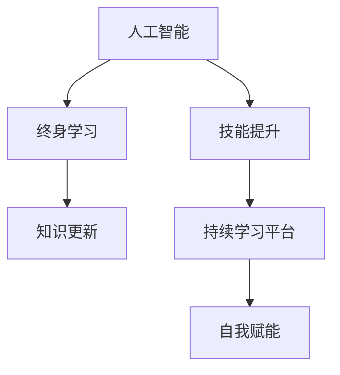

                 

# 终身学习：人工智能促进个人发展

> 关键词：终身学习,人工智能,个人发展,技能提升,知识更新,持续学习平台,自我赋能

## 1. 背景介绍

在当今信息爆炸和知识更迭加速的时代，终身学习已成为个人发展的不二法门。科技的飞速进步，特别是人工智能（AI）的崛起，更是对人们的知识和技能提出了新的挑战和要求。人工智能技术的快速迭代，对个人持续学习和自我提升提出了更高的要求。如何在智能时代中保持竞争力，成为摆在每个个体面前的重要课题。本文旨在探讨如何借助人工智能促进个人终身学习，提升职业技能，保持知识更新，实现自我赋能。

## 2. 核心概念与联系

### 2.1 核心概念概述

为更好地理解人工智能如何促进终身学习，本节将介绍几个关键概念：

- **人工智能（Artificial Intelligence, AI）**：利用计算机科学和工程原理，使计算机系统能够执行通常需要人类智能的任务，包括学习、推理、感知和决策等。

- **终身学习（Lifelong Learning）**：个人在一生中不断学习和技能提升的过程，包括在学校教育之外的学习活动，如自我导向学习、在线课程、工作坊等。

- **技能提升（Skill Enhancement）**：通过学习新技能或优化现有技能，增强个人的职业竞争力和工作效率。

- **知识更新（Knowledge Refresh）**：在知识更新迅速的领域，持续学习新知识，保持与行业前沿接轨。

- **持续学习平台（Continuous Learning Platforms）**：利用技术手段，如在线教育平台、虚拟学习社区、智能导师等，为个人提供长期的学习资源和支持。

这些核心概念之间的联系可以通过以下Mermaid流程图来展示：



这个流程图展示了人工智能在促进终身学习过程中的作用机制：

1. 人工智能技术为终身学习提供了新的工具和方法。
2. 通过技能提升和知识更新，帮助个人在职业生涯中保持竞争优势。
3. 持续学习平台为终身学习提供了必要的环境和支持。
4. 最终，通过自我赋能，个体可以在工作中更高效、更有创造力。

## 3. 核心算法原理 & 具体操作步骤
### 3.1 算法原理概述

人工智能在促进终身学习中的核心原理，可以归纳为以下几个方面：

- **个性化学习路径**：利用机器学习算法分析个人学习偏好和历史数据，推荐个性化的学习资源和路径。
- **自适应学习难度**：根据学习进度和理解能力，动态调整学习内容的难度和复杂度。
- **智能辅导和反馈**：利用自然语言处理(NLP)和计算机视觉技术，提供即时反馈和个性化指导。
- **知识图谱与语义网络**：构建和利用知识图谱，提供结构化、层次化的学习资源，促进深度理解和知识迁移。
- **情感计算与动机激励**：通过分析学习过程中的情感变化，提供动机激励和情绪管理策略。

### 3.2 算法步骤详解

基于人工智能的终身学习系统通常包括以下几个关键步骤：

**Step 1: 数据收集与预处理**
- 收集个人的学习行为数据，如在线学习记录、观看视频时长、阅读文章等。
- 预处理数据，清洗和格式化，转化为可供机器学习算法处理的格式。

**Step 2: 用户画像构建**
- 利用机器学习算法，分析学习数据，构建详细的用户画像，包括兴趣领域、学习风格、知识水平等。

**Step 3: 学习内容推荐**
- 根据用户画像，从庞大的学习资源库中筛选并推荐相关学习内容。
- 利用协同过滤、内容推荐算法，提升推荐的准确性和个性化。

**Step 4: 自适应学习**
- 实时监控学习进度和效果，动态调整学习路径和难度。
- 通过预测模型评估学习者的理解和掌握情况，灵活调整教学策略。

**Step 5: 智能辅导与反馈**
- 利用NLP技术，对学习者的文本输入进行理解与分析，提供即时反馈和指导。
- 使用计算机视觉技术，对学习者的操作行为进行跟踪与分析，提供操作指导。

**Step 6: 知识图谱与语义网络**
- 构建与学习内容相关的知识图谱，提供结构化、层次化的学习资源。
- 利用语义网络技术，促进深度理解和知识迁移。

**Step 7: 情感计算与动机激励**
- 分析学习过程中的情感变化，提供动机激励和情绪管理策略。
- 通过情绪识别技术，及时调整教学策略，提升学习体验。

### 3.3 算法优缺点

人工智能在促进终身学习方面的优势：
1. 高度个性化：能够根据学习者的历史数据和行为特征，提供量身定制的学习路径。
2. 自适应性强：能动态调整学习内容和难度，适应学习者的实时学习状态。
3. 高效反馈与辅导：提供即时反馈和个性化指导，提升学习效果。
4. 知识结构化：利用知识图谱和语义网络，提供结构化、层次化的学习资源。
5. 持续激励：通过情感计算，提供动机激励和情绪管理，提升学习动力。

同时，该方法也存在一些局限性：
1. 数据隐私和安全：需要收集大量个人学习数据，可能带来隐私和安全问题。
2. 过度依赖技术：过度依赖技术手段，可能忽视学习者的主观能动性和个性化需求。
3. 算法偏见：机器学习算法可能存在偏见，导致推荐内容不够全面。
4. 成本较高：建设和维护高度个性化的终身学习系统，需要较高的技术成本和资源投入。

尽管存在这些局限性，但人工智能在促进终身学习方面的巨大潜力不容忽视。未来相关研究的重点在于如何进一步降低技术成本，提高推荐内容的全面性和个性化，同时兼顾数据隐私和伦理问题。

### 3.4 算法应用领域

人工智能在终身学习中的应用领域非常广泛，涵盖了以下几个方面：

- **在线教育**：提供个性化的学习路径和资源，提升在线学习体验和效果。
- **职业培训**：利用技能提升和学习路径，帮助职业人士获得新技能，提升竞争力。
- **学术研究**：通过智能辅导和知识图谱，辅助科研人员进行深度学习和知识探索。
- **个人兴趣发展**：通过推荐个性化学习资源，支持个人在兴趣领域的深入发展。
- **终身学习平台**：构建高度个性化的学习平台，提供持续的学习支持和指导。

## 4. 数学模型和公式 & 详细讲解  
### 4.1 数学模型构建

基于人工智能的终身学习模型可以表示为：

$$
\begin{aligned}
&\text{User Profile} = f(\text{Learning Data})\\
&\text{Learning Recommendations} = g(\text{User Profile}, \text{Learning Resources})\\
&\text{Adaptive Learning} = h(\text{Learning Progress}, \text{Learning Resources}, \text{User Profile})\\
&\text{Intelligent Coaching} = i(\text{User Input}, \text{User Profile})\\
&\text{Knowledge Graph} = k(\text{Learning Content})\\
&\text{Emotion Computing} = j(\text{Learning Behavior})
\end{aligned}
$$

其中，$f$、$g$、$h$、$i$、$k$、$j$分别表示不同的函数映射。

### 4.2 公式推导过程

以推荐系统为例，其推荐模型可以表示为：

$$
\hat{y}_i = \text{sign}(\sum_{k=1}^{K} w_k x_{ik})
$$

其中，$y_i$为学习资源$i$的评分，$x_{ik}$为资源$i$的特征向量，$w_k$为特征权重，$sign$为符号函数。

在实际应用中，$x_{ik}$和$w_k$的计算需要利用机器学习算法，如协同过滤、矩阵分解等，结合用户画像数据，进行优化计算。

### 4.3 案例分析与讲解

假设某用户在学习编程课程时，通过平台记录的学习行为数据被收集和处理。系统根据其学习时间、题目完成情况、课程评分等特征，构建详细的用户画像。基于用户画像，系统从编程语言、开发工具、算法理论等多个维度，推荐个性化的学习资源。学习过程中，系统通过即时反馈和智能辅导，解决用户遇到的问题，调整学习进度和难度。同时，系统还利用编程相关的知识图谱，提供结构化的学习内容，帮助用户深入理解编程语言和算法原理。通过情感计算技术，系统分析用户在学习过程中的情绪变化，提供动机激励和情绪管理策略。

## 5. 项目实践：代码实例和详细解释说明
### 5.1 开发环境搭建

在进行终身学习项目实践前，我们需要准备好开发环境。以下是使用Python进行TensorFlow开发的环境配置流程：

1. 安装Anaconda：从官网下载并安装Anaconda，用于创建独立的Python环境。

2. 创建并激活虚拟环境：
```bash
conda create -n tf-env python=3.8 
conda activate tf-env
```

3. 安装TensorFlow：根据CUDA版本，从官网获取对应的安装命令。例如：
```bash
conda install tensorflow tensorflow-cpu -c conda-forge
```

4. 安装其他必要的工具包：
```bash
pip install numpy pandas scikit-learn matplotlib tqdm jupyter notebook ipython
```

完成上述步骤后，即可在`tf-env`环境中开始项目实践。

### 5.2 源代码详细实现

这里我们以一个简单的终身学习推荐系统为例，给出使用TensorFlow进行开发的代码实现。

首先，定义数据集类：

```python
import tensorflow as tf
from tensorflow.keras import layers

class LearningDataset(tf.keras.utils.Sequence):
    def __init__(self, learning_data, batch_size):
        self.data = learning_data
        self.batch_size = batch_size
        
    def __len__(self):
        return len(self.data) // self.batch_size
    
    def __getitem__(self, idx):
        batch = self.data[idx*batch_size:(idx+1)*batch_size]
        inputs = batch[:, :, :2]  # 提取文本特征和评分
        labels = batch[:, :, 2]  # 提取评分
        return inputs, labels
```

然后，定义推荐模型：

```python
model = tf.keras.Sequential([
    layers.Dense(64, activation='relu', input_shape=(3,)),
    layers.Dense(32, activation='relu'),
    layers.Dense(1)
])
model.compile(optimizer='adam', loss='mse')
```

接着，定义训练和评估函数：

```python
def train_epoch(model, dataset, batch_size, epochs):
    dataloader = tf.data.Dataset.from_tensor_slices(dataset)
    dataloader = dataloader.shuffle(buffer_size=10000).batch(batch_size)
    
    model.fit(dataloader, epochs=epochs, verbose=1)

def evaluate(model, dataset, batch_size):
    dataloader = tf.data.Dataset.from_tensor_slices(dataset)
    dataloader = dataloader.batch(batch_size)
    
    mse_loss = tf.keras.losses.MeanSquaredError()
    loss = mse_loss(model.predict(x), y).numpy().item()
    return loss
```

最后，启动训练流程并在测试集上评估：

```python
learning_data = ...  # 准备训练数据
batch_size = 32
epochs = 10

train_epoch(model, learning_data, batch_size, epochs)
print(f"Test Loss: {evaluate(model, test_data, batch_size)}")
```

以上就是使用TensorFlow进行终身学习推荐系统的完整代码实现。可以看到，TensorFlow提供了强大的工具和框架，使得模型构建和训练变得简洁高效。

### 5.3 代码解读与分析

让我们再详细解读一下关键代码的实现细节：

**LearningDataset类**：
- `__init__`方法：初始化数据集，将数据划分为批次。
- `__len__`方法：返回数据集的总样本数。
- `__getitem__`方法：获取批次数据，并进行批处理和转换。

**模型定义**：
- 使用TensorFlow的`Sequential`模型定义神经网络，包含输入层、隐藏层和输出层。
- 使用`compile`方法定义优化器和损失函数，设置模型的训练参数。

**训练和评估函数**：
- 使用`fit`方法训练模型，设定迭代轮数和批次大小。
- 使用`evaluate`方法评估模型性能，返回均方误差损失。

**训练流程**：
- 定义总批次大小和迭代轮数，启动模型训练。
- 在训练集上训练模型，并在测试集上评估模型性能。

可以看到，TensorFlow提供了灵活的工具和框架，使得终身学习系统的构建和训练变得更为高效。开发者可以将其作为基础工具，构建更复杂的学习系统和应用。

## 6. 实际应用场景
### 6.1 在线教育

在线教育平台通过人工智能技术，能够提供个性化的学习路径和资源，提升学习效率。例如，Coursera和Udacity等平台利用用户的学习行为数据，推荐个性化的课程和资源，帮助用户高效完成学习。

### 6.2 职业培训

企业培训系统利用AI技术，根据员工的技能需求和学习偏好，提供定制化的培训课程和资源。通过智能辅导和反馈，提高员工的学习效果和培训质量。例如，IBM的Watson Career Coach利用AI技术，帮助员工制定个性化的职业发展计划。

### 6.3 学术研究

学术研究中，AI技术用于辅助科研人员进行文献阅读和知识探索。例如，Microsoft Academic通过AI技术，帮助研究人员发现相关领域的最新研究成果，分析论文的引用关系，提供深度学习和知识图谱支持。

### 6.4 个人兴趣发展

利用AI技术，个人可以在兴趣领域中进行深入学习和发展。例如，Kaggle平台利用AI技术，提供个性化的数据集和挑战，支持用户在数据科学和机器学习领域进行深入学习和实践。

## 7. 工具和资源推荐
### 7.1 学习资源推荐

为了帮助开发者系统掌握人工智能在终身学习中的应用，这里推荐一些优质的学习资源：

1. **《Python深度学习》**：由Francois Chollet所著，深入浅出地介绍了深度学习的基础知识和实际应用，包括TensorFlow和Keras的使用。

2. **《深度学习入门》**：由斋藤康毅所著，系统介绍了深度学习的基本原理和实践技巧，适合初学者入门。

3. **Coursera和Udacity**：提供大量高质量的在线课程，涵盖机器学习、深度学习、自然语言处理等多个领域。

4. **TensorFlow官方文档**：提供丰富的API文档和示例代码，适合学习TensorFlow的开发者参考。

5. **Kaggle竞赛**：提供大量实际数据集和挑战，适合进行数据科学和机器学习实践。

通过对这些资源的学习实践，相信你一定能够快速掌握人工智能在终身学习中的应用，并用于解决实际的NLP问题。

### 7.2 开发工具推荐

高效的开发离不开优秀的工具支持。以下是几款用于AI项目开发的常用工具：

1. **TensorFlow**：由Google主导开发的深度学习框架，生产部署方便，适合大规模工程应用。

2. **Keras**：提供简洁易用的API接口，支持多种深度学习模型的构建。

3. **PyTorch**：基于Python的开源深度学习框架，灵活动态的计算图，适合快速迭代研究。

4. **Jupyter Notebook**：提供交互式的编程环境，方便进行数据分析和模型调试。

5. **GitHub**：提供代码托管和版本控制服务，方便团队协作和项目管理。

6. **Git**：提供分布式版本控制工具，支持代码协作和版本管理。

合理利用这些工具，可以显著提升AI项目开发的效率，加快创新迭代的步伐。

### 7.3 相关论文推荐

人工智能在终身学习领域的研究始于2004年的《Lifelong Machine Learning》，代表性强、影响力大。以下是几篇奠基性的相关论文，推荐阅读：

1. **"Lifelong Machine Learning"**：由Thrun和Prattivadiya联合撰写，介绍了LML的基本概念和研究方法。

2. **"Towards Lifelong Learning with Graph Neural Networks"**：由Sun和Luo等人提出，探讨了图神经网络在终身学习中的应用。

3. **"Lifelong Learning and Online Learning"**：由Cortes和Vapnik联合撰写，阐述了终身学习的理论基础和实践方法。

4. **"Meta-Learning in Deep Neural Networks"**：由Riedmiller和Bengio提出，探讨了元学习在深度神经网络中的应用。

5. **"Lifelong Learning for Deep Neural Networks: Recurrent Activations Can Be Used to Learn New Tasks without Forgetting"**：由Do and Hochreiter提出，讨论了递归激活在终身学习中的应用。

这些论文代表了大规模终身学习领域的研究脉络。通过学习这些前沿成果，可以帮助研究者把握学科前进方向，激发更多的创新灵感。

## 8. 总结：未来发展趋势与挑战
### 8.1 总结

本文对人工智能如何促进终身学习进行了全面系统的介绍。首先阐述了终身学习的背景和意义，明确了人工智能在终身学习中的重要地位。其次，从原理到实践，详细讲解了人工智能在终身学习中的数学模型和核心算法，给出了实际应用中的代码实例。同时，本文还广泛探讨了人工智能在教育、职业培训、学术研究、个人兴趣发展等多个领域的应用前景，展示了人工智能在终身学习中的巨大潜力。最后，本文精选了相关的学习资源、开发工具和研究论文，力求为读者提供全方位的技术指引。

通过本文的系统梳理，可以看到，人工智能在促进终身学习方面的巨大价值和潜力。无论是在线教育、职业培训，还是在学术研究、个人兴趣发展等领域，人工智能技术都能提供个性化的学习路径和资源，提升学习效率和效果。未来，伴随着人工智能技术的进一步发展，终身学习将成为每个人都必须具备的核心技能，推动个人全面发展和社会进步。

### 8.2 未来发展趋势

展望未来，人工智能在促进终身学习方面的发展趋势主要体现在以下几个方面：

1. **个性化学习更加深入**：利用深度学习算法和大数据分析，进一步提升个性化学习的精准度和覆盖面，满足不同学习者的个性化需求。

2. **多模态学习成为主流**：结合文本、音频、视频等多模态数据，提供更加全面和丰富的学习体验。

3. **自适应学习系统普及**：利用自适应学习算法，动态调整学习内容和难度，适应学习者的实时学习状态。

4. **情感计算与动机管理**：通过情感计算和动机管理，提升学习者的情绪稳定性和学习动力。

5. **元学习和跨领域学习**：利用元学习算法，提升模型的泛化能力和迁移学习能力，更好地适应新任务和新领域。

6. **终身学习生态系统构建**：构建完善的终身学习生态系统，包括学习平台、资源库、社区等，支持持续学习和知识共享。

这些趋势凸显了人工智能在终身学习中的广泛应用和巨大潜力，必将推动终身学习技术不断突破，提升全社会的学习水平和知识水平。

### 8.3 面临的挑战

尽管人工智能在促进终身学习方面具有巨大的潜力，但仍然面临诸多挑战：

1. **数据隐私和安全**：大量个人数据的收集和使用，可能带来隐私和安全问题，需要建立完善的数据保护机制。

2. **算法偏见**：机器学习算法可能存在偏见，导致推荐内容不全面，需要建立公平性评估和纠正机制。

3. **技术复杂性**：构建高度个性化的终身学习系统，需要较高的技术水平和资源投入，需要更多的研究和开发投入。

4. **动机和参与度**：如何激励学习者持续参与学习，提升学习动机和参与度，是摆在面前的一大难题。

5. **多模态数据融合**：多模态数据的融合和处理，需要跨学科的协作和创新，面临技术和标准的挑战。

6. **跨领域学习**：跨领域的知识整合和迁移，需要构建结构化和层次化的知识图谱，面临复杂性和实用性的挑战。

正视这些挑战，积极应对并寻求突破，将是大规模终身学习技术迈向成熟的必由之路。相信随着学界和产业界的共同努力，这些挑战终将一一被克服，大规模终身学习必将在构建人机协同的智能时代中扮演越来越重要的角色。

### 8.4 研究展望

面对终身学习面临的诸多挑战，未来的研究需要在以下几个方面寻求新的突破：

1. **引入多模态数据**：将文本、音频、视频等多模态数据整合到终身学习系统中，提升学习体验和效果。

2. **开发元学习算法**：利用元学习算法，提升模型的泛化能力和迁移学习能力，更好地适应新任务和新领域。

3. **建立公平性评估机制**：利用公平性评估和纠正机制，消除算法偏见，确保推荐内容的公平性和全面性。

4. **引入情感计算技术**：利用情感计算技术，提升学习者的情绪稳定性和学习动力，增强学习效果。

5. **开发高效自适应算法**：开发高效自适应学习算法，动态调整学习内容和难度，适应学习者的实时学习状态。

6. **构建跨领域知识图谱**：构建跨领域的知识图谱，促进知识整合和迁移，提升终身学习系统的实用性和全面性。

这些研究方向的探索，必将引领终身学习技术迈向更高的台阶，为构建安全、可靠、可解释、可控的智能系统铺平道路。面向未来，终身学习技术还需要与其他人工智能技术进行更深入的融合，如知识表示、因果推理、强化学习等，多路径协同发力，共同推动人工智能技术的发展和应用。

## 9. 附录：常见问题与解答

**Q1：人工智能如何帮助个体实现终身学习？**

A: 人工智能通过数据收集、分析和学习行为预测，为个体提供个性化的学习资源和路径。利用自适应学习、智能辅导和情感计算等技术，提升学习效率和效果，帮助个体在一生中不断学习和技能提升。

**Q2：开发终身学习系统需要哪些关键技术和工具？**

A: 开发终身学习系统需要多种关键技术和工具，包括深度学习、自然语言处理、知识图谱、情感计算、多模态数据处理等。常用的开发工具包括TensorFlow、Keras、PyTorch、Jupyter Notebook等。

**Q3：终身学习系统如何处理数据隐私和安全问题？**

A: 终身学习系统通过匿名化和加密等技术手段，保护用户数据的隐私和安全。同时，建立完善的数据使用和访问权限控制机制，确保数据使用合规和透明。

**Q4：如何提升终身学习系统的公平性和全面性？**

A: 通过公平性评估和纠正机制，确保推荐内容的公平性和全面性。利用元学习算法，提升模型的泛化能力和迁移学习能力，消除算法偏见。

**Q5：终身学习系统如何适应不同领域和学习需求？**

A: 利用跨领域知识图谱和元学习算法，促进知识整合和迁移，提升终身学习系统的适应性和实用性。通过多模态数据处理，提供更加全面和丰富的学习体验。

---

作者：禅与计算机程序设计艺术 / Zen and the Art of Computer Programming

