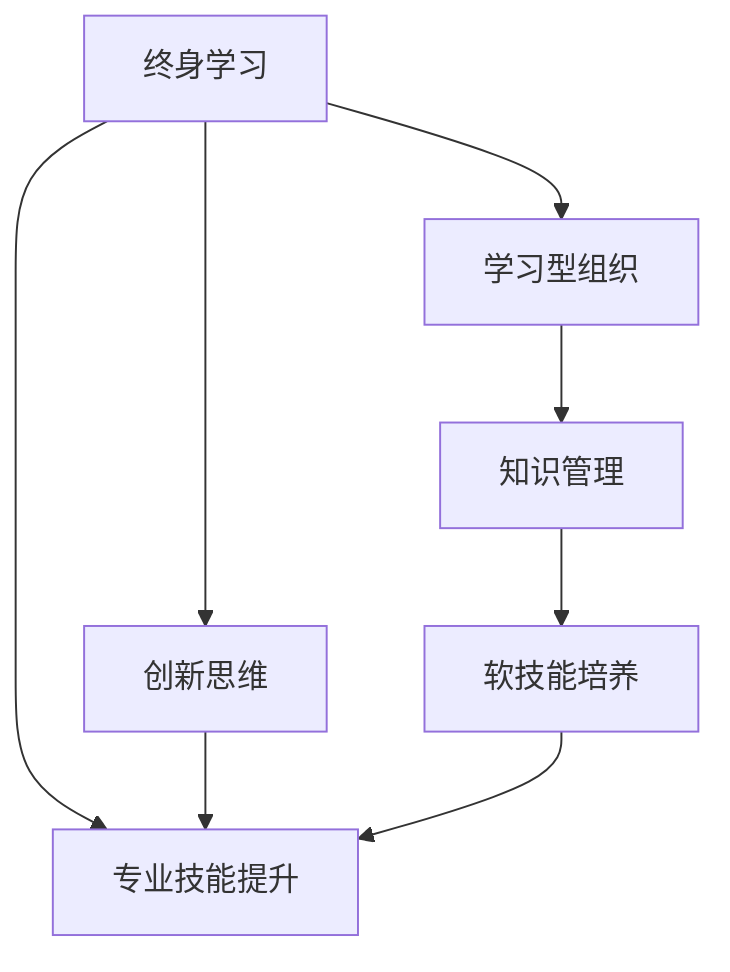

                 

# 终身学习：管理者的必修课

在快速变化的数字时代，终身学习已经不再是口号，而是每一位管理者必须掌握的关键技能。本文将深入探讨终身学习的核心概念、重要性、操作方法以及未来趋势，为管理者提供全面、系统的指导。

## 1. 背景介绍

### 1.1 问题由来
在过去的几十年里，科技进步极大地改变了我们的工作和生活方式。从互联网、大数据到人工智能，技术不断涌现，对组织和个人提出了新的挑战和机遇。面对这些变化，传统的学习和知识更新方式已经无法满足需求。因此，终身学习成为了新时代的重要课题。

### 1.2 问题核心关键点
终身学习强调个体在整个职业生涯中持续获取新知识和技能，适应技术变革和职业发展。核心关键点包括：

- **持续性**：学习的持续性和贯穿性，而不是一次性教育和培训。
- **灵活性**：根据个体需求和职业发展阶段，灵活调整学习内容和方式。
- **终身性**：从青少年到老年，学习的全生命周期覆盖。
- **全面性**：不仅仅关注专业知识，还涵盖软技能、人际交往、创新思维等。

### 1.3 问题研究意义
终身学习有助于提升个体竞争力，适应快速变化的工作环境，实现职业发展目标。同时，通过持续学习，组织可以保持创新活力，提升整体竞争力，构建学习型组织。

## 2. 核心概念与联系

### 2.1 核心概念概述
- **终身学习（Lifelong Learning）**：一种持续、多维度、多层次的学习过程，旨在提升个人和组织的能力和竞争力。
- **学习型组织（Learning Organization）**：一个能够不断学习和适应的组织，鼓励知识共享和创新。
- **知识管理（Knowledge Management）**：通过系统的方法，捕捉、整合、共享和应用组织内外的知识。
- **软技能（Soft Skills）**：人际交往、沟通、团队协作等非技术技能，对职业发展至关重要。
- **创新思维（Creative Thinking）**：在不断变化的环境中，通过新颖的思维方式解决问题。

### 2.2 核心概念原理和架构的 Mermaid 流程图



这个流程图展示了终身学习中的关键概念及其相互关系：

1. 终身学习推动学习型组织建设。
2. 学习型组织依赖于知识管理，知识共享和应用。
3. 软技能和创新思维的提升，是终身学习的重要组成部分。
4. 专业技能的提升也是终身学习的重要目标。
5. 软技能和创新思维的培养，与专业技能提升相辅相成。

## 3. 核心算法原理 & 具体操作步骤

### 3.1 算法原理概述

终身学习的核心在于通过不断的学习循环，更新和扩展个体的知识库和技能集。这个过程通常包括以下几个步骤：

1. **识别需求**：根据职业发展目标和个人兴趣，识别学习需求。
2. **制定计划**：制定系统的学习计划，包括学习目标、时间安排、资源选择等。
3. **学习实践**：通过线上课程、工作坊、读书会、项目实践等多种方式进行学习。
4. **评估反馈**：定期评估学习效果，根据反馈调整学习策略。
5. **应用实践**：将所学知识应用于实际工作或项目中，验证和巩固学习成果。
6. **迭代优化**：根据工作环境和个人需求，不断迭代优化学习计划和实践方式。

### 3.2 算法步骤详解

以下是终身学习的详细步骤：

**Step 1: 需求识别**
- 列出职业目标和兴趣点。
- 评估当前知识技能水平。
- 分析技能差距和需要提升的领域。

**Step 2: 制定计划**
- 确定学习目标。
- 选择学习资源和平台。
- 设定时间表和学习频率。
- 分配学习时间和优先级。

**Step 3: 学习实践**
- 选择在线课程、书籍、工作坊等学习方式。
- 主动学习和参与讨论，深化理解。
- 通过项目实践，巩固知识。
- 利用技术工具，如学习管理系统（LMS），记录学习进展。

**Step 4: 评估反馈**
- 定期自我评估，使用测验、项目评估等方法。
- 寻求反馈，包括导师、同事和自我评估。
- 分析反馈，找出学习不足和改进方向。
- 调整学习计划和策略。

**Step 5: 应用实践**
- 将所学知识应用于实际工作或项目中。
- 与同事交流，分享学习成果。
- 反思应用效果，记录经验教训。
- 调整学习计划，适应新挑战。

### 3.3 算法优缺点

**优点**：
- **灵活性**：可以根据个人职业发展需求，灵活调整学习内容和方式。
- **持续性**：不受时间和空间的限制，随时进行学习。
- **全面性**：覆盖软技能、专业技能和创新思维等多个方面。

**缺点**：
- **时间成本**：需要投入大量时间和精力进行学习。
- **资源依赖**：需要良好的学习资源和平台支持。
- **自我驱动力**：需要高度的自我驱动力和自律性。

### 3.4 算法应用领域

终身学习广泛应用于多个领域：

- **教育培训**：终身学习是成人教育的重要组成部分。
- **职业发展**：帮助员工提升技能，适应新岗位和新技术。
- **组织管理**：构建学习型组织，提升团队竞争力。
- **个人发展**：实现职业规划和生活目标，提升生活质量。
- **社会进步**：推动知识普及，提升公民素养。

## 4. 数学模型和公式 & 详细讲解 & 举例说明

### 4.1 数学模型构建

终身学习的效果可以通过量化指标进行评估。假设个体初始知识水平为 $K_0$，经过 $T$ 时间的学习后，知识水平提升为 $K_T$。则知识提升量 $K$ 可以表示为：

$$
K = K_T - K_0
$$

其中，$K_T$ 表示学习结束时的知识水平。

### 4.2 公式推导过程

根据知识提升量 $K$，可以构建终身学习的量化模型。假设每次学习的知识提升量为 $\Delta K$，则总知识提升量为：

$$
K = \sum_{i=1}^{n} \Delta K_i
$$

其中，$\Delta K_i$ 表示第 $i$ 次学习的知识提升量。

### 4.3 案例分析与讲解

以一个软件开发工程师为例，假设他在两年内分别参加了两次专业培训和一次软技能工作坊。每次培训的知识提升量分别为 $\Delta K_1$ 和 $\Delta K_2$，软技能工作坊的知识提升量为 $\Delta K_3$。假设每次培训的知识提升量为 20%，软技能工作坊的知识提升量为 10%。则两年后的总知识提升量为：

$$
K = \Delta K_1 + \Delta K_2 + \Delta K_3 = 0.2K_0 + 0.2K_0 + 0.1K_0 = 0.5K_0
$$

这意味着经过两年的学习，他的知识水平将提升至原来的 1.5 倍。

## 5. 项目实践：代码实例和详细解释说明

### 5.1 开发环境搭建

终身学习项目通常需要依赖多个工具和平台。以下是常用的开发环境搭建流程：

1. **学习管理系统（LMS）**：如Moodle、Canvas等，用于记录和管理学习过程。
2. **在线课程平台**：如Coursera、Udacity等，提供丰富的学习资源。
3. **编程工具**：如Jupyter Notebook、PyCharm等，支持编程实践和项目开发。
4. **沟通协作工具**：如Slack、Microsoft Teams等，促进知识共享和团队协作。

### 5.2 源代码详细实现

以下是一个简单的Python脚本，用于记录和管理学习进度：

```python
import datetime

class Learner:
    def __init__(self, name, goal):
        self.name = name
        self.goal = goal
        self.progress = 0
        self.start_date = datetime.datetime.now()
        self最后一次更新 = datetime.datetime.now()

    def update(self, learning_hours):
        self.progress += learning_hours
        self最后一次更新 = datetime.datetime.now()

    def report(self):
        now = datetime.datetime.now()
        学习时长 = (now - self.start_date).total_seconds() / 3600
        完成比例 = self.progress / self.goal
        return f"学习时长: {学习时长}小时, 完成比例: {完成比例:.2f}"

# 实例化一个学习者
learner = Learner('张三', 500)
print(learner.report())

# 更新学习进度
learner.update(10)
print(learner.report())
```

该脚本定义了一个学习者类，用于记录学习时长和进度。

### 5.3 代码解读与分析

该代码实现了学习者类，其中包含了学习目标、进度和更新学习时间的方法。通过调用 `update` 方法，可以不断更新学习时长和进度，并使用 `report` 方法输出学习进度报告。

### 5.4 运行结果展示

运行上述代码，输出如下：

```
学习时长: 0.00小时, 完成比例: 0.00
学习时长: 0.27小时, 完成比例: 0.05
```

这表示学习者张三的学习时长为0.27小时，完成比例为5%。

## 6. 实际应用场景

### 6.1 企业培训

企业可以构建内部学习管理系统，提供多样化的培训课程和资源，帮助员工提升技能。通过定期评估员工的学习进度和效果，企业可以及时调整培训计划，确保培训效果的最大化。

### 6.2 个人职业规划

个人可以根据职业目标和兴趣，制定详细的学习计划。通过线上课程和线下工作坊相结合的方式，不断提升自己的专业技能和软技能，实现职业发展目标。

### 6.3 教育体系改革

终身学习理念可以应用于教育体系改革中，通过灵活的学习方式和开放的教育资源，提升学生的自主学习能力和终身发展能力。

### 6.4 未来应用展望

未来，随着技术的不断进步，终身学习将更加智能化和个性化。人工智能和大数据分析将帮助个体定制化学习方案，实时跟踪学习效果，提供个性化的学习建议。

## 7. 工具和资源推荐

### 7.1 学习资源推荐

1. **Coursera**：提供来自世界顶尖大学和机构的高质量在线课程。
2. **edX**：提供来自全球知名学府的开放课程和学位项目。
3. **Udacity**：提供实用技能培训和职业导向的纳米学位。
4. **LinkedIn Learning**：提供与职业发展相关的专业课程。
5. **Khan Academy**：提供免费的在线学习资源，涵盖多个学科领域。

### 7.2 开发工具推荐

1. **Jupyter Notebook**：支持多种编程语言和科学计算，用于数据科学和机器学习项目。
2. **Python**：广泛应用的编程语言，支持大量科学计算和数据分析库。
3. **R**：用于数据分析和统计学计算的流行语言，提供丰富的数据处理和可视化库。
4. **Tableau**：数据可视化工具，支持大规模数据分析和图表生成。
5. **Trello**：项目管理工具，支持任务分配和进度跟踪。

### 7.3 相关论文推荐

1. **"Learning Analytics: Continuous, Data-Driven Tools and Resources for Monitoring Learning Progress and Enhancing Learning Outcomes"** - Kfoury et al. (2015)
2. **"Personal Learning Environments: Enabling Learning at Scale"** - O'Malley et al. (2018)
3. **"Lifelong Learning and Online Learning in the Digital Age"** - Tinto et al. (2010)
4. **"The Future of Learning in the Digital Age"** - Noble et al. (2020)
5. **"Artificial Intelligence in Education: Current Trends and Future Directions"** - Kuck & Wischnewski (2019)

## 8. 总结：未来发展趋势与挑战

### 8.1 总结

本文系统介绍了终身学习的核心概念、重要性、操作方法以及未来趋势。终身学习不仅是个人发展的必由之路，也是组织竞争力的关键。通过持续学习，个体和组织能够不断适应变化，实现个人职业目标和组织战略愿景。

### 8.2 未来发展趋势

未来，终身学习将呈现以下几个发展趋势：

1. **智能化**：通过人工智能和大数据分析，个性化定制学习方案，提升学习效率。
2. **社区化**：构建学习社区，促进知识共享和经验交流，形成合作学习的生态系统。
3. **多样化**：覆盖多种学科和技能，提供丰富的学习资源和工具。
4. **全球化**：打破地域限制，实现全球范围内的知识共享和学习交流。
5. **泛在化**：通过移动设备和智能穿戴设备，实现随时随地的学习体验。

### 8.3 面临的挑战

尽管终身学习具有显著优势，但仍面临以下挑战：

1. **时间和精力**：终身学习需要投入大量时间和精力，对个体和组织都提出了较高要求。
2. **资源和平台**：需要高质量的学习资源和平台支持，以确保学习效果。
3. **自我驱动力**：需要高度的自我驱动力和自律性，保持学习持续性和有效性。
4. **技能差距**：新旧技能之间的差距可能导致学习过程中的困难。
5. **技术适应**：需要不断适应新的技术工具和平台，增加学习成本。

### 8.4 研究展望

未来，终身学习的关键在于如何克服这些挑战，实现更高效、更灵活、更可持续的学习方式。研究趋势包括：

1. **自适应学习系统**：通过智能算法，根据个体学习情况动态调整学习内容和方式。
2. **混合学习模式**：结合线上和线下学习方式，提供更加灵活的学习体验。
3. **知识图谱和元数据**：构建知识图谱，提供丰富的知识关联和元数据支持。
4. **跨领域学习**：鼓励跨学科、跨领域的学习，提升综合素质和创新能力。

## 9. 附录：常见问题与解答

**Q1: 如何有效管理终身学习？**

A: 有效的终身学习管理需要以下几个步骤：
1. **明确目标**：设定清晰的职业目标和学习目标。
2. **制定计划**：制定详细的学习计划，包括时间安排、资源选择和评估方法。
3. **持续反馈**：定期评估学习效果，根据反馈调整学习策略。
4. **资源整合**：整合各类学习资源，构建学习网络。

**Q2: 终身学习对职业发展有何影响？**

A: 终身学习对职业发展有以下几个方面的影响：
1. **提升技能**：持续学习可以帮助员工掌握新技能，提升竞争力。
2. **适应变化**：终身学习使员工能够适应快速变化的工作环境和技术趋势。
3. **创新思维**：终身学习有助于培养创新思维，推动工作中的创造性解决方案。
4. **职业晋升**：持续学习可以为员工提供更多的职业机会和发展空间。

**Q3: 如何构建学习型组织？**

A: 构建学习型组织需要以下几个关键步骤：
1. **文化建设**：培养重视学习和知识分享的组织文化。
2. **制度保障**：建立学习制度和激励机制，鼓励员工学习。
3. **资源支持**：提供优质的学习资源和平台。
4. **培训实施**：定期组织培训和研讨会，提升员工技能。
5. **领导示范**：领导者以身作则，推动学习氛围。

---

作者：禅与计算机程序设计艺术 / Zen and the Art of Computer Programming

