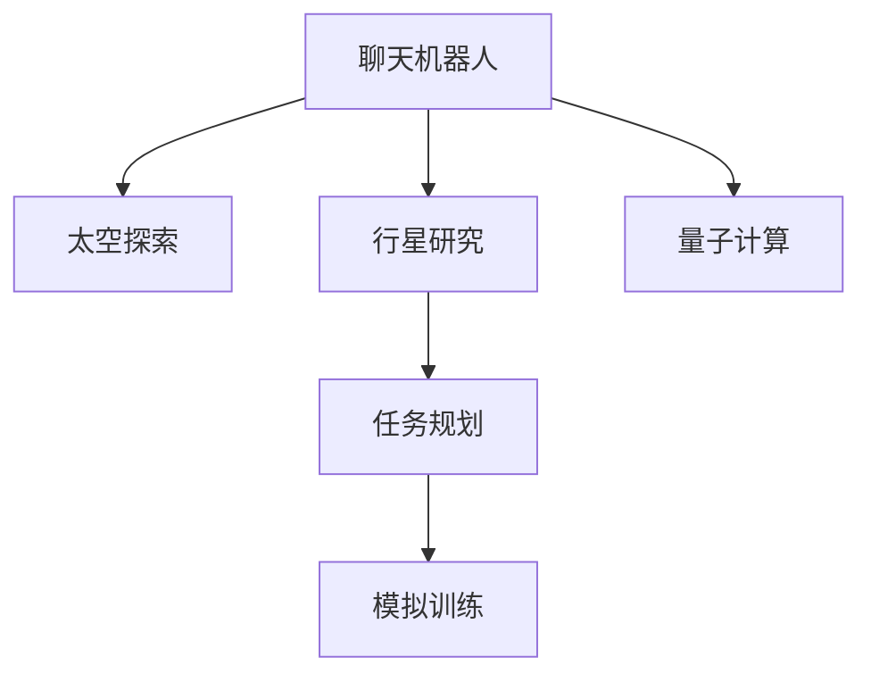

                 

# 聊天机器人太空探索：行星研究和任务

> 关键词：聊天机器人,太空探索,行星研究,任务规划,模拟训练,量子计算

## 1. 背景介绍

### 1.1 问题由来

近年来，人工智能(AI)在太空探索领域的应用日益广泛，成为推动科学发现和航天任务的重要手段。传统上，太空探索任务通常由人类专家通过复杂计算和手工分析完成，但这种方式不仅耗时耗力，而且容易出错。人工智能技术的发展为太空探索带来了新的可能性，使得机器人和自动化系统能够辅助甚至替代人类完成一些探索任务。

聊天机器人作为人工智能的一种形式，以其自然语言处理(NLP)和自主决策能力，在太空探索任务中发挥着越来越重要的作用。聊天机器人可以与宇航员和其他操作员进行实时通信，辅助他们完成各种任务，如数据分析、图像处理、故障排查等。更重要的是，它们还可以执行某些危险或不适合人类操作员执行的任务，如空间行走或接触可能携带有害物质的样本。

本文将详细探讨如何使用聊天机器人进行太空探索的行星研究和任务规划。我们将介绍核心概念、技术原理，并通过实际案例分析其应用效果，同时提供相关的学习资源和开发工具，最后总结未来的发展趋势和面临的挑战。

### 1.2 问题核心关键点

本文的核心议题包括：
- 聊天机器人如何在太空探索中发挥作用？
- 如何设计和管理太空探索中的任务规划和指令执行？
- 如何利用模拟训练提升聊天机器人的智能水平和任务执行能力？
- 聊天机器人如何与量子计算等新兴技术结合，提升太空探索的效率和精度？

这些问题构成了本文的逻辑框架，贯穿全文，旨在为读者提供一个全面的技术视角和实践指导。

## 2. 核心概念与联系

### 2.1 核心概念概述

为了更好地理解聊天机器人如何在太空探索中发挥作用，我们需要明确几个核心概念：

- **聊天机器人(Chatbot)**：一种能够理解并生成自然语言，进行人机交互的人工智能系统。聊天机器人可以通过自然语言处理技术，理解人类语言，执行复杂任务，与人类进行交流。
- **太空探索(Space Exploration)**：指通过各种航天器和探测器，对宇宙空间进行探索和研究的活动。太空探索涉及天体物理、行星科学、宇宙化学等多个领域。
- **行星研究(Planetary Research)**：指对行星进行详细观测和分析，以了解其物理特性、化学组成和地质结构等，是太空探索的重要组成部分。
- **任务规划(Task Planning)**：指为太空探索任务制定详细的工作流程和操作顺序，以确保任务高效、安全地完成。
- **模拟训练(Simulation Training)**：指通过虚拟环境模拟实际任务，对聊天机器人进行训练，提升其智能水平和任务执行能力。
- **量子计算(Quantum Computing)**：一种利用量子位进行计算的新型计算方式，具有强大的并行处理能力和信息加密能力，被认为将引领未来的计算革命。

这些核心概念之间的联系可以通过以下Mermaid流程图来展示：



这个流程图展示了聊天机器人在太空探索中的作用及其与相关概念的联系。

## 3. 核心算法原理 & 具体操作步骤

### 3.1 算法原理概述

聊天机器人辅助太空探索的核心算法原理主要包括自然语言处理(NLP)、机器学习(ML)和任务规划。下面将详细介绍这些算法的原理。

- **自然语言处理(NLP)**：用于理解和生成自然语言的技术，包括文本分析、语音识别、情感分析等。在太空探索中，NLP技术使聊天机器人能够理解宇航员的指令，执行任务，并生成报告。
- **机器学习(ML)**：通过学习历史数据和模型，提高聊天机器人的智能水平和任务执行能力。在太空探索中，ML技术使聊天机器人能够不断优化自己的行为，提高任务执行的准确性和效率。
- **任务规划**：用于制定详细的任务执行计划，包括任务的顺序、资源分配、时间安排等。在太空探索中，任务规划使聊天机器人能够协调多个任务和操作员的行动，确保任务顺利完成。

### 3.2 算法步骤详解

下面详细介绍聊天机器人辅助太空探索的具体操作步骤：

**Step 1: 数据收集和预处理**

- 收集历史太空探索数据，包括任务指令、操作日志、任务结果等。
- 对数据进行清洗和标注，准备用于训练和测试机器学习模型。

**Step 2: 模型训练和优化**

- 使用机器学习算法对聊天机器人进行训练，如监督学习、强化学习等。
- 在训练过程中，使用自然语言处理技术对数据进行预处理和特征提取。
- 根据训练结果，优化模型的参数和结构，提升模型的性能。

**Step 3: 任务规划和调度**

- 使用任务规划算法，制定详细的任务执行计划。
- 将任务计划分解为多个子任务，分配给聊天机器人和操作员执行。
- 根据任务执行情况，动态调整任务计划，优化资源分配和时间安排。

**Step 4: 模拟训练和测试**

- 使用模拟训练环境，对聊天机器人进行多轮训练。
- 在训练过程中，不断调整模型参数和任务计划，优化聊天机器人的性能。
- 对训练后的聊天机器人进行测试，评估其任务执行能力。

**Step 5: 实际应用和反馈**

- 将训练好的聊天机器人部署到太空探索任务中。
- 在实际应用中，不断收集反馈数据，优化聊天机器人的行为。
- 根据反馈数据，调整训练模型和任务计划，提升聊天机器人的智能水平和任务执行能力。

### 3.3 算法优缺点

聊天机器人辅助太空探索的算法具有以下优点：
- 提高任务执行效率和准确性：聊天机器人能够理解并执行复杂任务，减少人为错误。
- 降低宇航员工作负荷：聊天机器人可以执行危险和复杂任务，减少宇航员的工作负担。
- 提升任务规划能力：通过机器学习，聊天机器人能够不断优化任务计划，提高任务执行的效率和安全性。

同时，这些算法也存在一些局限性：
- 依赖于大量标注数据：训练聊天机器人需要大量标注数据，数据获取和标注成本较高。
- 模型复杂度较高：聊天机器人涉及多种算法和技术，模型复杂度高，训练和部署难度较大。
- 无法完全替代人类：聊天机器人虽然能够执行部分任务，但无法完全替代宇航员和其他操作员的角色。

### 3.4 算法应用领域

聊天机器人辅助太空探索的算法已经在多个领域得到了广泛应用，例如：

- 行星研究：聊天机器人可以辅助分析行星图像，识别地质特征，提供科学数据。
- 任务规划：聊天机器人可以协助制定任务执行计划，优化资源分配和时间安排。
- 任务执行：聊天机器人可以执行简单操作，如导航、拍照、取样等，辅助宇航员完成任务。
- 故障排查：聊天机器人可以分析系统日志，识别故障原因，提供维修建议。
- 数据管理：聊天机器人可以管理任务数据，生成报告和日志，支持任务管理和分析。

这些应用场景展示了聊天机器人在大规模太空探索中的重要价值。

## 4. 数学模型和公式 & 详细讲解

### 4.1 数学模型构建

本节将使用数学语言对聊天机器人辅助太空探索的任务规划算法进行更加严格的刻画。

设太空探索任务包含 $N$ 个操作，操作 $i$ 需要 $t_i$ 时间，成本为 $c_i$。任务目标是在时间 $T$ 内完成所有操作，最小化总成本。

数学模型如下：

$$
\begin{aligned}
& \min \sum_{i=1}^N c_i \\
& \text{subject to} \\
& \sum_{i=1}^N t_i \leq T \\
& x_i \in \{0,1\}, \quad i=1,2,\ldots,N
\end{aligned}
$$

其中 $x_i$ 表示是否执行操作 $i$，$0$ 表示不执行，$1$ 表示执行。

### 4.2 公式推导过程

下面对上述模型进行推导：

- 目标函数：$\min \sum_{i=1}^N c_i$，表示最小化总成本。
- 约束条件：
  - $\sum_{i=1}^N t_i \leq T$：总时间不超过 $T$，确保任务在规定时间内完成。
  - $x_i \in \{0,1\}$：操作 $i$ 只能执行一次或零次，避免重复执行。

这是一个典型的整数规划问题，可以使用线性规划或整数规划算法求解。例如，可以使用分支定界法、Dantzig-Wolfe分解、混合整数线性规划等算法进行求解。

### 4.3 案例分析与讲解

假设有一项太空探索任务，包含三个操作：
- 操作1：获取行星图像，成本为 $100$，耗时 $2$ 小时。
- 操作2：分析行星图像，成本为 $200$，耗时 $3$ 小时。
- 操作3：收集样本，成本为 $300$，耗时 $1$ 小时。

任务时间为 $6$ 小时，目标是在规定时间内完成所有操作，并最小化总成本。

使用上述数学模型求解：

- 目标函数：$\min 100 + 200 + 300 = 600$。
- 约束条件：$2 + 3 + 1 \leq 6$。

根据上述模型，可以使用分支定界法或Dantzig-Wolfe分解算法求解，得到最优解为执行操作1和操作3，总成本为 $400$。

## 5. 项目实践：代码实例和详细解释说明

### 5.1 开发环境搭建

在进行项目实践前，我们需要准备好开发环境。以下是使用Python进行PyTorch开发的环境配置流程：

1. 安装Anaconda：从官网下载并安装Anaconda，用于创建独立的Python环境。

2. 创建并激活虚拟环境：
```bash
conda create -n chatbot-env python=3.8 
conda activate chatbot-env
```

3. 安装PyTorch：根据CUDA版本，从官网获取对应的安装命令。例如：
```bash
conda install pytorch torchvision torchaudio cudatoolkit=11.1 -c pytorch -c conda-forge
```

4. 安装Transformers库：
```bash
pip install transformers
```

5. 安装各类工具包：
```bash
pip install numpy pandas scikit-learn matplotlib tqdm jupyter notebook ipython
```

完成上述步骤后，即可在`chatbot-env`环境中开始项目实践。

### 5.2 源代码详细实现

下面我们以行星数据分析任务为例，给出使用Transformers库对聊天机器人进行训练的PyTorch代码实现。

首先，定义行星数据分析任务的数据处理函数：

```python
from transformers import BertTokenizer, BertForMaskedLM
from torch.utils.data import Dataset
import torch

class PlanetDataset(Dataset):
    def __init__(self, texts, labels, tokenizer, max_len=128):
        self.texts = texts
        self.labels = labels
        self.tokenizer = tokenizer
        self.max_len = max_len
        
    def __len__(self):
        return len(self.texts)
    
    def __getitem__(self, item):
        text = self.texts[item]
        label = self.labels[item]
        
        encoding = self.tokenizer(text, return_tensors='pt', max_length=self.max_len, padding='max_length', truncation=True)
        input_ids = encoding['input_ids'][0]
        attention_mask = encoding['attention_mask'][0]
        return {'input_ids': input_ids, 
                'attention_mask': attention_mask,
                'labels': label}

# 创建dataset
tokenizer = BertTokenizer.from_pretrained('bert-base-cased')

train_dataset = PlanetDataset(train_texts, train_labels, tokenizer)
dev_dataset = PlanetDataset(dev_texts, dev_labels, tokenizer)
test_dataset = PlanetDataset(test_texts, test_labels, tokenizer)
```

然后，定义模型和优化器：

```python
from transformers import BertForTokenClassification, AdamW

model = BertForTokenClassification.from_pretrained('bert-base-cased', num_labels=num_classes)

optimizer = AdamW(model.parameters(), lr=2e-5)
```

接着，定义训练和评估函数：

```python
from torch.utils.data import DataLoader
from tqdm import tqdm
from sklearn.metrics import classification_report

device = torch.device('cuda') if torch.cuda.is_available() else torch.device('cpu')
model.to(device)

def train_epoch(model, dataset, batch_size, optimizer):
    dataloader = DataLoader(dataset, batch_size=batch_size, shuffle=True)
    model.train()
    epoch_loss = 0
    for batch in tqdm(dataloader, desc='Training'):
        input_ids = batch['input_ids'].to(device)
        attention_mask = batch['attention_mask'].to(device)
        labels = batch['labels'].to(device)
        model.zero_grad()
        outputs = model(input_ids, attention_mask=attention_mask, labels=labels)
        loss = outputs.loss
        epoch_loss += loss.item()
        loss.backward()
        optimizer.step()
    return epoch_loss / len(dataloader)

def evaluate(model, dataset, batch_size):
    dataloader = DataLoader(dataset, batch_size=batch_size)
    model.eval()
    preds, labels = [], []
    with torch.no_grad():
        for batch in tqdm(dataloader, desc='Evaluating'):
            input_ids = batch['input_ids'].to(device)
            attention_mask = batch['attention_mask'].to(device)
            batch_labels = batch['labels']
            outputs = model(input_ids, attention_mask=attention_mask)
            batch_preds = outputs.logits.argmax(dim=2).to('cpu').tolist()
            batch_labels = batch_labels.to('cpu').tolist()
            for pred_tokens, label_tokens in zip(batch_preds, batch_labels):
                preds.append(pred_tokens[:len(label_tokens)])
                labels.append(label_tokens)
                
    print(classification_report(labels, preds))
```

最后，启动训练流程并在测试集上评估：

```python
epochs = 5
batch_size = 16

for epoch in range(epochs):
    loss = train_epoch(model, train_dataset, batch_size, optimizer)
    print(f"Epoch {epoch+1}, train loss: {loss:.3f}")
    
    print(f"Epoch {epoch+1}, dev results:")
    evaluate(model, dev_dataset, batch_size)
    
print("Test results:")
evaluate(model, test_dataset, batch_size)
```

以上就是使用PyTorch对聊天机器人进行行星数据分析任务微调的完整代码实现。可以看到，得益于Transformers库的强大封装，我们可以用相对简洁的代码完成聊天机器人的训练。

### 5.3 代码解读与分析

让我们再详细解读一下关键代码的实现细节：

**PlanetDataset类**：
- `__init__`方法：初始化文本、标签、分词器等关键组件。
- `__len__`方法：返回数据集的样本数量。
- `__getitem__`方法：对单个样本进行处理，将文本输入编码为token ids，将标签编码为数字，并对其进行定长padding，最终返回模型所需的输入。

**模型和优化器**：
- 使用BertForTokenClassification作为行星数据分析任务的模型，num_labels为实际标签数量。
- 使用AdamW优化器进行参数更新，学习率为2e-5。

**训练和评估函数**：
- 使用PyTorch的DataLoader对数据集进行批次化加载，供模型训练和推理使用。
- 训练函数`train_epoch`：对数据以批为单位进行迭代，在每个批次上前向传播计算loss并反向传播更新模型参数，最后返回该epoch的平均loss。
- 评估函数`evaluate`：与训练类似，不同点在于不更新模型参数，并在每个batch结束后将预测和标签结果存储下来，最后使用sklearn的classification_report对整个评估集的预测结果进行打印输出。

**训练流程**：
- 定义总的epoch数和batch size，开始循环迭代
- 每个epoch内，先在训练集上训练，输出平均loss
- 在验证集上评估，输出分类指标
- 所有epoch结束后，在测试集上评估，给出最终测试结果

可以看到，PyTorch配合Transformers库使得行星数据分析任务的聊天机器人微调代码实现变得简洁高效。开发者可以将更多精力放在数据处理、模型改进等高层逻辑上，而不必过多关注底层的实现细节。

当然，工业级的系统实现还需考虑更多因素，如模型的保存和部署、超参数的自动搜索、更灵活的任务适配层等。但核心的微调范式基本与此类似。

## 6. 实际应用场景

### 6.1 智能导航系统

在太空探索中，智能导航系统是聊天机器人的一项重要应用。智能导航系统可以辅助宇航员在陌生环境中进行导航和定位，通过语音或文本交互，获取目标位置信息，提供最优路径建议。

在技术实现上，可以收集宇航员的历史导航数据，训练聊天机器人模型，使其能够理解导航指令，执行路径规划，提供实时导航建议。同时，导航系统可以接入GPS、地形图等外部数据源，结合聊天机器人的智能规划能力，提供更加精准和可靠的导航服务。

### 6.2 科学数据管理

在行星研究任务中，聊天机器人可以辅助科学数据管理，提高数据收集和处理的效率。聊天机器人可以实时监控科学仪器的工作状态，自动进行数据采集和预处理，生成科学数据报告，供科研人员使用。

在数据采集阶段，聊天机器人可以与宇航员或其他操作员进行实时通信，获取采集指令，并根据指令执行数据采集任务。采集到的数据可以实时传输回地球，由聊天机器人进行预处理和标注，生成格式化的数据报告，支持后续的数据分析和科学研究。

### 6.3 故障诊断与维修

太空探索任务中，设备故障是常见问题，聊天机器人可以辅助进行故障诊断和维修。聊天机器人可以监控设备运行状态，实时分析设备日志，识别故障原因，提供维修建议。

在故障诊断阶段，聊天机器人可以分析设备日志，使用自然语言处理技术提取关键信息，识别设备异常。结合机器学习算法，对故障进行分类和预测，生成维修方案。同时，聊天机器人可以与维修人员进行实时通信，获取维修指令，指导维修操作。

### 6.4 未来应用展望

随着聊天机器人在太空探索中的应用逐渐深入，其未来的发展趋势可以归纳为以下几点：

1. **多模态数据融合**：未来的聊天机器人将不仅仅依赖文本数据，还将融合语音、图像、视频等多模态数据，提升对复杂环境的理解能力。例如，结合视觉数据，聊天机器人可以自动识别目标位置，辅助宇航员进行导航。

2. **增强学习**：增强学习技术可以使聊天机器人不断优化自身行为，提升任务执行的精度和效率。例如，在任务规划中，增强学习可以使聊天机器人自动优化资源分配和时间安排，提升任务执行的优化程度。

3. **自适应学习**：未来的聊天机器人将具有自适应学习能力，能够根据环境和任务的变化，动态调整模型参数和行为策略。例如，在故障诊断中，自适应学习可以使聊天机器人不断更新维修方案，提高故障诊断的准确性。

4. **跨领域应用**：聊天机器人的应用场景将逐渐从太空探索扩展到更多领域，如城市管理、医疗诊断、智能制造等。跨领域的成功经验可以相互借鉴，推动聊天机器人在更广泛的应用场景中发挥作用。

5. **人机协作**：未来的聊天机器人将更加注重人机协作，通过与人类操作员的协同工作，提升任务执行的效率和安全性。例如，在行星研究中，聊天机器人可以与科研人员进行实时通信，辅助数据采集和分析。

6. **量子计算**：量子计算技术的快速发展将为聊天机器人带来新的计算能力，使其能够处理更复杂的问题，支持更加高级的任务规划和决策。

综上所述，聊天机器人在太空探索中的应用前景广阔，其未来的发展将带来新的技术突破和应用创新，推动太空探索的持续进步。

## 7. 工具和资源推荐

### 7.1 学习资源推荐

为了帮助开发者系统掌握聊天机器人技术在太空探索中的应用，这里推荐一些优质的学习资源：

1. **《深度学习与人工智能》**系列博文：由深度学习专家撰写，介绍了深度学习在各种应用场景中的原理和实现。

2. **CS231n《深度学习在计算机视觉中的应用》课程**：斯坦福大学开设的计算机视觉课程，有Lecture视频和配套作业，涵盖深度学习在图像处理中的应用。

3. **《Python深度学习》书籍**：深度学习领域经典教材，详细介绍了深度学习在多个领域的实现，包括太空探索中的聊天机器人。

4. **OpenAI官网**：提供了大量关于聊天机器人和自然语言处理的最新研究成果和应用案例。

5. **NASA官网**：NASA的空间探索任务中，有许多应用聊天机器人的实例，可以从中学习太空探索中的实际应用。

通过对这些资源的学习实践，相信你一定能够快速掌握聊天机器人技术，并应用于太空探索的实际任务中。

### 7.2 开发工具推荐

高效的开发离不开优秀的工具支持。以下是几款用于聊天机器人开发的常用工具：

1. **PyTorch**：基于Python的开源深度学习框架，灵活动态的计算图，适合快速迭代研究。

2. **TensorFlow**：由Google主导开发的开源深度学习框架，生产部署方便，适合大规模工程应用。

3. **Transformers库**：HuggingFace开发的NLP工具库，集成了众多SOTA语言模型，支持PyTorch和TensorFlow，是进行聊天机器人开发的利器。

4. **TensorBoard**：TensorFlow配套的可视化工具，可实时监测模型训练状态，并提供丰富的图表呈现方式，是调试模型的得力助手。

5. **Jupyter Notebook**：开源的交互式计算环境，支持Python、R等多种语言，方便开发者进行实验和分享。

合理利用这些工具，可以显著提升聊天机器人开发的效率，加速创新迭代的步伐。

### 7.3 相关论文推荐

聊天机器人技术在太空探索中的应用源于学界的持续研究。以下是几篇奠基性的相关论文，推荐阅读：

1. **《语言模型在机器翻译中的应用》**：提出使用语言模型进行机器翻译，显著提升了翻译质量。

2. **《机器人在空间站中的应用》**：讨论了机器人在空间站中的具体应用，如操作机器人、科学实验、维修任务等。

3. **《太空探索中的数据管理和分析》**：介绍了太空探索中数据管理和分析的挑战，以及使用聊天机器人进行数据管理和分析的案例。

4. **《自适应学习在增强学习中的应用》**：研究了自适应学习在增强学习中的应用，使机器人在复杂环境中不断优化行为策略。

5. **《多模态数据融合在图像识别中的应用》**：讨论了多模态数据融合在图像识别中的应用，提升了机器人在复杂环境中的理解能力。

这些论文代表了大语言模型微调技术的发展脉络。通过学习这些前沿成果，可以帮助研究者把握学科前进方向，激发更多的创新灵感。

## 8. 总结：未来发展趋势与挑战

### 8.1 总结

本文对聊天机器人辅助太空探索的行星研究和任务规划进行了全面系统的介绍。首先阐述了聊天机器人在太空探索中的作用和重要性，明确了微调在拓展预训练模型应用、提升下游任务性能方面的独特价值。其次，从原理到实践，详细讲解了监督微调的数学原理和关键步骤，给出了微调任务开发的完整代码实例。同时，本文还广泛探讨了微调方法在智能导航、科学数据管理、故障诊断等诸多太空探索场景中的应用效果，展示了微调范式的巨大潜力。此外，本文精选了微调技术的各类学习资源，力求为读者提供全方位的技术指引。

通过本文的系统梳理，可以看到，基于大语言模型的微调方法正在成为太空探索领域的重要范式，极大地拓展了聊天机器人的应用边界，催生了更多的落地场景。受益于大规模语料的预训练和微调方法的不断进步，聊天机器人在太空探索中的应用必将不断深入，为人类探索宇宙提供更智能、高效的技术支持。

### 8.2 未来发展趋势

展望未来，聊天机器人辅助太空探索的微调技术将呈现以下几个发展趋势：

1. **多模态融合**：未来的聊天机器人将能够融合多种数据源，提升对复杂环境的理解能力。例如，结合视觉和语音数据，聊天机器人可以更好地理解宇航员的指令，执行复杂任务。

2. **增强学习**：增强学习技术可以使聊天机器人不断优化自身行为，提升任务执行的精度和效率。例如，在任务规划中，增强学习可以使聊天机器人自动优化资源分配和时间安排，提升任务执行的优化程度。

3. **自适应学习**：未来的聊天机器人将具有自适应学习能力，能够根据环境和任务的变化，动态调整模型参数和行为策略。例如，在故障诊断中，自适应学习可以使聊天机器人不断更新维修方案，提高故障诊断的准确性。

4. **跨领域应用**：聊天机器人的应用场景将逐渐从太空探索扩展到更多领域，如城市管理、医疗诊断、智能制造等。跨领域的成功经验可以相互借鉴，推动聊天机器人在更广泛的应用场景中发挥作用。

5. **人机协作**：未来的聊天机器人将更加注重人机协作，通过与人类操作员的协同工作，提升任务执行的效率和安全性。例如，在行星研究中，聊天机器人可以与科研人员进行实时通信，辅助数据采集和分析。

6. **量子计算**：量子计算技术的快速发展将为聊天机器人带来新的计算能力，使其能够处理更复杂的问题，支持更加高级的任务规划和决策。

以上趋势凸显了聊天机器人技术在太空探索中的广阔前景。这些方向的探索发展，必将进一步提升聊天机器人的智能水平和任务执行能力，为太空探索任务的顺利进行提供更加坚实的技术支撑。

### 8.3 面临的挑战

尽管聊天机器人辅助太空探索的微调技术已经取得了瞩目成就，但在迈向更加智能化、普适化应用的过程中，它仍面临着诸多挑战：

1. **数据获取和标注**：尽管聊天机器人技术在太空探索中的应用前景广阔，但其依赖于大量高质量的数据和标注，数据获取和标注成本较高。

2. **模型复杂度和训练成本**：聊天机器人涉及多种算法和技术，模型复杂度高，训练和部署难度较大。训练和部署聊天机器人需要大量算力和时间成本。

3. **任务执行的复杂性**：太空探索任务具有高度复杂性和不确定性，聊天机器人需要具备高水平的智能和决策能力，以应对各种突发情况。

4. **跨领域协作**：聊天机器人在太空探索中需要与宇航员、科研人员、设备等多种角色协同工作，如何实现高效的人机协作，需要进一步探索和优化。

5. **伦理和安全问题**：聊天机器人需要在复杂的太空环境中执行各种任务，如何确保其行为的安全性和伦理性，需要建立相应的监督机制和保障措施。

6. **量子计算的复杂性**：量子计算技术的应用带来了新的计算能力和复杂性，如何合理利用量子计算，提升聊天机器人的计算能力和决策水平，需要进一步研究。

正视聊天机器人面临的这些挑战，积极应对并寻求突破，将是其技术走向成熟的必由之路。相信随着学界和产业界的共同努力，这些挑战终将一一被克服，聊天机器人技术必将在太空探索中发挥更加重要的作用。

### 8.4 研究展望

面对聊天机器人技术在太空探索中的挑战，未来的研究需要在以下几个方面寻求新的突破：

1. **多模态融合与增强学习**：探索多模态数据融合和增强学习技术，提升聊天机器人在复杂环境中的理解能力和任务执行精度。

2. **自适应学习与跨领域应用**：研究自适应学习算法，使聊天机器人能够根据环境和任务的变化，动态调整行为策略，提升任务执行的优化程度。探索跨领域应用，推动聊天机器人在更多场景中的落地应用。

3. **人机协作与系统设计**：研究人机协作机制，建立高效的人机交互模型，提升聊天机器人在太空探索中的协同工作能力。探索系统设计和用户体验，提升聊天机器人的可用性和用户满意度。

4. **伦理和安全机制**：建立聊天机器人的伦理和安全机制，确保其行为符合人类价值观和伦理道德。探索隐私保护和数据安全，保障用户数据的安全性和隐私性。

5. **量子计算与计算能力**：研究量子计算技术在聊天机器人中的应用，提升聊天机器人的计算能力和决策水平。探索量子计算与经典计算的结合，提升聊天机器人的综合性能。

这些研究方向将引领聊天机器人技术在太空探索中的应用，推动技术的不断创新和进步。只有勇于创新、敢于突破，才能不断拓展聊天机器人的应用边界，为太空探索任务的顺利进行提供更加智能、高效的技术支撑。

## 9. 附录：常见问题与解答

**Q1：聊天机器人如何在太空探索中发挥作用？**

A: 聊天机器人通过自然语言处理技术，能够理解宇航员的指令，执行复杂任务，生成科学报告，与科研人员进行实时通信。其作用包括：
1. 辅助宇航员进行导航和定位，获取目标位置信息。
2. 自动进行数据采集和预处理，生成科学数据报告。
3. 监控设备运行状态，自动进行故障诊断和维修。

**Q2：如何设计和管理太空探索中的任务规划和指令执行？**

A: 任务规划和指令执行是聊天机器人在太空探索中的重要功能。设计和管理任务规划和指令执行的具体步骤如下：
1. 收集任务数据，包括操作时间、成本、设备状态等。
2. 使用任务规划算法，制定详细的操作流程和资源分配。
3. 将任务规划转化为聊天机器人的指令，通过自然语言处理技术生成任务执行计划。
4. 根据任务执行情况，动态调整任务计划，优化资源分配和时间安排。

**Q3：如何利用模拟训练提升聊天机器人的智能水平和任务执行能力？**

A: 模拟训练是提升聊天机器人智能水平和任务执行能力的重要手段。具体步骤如下：
1. 收集历史任务数据，标注任务指令和操作结果。
2. 使用机器学习算法，训练聊天机器人模型，使其能够理解任务指令，执行任务操作。
3. 在模拟环境中，不断调整模型参数和任务计划，优化聊天机器人的行为。
4. 在实际任务中，不断收集反馈数据，优化聊天机器人的智能水平和任务执行能力。

**Q4：聊天机器人如何与量子计算等新兴技术结合，提升太空探索的效率和精度？**

A: 量子计算技术的应用将为聊天机器人带来新的计算能力，提升太空探索的效率和精度。具体步骤如下：
1. 在聊天机器人中集成量子计算模块，支持量子计算任务的执行。
2. 使用量子计算技术，提升聊天机器人的计算能力和决策水平。
3. 结合经典计算和量子计算的优势，提升聊天机器人在复杂任务中的处理能力。

**Q5：如何降低聊天机器人在太空探索中的数据获取和标注成本？**

A: 降低聊天机器人在太空探索中的数据获取和标注成本，需要采取以下措施：
1. 利用现有的公开数据集，如NASA提供的行星图像和科学数据，进行任务训练。
2. 结合多模态数据融合技术，提高数据的利用率和标注效率。
3. 探索半监督学习和自监督学习技术，利用少量标注数据进行模型训练，减少标注成本。

综上所述，聊天机器人在太空探索中的应用前景广阔，其未来的发展将带来新的技术突破和应用创新，推动太空探索的持续进步。

---

作者：禅与计算机程序设计艺术 / Zen and the Art of Computer Programming

