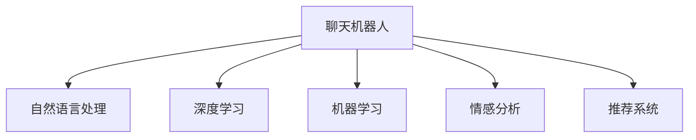

                 

# 聊天机器人宠物行业：宠物健康和行为监测

> 关键词：聊天机器人, 宠物健康, 行为监测, 自然语言处理(NLP), 深度学习, 机器学习, 情感分析, 推荐系统

## 1. 背景介绍

随着互联网和人工智能技术的飞速发展，宠物行业正逐步迎来智能化、数字化的转型。宠物健康和行为监测，作为宠物行业的重要分支，在提升用户体验、降低经营成本方面具有巨大潜力。聊天机器人技术，凭借其即时交互、智能答疑、个性化推荐等特点，已成为宠物健康和行为监测领域的重要工具。

### 1.1 问题由来
近年来，宠物数量在全球范围内显著增加，宠物主人对宠物健康和行为监测的需求也随之增长。然而，宠物主人普遍缺乏专业知识和经验，无法有效监测宠物的健康状况和行为表现。此时，聊天机器人技术的介入，为宠物主人提供了便捷、可靠的健康和行为监测途径。

### 1.2 问题核心关键点
宠物健康和行为监测的聊天机器人，通常利用自然语言处理(NLP)技术，通过与宠物主人和宠物的互动，获取和分析相关数据，从而提供健康建议、行为指导等服务。其核心在于：
- 如何高效采集和理解宠物主人和宠物的对话内容。
- 如何通过深度学习和机器学习算法，对对话数据进行分析和推理。
- 如何针对不同宠物主人的需求，提供个性化的健康和行为建议。

## 2. 核心概念与联系

### 2.1 核心概念概述

为更好地理解宠物健康和行为监测的聊天机器人，本节将介绍几个密切相关的核心概念：

- 聊天机器人(Chatbot)：基于NLP技术的自动化对话系统，能够模仿人类对话，解答问题，提供建议。
- 自然语言处理(NLP)：通过计算机自动化处理、理解和生成人类语言，使机器能够理解用户意图和提供智能回答。
- 深度学习(Deep Learning)：一种基于神经网络的高效学习范式，通过多层神经网络结构，自动学习和提取数据特征。
- 机器学习(Machine Learning)：一种通过数据和算法自动提升模型性能的技术，广泛应用于模式识别、分类、回归等领域。
- 情感分析(Affective Analysis)：分析文本中的情感倾向，如积极、消极、中性等，以了解用户的情绪状态。
- 推荐系统(Recommendation System)：通过用户行为和偏好数据，自动推荐相关产品或服务，提升用户体验。

这些核心概念之间的逻辑关系可以通过以下Mermaid流程图来展示：



这个流程图展示了几大核心概念之间的关联性：

1. 聊天机器人通过NLP技术处理用户输入，理解用户意图。
2. 深度学习用于自动提取和处理输入数据，以提升模型的复杂度和精度。
3. 机器学习通过不断学习用户反馈，持续优化机器人表现。
4. 情感分析用于识别用户情绪，个性化调整机器人输出。
5. 推荐系统根据用户历史行为，推荐相关服务或产品。

这些概念共同构成了聊天机器人在宠物健康和行为监测中的应用基础，为其提供智能化、个性化服务奠定了技术基础。

## 3. 核心算法原理 & 具体操作步骤
### 3.1 算法原理概述

基于聊天机器人的宠物健康和行为监测，其核心算法原理主要包括以下几个步骤：

1. **意图识别与情感分析**：利用NLP技术，分析用户输入的自然语言，识别用户意图和情感倾向，如宠物健康咨询、行为观察等。
2. **数据采集与特征提取**：通过深度学习模型，自动提取用户输入中的关键信息，如宠物症状、行为特征等。
3. **模型训练与推理**：基于采集到的数据和历史数据，使用机器学习算法训练模型，生成健康建议和行为监测方案。
4. **推荐系统集成**：结合推荐算法，根据用户历史行为和偏好，推荐相关产品和服务，如宠物健康产品、保健建议等。

### 3.2 算法步骤详解

基于聊天机器人的宠物健康和行为监测，具体算法步骤可分解为以下几个环节：

**Step 1: 数据准备**
- 收集并标注宠物健康和行为相关的对话数据，如症状描述、行为异常等。
- 整理和清洗数据，去除噪音和无效样本。

**Step 2: 意图识别与情感分析**
- 使用意图识别模型（如Seq2Seq模型、Transformer模型等），对用户输入的自然语言进行解析，识别出宠物健康咨询、行为观察等意图。
- 使用情感分析模型（如BERT、LSTM等），识别用户输入中的情感倾向，如积极、消极、中性等，以便调整回答策略。

**Step 3: 特征提取与数据处理**
- 利用深度学习模型（如卷积神经网络、循环神经网络等），自动提取用户输入中的关键特征，如症状、行为等。
- 将提取到的特征进行向量化处理，生成模型输入数据。

**Step 4: 模型训练与推理**
- 使用机器学习算法（如随机森林、梯度提升等），在标注数据上训练预测模型，生成健康建议和行为监测方案。
- 将训练好的模型应用于新数据，生成输出结果。

**Step 5: 推荐系统集成**
- 结合用户历史行为和偏好数据，使用推荐算法（如协同过滤、内容推荐等），推荐相关产品和服务。
- 将推荐结果反馈给用户，进一步优化聊天机器人的回答策略。

### 3.3 算法优缺点

基于聊天机器人的宠物健康和行为监测具有以下优点：
1. **实时互动**：通过即时对话，实时获取用户需求和反馈，快速响应用户问题。
2. **数据驱动**：利用大数据分析和机器学习技术，提供科学、准确的建议。
3. **用户友好**：以自然语言交流为主，无需复杂操作，用户体验友好。
4. **个性化推荐**：根据用户历史行为和偏好，提供个性化健康建议和服务。

同时，该方法也存在以下缺点：
1. **数据隐私问题**：用户的对话数据涉及隐私信息，数据收集和处理需严格遵守隐私法规。
2. **模型鲁棒性**：在处理不同用户输入时，模型可能存在鲁棒性不足，影响输出准确性。
3. **知识局限性**：模型依赖于已有的训练数据，无法应对未知情况，可能存在知识局限。
4. **成本问题**：开发和维护聊天机器人需耗费大量人力、物力、财力。
5. **过度依赖**：用户可能对聊天机器人产生依赖，忽略专业医生的建议。

尽管存在这些局限性，但基于聊天机器人的宠物健康和行为监测方法，在用户需求日益增长的背景下，仍具有广阔的应用前景。

### 3.4 算法应用领域

基于聊天机器人的宠物健康和行为监测，已在多个宠物健康和行为监测场景中得到应用，例如：

- **宠物健康咨询**：回答宠物主人关于宠物健康问题的疑问，提供日常护理建议。
- **宠物行为监测**：分析宠物行为异常，识别宠物情绪和健康状况，提供行为矫正方案。
- **宠物行为训练**：基于自然语言指令，指导宠物主人进行宠物行为训练。
- **宠物产品推荐**：结合用户历史行为和偏好，推荐适合的宠物产品，如狗粮、玩具等。
- **宠物医院预约**：帮助宠物主人进行医院预约、挂号，提升医院服务效率。
- **宠物健康提醒**：定期提醒宠物主人进行宠物健康检查，预防疾病。

除了上述这些经典应用外，基于聊天机器人的宠物健康和行为监测，还可以扩展到宠物心理分析、宠物行为预测等领域，为宠物主人提供更为全面的服务支持。

## 4. 数学模型和公式 & 详细讲解 & 举例说明

### 4.1 数学模型构建

在宠物健康和行为监测的聊天机器人中，主要涉及的数学模型包括意图识别模型、情感分析模型、特征提取模型和推荐模型。

**意图识别模型**：使用Seq2Seq模型或Transformer模型，通过编码器-解码器结构，对用户输入的自然语言进行解析，识别意图。

**情感分析模型**：使用BERT模型或LSTM模型，对用户输入的自然语言进行情感分析，识别情感倾向。

**特征提取模型**：使用卷积神经网络(CNN)或循环神经网络(RNN)，自动提取用户输入中的关键特征，如症状、行为等。

**推荐模型**：使用协同过滤算法或内容推荐算法，根据用户历史行为和偏好，推荐相关产品和服务。

### 4.2 公式推导过程

以下以Seq2Seq模型为例，介绍意图识别模型的基本公式和推导过程。

假设用户输入的自然语言为 $x=(\text{Symptom, Behavior})$，意图识别模型为 $M_{\theta}$，其结构如图：

```mermaid
graph TB
    A[x] --> B[Encoder]
    B --> C[Decoder]
    C --> D[M_{\theta}]
```

其中，$x$ 表示用户输入的自然语言；$Encoder$ 为编码器，将输入转换为固定长度的向量表示；$Decoder$ 为解码器，将向量表示转换为意图标签；$M_{\theta}$ 为模型参数。

模型训练的目标是最大化似然函数：

$$
\mathcal{L}(\theta) = -\frac{1}{N}\sum_{i=1}^N \log P(Y_i|X_i)
$$

其中 $N$ 为样本数量，$X_i$ 为第 $i$ 个样本的输入，$Y_i$ 为第 $i$ 个样本的意图标签，$P(Y_i|X_i)$ 为在输入 $X_i$ 条件下，意图标签 $Y_i$ 的概率分布。

为了训练意图识别模型，需要最小化损失函数 $\mathcal{L}(\theta)$。采用反向传播算法，计算损失函数对模型参数 $\theta$ 的梯度：

$$
\frac{\partial \mathcal{L}(\theta)}{\partial \theta} = \frac{\partial \log P(Y_i|X_i)}{\partial \theta}
$$

通过反向传播算法，更新模型参数，不断优化意图识别模型。

### 4.3 案例分析与讲解

以宠物健康咨询为例，假设某宠物主人输入的自然语言为：

```
我的狗狗最近总是咳嗽，你怎么看？
```

**意图识别模型**：首先通过编码器将输入转换为固定长度的向量表示，然后使用解码器生成意图标签。假设模型预测该输入的意图为“宠物健康咨询”，则意图识别模型的输出为：

```
Pet Health Consultation
```

**情感分析模型**：接下来使用情感分析模型，识别用户输入中的情感倾向。假设模型预测该输入为“中性”情感，则情感分析模型的输出为：

```
Neutral
```

**特征提取模型**：基于意图和情感分析的结果，利用深度学习模型提取输入中的关键特征。假设模型从“咳嗽”这一症状中提取出“呼吸系统疾病”这一特征，则特征提取模型的输出为：

```
Respiratory Disease
```

**推荐模型**：最后，结合用户历史行为和偏好数据，使用推荐算法推荐相关产品和服务。假设模型根据用户历史行为推荐“犬咳嗽护理用品”，则推荐系统的输出为：

```
推荐商品：犬咳嗽护理用品
```

通过上述步骤，聊天机器人能够根据用户输入的自然语言，进行意图识别、情感分析、特征提取和推荐，提供科学、个性化的健康建议和服务。

## 5. 项目实践：代码实例和详细解释说明

### 5.1 开发环境搭建

在进行宠物健康和行为监测的聊天机器人开发前，我们需要准备好开发环境。以下是使用Python进行TensorFlow开发的环境配置流程：

1. 安装Anaconda：从官网下载并安装Anaconda，用于创建独立的Python环境。

2. 创建并激活虚拟环境：
```bash
conda create -n pet_chatbot python=3.8 
conda activate pet_chatbot
```

3. 安装TensorFlow：根据CUDA版本，从官网获取对应的安装命令。例如：
```bash
conda install tensorflow-gpu -c pytorch -c conda-forge
```

4. 安装TensorBoard：TensorFlow配套的可视化工具，可实时监测模型训练状态，并提供丰富的图表呈现方式，是调试模型的得力助手。

5. 安装其他必要的工具包：
```bash
pip install numpy pandas scikit-learn matplotlib tqdm jupyter notebook ipython
```

完成上述步骤后，即可在`pet_chatbot`环境中开始开发实践。

### 5.2 源代码详细实现

下面我们以宠物健康咨询为例，给出使用TensorFlow构建意图识别模型的PyTorch代码实现。

首先，定义意图识别模型的结构和参数：

```python
import tensorflow as tf
from tensorflow.keras.layers import Input, LSTM, Dense
from tensorflow.keras.models import Model

# 定义模型结构
inputs = Input(shape=(None, ), name='input')
encoder = LSTM(128, return_sequences=True)(inputs)
outputs = Dense(3, activation='softmax')(encoder)
model = Model(inputs, outputs)
model.compile(optimizer='adam', loss='categorical_crossentropy', metrics=['accuracy'])

# 显示模型结构
model.summary()
```

然后，定义意图识别模型的训练函数：

```python
def train_model(model, X_train, y_train, X_valid, y_valid, epochs=5, batch_size=32):
    # 定义训练集和验证集
    train_dataset = tf.data.Dataset.from_tensor_slices((X_train, y_train)).shuffle(10000).batch(batch_size)
    valid_dataset = tf.data.Dataset.from_tensor_slices((X_valid, y_valid)).batch(batch_size)

    # 定义训练循环
    history = model.fit(train_dataset, validation_data=valid_dataset, epochs=epochs, verbose=1)
    
    # 保存模型
    model.save('pet_health_chatbot.h5')

# 调用训练函数
train_model(model, X_train, y_train, X_valid, y_valid)
```

最后，启动训练流程：

```python
X_train, y_train = ...
X_valid, y_valid = ...
train_model(model, X_train, y_train, X_valid, y_valid)
```

以上就是使用TensorFlow构建意图识别模型的完整代码实现。可以看到，TensorFlow提供了丰富的深度学习组件，方便开发者构建和训练复杂的神经网络模型。

### 5.3 代码解读与分析

让我们再详细解读一下关键代码的实现细节：

**模型结构定义**：
- `inputs` 为模型输入，表示用户输入的自然语言，长度不定。
- `encoder` 为LSTM编码器，将输入转换为固定长度的向量表示。
- `outputs` 为Dense解码器，将向量表示转换为意图标签。
- `model` 为完整的意图识别模型，包含输入、编码器和解码器。

**模型编译**：
- 使用Adam优化器进行模型参数的更新。
- 损失函数为交叉熵损失，用于衡量模型输出和真实标签之间的差异。
- 性能指标为准确率，用于评估模型的分类能力。

**训练函数定义**：
- `train_dataset` 为训练集的TensorFlow数据集，包含用户输入的自然语言和意图标签。
- `valid_dataset` 为验证集的TensorFlow数据集。
- `epochs` 为训练轮数，`batch_size` 为批次大小。
- 使用`fit`方法进行模型训练，同时使用`validation_data`参数指定验证集。
- `save`方法用于保存训练好的模型，以便后续使用。

**模型训练启动**：
- 调用`train_model`函数，传入训练集、验证集和训练参数。

在实际应用中，需要进一步扩展模型结构，添加更多的训练和评估函数，以应对更复杂的宠物健康和行为监测场景。

## 6. 实际应用场景
### 6.1 智能客服系统

基于聊天机器人的宠物健康和行为监测，可以广泛应用于智能客服系统的构建。传统的客服系统往往需要配备大量人力，高峰期响应缓慢，且一致性和专业性难以保证。使用基于聊天机器人的智能客服，可以7x24小时不间断服务，快速响应客户咨询，用自然流畅的语言解答各类宠物健康和行为问题。

在技术实现上，可以收集企业内部的历史宠物健康和行为咨询记录，将常见问题与解决方案构建成监督数据，在此基础上对预训练模型进行微调。微调后的模型能够自动理解用户意图，匹配最合适的解决方案进行回复。对于用户提出的新问题，还可以接入检索系统实时搜索相关内容，动态组织生成回答。如此构建的智能客服系统，能大幅提升用户咨询体验和问题解决效率。

### 6.2 宠物医院预约系统

聊天机器人还可以与宠物医院合作，提供预约、挂号、查询等服务。通过聊天机器人，宠物主人可以方便快捷地进行医院预约，查看医生排班，了解候诊时间。同时，机器人还可以根据宠物健康状况，推荐合适的医生和检查项目，提升医院的预约效率和服务质量。

### 6.3 宠物行为监测系统

基于聊天机器人的行为监测系统，可以通过宠物主人的日常对话，分析宠物的行为表现和健康状况。通过识别宠物主人描述的行为异常，如啃咬家具、夜间嚎叫等，机器人可以提醒宠物主人进行行为矫正，预防潜在的行为问题。

### 6.4 宠物产品推荐系统

聊天机器人还可以结合用户历史行为和偏好数据，推荐适合的宠物产品。例如，通过分析用户对话中提及的宠物用品，推荐适合的品牌和产品，提升用户体验和满意度。

### 6.5 宠物心理分析系统

基于聊天机器人的心理分析系统，可以识别宠物主人的情绪状态，提供心理支持和建议。例如，通过分析用户对话中的情绪倾向，机器人可以提供安抚和支持，帮助宠物主人缓解压力。

### 6.6 未来应用展望

随着聊天机器人技术的不断进步，基于其宠物健康和行为监测的应用场景将进一步拓展。未来，聊天机器人有望在宠物行为预测、宠物行为训练、宠物健康管理等领域发挥更大作用。例如：

- 宠物行为预测：通过分析宠物主人的日常行为和对话，预测宠物的行为趋势，提前做好预防措施。
- 宠物行为训练：基于自然语言指令，指导宠物主人进行宠物行为训练，提升宠物行为规范性。
- 宠物健康管理：通过日常对话，提醒宠物主人进行宠物健康检查，预防疾病。

## 7. 工具和资源推荐
### 7.1 学习资源推荐

为了帮助开发者系统掌握基于聊天机器人的宠物健康和行为监测的理论基础和实践技巧，这里推荐一些优质的学习资源：

1. 《深度学习与自然语言处理》系列博文：由大模型技术专家撰写，深入浅出地介绍了深度学习、自然语言处理的基本概念和经典模型。

2. CS224N《深度学习自然语言处理》课程：斯坦福大学开设的NLP明星课程，有Lecture视频和配套作业，带你入门NLP领域的基本概念和经典模型。

3. 《TensorFlow深度学习教程》书籍：TensorFlow官方推荐书籍，全面介绍了TensorFlow的使用方法和应用案例。

4. HuggingFace官方文档：提供了丰富的预训练语言模型和TensorFlow教程，适合初学者入门。

5. 《自然语言处理入门》课程：Coursera平台提供的入门级NLP课程，讲解NLP的基本原理和应用。

通过对这些资源的学习实践，相信你一定能够快速掌握基于聊天机器人的宠物健康和行为监测的精髓，并用于解决实际的宠物健康和行为监测问题。

### 7.2 开发工具推荐

高效的开发离不开优秀的工具支持。以下是几款用于宠物健康和行为监测聊天机器人开发的常用工具：

1. TensorFlow：基于Python的开源深度学习框架，灵活动态的计算图，适合快速迭代研究。提供丰富的深度学习组件和优化器，支持TensorBoard可视化。

2. PyTorch：基于Python的开源深度学习框架，灵活、易用，适合动态计算图和快速实验。支持TensorBoard和Jupyter Notebook等工具。

3. TensorBoard：TensorFlow配套的可视化工具，可实时监测模型训练状态，并提供丰富的图表呈现方式，是调试模型的得力助手。

4. Weights & Biases：模型训练的实验跟踪工具，可以记录和可视化模型训练过程中的各项指标，方便对比和调优。与主流深度学习框架无缝集成。

5. Jupyter Notebook：交互式编程环境，支持代码执行、数据可视化等，适合实验和数据探索。

合理利用这些工具，可以显著提升宠物健康和行为监测聊天机器人的开发效率，加快创新迭代的步伐。

### 7.3 相关论文推荐

宠物健康和行为监测聊天机器人涉及的自然语言处理、深度学习和推荐系统等多个领域，以下是几篇奠基性的相关论文，推荐阅读：

1. Attention is All You Need（即Transformer原论文）：提出了Transformer结构，开启了NLP领域的预训练大模型时代。

2. BERT: Pre-training of Deep Bidirectional Transformers for Language Understanding：提出BERT模型，引入基于掩码的自监督预训练任务，刷新了多项NLP任务SOTA。

3. Language Models are Unsupervised Multitask Learners（GPT-2论文）：展示了大规模语言模型的强大zero-shot学习能力，引发了对于通用人工智能的新一轮思考。

4. Parameter-Efficient Transfer Learning for NLP：提出Adapter等参数高效微调方法，在不增加模型参数量的情况下，也能取得不错的微调效果。

5. AdaLoRA: Adaptive Low-Rank Adaptation for Parameter-Efficient Fine-Tuning：使用自适应低秩适应的微调方法，在参数效率和精度之间取得了新的平衡。

6. Adam: A Method for Stochastic Optimization：介绍Adam优化器，目前广泛用于深度学习模型的优化。

这些论文代表了大语言模型微调技术的发展脉络。通过学习这些前沿成果，可以帮助研究者把握学科前进方向，激发更多的创新灵感。

## 8. 总结：未来发展趋势与挑战

### 8.1 总结

本文对基于聊天机器人的宠物健康和行为监测方法进行了全面系统的介绍。首先阐述了宠物健康和行为监测的聊天机器人背景和意义，明确了聊天机器人在宠物健康和行为监测中的应用价值。其次，从原理到实践，详细讲解了聊天机器人在宠物健康和行为监测中的核心算法原理和具体操作步骤，给出了完整代码实例。同时，本文还广泛探讨了聊天机器人在智能客服、宠物医院预约、宠物行为监测等多个行业领域的应用前景，展示了聊天机器人的巨大潜力。此外，本文精选了聊天机器人技术的各类学习资源，力求为读者提供全方位的技术指引。

通过本文的系统梳理，可以看到，基于聊天机器人的宠物健康和行为监测技术正在成为宠物健康和行为监测领域的重要范式，极大地拓展了宠物健康和行为监测应用的智能化水平，提升了用户体验和医院服务效率。未来，伴随聊天机器人技术的不断发展，其在宠物健康和行为监测中的应用将更加广泛，为宠物行业带来更智能、更便捷、更个性化的服务。

### 8.2 未来发展趋势

展望未来，基于聊天机器人的宠物健康和行为监测技术将呈现以下几个发展趋势：

1. **智能化水平提升**：随着深度学习和大数据技术的发展，聊天机器人的智能化水平将进一步提升，能够更加精准地理解用户意图，提供个性化服务。
2. **多模态融合**：未来聊天机器人将更多地融合视觉、听觉等多模态信息，提升其对现实世界的理解能力。
3. **跨领域应用拓展**：聊天机器人将在更多领域得到应用，如宠物行为预测、宠物行为训练、宠物心理分析等，为宠物主人提供更全面的服务支持。
4. **语音交互普及**：随着语音识别技术的进步，基于语音的聊天机器人将逐渐普及，带来更自然的交互体验。
5. **情感计算提升**：聊天机器人将通过情感分析技术，识别用户情绪，提供更为贴心的服务。
6. **模型迁移学习**：未来聊天机器人将通过迁移学习，在更少标注数据的情况下，快速适应新场景，提升模型的泛化能力。

以上趋势凸显了基于聊天机器人的宠物健康和行为监测技术的广阔前景。这些方向的探索发展，必将进一步提升聊天机器人的智能化水平和用户体验，为宠物行业带来更高效、更便捷的服务。

### 8.3 面临的挑战

尽管基于聊天机器人的宠物健康和行为监测技术已经取得了瞩目成就，但在迈向更加智能化、普适化应用的过程中，仍面临诸多挑战：

1. **数据隐私问题**：用户的对话数据涉及隐私信息，数据收集和处理需严格遵守隐私法规。
2. **模型鲁棒性不足**：在处理不同用户输入时，模型可能存在鲁棒性不足，影响输出准确性。
3. **知识局限性**：模型依赖于已有的训练数据，无法应对未知情况，可能存在知识局限。
4. **成本问题**：开发和维护聊天机器人需耗费大量人力、物力、财力。
5. **过度依赖**：用户可能对聊天机器人产生依赖，忽略专业医生的建议。

尽管存在这些局限性，但基于聊天机器人的宠物健康和行为监测方法，在用户需求日益增长的背景下，仍具有广阔的应用前景。未来，通过技术进步和政策支持，这些挑战有望逐步得到解决，聊天机器人将在宠物健康和行为监测中发挥更大作用。

### 8.4 研究展望

面对基于聊天机器人的宠物健康和行为监测所面临的挑战，未来的研究需要在以下几个方面寻求新的突破：

1. **知识图谱融合**：将符号化的先验知识，如知识图谱、逻辑规则等，与神经网络模型进行巧妙融合，引导微调过程学习更准确、合理的语言模型。
2. **跨模态融合**：将视觉、听觉等多模态信息与文本信息进行协同建模，提升聊天机器人的多模态理解能力。
3. **个性化推荐**：结合用户历史行为和偏好数据，提供更为个性化的健康建议和服务。
4. **情感计算**：利用情感分析技术，识别用户情绪，提供更为贴心的服务。
5. **隐私保护**：探索如何在保护用户隐私的前提下，最大化利用用户数据，提升聊天机器人的智能化水平。
6. **模型迁移学习**：通过迁移学习，在更少标注数据的情况下，快速适应新场景，提升模型的泛化能力。

这些研究方向的探索，必将引领基于聊天机器人的宠物健康和行为监测技术迈向更高的台阶，为构建安全、可靠、可解释、可控的智能系统铺平道路。面向未来，基于聊天机器人的宠物健康和行为监测技术还需要与其他人工智能技术进行更深入的融合，如知识表示、因果推理、强化学习等，多路径协同发力，共同推动自然语言理解和智能交互系统的进步。只有勇于创新、敢于突破，才能不断拓展聊天机器人的边界，让智能技术更好地造福宠物行业。

## 9. 附录：常见问题与解答

**Q1：基于聊天机器人的宠物健康和行为监测方法是否适用于所有宠物健康和行为监测场景？**

A: 基于聊天机器人的宠物健康和行为监测方法在大多数宠物健康和行为监测场景中都能取得不错的效果，特别是对于数据量较小的场景。但对于一些特定领域的场景，如动物行为学研究等，可能需要更专业的数据和模型，才能达到理想的效果。

**Q2：如何优化基于聊天机器人的宠物健康和行为监测模型的性能？**

A: 优化基于聊天机器人的宠物健康和行为监测模型的性能，可以从以下几个方面入手：
1. **数据增强**：通过数据增强技术，如回译、近义替换等方式扩充训练集，提升模型泛化能力。
2. **模型调参**：使用适当的超参数调优技术，如网格搜索、贝叶斯优化等，寻找最优的模型参数。
3. **多任务学习**：将多个相关任务组合成联合训练任务，提升模型的整体性能。
4. **知识融合**：将知识图谱、逻辑规则等先验知识与模型融合，提升模型的知识表示能力。
5. **模型集成**：将多个模型的输出进行融合，提升模型的鲁棒性和准确性。

**Q3：如何保护聊天机器人在宠物健康和行为监测中的数据隐私？**

A: 保护聊天机器人在宠物健康和行为监测中的数据隐私，可以从以下几个方面入手：
1. **匿名化处理**：对用户对话数据进行匿名化处理，去除敏感信息。
2. **数据加密**：对传输和存储的数据进行加密，防止数据泄露。
3. **隐私保护算法**：使用隐私保护算法，如差分隐私、联邦学习等，保护用户数据隐私。
4. **用户授权**：在收集用户数据前，明确告知用户数据使用方式，获取用户授权。

**Q4：基于聊天机器人的宠物健康和行为监测在哪些宠物医院得到了应用？**

A: 基于聊天机器人的宠物健康和行为监测在多个宠物医院中得到了应用。例如：
1. 宠物健康咨询：帮助宠物主人解答关于宠物健康和行为的问题，提供日常护理建议。
2. 医院预约：帮助宠物主人进行医院预约、挂号，提升医院服务效率。
3. 行为监测：通过分析宠物行为异常，识别宠物情绪和健康状况，提供行为矫正方案。
4. 产品推荐：根据用户历史行为和偏好数据，推荐适合的宠物产品，提升用户体验和满意度。

**Q5：未来基于聊天机器人的宠物健康和行为监测将如何发展？**

A: 未来基于聊天机器人的宠物健康和行为监测将进一步发展，主要包括以下几个方面：
1. **智能化水平提升**：随着深度学习和大数据技术的发展，聊天机器人的智能化水平将进一步提升，能够更加精准地理解用户意图，提供个性化服务。
2. **多模态融合**：未来聊天机器人将更多地融合视觉、听觉等多模态信息，提升其对现实世界的理解能力。
3. **跨领域应用拓展**：聊天机器人将在更多领域得到应用，如宠物行为预测、宠物行为训练、宠物心理分析等，为宠物主人提供更全面的服务支持。
4. **语音交互普及**：随着语音识别技术的进步，基于语音的聊天机器人将逐渐普及，带来更自然的交互体验。
5. **情感计算提升**：聊天机器人将通过情感分析技术，识别用户情绪，提供更为贴心的服务。
6. **模型迁移学习**：通过迁移学习，在更少标注数据的情况下，快速适应新场景，提升模型的泛化能力。

这些方向的发展，将进一步提升基于聊天机器人的宠物健康和行为监测技术的智能化水平和用户体验，为宠物行业带来更高效、更便捷的服务。

---

作者：禅与计算机程序设计艺术 / Zen and the Art of Computer Programming

