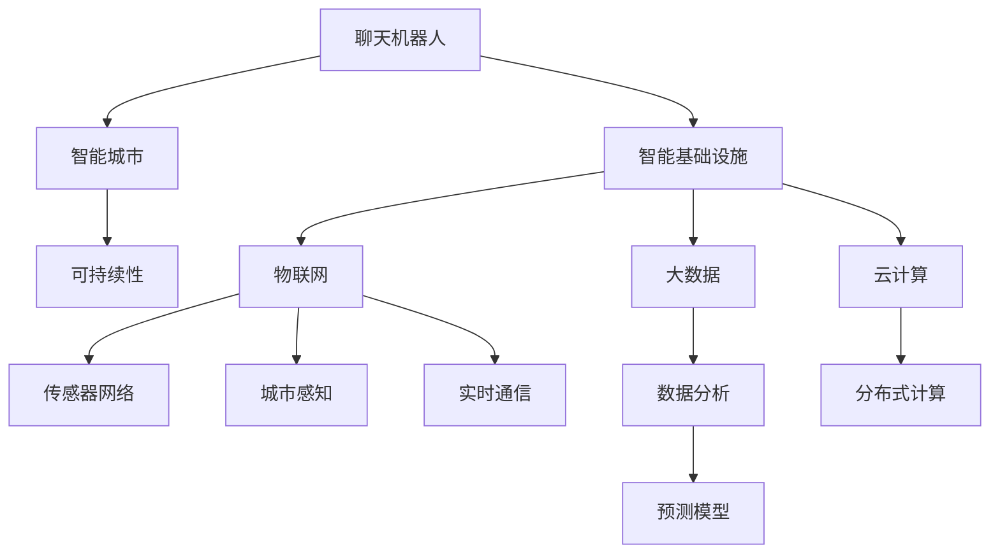

                 

# 聊天机器人未来城市：智能基础设施和可持续发展

> 关键词：聊天机器人,智能城市,智能基础设施,可持续性,物联网,人工智能

## 1. 背景介绍

### 1.1 问题由来
随着全球人口的持续增长和城市化进程的加速，城市在管理、治理、服务等方面面临越来越大的挑战。传统的城市管理方式，如基于人工的交通管制、垃圾清运、公共安全监控等，已经难以满足现代城市的需求。

智能城市（Smart City）的概念应运而生，通过部署先进的信息通信技术、数据挖掘和人工智能算法，实现城市运行的全方位智能化。其中，聊天机器人作为智能基础设施的重要组成部分，在城市管理和服务中扮演着越来越重要的角色。

### 1.2 问题核心关键点
聊天机器人能够实现实时互动，为用户提供精准、高效的智能服务，是推动智能城市发展的重要技术手段。在实际应用中，聊天机器人可以帮助市民查询信息、处理事务、反馈建议，并逐步实现更加深入的智能化应用。

然而，在构建智能城市时，聊天机器人也面临诸多挑战。如何保障其安全性、隐私性、可扩展性，实现与物联网（IoT）、大数据、云计算等技术的深度融合，将是构建未来城市智能基础设施的关键问题。

## 2. 核心概念与联系

### 2.1 核心概念概述

为更好地理解聊天机器人在智能城市中的应用，本节将介绍几个密切相关的核心概念：

- **聊天机器人**：利用自然语言处理（NLP）和人工智能技术，实现人与计算机之间的自然语言交流的计算机程序。
- **智能城市**：通过融合物联网、大数据、云计算、人工智能等技术，实现城市运行的高效、智能、可持续管理。
- **智能基础设施**：将人工智能、物联网等技术与城市基础设施结合，提升城市运行效率和智能化水平。
- **可持续性**：指在智能城市建设过程中，通过技术手段实现资源的高效利用、环境的友好保护，促进经济、社会、环境的协调发展。

这些核心概念之间的逻辑关系可以通过以下Mermaid流程图来展示：



这个流程图展示了聊天机器人与智能城市、智能基础设施等概念之间的联系：

1. 聊天机器人通过与市民互动，获取实时数据和需求。
2. 这些数据和需求通过物联网设备实时采集和传输。
3. 大数据平台对数据进行存储和分析，实现数据的价值最大化。
4. 云计算平台提供计算资源，支持大规模数据处理和模型训练。
5. 智能基础设施通过这些技术手段实现高效运行和智能管理。
6. 通过可持续性设计，智能城市在发展中兼顾环境保护和资源节约。

## 3. 核心算法原理 & 具体操作步骤
### 3.1 算法原理概述

聊天机器人在智能城市中的核心算法原理，是基于自然语言处理和人工智能技术，实现人与计算机之间的自然语言交互。其核心步骤包括：

1. **文本预处理**：对用户输入的自然语言文本进行分词、词性标注、实体识别等预处理操作，转换为模型能够处理的格式。
2. **意图识别**：通过意图识别模型，判断用户的输入意图，确定需要进行的任务类型（如查询、预约、投诉等）。
3. **任务执行**：根据用户的意图，执行相应的任务处理逻辑，如查询相关信息、生成回复、完成事务处理等。
4. **对话管理**：通过对话管理模块，跟踪对话状态，管理对话上下文，确保交互过程的连贯性和一致性。
5. **多模态融合**：将语音、图像、视频等多种模态数据与文本数据结合，提升交互的自然性和互动性。

### 3.2 算法步骤详解

聊天机器人的具体实现流程如下：

1. **数据采集**：通过物联网设备采集城市基础设施运行数据，包括交通流量、水质、环境监测等。
2. **数据预处理**：对采集的数据进行清洗、去重、特征提取等预处理操作，转换为可用于模型训练的格式。
3. **模型训练**：使用大规模语料库和标注数据，训练意图识别和任务执行模型。
4. **模型部署**：将训练好的模型部署到云端服务器或边缘设备，实现实时交互和响应。
5. **持续优化**：根据用户反馈和实时数据，不断优化模型参数和交互逻辑，提升用户体验。

### 3.3 算法优缺点

聊天机器人在智能城市中的应用具有以下优点：

1. **提升效率**：通过自动化处理市民的查询和反馈，显著提升城市管理的效率和响应速度。
2. **降低成本**：减少人工客服的人力成本，提高服务覆盖面和响应速度。
3. **增强互动性**：通过多模态交互，提升用户的服务体验和满意度。

同时，聊天机器人也存在以下缺点：

1. **复杂性高**：多模态交互和实时处理增加了系统的复杂度，容易引发性能瓶颈。
2. **隐私风险**：用户数据的收集和处理需要严格遵守隐私保护法规，防止数据泄露。
3. **依赖技术**：对技术的依赖性较高，需要持续的模型训练和系统维护。

### 3.4 算法应用领域

聊天机器人在智能城市中的应用领域包括：

1. **公共服务**：通过智能客服机器人，提供交通、医疗、教育等服务。
2. **城市管理**：处理市民投诉、城市运行监控、应急事件响应等。
3. **环境保护**：监测环境质量、收集市民反馈、宣传环保知识等。
4. **智能家居**：通过智能音箱、智能设备等，提供家居控制、智能助手等服务。
5. **智慧旅游**：提供旅游信息查询、景点推荐、在线购票等服务。

## 4. 数学模型和公式 & 详细讲解 & 举例说明
### 4.1 数学模型构建

聊天机器人的核心数学模型包括自然语言处理模型和任务执行模型。其中，自然语言处理模型的构建基于深度学习框架，如Transformer、LSTM等。任务执行模型通常基于规则引擎或强化学习等技术。

以BERT（Bidirectional Encoder Representations from Transformers）为例，其数学模型构建如下：

1. **编码器**：使用Transformer编码器，将输入文本转换为向量表示。
2. **池化层**：从向量表示中提取关键特征，用于后续的意图识别或任务处理。
3. **意图识别**：使用分类器对池化层输出进行分类，确定用户的输入意图。
4. **任务执行**：根据意图执行相应的任务逻辑，生成回复或完成事务处理。

### 4.2 公式推导过程

BERT模型中，编码器的输入为文本序列$(x_1, x_2, ..., x_n)$，输出为向量表示$(h_1, h_2, ..., h_n)$。公式推导过程如下：

$$
\text{Encoder}_{\theta}(x_i) = \text{Self-Attention}(h_{i-1}, x_i) + h_{i-1}
$$

其中$\text{Self-Attention}$为自注意力机制，$h_{i-1}$为前一时刻的隐藏状态。

意图识别的分类器通常使用softmax函数：

$$
\text{IntentClassifier}(h_i) = \text{softmax}(W_1 h_i + b_1)
$$

其中$W_1$和$b_1$为分类器的权重和偏置。

### 4.3 案例分析与讲解

以智能家居聊天机器人为例，其意图识别模型可以使用BERT进行训练，任务执行逻辑可以通过规则引擎或Python脚本实现。

假设有智能音箱A，用户输入语音指令“打开客厅的灯”，聊天机器人执行的流程如下：

1. **文本预处理**：将语音转换为文本，并进行分词、词性标注。
2. **意图识别**：使用BERT模型对文本进行编码，并分类判断用户意图为“打开灯”。
3. **任务执行**：根据用户意图，调用智能家居系统的API，控制客厅的灯光开启。
4. **对话管理**：在用户确认操作后，完成对话，提供进一步的服务建议。

## 5. 项目实践：代码实例和详细解释说明
### 5.1 开发环境搭建

在进行智能城市聊天机器人的开发前，需要准备好开发环境。以下是使用Python进行Flask框架开发的环境配置流程：

1. 安装Anaconda：从官网下载并安装Anaconda，用于创建独立的Python环境。

2. 创建并激活虚拟环境：
```bash
conda create -n chatbot-env python=3.8 
conda activate chatbot-env
```

3. 安装Flask：
```bash
pip install flask
```

4. 安装自然语言处理库：
```bash
pip install nltk
```

5. 安装语音识别库：
```bash
pip install pyaudio
```

完成上述步骤后，即可在`chatbot-env`环境中开始聊天机器人开发。

### 5.2 源代码详细实现

下面以智能家居聊天机器人为例，给出使用Flask和BERT进行开发的PyTorch代码实现。

```python
from flask import Flask, request, jsonify
from transformers import BertTokenizer, BertForTokenClassification
import pyaudio
import torch

app = Flask(__name__)

# 初始化BERT模型和分词器
model = BertForTokenClassification.from_pretrained('bert-base-cased', num_labels=2)
tokenizer = BertTokenizer.from_pretrained('bert-base-cased')

# 定义意图识别模型
def intent_recognition(input_text):
    encoded = tokenizer(input_text, return_tensors='pt')
    outputs = model(encoded['input_ids'], attention_mask=encoded['attention_mask'])
    logits = outputs.logits
    probs = torch.softmax(logits, dim=1)
    return probs.argmax().item()

# 定义任务执行模型
def task_execution(input_text):
    # 调用智能家居系统的API进行灯光控制
    # 此处为示例，实际应用中应替换为具体API调用逻辑
    return "灯光已开启"

# 定义音频采集函数
def record_audio():
    audio = pyaudio.PyAudio()
    stream = audio.open(format=pyaudio.paInt16, channels=1, rate=16000, input=True, frames_per_buffer=1024)
    frames = []
    while True:
        data = stream.read(1024)
        frames.append(data)
        if len(data) < 1024:
            break
    stream.stop_stream()
    stream.close()
    audio.terminate()
    return bytes(frames)

# 定义Flask应用
@app.route('/chatbot', methods=['POST'])
def chatbot():
    audio_data = request.form['audio_data']
    text = convert_audio_to_text(audio_data)
    intent = intent_recognition(text)
    response = task_execution(text)
    return jsonify({'response': response, 'intent': intent})

if __name__ == '__main__':
    app.run(debug=True)
```

这个代码实现了简单的智能家居聊天机器人，包括音频采集、意图识别、任务执行等功能。

### 5.3 代码解读与分析

让我们再详细解读一下关键代码的实现细节：

**Flask应用**：
- `Flask`是Python的轻量级Web框架，方便快速搭建Web应用。
- `request`模块用于处理HTTP请求，`jsonify`用于将Python数据转换为JSON格式。

**意图识别模型**：
- `intent_recognition`函数接收输入文本，使用BERT模型进行编码和分类，返回用户的意图标签。

**任务执行模型**：
- `task_execution`函数根据用户的意图，调用智能家居系统的API进行灯光控制。

**音频采集函数**：
- `record_audio`函数使用`pyaudio`库采集音频数据，并转换为文本输入到意图识别模型。

**Flask路由**：
- `/chatbot`路由接收音频数据，并将其转换为文本，识别用户意图，执行相应的任务，返回响应结果。

可以看到，聊天机器人的开发涉及多种技术的结合，从音频采集到文本处理、意图识别、任务执行，再到Web服务部署，每个环节都需要精心设计。

## 6. 实际应用场景

### 6.1 智能交通管理

智能交通管理是智能城市的重要组成部分，聊天机器人可以在此领域发挥重要作用。

通过部署智能聊天机器人，实时采集交通流量、运行状态等信息，提供交通查询、路线规划、事故报告等服务。同时，聊天机器人还能分析交通数据，预测交通流量趋势，优化交通信号灯控制，提升道路通行效率。

### 6.2 智能医疗服务

智能聊天机器人可以应用于智能医疗服务，提供医疗咨询、疾病预防、健康管理等服务。

通过与市民互动，聊天机器人可以收集用户的健康数据，进行疾病风险评估，提供个性化的健康建议。同时，聊天机器人还能实时监控市民的身体健康状况，及时发现异常并提醒就医，提高医疗服务的及时性和准确性。

### 6.3 智能教育平台

智能聊天机器人可以应用于智能教育平台，提供智能问答、学习辅导、课程推荐等服务。

通过与学生互动，聊天机器人可以实时解答学生的疑问，提供个性化学习建议，推荐适合的课程和教材。同时，聊天机器人还能分析学生的学习数据，识别学习难点和薄弱环节，提供针对性的辅导和支持，提升学生的学习效果。

### 6.4 未来应用展望

未来，聊天机器人在智能城市中的应用将更加广泛和深入。通过与物联网、大数据、云计算等技术的深度融合，聊天机器人将实现更加智能、高效、安全的服务。

1. **多模态交互**：结合语音、图像、视频等多种模态，提升用户体验和互动效果。
2. **实时感知**：通过传感器网络实时采集城市运行数据，实现对城市的全方位感知。
3. **深度学习**：结合深度学习技术，提升模型的智能水平和处理能力。
4. **边缘计算**：通过边缘计算技术，将计算和推理任务分散到设备端，提升系统的实时性和响应速度。
5. **隐私保护**：通过区块链、加密等技术，保障数据和交互的安全性和隐私性。

## 7. 工具和资源推荐
### 7.1 学习资源推荐

为了帮助开发者系统掌握聊天机器人在智能城市中的应用，这里推荐一些优质的学习资源：

1. **《Python深度学习》**：这本书由知名机器学习专家撰写，详细介绍了深度学习在自然语言处理中的应用。
2. **《TensorFlow实战》**：这本书由TensorFlow团队成员编写，介绍了TensorFlow在聊天机器人等应用中的实践案例。
3. **《Flask Web开发实战》**：这本书介绍了使用Flask框架开发Web应用的最佳实践。
4. **HuggingFace官方文档**：提供了丰富的自然语言处理模型和工具，方便开发者快速上手开发聊天机器人。
5. **Google Cloud AI Hub**：提供了大量的预训练模型和工具，方便开发者进行模型训练和部署。

通过对这些资源的学习实践，相信你一定能够快速掌握聊天机器人在智能城市中的应用，并用于解决实际的NLP问题。

### 7.2 开发工具推荐

高效的开发离不开优秀的工具支持。以下是几款用于聊天机器人开发的常用工具：

1. **PyTorch**：基于Python的深度学习框架，灵活高效，适合研究性开发。
2. **TensorFlow**：由Google主导的深度学习框架，生产部署方便，适合工程应用。
3. **Flask**：Python的轻量级Web框架，简单易用，方便快速搭建Web应用。
4. **pyaudio**：Python的音频处理库，支持音频数据的采集和处理。
5. **Google Colab**：谷歌提供的在线Jupyter Notebook环境，免费提供GPU/TPU算力，方便快速实验。

合理利用这些工具，可以显著提升聊天机器人的开发效率，加快创新迭代的步伐。

### 7.3 相关论文推荐

聊天机器人在智能城市中的应用源于学界的持续研究。以下是几篇奠基性的相关论文，推荐阅读：

1. **“Chatbots: A Survey”**：综述了聊天机器人的发展历程、核心技术和应用场景。
2. **“Smart City: Concepts, Methodologies, Tools and Applications”**：探讨了智能城市的技术框架和应用实践。
3. **“Natural Language Understanding and Processing”**：介绍了自然语言处理的最新进展和应用方向。
4. **“Speech and Language Processing”**：介绍了语音识别、文本处理等自然语言处理技术的最新进展。
5. **“Deep Learning for Natural Language Processing”**：介绍了深度学习在自然语言处理中的应用，包括聊天机器人的设计实现。

这些论文代表了大语言模型微调技术的发展脉络。通过学习这些前沿成果，可以帮助研究者把握学科前进方向，激发更多的创新灵感。

## 8. 总结：未来发展趋势与挑战

### 8.1 研究成果总结

本文对聊天机器人在智能城市中的应用进行了全面系统的介绍。首先阐述了聊天机器人与智能城市、智能基础设施等概念之间的联系，明确了聊天机器人在智能城市发展中的重要地位。其次，从算法原理到具体操作步骤，详细讲解了聊天机器人的实现流程，提供了完整的代码实例。同时，本文还广泛探讨了聊天机器人在智能交通管理、智能医疗服务、智能教育平台等多个领域的应用前景，展示了聊天机器人的巨大潜力。最后，本文精选了聊天机器人的学习资源、开发工具和相关论文，力求为读者提供全方位的技术指引。

通过本文的系统梳理，可以看到，聊天机器人在智能城市中的应用正处于快速发展阶段，必将成为未来城市智能化建设的重要组成部分。

### 8.2 未来发展趋势

展望未来，聊天机器人在智能城市中的应用将呈现以下几个发展趋势：

1. **多模态融合**：结合语音、图像、视频等多种模态数据，提升交互的自然性和互动效果。
2. **实时感知**：通过传感器网络实时采集城市运行数据，实现对城市的全方位感知。
3. **深度学习**：结合深度学习技术，提升模型的智能水平和处理能力。
4. **边缘计算**：通过边缘计算技术，将计算和推理任务分散到设备端，提升系统的实时性和响应速度。
5. **隐私保护**：通过区块链、加密等技术，保障数据和交互的安全性和隐私性。

### 8.3 面临的挑战

尽管聊天机器人在智能城市中的应用前景广阔，但在实现过程中仍面临诸多挑战：

1. **复杂性高**：多模态交互和实时处理增加了系统的复杂度，容易引发性能瓶颈。
2. **隐私风险**：用户数据的收集和处理需要严格遵守隐私保护法规，防止数据泄露。
3. **依赖技术**：对技术的依赖性较高，需要持续的模型训练和系统维护。
4. **标准化问题**：缺乏统一的标准和协议，不同设备和系统之间的交互存在困难。

### 8.4 研究展望

面对聊天机器人面临的这些挑战，未来的研究需要在以下几个方面寻求新的突破：

1. **优化算法**：开发更加高效的算法和数据结构，提升系统的实时性和响应速度。
2. **隐私保护**：研究隐私保护技术，保障用户数据的安全性和隐私性。
3. **标准化**：制定统一的标准和协议，促进不同设备和系统之间的互联互通。
4. **多模态融合**：研究多模态数据融合技术，提升系统的综合感知和理解能力。

这些研究方向的探索，必将引领聊天机器人技术迈向更高的台阶，为构建安全、可靠、可解释、可控的智能系统铺平道路。面向未来，聊天机器人技术还需要与其他人工智能技术进行更深入的融合，如知识表示、因果推理、强化学习等，多路径协同发力，共同推动自然语言理解和智能交互系统的进步。只有勇于创新、敢于突破，才能不断拓展语言模型的边界，让智能技术更好地造福人类社会。

## 9. 附录：常见问题与解答

**Q1：聊天机器人如何实现与物联网设备的交互？**

A: 聊天机器人可以通过API接口与物联网设备进行交互。具体而言，可以将聊天机器人与城市基础设施管理系统的API接口进行连接，实现对传感器、监控设备等的数据采集和控制。例如，通过聊天机器人进行语音命令控制城市灯光、交通信号灯等设备。

**Q2：聊天机器人在智能城市中的应用有哪些潜在风险？**

A: 聊天机器人在智能城市中的应用存在以下潜在风险：
1. **数据泄露**：用户数据的收集和处理需要严格遵守隐私保护法规，防止数据泄露。
2. **攻击风险**：聊天机器人可能受到黑客攻击，导致数据泄露或系统瘫痪。
3. **误判风险**：由于模型的复杂性和局限性，聊天机器人可能出现误判或错误操作。
4. **依赖性风险**：过度依赖聊天机器人可能导致人类操作技能的退化和依赖性增强。

**Q3：如何提高聊天机器人的可扩展性？**

A: 为了提高聊天机器人的可扩展性，可以采用以下策略：
1. **模块化设计**：将聊天机器人的不同组件（如意图识别、任务执行等）进行模块化设计，便于扩展和维护。
2. **接口标准化**：采用统一的标准化接口，方便不同设备和系统之间的交互。
3. **分布式部署**：采用分布式部署技术，将聊天机器人的不同功能模块部署到不同的服务器和设备上，提升系统的可扩展性和处理能力。

通过这些策略，可以显著提高聊天机器人的可扩展性，使其能够更好地适应复杂多变的应用场景。

**Q4：聊天机器人在智能城市中的应用需要考虑哪些伦理道德问题？**

A: 聊天机器人在智能城市中的应用需要考虑以下伦理道德问题：
1. **隐私保护**：保障用户数据的隐私性和安全性，防止数据泄露和滥用。
2. **公正性**：确保聊天机器人对所有用户公平公正，不出现歧视性或偏见性操作。
3. **透明性**：保障聊天机器人的决策过程透明，用户能够理解和信任其行为。
4. **责任归属**：明确聊天机器人的责任归属，防止出现不可控的负面后果。

通过综合考虑这些伦理道德问题，可以构建更加安全、可靠、可控的智能系统，保障用户权益和社会利益。

**Q5：如何构建聊天机器人的知识库？**

A: 构建聊天机器人的知识库需要以下步骤：
1. **数据收集**：收集与聊天机器人应用相关的各类知识数据，如产品信息、服务指南、常见问题解答等。
2. **数据清洗**：对数据进行清洗、去重、分类等操作，提升数据的质量和可用性。
3. **数据存储**：将清洗后的数据存储在知识库中，便于后续的检索和应用。
4. **知识图谱构建**：将知识库中的数据构建为知识图谱，形成结构化的知识结构。
5. **自然语言处理**：对知识库中的数据进行自然语言处理，实现与聊天机器人之间的无缝交互。

通过构建知识库，聊天机器人可以更好地理解用户的意图和需求，提供更加精准、高效的服务。

---

作者：禅与计算机程序设计艺术 / Zen and the Art of Computer Programming

