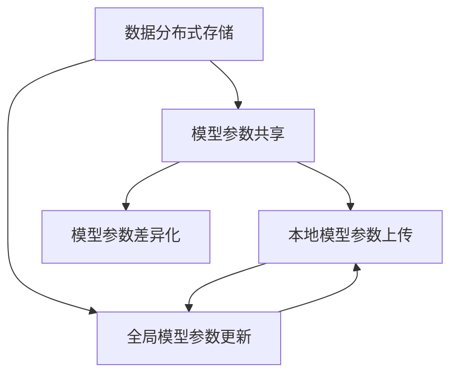

                 

# 联合学习：保护隐私的分布式机器学习

> 关键词：联合学习,联邦学习,分布式机器学习,隐私保护,数据安全,模型聚合,模型差异化

## 1. 背景介绍

### 1.1 问题由来
随着人工智能(AI)技术在医疗、金融、教育等众多领域的深入应用，大量数据被采集、存储和处理。这些数据中不仅包含与用户行为相关的个人信息，还可能涉及业务运营数据、隐私数据等敏感信息。如何在数据采集、存储和使用的各个环节保护用户隐私，成为AI系统设计和开发中的一个重要课题。

### 1.2 问题核心关键点
在隐私保护的背景下，分布式机器学习（Distributed Machine Learning, DML）成为了一种自然选择。DML允许数据分散在不同的设备或服务器上，通过模型参数共享和模型更新来协同训练模型，避免了数据的集中存储和传输。这不仅能提高模型性能，还能保障数据隐私。

联合学习（Federated Learning, FL）是DML的一种特殊形式，它强调在分布式系统中，各个节点通过本地数据训练模型，并在模型参数上协同更新，而无需将数据集直接传输到中央服务器。这种方法不仅保护了用户隐私，还提高了模型的泛化能力。

本文将重点讨论联合学习的方法原理、操作步骤以及应用场景，同时也会关注其在隐私保护、模型聚合、模型差异化等方面的优缺点，并提出一些改进建议和未来发展方向。

## 2. 核心概念与联系

### 2.1 核心概念概述

为更好地理解联合学习，首先需要明确几个关键概念：

- **分布式机器学习 (Distributed Machine Learning, DML)**：通过将模型分布在多个设备上，协同训练模型，从而提高训练效率和模型性能的一种技术。DML可以分为集中式和分布式两种形式，后者通过模型参数共享和更新进行协同训练。

- **联合学习 (Federated Learning, FL)**：一种特殊的分布式机器学习方法，各个节点（通常是移动设备或服务器）利用本地数据训练模型，并在模型参数上进行协同更新，而无需将数据集直接传输到中央服务器。FL旨在保护数据隐私，同时利用全局数据增强模型性能。

- **模型聚合 (Model Aggregation)**：在联合学习中，各个节点将自己的模型参数更新传输到中心服务器，中心服务器对这些参数进行聚合，生成全局模型参数，然后下发回各个节点进行下一轮训练。

- **模型差异化 (Model Differentiation)**：在联合学习中，每个节点利用本地数据训练模型，生成本地模型参数，并将其与全局模型参数进行差异化处理，从而实现个性化模型的训练。

这些概念之间的逻辑关系可以通过以下Mermaid流程图来展示：



这个流程图展示了联合学习的基本流程：数据分布在各个节点上，各个节点本地训练模型，通过模型参数共享和聚合，实现全局模型的更新和差异化。

## 3. 核心算法原理 & 具体操作步骤
### 3.1 算法原理概述

联合学习（FL）的基本原理是：各个节点在本地数据集上训练模型，并定期将模型参数传输到中心服务器进行聚合，然后反馈回各节点。这样，各节点可以利用本地数据训练模型，同时从全局模型中获益，从而提高模型的泛化能力。

联合学习的核心在于模型参数的共享和更新，其流程通常包括以下步骤：

1. **初始化全局模型**：在训练开始前，中心服务器初始化一个全局模型。
2. **本地模型训练**：每个节点在本地数据集上训练模型，生成本地模型参数。
3. **模型参数传输**：每个节点将自己的本地模型参数传输到中心服务器。
4. **模型参数聚合**：中心服务器对各个节点的模型参数进行聚合，生成全局模型参数。
5. **模型参数更新**：中心服务器将全局模型参数下发回各个节点，各节点利用更新后的全局模型参数进行下一轮训练。

### 3.2 算法步骤详解

以下是联合学习的基本算法步骤详解：

**Step 1: 初始化全局模型**

在联合学习开始前，中心服务器初始化一个全局模型 $\theta$。通常情况下，这个初始模型是通过在大规模数据集上预训练得到的。

**Step 2: 本地模型训练**

每个节点在本地数据集 $D_i$ 上训练模型，生成本地模型参数 $\theta_i$。这一步骤可以理解为对本地数据的微调过程，以适应本地数据的特点。

**Step 3: 模型参数传输**

每个节点将自己的本地模型参数 $\theta_i$ 传输到中心服务器。由于数据敏感性，传输的数据通常是对模型参数的差异化处理结果，而不是完整的模型参数。

**Step 4: 模型参数聚合**

中心服务器对各个节点的模型参数进行聚合，生成全局模型参数 $\theta^{(n)}$。常见的聚合方式包括算术平均、加权平均、K-means聚类等。

**Step 5: 模型参数更新**

中心服务器将全局模型参数 $\theta^{(n)}$ 下发回各个节点，各节点利用更新后的全局模型参数进行下一轮训练。

### 3.3 算法优缺点

联合学习的优点包括：

- **数据隐私保护**：各节点只传输本地模型参数，避免了敏感数据泄露的风险。
- **模型泛化能力强**：利用全局数据训练模型，提高了模型的泛化能力。
- **计算资源分散**：各节点在自己的设备上训练模型，减轻了中心服务器的计算压力。

联合学习的主要缺点包括：

- **通信开销较大**：每个节点需要定期将模型参数传输到中心服务器，通信开销较大。
- **收敛速度较慢**：由于各节点本地模型的不一致性，模型的收敛速度较慢。
- **模型参数分布不均**：不同节点间的本地数据质量和多样性差异较大，可能导致模型参数分布不均。

### 3.4 算法应用领域

联合学习在多个领域有广泛的应用，例如：

- **医疗健康**：在医疗健康领域，各医院可以利用本地病历数据训练模型，同时保护患者隐私。
- **金融服务**：金融机构可以利用本地交易数据训练模型，预测市场趋势，同时保护客户隐私。
- **智能制造**：工厂可以利用本地生产线数据训练模型，优化生产流程，同时保护生产数据。
- **教育培训**：教育机构可以利用本地学生数据训练模型，个性化推荐教学资源，同时保护学生隐私。

## 4. 数学模型和公式 & 详细讲解 & 举例说明
### 4.1 数学模型构建

联合学习的数学模型可以描述为：

$$
\theta^{(n+1)} = \theta^{(n)} - \eta \nabla \mathcal{L}(\theta^{(n)})
$$

其中 $\theta$ 为模型参数，$n$ 为迭代次数，$\eta$ 为学习率，$\mathcal{L}$ 为损失函数，$\nabla$ 表示梯度。

在联合学习中，每个节点的本地模型参数可以表示为：

$$
\theta_i = \theta_0 - \eta \nabla \mathcal{L}_i(\theta)
$$

其中 $\mathcal{L}_i(\theta)$ 表示节点 $i$ 的损失函数。

### 4.2 公式推导过程

联合学习的核心在于模型参数的聚合和更新。假设有 $K$ 个节点，每个节点的本地模型参数为 $\theta_i$，中心服务器对模型参数进行算术平均聚合，则全局模型参数为：

$$
\theta^{(n)} = \frac{1}{K} \sum_{i=1}^K \theta_i
$$

在下一轮训练中，节点 $i$ 使用更新后的全局模型参数进行训练，则新的本地模型参数为：

$$
\theta_i^{(n+1)} = \theta_i^{(n)} - \eta \nabla \mathcal{L}_i(\theta^{(n)})
$$

### 4.3 案例分析与讲解

以金融风险预测为例，假设有一家金融机构利用多个分行（节点）的数据进行风险预测。每个分行利用本地数据集训练本地模型，然后将模型参数传输到中心服务器，中心服务器进行模型参数聚合，生成全局模型参数，再将全局模型参数下发回各个分行进行下一轮训练。

通过联合学习，金融机构不仅保护了分行的数据隐私，还利用全局数据提高了模型的泛化能力，预测了全行业的风险趋势。

## 5. 项目实践：代码实例和详细解释说明
### 5.1 开发环境搭建

在进行联合学习项目实践前，我们需要准备好开发环境。以下是使用Python和PyTorch进行联邦学习开发的建议：

1. 安装Anaconda：从官网下载并安装Anaconda，用于创建独立的Python环境。

2. 创建并激活虚拟环境：
```bash
conda create -n fl-env python=3.8 
conda activate fl-env
```

3. 安装PyTorch：根据CUDA版本，从官网获取对应的安装命令。例如：
```bash
conda install pytorch torchvision torchaudio cudatoolkit=11.1 -c pytorch -c conda-forge
```

4. 安装其他依赖库：
```bash
pip install numpy scipy scikit-learn torchdistributed torchdistributed.algorithms.join
```

5. 设置GPU加速：
```bash
CUDA_VISIBLE_DEVICES=0 python train.py
```

完成上述步骤后，即可在`fl-env`环境中开始联邦学习实践。

### 5.2 源代码详细实现

以下是一个使用PyTorch和torchdistributed实现联合学习的示例代码。

```python
import torch
import torchdistributed as dist
from torchdistributed.algorithms.join import join
from torch import nn, optim

# 定义模型
class Model(nn.Module):
    def __init__(self):
        super(Model, self).__init__()
        self.fc = nn.Linear(10, 1)
    
    def forward(self, x):
        return self.fc(x)

# 初始化全局模型
global_model = Model().to(device)
model_params = list(global_model.parameters())

# 初始化分布式环境
dist.init_process_group(backend='gloo')

# 定义训练函数
def train_fn(model, optimizer, num_epochs):
    for epoch in range(num_epochs):
        # 本地模型训练
        model.train()
        local_loss = 0.0
        for batch in train_loader:
            inputs, labels = batch
            inputs = inputs.to(device)
            labels = labels.to(device)
            optimizer.zero_grad()
            outputs = model(inputs)
            loss = nn.BCEWithLogitsLoss()(outputs, labels)
            local_loss += loss.item()
            loss.backward()
            optimizer.step()

        # 模型参数传输和聚合
        model_params = list(global_model.parameters())
        dist.join(model_params, world_size=world_size)
        local_model = Model().to(device)
        local_model.load_state_dict(model_params)

        # 更新全局模型
        global_model.load_state_dict(model_params)

# 训练过程
train_fn(global_model, optimizer, num_epochs=10)

# 分布式关闭环境
dist.destroy_process_group()
```

### 5.3 代码解读与分析

让我们再详细解读一下关键代码的实现细节：

**Model类**：
- `__init__`方法：初始化模型结构，包含一个全连接层。
- `forward`方法：定义前向传播过程。

**train_fn函数**：
- `model.train()`：将模型置于训练模式。
- `local_loss = 0.0`：用于累加本地模型在当前epoch的损失。
- `for ...`：遍历本地数据集，进行本地模型训练。
- `optimizer.zero_grad()`：清空梯度。
- `optimizer.step()`：更新模型参数。
- `dist.join(model_params, world_size=world_size)`：进行模型参数的聚合。
- `local_model.load_state_dict(model_params)`：更新本地模型参数。
- `global_model.load_state_dict(model_params)`：更新全局模型参数。

**train_fn函数内部**：
- 在每个epoch开始时，先进行本地模型训练。
- 利用`dist.join`函数进行模型参数的聚合。
- 使用本地模型的状态字典更新全局模型。

**训练过程**：
- `train_fn(global_model, optimizer, num_epochs=10)`：定义全局模型的训练过程，参数包括全局模型、优化器、迭代次数。
- `dist.destroy_process_group()`：在训练结束后，关闭分布式环境。

可以看到，通过上述代码，我们可以构建一个基本的联合学习模型，并使用PyTorch和torchdistributed进行分布式训练。开发者可以将更多精力放在本地模型训练、优化器选择、模型参数聚合等高层逻辑上，而不必过多关注底层的实现细节。

## 6. 实际应用场景
### 6.1 医疗健康

在医疗健康领域，联合学习可以用于构建多个医院之间的医疗数据分析和预测模型。由于患者隐私保护要求严格，各个医院的数据不能直接传输到中央服务器，因此联合学习成为了理想的选择。

通过联合学习，各个医院可以利用本地病历数据训练模型，同时保护患者隐私。中心服务器定期收集各医院的本地模型参数，进行模型聚合，生成全局模型，再将模型参数下发回各个医院进行下一轮训练。这样，各个医院不仅可以利用本地数据进行模型训练，还可以从全局模型中获益，提高模型的泛化能力，预测全行业的疾病趋势。

### 6.2 金融服务

在金融服务领域，联合学习可以用于构建多个金融机构之间的风险预测模型。金融机构的数据往往是敏感的，不能直接传输到中央服务器，因此联合学习成为了理想的选择。

通过联合学习，各个金融机构可以利用本地交易数据训练模型，同时保护客户隐私。中心服务器定期收集各金融机构的本地模型参数，进行模型聚合，生成全局模型，再将模型参数下发回各个金融机构进行下一轮训练。这样，各个金融机构不仅可以利用本地数据进行模型训练，还可以从全局模型中获益，预测全行业的金融风险。

### 6.3 智能制造

在智能制造领域，联合学习可以用于构建多个工厂之间的生产线数据分析和优化模型。工厂的数据往往是敏感的，不能直接传输到中央服务器，因此联合学习成为了理想的选择。

通过联合学习，各个工厂可以利用本地生产线数据训练模型，同时保护生产数据。中心服务器定期收集各工厂的本地模型参数，进行模型聚合，生成全局模型，再将模型参数下发回各个工厂进行下一轮训练。这样，各个工厂不仅可以利用本地数据进行模型训练，还可以从全局模型中获益，优化全行业的生产流程。

## 7. 工具和资源推荐
### 7.1 学习资源推荐

为了帮助开发者系统掌握联合学习的理论基础和实践技巧，这里推荐一些优质的学习资源：

1. 《联邦学习：理论与实践》系列博文：由联邦学习专家撰写，深入浅出地介绍了联邦学习的原理、算法和应用。

2. 《Federated Learning: Principles and Future Directions》论文：介绍了联邦学习的定义、算法和应用，提出了联邦学习的研究方向和挑战。

3. 《Federated Learning in Practice》书籍：介绍了联邦学习的最新进展和实践案例，适合实战学习。

4. PyTorch官方文档：PyTorch的官方文档，提供了丰富的联邦学习样例和API接口，是上手实践的必备资料。

5. PySyft开源项目：PySyft是联邦学习领域的一个领先开源项目，提供了丰富的联邦学习算法和工具，适合深入研究。

通过对这些资源的学习实践，相信你一定能够快速掌握联邦学习的精髓，并用于解决实际的机器学习问题。
###  7.2 开发工具推荐

高效的开发离不开优秀的工具支持。以下是几款用于联邦学习开发的常用工具：

1. PyTorch：基于Python的开源深度学习框架，灵活动态的计算图，适合快速迭代研究。PyTorch提供了丰富的分布式训练工具，支持联邦学习。

2. TensorFlow：由Google主导开发的开源深度学习框架，生产部署方便，适合大规模工程应用。TensorFlow提供了丰富的分布式训练工具，支持联邦学习。

3. PySyft：联邦学习领域的一个领先开源项目，提供了丰富的联邦学习算法和工具，支持分布式训练。

4. Amazon SageMaker：亚马逊提供的云机器学习平台，支持联邦学习，提供了丰富的分布式训练工具。

5. Google Cloud AI Platform：谷歌提供的云机器学习平台，支持联邦学习，提供了丰富的分布式训练工具。

合理利用这些工具，可以显著提升联邦学习任务的开发效率，加快创新迭代的步伐。

### 7.3 相关论文推荐

联邦学习在众多领域得到了广泛的应用，以下是几篇奠基性的相关论文，推荐阅读：

1. Federated Learning with Mini-Batch Aggregation for Communication-Efficient Large-Scale Machine Learning：介绍了联邦学习的算法和应用，提出了Mini-Batch Aggregation等优化方法。

2. Multi-Party Federated Learning on Edge Devices：介绍了多边联邦学习的算法和应用，提出了动态分配算法和多边聚合算法。

3. Private Learning with Federated Optimization：介绍了联邦学习的隐私保护机制，提出了差分隐私和多边聚合算法。

4. Privacy-Preserving Learning in the Cloud：介绍了云计算环境下的联邦学习，提出了差分隐私和多方聚合算法。

5. Large-Scale Distributed Deep Learning with Performance Guarantee：介绍了大规模分布式深度学习的算法和应用，提出了联邦学习的多样化算法和优化方法。

这些论文代表了大规模分布式机器学习的最新进展，通过学习这些前沿成果，可以帮助研究者把握学科前进方向，激发更多的创新灵感。

## 8. 总结：未来发展趋势与挑战
### 8.1 总结

本文对联合学习的方法原理、操作步骤以及应用场景进行了全面系统的介绍。首先阐述了联合学习的基本原理和关键概念，明确了联邦学习在分布式数据保护和模型训练中的重要地位。其次，从原理到实践，详细讲解了联合学习的数学模型和操作步骤，给出了联邦学习任务开发的完整代码实例。同时，本文还广泛探讨了联合学习在隐私保护、模型聚合、模型差异化等方面的优缺点，并提出一些改进建议和未来发展方向。

通过本文的系统梳理，可以看到，联合学习在大数据环境下保护数据隐私的同时，利用全局数据提升了模型的泛化能力，具有广泛的应用前景。未来，伴随联邦学习方法的持续演进，相信机器学习技术将在更广阔的应用领域大放异彩。

### 8.2 未来发展趋势

展望未来，联合学习技术将呈现以下几个发展趋势：

1. 分布式框架的优化：随着分布式计算能力的提升，联合学习框架的优化将进一步提升其计算效率和数据吞吐能力。未来，分布式框架将支持更多种类的通信协议和聚合算法，同时提供更好的容错和故障恢复机制。

2. 联邦学习算法的多样化：联合学习算法的多样化将进一步提高模型的泛化能力和鲁棒性。未来，联合学习算法将更加注重模型参数的差异化和个性化训练，同时支持更广泛的机器学习任务。

3. 隐私保护技术的进步：联合学习的核心在于保护数据隐私，未来的研究将进一步探索差分隐私、多方安全计算等隐私保护技术，增强联合学习的安全性。

4. 联邦学习工具的普及：联合学习的工具和框架将进一步普及，使更多开发者能够轻松使用联邦学习技术。同时，联合学习将与其他人工智能技术进行更深入的融合，如知识表示、因果推理、强化学习等，多路径协同发力，共同推动智能系统的进步。

5. 联邦学习应用的拓展：联合学习不仅适用于传统机器学习任务，还将拓展到更多的应用场景，如区块链、物联网、边缘计算等，为这些领域带来新的变革。

以上趋势凸显了联合学习技术的广阔前景。这些方向的探索发展，必将进一步提升机器学习系统的性能和应用范围，为人工智能技术在实际落地中发挥更大作用。

### 8.3 面临的挑战

尽管联邦学习技术已经取得了显著进展，但在迈向更加智能化、普适化应用的过程中，它仍面临诸多挑战：

1. 通信开销：联合学习需要频繁的模型参数传输，通信开销较大，限制了其实际应用。未来的研究需要优化通信协议，减少传输数据量，提升传输效率。

2. 模型一致性：不同节点间的本地模型参数差异较大，可能导致模型一致性问题，影响全局模型的性能。未来的研究需要探索更高效的模型聚合算法，增强模型的一致性。

3. 隐私保护：联合学习的隐私保护机制需要不断改进，以应对更加复杂和多样的攻击手段。未来的研究需要进一步探索差分隐私、多方安全计算等技术，增强隐私保护能力。

4. 模型鲁棒性：联合学习的鲁棒性需要进一步提升，以应对不同的数据分布和噪声干扰。未来的研究需要探索鲁棒性更强的模型架构和优化算法，提高模型的鲁棒性。

5. 计算资源限制：联合学习需要大量的计算资源，限制了其在资源受限环境下的应用。未来的研究需要探索轻量级、低计算资源的联合学习算法，使其在更多场景下得以应用。

6. 算法复杂性：联合学习的算法复杂性较高，需要更高的理论支撑和工程实践能力。未来的研究需要进一步探索算法优化和实现细节，降低算法复杂性，提升算法效率。

这些挑战需要学界和产业界共同努力，不断优化联邦学习技术，推动其在实际应用中的广泛应用。

### 8.4 研究展望

面对联邦学习面临的种种挑战，未来的研究需要在以下几个方面寻求新的突破：

1. 探索无监督和半监督联邦学习算法：摆脱对大规模标注数据的依赖，利用自监督学习、主动学习等无监督和半监督范式，最大限度利用非结构化数据，实现更加灵活高效的联邦学习。

2. 研究联邦学习与边缘计算的结合：联邦学习将与边缘计算相结合，进一步提升数据处理能力和模型训练效率。同时，边缘计算将为联邦学习提供更好的计算资源和数据存储解决方案。

3. 探索联邦学习与区块链技术的结合：区块链技术可以为联邦学习提供更好的隐私保护和数据安全保障。未来的研究需要探索区块链技术在联邦学习中的应用，增强系统的安全性和可信度。

4. 探索联邦学习与自然语言处理技术的结合：联邦学习将与自然语言处理技术相结合，提升对文本数据的处理能力和模型性能。同时，自然语言处理技术将为联邦学习提供更好的数据处理和模型训练方法。

5. 探索联邦学习与强化学习的结合：联邦学习将与强化学习相结合，提升对动态环境下的决策能力和模型性能。同时，强化学习技术将为联邦学习提供更好的模型优化和控制策略。

这些研究方向将进一步拓展联邦学习的应用场景和性能，使其在更广泛的应用领域发挥更大的作用。总之，联邦学习需要开发者根据具体任务，不断迭代和优化模型、数据和算法，方能得到理想的效果。

---

作者：禅与计算机程序设计艺术 / Zen and the Art of Computer Programming

